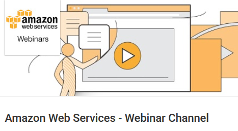
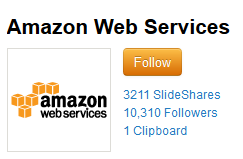
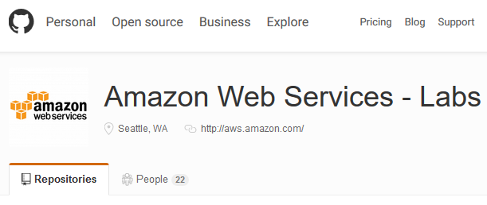

 

  

 
<!-- MarkdownTOC -->

- [Amazon Web Services](#amazon-web-services)
    - [Awesome AWS](#awesome-aws)
    - [AWS on Twitter](#aws-on-twitter)
    - [AWS Youtube channel and Podcasts](#aws-youtube-channel-and-podcasts)
    - [Closed groups for AWS certified professionals](#closed-groups-for-aws-certified-professionals)
    - [AWS re:Invent 2015](#aws-reinvent-2015)
    - [AWS Architecture Blog, Official Blog, AWS Labs, AWS Quick Start](#aws-architecture-blog-official-blog-aws-labs-aws-quick-start)
    - [AWS tips](#aws-tips)
    - [AWS New Features](#aws-new-features)
    - [AWS Schema Conversion Tool](#aws-schema-conversion-tool)
    - [AWS RDS](#aws-rds)
    - [AWS Database Migration Service](#aws-database-migration-service)
    - [AWS Redshift](#aws-redshift)
    - [AWS DevOps. AWS CodePipeline](#aws-devops-aws-codepipeline)
    - [AWS Latency](#aws-latency)
    - [AWS EC2 Container Registry \(Docker\)](#aws-ec2-container-registry-docker)
    - [AWS CLI](#aws-cli)
    - [AWS VPC](#aws-vpc)
    - [AWS Developer Blog](#aws-developer-blog)
    - [AWS Lambda](#aws-lambda)
    - [AWS Cloud Formation](#aws-cloud-formation)
    - [AWS Security](#aws-security)
    - [AWS WAF Web Application Firewall](#aws-waf-web-application-firewall)
    - [AWS S3](#aws-s3)
    - [AWS Backup and Recovery](#aws-backup-and-recovery)
    - [AWS Config Rules](#aws-config-rules)
    - [AWS BigData](#aws-bigdata)
    - [AWS IoT](#aws-iot)
    - [AWS Partner Network \(APN\)](#aws-partner-network-apn)
    - [AWS Startup Collection. For startups building on AWS](#aws-startup-collection-for-startups-building-on-aws)

<!-- /MarkdownTOC -->

# Amazon Web Services
- [AWS Forums 🌟🌟🌟](https://forums.aws.amazon.com)
- [AWS Knowledge Center](https://aws.amazon.com/en/premiumsupport/knowledge-center/)
- [AWS Support](https://aws.amazon.com/en/premiumsupport/)
- [github.com/awslabs 🌟](https://github.com/awslabs)
- [slideshare.net/AmazonWebServices 🌟🌟🌟](http://www.slideshare.net/AmazonWebServices)
- [AWS 10-Minute Tutorials 🌟🌟](https://aws.amazon.com/getting-started/tutorials/)

## Awesome AWS
- [Awesome AWS](https://github.com/donnemartin/awesome-aws)

## AWS on Twitter
- [twitter.com/awscloud](https://twitter.com/awscloud)
- [twitter.com/AWSreInvent](https://twitter.com/AWSreInvent)
- [twitter.com/jeffbarr](https://twitter.com/jeffbarr)
- [twitter.com/AWSstartups](https://twitter.com/AWSstartups)
- [twitter.com/AWS_Partners](https://twitter.com/AWS_Partners)

## AWS Youtube channel and Podcasts
- [Amazon Web Services Youtube](https://www.youtube.com/user/AmazonWebServices)
- [AWS Podcasts](https://aws.amazon.com/podcasts/aws-podcast/)
- [Stitcher AWS Podcasts](http://www.stitcher.com/podcast/amazon-web-services/aws-podcast)

## Closed groups for AWS certified professionals
- [Linkedin](https://www.linkedin.com/grp/home?gid=6814264)
- [awscerts.slack.com](https://awscerts.slack.com)

<iframe src="//www.slideshare.net/slideshow/embed_code/key/J5saN0sbo4cgTE" width="595" height="485" frameborder="0" marginwidth="0" marginheight="0" scrolling="no" style="border:1px solid #CCC; border-width:1px; margin-bottom:5px; max-width: 100%;" allowfullscreen class="video"> </iframe> 
 <strong> <a href="//www.slideshare.net/Examure4/aws-certified-solutions-architect-exam-questions-answers" title="AWS CERTIFIED SOLUTIONS ARCHITECT Exam Questions Answers" target="_blank">AWS CERTIFIED SOLUTIONS ARCHITECT Exam Questions Answers</a> </strong> from <strong><a href="//www.slideshare.net/Examure4" target="_blank">Examure4</a></strong> 

 

## AWS re:Invent 2015
- [Festín de novedades en re:Invent 2015](http://www.siliconweek.es/data-storage/business-intelligence/festin-de-novedades-en-reinvent-2015-89129)
- [What's New from Amazon Web Services](https://aws.amazon.com/es/new/)
- [AWS Well Architected Framework](https://d0.awsstatic.com/whitepapers/architecture/AWS_Well-Architected_Framework.pdf)
- [AWS re:Invent 2015 Keynote | Werner Vogels](https://www.youtube.com/watch?v=y-0Wf2Zyi5Q)
	- [AWS re:Invent 2015 Keynote | Andy Jassy](https://www.youtube.com/watch?v=D5-ifl7KJ00)
- [AWS re:Invent: Five takeaways on Amazon's new cloud services](http://www.zdnet.com/article/aws-reinvent-five-takeaways-on-new-services/)
- [Amazon Web Services gets serious about big data analytics with bevy of new services](http://www.zdnet.com/article/amazon-web-services-big-data-analytics-enterprise-datacenters/)
- [Amazon QuickSight: Fast, easy to use, in-memory, Cloud BI service for everyone in an organization (not only technical people). It is 1/10 the cost of traditional BI tools](https://aws.amazon.com/es/quicksight/)
- [Revealed at AWS re:Invent: Amazon Kinesis Firehose - easily load streaming data into Amazon S3 & Amazon RedShift](http://oak.ctx.ly/r/3tfr7)
- [What is Streaming Data?](https://aws.amazon.com/es/streaming-data/)
- [Amazon RDS Update – MariaDB is Now Available](https://aws.amazon.com/blogs/aws/amazon-rds-update-mariadb-is-now-available)
- [AWS Database Migration Service with AWS Schema Conversion Tool](http://aws.amazon.com/es/dms/)
- [AWS Import/Export Snowball – Transfer 1 Petabyte Per Week Using Amazon-Owned Storage Appliances](https://aws.amazon.com/blogs/aws/aws-importexport-snowball-transfer-1-petabyte-per-week-using-amazon-owned-storage-appliances/)
- [AWS Web Application Firewall](https://aws.amazon.com/blogs/aws/category/aws-web-application-firewall/)
- [AWS Config Rules – Dynamic Compliance Checking for Cloud Resources](https://aws.amazon.com/blogs/aws/aws-config-rules-dynamic-compliance-checking-for-cloud-resources/)
- [Amazon Inspector – Automated Security Assessment Service](https://aws.amazon.com/blogs/aws/amazon-inspector-automated-security-assessment-service)
- [Coming Soon – EC2 Dedicated Hosts](https://aws.amazon.com/blogs/aws/coming-soon-ec2-dedicated-hosts)
- [AWS Device Farm Pruebe su aplicación en dispositivos reales en la nube de AWS. Mejore la calidad de sus aplicaciones iOS, Android y Fire OS al probarlas en smartphones y tablets reales en la nube de AWS](http://aws.amazon.com/es/device-farm)
- [EC2 Instance Update – X1 (SAP HANA) & T2.Nano (Websites)](https://aws.amazon.com/blogs/aws/ec2-instance-update-x1-sap-hana-t2-nano-websites)
- [EC2 Container Service Update – Container Registry, ECS CLI, AZ-Aware Scheduling, and More](https://aws.amazon.com/blogs/aws/ec2-container-service-update-container-registry-ecs-cli-az-aware-scheduling-and-more)
- [CloudWatch Dashboards – Create & Use Customized Metrics Views](https://aws.amazon.com/blogs/aws/cloudwatch-dashboards-create-use-customized-metrics-views)
- [AWS Lambda Update – Python, VPC, Increased Function Duration, Scheduling, and More](https://aws.amazon.com/blogs/aws/aws-lambda-update-python-vpc-increased-function-duration-scheduling-and-more)
- [Amazon Launches AWS Mobile Hub To Help Mobile Developers Build Back-End Processes](http://techcrunch.com/2015/10/08/amazon-launches-aws-mobile-hub-to-help-mobile-developers-build-back-end-processes/)
- [AWS IoT – Cloud Services for Connected Devices](https://aws.amazon.com/blogs/aws/aws-iot-cloud-services-for-connected-devices)
- [AWS Mobile Hub – Build, Test, and Monitor Mobile Applications](https://aws.amazon.com/blogs/aws/aws-mobile-hub-build-test-and-monitor-mobile-applications)

## AWS Architecture Blog, Official Blog, AWS Labs, AWS Quick Start
- [AWS Architecture Blog](https://www.awsarchitectureblog.com)
- [AWS Official Blog](http://blogs.aws.amazon.com/)
- [AWS Labs GitHub](https://github.com/awslabs)
- [AWS Quick Start Reference Deployments](http://aws.amazon.com/es/quickstart/)
	- [AWS Quick Start - GitHub](https://github.com/awslabs/aws-quickstart)
- [InfoWorld Review – Amazon Aurora Rocks MySQL](https://aws.amazon.com/blogs/aws/infoworld-review-amazon-aurora-rocks-mysql/)
- [AWS Cost Explorer Update – Access to EC2 Usage Data](https://aws.amazon.com/blogs/aws/aws-cost-explorer-update-access-to-ec2-usage-data/)

## AWS tips
- [AWS Tips I Wish I'd Known Before I Started (Feb 2014) 🌟🌟🌟](https://wblinks.com/notes/aws-tips-i-wish-id-known-before-i-started/) A collection of random tips for Amazon Web Services (AWS) that I wish I'd been told a few years ago, based on what I've learned by building and deploying various applications on AWS.
- [Amazon AWS Tips and Gotchas – Part 1 (Feb 2016)](http://www.tekhead.org/blog/2016/02/amazon-aws-tips-and-gotchas-part-1/)
- [DZone: 5 Tips for Better AWS Performance 🌟🌟](https://dzone.com/articles/5-tips-for-better-aws-performance) The Ngnix team has a nice list of tips for better performance when using the AWS services. Some of them are related to Ngnix, but others are completely usable for anyone.
- [How do I get started with AWS cloud computing? 🌟🌟🌟](https://aws.amazon.com/premiumsupport/knowledge-center/get-started-aws/)

<iframe src="//www.slideshare.net/slideshow/embed_code/key/nvFyKjg81DaHtz" width="595" height="485" frameborder="0" marginwidth="0" marginheight="0" scrolling="no" style="border:1px solid #CCC; border-width:1px; margin-bottom:5px; max-width: 100%;" allowfullscreen> </iframe> 
 <strong> <a href="//www.slideshare.net/AmazonWebServices/bootcamp-getting-started-on-aws" title="Bootcamp: Getting Started on AWS" target="_blank">Bootcamp: Getting Started on AWS</a> </strong> from <strong><a href="//www.slideshare.net/AmazonWebServices" target="_blank">Amazon Web Services</a></strong> 

 
 

## AWS New Features
- [aws.amazon.com/releasenotes](https://aws.amazon.com/releasenotes)
- [Amazon EFS: Amazon Elastic File System – Shared File Storage for Amazon EC2](https://aws.amazon.com/blogs/aws/amazon-elastic-file-system-shared-file-storage-for-amazon-ec2/)
- [New – Encrypted EBS Boot Volumes](https://aws.amazon.com/blogs/aws/new-encrypted-ebs-boot-volumes)
	- [Amazon EBS Encryption](http://docs.aws.amazon.com/AWSEC2/latest/UserGuide/EBSEncryption.html)
- [Now Add or Modify Request Headers Forwarded From Amazon CloudFront to Origin](https://aws.amazon.com/about-aws/whats-new/2015/12/now-add-or-modify-request-headers-forwarded-from-amazon-cloudfront-to-origin/)
- [AWS CloudFormation Adds Support for AWS WAF and AWS Directory Service for Microsoft Active Directory](https://aws.amazon.com/es/about-aws/whats-new/2015/12/aws-cloudformation-adds-support-for-aws-waf-and-aws-directory-service-for-microsoft-active-directory/)
- [Amazon WorkMail – Now Generally Available](https://aws.amazon.com/blogs/aws/amazon-workmail-now-generally-available/)
- [London Calling! An AWS Region is coming to the UK!](http://www.allthingsdistributed.com/2015/11/aws-announces-uk-region.html)
- [New – Scheduled Reserved Instances](https://aws.amazon.com/blogs/aws/new-scheduled-reserved-instances/)

## AWS Schema Conversion Tool
- [cloudacademy.com: Migrating Data to AWS Using the AWS Schema Conversion Tool: A Preview](http://cloudacademy.com/blog/migrating-data-to-aws/)
- [AWS Schema Conversion Tool now supports PostgreSQL as conversion target](http://aws.amazon.com/about-aws/whats-new/2016/01/aws-schema-conversion-tool-postgresql-support/)

## AWS RDS
- [Tutorial: Restoring a DB Instance from a DB Snapshot](http://docs.aws.amazon.com/AmazonRDS/latest/UserGuide/CHAP_Tutorials.RestoringFromSnapshot.html)
- [Partitioning MySQL on RDS: "How We Partitioned Airbnb’s Main Database in Two Weeks" 🌟](https://medium.com/airbnb-engineering/how-we-partitioned-airbnb-s-main-database-in-two-weeks-55f7e006ff21)
- [Amazon RDS for SQL Server – Support for Windows Authentication](https://aws.amazon.com/blogs/aws/amazon-rds-for-sql-server-support-for-windows-authentication/)
- [Why Support of PostgreSQL 9.5 by Amazon RDS is Such Great News](http://blog.rubyroidlabs.com/2016/04/postgresql-9-5/)
- [AWS Tutorials: Create and Connect to a MySQL Database with Amazon RDS 🌟🌟](https://aws.amazon.com/getting-started/tutorials/create-mysql-db/)

<blockquote class="twitter-tweet tw-align-center" data-lang="es">
WHOA: <a href="https://twitter.com/awscloud">@awscloud</a> RDS <a href="https://twitter.com/hashtag/SQLServer?src=hash">#SQLServer</a> now supports AD accounts (Microsoft&#39;s Azure doesn&#39;t even have this yet :D) <a href="https://t.co/HMr2LdtQqZ">https://t.co/HMr2LdtQqZ</a> <a href="https://twitter.com/hashtag/ITNerdery?src=hash">#ITNerdery</a>
&mdash; Ray Terrill (@Rayterrill) <a href="https://twitter.com/Rayterrill/status/713487240228442113">25 de marzo de 2016</a></blockquote>

<iframe width="560" height="315" src="https://www.youtube.com/embed/W5qfS_Fli2Y?rel=0" frameborder="0" allowfullscreen class="video"></iframe>

 

## AWS Database Migration Service
- [AWS Database Migration Service 🌟](https://aws.amazon.com/es/blogs/aws/aws-database-migration-service/)

<iframe width="560" height="315" src="https://www.youtube.com/embed/ouia1Sc5QGo?rel=0" frameborder="0" allowfullscreen class="video"></iframe>

 

<iframe width="560" height="315" src="https://www.youtube.com/embed/shFn8a2K9K0?rel=0" frameborder="0" allowfullscreen class="video"></iframe>

 

<iframe width="560" height="315" src="https://www.youtube.com/embed/KJ5_nnBZtJE?rel=0" frameborder="0" allowfullscreen class="video"></iframe>

 

## AWS Redshift

<iframe width="560" height="315" src="https://www.youtube.com/embed/AUvn49gey8Y?rel=0" frameborder="0" allowfullscreen class="video"></iframe>

 

<iframe width="560" height="315" src="https://www.youtube.com/embed/UhQjSzdlO_g?rel=0" frameborder="0" allowfullscreen class="video"></iframe>

 

## AWS DevOps. AWS CodePipeline
- [AWS DevOps Blog](https://blogs.aws.amazon.com/application-management/)
- [Setting Up the Jenkins Plugin for AWS CodeDeploy](https://blogs.aws.amazon.com/application-management/post/TxMJROUIFQZ4HS/Setting-Up-the-Jenkins-Plugin-for-AWS-CodeDeploy)
- [Continuous Delivery for a PHP Application Using AWS CodePipeline, AWS Elastic Beanstalk, and Solano Labs](https://blogs.aws.amazon.com/application-management/post/TxYSRRBH57NP2P/Continuous-Delivery-for-a-PHP-Application-Using-AWS-CodePipeline-AWS-Elastic-Bea)
- [Building Continuous Deployment on AWS with AWS CodePipeline, Jenkins and AWS Elastic Beanstalk](https://blogs.aws.amazon.com/application-management/post/Tx34AXRMYLXG5OT/Building-Continuous-Deployment-on-AWS-with-AWS-CodePipeline-Jenkins-and-AWS-Elas)
- [AWS CodeDeploy: Deploying from a Development Account to a Production Account](http://blogs.aws.amazon.com/application-management/post/Tx3PE3JTSVJSFI7/AWS-CodeDeploy-Deploying-from-a-Development-Account-to-a-Production-Account)
- [blazemeter.com: Three Ways DevOps Benefit from AWS CodePipeline](https://blazemeter.com/blog/three-ways-devops-benefit-aws-codepipeline)
- [AWS Partner Network - CodePipeline Integrations](https://aws.amazon.com/es/codepipeline/product-integrations/)

<iframe src="//www.slideshare.net/slideshow/embed_code/key/iHI2Q1aoZheQ5T" width="595" height="485" frameborder="0" marginwidth="0" marginheight="0" scrolling="no" style="border:1px solid #CCC; border-width:1px; margin-bottom:5px; max-width: 100%;" allowfullscreen class="video"> </iframe> 
 <strong> <a href="//www.slideshare.net/AmazonWebServices/devops-on-aws-61713312" title="DevOps on AWS" target="_blank">DevOps on AWS</a> </strong> from <strong><a href="//www.slideshare.net/AmazonWebServices" target="_blank">Amazon Web Services</a></strong> 

 

## AWS Latency
- [Find the fastest region from your location](http://aws-latency.altaircp.com/) Check AWS response time from you browser. Sharing my mini-project, it measures response time from AWS services from different regions base on your location. let me know what you think.
- [Linkedin Discussion](https://www.linkedin.com/groups/49531/49531-6092152919937794052)
>1. Don't do just a single check, the first check will be a lot slower as DNS lookups will need to be done, etc.
>2. I'd recommend doing at least 3 checks getting an average.
- Run 6 checks (with a random 3-10 second delay between each one), the first can be ignored, the highest one is also ignored (as a likely outlier), then for the next 4 show the minimum, maximum and average (mean).
- [medium.com: Optimizing Latency and Bandwidth for AWS Traffic](https://medium.com/aws-activate-startup-blog/optimizing-latency-and-bandwidth-for-aws-traffic-cdfd18d0d0f7)

<iframe src="//www.slideshare.net/slideshow/embed_code/key/IDuFGnYkBiVIFI" width="595" height="485" frameborder="0" marginwidth="0" marginheight="0" scrolling="no" style="border:1px solid #CCC; border-width:1px; margin-bottom:5px; max-width: 100%;" allowfullscreen class="video"> </iframe> 
 <strong> <a href="//www.slideshare.net/AmazonWebServices/introduction-to-amazon-web-services-7708257" title="Introduction to Amazon Web Services" target="_blank">Introduction to Amazon Web Services</a> </strong> from <strong><a href="//www.slideshare.net/AmazonWebServices" target="_blank">Amazon Web Services</a></strong> 

 

<iframe src="//www.slideshare.net/slideshow/embed_code/key/edbNRKNbeYHgtJ" width="595" height="485" frameborder="0" marginwidth="0" marginheight="0" scrolling="no" style="border:1px solid #CCC; border-width:1px; margin-bottom:5px; max-width: 100%;" allowfullscreen class="video"> </iframe> 
 <strong> <a href="//www.slideshare.net/mrjain/installing-wordpress-on-aws" title="Installing WordPress on AWS" target="_blank">Installing WordPress on AWS</a> </strong> from <strong><a target="_blank" href="//www.slideshare.net/mrjain">Manish Jain</a></strong> 

 

<iframe width="420" height="315" src="https://www.youtube.com/embed/CaJCmoGIW24?rel=0" frameborder="0" allowfullscreen class="video"></iframe>

 

<iframe width="560" height="315" src="https://www.youtube.com/embed/DERzYnthq1s?rel=0" frameborder="0" allowfullscreen class="video"></iframe>

 

<iframe src="//www.slideshare.net/slideshow/embed_code/key/N8zvYafuumHdhc" width="595" height="485" frameborder="0" marginwidth="0" marginheight="0" scrolling="no" style="border:1px solid #CCC; border-width:1px; margin-bottom:5px; max-width: 100%;" allowfullscreen class="video"> </iframe> 
 <strong> <a href="//www.slideshare.net/AmazonWebServices/aws-101-cloud-computing-seminar-2012" title="AWS 101: Cloud Computing Seminar (2012)" target="_blank">AWS 101: Cloud Computing Seminar (2012)</a> </strong> from <strong><a href="//www.slideshare.net/AmazonWebServices" target="_blank">Amazon Web Services</a></strong> 

 

<iframe src="//www.slideshare.net/slideshow/embed_code/key/qC6QURqVRBzluo" width="595" height="485" frameborder="0" marginwidth="0" marginheight="0" scrolling="no" style="border:1px solid #CCC; border-width:1px; margin-bottom:5px; max-width: 100%;" allowfullscreen class="video"> </iframe> 
 <strong> <a href="//www.slideshare.net/AmazonWebServices/learning-series-getting-started-no-notes" title="AWS Webcast - Getting Started with Amazon Web Services" target="_blank">AWS Webcast - Getting Started with Amazon Web Services</a> </strong> from <strong><a href="//www.slideshare.net/AmazonWebServices" target="_blank">Amazon Web Services</a></strong> 

 

<a href="https://www.manning.com/books/amazon-web-services-in-action">amazon web services in action</a>

<iframe width="1280" height="720" src="https://www.youtube-nocookie.com/embed/p9l7YD-N9FI?rel=0" frameborder="0" allowfullscreen class="video"></iframe>

 

<iframe width="560" height="315" src="https://www.youtube.com/embed/6954CMI821c?rel=0" frameborder="0" allowfullscreen class="video"></iframe>

 

<iframe width="560" height="315" src="https://www.youtube.com/embed/QJhzyaijGRU?rel=0" frameborder="0" allowfullscreen class="video"></iframe>

 

<blockquote class="twitter-tweet tw-align-center" data-lang="es">
Curious how <a href="https://twitter.com/netflix">@Netflix</a> can deliver billions of hours of content? Hear its <a href="https://twitter.com/hashtag/BigData?src=hash">#BigData</a> story: <a href="https://t.co/iOzM5cYC0v">https://t.co/iOzM5cYC0v</a> <a href="https://t.co/gWXLWGVPxo">pic.twitter.com/gWXLWGVPxo</a>
&mdash; Amazon Web Services (@awscloud) <a href="https://twitter.com/awscloud/status/698586221472120833">febrero 13, 2016</a></blockquote>

<blockquote class="twitter-tweet tw-align-center" data-lang="es">
Now configure Auto Scaling to operate on a schedule using the AWS management console. <a href="https://t.co/PbIxj5kBf0">https://t.co/PbIxj5kBf0</a> <a href="https://t.co/56ChzqdB2E">pic.twitter.com/56ChzqdB2E</a>
&mdash; Amazon Web Services (@awscloud) <a href="https://twitter.com/awscloud/status/692822523457589248">enero 28, 2016</a></blockquote>

<blockquote class="twitter-tweet tw-align-center" data-lang="es">
Route 53&#39;s health checks now support SNI for checking websites over HTTPS! <a href="https://t.co/ktdeKCjNjc">https://t.co/ktdeKCjNjc</a> <a href="https://t.co/8INseaC48e">pic.twitter.com/8INseaC48e</a>
&mdash; Amazon Web Services (@awscloud) <a href="https://twitter.com/awscloud/status/702208599016083457">febrero 23, 2016</a></blockquote>

## AWS EC2 Container Registry (Docker)
- [A Better Dev/Test Experience: Docker and AWS](https://medium.com/aws-activate-startup-blog/a-better-dev-test-experience-docker-and-aws-291da5ab1238)
- [Amazon EC2 Container Registry Documentation](http://aws.amazon.com/es/documentation/ecr/)
- [Get started with Amazon EC2 Container Registry (Amazon ECR)](http://docs.aws.amazon.com/AmazonECR/latest/userguide/ECR_GetStarted.html)
- [Using Docker Machine with AWS](http://blog.scottlowe.org/2016/03/22/using-docker-machine-with-aws/)

## AWS CLI
- [Amazon CLI Documentation](https://aws.amazon.com/cli)
- [AWS CLI Command Reference](http://docs.aws.amazon.com/cli/latest/index.html)
- [New usage examples have been added to the CLI for CodePipeline API Reference](http://docs.aws.amazon.com/cli/latest/reference/codepipeline/index.html)
- [ec2-ssh-yplan: A pair of command line utilities for finding and SSH-ing into your Amazon EC2 instances by tag (such as ‘Name’)](https://pypi.python.org/pypi/ec2-ssh-yplan/)

## AWS VPC
- [linuxjournal.com: AWS EC2 VPC CLI](http://www.linuxjournal.com/content/aws-ec2-vpc-cli)

## AWS Developer Blog
- [The AWS Developer Blog now includes Python & GoLang](https://aws.amazon.com/blogs/developer/)
- [Create an API Using the Swagger Specification and the API Gateway Extensions](http://docs.aws.amazon.com/apigateway/latest/developerguide/create-api-using-import-export-api.html)

## AWS Lambda
- [you can use Python with AWS Lambda](http://docs.aws.amazon.com/lambda/latest/dg/lambda-python-how-to-create-deployment-package.html)
- [Build a Python Microservice with Amazon Web Services Lambda & API Gateway](http://www.giantflyingsaucer.com/blog/?p=5730)
- [AWS Lambda, Echo, and the Future of Cloud Automation](http://www.logicworks.net/blog/2016/01/aws-lambda-echo-cloud-automation/) A fantastic blog article by Logicworks on Lambda, the coming move to serverless architecture and even the possibility of using Amazon's Echo to launch entire AWS environments by using just your voice
- [Serverless: The Future of Software Architecture?](https://read.acloud.guru/serverless-the-future-of-software-architecture-d4473ffed864#.uk7setw47)
- [npmjs.com: Lambda load test](https://www.npmjs.com/package/lambda-load-test)
- [AWS Lambda Limits](http://docs.aws.amazon.com/lambda/latest/dg/limits.html)
- [blog.powerupcloud.com: AWS inventory details in CSV using lambda 🌟](http://blog.powerupcloud.com/2016/02/07/aws-inventory-details-in-csv-using-lambda)

<blockquote class="twitter-tweet tw-align-center" data-lang="es">
<a href="https://twitter.com/hashtag/awslambda?src=hash">#awslambda</a> ups code storage limit from 1.5GB to 75GB for everyone. Create all the Lambda functions you need! <a href="https://t.co/NMduXKMPUn">https://t.co/NMduXKMPUn</a>
&mdash; Tim Wagner (@timallenwagner) <a href="https://twitter.com/timallenwagner/status/701963091639029760">febrero 23, 2016</a></blockquote>

<blockquote class="twitter-tweet tw-align-center" data-lang="es">
Using <a href="https://twitter.com/hashtag/AWS?src=hash">#AWS</a> Lambda for Cheap S3 Content Processing - <a href="https://t.co/EZyizCOhIG">https://t.co/EZyizCOhIG</a> &quot;intelligently post-process objects..&quot; <a href="https://t.co/JETthXiYyH">pic.twitter.com/JETthXiYyH</a>
&mdash; Jeff Barr (@jeffbarr) <a href="https://twitter.com/jeffbarr/status/702170697674567680">febrero 23, 2016</a></blockquote>

## AWS Cloud Formation
- [AWS Cloud Formation Release History](http://docs.aws.amazon.com/AWSCloudFormation/latest/UserGuide/ReleaseHistory.html)
- [All the AWS Resource Types Reference for AWS CloudFormation ](http://docs.aws.amazon.com/AWSCloudFormation/latest/UserGuide/aws-template-resource-type-ref.html)

## AWS Security
- [AWS Security Blog](http://blogs.aws.amazon.com/security)
- [Tutorial: Configure Apache Web Server on Amazon Linux to use SSL/TLS](http://docs.aws.amazon.com/AWSEC2/latest/UserGuide/SSL-on-an-instance.html)
- [The Most Popular AWS Security Blog Posts in 2015](http://blogs.aws.amazon.com/security/post/Tx4QX7W51NDSLO/The-Most-Popular-AWS-Security-Blog-Posts-in-2015)
- [dzone: Private Subnets Are Broken on AWS](https://dzone.com/articles/private-subnets-are-broken-on-aws)
- [AWS Identity and Access Management (IAM) best practices in 2016](http://blogs.aws.amazon.com/security/post/Tx2OB7YGHMB7WCM/Adhere-to-IAM-Best-Practices-in-2016)
- [How to Record and Govern Your IAM Resource Configurations Using AWS Config](http://blogs.aws.amazon.com/security/post/Tx14ADBJOCAT9NS/How-to-Record-and-Govern-Your-IAM-Resource-Configurations-Using-AWS-Config)
- [Amazon’s customer service backdoor](https://medium.com/@espringe/amazon-s-customer-service-backdoor-be375b3428c4#.qyixu5mu3)
- [Announcing Industry Best Practices for Securing AWS Resources 🌟🌟](http://blogs.aws.amazon.com/security/post/Tx3PTTZB14FWPBA/Announcing-Industry-Best-Practices-for-Securing-AWS-Resources)

<iframe width="560" height="315" src="https://www.youtube.com/embed/rvcHnJPBQMA?rel=0" frameborder="0" allowfullscreen class="video"></iframe>

 

<iframe src="//www.slideshare.net/slideshow/embed_code/key/i4GhOE5F4zX8Vm" width="595" height="485" frameborder="0" marginwidth="0" marginheight="0" scrolling="no" style="border:1px solid #CCC; border-width:1px; margin-bottom:5px; max-width: 100%;" allowfullscreen class="video"> </iframe> 
 <strong> <a href="//www.slideshare.net/AmazonWebServices/iam-recommended-practices" title="IAM Recommended Practices" target="_blank">IAM Recommended Practices</a> </strong> from <strong><a href="//www.slideshare.net/AmazonWebServices" target="_blank">Amazon Web Services</a></strong> 

 

<blockquote class="twitter-tweet tw-align-center" data-lang="es">
Create on the fly disposable VPN using AWS: <a href="https://t.co/9nQ5VXCv2Q">https://t.co/9nQ5VXCv2Q</a> - that&#39;s really cool 😎 <a href="https://twitter.com/hashtag/privacy?src=hash">#privacy</a> <a href="https://t.co/Fblg4J4CDp">pic.twitter.com/Fblg4J4CDp</a>
&mdash; x0rz (@x0rz) <a href="https://twitter.com/x0rz/status/723132469696978944">21 de abril de 2016</a></blockquote>

## AWS WAF Web Application Firewall
- [AWS WAF - Web Application Firewall](https://aws.amazon.com/waf/)
- [How to Automatically Update Your Security Groups for Amazon CloudFront and AWS WAF by Using AWS Lambda (boto3 python)](http://blogs.aws.amazon.com/security/post/Tx1LPI2H6Q6S5KC/How-to-Automatically-Update-Your-Security-Groups-for-Amazon-CloudFront-and-AWS-W)
- [How to Use AWS WAF to Block IP Addresses That Generate Bad Requests 🌟](http://blogs.aws.amazon.com/security/post/Tx223ZW25YRPRKV/How-to-Use-AWS-WAF-to-Block-IP-Addresses-That-Generate-Bad-Requests)
- [How to Reduce Security Threats and Operating Costs Using AWS WAF and Amazon CloudFront](http://blogs.aws.amazon.com/security/post/Tx1G747SE1R2ZWE/How-to-Reduce-Security-Threats-and-Operating-Costs-Using-AWS-WAF-and-Amazon-Clou)
- [AWS WAF sample rules](https://github.com/awslabs/aws-waf-sample)

<blockquote class="twitter-tweet tw-align-center" data-lang="es">
What is AWS WAF? <a href="https://t.co/fQnpzdjblE">https://t.co/fQnpzdjblE</a> <a href="https://twitter.com/hashtag/awscloud?src=hash">#awscloud</a> <a href="https://t.co/HrgwCaeTem">pic.twitter.com/HrgwCaeTem</a>
&mdash; Oz Akan ☁️ (@ozgurakan) <a href="https://twitter.com/ozgurakan/status/713002716872712192">24 de marzo de 2016</a></blockquote>

<iframe width="560" height="315" src="https://www.youtube.com/embed/xskM8XA2bqE?rel=0" frameborder="0" allowfullscreen class="video"></iframe>

 

## AWS S3

<iframe width="560" height="315" src="https://www.youtube.com/embed/55f-4CMxoro?rel=0" frameborder="0" allowfullscreen class="video"></iframe>

 

## AWS Backup and Recovery
- [Quantum Taps AWS for Cloud-Powered Disaster Recovery](http://www.infostor.com/backup-and_recovery/quantum-taps-aws-for-cloud-powered-disaster-recovery.html)
- [Linkedin discussion: Need help on Backup and restore methods of EC2 using s3 services](https://www.linkedin.com/groups/49531/49531-6093375473969090562)

<iframe width="560" height="315" src="https://www.youtube.com/embed/2G5HoFdd_D0?rel=0" frameborder="0" allowfullscreen class="video"></iframe>

 

## AWS Config Rules
- [AWS Config Rules now available in 4 new regions: US West (Oregon), EU (Ireland), EU (Frankfurt) and Asia Pacific (Tokyo)](https://aws.amazon.com/es/about-aws/whats-new/2016/04/aws-config-rules-now-available-in-4-new-regions-us-west-oregon-eu-ireland-eu-frankfurt-and-asia-pacific-tokyo/)

## AWS BigData 
- [blogs.aws.amazon.com/bigdata](http://blogs.aws.amazon.com/bigdata/)
- [Querying Amazon Kinesis Streams Directly with SQL and Spark Streaming](http://blogs.aws.amazon.com/bigdata/post/Tx3916WCIUPVA3T/Querying-Amazon-Kinesis-Streams-Directly-with-SQL-and-Spark-Streaming)
- [Analyze Your Data on Amazon DynamoDB with Apache Spark 🌟🌟](http://blogs.aws.amazon.com/bigdata/post/Tx1G4SQRV049UL0/Analyze-Your-Data-on-Amazon-DynamoDB-with-Apache-Spark)

<blockquote class="twitter-tweet tw-align-center" data-lang="es">
AWS <a href="https://twitter.com/hashtag/BigData?src=hash">#BigData</a> Blog month in review: <a href="https://t.co/dsC9KNe95a">https://t.co/dsC9KNe95a</a> <a href="https://t.co/QrJV88ruLs">pic.twitter.com/QrJV88ruLs</a>
&mdash; Amazon Web Services (@awscloud) <a href="https://twitter.com/awscloud/status/694702660344107008">febrero 3, 2016</a></blockquote>

<blockquote class="twitter-tweet tw-align-center" data-lang="es">
New on the AWS <a href="https://twitter.com/hashtag/BigData?src=hash">#BigData</a> blog: &quot;Big Data Analytics Options on AWS: Updated White Paper&quot; <a href="https://t.co/p7AUlClnEy">https://t.co/p7AUlClnEy</a> <a href="https://t.co/Lp7lg2ofOx">pic.twitter.com/Lp7lg2ofOx</a>
&mdash; Amazon Web Services (@awscloud) <a href="https://twitter.com/awscloud/status/698238715718668288">febrero 12, 2016</a></blockquote>

<iframe width="560" height="315" src="https://www.youtube.com/embed/FjleVmtkfWE?rel=0" frameborder="0" allowfullscreen class="video"></iframe>

 

<iframe width="560" height="315" src="https://www.youtube.com/embed/jL-WJlBtpIw?rel=0" frameborder="0" allowfullscreen class="video"></iframe>

 

## AWS IoT
- [aws.amazon.com/en/iot](https://aws.amazon.com/en/iot)
- [What Is AWS IoT?](http://docs.aws.amazon.com/iot/latest/developerguide/what-is-aws-iot.html)

<blockquote class="twitter-tweet tw-align-center" data-lang="es">
AWS <a href="https://twitter.com/hashtag/IoT?src=hash">#IoT</a> now supports MQTT over the WebSocket protocol. Learn more: <a href="https://t.co/b9u9BtbAgn">https://t.co/b9u9BtbAgn</a> <a href="https://t.co/srNA7UgsQX">pic.twitter.com/srNA7UgsQX</a>
&mdash; Amazon Web Services (@awscloud) <a href="https://twitter.com/awscloud/status/698581730744111104">febrero 13, 2016</a></blockquote>

<blockquote class="twitter-tweet tw-align-center" data-lang="es">
RE add <a href="https://twitter.com/hashtag/mqtt?src=hash">#mqtt</a> or <a href="https://twitter.com/hashtag/websocket?src=hash">#websocket</a> support to your <a href="https://twitter.com/hashtag/android?src=hash">#android</a> apps using <a href="https://twitter.com/hashtag/aws?src=hash">#aws</a> <a href="https://twitter.com/hashtag/iot?src=hash">#iot</a> <a href="https://t.co/fFQ3T4jaS1">https://t.co/fFQ3T4jaS1</a>
&mdash; Kyle Roche (@kylemroche) <a href="https://twitter.com/kylemroche/status/701992286268166144">febrero 23, 2016</a></blockquote>

<blockquote class="twitter-tweet tw-align-center" data-lang="es">
The Internet of Things has gone too far <a href="https://t.co/IPD3VmFdOU">https://t.co/IPD3VmFdOU</a> <a href="https://t.co/a1pF66qcgE">pic.twitter.com/a1pF66qcgE</a>
&mdash; CommitStrip (@CommitStrip) <a href="https://twitter.com/CommitStrip/status/702564712010141696">24 de febrero de 2016</a></blockquote>

## AWS Partner Network (APN)
- [AWS Partner Network](https://aws.amazon.com/partners/)
	- [APN Technology Partners](https://aws.amazon.com/partners/technology/)
	- [APN Consulting Partners](https://aws.amazon.com/partners/consulting/)
- [AWS Partner Network (APN) blog](https://aws.amazon.com/blogs/apn/)
	- [Active Directory Single Sign-On (SSO) on AWS with Bitium](https://aws.amazon.com/blogs/apn/active-directory-single-sign-on-sso-on-aws-with-bitium)

## AWS Startup Collection. For startups building on AWS
- [bitmovin: Improving Video Quality on the Web](https://medium.com/aws-activate-startup-blog/bitmovin-improving-video-quality-on-the-web-8670039c4334)
- [What Startups Should Know about Amazon VPC — Part 1](https://medium.com/aws-activate-startup-blog/what-startups-should-know-about-amazon-vpc-part-1-bebe94b7f228)
- [Scaling on AWS (Part 3): >500K Users](https://medium.com/aws-activate-startup-blog/scaling-on-aws-part-3-500k-users-3750b227b761)
- [medium.com: Building a Serverless Dynamic DNS System with AWS](https://medium.com/aws-activate-startup-blog/building-a-serverless-dynamic-dns-system-with-aws-a32256f0a1d8#.qq54pucbd)
- [medium.com: The Top 10 AWS Startup Blog Posts of 2015](https://medium.com/aws-activate-startup-blog/the-top-10-aws-startup-blog-posts-of-2015-d2975e3778bb)

<a href="https://www.tradingview.com/chart/?symbol=AMZN">tradingview.com/chart/?symbol=AMZN</a>

