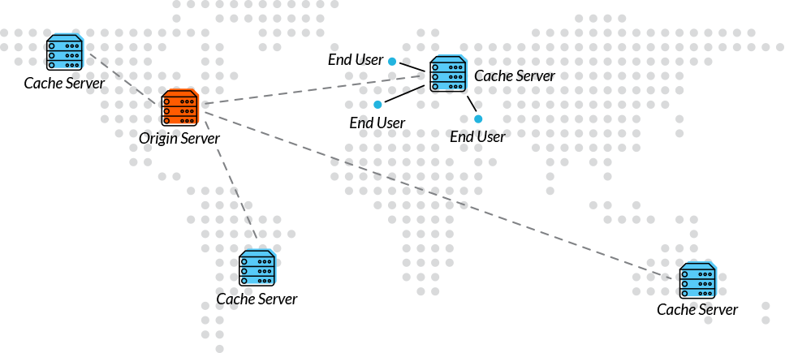
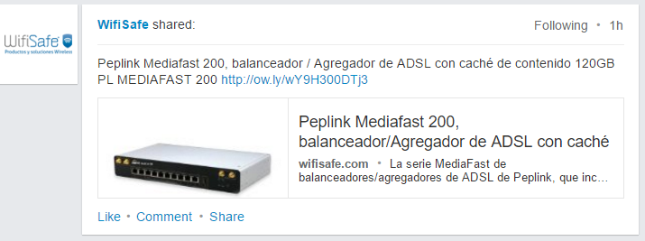

<!-- MarkdownTOC -->

- [Caching](#caching)
    - [CDN Content delivery network](#cdn-content-delivery-network)
    - [HAProxy](#haproxy)
    - [Varnish](#varnish)
    - [Memcached](#memcached)
    - [Redis](#redis)
    - [Nginx](#nginx)
        - [Nginx High-performance caching](#nginx-high-performance-caching)

<!-- /MarkdownTOC -->

# Caching
- [Wikipedia: Web cache](https://en.wikipedia.org/wiki/Web_cache)
- [Wikipedia: Dynamic site acceleration](https://en.wikipedia.org/wiki/Dynamic_site_acceleration)
- [Slideshare: Caching](http://www.slideshare.net/NasceniaIT/brown-bag-caching-rafi-faisal-48694442)

## CDN Content delivery network
- [CDN Content delivery network](cdn.md)

## HAProxy
- [HAProxy](http://www.haproxy.org)
- [slideshare: Haproxy web performance](http://www.slideshare.net/haproxytech/haproxy-web-performance-55536394)
- [slideshare: Load Balancing MySQL with HAProxy](http://www.slideshare.net/Severalnines/load-balancing-mysql-with-haproxy-webinar-replay-english-44071270)
- [slideshare: Haproxy best practice](http://www.slideshare.net/haproxytech/haproxy-best-practice)
- [slideshare: How To Set Up SQL Load Balancing with HAProxy](http://www.slideshare.net/Severalnines/severalnines-ha-proxyjul20143)
- [slideshare: Performance Tuning of HAProxy for Database Load Balancing](http://www.slideshare.net/Severalnines/haproxy-mysql-slides)

<iframe src="//www.slideshare.net/slideshow/embed_code/key/hkcICcrntApXsr" width="595" height="485" frameborder="0" marginwidth="0" marginheight="0" scrolling="no" style="border:1px solid #CCC; border-width:1px; margin-bottom:5px; max-width: 100%;" allowfullscreen class="video"> </iframe> 
 <strong> <a href="//www.slideshare.net/haproxytech/haproxy-best-practice" title="Haproxy best practice" target="_blank">Haproxy best practice</a> </strong> from <strong><a target="_blank" href="//www.slideshare.net/haproxytech">haproxytech</a></strong> 

 

## Varnish
- [Varnish Cache](https://www.varnish-cache.org/)
- [varnish-software.com](https://www.varnish-software.com) Varnish Software is the company behind Varnish Cache, the open source HTTP accelerator.
	- [The Varnish Book](http://info.varnish-software.com/the-varnish-book) Download the Varnish Book to learn how you can optimize your Varnish instance.
- [fedoramagazine.org: Varnish: Your site faster and more stable](https://fedoramagazine.org/varnish-site-faster-stable/)
- [Red Hat Developer Blog. Tag: Varnish](https://developerblog.redhat.com/tag/varnish/)
- [Red Hat Enterprise Linux Blog. Tag: Varnish](http://rhelblog.redhat.com/tag/varnish/)
- [varnish-cache.org: Installation on RedHat](https://www.varnish-cache.org/installation/redhat)
- [Hitch - scalable TLS proxy. Hitch is a libev-based high performance SSL/TLS proxy by Varnish Software](https://hitch-tls.org/)
- [slideshare: Varnish - Tips & Tricks - 4Developers 2015](http://www.slideshare.net/piotrpasich/varnish-47199139)

<iframe src="//www.slideshare.net/slideshow/embed_code/key/fQrbxcE741QjvX" width="595" height="485" frameborder="0" marginwidth="0" marginheight="0" scrolling="no" style="border:1px solid #CCC; border-width:1px; margin-bottom:5px; max-width: 100%;" allowfullscreen class="video"> </iframe> 
 <strong> <a href="//www.slideshare.net/kimlindholm/varnish-configuration-step-by-step" title="Varnish Configuration Step by Step" target="_blank">Varnish Configuration Step by Step</a> </strong> from <strong><a target="_blank" href="//www.slideshare.net/kimlindholm">Kim Stefan Lindholm</a></strong> 

 

<iframe src="//www.slideshare.net/slideshow/embed_code/key/JlHlus2tBHDZVi" width="595" height="485" frameborder="0" marginwidth="0" marginheight="0" scrolling="no" style="border:1px solid #CCC; border-width:1px; margin-bottom:5px; max-width: 100%;" allowfullscreen class="video"> </iframe> 
 <strong> <a href="//www.slideshare.net/ivanchepurnyi/advanced-varnishusage" title="Varnish Cache and its usage in the real world!" target="_blank">Varnish Cache and its usage in the real world!</a> </strong> from <strong><a target="_blank" href="//www.slideshare.net/ivanchepurnyi">Ivan Chepurnyi</a></strong> 

 

<iframe src="//www.slideshare.net/slideshow/embed_code/key/crhLrhAgnlZmLv" width="595" height="485" frameborder="0" marginwidth="0" marginheight="0" scrolling="no" style="border:1px solid #CCC; border-width:1px; margin-bottom:5px; max-width: 100%;" allowfullscreen class="video"> </iframe> 
 <strong> <a href="//www.slideshare.net/samanthaquinonestembies/superchargin-varnish" title="Supercharging Content Delivery with Varnish" target="_blank">Supercharging Content Delivery with Varnish</a> </strong> from <strong><a target="_blank" href="//www.slideshare.net/samanthaquinonestembies">Samantha Quiñones</a></strong> 

 

## Memcached
- [memcached.org](http://memcached.org)
- [Slideshare: Introduction to memcached](http://www.slideshare.net/oemebamo/introduction-to-memcached)
- [DZone - The Power of the Proxy: Request Routing Memcached](https://dzone.com/articles/the-power-of-the-proxy-request-routing-memcached)

<iframe src="//www.slideshare.net/slideshow/embed_code/key/rqpOlUNkU6NOvo" width="595" height="485" frameborder="0" marginwidth="0" marginheight="0" scrolling="no" style="border:1px solid #CCC; border-width:1px; margin-bottom:5px; max-width: 100%;" allowfullscreen class="video"> </iframe> 
 <strong> <a href="//www.slideshare.net/oemebamo/introduction-to-memcached" title="Introduction to memcached" target="_blank">Introduction to memcached</a> </strong> from <strong><a target="_blank" href="//www.slideshare.net/oemebamo">Jurriaan Persyn</a></strong> 

 

## Redis
- [redis.io](http://redis.io)
- [Slideshare: Introduction to Redis](http://www.slideshare.net/dvirsky/introduction-to-redis)

<iframe src="//www.slideshare.net/slideshow/embed_code/key/3nvYR34GEVLEei" width="595" height="485" frameborder="0" marginwidth="0" marginheight="0" scrolling="no" style="border:1px solid #CCC; border-width:1px; margin-bottom:5px; max-width: 100%;" allowfullscreen class="video"> </iframe> 
 <strong> <a href="//www.slideshare.net/dvirsky/introduction-to-redis" title="Introduction to Redis" target="_blank">Introduction to Redis</a> </strong> from <strong><a target="_blank" href="//www.slideshare.net/dvirsky">Dvir Volk</a></strong> 

 

<iframe src="//www.slideshare.net/slideshow/embed_code/key/42WDX39CPeO9e6" width="595" height="485" frameborder="0" marginwidth="0" marginheight="0" scrolling="no" style="border:1px solid #CCC; border-width:1px; margin-bottom:5px; max-width: 100%;" allowfullscreen class="video"> </iframe> 
 <strong> <a href="//www.slideshare.net/NasceniaIT/brown-bag-caching-rafi-faisal-48694442" title="Caching" target="_blank">Caching</a> </strong> from <strong><a target="_blank" href="//www.slideshare.net/NasceniaIT">Nascenia IT</a></strong> 

 

<iframe width="560" height="315" src="https://www.youtube.com/embed/bjXNWBaIWjM?rel=0" frameborder="0" allowfullscreen class="video"></iframe>

 
 

## Nginx
- [Nginx](nginx.md)

### Nginx High-performance caching
- [Nginxconf 2014. When Dynamic Becomes Static:The Next Step in Web Caching Techniques: Wim Godden](https://www.youtube.com/watch?v=OssIuHbgzJY)
- [dzone: The Benefits of Microcaching with NGINX](https://dzone.com/articles/the-benefits-of-microcaching-with-nginx)
- [dzone: Scaling Web Applications with NGINX – Part II: Caching and Monitoring](https://dzone.com/articles/scaling-web-applications-with-nginx-part-ii-cachin)
- [Nginx: a caching, thumbnailing, reverse proxying image server? 🌟](http://charlesleifer.com/blog/nginx-a-caching-thumbnailing-reverse-proxying-image-server-/)
- [highscalability.com: Building nginx and Tarantool based services 🌟](http://highscalability.com/blog/2016/2/17/building-nginx-and-tarantool-based-services.html)

<blockquote class="twitter-tweet tw-align-center" data-lang="es">
Nginx: a caching, thumbnailing, reverse proxying image server? <a href="https://twitter.com/hashtag/unix?src=hash">#unix</a> <a href="https://twitter.com/hashtag/linux?src=hash">#linux</a> <a href="https://twitter.com/hashtag/python?src=hash">#python</a> <a href="https://twitter.com/hashtag/sysadmin?src=hash">#sysadmin</a>  <a href="https://t.co/O9Es1SN3jV">https://t.co/O9Es1SN3jV</a>
&mdash; nixCraft (@nixcraft) <a href="https://twitter.com/nixcraft/status/700407777483591680">febrero 18, 2016</a></blockquote>

<iframe width="560" height="315" src="https://www.youtube.com/embed/OssIuHbgzJY?rel=0" frameborder="0" allowfullscreen class="video"></iframe>

 

<iframe src="//www.slideshare.net/slideshow/embed_code/key/wC5wngKnh2iydS" width="595" height="485" frameborder="0" marginwidth="0" marginheight="0" scrolling="no" style="border:1px solid #CCC; border-width:1px; margin-bottom:5px; max-width: 100%;" allowfullscreen class="video"> </iframe> 
 <strong> <a href="//www.slideshare.net/Nginx/nginx-highperformance-caching" title="NGINX High-performance Caching" target="_blank">NGINX High-performance Caching</a> </strong> from <strong><a href="//www.slideshare.net/Nginx" target="_blank">NGINX, Inc.</a></strong> 

 