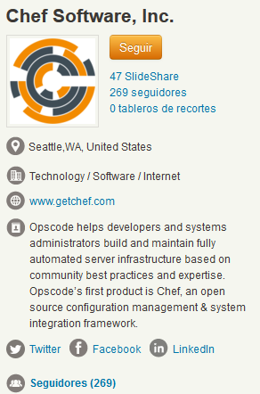

<!-- MarkdownTOC -->

- [Chef](#chef)
    - [Chef and SAP](#chef-and-sap)
    - [Chef and Azure](#chef-and-azure)
    - [Chef Slides](#chef-slides)
    - [Chef Videos](#chef-videos)

<!-- /MarkdownTOC -->

# Chef
- [CHEF](https://www.chef.io/chef/)
	- [docs.chef.io](https://docs.chef.io/)
	- [DevOps by Chef](https://www.chef.io/solutions/devops/)
- [twitter.com/chef](https://twitter.com/chef)
- [slideshare: Chef for DevOps - an Introduction. This slide deck Introduces Chef and its role in DevOps](http://www.slideshare.net/sanjeev-sharma/chef-for-dev-ops-an-introduction)
- [Chef Launches Partner Cookbook Program to Expand DevOps-Ready Technology Ecosystem](https://www.chef.io/blog/2016/02/23/chef-launches-partner-cookbook-program-to-expand-devops-ready-technology-ecosystem/)
	- [partner cookbooks: supermarket.chef.io](https://supermarket.chef.io)
	- [Chef Partner Engineering guide for writing quality cookbooks](https://github.com/chef-partners/cookbook-guide)
- [Chef Launches Habitat, New Open Source Project to Automate Applications](http://devops.com/2016/06/14/chef-launches-habitat-new-open-source-project-automate-applications/)

## Chef and SAP
- [SAP cookbooks with chef](http://sapcc.github.io/sap-cookbook-docs/)

<iframe src="//www.slideshare.net/slideshow/embed_code/key/oWZBNOhxE5SjmS" width="595" height="485" frameborder="0" marginwidth="0" marginheight="0" scrolling="no" style="border:1px solid #CCC; border-width:1px; margin-bottom:5px; max-width: 100%;" allowfullscreen class="video"> </iframe> 
 <strong> <a href="//www.slideshare.net/sanjeev-sharma/chef-for-dev-ops-an-introduction" title="Chef for DevOps - an Introduction" target="_blank">Chef for DevOps - an Introduction</a> </strong> from <strong><a target="_blank" href="//www.slideshare.net/sanjeev-sharma">Sanjeev Sharma</a></strong> 

 

## Chef and Azure
- [Chef for Microsoft Azure](https://www.chef.io/solutions/azure/)

<iframe src="//www.slideshare.net/slideshow/embed_code/key/s00RuF52yJqXwH" width="595" height="485" frameborder="0" marginwidth="0" marginheight="0" scrolling="no" style="border:1px solid #CCC; border-width:1px; margin-bottom:5px; max-width: 100%;" allowfullscreen class="video"> </iframe> 
 <strong> <a href="//www.slideshare.net/CIRCUIT2015/circuit-2015-aem-infrastructure-automation-with-chef-cookbooks" title="CIRCUIT 2015 - AEM Infrastructure Automation with Chef Cookbooks" target="_blank">CIRCUIT 2015 - AEM Infrastructure Automation with Chef Cookbooks</a> </strong> from <strong><a href="//www.slideshare.net/CIRCUIT2015" target="_blank">CIRCUIT</a></strong> 

 

## Chef Slides
- [Chef on slideshare](http://www.slideshare.net/opscode)

<iframe src="//www.slideshare.net/slideshow/embed_code/key/EM04KcoqijlYEk" width="595" height="485" frameborder="0" marginwidth="0" marginheight="0" scrolling="no" style="border:1px solid #CCC; border-width:1px; margin-bottom:5px; max-width: 100%;" allowfullscreen class="video"> </iframe> 
 <strong> <a href="//www.slideshare.net/opscode/week6-roles-environmentscommunity" title="Chef Fundamentals Training Series Module 6: Roles, Environments, Community Cookbooks, and Other Resources" target="_blank">Chef Fundamentals Training Series Module 6: Roles, Environments, Community Cookbooks, and Other Resources</a> </strong> from <strong><a href="//www.slideshare.net/opscode" target="_blank">Chef Software, Inc.</a></strong> 

 

<iframe src="//www.slideshare.net/slideshow/embed_code/key/3vsGBOv3OtDabb" width="595" height="485" frameborder="0" marginwidth="0" marginheight="0" scrolling="no" style="border:1px solid #CCC; border-width:1px; margin-bottom:5px; max-width: 100%;" allowfullscreen class="video"> </iframe> 
 <strong> <a href="//www.slideshare.net/Joncak/learning-chef" title="Learning chef" target="_blank">Learning chef</a> </strong> from <strong><a href="//www.slideshare.net/Joncak" target="_blank">Jonathan Carrillo</a></strong> 

 

<iframe src="//www.slideshare.net/slideshow/embed_code/key/sDRYeujbEHoYtI" width="595" height="485" frameborder="0" marginwidth="0" marginheight="0" scrolling="no" style="border:1px solid #CCC; border-width:1px; margin-bottom:5px; max-width: 100%;" allowfullscreen class="video"> </iframe> 
 <strong> <a href="//www.slideshare.net/sarahhynescheney/infrastructure-as-code-with-chef" title="Infrastructure as Code with Chef" target="_blank">Infrastructure as Code with Chef</a> </strong> from <strong><a href="//www.slideshare.net/sarahhynescheney" target="_blank">sarahhynescheney</a></strong> 

 

## Chef Videos
- [Chef youtube channel](https://www.youtube.com/user/getchef)

<iframe width="560" height="315" src="https://www.youtube.com/embed/jlwGcgFfcnU?rel=0" frameborder="0" allowfullscreen class="video"></iframe>

 

<iframe width="420" height="315" src="https://www.youtube.com/embed/iRtb6q6RGHI?rel=0" frameborder="0" allowfullscreen class="video"></iframe>

 

<iframe width="560" height="315" src="https://www.youtube.com/embed/S5lHUpzoCYo?rel=0" frameborder="0" allowfullscreen class="video"></iframe>

 

