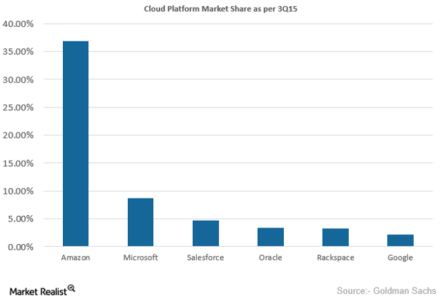
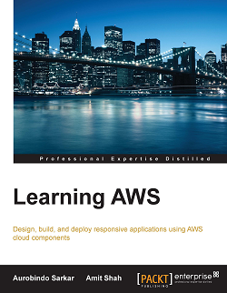
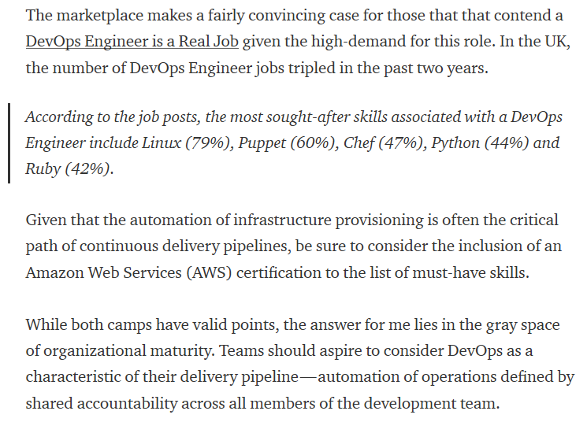
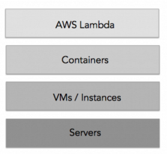
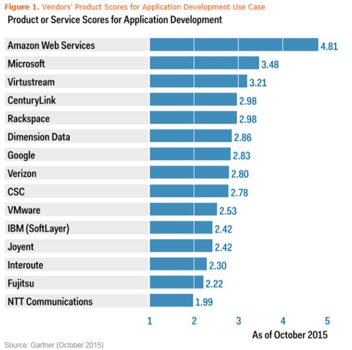

**Table of Contents**
<!-- MarkdownTOC -->

- [Cloud](#cloud)
	- [Cloud Bogs](#cloud-bogs)
	- [Non AWS Clouds on Twitter](#non-aws-clouds-on-twitter)
	- [The Twelve-Factor App methodology for building apps in modern cloud environments](#the-twelve-factor-app-methodology-for-building-apps-in-modern-cloud-environments)
	- [Development environments in the Cloud](#development-environments-in-the-cloud)
	- [Cloud references](#cloud-references)
	- [Cloud Pricing](#cloud-pricing)
	- [OpenStack private cloud](#openstack-private-cloud)
	- [IBM Bluemix](#ibm-bluemix)
	- [Closed groups for AWS certified professionals](#closed-groups-for-aws-certified-professionals)
	- [Awesome AWS](#awesome-aws)
	- [AWS on Twitter](#aws-on-twitter)
	- [AWS Youtube channel and Podcasts](#aws-youtube-channel-and-podcasts)
	- [AWS re:Invent 2015](#aws-reinvent-2015)
	- [AWS Architecture Blog, Official Blog, AWS Labs, AWS Quick Start](#aws-architecture-blog-official-blog-aws-labs-aws-quick-start)
		- [AWS New Features](#aws-new-features)
		- [AWS Schema Conversion Tool](#aws-schema-conversion-tool)
		- [AWS RDS](#aws-rds)
		- [AWS DevOps. AWS CodePipeline](#aws-devops-aws-codepipeline)
		- [AWS Latency](#aws-latency)
		- [AWS EC2 Container Registry (Docker)](#aws-ec2-container-registry-docker)
			- [AWS CLI](#aws-cli)
			- [AWS Developer Blog](#aws-developer-blog)
			- [AWS Lambda](#aws-lambda)
			- [AWS Cloud Formation](#aws-cloud-formation)
		- [AWS Security](#aws-security)
		- [AWS Backup and Recovery](#aws-backup-and-recovery)
		- [AWS BigData](#aws-bigdata)
			- [AWS IoT](#aws-iot)
	- [AWS Partner Network (APN)](#aws-partner-network-apn)
	- [AWS Startup Collection. For startups building on AWS](#aws-startup-collection-for-startups-building-on-aws)
	- [AWS Gartner Report](#aws-gartner-report)

<!-- /MarkdownTOC -->

# Cloud
- [Cloud automation should be the heart of enterprise support -- it will decrease downtime, increase flexibility, and dramatically improve your provider’s ability to rapidly respond to service requests](https://www.linkedin.com/pulse/uk-cios-dissatisfied-cloud-providers-ryan-kroonenburg)
- [Netflix: Linux performance analysis in 60 seconds](http://www.infoworld.com/article/3010558/linux/netflix-linux-performance-analysis-in-60-seconds.html)
- [Three things to remember when moving to the cloud in 2016](http://www.zdnet.com/article/three-things-to-remember-when-moving-to-the-cloud-in-2016/) Switching to cloud-based services can create flexibility -- but the move is not necessarily without its own challenges.

## Cloud Bogs
- [Thoughts On Cloud](http://www.thoughtsoncloud.com/)
- [Cloud Expo](http://cloudcomputing.sys-con.com/)
- [comparethecloud.net](http://www.comparethecloud.net/)
- [sdxcentral cloud](https://www.sdxcentral.com/flow/cloud/)
- [DZone/Cloud Zone](https://dzone.com/cloud-computing-tutorials-tools-news)

## Non AWS Clouds on Twitter
- [twitter.com/googlecloud](https://twitter.com/googlecloud)
- [twitter.com/Azure](https://twitter.com/Azure)
- [twitter.com/OpenStack](https://twitter.com/OpenStack)
- [twitter.com/RDOcommunity](https://twitter.com/RDOcommunity)
- [twitter.com/Rackspace](https://twitter.com/Rackspace)

## The Twelve-Factor App methodology for building apps in modern cloud environments
- [The Twelve-Factor App](http://12factor.net/)
- [slideshare: 12 Factor (Cloud Native) Apps for Spring Developers](http://www.slideshare.net/SpringCentral/12-factor-cloud-native-apps-for-spring-developers)
- [blog.openshift.com: Optimizing Twelve (12) Factor app for OpenShift](https://blog.openshift.com/optimizing-twelve-12-factor-app-for-red-hat-openshift/)

## Development environments in the Cloud
- [Cloud9](https://c9.io/)
- [Koding](https://koding.com/)
- [Codio](https://codio.com/)
- [Nitrous](https://www.nitrous.io/)
- [Runnable](https://runnable.io/)
- [Floobits](https://floobits.com/)
- [Free online IDE and terminal:](http://www.tutorialspoint.com/codingground.htm) Languages and IDEs you can try online without installing anything

## Cloud references
- [To Cloud Or Not To Cloud: That Is The Compliance Question](http://www.digitalistmag.com/resource-optimization/2016/01/04/cloud-or-not-cloud-compliance-03909159)
- [Why the Cloud Is Taking Over Traditional IT Systems](http://tech.co/cloud-taking-over-traditional-it-systems-2016-01)
- [The cloud wars explained: Why nobody can catch up with Amazon](http://www.businessinsider.com/why-amazon-is-so-hard-to-topple-in-the-cloud-and-where-everybody-else-falls-2015-10)
	- ["If HP and Dell can't make a public cloud how will they provide private clouds to enterprises?"](http://www.nextplatform.com/2015/10/22/how-many-other-public-clouds-will-be-vaporized/)
- [comparethecloud.net: Open-source security: Can OpenStack really protect your cloud data?](http://www.comparethecloud.net/articles/open-source-security-can-openstack-really-protect-your-cloud-data/)
- [Sysadmincasts.com: Introduction to Amazon Web Services (AWS)](https://sysadmincasts.com/episodes/29-introduction-to-amazon-web-services-aws)
- [Amazon RDS](https://serversforhackers.com/amazon-rds)
- [reddit: Size of your AWS infrastructure and who manages it/how it's managed](https://www.reddit.com/r/aws/comments/277zli/size_of_your_aws_infrastructure_and_who_manages/)
- [Disadvantages of Cloud Computing](http://cloudacademy.com/blog/disadvantages-of-cloud-computing/)
- [forbes.com: The Unstoppable Rise Of Enterprise Data Clouds](http://www.forbes.com/sites/ciocentral/2015/12/17/the-unstoppable-rise-of-enterprise-data-clouds/)
- [2015’s top five cloud developments and what they mean for 2016](http://blogs.csc.com/2016/01/04/2015s-top-five-cloud-developments-and-what-they-mean-today/)
- [dzone: This Year In Modern Software: Cloud, Mobile, Containers, DevOps, and More.](https://dzone.com/articles/this-year-in-modern-software-cloud-mobile-containe) Cloud has finally begun to dominate the software landscape, along with the mainstream arrival of containers and DevOps.
- [blog.zachbjornson.com: AWS S3 vs Google Cloud vs Azure: Cloud Storage Performance](http://blog.zachbjornson.com/2015/12/29/cloud-storage-performance.html)
- [Linode Resets Passwords After Credentials Leak](http://it.slashdot.org/story/16/01/05/223219/linode-resets-passwords-after-credentials-leak)
- [networkworld.com: And the cloud provider with the best uptime in 2015 is…](http://www.networkworld.com/article/3020235/cloud-computing/and-the-cloud-provider-with-the-best-uptime-in-2015-is.html)
- [cloudacademy.com: Cloud Computing Salary: where to get the most for your skills](http://cloudacademy.com/blog/cloud-computing-salary/)
- [Forbes/Tech: AWS is the biggest disruptive force in tech history that happened by accident](http://www.forbes.com/sites/siliconangle/2015/01/28/andy-jassy-aws-trillion-dollar-cloud-ambition/)
- [aunclicdelastic.com: Etapas por las que pasa una empresa para "subirse a la nube"](http://www.aunclicdelastic.com/cloud-de-no-verle-utilidad-a-llevarlo-en-el-adn/)
- [goparallel.sourceforge.net: Best Practices: First, Know Why You’re Moving to the Cloud](http://goparallel.sourceforge.net/best-practices-first-know-why-youre-moving-to-the-cloud/)
- [The Economy of Cloud Computing 2016 (Infographic)](http://whatsthebigdata.com/2016/01/13/the-economy-of-cloud-computing-infographic/)

## Cloud Pricing
- [EC2Instances.info Easy Amazon EC2 Instance Comparison](http://www.ec2instances.info/)
	- [Amazon's AWS simple monthly calculator](http://calculator.s3.amazonaws.com/index.html)
	- [AWS Blog - New – AWS Cost and Usage Reports for Comprehensive and Customizable Reporting](https://aws.amazon.com/blogs/aws/new-aws-cost-and-usage-reports-for-comprehensive-and-customizable-reporting/)
- [Google Cloud Platform Pricing Calculator](https://cloud.google.com/products/calculator/)
- [Azure Pricing Calculator](http://azure.microsoft.com/en-us/pricing/calculator/)
- [Linode pricing calculator](https://www.linode.com/pricing)

## OpenStack private cloud
- [openstack.org](http://openstack.org)
- [trystack.org](http://trystack.org/)
- [OpenStack Architecture Design Guide](http://docs.openstack.org/arch/)
- [opensource.com: What is OpenStack?](https://opensource.com/resources/what-is-openstack)
- [OpenStack Foundation Youtube Channel](https://www.youtube.com/user/OpenStackFoundation)
- [The Guardian goes all-in on AWS public cloud after OpenStack 'disaster’](http://www.computerworlduk.com/cloud-computing/guardian-goes-all-in-on-aws-public-cloud-after-openstack-disaster-3629790/)
- [opensource.com: A 2016 to do list for the OpenStack board](https://opensource.com/business/15/12/2016-do-list-openstack-board)
- [ZeroStack – A Better Way to do OpenStack](http://blog.architecting.it/2015/12/29/zerostack-a-better-way-to-do-openstack/) Today the main issue aimed at OpenStack is that of complexity.  The most successful deployments we hear about are implemented by large corporations like eBay, AT&T and PayPal.  These companies have the resources to deploy armies of programmers and talented sysadmins to understand, manage and curate the code, which seems to be the biggest consumer of effort for the project.
- [OpenStack on Ansible with Vagrant (unofficial)](https://github.com/openstack-ansible/openstack-ansible)
- [OpenStack Ansible (official)](https://github.com/openstack/openstack-ansible)
- [Building HA Clusters with Ansible and Openstack](https://raymii.org/s/articles/Building_HA_Clusters_With_Ansible_and_Openstack.html)
- [OpenStack in Production at CERN. Hints and tips from the CERN OpenStack cloud team](http://openstack-in-production.blogspot.com.es/)
- [openstack.org: Five Days + Twelve Writers + One Book Sprint = One Excellent Book on OpenStack Architecture](http://www.openstack.org/blog/2014/07/five-days-twelve-writers-one-book-sprint-one-excellent-book-on-openstack-architecture/)
- [Why OpenStack matters](http://www.anchor.com.au/blog/2014/07/openstack-matters/)
- [BBVA Bank on OpenStack](https://www.youtube.com/watch?v=PESWFDPbexs)
- [fortune.com: Red Hat and Mirantis, once an OpenStack couple, have split](http://fortune.com/2015/07/01/red-hat-and-mirantis-split/)
- [linux.com: Get an OpenStack sandbox environment up and running with minimal or zero cost](https://www.linux.com/learn/tutorials/866101-how-to-test-drive-openstack)
- [opensource.com: OpenStack News January 2016. Landing a Summit talk, troubleshooting Neutron, and more OpenStack news](https://opensource.com/business/16/1/openstack-news-january-11)
- [opensource.com: An introduction to OpenStack clouds for beginners](https://opensource.com/business/16/1/scale14x-interview-anthony-chow)

## IBM Bluemix
- [IBM Cloud computing. Technical resources for developing in the cloud](https://www.ibm.com/developerworks/cloud/)

## Closed groups for AWS certified professionals
- [Linkedin](https://www.linkedin.com/grp/home?gid=6814264)
- [awscerts.slack.com](https://awscerts.slack.com)

<iframe src="//www.slideshare.net/slideshow/embed_code/key/J5saN0sbo4cgTE" width="595" height="485" frameborder="0" marginwidth="0" marginheight="0" scrolling="no" style="border:1px solid #CCC; border-width:1px; margin-bottom:5px; max-width: 100%;" allowfullscreen class="video"> </iframe> 
 <strong> <a href="//www.slideshare.net/Examure4/aws-certified-solutions-architect-exam-questions-answers" title="AWS CERTIFIED SOLUTIONS ARCHITECT Exam Questions Answers" target="_blank">AWS CERTIFIED SOLUTIONS ARCHITECT Exam Questions Answers</a> </strong> from <strong><a href="//www.slideshare.net/Examure4" target="_blank">Examure4</a></strong> 

 

## Awesome AWS
- [Awesome AWS](https://github.com/donnemartin/awesome-aws)

## AWS on Twitter
- [twitter.com/awscloud](https://twitter.com/awscloud)
- [twitter.com/AWSreInvent](https://twitter.com/AWSreInvent)
- [twitter.com/jeffbarr](https://twitter.com/jeffbarr)
- [twitter.com/AWSstartups](https://twitter.com/AWSstartups)
- [twitter.com/AWS_Partners](https://twitter.com/AWS_Partners)

## AWS Youtube channel and Podcasts
- [Amazon Web Services Youtube](https://www.youtube.com/user/AmazonWebServices)
- [AWS Podcasts](https://aws.amazon.com/podcasts/aws-podcast/)
- [Stitcher AWS Podcasts](http://www.stitcher.com/podcast/amazon-web-services/aws-podcast)

## AWS re:Invent 2015
- [Festín de novedades en re:Invent 2015](http://www.siliconweek.es/data-storage/business-intelligence/festin-de-novedades-en-reinvent-2015-89129)
- [What's New from Amazon Web Services](https://aws.amazon.com/es/new/)
- [AWS Well Architected Framework](https://d0.awsstatic.com/whitepapers/architecture/AWS_Well-Architected_Framework.pdf)
- [AWS re:Invent 2015 Keynote | Werner Vogels](https://www.youtube.com/watch?v=y-0Wf2Zyi5Q)
	- [AWS re:Invent 2015 Keynote | Andy Jassy](https://www.youtube.com/watch?v=D5-ifl7KJ00)
- [AWS re:Invent: Five takeaways on Amazon's new cloud services](http://www.zdnet.com/article/aws-reinvent-five-takeaways-on-new-services/)
- [Amazon Web Services gets serious about big data analytics with bevy of new services](http://www.zdnet.com/article/amazon-web-services-big-data-analytics-enterprise-datacenters/)
- [Amazon QuickSight: Fast, easy to use, in-memory, Cloud BI service for everyone in an organization (not only technical people). It is 1/10 the cost of traditional BI tools](https://aws.amazon.com/es/quicksight/)
- [Revealed at AWS re:Invent: Amazon Kinesis Firehose - easily load streaming data into Amazon S3 & Amazon RedShift](http://oak.ctx.ly/r/3tfr7)
- [What is Streaming Data?](https://aws.amazon.com/es/streaming-data/)
- [Amazon RDS Update – MariaDB is Now Available](https://aws.amazon.com/blogs/aws/amazon-rds-update-mariadb-is-now-available)
- [AWS Database Migration Service with AWS Schema Conversion Tool](http://aws.amazon.com/es/dms/)
- [AWS Import/Export Snowball – Transfer 1 Petabyte Per Week Using Amazon-Owned Storage Appliances](https://aws.amazon.com/blogs/aws/aws-importexport-snowball-transfer-1-petabyte-per-week-using-amazon-owned-storage-appliances/)
- [AWS Web Application Firewall](https://aws.amazon.com/blogs/aws/category/aws-web-application-firewall/)
- [AWS Config Rules – Dynamic Compliance Checking for Cloud Resources](https://aws.amazon.com/blogs/aws/aws-config-rules-dynamic-compliance-checking-for-cloud-resources/)
- [Amazon Inspector – Automated Security Assessment Service](https://aws.amazon.com/blogs/aws/amazon-inspector-automated-security-assessment-service)
- [Coming Soon – EC2 Dedicated Hosts](https://aws.amazon.com/blogs/aws/coming-soon-ec2-dedicated-hosts)
- [AWS Device Farm Pruebe su aplicación en dispositivos reales en la nube de AWS. Mejore la calidad de sus aplicaciones iOS, Android y Fire OS al probarlas en smartphones y tablets reales en la nube de AWS](http://aws.amazon.com/es/device-farm)
- [EC2 Instance Update – X1 (SAP HANA) & T2.Nano (Websites)](https://aws.amazon.com/blogs/aws/ec2-instance-update-x1-sap-hana-t2-nano-websites)
- [EC2 Container Service Update – Container Registry, ECS CLI, AZ-Aware Scheduling, and More](https://aws.amazon.com/blogs/aws/ec2-container-service-update-container-registry-ecs-cli-az-aware-scheduling-and-more)
- [CloudWatch Dashboards – Create & Use Customized Metrics Views](https://aws.amazon.com/blogs/aws/cloudwatch-dashboards-create-use-customized-metrics-views)
- [AWS Lambda Update – Python, VPC, Increased Function Duration, Scheduling, and More](https://aws.amazon.com/blogs/aws/aws-lambda-update-python-vpc-increased-function-duration-scheduling-and-more)
- [Amazon Launches AWS Mobile Hub To Help Mobile Developers Build Back-End Processes](http://techcrunch.com/2015/10/08/amazon-launches-aws-mobile-hub-to-help-mobile-developers-build-back-end-processes/)
- [AWS IoT – Cloud Services for Connected Devices](https://aws.amazon.com/blogs/aws/aws-iot-cloud-services-for-connected-devices)
- [AWS Mobile Hub – Build, Test, and Monitor Mobile Applications](https://aws.amazon.com/blogs/aws/aws-mobile-hub-build-test-and-monitor-mobile-applications)

## AWS Architecture Blog, Official Blog, AWS Labs, AWS Quick Start
- [AWS Architecture Blog](https://www.awsarchitectureblog.com)
- [AWS Official Blog](http://blogs.aws.amazon.com/)
- [AWS Labs GitHub](https://github.com/awslabs)
- [AWS Quick Start Reference Deployments](http://aws.amazon.com/es/quickstart/)
	- [AWS Quick Start - GitHub](https://github.com/awslabs/aws-quickstart)
- [InfoWorld Review – Amazon Aurora Rocks MySQL](https://aws.amazon.com/blogs/aws/infoworld-review-amazon-aurora-rocks-mysql/)
- [AWS Cost Explorer Update – Access to EC2 Usage Data](https://aws.amazon.com/blogs/aws/aws-cost-explorer-update-access-to-ec2-usage-data/)

### AWS New Features
- [aws.amazon.com/releasenotes](https://aws.amazon.com/releasenotes)
- [Amazon EFS: Amazon Elastic File System – Shared File Storage for Amazon EC2](https://aws.amazon.com/blogs/aws/amazon-elastic-file-system-shared-file-storage-for-amazon-ec2/)
- [New – Encrypted EBS Boot Volumes](https://aws.amazon.com/blogs/aws/new-encrypted-ebs-boot-volumes)
	- [Amazon EBS Encryption](http://docs.aws.amazon.com/AWSEC2/latest/UserGuide/EBSEncryption.html)
- [Now Add or Modify Request Headers Forwarded From Amazon CloudFront to Origin](https://aws.amazon.com/about-aws/whats-new/2015/12/now-add-or-modify-request-headers-forwarded-from-amazon-cloudfront-to-origin/)
- [AWS CloudFormation Adds Support for AWS WAF and AWS Directory Service for Microsoft Active Directory](https://aws.amazon.com/es/about-aws/whats-new/2015/12/aws-cloudformation-adds-support-for-aws-waf-and-aws-directory-service-for-microsoft-active-directory/)
- [Amazon WorkMail – Now Generally Available](https://aws.amazon.com/blogs/aws/amazon-workmail-now-generally-available/)
- [London Calling! An AWS Region is coming to the UK!](http://www.allthingsdistributed.com/2015/11/aws-announces-uk-region.html)
- [New – Scheduled Reserved Instances](https://aws.amazon.com/blogs/aws/new-scheduled-reserved-instances/)

### AWS Schema Conversion Tool
- [cloudacademy.com: Migrating Data to AWS Using the AWS Schema Conversion Tool: A Preview](http://cloudacademy.com/blog/migrating-data-to-aws/)
- [AWS Schema Conversion Tool now supports PostgreSQL as conversion target](http://aws.amazon.com/about-aws/whats-new/2016/01/aws-schema-conversion-tool-postgresql-support/)

### AWS RDS
- [Tutorial: Restoring a DB Instance from a DB Snapshot](http://docs.aws.amazon.com/AmazonRDS/latest/UserGuide/CHAP_Tutorials.RestoringFromSnapshot.html)

### AWS DevOps. AWS CodePipeline
- [AWS DevOps Blog](https://blogs.aws.amazon.com/application-management/)
- [Setting Up the Jenkins Plugin for AWS CodeDeploy](https://blogs.aws.amazon.com/application-management/post/TxMJROUIFQZ4HS/Setting-Up-the-Jenkins-Plugin-for-AWS-CodeDeploy)
- [Continuous Delivery for a PHP Application Using AWS CodePipeline, AWS Elastic Beanstalk, and Solano Labs](https://blogs.aws.amazon.com/application-management/post/TxYSRRBH57NP2P/Continuous-Delivery-for-a-PHP-Application-Using-AWS-CodePipeline-AWS-Elastic-Bea)
- [Building Continuous Deployment on AWS with AWS CodePipeline, Jenkins and AWS Elastic Beanstalk](https://blogs.aws.amazon.com/application-management/post/Tx34AXRMYLXG5OT/Building-Continuous-Deployment-on-AWS-with-AWS-CodePipeline-Jenkins-and-AWS-Elas)
- [AWS CodeDeploy: Deploying from a Development Account to a Production Account](http://blogs.aws.amazon.com/application-management/post/Tx3PE3JTSVJSFI7/AWS-CodeDeploy-Deploying-from-a-Development-Account-to-a-Production-Account)
- [blazemeter.com: Three Ways DevOps Benefit from AWS CodePipeline](https://blazemeter.com/blog/three-ways-devops-benefit-aws-codepipeline)
- [AWS Partner Network - CodePipeline Integrations](https://aws.amazon.com/es/codepipeline/product-integrations/)

<iframe src="//www.slideshare.net/slideshow/embed_code/key/IDuFGnYkBiVIFI" width="595" height="485" frameborder="0" marginwidth="0" marginheight="0" scrolling="no" style="border:1px solid #CCC; border-width:1px; margin-bottom:5px; max-width: 100%;" allowfullscreen class="video"> </iframe> 
 <strong> <a href="//www.slideshare.net/AmazonWebServices/introduction-to-amazon-web-services-7708257" title="Introduction to Amazon Web Services" target="_blank">Introduction to Amazon Web Services</a> </strong> from <strong><a href="//www.slideshare.net/AmazonWebServices" target="_blank">Amazon Web Services</a></strong> 

 

<iframe src="//www.slideshare.net/slideshow/embed_code/key/N8zvYafuumHdhc" width="595" height="485" frameborder="0" marginwidth="0" marginheight="0" scrolling="no" style="border:1px solid #CCC; border-width:1px; margin-bottom:5px; max-width: 100%;" allowfullscreen class="video"> </iframe> 
 <strong> <a href="//www.slideshare.net/AmazonWebServices/aws-101-cloud-computing-seminar-2012" title="AWS 101: Cloud Computing Seminar (2012)" target="_blank">AWS 101: Cloud Computing Seminar (2012)</a> </strong> from <strong><a href="//www.slideshare.net/AmazonWebServices" target="_blank">Amazon Web Services</a></strong> 

 

<iframe src="//www.slideshare.net/slideshow/embed_code/key/qC6QURqVRBzluo" width="595" height="485" frameborder="0" marginwidth="0" marginheight="0" scrolling="no" style="border:1px solid #CCC; border-width:1px; margin-bottom:5px; max-width: 100%;" allowfullscreen class="video"> </iframe> 
 <strong> <a href="//www.slideshare.net/AmazonWebServices/learning-series-getting-started-no-notes" title="AWS Webcast - Getting Started with Amazon Web Services" target="_blank">AWS Webcast - Getting Started with Amazon Web Services</a> </strong> from <strong><a href="//www.slideshare.net/AmazonWebServices" target="_blank">Amazon Web Services</a></strong> 

 

<iframe width="1280" height="720" src="https://www.youtube-nocookie.com/embed/p9l7YD-N9FI?rel=0" frameborder="0" allowfullscreen class="video"></iframe>

 

### AWS Latency
- [Find the fastest region from your location](http://aws-latency.altaircp.com/) Check AWS response time from you browser. Sharing my mini-project, it measures response time from AWS services from different regions base on your location. let me know what you think.
- [Linkedin Discussion](https://www.linkedin.com/groups/49531/49531-6092152919937794052)
>1. Don't do just a single check, the first check will be a lot slower as DNS lookups will need to be done, etc.
>2. I'd recommend doing at least 3 checks getting an average.
- Run 6 checks (with a random 3-10 second delay between each one), the first can be ignored, the highest one is also ignored (as a likely outlier), then for the next 4 show the minimum, maximum and average (mean).

### AWS EC2 Container Registry (Docker)
- [A Better Dev/Test Experience: Docker and AWS](https://medium.com/aws-activate-startup-blog/a-better-dev-test-experience-docker-and-aws-291da5ab1238)
- [Amazon EC2 Container Registry Documentation](http://aws.amazon.com/es/documentation/ecr/)
- [Get started with Amazon EC2 Container Registry (Amazon ECR)](http://docs.aws.amazon.com/AmazonECR/latest/userguide/ECR_GetStarted.html)

#### AWS CLI
- [AWS CLI Command Reference](http://docs.aws.amazon.com/cli/latest/index.html)
- [New usage examples have been added to the CLI for CodePipeline API Reference](http://docs.aws.amazon.com/cli/latest/reference/codepipeline/index.html)
- [ec2-ssh-yplan: A pair of command line utilities for finding and SSH-ing into your Amazon EC2 instances by tag (such as ‘Name’)](https://pypi.python.org/pypi/ec2-ssh-yplan/)

#### AWS Developer Blog
- [The AWS Developer Blog now includes Python & GoLang](https://aws.amazon.com/blogs/developer/)
- [Create an API Using the Swagger Specification and the API Gateway Extensions](http://docs.aws.amazon.com/apigateway/latest/developerguide/create-api-using-import-export-api.html)

#### AWS Lambda
- [you can use Python with AWS Lambda](http://docs.aws.amazon.com/lambda/latest/dg/lambda-python-how-to-create-deployment-package.html)
- [Build a Python Microservice with Amazon Web Services Lambda & API Gateway](http://www.giantflyingsaucer.com/blog/?p=5730)
- [AWS Lambda, Echo, and the Future of Cloud Automation](http://www.logicworks.net/blog/2016/01/aws-lambda-echo-cloud-automation/) A fantastic blog article by Logicworks on Lambda, the coming move to serverless architecture and even the possibility of using Amazon's Echo to launch entire AWS environments by using just your voice
- [Serverless: The Future of Software Architecture?](https://read.acloud.guru/serverless-the-future-of-software-architecture-d4473ffed864#.uk7setw47)

#### AWS Cloud Formation
- [AWS Cloud Formation Release History](http://docs.aws.amazon.com/AWSCloudFormation/latest/UserGuide/ReleaseHistory.html)

### AWS Security
- [AWS Security Blog](http://blogs.aws.amazon.com/security)
- [How to Automatically Update Your Security Groups for Amazon CloudFront and AWS WAF by Using AWS Lambda (boto3 python)](http://blogs.aws.amazon.com/security/post/Tx1LPI2H6Q6S5KC/How-to-Automatically-Update-Your-Security-Groups-for-Amazon-CloudFront-and-AWS-W)
- [Tutorial: Configure Apache Web Server on Amazon Linux to use SSL/TLS](http://docs.aws.amazon.com/AWSEC2/latest/UserGuide/SSL-on-an-instance.html)
- [The Most Popular AWS Security Blog Posts in 2015](http://blogs.aws.amazon.com/security/post/Tx4QX7W51NDSLO/The-Most-Popular-AWS-Security-Blog-Posts-in-2015)
- [dzone: Private Subnets Are Broken on AWS](https://dzone.com/articles/private-subnets-are-broken-on-aws)
- [AWS Identity and Access Management (IAM) best practices in 2016](http://blogs.aws.amazon.com/security/post/Tx2OB7YGHMB7WCM/Adhere-to-IAM-Best-Practices-in-2016)
- [How to Record and Govern Your IAM Resource Configurations Using AWS Config](http://blogs.aws.amazon.com/security/post/Tx14ADBJOCAT9NS/How-to-Record-and-Govern-Your-IAM-Resource-Configurations-Using-AWS-Config)
- [Amazon’s customer service backdoor](https://medium.com/@espringe/amazon-s-customer-service-backdoor-be375b3428c4#.qyixu5mu3)

### AWS Backup and Recovery
- [Quantum Taps AWS for Cloud-Powered Disaster Recovery](http://www.infostor.com/backup-and_recovery/quantum-taps-aws-for-cloud-powered-disaster-recovery.html)
- [Linkedin discussion: Need help on Backup and restore methods of EC2 using s3 services](https://www.linkedin.com/groups/49531/49531-6093375473969090562)

### AWS BigData 
- [blogs.aws.amazon.com/bigdata](http://blogs.aws.amazon.com/bigdata/)
- [Querying Amazon Kinesis Streams Directly with SQL and Spark Streaming](http://blogs.aws.amazon.com/bigdata/post/Tx3916WCIUPVA3T/Querying-Amazon-Kinesis-Streams-Directly-with-SQL-and-Spark-Streaming)

#### AWS IoT
- [What Is AWS IoT?](http://docs.aws.amazon.com/iot/latest/developerguide/what-is-aws-iot.html)

## AWS Partner Network (APN)
- [AWS Partner Network](https://aws.amazon.com/partners/)
	- [APN Technology Partners](https://aws.amazon.com/partners/technology/)
	- [APN Consulting Partners](https://aws.amazon.com/partners/consulting/)
- [AWS Partner Network (APN) blog](https://aws.amazon.com/blogs/apn/)
	- [Active Directory Single Sign-On (SSO) on AWS with Bitium](https://aws.amazon.com/blogs/apn/active-directory-single-sign-on-sso-on-aws-with-bitium)

## AWS Startup Collection. For startups building on AWS
- [bitmovin: Improving Video Quality on the Web](https://medium.com/aws-activate-startup-blog/bitmovin-improving-video-quality-on-the-web-8670039c4334)
- [What Startups Should Know about Amazon VPC — Part 1](https://medium.com/aws-activate-startup-blog/what-startups-should-know-about-amazon-vpc-part-1-bebe94b7f228)
- [Scaling on AWS (Part 3): >500K Users](https://medium.com/aws-activate-startup-blog/scaling-on-aws-part-3-500k-users-3750b227b761)
- [medium.com: Building a Serverless Dynamic DNS System with AWS](https://medium.com/aws-activate-startup-blog/building-a-serverless-dynamic-dns-system-with-aws-a32256f0a1d8#.qq54pucbd)
- [medium.com: The Top 10 AWS Startup Blog Posts of 2015](https://medium.com/aws-activate-startup-blog/the-top-10-aws-startup-blog-posts-of-2015-d2975e3778bb)

## AWS Gartner Report
- [Gartner Critical Capabilities - Learn More ](https://aws.amazon.com/resources/gartner-cc-learn-more/)

