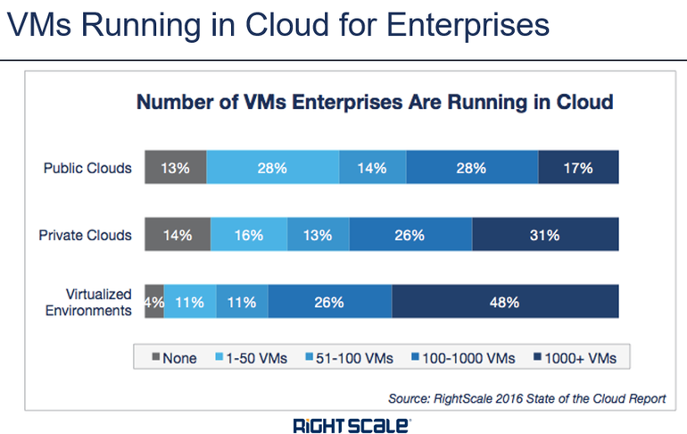

**Table of Contents**
<!-- MarkdownTOC -->

- [Data Centers](#data-centers)
	- [Centros de datos](#centros-de-datos)
- [Cloud](#cloud)
	- [Cloud Bogs](#cloud-bogs)
	- [Non AWS Clouds on Twitter](#non-aws-clouds-on-twitter)
	- [The Twelve-Factor App methodology for building apps in modern cloud environments](#the-twelve-factor-app-methodology-for-building-apps-in-modern-cloud-environments)
	- [Development environments in the Cloud](#development-environments-in-the-cloud)
	- [Cloud references](#cloud-references)
	- [Cloud Pricing](#cloud-pricing)
	- [Amazon Web Services](#amazon-web-services)
	- [OpenStack private cloud](#openstack-private-cloud)
		- [Red Hat OpenStack](#red-hat-openstack)
		- [OpenStack refs](#openstack-refs)
	- [IBM Cloud. IBM Bluemix](#ibm-cloud-ibm-bluemix)
	- [Google Cloud](#google-cloud)
	- [AWS Gartner Report](#aws-gartner-report)

<!-- /MarkdownTOC -->

<iframe src="//www.slideshare.net/slideshow/embed_code/key/17iFA4MCdt9EZx" width="595" height="485" frameborder="0" marginwidth="0" marginheight="0" scrolling="no" style="border:1px solid #CCC; border-width:1px; margin-bottom:5px; max-width: 100%;" allowfullscreen class="video"> </iframe> 
 <strong> <a href="//www.slideshare.net/TableauSoftware/top-10-cloud-trends-for-2016" title="Top 10 Cloud Trends for 2016" target="_blank">Top 10 Cloud Trends for 2016</a> </strong> from <strong><a href="//www.slideshare.net/TableauSoftware" target="_blank">Tableau Software</a></strong> 

 

# Data Centers
- [datacentermap.com 🌟](http://www.datacentermap.com)
	- [datacentermap.com/spain](http://www.datacentermap.com/spain/)
- [Data Center Knowledge](http://www.datacenterknowledge.com/)
- [Youtube: Iceland - A Growing Data Center Hub](https://www.youtube.com/watch?v=LH5lj4sARI0)
- [hostgeni.net](http://www.hostgeni.net) Discover who is hosting any website 
- [RackTables.org - a datacenter asset management system](http://racktables.org/)

## Centros de datos
- [centrodedatos-datacenter.es](http://www.centrodedatos-datacenter.es)

# Cloud
- [Cloud automation should be the heart of enterprise support -- it will decrease downtime, increase flexibility, and dramatically improve your provider’s ability to rapidly respond to service requests](https://www.linkedin.com/pulse/uk-cios-dissatisfied-cloud-providers-ryan-kroonenburg)
- [Netflix: Linux performance analysis in 60 seconds](http://www.infoworld.com/article/3010558/linux/netflix-linux-performance-analysis-in-60-seconds.html)
- [Three things to remember when moving to the cloud in 2016](http://www.zdnet.com/article/three-things-to-remember-when-moving-to-the-cloud-in-2016/) Switching to cloud-based services can create flexibility -- but the move is not necessarily without its own challenges.
- [Seven secrets of success in your cloud migration plan 🌟🌟](http://diginomica.com/2016/02/25/seven-secrets-of-success-in-your-cloud-migration-plan/)  It’s not migration, it’s transformation. Cloud will change your business

## Cloud Bogs
- [Thoughts On Cloud](http://www.thoughtsoncloud.com/)
- [Cloud Expo](http://cloudcomputing.sys-con.com/)
- [comparethecloud.net](http://www.comparethecloud.net/)
- [sdxcentral cloud](https://www.sdxcentral.com/flow/cloud/)
- [DZone/Cloud Zone](https://dzone.com/cloud-computing-tutorials-tools-news)

## Non AWS Clouds on Twitter
- [twitter.com/googlecloud](https://twitter.com/googlecloud)
- [twitter.com/Azure](https://twitter.com/Azure)
- [twitter.com/OpenStack](https://twitter.com/OpenStack)
- [twitter.com/RDOcommunity](https://twitter.com/RDOcommunity)
- [twitter.com/Rackspace](https://twitter.com/Rackspace)

<iframe width="560" height="315" src="https://www.youtube.com/embed/WMy1xch2fOU?rel=0" frameborder="0" allowfullscreen class="video"></iframe>

 

## The Twelve-Factor App methodology for building apps in modern cloud environments
- [The Twelve-Factor App](http://12factor.net/)
- [slideshare: 12 Factor (Cloud Native) Apps for Spring Developers](http://www.slideshare.net/SpringCentral/12-factor-cloud-native-apps-for-spring-developers)
- [blog.openshift.com: Optimizing Twelve (12) Factor app for OpenShift](https://blog.openshift.com/optimizing-twelve-12-factor-app-for-red-hat-openshift/)

## Development environments in the Cloud
- [Cloud9](https://c9.io/)
- [Koding](https://koding.com/)
- [Codio](https://codio.com/)
- [Nitrous](https://www.nitrous.io/)
- [Runnable](https://runnable.io/)
- [Floobits](https://floobits.com/)
- [Free online IDE and terminal:](http://www.tutorialspoint.com/codingground.htm) Languages and IDEs you can try online without installing anything

## Cloud references
- [To Cloud Or Not To Cloud: That Is The Compliance Question](http://www.digitalistmag.com/resource-optimization/2016/01/04/cloud-or-not-cloud-compliance-03909159)
- [Why the Cloud Is Taking Over Traditional IT Systems](http://tech.co/cloud-taking-over-traditional-it-systems-2016-01)
- [The cloud wars explained: Why nobody can catch up with Amazon](http://www.businessinsider.com/why-amazon-is-so-hard-to-topple-in-the-cloud-and-where-everybody-else-falls-2015-10)
	- ["If HP and Dell can't make a public cloud how will they provide private clouds to enterprises?"](http://www.nextplatform.com/2015/10/22/how-many-other-public-clouds-will-be-vaporized/)
- [comparethecloud.net: Open-source security: Can OpenStack really protect your cloud data?](http://www.comparethecloud.net/articles/open-source-security-can-openstack-really-protect-your-cloud-data/)
- [Sysadmincasts.com: Introduction to Amazon Web Services (AWS)](https://sysadmincasts.com/episodes/29-introduction-to-amazon-web-services-aws)
- [Amazon RDS](https://serversforhackers.com/amazon-rds)
- [reddit: Size of your AWS infrastructure and who manages it/how it's managed](https://www.reddit.com/r/aws/comments/277zli/size_of_your_aws_infrastructure_and_who_manages/)
- [Disadvantages of Cloud Computing](http://cloudacademy.com/blog/disadvantages-of-cloud-computing/)
- [forbes.com: The Unstoppable Rise Of Enterprise Data Clouds](http://www.forbes.com/sites/ciocentral/2015/12/17/the-unstoppable-rise-of-enterprise-data-clouds/)
- [2015’s top five cloud developments and what they mean for 2016](http://blogs.csc.com/2016/01/04/2015s-top-five-cloud-developments-and-what-they-mean-today/)
- [dzone: This Year In Modern Software: Cloud, Mobile, Containers, DevOps, and More.](https://dzone.com/articles/this-year-in-modern-software-cloud-mobile-containe) Cloud has finally begun to dominate the software landscape, along with the mainstream arrival of containers and DevOps.
- [blog.zachbjornson.com: AWS S3 vs Google Cloud vs Azure: Cloud Storage Performance](http://blog.zachbjornson.com/2015/12/29/cloud-storage-performance.html)
- [Linode Resets Passwords After Credentials Leak](http://it.slashdot.org/story/16/01/05/223219/linode-resets-passwords-after-credentials-leak)
- [networkworld.com: And the cloud provider with the best uptime in 2015 is…](http://www.networkworld.com/article/3020235/cloud-computing/and-the-cloud-provider-with-the-best-uptime-in-2015-is.html)
- [cloudacademy.com: Cloud Computing Salary: where to get the most for your skills](http://cloudacademy.com/blog/cloud-computing-salary/)
- [Forbes/Tech: AWS is the biggest disruptive force in tech history that happened by accident](http://www.forbes.com/sites/siliconangle/2015/01/28/andy-jassy-aws-trillion-dollar-cloud-ambition/)
- [aunclicdelastic.com: Etapas por las que pasa una empresa para "subirse a la nube"](http://www.aunclicdelastic.com/cloud-de-no-verle-utilidad-a-llevarlo-en-el-adn/)
- [goparallel.sourceforge.net: Best Practices: First, Know Why You’re Moving to the Cloud](http://goparallel.sourceforge.net/best-practices-first-know-why-youre-moving-to-the-cloud/)
- [The Economy of Cloud Computing 2016 (Infographic)](http://whatsthebigdata.com/2016/01/13/the-economy-of-cloud-computing-infographic/)
- [zdnet: Cloud computing goes hybrid as the norm: AWS, VMware, Azure duke it out](http://www.zdnet.com/article/cloud-computing-goes-hybrid-as-the-norm-aws-vmware-azure-duke-it-out/)

<blockquote class="twitter-tweet tw-align-center" data-lang="es">
Google and Red Hat announce cloud-based scalable file servers <a href="https://t.co/qiF4RjlnHc">https://t.co/qiF4RjlnHc</a> <a href="https://twitter.com/hashtag/Linux?src=hash">#Linux</a> <a href="https://twitter.com/hashtag/cloudcomputing?src=hash">#cloudcomputing</a> <a href="https://t.co/ti6R5T5NGK">pic.twitter.com/ti6R5T5NGK</a>
&mdash; nixCraft (@nixcraft) <a href="https://twitter.com/nixcraft/status/700385625078308864">febrero 18, 2016</a></blockquote>

<blockquote class="twitter-tweet tw-align-center" data-lang="es">
Just ordered new stickers <a href="https://t.co/MfGpBWjRAp">https://t.co/MfGpBWjRAp</a>. They will be here soon :) <a href="https://twitter.com/hashtag/cloudcomputing?src=hash">#cloudcomputing</a> <a href="https://twitter.com/hashtag/sysadmin?src=hash">#sysadmin</a> <a href="https://t.co/oUO9tiNm7N">pic.twitter.com/oUO9tiNm7N</a>
&mdash; nixCraft (@nixcraft) <a href="https://twitter.com/nixcraft/status/700706657190309888">febrero 19, 2016</a></blockquote>

## Cloud Pricing
- [EC2Instances.info Easy Amazon EC2 Instance Comparison](http://www.ec2instances.info/)
	- [Amazon's AWS simple monthly calculator](http://calculator.s3.amazonaws.com/index.html)
	- [AWS Blog - New – AWS Cost and Usage Reports for Comprehensive and Customizable Reporting](https://aws.amazon.com/blogs/aws/new-aws-cost-and-usage-reports-for-comprehensive-and-customizable-reporting/)
- [Google Cloud Platform Pricing Calculator](https://cloud.google.com/products/calculator/)
- [Azure Pricing Calculator](http://azure.microsoft.com/en-us/pricing/calculator/)
- [Linode pricing calculator](https://www.linode.com/pricing)

## Amazon Web Services
- [Amazon Web Services](aws.md)

## OpenStack private cloud
### Red Hat OpenStack
- [Red Hat OpenStack](redhat_openstack.md)

### OpenStack refs
- [openstack.org](http://openstack.org)
- [trystack.org](http://trystack.org/)
- [OpenStack Architecture Design Guide](http://docs.openstack.org/arch/)
- [opensource.com: What is OpenStack?](https://opensource.com/resources/what-is-openstack)
- [OpenStack Foundation Youtube Channel](https://www.youtube.com/user/OpenStackFoundation)
- [The Guardian goes all-in on AWS public cloud after OpenStack 'disaster’](http://www.computerworlduk.com/cloud-computing/guardian-goes-all-in-on-aws-public-cloud-after-openstack-disaster-3629790/)
- [opensource.com: A 2016 to do list for the OpenStack board](https://opensource.com/business/15/12/2016-do-list-openstack-board)
- [ZeroStack – A Better Way to do OpenStack](http://blog.architecting.it/2015/12/29/zerostack-a-better-way-to-do-openstack/) Today the main issue aimed at OpenStack is that of complexity.  The most successful deployments we hear about are implemented by large corporations like eBay, AT&T and PayPal.  These companies have the resources to deploy armies of programmers and talented sysadmins to understand, manage and curate the code, which seems to be the biggest consumer of effort for the project.
- [OpenStack on Ansible with Vagrant (unofficial)](https://github.com/openstack-ansible/openstack-ansible)
- [OpenStack Ansible (official)](https://github.com/openstack/openstack-ansible)
- [Building HA Clusters with Ansible and Openstack](https://raymii.org/s/articles/Building_HA_Clusters_With_Ansible_and_Openstack.html)
- [OpenStack in Production at CERN. Hints and tips from the CERN OpenStack cloud team](http://openstack-in-production.blogspot.com.es/)
- [openstack.org: Five Days + Twelve Writers + One Book Sprint = One Excellent Book on OpenStack Architecture](http://www.openstack.org/blog/2014/07/five-days-twelve-writers-one-book-sprint-one-excellent-book-on-openstack-architecture/)
- [Why OpenStack matters](http://www.anchor.com.au/blog/2014/07/openstack-matters/)
- [BBVA Bank on OpenStack](https://www.youtube.com/watch?v=PESWFDPbexs)
- [fortune.com: Red Hat and Mirantis, once an OpenStack couple, have split](http://fortune.com/2015/07/01/red-hat-and-mirantis-split/)
- [linux.com: Get an OpenStack sandbox environment up and running with minimal or zero cost](https://www.linux.com/learn/tutorials/866101-how-to-test-drive-openstack)
- [opensource.com: OpenStack News January 2016. Landing a Summit talk, troubleshooting Neutron, and more OpenStack news](https://opensource.com/business/16/1/openstack-news-january-11)
- [opensource.com: An introduction to OpenStack clouds for beginners](https://opensource.com/business/16/1/scale14x-interview-anthony-chow)
- [What’s Behind Rackspace’s Private OpenStack Cloud Partnership with Red Hat](http://www.datacenterknowledge.com/archives/2016/02/11/whats-behind-rackspaces-private-openstack-cloud-partnership-with-red-hat/)
- [opensource.com: A compilation of 7 new OpenStack tutorials (Feb 2016) 🌟](https://opensource.com/business/16/2/compilation-best-new-openstack-tutorials)

## IBM Cloud. IBM Bluemix
- [IBM Cloud computing. Technical resources for developing in the cloud](https://www.ibm.com/developerworks/cloud/)
- [slideshare: New IBM Mainframe 2016 - Z13](http://www.slideshare.net/fgonza93/new-ibm-mainframe-2016-z13) According to @IBM, the 2016 Z13 mainframe can run up to 8,000 Linux virtual servers on a single system

## Google Cloud
- [googlecloudplatform.blogspot.com](http://googlecloudplatform.blogspot.com)
	- [Google seeks new disks for data centers](http://googlecloudplatform.blogspot.com.es/2016/02/Google-seeks-new-disks-for-data-centers.html)
	- [Spotify chooses Google Cloud Platform to power data infrastructure](http://googlecloudplatform.blogspot.com.es/2016/02/Spotify-chooses-Google-Cloud-Platform-to-power-data-infrastructure.html)
- [zdnet: Spotify to move to Google Cloud](http://www.zdnet.com/article/spotify-to-switch-from-aws-to-google-cloud/) Spotify said its experience with Google's data platform and tools convinced the company to switch its so-called 'traditional' infrastructure to Google Cloud.
- [How Google will beat Amazon's cloud 🌟](http://www.zdnet.com/article/how-google-will-beat-amazons-cloud/) Amazon Web Services (AWS) has a seemingly insurmountable lead with an 80+ percent market share. But the cloud game has barely begun, and Google has their own nearly insurmountable lead in technologies key to the evolution of the cloud. Here's how it will play out.

## AWS Gartner Report
- [Gartner Critical Capabilities - Learn More ](https://aws.amazon.com/resources/gartner-cc-learn-more/)

