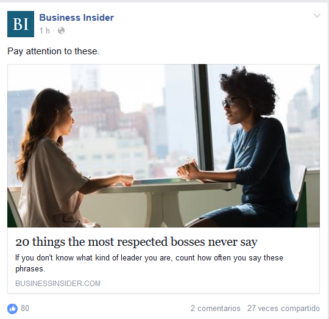
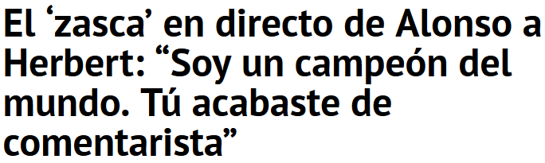
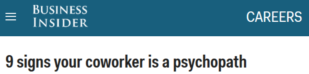

<!-- MarkdownTOC -->

- [Culture and collaboration](#culture-and-collaboration)

<!-- /MarkdownTOC -->

# Culture and collaboration
- [hbr.org: Aligning Your Organization with an Agile Workforce](https://hbr.org/2016/02/aligning-your-organization-with-an-agile-workforce)
- [deloitte: Cultivating the IT Workforce of the Future](http://deloitte.wsj.com/cio/2015/10/20/cultivating-the-it-workforce-of-the-future/)
- [businessinsider.com: 8 mistakes that make great employees leave](http://www.businessinsider.com/8-mistakes-that-make-great-employees-leave-2016-2)
- [Forbes: Addicted To Ambition: 3 Ways Millennials Can Manage Their Stress](http://www.forbes.com/sites/carolinebeaton/2016/02/10/addicted-to-ambition-3-ways-millennials-can-manage-their-stress/)
- [Forbes: How To Successfully Manage A Multigenerational Team 🌟](http://www.forbes.com/sites/adp/2016/02/12/how-to-successfully-manage-a-multigenerational-team)
- [cityam.com: Why you should stop trying to make your team like you](http://www.cityam.com/234743/why-you-should-stop-trying-to-make-your-team-like-you)
- [VW damaged by a culture of fear](https://www.linkedin.com/pulse/vw-damaged-culture-fear-l-david-marquet)
- [Forbes: Seven Ways To Inspire Your Team To Collaborate 🌟🌟🌟](http://www.forbes.com/sites/carolkinseygoman/2016/02/21/seven-ways-to-inspire-your-team-to-collaborate) “How many of you are totally comfortable sharing information with others in your organization?”
- [L. David Marquet: Control In An Emergency 🌟](https://www.linkedin.com/pulse/control-emergency-l-david-marquet)
- [businessinsider.com: 27 jobs to avoid if you hate stress](http://www.businessinsider.com/jobs-to-avoid-if-you-hate-stress-2015-9)
- [businessinsider.com: 13 bad habits you should break in 2016 to be more productive 🌟](http://www.businessinsider.com/bad-habits-that-are-killing-your-productivity-2015-12)

<blockquote class="twitter-tweet tw-align-center" data-lang="es">
I liked a <a href="https://twitter.com/YouTube">@YouTube</a> video <a href="http://t.co/RmXpSOqNwy">http://t.co/RmXpSOqNwy</a> Best scene from Moneyball
&mdash; Shigeyuki Ono (@hibarifuji) <a href="https://twitter.com/hibarifuji/status/640504452047314944">6 de septiembre de 2015</a></blockquote>

<blockquote class="twitter-tweet tw-align-center" data-lang="es">
Game of inches<a href="https://t.co/SwBSum936R">https://t.co/SwBSum936R</a>
&mdash; Famps (@ElFamps) <a href="https://twitter.com/ElFamps/status/708649150548742144">12 de marzo de 2016</a></blockquote>

<blockquote class="twitter-tweet tw-align-center" data-lang="es">
So much of what we call management consists in making it difficult for people to work. —Drucker <a href="https://t.co/rB8ghD9ss7">pic.twitter.com/rB8ghD9ss7</a>
&mdash; Vala Afshar (@ValaAfshar) <a href="https://twitter.com/ValaAfshar/status/714838123578982400">29 de marzo de 2016</a></blockquote>

<iframe src="//es.slideshare.net/slideshow/embed_code/key/BYA1zNZmsN7dqC" width="595" height="485" frameborder="0" marginwidth="0" marginheight="0" scrolling="no" style="border:1px solid #CCC; border-width:1px; margin-bottom:5px; max-width: 100%;" allowfullscreen class="video"> </iframe> 
 <strong> <a href="//es.slideshare.net/SuharshHarsha/business-etiquette-and-culture-in-europe" title="BUSINESS ETIQUETTE AND CULTURE IN EUROPE " target="_blank">BUSINESS ETIQUETTE AND CULTURE IN EUROPE </a> </strong> from <strong><a target="_blank" href="//es.slideshare.net/SuharshHarsha">Suharsh L</a></strong> 

 

<iframe src="//www.slideshare.net/slideshow/embed_code/key/32i7dUYEeZCEmm" width="595" height="485" frameborder="0" marginwidth="0" marginheight="0" scrolling="no" style="border:1px solid #CCC; border-width:1px; margin-bottom:5px; max-width: 100%;" allowfullscreen class="video"> </iframe> 
 <strong> <a href="//www.slideshare.net/Rypple/good-boss-bad-boss" title="Good Boss, Bad Boss - Robert Sutton from Stanford" target="_blank">Good Boss, Bad Boss - Robert Sutton from Stanford</a> </strong> from <strong><a target="_blank" href="//www.slideshare.net/Rypple">Work.com - A Salesforce Company</a></strong> 

 

<iframe src="//www.slideshare.net/slideshow/embed_code/key/Fkhw8cP5i7Rgbf" width="595" height="485" frameborder="0" marginwidth="0" marginheight="0" scrolling="no" style="border:1px solid #CCC; border-width:1px; margin-bottom:5px; max-width: 100%;" allowfullscreen class="video"> </iframe> 
 <strong> <a href="//www.slideshare.net/amirsaiftaz/11-habits-of-bad-boss-presentation" title="11 Habits Of Bad Boss" target="_blank">11 Habits Of Bad Boss</a> </strong> from <strong><a target="_blank" href="//www.slideshare.net/amirsaiftaz">Self Creation </a></strong> 

 

<iframe src="//www.slideshare.net/slideshow/embed_code/key/1Gx0ff7YjTyWca" width="595" height="485" frameborder="0" marginwidth="0" marginheight="0" scrolling="no" style="border:1px solid #CCC; border-width:1px; margin-bottom:5px; max-width: 100%;" allowfullscreen class="video"> </iframe> 
 <strong> <a href="//www.slideshare.net/dbenoni/12-characteristicsofhorribleboss" title="12 Characteristics of A Horrible Boss" target="_blank">12 Characteristics of A Horrible Boss</a> </strong> from <strong><a target="_blank" href="//www.slideshare.net/dbenoni">Dan Benoni</a></strong> 

 

<iframe src="//www.slideshare.net/slideshow/embed_code/key/1H6fog0r6z2Kot" width="595" height="485" frameborder="0" marginwidth="0" marginheight="0" scrolling="no" style="border:1px solid #CCC; border-width:1px; margin-bottom:5px; max-width: 100%;" allowfullscreen class="video"> </iframe> 
 <strong> <a href="//www.slideshare.net/dbenoni/personality-traits-of-a-great-boss-44358501" title="12 Personality Traits Of A Great Boss " target="_blank">12 Personality Traits Of A Great Boss </a> </strong> from <strong><a target="_blank" href="//www.slideshare.net/dbenoni">Dan Benoni</a></strong> 

 

<iframe src="//www.slideshare.net/slideshow/embed_code/key/hSoK6TTGrYXjje" width="595" height="485" frameborder="0" marginwidth="0" marginheight="0" scrolling="no" style="border:1px solid #CCC; border-width:1px; margin-bottom:5px; max-width: 100%;" allowfullscreen class="video"> </iframe> 
 <strong> <a href="//www.slideshare.net/dbenoni/how-to-be-happy-at-work-10-simple-tips-that-work" title="How to Be Happy at Work - 10 Simple Tips That Work" target="_blank">How to Be Happy at Work - 10 Simple Tips That Work</a> </strong> from <strong><a target="_blank" href="//www.slideshare.net/dbenoni">Dan Benoni</a></strong> 

 

<iframe src="//www.slideshare.net/slideshow/embed_code/key/IQkukxYFL4fH6l" width="595" height="485" frameborder="0" marginwidth="0" marginheight="0" scrolling="no" style="border:1px solid #CCC; border-width:1px; margin-bottom:5px; max-width: 100%;" allowfullscreen class="video"> </iframe> 
 <strong> <a href="//www.slideshare.net/dbenoni/difference-betweenbossvsleader" title="13 Personality Traits Of A Horrible Employee" target="_blank">13 Personality Traits Of A Horrible Employee</a> </strong> from <strong><a target="_blank" href="//www.slideshare.net/dbenoni">Dan Benoni</a></strong> 

 

<blockquote class="twitter-tweet tw-align-center" data-lang="es">
Help! My boss doesn&#39;t do any work and takes credit for everything I do <a href="https://t.co/O83AHc1wpP">https://t.co/O83AHc1wpP</a> <a href="https://t.co/RFWT4fhFlc">pic.twitter.com/RFWT4fhFlc</a>
&mdash; Business Insider (@businessinsider) <a href="https://twitter.com/businessinsider/status/717387777718009858">5 de abril de 2016</a></blockquote>

<blockquote class="twitter-tweet tw-align-center" data-lang="es">
The hidden costs of burnout <a href="https://t.co/kEuVbJi73L">https://t.co/kEuVbJi73L</a>
&mdash; Forbes (@Forbes) <a href="https://twitter.com/Forbes/status/708754688431280128">12 de marzo de 2016</a></blockquote>

<blockquote class="twitter-tweet tw-align-center" data-lang="es">
4 reasons why team-building exercises can actually damage your workplace: <a href="https://t.co/qy7T7yyrOW">https://t.co/qy7T7yyrOW</a> <a href="https://t.co/YP8apfHwJJ">pic.twitter.com/YP8apfHwJJ</a>
&mdash; Forbes (@Forbes) <a href="https://twitter.com/Forbes/status/714059645166493698">27 de marzo de 2016</a></blockquote>

<blockquote class="twitter-tweet tw-align-center" data-lang="es">
Philip Seymour Hoffman <a href="https://t.co/WeScIKb5JC">pic.twitter.com/WeScIKb5JC</a>
&mdash; Actor Trivia (@ActorTrivia) <a href="https://twitter.com/ActorTrivia/status/719513410501812224">11 de abril de 2016</a></blockquote>

<iframe width="560" height="315" src="https://www.youtube.com/embed/H4gOYlBO0ys?rel=0" frameborder="0" allowfullscreen class="video"></iframe>

 

<iframe width="560" height="315" src="https://www.youtube.com/embed/ZhyuuwkwSao?rel=0" frameborder="0" allowfullscreen class="video"></iframe>

 

<iframe width="560" height="315" src="https://www.youtube.com/embed/qHw9e3iVhKQ?rel=0" frameborder="0" allowfullscreen class="video"></iframe>

 

<blockquote class="twitter-tweet tw-align-center" data-lang="es">
Once someone starts disrespecting you. It is so hard to ever get them to stop....best to just walk away. <a href="https://t.co/2tYzUf9f0Q">pic.twitter.com/2tYzUf9f0Q</a>
&mdash; ✨Påυυιđå❤️ (@krua6497) <a href="https://twitter.com/krua6497/status/701213378069417984">21 de febrero de 2016</a></blockquote>

<iframe width="560" height="315" src="https://www.youtube.com/embed/kOYcbod5J0w?rel=0" frameborder="0" allowfullscreen class="video"></iframe>

 

<iframe src="https://player.vimeo.com/video/161551058" width="500" height="281" frameborder="0" webkitallowfullscreen mozallowfullscreen allowfullscreen class="video"></iframe>
<a href="https://vimeo.com/161551058">Persigue tu sue&ntilde;o, supera los obst&aacute;culos - Javier Gomez Noya</a> from <a href="https://vimeo.com/bridgestoneeurope">Bridgestone</a> on <a href="https://vimeo.com">Vimeo</a>.

 

<blockquote class="twitter-tweet tw-align-center" data-lang="es">
PHOTOS: The 10 happiest jobs: <a href="https://t.co/Dw88jn7gkY">https://t.co/Dw88jn7gkY</a> <a href="https://t.co/R1LYgpgOIT">pic.twitter.com/R1LYgpgOIT</a>
&mdash; Forbes (@Forbes) <a href="https://twitter.com/Forbes/status/705837970125950976">4 de marzo de 2016</a></blockquote>

<blockquote class="twitter-tweet tw-align-center" data-lang="es">
Diversity in the workplace should be celebrated. But not the box-ticking kind <a href="https://t.co/u9sBkBTFLy">https://t.co/u9sBkBTFLy</a> <a href="https://t.co/gk0i6jgteb">pic.twitter.com/gk0i6jgteb</a>
&mdash; The Economist (@TheEconomist) <a href="https://twitter.com/TheEconomist/status/699642973957595137">febrero 16, 2016</a></blockquote>

<blockquote class="twitter-tweet tw-align-center" data-lang="es">
17 signs your boss is about to quit <a href="https://t.co/sielMFFp1q">https://t.co/sielMFFp1q</a> <a href="https://t.co/yCiUljiHCL">pic.twitter.com/yCiUljiHCL</a>
&mdash; Business Insider (@businessinsider) <a href="https://twitter.com/businessinsider/status/699651429959598081">febrero 16, 2016</a></blockquote>

<blockquote class="twitter-tweet tw-align-center" data-lang="es">
How loyal are millennial employees? <a href="https://t.co/uaNXKspauh">https://t.co/uaNXKspauh</a> <a href="https://twitter.com/hashtag/work?src=hash">#work</a> <a href="https://t.co/LYBQbboeD2">pic.twitter.com/LYBQbboeD2</a>
&mdash; World Economic Forum (@wef) <a href="https://twitter.com/wef/status/701055035623526400">febrero 20, 2016</a></blockquote>

<blockquote class="twitter-tweet tw-align-center" data-lang="es">
Show me a person who has never made a mistake and I&#39;ll show you somebody who has never achieved much. ~ Joan Collins
&mdash; Zen Moments (@Zen_Moments) <a href="https://twitter.com/Zen_Moments/status/702151633334046720">febrero 23, 2016</a></blockquote>

<blockquote class="twitter-tweet tw-align-center" data-lang="es">
This is why relationships matter at work: <a href="https://t.co/rB6g8Y6G3v">https://t.co/rB6g8Y6G3v</a>
&mdash; Forbes (@Forbes) <a href="https://twitter.com/Forbes/status/711241072442265600">19 de marzo de 2016</a></blockquote>

<blockquote class="twitter-tweet tw-align-center" data-lang="es">
Must See!!! Full Metal Jacket - Jelly Doughnut Scene <a href="https://t.co/wkPLh6snXz">https://t.co/wkPLh6snXz</a> via <a href="https://twitter.com/YouTube">@YouTube</a>
&mdash; Dawgy65 (@woofeous) <a href="https://twitter.com/woofeous/status/696820724695105536">8 de febrero de 2016</a></blockquote>

<blockquote class="twitter-tweet tw-align-center" data-lang="es">
Saying goodbye. Kobe Bryant and Pau Gasol  (Getty)<a href="https://twitter.com/hashtag/photooftheday?src=hash">#photooftheday</a><a href="https://t.co/ioTwwikD1O">https://t.co/ioTwwikD1O</a> <a href="https://t.co/wcHxHi4otO">pic.twitter.com/wcHxHi4otO</a>
&mdash; Paul Nisely (@SN_Paul_Nisely) <a href="https://twitter.com/SN_Paul_Nisely/status/701926990601781249">23 de febrero de 2016</a></blockquote>

<blockquote class="twitter-tweet tw-align-center" data-lang="es">
Christian Bale: Heath Ledger&#39;s Performance as The Joker &#39;Ruined All My Plans&#39;: In a new interview, he says fee.. <a href="https://t.co/024tbsBzsr">https://t.co/024tbsBzsr</a>
&mdash; Diamond Live (@BijouBijounet) <a href="https://twitter.com/BijouBijounet/status/705873205714673666">4 de marzo de 2016</a></blockquote>

<blockquote class="twitter-tweet tw-align-center" data-lang="es">
Jason Kidd era un mago del balón. Magia en sus manos. 🔝😵 <a href="https://t.co/q3NqVMQwPJ">https://t.co/q3NqVMQwPJ</a>
&mdash; EstadisticasNBA (@EstadisticasNBA) <a href="https://twitter.com/EstadisticasNBA/status/708752807676026880">12 de marzo de 2016</a></blockquote>

<iframe width="420" height="315" src="https://www.youtube.com/embed/rm81LSKJC2k?rel=0" frameborder="0" allowfullscreen class="video"></iframe>

 

<blockquote class="twitter-tweet tw-align-center" data-lang="es">
Ich habe ein <a href="https://twitter.com/YouTube">@YouTube</a>-Video positiv bewertet: <a href="http://t.co/gXxEitdkxV">http://t.co/gXxEitdkxV</a> American Psycho - Axe scene
&mdash; Cas Supporters (@Klerus78) <a href="https://twitter.com/Klerus78/status/653918852338814976">13 de octubre de 2015</a></blockquote>

<iframe width="560" height="315" src="https://www.youtube.com/embed/tlhDW89Bid0?rel=0" frameborder="0" allowfullscreen class="video"></iframe>

 

<blockquote class="twitter-tweet tw-align-center" data-lang="es">
Michael Jordan iba muuuuy sobrado. Uno de los mejores Fake Shot jamás vistos.  <a href="https://t.co/5Rtb6SxGJv">https://t.co/5Rtb6SxGJv</a>
&mdash; EstadisticasNBA (@EstadisticasNBA) <a href="https://twitter.com/EstadisticasNBA/status/713851916179152897">26 de marzo de 2016</a></blockquote>

<iframe width="560" height="315" src="https://www.youtube.com/embed/ZNnNbzHtVaU?rel=0" frameborder="0" allowfullscreen class="video"></iframe>

 