**Table of Contents**
<!-- MarkdownTOC -->

- [Data Science and Big Data](#data-science-and-big-data)
	- [SQL and Databases](#sql-and-databases)
	- [NoSQL and NewSQL](#nosql-and-newsql)
	- [Machine Learning solutions](#machine-learning-solutions)
	- [Data Science Analytics Blogs](#data-science-analytics-blogs)
	- [Data collection and processing is growing in sports](#data-collection-and-processing-is-growing-in-sports)
	- [Google Analytics](#google-analytics)
	- [Python analytics](#python-analytics)
		- [Anaconda Analytics](#anaconda-analytics)
		- [Apache Zeppelin](#apache-zeppelin)
	- [Big Data](#big-data)
		- [Awesome Lists](#awesome-lists)
		- [Big Data Blogs](#big-data-blogs)
		- [Big Bang Data](#big-bang-data)
		- [Internet of things](#internet-of-things)
		- [Data Visualization](#data-visualization)
			- [Tableau](#tableau)
		- [Apache Spark](#apache-spark)
		- [Apache Hadoop](#apache-hadoop)
			- [Cloudera Docker image](#cloudera-docker-image)
		- [Apache Storm and Kite SDK Morphlines](#apache-storm-and-kite-sdk-morphlines)
		- [Pentaho Data Integration and Business Analytics Platforms](#pentaho-data-integration-and-business-analytics-platforms)

<!-- /MarkdownTOC -->

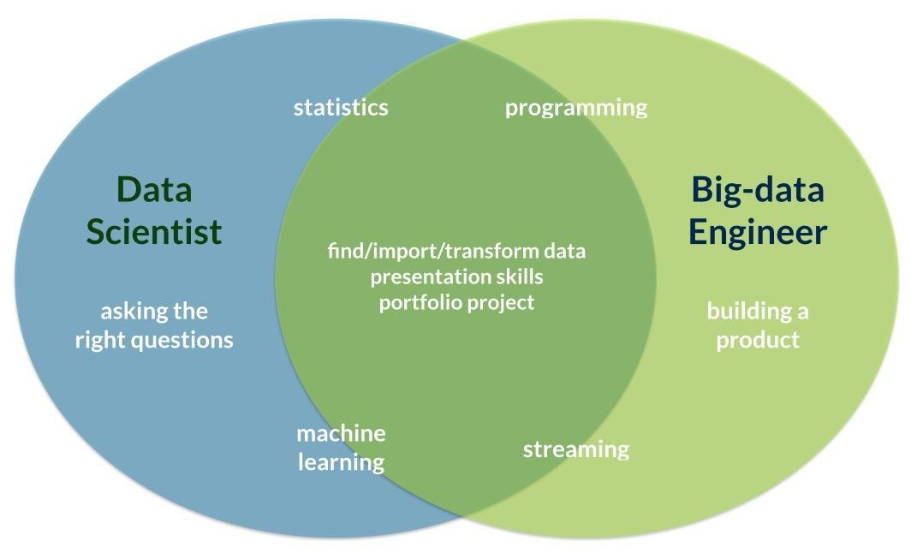

<iframe src="//www.slideshare.net/slideshow/embed_code/key/bpZyCP8TXChqaM" width="595" height="485" frameborder="0" marginwidth="0" marginheight="0" scrolling="no" style="border:1px solid #CCC; border-width:1px; margin-bottom:5px; max-width: 100%;" allowfullscreen class="video"> </iframe> 
 <strong> <a href="//www.slideshare.net/mjft01/big-data-landscape-2016" title="Big Data Landscape 2016 " target="_blank">Big Data Landscape 2016 </a> </strong> from <strong><a href="//www.slideshare.net/mjft01" target="_blank">Matt Turck</a></strong> 

 

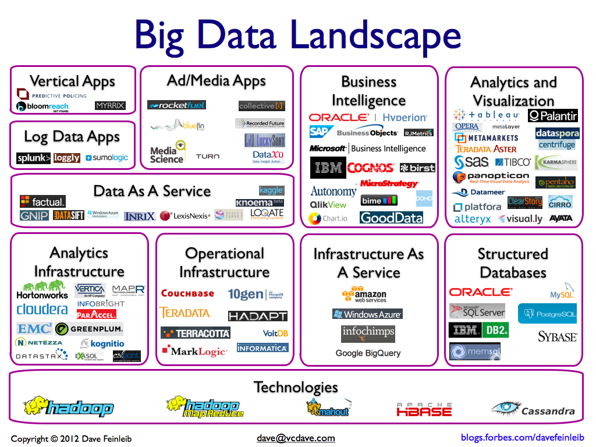

<blockquote class="twitter-tweet tw-align-center" data-lang="es">
The future of <a href="https://twitter.com/hashtag/BigData?src=hash">#BigData</a> is open source <a href="https://t.co/mxYQGTfLyP">https://t.co/mxYQGTfLyP</a> via <a href="https://twitter.com/DataconomyMedia">@DataconomyMedia</a> <a href="https://t.co/epJeSG1iHk">pic.twitter.com/epJeSG1iHk</a>
&mdash; Paul Denham (@PaulTDenham) <a href="https://twitter.com/PaulTDenham/status/747034179561369601">26 de junio de 2016</a></blockquote>

<blockquote class="twitter-tweet tw-align-center" data-lang="es">
<a href="https://t.co/L3fUiplTHq">https://t.co/L3fUiplTHq</a>
&mdash; RedHatSpain (@RedHatSpain) <a href="https://twitter.com/RedHatSpain/status/747792843410935808">28 de junio de 2016</a></blockquote>

# Data Science and Big Data
- [Data is beautiful 'subreddit'](https://www.reddit.com/r/dataisbeautiful)
- [datasciencecentral.com: 24 Data Science, R, Python, Excel, and Machine Learning Cheat Sheets](http://www.datasciencecentral.com/profiles/blogs/20-data-science-r-python-excel-and-machine-learning-cheat-sheets)
- [visualcapitalist.com: All of the World’s Money and Markets in One Visualization](http://money.visualcapitalist.com/all-of-the-worlds-money-and-markets-in-one-visualization/)
- [civisanalytics.com: Machine Learning. Workflows in Python: Getting data ready to build models](https://civisanalytics.com/blog/data-science/2015/12/17/workflows-in-python-getting-data-ready-to-build-models/)
	- [civisanalytics.com: Machine Learning. Workflows in Python: Curating Features and Thinking Scientifically about Algorithms](https://civisanalytics.com/blog/data-science/2015/12/23/workflows-in-python-curating-features-and-thinking-scientifically-about-algorithms/)
- [redash.io Open Source Data Collaboration Platform](https://github.com/getredash/redash) Connect to any data source, visualize your data and share it with anyone!
- [Beginner tips to becoming a data analyst](http://thenextweb.com/offers/2015/12/19/beginner-tips-becoming-data-analyst/)
- [ZDNet Top 2016 Data Trends: 5 data-to-decisions trends to know for 2016.](http://www.zdnet.com/article/top-5-data-to-decisions-trends-to-know-for-2016/) Apache Spark, real-time, cloud BI & analytics, IoT, and self-service were the trends to watch in 2015, and they'll continue to make waves in 2016.
- [Top 20 Python Machine Learning Open Source Projects](http://www.kdnuggets.com/2015/06/top-20-python-machine-learning-open-source-projects.html)
- [Top 10 Machine Learning Projects on Github](http://www.kdnuggets.com/2015/12/top-10-machine-learning-github.html)
- [Data scientists have the hottest job in America](http://www.infoworld.com/article/3024523/big-data/data-scientists-have-the-hottest-job-in-america.html)
- [datasciencecentral.com: 20 short tutorials all data scientists should read (and practice)](http://www.datasciencecentral.com/profiles/blogs/17-short-tutorials-all-data-scientists-should-read-and-practice)

[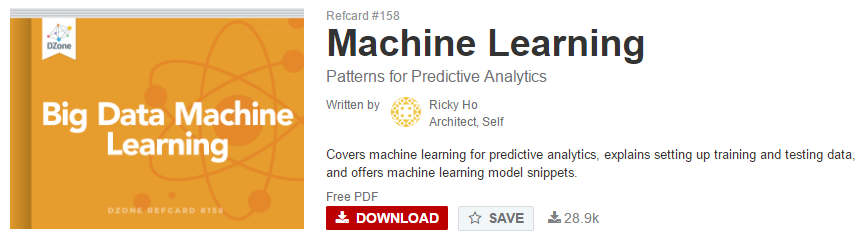](https://dzone.com/refcardz/machine-learning-predictive)

[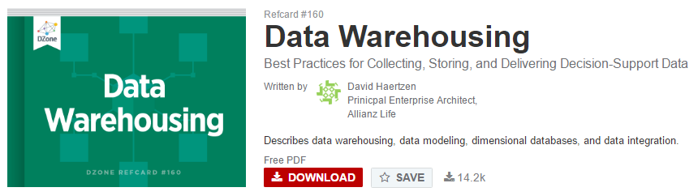](https://dzone.com/refcardz/data-warehousing)

<blockquote class="twitter-tweet tw-align-center" data-lang="es">
Top Machine Learning Twitter influencers one should follow <a href="https://t.co/BOWwefvwam">https://t.co/BOWwefvwam</a>
&mdash; Machine Learning (@ML_toparticles) <a href="https://twitter.com/ML_toparticles/status/705144727184609280">2 de marzo de 2016</a></blockquote>

<blockquote class="twitter-tweet tw-align-center" data-lang="es">
Top 10 iPython Notebook Tutorials for Data Science and Machine Learning <a href="https://t.co/VhIIxpjWXw">https://t.co/VhIIxpjWXw</a> <a href="https://t.co/iiDy5EBJW7">pic.twitter.com/iiDy5EBJW7</a>
&mdash; Machine Learning (@ML_toparticles) <a href="https://twitter.com/ML_toparticles/status/723608177984430084">22 de abril de 2016</a></blockquote>

<blockquote class="twitter-tweet tw-align-center" data-lang="es">
Moving Streaming Analytics Out of the Data Center <a href="https://t.co/cUM2LB7y6s">https://t.co/cUM2LB7y6s</a>   via <a href="https://twitter.com/hashtag/MVB?src=hash">#MVB</a> <a href="https://twitter.com/MarkLochbihler">@MarkLochbihler</a> <a href="https://t.co/gOwqMxcQxc">pic.twitter.com/gOwqMxcQxc</a>
&mdash; DZone (@DZone) <a href="https://twitter.com/DZone/status/742084135343296512">12 de junio de 2016</a></blockquote>

<blockquote class="twitter-tweet tw-align-center" data-lang="es">
New Machine Learning Cheat Sheet by Emily Barry <a href="https://t.co/gHrB4ZHVuD">https://t.co/gHrB4ZHVuD</a> <a href="https://t.co/d35YArL4Ah">pic.twitter.com/d35YArL4Ah</a>
&mdash; Machine Learning (@ML_toparticles) <a href="https://twitter.com/ML_toparticles/status/744946473440161793">20 de junio de 2016</a></blockquote>

<blockquote class="twitter-tweet tw-align-center" data-lang="es">
<a href="https://t.co/JqRbbmNnxV">https://t.co/JqRbbmNnxV</a>
&mdash; RedHatSpain (@RedHatSpain) <a href="https://twitter.com/RedHatSpain/status/747760278020972544">28 de junio de 2016</a></blockquote>

<blockquote class="twitter-tweet tw-align-center" data-lang="es">
10 Great Data Science, Machine / Deep Learning, IoT, AI, Stats, Python and R Resources <a href="https://t.co/yGqf4xPw83">https://t.co/yGqf4xPw83</a> <a href="https://t.co/R5YVHOZ13m">pic.twitter.com/R5YVHOZ13m</a>
&mdash; Machine Learning (@ML_toparticles) <a href="https://twitter.com/ML_toparticles/status/748409327577272321">30 de junio de 2016</a></blockquote>

[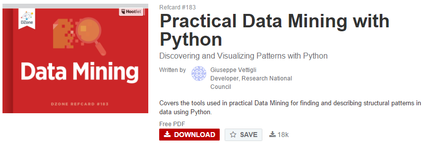](https://dzone.com/refcardz/data-mining-discovering-and)

## SQL and Databases
- [SQL and Databases](databases.md)

## NoSQL and NewSQL
- [NoSQL and NewSQL](nosql.md)

## Machine Learning solutions
- [TensorFlow](https://www.tensorflow.org)
- [Microsoft opens up its deep-learning toolkit on GitHub](http://www.pcworld.com/article/3026236/microsoft-opens-up-its-deep-learning-toolkit-on-github.html)

<iframe width="560" height="315" src="https://www.youtube.com/embed/Smp5b5Bohaw?rel=0" frameborder="0" allowfullscreen class="video"></iframe>

 

## Data Science Analytics Blogs
- [analyticsvidhya.com](http://www.analyticsvidhya.com)
- [datasciencecentral.com](http://www.datasciencecentral.com)
- [pythonforsocialscientists.org](http://pythonforsocialscientists.org)
- [leifengtechblog.wordpress.com](https://leifengtechblog.wordpress.com)

## Data collection and processing is growing in sports
- [reddit: Are there any good resources for Python and Proffesional sports data?](https://www.reddit.com/r/Python/comments/3xa59x/are_there_any_good_resources_for_python_and/)
	- [nba_py - stats.nba.com API for python](https://github.com/seemethere/nba_py)
	- [Pro Football Statistics](http://www.pro-football-reference.com/)
	- [how data collection and processing is growing in sports. TED talk](https://www.youtube.com/watch?v=66ko_cWSHBU)
- [football-data.co.uk](http://football-data.co.uk)

[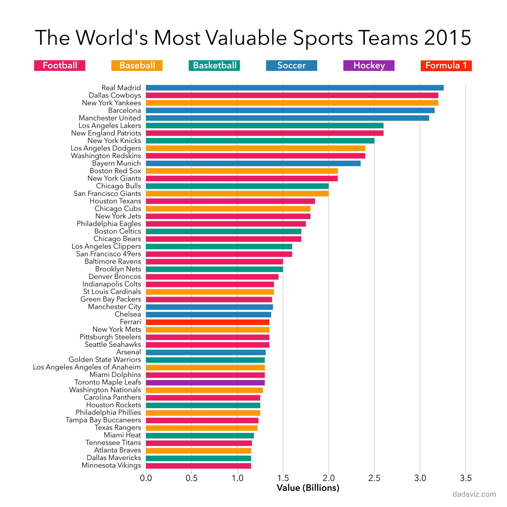](http://dadaviz.com/i/4595)

<blockquote class="twitter-tweet tw-align-center" data-lang="es">
I added a video to a <a href="https://twitter.com/YouTube">@YouTube</a> playlist <a href="https://t.co/znBOF9N3pq">https://t.co/znBOF9N3pq</a> Moneyball Trailer 2011 HD
&mdash; Mr S Sinclair (@businessbgs01) <a href="https://twitter.com/businessbgs01/status/704341618325897216">29 de febrero de 2016</a></blockquote>

<iframe src="//www.slideshare.net/slideshow/embed_code/key/xP0wYfN8YGYSyW" width="668" height="5553" frameborder="0" marginwidth="0" marginheight="0" scrolling="no" style="border:1px solid #CCC; border-width:1px; margin-bottom:5px; max-width: 100%;" allowfullscreen class="video"> </iframe> 
 <strong> <a href="//www.slideshare.net/IQGroup/top-10-highest-paying-analytics-jobs" title="Top 10 Highest Paying Analytics Jobs " target="_blank">Top 10 Highest Paying Analytics Jobs </a> </strong> from <strong><a href="//www.slideshare.net/IQGroup" target="_blank">InterQuest Group</a></strong> 

 

## Google Analytics
- [Google Analytics para principiantes](http://www.contunegocio.es/tecnologia/google-analytics-para-principiantes-i/)

## Python analytics
- [PyData, a community for developers and users of Python data tools](http://pydata.org)
- [Python for Data Science vs Python for Web Development](http://www.datasciencecentral.com/profiles/blogs/python-for-data-science-vs-python-for-web-development)
- [Python for Social Scientists](http://www.pythonforsocialscientists.org/#welcome-to-python-for-social-scientists)
- [analyticsvidhya.com: Cheat Sheet: Data Visualisation in Python](http://www.analyticsvidhya.com/blog/2015/06/data-visualization-in-python-cheat-sheet/)
- [Distributed Computing on your Cluster with Anaconda (modern open source analytics platform powered by Python) - Webinar 2015](http://www.slideshare.net/continuumio/distributed-computing-on-your-cluster-with-anaconda-webinar-2015)
- [reddit: 100 Data Science in Python Interview Questions and Answers](https://www.reddit.com/r/Python/comments/3yrciq/100_data_science_in_python_interview_questions/)

### Anaconda Analytics
- [Anaconda Analytics](anaconda.md)

### Apache Zeppelin
- [Apache Zeppelin. A web-based notebook that enables interactive data analytics. Very cool for data exploration and data science](https://zeppelin.incubator.apache.org/)

<iframe src="//www.slideshare.net/slideshow/embed_code/key/us9JccPwWdiwy2" width="595" height="485" frameborder="0" marginwidth="0" marginheight="0" scrolling="no" style="border:1px solid #CCC; border-width:1px; margin-bottom:5px; max-width: 100%;" allowfullscreen class="video"> </iframe> 
 <strong> <a href="//www.slideshare.net/SparkSummit/data-science-lifecycle-with-apache-zeppelin-and-spark-by-moonsoo-lee" title="Data Science lifecycle with Apache Zeppelin and Spark by Moonsoo Lee" target="_blank">Data Science lifecycle with Apache Zeppelin and Spark by Moonsoo Lee</a> </strong> from <strong><a href="//www.slideshare.net/SparkSummit" target="_blank">Spark Summit</a></strong> 
 

 

<iframe width="560" height="315" src="https://www.youtube.com/embed/CfhYFqNyjGc?rel=0" frameborder="0" allowfullscreen class="video"></iframe>

 

<iframe width="560" height="315" src="https://www.youtube.com/embed/J6Ei1RMG5Xo?rel=0" frameborder="0" allowfullscreen class="video"></iframe>

 

## Big Data
- [gettopical.com: Bit Data latest news](http://gettopical.com/bigdata)
- [whatsthebigdata.com: History of Databases (Infographic)](http://whatsthebigdata.com/2016/01/04/history-of-databases-infographic/)
- [Big data is simply another name for complicated business intelligence: New visualization tools like Tableau, Clearstory, and Domo aims to unlock enterprise data for a broader audience than before](http://www.infoworld.com/article/2868007/big-data/big-data-is-just-another-name-for-complicated-business-intelligence.html)
- [thevarguy.com: Explaining the Big Data Productivity Gap](http://thevarguy.com/big-data-technology-solutions-and-information/013015/explaining-big-data-productivity-gap) The slow adoption and lack of productivity associated with Hadoop and other big data technologies likely stems from poor planning and lack of big data training and expertise, among other factors.
- [dzone.com The DZone Guide to Big Data, Business Intelligence and Analytics, 2015 Edition](http://bit.ly/1MHcFT4)
- [Don't use Hadoop - your data isn't that big](https://www.reddit.com/r/programming/comments/1mkvhs/dont_use_hadoop_your_data_isnt_that_big/)
- [OpenRefine, a power tool for working with messy data](http://openrefine.org/)
- [stratebi - Apache Storm: Introduccion](http://es.slideshare.net/zanorte/apache-storm-introduccion)
- [stratebi - Instalación de Storm](http://es.slideshare.net/zanorte/apache-storm-instalacin)
- [stratebi - youtube- Introducción al Big Data Open Source: Map reduce, Hive, Pentaho..](https://www.youtube.com/watch?v=2YHenimvFEs)
- [HP Big Data Reference Architecture for Apache Spark based on RHEL](http://hpe.to/6019BO4TW)
- [datanami.com: Top 33 Big Data Predictions for 2016](http://www.datanami.com/2015/12/15/industry-speaks-top-33-big-data-predictions-for-2016/)
- [zdnet.com: Big Data Predictions for 2016](http://www.zdnet.com/article/big-data-predictions-for-2016/)
- [dzone.com: Learning Big Data Tools in 2016](https://dzone.com/articles/learning-big-data-tools-in-2016)
- [dzone.com: Taming the Data Variety Beast](https://dzone.com/articles/taming-the-data-variety-beast)
- [javacodegeeks.com: Top 10 Big Data Trends in 2016 for Financial Services](http://www.javacodegeeks.com/2015/12/top-10-big-data-trends-2016-financial-services.html)
- [datanami.com: Is 2016 the Beginning of the End for Big Data?](http://www.datanami.com/2016/01/05/is-2016-the-beginning-of-the-end-for-big-data/)
- [washingtonpost.com: FTC warns companies that ‘big data’ comes with the potential for big problems](https://www.washingtonpost.com/news/the-switch/wp/2016/01/07/ftc-warns-companies-that-big-data-comes-with-the-potential-for-big-problems/)
- [crn.com: Tech 10: Big Developments in Big Data from 2015](http://www.crn.com/slide-shows/applications-os/300078534/tech-10-big-developments-in-big-data.htm)
- [devx.com: The Big Data Skills Employers Want Most in 2016](http://www.devx.com/DailyNews/the-big-data-skills-employers-want-most-in-2016.html)
	- [What Are the Most-Wanted Data Science Skills for 2016?](https://adtmag.com/articles/2016/01/08/data-science-skills.aspx)
- [talend.com: How To Turn Any Big Data Project Into a Success (And Key Pitfalls To Avoid)](http://www.talend.com/blog/2016/01/07/how-to-turn-any-big-data-project-into-a-success-and-key-pitfalls-to-avoid)
- [Forbes: Big Data Facts: How Many Companies Are Really Making Money From Their Data?](Big Data Facts: How Many Companies Are Really Making Money From Their Data?)
- [centurylink.com: Data Lakes: Hadoop Vs. In-Memory Databases](http://www.centurylink.com/business/enterprise/blog/thinkgig/data-lakes-hadoop-vs-in-memory-databases/)

<blockquote class="twitter-tweet tw-align-center" data-lang="es">
<a href="https://twitter.com/hashtag/Bigdata?src=hash">#Bigdata</a>. El poder de convertir datos en decisiones <a href="https://t.co/T3yhz2MdMH">https://t.co/T3yhz2MdMH</a> <a href="https://twitter.com/hashtag/ebook?src=hash">#ebook</a>
&mdash; A un clic de las TIC (@AunCLICdelasTIC) <a href="https://twitter.com/AunCLICdelasTIC/status/711228464242794499">19 de marzo de 2016</a></blockquote>

<blockquote class="twitter-tweet tw-align-center" data-lang="es">
<a href="https://twitter.com/hashtag/BigData?src=hash">#BigData</a> permitirá prever dónde y cuándo se producirán los atascos y hacer una gestión dinámica del tráfico <a href="https://t.co/mexCV6BQKp">https://t.co/mexCV6BQKp</a> <a href="https://twitter.com/DGTes">@Dgtes</a>
&mdash; A un clic de las TIC (@AunCLICdelasTIC) <a href="https://twitter.com/AunCLICdelasTIC/status/711515309597974528">20 de marzo de 2016</a></blockquote>

<blockquote class="twitter-tweet tw-align-center" data-lang="es">
Which Big Data technologies are the most in demand and promise the most growth potential? <a href="https://t.co/f33PTzBXNL">https://t.co/f33PTzBXNL</a> <a href="https://t.co/VFLcOFA66H">pic.twitter.com/VFLcOFA66H</a>
&mdash; Forbes Tech News (@ForbesTech) <a href="https://twitter.com/ForbesTech/status/711552877429465088">20 de marzo de 2016</a></blockquote>

<iframe src="//es.slideshare.net/slideshow/embed_code/key/1wOqZRETza1mJ3" width="595" height="485" frameborder="0" marginwidth="0" marginheight="0" scrolling="no" style="border:1px solid #CCC; border-width:1px; margin-bottom:5px; max-width: 100%;" allowfullscreen class="video"> </iframe> 
 <strong> <a href="//es.slideshare.net/zanorte/apache-storm-introduccion" title="Apache Storm: Introduccion" target="_blank">Apache Storm: Introduccion</a> </strong> from <strong><a href="//es.slideshare.net/zanorte" target="_blank">Stratebi</a></strong> 

 

### Awesome Lists
- [Awesome big data](https://github.com/onurakpolat/awesome-bigdata)

### Big Data Blogs
- [datanami.com](http://www.datanami.com)
- [What's The Big Data?](http://whatsthebigdata.com/)
- [DZone Big Data Zone](https://dzone.com/big-data-analytics-tutorials-tools-news)
- [Dataconomy.com 🌟](http://dataconomy.com)
	- [Best TED Talks On Why “Data Is Beautiful” 🌟](http://dataconomy.com/best-ted-talks-on-why-data-is-beautiful/)
	- [SQL vs. NoSQL- What You Need to Know 🌟](http://dataconomy.com/sql-vs-nosql-need-know/)
	- [Top 10 Big Data Videos on Youtube 🌟🌟🌟](http://dataconomy.com/10-best-big-data-videos-on-youtube/)
- [Data Science Central - the online resource for big data practitioners](http://www.datasciencecentral.com)
- [BDAhttp://examples.javacodegeeks.com/enterprise-java/apache-hadoop/apache-hadoop-cluster-setup-example-virtual-machines/N: Big Data Analytics News](http://bigdataanalyticsnews.com/)
- [topdata.news: Big Data News](http://topdata.news/)
- [DataFloq](https://datafloq.com)
- [KDnuggets: Data Mining, Analytics, Big Data, and Data Science](http://www.kdnuggets.com/)
- [smartdatacollective.com](http://www.smartdatacollective.com/)
- [Becoming a Data Scientist 🌟](http://www.becomingadatascientist.com)

### Big Bang Data
- [Big Bang Data](bigbangdata.md)

### Internet of things
- [techrepublic.com: Survey: Harnessing the power of big data and IoT](http://www.techrepublic.com/article/survey-harnessing-the-power-of-big-data-and-iot/)

### Data Visualization
- [Nice resource! 384 Data Visualization Tools & Books](http://keshif.me/demo/VisTools)
- [flowingdata.com](http://flowingdata.com/)
- [visualinformation.info](http://www.visualinformation.info)

#### Tableau
- [tableau.com: How to Make Your Own Tableau Application](https://www.tableau.com/about/blog/2015/12/make-your-own-tableau-application-48041)
- [Join Multiple Excel Workbooks through Custom SQL Query in Tableau](https://leifengtechblog.wordpress.com/2015/10/28/join-multiple-excel-workbooks-through-custom-sql-query-in-tableau/)
- [dbi.io: Visualización de Datos con Tableau de los resultados de una encuesta (4Q)](http://www.dbi.io/es/blog/visualizacion-de-datos-de-encuesta-con-tableau)
- [Sample Data Sets](http://www.tableau.com/public/community/sample-data-sets)

<iframe src="//es.slideshare.net/slideshow/embed_code/key/AQJdlyGwbq97UC" width="595" height="485" frameborder="0" marginwidth="0" marginheight="0" scrolling="no" style="border:1px solid #CCC; border-width:1px; margin-bottom:5px; max-width: 100%;" allowfullscreen class="video"> </iframe> 
 <strong> <a href="//es.slideshare.net/TableauSoftware/the-top-8-trends-for-big-data-in-2016" title="The Top 8 Trends for Big Data in 2016" target="_blank">The Top 8 Trends for Big Data in 2016</a> </strong> from <strong><a href="//es.slideshare.net/TableauSoftware" target="_blank">Tableau Software</a></strong> 

 

### Apache Spark
- [Tools for Troubleshooting, Installation and Setup of Apache Spark Environments](https://dzone.com/articles/tools-for-troubleshooting-installation-and-setup-o)
- [mapr.com: Getting Started with Apache Spark – free interactive Spark ebook ](https://www.mapr.com/ebooks/spark/)
- [Spark Streaming: What Is It and Who’s Using It?](http://www.datanami.com/2015/11/30/spark-streaming-what-is-it-and-whos-using-it/)
- [Getting Started with Spark (in Python)](https://districtdatalabs.silvrback.com/getting-started-with-spark-in-python)
- [Apache Spark Interview Questions](https://intellipaat.com/interview-question/apache-spark-interview-questions/)
- [PyData Seattle 2015 - youtube: Holden Karau: A brief introduction to Distributed Computing with PySpark](https://www.youtube.com/watch?v=bJouNc1REno)
- [medium.com: How MapR improves our productivity and simplifies our design](https://medium.com/@anicolaspp/how-mapr-improves-our-productivity-and-simplify-our-design-2d777ab53120)
- [svds.com Spark 1.6.0: Pivoting Data with DataFrames in SparkSQL](http://www.svds.com/pivoting-data-in-sparksql/)
- [DZone: Setting Up a Sample Application in HBase, Spark, and HDFS](https://dzone.com/articles/sample-app-hbase-spark-hdfs)
- [Setting Up a Sample Application in HBase, Spark, and HDFS.](https://dzone.com/articles/sample-app-hbase-spark-hdfs) Learn how to develop apps with the common Hadoop, HBase, Spark stack.
- [Introducing Spark Datasets with Spark 1.6](https://databricks.com/blog/2016/01/04/introducing-spark-datasets.html)
- [DZone: Get Started With Spark 1.6 Right Away](https://dzone.com/articles/apache-spark-friday) Here's a short reference to show you where to go and what resources to use setting up the newly released Apache Spark 1.6
- [DZone: SMACK Stack Guide (Spark++) [slides]](https://dzone.com/articles/smack-stack-guide)
- [Top 30 Spark Interview Questions Asked in Most Interviews 🌟](https://intellipaat.com/interview-question/apache-spark-interview-questions/)

[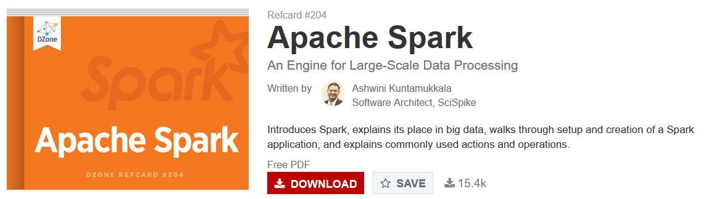](https://dzone.com/refcardz/apache-spark)

[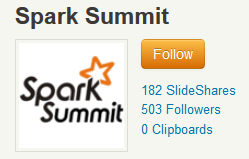](http://www.slideshare.net/SparkSummit)

[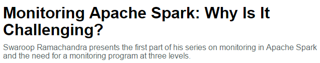](https://dzone.com/articles/monitoring-apache-spark-why-is-it-challenging)

<iframe width="420" height="315" src="https://www.youtube.com/embed/SxAxAhn-BDU?rel=0" frameborder="0" allowfullscreen class="video"></iframe>

 

<iframe src="//www.slideshare.net/slideshow/embed_code/key/3cLVU92uuyRgsY" width="595" height="485" frameborder="0" marginwidth="0" marginheight="0" scrolling="no" style="border:1px solid #CCC; border-width:1px; margin-bottom:5px; max-width: 100%;" allowfullscreen class="video"> </iframe> 
 <strong> <a href="//www.slideshare.net/AmazonWebServices/aws-april-2016-webinar-series-best-practices-for-apache-spark-on-aws" title="AWS April 2016 Webinar Series - Best Practices for Apache Spark on AWS" target="_blank">AWS April 2016 Webinar Series - Best Practices for Apache Spark on AWS</a> </strong> from <strong><a href="//www.slideshare.net/AmazonWebServices" target="_blank">Amazon Web Services</a></strong> 

 

<iframe src="//www.slideshare.net/slideshow/embed_code/key/6w1YDpWgu5J35g" width="595" height="485" frameborder="0" marginwidth="0" marginheight="0" scrolling="no" style="border:1px solid #CCC; border-width:1px; margin-bottom:5px; max-width: 100%;" allowfullscreen class="video"> </iframe> 
 <strong> <a href="//www.slideshare.net/AnyaBida/bida-sse2016final-58237248" title="Spark Tuning For Enterprise System Administrators, Spark Summit East 2016" target="_blank">Spark Tuning For Enterprise System Administrators, Spark Summit East 2016</a> </strong> from <strong><a href="//www.slideshare.net/AnyaBida" target="_blank">Anya Bida</a></strong> 

 

[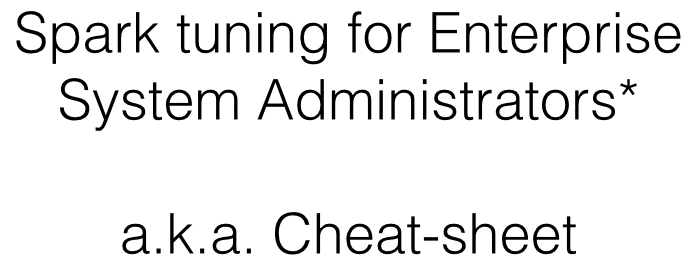](http://techsuppdiva.github.io/)

<iframe src="//www.slideshare.net/slideshow/embed_code/key/ieavopd54RBwfC" width="595" height="485" frameborder="0" marginwidth="0" marginheight="0" scrolling="no" style="border:1px solid #CCC; border-width:1px; margin-bottom:5px; max-width: 100%;" allowfullscreen class="video"> </iframe> 
 <strong> <a href="//www.slideshare.net/SparkSummit/structuring-spark-dataframes-datasets-and-streaming-by-michael-armbrust" title="Structuring Spark: DataFrames, Datasets, and Streaming by Michael Armbrust" target="_blank">Structuring Spark: DataFrames, Datasets, and Streaming by Michael Armbrust</a> </strong> from <strong><a href="//www.slideshare.net/SparkSummit" target="_blank">Spark Summit</a></strong> 

 

### Apache Hadoop
- [bigdataanalyticsnews.com: 6 Essential Steps to Successfully Implement Hadoop](http://bigdataanalyticsnews.com/6-essential-steps-to-successfully-implement-hadoop/)
- [examples.javacodegeeks.com: Apache Hadoop Cluster Setup Example (with Virtual Machines)](http://examples.javacodegeeks.com/enterprise-java/apache-hadoop/apache-hadoop-cluster-setup-example-virtual-machines/)
- [information-age.com: 5 ways to get more out of Hadoop](http://www.information-age.com/technology/information-management/123460762/5-ways-get-more-out-hadoop)
- [datafloq.com: 10 Things to Consider Before Diving Into the Hadoop Data Lake](https://datafloq.com/read/10-things-consider-diving-into-hadoop-data-lake/1805)
- [16 for '16: What you must know about Hadoop and Spark right now](http://www.infoworld.com/article/3019754/application-development/16-things-you-should-know-about-hadoop-and-spark-right-now.html)

[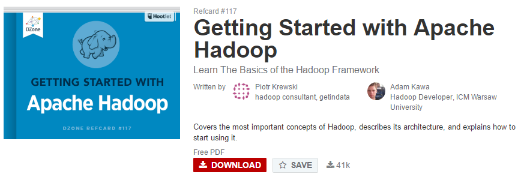](https://dzone.com/refcardz/getting-started-apache-hadoop)

[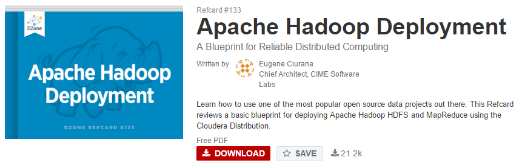](https://dzone.com/refcardz/deploying-hadoop)

#### Cloudera Docker image
- [pythian.com: how to deploy a cluster](http://www.pythian.com/blog/how-to-deploy-cluster/)
- [Cloudera Docker Container](http://www.cloudera.com/content/www/en-us/documentation/enterprise/latest/topics/quickstart_docker_container.html)

### Apache Storm and Kite SDK Morphlines
- Apache Storm is a distributed streaming processing engine
- Kite SDK Morphlines is a configurable ETL engine
- [javacodegeeks.com: Apache Storm and Kite SDK Morphlines. Building a configurable ETL distributed application](http://www.javacodegeeks.com/2016/01/configurable-etl-processing-using-apache-storm-kite-sdk-morphlines.html)

### Pentaho Data Integration and Business Analytics Platforms
- [Pentaho](http://www.pentaho.com/)
- [pentaho.com/marketplace](http://www.pentaho.com/marketplace)

[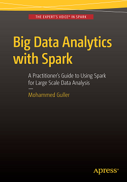](http://www.wowebook.org/big-data-analytics-with-spark-a-practitioners-guide-to-using-spark-for-large-scale-data-analysis.html)

[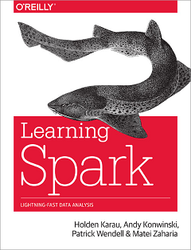](http://www.wowebook.org/learning-spark-lightning-fast-big-data-analysis.html)

[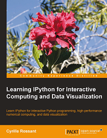](http://www.wowebook.org/learning-ipython-for-interactive-computing-and-data-visualization.html)

[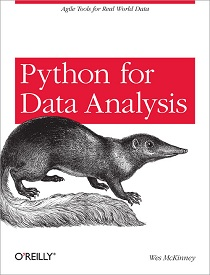](http://www.wowebook.org/python-for-data-analysis.html)

<iframe width="560" height="315" src="https://www.youtube.com/embed/CbKCzgzVNh4?list=PL5L8qNT_l7Cn4B_UKV_aN6H60nChGDMYu" frameborder="0" allowfullscreen class="video"></iframe>

 

<iframe width="560" height="315" src="https://www.youtube.com/embed/73DMPaVzTls?rel=0" frameborder="0" allowfullscreen class="video"></iframe>

 
