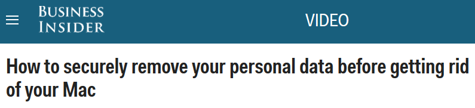
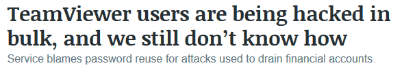
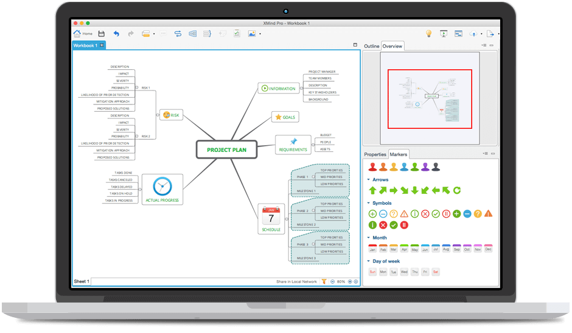
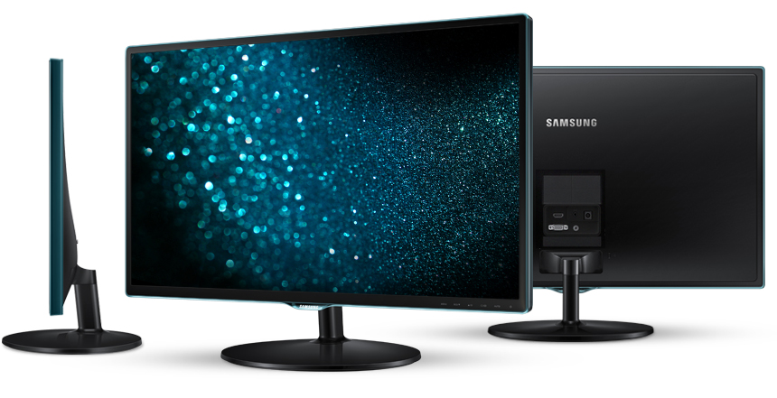
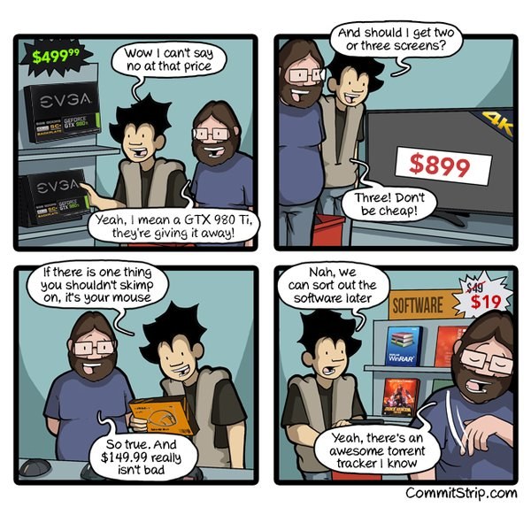
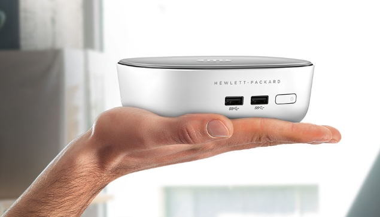

**Table of Contents**
<!-- MarkdownTOC -->

- [Desktop Tools](#desktop-tools)
	- [Internet speed. Test de velocidad](#internet-speed-test-de-velocidad)
	- [Excel](#excel)
	- [Evernote](#evernote)
		- [Evernote on Twitter](#evernote-on-twitter)
	- [Trello](#trello)
	- [Outlook](#outlook)
	- [ProtonMail](#protonmail)
	- [Thunderbird](#thunderbird)
		- [Thunderbird and GMail](#thunderbird-and-gmail)
		- [Thunderbird Extensions](#thunderbird-extensions)
	- [Firefox](#firefox)
		- [Firefox Extensions](#firefox-extensions)
	- [Chrome](#chrome)
	- [Mind mapping software. Mapas Mentales](#mind-mapping-software-mapas-mentales)
	- [Monitors](#monitors)
- [Presentations](#presentations)
- [HP Mini PC](#hp-mini-pc)
- [This is my desk at Red Hat](#this-is-my-desk-at-red-hat)

<!-- /MarkdownTOC -->

<a href="http://nixcraft.tumblr.com/post/138983952737/the-linux-user-experience-via">http://nixcraft.tumblr.com/post/138983952737/the-linux-user-experience-via</a>

<blockquote class="twitter-tweet tw-align-center" data-lang="es">
The face I make when my company force me to use only Windows 10 at workplace instead of OS X or Linux :( <a href="https://twitter.com/hashtag/sysadmin?src=hash">#sysadmin</a> <a href="https://t.co/Qfu8KdwvwS">pic.twitter.com/Qfu8KdwvwS</a>
&mdash; nixCraft (@nixcraft) <a href="https://twitter.com/nixcraft/status/710168035991134214">16 de marzo de 2016</a></blockquote>

# Desktop Tools
- [41 Awesome Productivity Tools to Help Grow Your Brand](http://www.seanogle.com/guest-posts/41-productivity-tools)
- [How to avoid 'death by PowerPoint'](http://www.bbc.com/news/technology-35038429) These days, there are plenty of alternatives to PowerPoint - [Keynote](http://www.apple.com/mac/keynote/), [Slides](https://slides.com/), [Prezi](https://prezi.com), [SlideRocket](http://www.sliderocket.com/), [Easel.ly](http://easel.ly/), [Emaze](https://www.emaze.com), [Slidedog](http://slidedog.com/), to name but a few - many of which are freely available online.
- [five.sentenc.es: email productivity](http://five.sentenc.es/)
- [Why one tech CEO doesn't let employees email each other](http://www.businessinsider.com/atmoic-212-doesnt-use-internal-email-2016-1)
- [HP Pavilion Mini PC](http://store.hp.com/webapp/wcs/stores/servlet/ContentView%3FstoreId%3D10151%26eSpotName%3DHPPavilionMini)
- [forbes.com: Best 5 Future-Proof Laptops For 2016: 12-inch MacBook, Surface Book, Dell XPS 13, HP EliteBook](http://www.forbes.com/sites/brookecrothers/2015/12/31/best-5-future-proof-laptops-heading-into-2016-apple-microsoft-dell-hp/)
- [laptops.reviewed.com: The Editors' Choice winning @Dell XPS 15 could be the best Windows laptop yet](http://laptops.reviewed.com/content/dell-xps-15)
- [This new Samsung laptop is shockingly thin and light](http://www.techinsider.io/samsung-notebook-9-2016-1)
- [cyberciti.biz: 10 Places To Buy A Laptop With Linux Preloaded](http://www.cyberciti.biz/hardware/laptop-computers-with-linux-installed-or-preloaded/)
- [zdnet: CES 2016: These are the best laptops, tablets, and portable PCs](http://www.zdnet.com/pictures/best-new-laptops-tablets-gadgets-ces-2016-pictures/)
- [15 must-have apps if you’re new to Linux](http://www.gadgette.com/2016/02/23/15-linux-apps/)
- [Hubl.in, the Awesome open source video conference service](https://hubl.in/)

<blockquote class="twitter-tweet tw-align-center" data-lang="es">
Hubl.in, the Awesome open source video conference service <a href="https://t.co/eZXI26TQHE">https://t.co/eZXI26TQHE</a>
&mdash; nixCraft (@nixcraft) <a href="https://twitter.com/nixcraft/status/709891079261147137">15 de marzo de 2016</a></blockquote>

<blockquote class="twitter-tweet tw-align-center" data-lang="es">
5 aplicaciones de oficina que debes conocer ➡ <a href="https://t.co/I65vC8o5ID">https://t.co/I65vC8o5ID</a> <a href="https://twitter.com/hashtag/pymes?src=hash">#pymes</a> <a href="https://twitter.com/hashtag/Aplicateca?src=hash">#Aplicateca</a> <a href="https://t.co/Ql218S9ajl">pic.twitter.com/Ql218S9ajl</a>
&mdash; Movistar pymes (@Movistar_pymes) <a href="https://twitter.com/Movistar_pymes/status/711945905331687424">21 de marzo de 2016</a></blockquote>

<blockquote class="twitter-tweet tw-align-center" data-lang="es">
<a href="https://twitter.com/hashtag/Herramientas?src=hash">#Herramientas</a> colaborativas, una nueva forma de trabajar ➡ <a href="https://t.co/HHqjef3C2c">https://t.co/HHqjef3C2c</a> <a href="https://t.co/T4ySF21kh1">pic.twitter.com/T4ySF21kh1</a>
&mdash; Movistar pymes (@Movistar_pymes) <a href="https://twitter.com/Movistar_pymes/status/743096210530181122">15 de junio de 2016</a></blockquote>

<iframe width="560" height="315" src="https://www.youtube.com/embed/uj3KlaUFUQM?list=PL0PgyVP0Ux_L4W13d5WEtlZrqCBrrSWdR" frameborder="0" allowfullscreen class="video"></iframe>

 

<iframe width="560" height="315" src="https://www.youtube.com/embed/5I2SqCVw5xs?list=PL0PgyVP0Ux_L4W13d5WEtlZrqCBrrSWdR" frameborder="0" allowfullscreen class="video"></iframe>

 

<blockquote class="twitter-tweet tw-align-center" data-lang="es">
Mattermost is an open source, self-hosted Slack alternative <a href="https://t.co/NX2MKU3RAG">https://t.co/NX2MKU3RAG</a> <a href="https://t.co/EYiVOIjH3Q">pic.twitter.com/EYiVOIjH3Q</a>
&mdash; Alexander Zeitler (@alexzeitler_) <a href="https://twitter.com/alexzeitler_/status/734272525925023744">22 de mayo de 2016</a></blockquote>

<blockquote class="twitter-tweet tw-align-center" data-lang="es">
When to Trello, Slack or video chat - tips for improving team communication <a href="https://t.co/NVOYKK9PdO">https://t.co/NVOYKK9PdO</a> <a href="https://t.co/uJiRqjTbGk">pic.twitter.com/uJiRqjTbGk</a>
&mdash; Trello (@trello) <a href="https://twitter.com/trello/status/739928610954448896">6 de junio de 2016</a></blockquote>

## Internet speed. Test de velocidad
- [fast.com](https://fast.com)
- [speedtest.net](http://www.speedtest.net)
- [sourceforge.net/speedtest](https://sourceforge.net/speedtest/)
- [blog.datapath.io: How to Run a Network Latency Test](http://blog.datapath.io/how-to-run-a-network-latency-test)
- [dslreports.com/speedtest](https://www.dslreports.com/speedtest)
- [website-speedtest.com](http://www.website-speedtest.com)
	- [twitter.com/Web_Speedtest](https://twitter.com/Web_Speedtest)
- [Test de Velocidad](http://www.internautas.org/testvelocidad/)
- [Apps para hacer test de velocidad en Android: Speedtest, Movispeed…](http://foromoviles.com/apps-para-hacer-test-de-velocidad-en-android-speedtest-movispeed/)
- [¿Tienes realmente la velocidad de Internet que has contratado?](http://www.lavanguardia.com/tecnologia/20160216/302202649248/medir-velocidad-internet-contratada.html)
- [nixCraft: How To Install Speedtest-cli On a CentOS/RHEL/Scientific/Fedora Linux To Check Internet Speed](http://www.cyberciti.biz/faq/install-speedtest-cli-on-centos-redhat-fedoa-scientific-to-measure-internetspeed/)

<blockquote class="twitter-tweet tw-align-center" data-lang="es">
Check out my <a href="https://twitter.com/Ookla">@Ookla</a> Speedtest result! What&#39;s your speed? <a href="https://t.co/gDhttuUPA1">https://t.co/gDhttuUPA1</a> <a href="https://twitter.com/hashtag/speedtest?src=hash">#speedtest</a>
&mdash; ThePrussianPrince (@PrussianPrince1) <a href="https://twitter.com/PrussianPrince1/status/696671216808153088">febrero 8, 2016</a></blockquote>

<blockquote class="twitter-tweet tw-align-center" data-lang="es">
Awesome site from <a href="https://twitter.com/netflix">@netflix</a> to show you how fast your internet connection is <a href="https://t.co/BcTNRXV7fJ">https://t.co/BcTNRXV7fJ</a> 👍<a href="https://twitter.com/hashtag/html5?src=hash">#html5</a> ready 😀 <a href="https://t.co/DtkIBrLb0U">pic.twitter.com/DtkIBrLb0U</a>
&mdash; nixCraft (@nixcraft) <a href="https://twitter.com/nixcraft/status/733001877269282816">18 de mayo de 2016</a></blockquote>

## Excel
- [Learning Excel isn't just for finance professionals, it can boost anyone's productivity at work — here’s how](http://www.businessinsider.com/master-microsoft-excel-basics-beginner-online-course-udemy-deal-2016-2)
- [Lynda.com Excel Tips](http://www.lynda.com/Excel-tutorials/Excel-Tips/363001-2.html)

<blockquote class="twitter-tweet tw-align-center" data-lang="es">
beautiful video of windows 95&#39;s launch <a href="https://t.co/ETeR0JQK2d">pic.twitter.com/ETeR0JQK2d</a>
&mdash; Owen Williams ⚡️ (@ow) <a href="https://twitter.com/ow/status/698034035180888064">febrero 12, 2016</a></blockquote>

<iframe width="560" height="315" src="https://www.youtube.com/embed/lY7eYRSDUx0" frameborder="0" allowfullscreen class="video"></iframe>

 

<iframe width="560" height="315" src="https://www.youtube.com/embed/QWMokH-68WU?rel=0" frameborder="0" allowfullscreen class="video"></iframe>

 

<iframe width='560' height='315' src='https://www.lynda.com/player/embed/505758?fs=3&w=560&h=315&ps=paused&utm_medium=referral&utm_source=embed+video&utm_campaign=ldc-website&utm_content=vid-505758' mozallowfullscreen='true' webkitallowfullscreen='true' allowfullscreen='true' frameborder='0'></iframe>
<strong><a href="http://www.lynda.com/Excel-tutorials/Excel-Tips/363001-2.html" title="Get a new productivity-boosting tip every Tuesday from Excel expert Dennis Taylor.">Excel Tips Weekly</a></strong> by <a href="https://www.lynda.com/author/574677">Dennis Taylor</a>

<blockquote class="twitter-tweet tw-align-center" data-lang="es">
Have you used the Gantt <a href="https://twitter.com/hashtag/chart?src=hash">#chart</a> in Excel before? Use it to take your data to the next level. <a href="https://t.co/FxdDp4rVOR">pic.twitter.com/FxdDp4rVOR</a>
&mdash; Microsoft Excel (@msexcel) <a href="https://twitter.com/msexcel/status/699594080590893056">febrero 16, 2016</a></blockquote>

<blockquote class="twitter-tweet tw-align-center" data-lang="es">
Click Alt+H+A+L to align your text to the left and get your party on. <a href="https://twitter.com/hashtag/ExcelTips?src=hash">#ExcelTips</a> <a href="https://t.co/AzMVYg0jpb">pic.twitter.com/AzMVYg0jpb</a>
&mdash; Microsoft Excel (@msexcel) <a href="https://twitter.com/msexcel/status/697057365477216259">febrero 9, 2016</a></blockquote>

<blockquote class="twitter-tweet tw-align-center" data-lang="es">
Let <a href="https://twitter.com/hashtag/Excel?src=hash">#Excel</a> reformat your data without using a formula! Learn more tips at the <a href="https://twitter.com/hashtag/MSDataSummit?src=hash">#MSDataSummit</a>: <a href="https://t.co/TYOLOzYQcV">https://t.co/TYOLOzYQcV</a> <a href="https://t.co/52fSpLys9M">pic.twitter.com/52fSpLys9M</a>
&mdash; Microsoft Excel (@msexcel) <a href="https://twitter.com/msexcel/status/694627602670227457">febrero 2, 2016</a></blockquote>

<blockquote class="twitter-tweet tw-align-center" data-lang="es">
Did you know you can pin <a href="https://twitter.com/hashtag/Excel?src=hash">#Excel</a> ranges, tables &amp; charts to a <a href="https://twitter.com/hashtag/PowerBI?src=hash">#PowerBI</a> dashboard? Learn more: <a href="https://t.co/SmGEc5iag9">https://t.co/SmGEc5iag9</a> <a href="https://t.co/PhGj7CWRYP">pic.twitter.com/PhGj7CWRYP</a>
&mdash; Microsoft Excel (@msexcel) <a href="https://twitter.com/msexcel/status/695290729619439616">febrero 4, 2016</a></blockquote>

<blockquote class="twitter-tweet tw-align-center" data-lang="es">
Think inside the borders. Press Ctrl+Shift+7 to put borders around cells. <a href="https://t.co/lZUIzNvsDR">https://t.co/lZUIzNvsDR</a> <a href="https://twitter.com/hashtag/ExcelTips?src=hash">#ExcelTips</a> <a href="https://t.co/TQF1sYK8lA">pic.twitter.com/TQF1sYK8lA</a>
&mdash; Microsoft Excel (@msexcel) <a href="https://twitter.com/msexcel/status/692754008335867904">enero 28, 2016</a></blockquote>

<blockquote class="twitter-tweet tw-align-center" data-lang="es">
Top 10 Cheat Sheets to Help You Master Microsoft Office <a href="https://t.co/9ezUmLvCkg">https://t.co/9ezUmLvCkg</a> <a href="https://twitter.com/hashtag/business?src=hash">#business</a> <a href="https://t.co/9TTLFfLAw1">pic.twitter.com/9TTLFfLAw1</a>
&mdash; TechStartupCommunity (@TechStartupCom) <a href="https://twitter.com/TechStartupCom/status/716296565154062336">2 de abril de 2016</a></blockquote>

<blockquote class="twitter-tweet tw-align-center" data-lang="es">
Tres trucos de Excel que te ahorrarán horas de trabajo <a href="https://t.co/TnuPWSKBHM">https://t.co/TnuPWSKBHM</a> <a href="https://t.co/EAE5GXGKca">pic.twitter.com/EAE5GXGKca</a>
&mdash; Cinco Días (@CincoDiascom) <a href="https://twitter.com/CincoDiascom/status/707275727050149888">8 de marzo de 2016</a></blockquote>

<blockquote class="twitter-tweet tw-align-center" data-lang="es">
Cuatro gráficos que nunca se usan en <a href="https://twitter.com/hashtag/Excel?src=hash">#Excel</a> y deberían emplearse ➡ <a href="https://t.co/WhkUYX9fQe">https://t.co/WhkUYX9fQe</a> por <a href="https://twitter.com/Charly_BG">@charly_bg</a>
&mdash; Movistar pymes (@Movistar_pymes) <a href="https://twitter.com/Movistar_pymes/status/712934671336751104">24 de marzo de 2016</a></blockquote>

<blockquote class="twitter-tweet tw-align-center" data-lang="es">
Cómo proteger carpetas con contraseña en Windows 10 de forma sencilla <a href="https://t.co/9nRar7fsQ8">https://t.co/9nRar7fsQ8</a> <a href="https://t.co/fMLH1bc2nY">pic.twitter.com/fMLH1bc2nY</a>
&mdash; Cinco Días (@CincoDiascom) <a href="https://twitter.com/CincoDiascom/status/714887894821810176">29 de marzo de 2016</a></blockquote>

<blockquote class="twitter-tweet tw-align-center" data-lang="es">
Soluciona los problemas al hacer una copia de seguridad programada con Windows <a href="https://t.co/WunlKYgllw">https://t.co/WunlKYgllw</a> <a href="https://t.co/a6JuGyhotB">pic.twitter.com/a6JuGyhotB</a>
&mdash; Cinco Días (@CincoDiascom) <a href="https://twitter.com/CincoDiascom/status/745339289978843137">21 de junio de 2016</a></blockquote>

<blockquote class="twitter-tweet tw-align-center" data-lang="es">
Windows 10 tip: Access symbols, emojis, and other special characters <a href="https://t.co/unu6DvMrDl">https://t.co/unu6DvMrDl</a> via <a href="https://twitter.com/ZDNet">@ZDNet</a> &amp; <a href="https://twitter.com/edbott">@edbott</a> <a href="https://t.co/jCTTJ1TNzG">pic.twitter.com/jCTTJ1TNzG</a>
&mdash; ZDNet (@ZDNet) <a href="https://twitter.com/ZDNet/status/705807072265441280">4 de marzo de 2016</a></blockquote>

<blockquote class="twitter-tweet tw-align-center" data-lang="es">
Windows 10 tip: Reclaim precious disk space with these storage tools <a href="https://t.co/d6qcLsZdOm">https://t.co/d6qcLsZdOm</a> via <a href="https://twitter.com/ZDNet">@ZDNet</a> &amp; <a href="https://twitter.com/edbott">@edbott</a> <a href="https://t.co/WF4mWVaiih">pic.twitter.com/WF4mWVaiih</a>
&mdash; ZDNet (@ZDNet) <a href="https://twitter.com/ZDNet/status/710065280358211584">16 de marzo de 2016</a></blockquote>

<blockquote class="twitter-tweet tw-align-center" data-lang="es">
Please RT <a href="https://twitter.com/SkypeSupport">@SkypeSupport</a>/<a href="https://twitter.com/Microsoft">@Microsoft</a> dropped support for Skype for Linux, we can no longer accept calls. <a href="https://t.co/fjXXuBG4qa">https://t.co/fjXXuBG4qa</a> <a href="https://twitter.com/hashtag/ThanksBill?src=hash">#ThanksBill</a>
&mdash; nixCraft (@nixcraft) <a href="https://twitter.com/nixcraft/status/702474274389372928">febrero 24, 2016</a></blockquote>

<blockquote class="twitter-tweet tw-align-center" data-lang="es">
So, <a href="https://twitter.com/Microsoft">@Microsoft</a> loves linux? But, Ignores skype users?. On a serious note Linux is winning the enterprise server market.
&mdash; nixCraft (@nixcraft) <a href="https://twitter.com/nixcraft/status/706955049071546368">7 de marzo de 2016</a></blockquote>

<blockquote class="twitter-tweet tw-align-center" data-lang="es">
Cómo activar el nuevo antivirus de Windows 10 <a href="https://t.co/1xosOx35sc">https://t.co/1xosOx35sc</a> <a href="https://t.co/aD3KJvsJod">pic.twitter.com/aD3KJvsJod</a>
&mdash; Cinco Días (@CincoDiascom) <a href="https://twitter.com/CincoDiascom/status/736109247360946176">27 de mayo de 2016</a></blockquote>

## Evernote
- [Calendars are simple yet powerful motivational tools. Save these templates to Evernote](https://blog.evernote.com/blog/2015/12/26/resolve-to-stay-on-track-in-the-new-year/)

### Evernote on Twitter
- [twitter.com/evernote](https://twitter.com/evernote)
- [twitter.com/evernotehelps](https://twitter.com/evernotehelps)
- [twitter.com/evernews](https://twitter.com/evernews)
- [twitter.com/Evernote_latam](https://twitter.com/Evernote_latam)
- [twitter.com/evernotelife](https://twitter.com/evernotelife)
- [twitter.com/evernote_es](https://twitter.com/evernote_es)
- [twitter.com/EvernoteStatus](https://twitter.com/EvernoteStatus)
- [twitter.com/evernoteteacher](https://twitter.com/evernoteteacher)
- [twitter.com/evernote_dev](https://twitter.com/evernote_dev)
- [twitter.com/evernote_de](https://twitter.com/evernote_de)
- [twitter.com/evernote_br](https://twitter.com/evernote_br)
- [twitter.com/evernote_fr](https://twitter.com/evernote_fr)
- [https://twitter.com/Evernote_IN](https://twitter.com/Evernote_IN)
- [twitter.com/EvernoteAPAC](https://twitter.com/EvernoteAPAC)

<blockquote class="twitter-tweet tw-align-center" data-lang="es">
Evernote is a great note-taking tool, but it can also be the perfect recipe book: <a href="https://t.co/hKteXEGewt">https://t.co/hKteXEGewt</a> <a href="https://t.co/Xu4vB5IXDY">pic.twitter.com/Xu4vB5IXDY</a>
&mdash; Forbes Tech News (@ForbesTech) <a href="https://twitter.com/ForbesTech/status/735462931773689857">25 de mayo de 2016</a></blockquote>

<blockquote class="twitter-tweet tw-align-center" data-lang="es">
We&#39;ve put together 2016 calendar templates to help you stay organized: <a href="https://t.co/XXcuam8mvu">https://t.co/XXcuam8mvu</a> <a href="https://twitter.com/hashtag/EvernoteTips?src=hash">#EvernoteTips</a> <a href="https://t.co/k869dOGpyw">pic.twitter.com/k869dOGpyw</a>
&mdash; Evernote Helps (@evernotehelps) <a href="https://twitter.com/evernotehelps/status/678968198595670016">diciembre 21, 2015</a></blockquote>

<blockquote class="twitter-tweet tw-align-center" data-lang="es">
Calendars are simple yet powerful motivational tools. Save these templates to Evernote &gt;&gt; <a href="https://t.co/cyfFe9Nml8">https://t.co/cyfFe9Nml8</a> <a href="https://t.co/36bPi2oXH0">pic.twitter.com/36bPi2oXH0</a>
&mdash; evernote (@evernote) <a href="https://twitter.com/evernote/status/697790751384735744">febrero 11, 2016</a></blockquote>

<blockquote class="twitter-tweet tw-align-center" data-lang="es">
15 Productivity Tools Successful People Use to Work Less - Featuring <a href="https://twitter.com/evernote">@evernote</a>! <a href="https://t.co/8ltB6wrqXs">https://t.co/8ltB6wrqXs</a> <a href="https://t.co/Amae7rduOU">pic.twitter.com/Amae7rduOU</a>
&mdash; When I Work (@wheniwork) <a href="https://twitter.com/wheniwork/status/695723849229471745">febrero 5, 2016</a></blockquote>

<blockquote class="twitter-tweet tw-align-center" data-lang="es">
We have the tools to keep your goals on track in 2016: 1. Calendars 2. Checklists 3. Note links Learn more &gt;&gt; <a href="https://t.co/GlWeG9Alsp">https://t.co/GlWeG9Alsp</a>
&mdash; evernote (@evernote) <a href="https://twitter.com/evernote/status/694895911592411136">febrero 3, 2016</a></blockquote>

<blockquote class="twitter-tweet tw-align-center" data-lang="es">
What&#39;s in a name? Tips and tricks for note titles in Evernote by <a href="https://twitter.com/simplifydays">@simplifydays</a> <a href="https://t.co/XM8J5NmNXU">https://t.co/XM8J5NmNXU</a>
&mdash; evernote (@evernote) <a href="https://twitter.com/evernote/status/699293944375570432">febrero 15, 2016</a></blockquote>

<blockquote class="twitter-tweet tw-align-center" data-lang="es">
Did you know that you can add Windows screen captures directly to Evernote? <a href="https://t.co/kiAUUyJCue">https://t.co/kiAUUyJCue</a> <a href="https://twitter.com/hashtag/EvernoteTips?src=hash">#EvernoteTips</a> <a href="https://t.co/90fG2gHYf8">pic.twitter.com/90fG2gHYf8</a>
&mdash; Evernote Helps (@evernotehelps) <a href="https://twitter.com/evernotehelps/status/679700527471435778">diciembre 23, 2015</a></blockquote>

<blockquote class="twitter-tweet tw-align-center" data-lang="es">
Instructions for how to create and customize tables in Evernote: <a href="https://t.co/CmId15SGVW">https://t.co/CmId15SGVW</a> <a href="https://twitter.com/hashtag/EvernoteTips?src=hash">#EvernoteTips</a> <a href="https://t.co/Eum74BZP6Z">pic.twitter.com/Eum74BZP6Z</a>
&mdash; Evernote Helps (@evernotehelps) <a href="https://twitter.com/evernotehelps/status/676793901538127872">diciembre 15, 2015</a></blockquote>

## Trello
- [trello.com](https://trello.com)
- [Using Trello For A Job Search: Less Stress, More Process](http://blog.trello.com/using-trello-for-a-job-search-less-stress-more-process/)
- [GitHub And Trello: Integrate Your Commits](http://blog.trello.com/github-and-trello-integrate-your-commits/)
- [Using Trello for Agile Software Development: The Complete Guide 🌟](https://rexadrivan.wordpress.com/2015/07/26/using-trello-for-agile-developments/)
- [IT Made EZ: Managing Trello As An IT Support System 🌟](http://blog.trello.com/easy-to-use-it-support-system/)

<blockquote class="twitter-tweet tw-align-center" data-lang="es">
At over 50% remote, here are some tools &amp; tips that help us manage our teams - <a href="https://t.co/epV8CRF7qU">https://t.co/epV8CRF7qU</a> <a href="https://t.co/N8i3h0VODy">pic.twitter.com/N8i3h0VODy</a>
&mdash; Trello (@trello) <a href="https://twitter.com/trello/status/700749202591092737">febrero 19, 2016</a></blockquote>

<blockquote class="twitter-tweet tw-align-center" data-lang="es">
Agile isn&#39;t just for devs! Learn how to implement the <a href="https://twitter.com/hashtag/agile?src=hash">#agile</a> process with your team - <a href="https://t.co/TNI2UpCCWu">https://t.co/TNI2UpCCWu</a> <a href="https://t.co/s7uy1DQDqT">pic.twitter.com/s7uy1DQDqT</a>
&mdash; Trello (@trello) <a href="https://twitter.com/trello/status/700592660801679361">febrero 19, 2016</a></blockquote>

<blockquote class="twitter-tweet tw-align-center" data-lang="es">
On the job hunt this weekend? Organize applications &amp; interviews in Trello <a href="https://t.co/HAotII6v6J">https://t.co/HAotII6v6J</a> <a href="https://t.co/rj93N8KPL2">pic.twitter.com/rj93N8KPL2</a>
&mdash; Trello (@trello) <a href="https://twitter.com/trello/status/701073876701175808">febrero 20, 2016</a></blockquote>

<blockquote class="twitter-tweet tw-align-center" data-lang="es">
5 open source alternatives to Trello <a href="https://t.co/hRxWcRLuSM">https://t.co/hRxWcRLuSM</a> via <a href="https://twitter.com/opensourceway">@opensourceway</a> <a href="https://t.co/IWXy4FVasv">pic.twitter.com/IWXy4FVasv</a>
&mdash; Red Hat Partners (@RedHatPartners) <a href="https://twitter.com/RedHatPartners/status/734912845557665792">24 de mayo de 2016</a></blockquote>

## Outlook
- [Email Client Market Share](https://emailclientmarketshare.com)
- [Outlook 2016’s New POP3 Bug Deletes Your Emails!](http://wp.josh.com/2016/02/24/outlook-2016s-new-pop3-bug-deletes-your-emails/)

<blockquote class="twitter-tweet tw-align-center" data-lang="es">
Heads up for the email server admins. Outlook 2016’s New POP3 Bug Deletes Your Emails <a href="https://twitter.com/hashtag/infosec?src=hash">#infosec</a> <a href="https://twitter.com/hashtag/security?src=hash">#security</a> <a href="https://twitter.com/hashtag/Microsoft?src=hash">#Microsoft</a>  <a href="https://t.co/vLbphMvlSj">https://t.co/vLbphMvlSj</a>
&mdash; nixCraft (@nixcraft) <a href="https://twitter.com/nixcraft/status/703838533413285888">28 de febrero de 2016</a></blockquote>

## ProtonMail
- [Announcement: ProtonMail has launched worldwide!](https://protonmail.com/blog/protonmail-launch-worldwide/)

## Thunderbird
- [emailmafia.net](http://emailmafia.net)
- [twitter.com/mozthunderbird](https://twitter.com/mozthunderbird)
- [twitter.com/mozcalendar](https://twitter.com/mozcalendar)
- [support.mozilla.org](https://support.mozilla.org)
	- [Support Mozilla on twitter](https://twitter.com/SUMO_Mozilla)
- [Filelink for Large Attachments](https://support.mozilla.org/en-US/kb/filelink-large-attachments)
- [Thunderbird Daily on Youtube: Some great productivity tips for Thunderbird](https://www.youtube.com/channel/UCCiqw9IULdRxig5e-fcPo6A)
	- [Check out this video to learn how to automatically tag email using the quickFilters add-on for Thunderbird](https://www.youtube.com/watch?v=aSfPVi6g8RY)
- [Saving bandwidth on Google Chrome and Mozilla Thunderbird](http://jjamwal.in/yayavar/saving-bandwidth-on-google-chrome-and-mozilla-thunderbird/)
- [Safe Mode Thunderbird](https://support.mozilla.org/en-US/kb/safe-mode-thunderbird)
- [How to Merge Email Threads in Mozilla Thunderbird](https://stosu.com/how-to-merge-email-threads-in-mozilla-thunderbird/)
- [Global Search 🌟](https://support.mozilla.org/en-US/kb/global-search)
- [New in Thunderbird 38.0 🌟](https://support.mozilla.org/en-US/kb/new-thunderbird-38)
	- [Expanded Folder Pane columns 🌟](https://support.mozilla.org/en-US/kb/new-thunderbird-38#w_expanded-folder-pane-columns)
- [Novedades de Thunderbird 38.0](https://support.mozilla.org/es/kb/novedades-de-thunderbird-38)
	- [Columnas del panel de carpetas](https://support.mozilla.org/es/kb/novedades-de-thunderbird-38#w_columnas-del-panel-de-carpetas)
- [Configurar correo de Office 365 en Mozilla Thunderbird](http://blog.jgaitpro.com/configurar-correo-de-office-365-en-mozilla-thunderbird/)

### Thunderbird and GMail
- [thunderbird and gmail](https://support.mozilla.org/en-US/kb/thunderbird-and-gmail)
- [Recommended IMAP client settings 🌟](https://support.google.com/mail/answer/78892)
- [Enable IMAP in your Gmail settings](https://support.google.com/mail/answer/77695)
- [quickfilters.mozdev.org 🌟](http://quickfilters.mozdev.org)
	
### Thunderbird Extensions
- [Provider for Google Calendar](https://addons.mozilla.org/thunderbird/addon/provider-for-google-calendar)
- [gContactSync](https://addons.mozilla.org/thunderbird/addon/gcontactsync/)
- [ThunderSec](https://addons.mozilla.org/en-US/thunderbird/addon/thundersec/)
- [EnigMail OpenPGP Email Security](https://www.enigmail.net)
- [Today's messages](https://addons.mozilla.org/en-US/thunderbird/addon/todays-messages)
- [Ericsson/exchangecalendar](https://github.com/Ericsson/exchangecalendar) Exchange 2007/2010/2013 Calendar, Tasks, Contacts and GAL Provider
- [FoxClocks](https://addons.mozilla.org/en-US/thunderbird/addon/foxclocks/)
- [quickFilters](https://addons.mozilla.org/en-US/thunderbird/addon/quickfilters/)
- [quickFolders](https://addons.mozilla.org/en-US/thunderbird/addon/quickfolders-tabbed-folders/)
- [search for sender](https://addons.mozilla.org/en-US/thunderbird/addon/search-for-sender/)
- [Signature Switch](https://addons.mozilla.org/en-US/thunderbird/addon/signature-switch/)
- [Tag Toolbar](https://addons.mozilla.org/en-US/thunderbird/addon/tag-toolbar/)
- [ProfileSwitcher](https://addons.mozilla.org/en-US/thunderbird/addon/profileswitcher/)
- [Maximize Message Pane](https://addons.mozilla.org/en-US/thunderbird/addon/maximize-message-pane/)
- [ConfigDate](https://addons.mozilla.org/en-US/thunderbird/addon/configdate/)
- [Calendar Tweaks](https://addons.mozilla.org/en-US/thunderbird/addon/calendar-tweaks/)
- [Autohide Folders panel](https://addons.mozilla.org/en-US/thunderbird/addon/auto-hide-folders-panel/)
- [AddressBookTab](https://addons.mozilla.org/en-US/thunderbird/addon/addressbooktab)
- [Google Calendar Tab](https://addons.mozilla.org/en-US/thunderbird/addon/google-calendar-tab/)
- [Contact Tabs](https://addons.mozilla.org/en-US/thunderbird/addon/contact-tabs/)
- [Stationery](https://addons.mozilla.org/en-US/thunderbird/addon/stationery/)
- [Subject Manager](https://addons.mozilla.org/en-US/thunderbird/addon/subject-manager/)
- [Return Receipt Toolbar Button](https://addons.mozilla.org/en-US/thunderbird/addon/return-receipt-toolbar-button/)
- [Zoom button](https://addons.mozilla.org/en-US/thunderbird/addon/zoom-button-for-thunderbird)
- [Toolbar Buttons](https://addons.mozilla.org/en-US/thunderbird/addon/toolbar-buttons)
- [Add-on Update Checker](https://addons.mozilla.org/en-US/thunderbird/addon/addon-update-checker)
- [Addons Manager Hilite](https://addons.mozilla.org/en-US/thunderbird/addon/addons-manager-hilite)
- [Cleanest Addon Manager](https://addons.mozilla.org/en-US/thunderbird/addon/cam)
- [Archive This](https://addons.mozilla.org/en-US/thunderbird/addon/archive-this)
- [Awesome Auto Archive](https://addons.mozilla.org/en-US/thunderbird/addon/awesome-auto-archive)
- [CompactHeader](https://addons.mozilla.org/en-US/thunderbird/addon/compactheader)
- [Get all mails](https://addons.mozilla.org/en-US/thunderbird/addon/get-all-mails/)

<iframe width="560" height="315" src="https://www.youtube.com/embed/aSfPVi6g8RY?rel=0" frameborder="0" allowfullscreen class="video"></iframe>

 

<iframe width="560" height="315" src="https://www.youtube.com/embed/_mIxeZeNXqA?rel=0" frameborder="0" allowfullscreen class="video"></iframe>

 

<iframe width="560" height="315" src="https://www.youtube.com/embed/ndUamqfCKos?rel=0" frameborder="0" allowfullscreen class="video"></iframe>

 

<blockquote class="twitter-tweet tw-align-center" data-lang="es">
Thunderbird continues to grow, exceeding 10,000,000 active daily users for the first time ever on November 30 2015.
&mdash; Thunderbird (@mozthunderbird) <a href="https://twitter.com/mozthunderbird/status/673715529350123521">diciembre 7, 2015</a></blockquote>

<blockquote class="twitter-tweet tw-align-center" data-lang="es">
Expanding use, news on the next major release, and a temporary home for Thunderbird. Check out our latest blog: <a href="https://t.co/KjxUaQIT0I">https://t.co/KjxUaQIT0I</a>
&mdash; Thunderbird (@mozthunderbird) <a href="https://twitter.com/mozthunderbird/status/674461434340741121">diciembre 9, 2015</a></blockquote>

<blockquote class="twitter-tweet tw-align-center" data-lang="es">
<a href="https://twitter.com/hashtag/Thunderbird?src=hash">#Thunderbird</a> seems to be the most famous <a href="https://twitter.com/hashtag/opensource?src=hash">#opensource</a> <a href="https://twitter.com/hashtag/email?src=hash">#email</a> client. <a href="https://t.co/XZ8MLGYyUN">pic.twitter.com/XZ8MLGYyUN</a>
&mdash; Ivan Bilimov (@ibilimov) <a href="https://twitter.com/ibilimov/status/696564628122423296">febrero 8, 2016</a></blockquote>

<blockquote class="twitter-tweet tw-align-center" data-lang="es">
ThunderSec for <a href="https://twitter.com/mozthunderbird">@mozthunderbird</a> is 1 year old. Steady, consistent growth to almost 400 daily users and it continues. <a href="https://t.co/GLt966KCYR">pic.twitter.com/GLt966KCYR</a>
&mdash; Ilker Temir (@IlkerTemir) <a href="https://twitter.com/IlkerTemir/status/698780368694935552">febrero 14, 2016</a></blockquote>

<blockquote class="twitter-tweet tw-align-center" data-lang="es">
The Provider for Google Calendar 2.7 fixes a massive performance issue with the “Birthdays&quot; calendar. Try it out! <a href="https://t.co/MW9XMdSYyw">https://t.co/MW9XMdSYyw</a>
&mdash; Mozilla Calendar (@mozcalendar) <a href="https://twitter.com/mozcalendar/status/686201247905505280">enero 10, 2016</a></blockquote>

<blockquote class="twitter-tweet tw-align-center" data-lang="es">
Creating an email template in <a href="https://twitter.com/hashtag/Thunderbird?src=hash">#Thunderbird</a> without extension<a href="https://t.co/e7baEc8ULI">https://t.co/e7baEc8ULI</a>
&mdash; Michal Zuber (@michalzuber) <a href="https://twitter.com/michalzuber/status/686450113510772736">enero 11, 2016</a></blockquote>

<blockquote class="twitter-tweet tw-align-center" data-lang="es">
The Andalusian Heath Service is migrating from Microsoft Outlook to Mozilla Thunderbird: <a href="https://t.co/HgXQArZxpC">https://t.co/HgXQArZxpC</a>
&mdash; Thunderbird (@mozthunderbird) <a href="https://twitter.com/mozthunderbird/status/702657216512335872">25 de febrero de 2016</a></blockquote>

## Firefox
- [How to stop Firefox from making automatic connections. #Privacy #Security #Networking](https://support.mozilla.org/en-US/kb/how-stop-firefox-making-automatic-connections)
- [Awesome Firefox addon to prevent tracking via free CDN providers. #Privacy #Security #Infosec #Linux #OSX #Unix](https://addons.mozilla.org/en-US/firefox/addon/decentraleyes)
- [uBlock Origin, an efficient blocker. Easy on CPU and memory](https://addons.mozilla.org/en-US/firefox/addon/ublock-origin/)
- [Keyboard shortcuts - Perform common Firefox tasks quickly](https://support.mozilla.org/en-US/kb/keyboard-shortcuts-perform-firefox-tasks-quickly)
- [Top 10 Firefox shortcut keys everyone should know](http://www.computerhope.com/tips/tip83.htm)
- [accessfirefox.org: Firefox Keyboard and Mouse Shortcuts](https://www.accessfirefox.org/Firefox_Keyboard_and_Mouse_Shortcuts.html)

### Firefox Extensions
- [Click&Clean](https://addons.mozilla.org/en-US/firefox/addon/clickclean)
- [Decentraleyes](https://addons.mozilla.org/en-US/firefox/addon/decentraleyes)
- [Lightbeam](https://addons.mozilla.org/en-US/firefox/addon/lightbeam/)
- [ProfileSwitcher](https://addons.mozilla.org/en-US/firefox/addon/profileswitcher)
- [Tile View](https://addons.mozilla.org/en-US/firefox/addon/tile-view/)
- [uBlock Origin](https://addons.mozilla.org/en-US/firefox/addon/ublock-origin/)
- [Zoom Page](https://addons.mozilla.org/en-US/firefox/addon/zoom-page)

<blockquote class="twitter-tweet tw-align-center" data-lang="es">
You can make the Internet safer! Having updated software defends against threats <a href="https://t.co/scOGWM2nkt">https://t.co/scOGWM2nkt</a> <a href="https://twitter.com/hashtag/DPD16?src=hash">#DPD16</a> <a href="https://t.co/szMhL1brBM">pic.twitter.com/szMhL1brBM</a>
&mdash; Firefox (@firefox) <a href="https://twitter.com/firefox/status/692791712905838593">enero 28, 2016</a></blockquote>

<blockquote class="twitter-tweet tw-align-center" data-lang="es">
When you&#39;re short on time for long articles, save them to your Pocket in Firefox: <a href="https://t.co/fe4WTnFToc">https://t.co/fe4WTnFToc</a> <a href="https://t.co/7gLDH5uYN7">pic.twitter.com/7gLDH5uYN7</a>
&mdash; Firefox (@firefox) <a href="https://twitter.com/firefox/status/687726379778052097">enero 14, 2016</a></blockquote>

<blockquote class="twitter-tweet tw-align-center" data-lang="es">
Tip of the day: Password Manager - Remember, Delete, Change and Import saved passwords in Firefox <a href="https://t.co/NeTYzOPV4z">https://t.co/NeTYzOPV4z</a> <a href="https://twitter.com/hashtag/privacymonth?src=hash">#privacymonth</a>
&mdash; Mozilla India (@MozillaIN) <a href="https://twitter.com/MozillaIN/status/685106168205737984">enero 7, 2016</a></blockquote>

<blockquote class="twitter-tweet tw-align-center" data-lang="es">
You don&#39;t need a 3rd party ad messing up your gift surprises. Browse without being tracked: <a href="https://t.co/DlLkzB3yBI">https://t.co/DlLkzB3yBI</a> <a href="https://t.co/rSDmFMI7Yb">pic.twitter.com/rSDmFMI7Yb</a>
&mdash; Firefox (@firefox) <a href="https://twitter.com/firefox/status/675004553260081152">diciembre 10, 2015</a></blockquote>

<blockquote class="twitter-tweet tw-align-center" data-lang="es">
Who&#39;s been snooping through your online data? Lightbeam will show you: <a href="https://t.co/oR4Ij9GlN0">https://t.co/oR4Ij9GlN0</a>. <a href="https://twitter.com/hashtag/DPD2016?src=hash">#DPD2016</a> <a href="https://t.co/KkIyUSpY6g">pic.twitter.com/KkIyUSpY6g</a>
&mdash; Firefox (@firefox) <a href="https://twitter.com/firefox/status/692386586483384324">enero 27, 2016</a></blockquote>

## Chrome
- [Chromebook keyboard shortcuts](https://support.google.com/chromebook/answer/183101)
- [Tres trucos para ampliar el control sobre las pestañas en Chrome](http://cincodias.com/cincodias/2016/02/12/lifestyle/1455301274_514513.html)

<blockquote class="twitter-tweet tw-align-center" data-lang="es">
Slow internet? Chrome’s Data Saver mode on Android loads pages w/o images saving 70% data. Now in India &amp; Indonesia. <a href="https://t.co/9V3pIZEfC8">pic.twitter.com/9V3pIZEfC8</a>
&mdash; Google Chrome (@googlechrome) <a href="https://twitter.com/googlechrome/status/671531441486893060">diciembre 1, 2015</a></blockquote>

<blockquote class="twitter-tweet tw-align-center" data-lang="es">
To quickly see your browsing history, just click &amp; hold the back arrow to the left of the address bar. <a href="https://twitter.com/hashtag/chrometip?src=hash">#chrometip</a> <a href="https://t.co/uZxxgLbCKE">pic.twitter.com/uZxxgLbCKE</a>
&mdash; Google Chrome (@googlechrome) <a href="https://twitter.com/googlechrome/status/669541939075616768">noviembre 25, 2015</a></blockquote>

<blockquote class="twitter-tweet tw-align-center" data-lang="es">
Have a bunch of tabs open in a single window? Hit &quot;ctrl + [1-9]&quot; (command on Mac) to quickly jump between them. <a href="https://twitter.com/hashtag/chrometip?src=hash">#chrometip</a>
&mdash; Google Chrome (@googlechrome) <a href="https://twitter.com/googlechrome/status/664148016945897472">noviembre 10, 2015</a></blockquote>

## Mind mapping software. Mapas Mentales 
- [XMind](https://www.xmind.net/)

## Monitors
- [reddit.com/r/monitors](https://www.reddit.com/r/monitors)
	- [27 inch 1920 x 1080 worth it?](https://www.reddit.com/r/Monitors/comments/2vs37l/27_inch_1920_x_1080_worth_it/)
	- [24 inch G-sync vs 27 inch Freesync](https://www.reddit.com/r/Monitors/comments/3o3n26/24_inch_gsync_vs_27_inch_freesync/)
	- [Really struggling with choosing a new Monitor!](https://www.reddit.com/r/Monitors/comments/3peu1q/really_struggling_with_choosing_a_new_monitor/)
- [1080p vs 1440p on a 27-inch?](https://www.reddit.com/r/pcgaming/comments/3jjdtp/1080p_vs_1440p_on_a_27inch/)

# Presentations
- [twitter.com/PresGeeks 🌟](https://twitter.com/PresGeeks)
- [blog.slideshare.net: 6 Principles of Influence to Enhance Your Presentations](https://blog.slideshare.net/2015/12/14/6-principles-of-influence-to-enhance-your-presentations/)
- [5 Must-Know Public Speaking Tips for Introverts](http://www.entrepreneur.com/article/229925)
- [fortune.com: 5 ways to fight your fear of public speaking](http://fortune.com/2015/08/06/fear-public-speaking-gary-vaynerchuk/)
- [Does body language help a TED Talk go viral? 5 nonverbal patterns from blockbuster talks](http://blog.ted.com/body-language-survey-points-to-5-nonverbal-features-that-make-ted-talks-take-off/)
- [PresentationGo 🌟🌟](http://www.presentationgo.com) The free PowerPoint library
- [10 ridiculous but brilliant ways to look smart in a meeting](http://uk.businessinsider.com/ridiculous-but-brilliant-ways-to-look-smart-in-a-meeting-2015-3)

<blockquote class="twitter-tweet tw-align-center" data-lang="es">
Is DoD getting a special spyware-free version of Windows 10? Windows 10 To Be Installed On 4 Million DoD computers <a href="https://t.co/uUt0v8wSeM">https://t.co/uUt0v8wSeM</a>
&mdash; nixCraft (@nixcraft) <a href="https://twitter.com/nixcraft/status/700009146578444289">febrero 17, 2016</a></blockquote>

<blockquote class="twitter-tweet tw-align-center" data-lang="es">
Worried that Windows 10 is &#39;spying&#39; on you? Here&#39;s how to take back control <a href="https://t.co/kidxBDbBcf">https://t.co/kidxBDbBcf</a> <a href="https://twitter.com/the_pc_doc">@the_pc_doc</a> <a href="https://t.co/k8DVSPSGrj">pic.twitter.com/k8DVSPSGrj</a>
&mdash; ZDNet (@ZDNet) <a href="https://twitter.com/ZDNet/status/699589095249592320">febrero 16, 2016</a></blockquote>

<blockquote class="twitter-tweet tw-align-center" data-lang="es">
Influx WiFi Maximizing Router dock: Significant signal strength increase for $60 <a href="https://t.co/FaH3sscE1Q">https://t.co/FaH3sscE1Q</a> <a href="https://twitter.com/palmsolo">@palmsolo</a> <a href="https://t.co/uifljSBZNI">pic.twitter.com/uifljSBZNI</a>
&mdash; ZDNet (@ZDNet) <a href="https://twitter.com/ZDNet/status/699581012125286400">febrero 16, 2016</a></blockquote>

# HP Mini PC

# This is my desk at Red Hat

<blockquote class="reddit-card" data-card-created="1463824484"><a href="https://www.reddit.com/r/redhat/comments/45na8c/this_is_my_desk_at_red_hat/?ref=share&ref_source=embed">This is my desk at Red Hat!</a> from <a href="http://www.reddit.com/r/redhat">redhat</a></blockquote>

<blockquote class="twitter-tweet tw-align-center" data-lang="es">
Typical fan boys <a href="https://twitter.com/hashtag/Unix?src=hash">#Unix</a> <a href="https://twitter.com/hashtag/Linux?src=hash">#Linux</a> <a href="https://twitter.com/hashtag/OSX?src=hash">#OSX</a> <a href="https://twitter.com/hashtag/Windows?src=hash">#Windows</a> <a href="https://twitter.com/hashtag/Microsoft?src=hash">#Microsoft</a> <a href="https://t.co/HMjvzt7M9Y">pic.twitter.com/HMjvzt7M9Y</a>
&mdash; nixCraft (@nixcraft) <a href="https://twitter.com/nixcraft/status/709075311497912324">13 de marzo de 2016</a></blockquote>

<blockquote class="twitter-tweet tw-align-center" data-lang="es">
Troubleshooting remote unix or linux box using a SSH client for mobile devices. <a href="https://twitter.com/hashtag/sysadmin?src=hash">#sysadmin</a> <a href="https://twitter.com/hashtag/devops?src=hash">#devops</a> <a href="https://twitter.com/hashtag/IT?src=hash">#IT</a> <a href="https://t.co/YSokvP3YMx">pic.twitter.com/YSokvP3YMx</a>
&mdash; nixCraft (@nixcraft) <a href="https://twitter.com/nixcraft/status/711174710319382528">19 de marzo de 2016</a></blockquote>
