**Table of Contents**
<!-- MarkdownTOC -->

- [DevOps](#devops)
	- [DevOps Blogs and Podcasts](#devops-blogs-and-podcasts)
	- [Description](#description)
	- [Cultura DevOps](#cultura-devops)
	- [Collaborative tools](#collaborative-tools)
	- [DevOps Tools 2016](#devops-tools-2016)
		- [Rundeck](#rundeck)
		- [Server Provisioning and Automation: Red Hat Satellite, Katello, Foreman, Cobbler and others](#server-provisioning-and-automation-red-hat-satellite-katello-foreman-cobbler-and-others)
	- [Agile planning: Scrum, Kanban, Lean](#agile-planning-scrum-kanban-lean)
		- [Javier Garzas](#javier-garzas)
		- [Project Management](#project-management)
			- [Product Owner](#product-owner)
			- [Scrum Master. Scrum Cheat Sheet](#scrum-master-scrum-cheat-sheet)
			- [Open Project](#open-project)
		- [Continuous Integration and Delivery](#continuous-integration-and-delivery)
			- [Continuous Integration Tools](#continuous-integration-tools)
	- [Metrics](#metrics)
	- [Example of DevOps Job description](#example-of-devops-job-description)
- [ITIL](#itil)
	- [Is DevOps replacing ITIL?](#is-devops-replacing-itil)
	- [ITIL Tools](#itil-tools)

<!-- /MarkdownTOC -->

[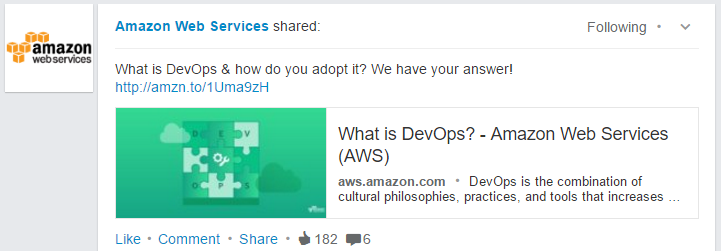](http://aws.amazon.com/devops/what-is-devops/)

<blockquote class="twitter-tweet tw-align-center" data-lang="es">
What is <a href="https://twitter.com/hashtag/DevOps?src=hash">#DevOps</a>, anyway? <a href="https://t.co/0tvL5uQjvx">https://t.co/0tvL5uQjvx</a>
&mdash; Red Hat EMEA (@RedHatEMEA) <a href="https://twitter.com/RedHatEMEA/status/714001576554323968">27 de marzo de 2016</a></blockquote>

<blockquote class="twitter-tweet tw-align-center" data-lang="es">
LOL. Via <a href="https://t.co/HWulUfrhmk">https://t.co/HWulUfrhmk</a> <a href="https://twitter.com/hashtag/humor?src=hash">#humor</a> <a href="https://twitter.com/hashtag/parkinsonslaw?src=hash">#parkinsonslaw</a> <a href="https://t.co/cNcwbP3UyQ">pic.twitter.com/cNcwbP3UyQ</a>
&mdash; nixCraft (@nixcraft) <a href="https://twitter.com/nixcraft/status/714018152120606721">27 de marzo de 2016</a></blockquote>

<blockquote class="twitter-tweet tw-align-center" data-lang="es">
51 Best DevOps Tools for <a href="https://twitter.com/hashtag/DevOps?src=hash">#DevOps</a> Engineers <a href="http://t.co/OYP0PuFoSI">http://t.co/OYP0PuFoSI</a>  What tools are you using?
&mdash; ProfitBricks (@ProfitBricksUSA) <a href="https://twitter.com/ProfitBricksUSA/status/568069464572489729">18 de febrero de 2015</a></blockquote>

[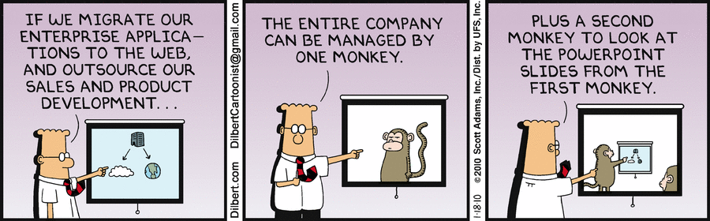](http://dilbert.com/strip/2010-01-18)

<blockquote class="twitter-tweet tw-align-center" data-lang="es">
...<a href="https://twitter.com/hashtag/cloud?src=hash">#cloud</a> + <a href="https://twitter.com/hashtag/analytics?src=hash">#analytics</a> + <a href="https://twitter.com/hashtag/IoT?src=hash">#IoT</a> + <a href="https://twitter.com/hashtag/DevOps?src=hash">#DevOps</a> + <a href="https://twitter.com/hashtag/Dilbert?src=hash">#Dilbert</a> = Priceless Humor <a href="https://t.co/fPnuWQEc2n">pic.twitter.com/fPnuWQEc2n</a>
&mdash; Sharat (@Sharat_Chander) <a href="https://twitter.com/Sharat_Chander/status/717495274663333889">5 de abril de 2016</a></blockquote>

<blockquote class="twitter-tweet tw-align-center" data-lang="es">
Best way to get foot in the door of devops (currently system admin) : devops <a href="https://t.co/2K1dYh93cb">https://t.co/2K1dYh93cb</a> via <a href="https://twitter.com/CodeIgnition">@CodeIgnition</a>
&mdash; Devops Top News (@DevopsTopNews) <a href="https://twitter.com/DevopsTopNews/status/744473901455990784">19 de junio de 2016</a></blockquote>

[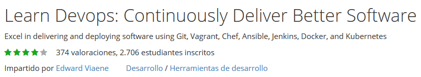](https://www.udemy.com/learn-devops-continuously-deliver-better-software/)

<blockquote class="twitter-tweet tw-align-center" data-lang="es">
Tech jobs report: security, <a href="https://twitter.com/hashtag/DevOps?src=hash">#DevOps</a>, and <a href="https://twitter.com/hashtag/BigData?src=hash">#BigData</a> stay hot <a href="https://t.co/gphg2ibB7W">https://t.co/gphg2ibB7W</a> via <a href="https://twitter.com/infoworld">@infoworld</a> <a href="https://twitter.com/hashtag/cloud?src=hash">#cloud</a> <a href="https://t.co/cVzlNDLS2c">pic.twitter.com/cVzlNDLS2c</a>
&mdash; Paul Denham (@PaulTDenham) <a href="https://twitter.com/PaulTDenham/status/748168909656719360">29 de junio de 2016</a></blockquote>

[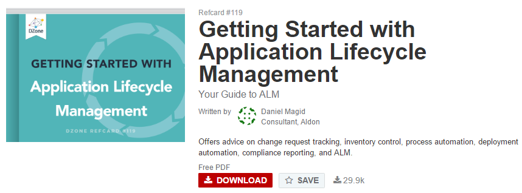](https://dzone.com/refcardz/getting-started-application)

[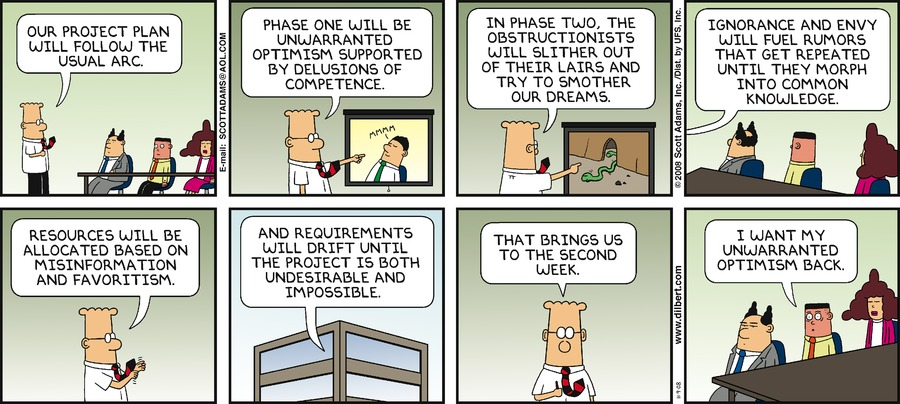](http://dilbert.com/strip/2008-11-09)

# DevOps
## DevOps Blogs and Podcasts
- [devops.com](http://devops.com/)
- [TechBeacon.com](http://techbeacon.com/) Practical Knowledge for dev and tech pros
- [DevOps Library: The Best Videos for the Best Admins](http://devopslibrary.com/)
- [DZone/DevOps Zone](https://dzone.com/devops-tutorials-tools-news)
- [DevOpsCube](http://devopscube.com/)
- [DevOpsSummit Blog](http://devops.sys-con.com/)
- [20 DevOps Leaders to Follow on Twitter](https://dzone.com/articles/20-devops-leaders-to-follow-on-twitter)
- [redhat.com On-demand webinars about DevOps](http://www.redhat.com/en/about/events/devops-webinars)
- [github: DevopsWiki](https://github.com/Leo-G/DevopsWiki) A wiki of Guides, Scripts, Tutorials related to devops
- [Accenture DevOps Blog](https://www.accenture.com/us-en/blogs/blogs-accenture-devops.aspx)
- [List of DevOps Blogs and Resources for Learning](http://devopscube.com/list-of-devops-blogs-and-resources/)
	1. [Dzone DevOps](https://dzone.com/devops-tutorials-tools-news)
	2. [Devops.com](http://devops.com/)
	3. [TechTarget Devops](http://www.techtarget.com/technology/DevOps)
	4. [Devops Sub-Reddit](https://www.reddit.com/r/devops)
	5. [Devops on Quora](https://www.quora.com/topic/DevOps)
	6. [Dev2Ops.org](http://dev2ops.org/)
	7. Linkedin Groups
		- [DevOps](https://www.linkedin.com/groups/2825397)
		- [Devops discussions](https://www.linkedin.com/groups/6585254)
	8. Devops Podcasts
		- [Arrested Devops](https://www.arresteddevops.com)
		- [The ship show](http://theshipshow.com/)
		- [Devops Cafe](http://devopscafe.org/)
		- [The Ops Team](https://channel9.msdn.com/Shows/The-Ops-Team)

<blockquote class="twitter-tweet tw-align-center" data-lang="es">
The Ops Team #023 - &quot;Free, like a Puppy&quot; <a href="https://t.co/wWjB4XzuI1">https://t.co/wWjB4XzuI1</a>  <a href="https://twitter.com/hashtag/devops?src=hash">#devops</a> <a href="https://t.co/doxWZgw9fy">pic.twitter.com/doxWZgw9fy</a>
&mdash; DevOps Guy (@DevopsG) <a href="https://twitter.com/DevopsG/status/750391689861226496">5 de julio de 2016</a></blockquote>

<blockquote class="twitter-tweet tw-align-center" data-lang="es">
<a href="https://twitter.com/hashtag/DevOps?src=hash">#DevOps</a> and CI/CD are an awesome career move! The future of Enterprise IT is here today! <a href="https://t.co/OfpPMtQVBu">pic.twitter.com/OfpPMtQVBu</a>
&mdash; AWS Summits (@AWSSummits) <a href="https://twitter.com/AWSSummits/status/748654562936905728">30 de junio de 2016</a></blockquote>

<blockquote class="twitter-tweet tw-align-center" data-lang="es">
<a href="https://t.co/1YyemsOqr1">https://t.co/1YyemsOqr1</a>
&mdash; RedHatSpain (@RedHatSpain) <a href="https://twitter.com/RedHatSpain/status/747694658759843840">28 de junio de 2016</a></blockquote>

<blockquote class="twitter-tweet tw-align-center" data-lang="es">
Video: <a href="https://twitter.com/hashtag/RedHat?src=hash">#RedHat</a>&#39;s Pierre Olivier Mathis at <a href="https://twitter.com/hashtag/MWC16?src=hash">#MWC16</a> - <a href="https://twitter.com/hashtag/Telcos?src=hash">#Telcos</a> finding the value leveraging <a href="https://twitter.com/hashtag/DevOps?src=hash">#DevOps</a> <a href="https://t.co/IhtGnxscXM">https://t.co/IhtGnxscXM</a> via <a href="https://twitter.com/TIA_Now">@TIA_Now</a>
&mdash; Red Hat Cloud (@RedHatCloud) <a href="https://twitter.com/RedHatCloud/status/710122453360648192">16 de marzo de 2016</a></blockquote>

<blockquote class="twitter-tweet tw-align-center" data-lang="es">
Why Data Center Managers Should Care about DevOps <a href="https://t.co/GdY9WUA25j">https://t.co/GdY9WUA25j</a>  <a href="https://twitter.com/hashtag/devops?src=hash">#devops</a> <a href="https://t.co/CXKfkKZ6QK">pic.twitter.com/CXKfkKZ6QK</a>
&mdash; DevOps Guy (@DevopsG) <a href="https://twitter.com/DevopsG/status/714341406957920256">28 de marzo de 2016</a></blockquote>

[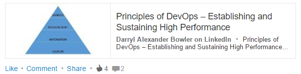](https://www.linkedin.com/pulse/principles-devops-establishing-sustaining-high-bowler)

<iframe src="//www.slideshare.net/slideshow/embed_code/key/ch64DsNKnrQRC1" width="668" height="714" frameborder="0" marginwidth="0" marginheight="0" scrolling="no" style="border:1px solid #CCC; border-width:1px; margin-bottom:5px; max-width: 100%;" allowfullscreen class="video"> </iframe> 
 <strong> <a href="//www.slideshare.net/IQGroup/how-will-devops-benefit-enterprise" title="How will DevOps benefit enterprise? " target="_blank">How will DevOps benefit enterprise? </a> </strong> from <strong><a href="//www.slideshare.net/IQGroup" target="_blank">InterQuest Group</a></strong> 

 

## Description
- [What is DevOps? - In Simple English 🌟🌟](https://youtu.be/_I94-tJlovg)
- [Software Development in the 21st century 🌟🌟🌟](https://www.thoughtworks.com/talks/software-development-21st-century-xconf-europe-2014)
- [New Relic eBook: What is DevOps and Why it Can Help Your Business?](http://newrelic.com/devops-101)
- [slideshare: Jelastic - DevOps for Java with Docker Containers - Madrid 2015](http://www.slideshare.net/jelastic/jelastic-devops-for-java-with-docker-containers-madrid-2015-55033859)
- [ebook: IBM DevOps for Dummies (free)](http://www.ibm.com/ibm/devops/us/en/resources/dummiesbooks/)
- [New Relic: Glossary of DevOps Tools. Get a glimpse into some of New Relic's favorite DevOps tools](http://newrelic.com/devops/toolset)
- [What to Expect From a DevOps Interview 🌟🌟🌟🌟🌟](https://dzone.com/articles/what-to-expect-from-a-devops-interview)
	- [Why You’ll NEVER Nail That DevOps Interview 🌟🌟🌟🌟🌟](https://dzone.com/articles/why-youll-never-nail-that-devops-interview-1)
- [Deloitte: The DevOps Difference](http://deloitte.wsj.com/cio/2014/04/24/the-devops-difference/)
- [MountainWest Devops 2014 - How I Learned to Stop Worrying and Love DevOps](https://youtu.be/uLfIp-2zm6I)
- [DevOps does not negate ITIL or ITSM; they can be leveraged for greater agility](http://www.itworldcanada.com/article/devops-does-not-negate-itil-or-itsm-they-can-be-leveraged-for-greater-agility/379603)
- [thoughtsoncloud.com: Why are we racing to DevOps?](http://www.thoughtsoncloud.com/2015/12/why-are-we-racing-to-devops/)
- [DevOps isn’t just about engineering better processes. It’s also about cultural transformation 🌟](http://cloudcomputing.sys-con.com/node/3588052)
- [How IBM Reduced Time to Development From 120 Days to 3.](https://dzone.com/articles/how-ibm-reduced-time-to-development-from-120-days) A case study on how even large, monolithic corporations can embrace DevOps and decrease their time to development.
- [Operations is Dead, but Please Don’t Replace it with DevOps](http://diversity.net.nz/operations-is-dead-but-please-dont-replace-it-with-devops/2013/05/15/)
- [scriptrock.com free eBook - DevOps: A Cynics Guide](https://www.scriptrock.com/devops-for-cynics)
- [devops.sys-con.com slides - A DevOps State of Mind By @RedHatNews|@DevOpsSummit #DevOps](http://devops.sys-con.com/node/3620720)
	- [slide: A DevOps state of mind, by Chris Van Tuin, Chief Technologist at Red Hat](http://dw.connect.sys-con.com/session/2958/Chris_Van_Tuin.pdf)
- [techspective.net: DevOps works best when everyone is running the same play](http://techspective.net/2016/01/05/devops-works-best-when-everyone-is-running-the-same-play/)
- [DevOps — Metrics, Goals, and Waste](https://dzone.com/articles/devops-metrics-goals-and-waste) Barry Chandler, DevOpsDays London Organizer, reviews how DevOps is measured, as well as the Japanese lean engineering practices it evolved from.
- [Devops — Developers Doing Ops, or Ops Doing Development?](https://dzone.com/articles/devops-developers-doing-ops-or-ops-doing-developme) DevOps encourages collaboration between both development and operations, but is one side taking up more of the workload?
- [DZone: Automate to Save Mental Energy, Not Time. 🌟](https://dzone.com/articles/automate-to-save-mental-energy-not-time-1) Automation doesn't necessarily save time, but it does save mental energy, and there's something to be said for that.
- [zdnet.com: DevOps: Still a big difference between expectation and reality 🌟🌟](http://www.zdnet.com/article/devops-still-a-big-difference-between-expectation-and-reality/) While most IT managers believe that DevOps and agility are important, only around a third believe they have the right infrastructure to implement it, according to a survey.
- [Linkedin: The DevOps Coding Dilemma](https://www.linkedin.com/pulse/devops-coding-dilemma-jason-dumars) Developers don't like being tech support for automation, even if they have 'Ops' as part of their title. 
- [medium.com: DevOps: Shift Left or Be Left](https://medium.com/@drew.firment/devops-shift-left-or-be-left-out-6b2755bd7ee9) The mainstream adoption of cloud computing is accelerating the shift of operations into the hands of developers.
- [Culture over technology: The key to DevOps success 🌟](http://www.cloudcomputing-news.net/news/2016/jan/21/culture-over-technology-key-devops-success/)
- [techbeacon.com: Hiring for DevOps: Look beyond the gurus and ninjas 🌟🌟🌟🌟](http://techbeacon.com/devops-experts-hiring) Defining the term "DevOps expert".  
	- What kind of DevOps? 

	>TK Keanini, CTO of Lancope (recently acquired by Cisco), told me it's not that easy. He compared the search for a DevOps expert to the search for a guitarist to join your band. Lots of people know how to play a guitar, but there are a variety of styles of music that can be played on a guitar, and there's also the element of how well the individual guitarist meshes with the rest of the band. In Keanini's opinion, that is what is most important when it comes to filling a DevOps role.

	>Keanini says, "It is like asking an IT guy if they play DevOps. They should be able to describe to you their role, how they play, and what the music of the band sounds like. The trick here is that there are so many manifestations of successful DevOps teams that you really need to understand it in the context of the business they support, because ultimately that is how DevOps creates value. The customer base expects a certain tempo, and DevOps is the only way to deliver at that tempo."

	>While they can all play a guitar, there is a big difference between a classical guitarist, a heavy metal guitarist, a folk music guitarist, and a pop guitarist. Hiring a classical guitar "expert" to join a heavy metal band won't work, no matter how adept the guitarist is with the instrument. The same thing is true about filling DevOps-oriented roles.

- [YOU: DevOps' people problem. People think they're doing ContinuousDelivery, but they probably aren't. Chucking a copy of The Phoenix Project at the team ain't the answer](http://www.theregister.co.uk/2016/01/15/devops_people_problem/) 
	- [Puppet Labs 2015 State of DevOps Report](https://puppetlabs.com/2015-devops-report)
	- [A CIO's Guide to DevOps. Gartner’s September 2015 survey](http://www.gartner.com/webinar/3165618/)
	- [The Phoenix Projec](http://itrevolution.com/books/phoenix-project-devops-book/)
- [DevOps Without Ops? Is It Possible?](https://dzone.com/articles/devops-without-ops-is-it-possible)
- [Creating a DevOps Culture: Identifying a “Single Person of Failure”](http://www.10thmagnitude.com/tech-blog/creating-a-devops-culture-identifying-a-single-person-of-failure) It’s natural for IT organizations to drift into the single person of failure problem because of these factors. But humans are not highly available—unlike technology, they have limited uptime, have to deal with regular interruptions and can’t be replicated. So IT organizations have to guard against falling into the single person of failure problem and take steps to fix it when it arises.
- [How to get DevOps right](http://www.networkworld.com/article/3029638/application-development/how-to-get-devops-right.html) The Dos and Don’ts of enterprise DevOps
- [Implementing a DevOps Strategy across multiple locations & product teams](http://tech.ticketmaster.com/2016/02/01/implementing-a-devops-strategy-across-multiple-locations-product-teams/)
- [opensource.com - The best ideas win: Community reflections on The Open Organization 🌟](https://opensource.com/open-organization/15/12/introducing-open-organization-field-guide) free e-book
- [accenture.com: DevOps Leadership Culture—Staying Cool When it is Getting Tough](https://www.accenture.com/us-en/blogs/blogs-devops-leadership-culture-staying-cool-when-getting-tough)
- [middlewareblog.redhat.com: Intro to DevOps 🌟](http://middlewareblog.redhat.com/2016/05/25/intro-to-devops/)
- [Chef: Now we know DevOps, how to understand DevOps metrics 🌟🌟🌟](http://www.computerweekly.com/blog/Open-Source-Insider/Chef-Now-we-know-DevOps-how-to-understand-DevOps-metrics) Operational metrics such as Time to Delivery, and Quality of Release are starting to be more widely understood and discussed beyond hardcore DevOps audiences. However, even in DevOps circles and broader IT and company leadership, there’s a lot more fuzziness when it comes to having well defined business goals and working towards them. This is getting better, there’s been a marked improvement over the past three years in particular. I’d say about 45 per cent of the clients we speak to don’t have a direct measurement for business success in mind, when we begin speaking to them. So there’s still a lot of opportunity for progress.
- [Teaching the DevOps soft skills](http://www.devopsonline.co.uk/teaching-the-devops-soft-skills/)
- [Agile Vs. DevOps: 10 Ways They're Different](http://www.informationweek.com/devops/agile-vs-devops-10-ways-theyre-different/d/d-id/1326121) DevOps and Agile are broad terms but they aren't synonyms. Here are the ways in which they're different -- and why those differences matter to your team.

<blockquote class="twitter-tweet tw-align-center" data-lang="es">
You’re doing <a href="https://twitter.com/hashtag/DevOps?src=hash">#DevOps</a> wrong <a href="https://t.co/TMEkxji4yV">https://t.co/TMEkxji4yV</a> via <a href="https://twitter.com/avitus">@avitus</a> <a href="https://twitter.com/TechCrunch">@TechCrunch</a>
&mdash; NGINX, Inc. (@nginx) <a href="https://twitter.com/nginx/status/750800597889196032">6 de julio de 2016</a></blockquote>

<iframe width="560" height="315" src="https://www.youtube.com/embed/_I94-tJlovg?rel=0" frameborder="0" allowfullscreen class="video"></iframe>

 

<iframe width="560" height="315" src="https://www.youtube.com/embed/cus7WYHdQic?rel=0" frameborder="0" allowfullscreen class="video"></iframe>

 

<iframe width="560" height="315" src="https://www.youtube.com/embed/Qhyc1jOvwIg?rel=0" frameborder="0" allowfullscreen class="video"></iframe>

 

<iframe width="560" height="315" src="https://www.youtube.com/embed/-4EY8dz4W3o?rel=0" frameborder="0" allowfullscreen class="video"></iframe>

 

[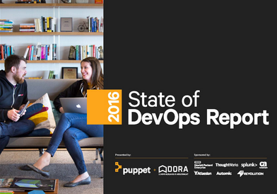](https://puppet.com/resources/white-paper/2016-state-of-devops-report)

<blockquote class="twitter-tweet tw-align-center" data-lang="es">
A Guide for IT Managers <a href="https://t.co/4XKu9wYfnf">https://t.co/4XKu9wYfnf</a>  <a href="https://twitter.com/hashtag/devops?src=hash">#devops</a> <a href="https://t.co/Nk9vjdMhji">pic.twitter.com/Nk9vjdMhji</a>
&mdash; DevOps Guy (@DevopsG) <a href="https://twitter.com/DevopsG/status/716636487832330241">3 de abril de 2016</a></blockquote>

<blockquote class="twitter-tweet tw-align-center" data-lang="es">
Making Security An Integral Part Of DevOps <a href="https://t.co/EyjDGIYgxK">https://t.co/EyjDGIYgxK</a>  <a href="https://twitter.com/hashtag/devops?src=hash">#devops</a> <a href="https://t.co/IyvdI2ZTca">pic.twitter.com/IyvdI2ZTca</a>
&mdash; DevOps Guy (@DevopsG) <a href="https://twitter.com/DevopsG/status/716642452518477826">3 de abril de 2016</a></blockquote>

<blockquote class="twitter-tweet tw-align-center" data-lang="es">
Should <a href="https://twitter.com/hashtag/DevOps?src=hash">#DevOps</a> be applied to all software development within an organisation? <a href="https://twitter.com/AtosSC">@AtosSC</a> <a href="https://twitter.com/Atos">@Atos</a> <a href="https://t.co/GRDrj5igaA">https://t.co/GRDrj5igaA</a> <a href="https://t.co/9JTlnukcs8">pic.twitter.com/9JTlnukcs8</a>
&mdash; Antonio Santos⚙☘️ (@akwyz) <a href="https://twitter.com/akwyz/status/737045860090019840">29 de mayo de 2016</a></blockquote>

<iframe src="//www.slideshare.net/slideshow/embed_code/key/tOdsxSB4MfwWj" width="595" height="485" frameborder="0" marginwidth="0" marginheight="0" scrolling="no" style="border:1px solid #CCC; border-width:1px; margin-bottom:5px; max-width: 100%;" allowfullscreen class="video"> </iframe> 
 <strong> <a href="//www.slideshare.net/CAinc/busting-the-five-biggest-devops-myths" title="Busting the Five Biggest DevOps Myths" target="_blank">Busting the Five Biggest DevOps Myths</a> </strong> from <strong><a href="//www.slideshare.net/CAinc" target="_blank">CA Technologies</a></strong> 

 

<iframe src="//www.slideshare.net/slideshow/embed_code/key/sj4xnBpugXhILh" width="595" height="485" frameborder="0" marginwidth="0" marginheight="0" scrolling="no" style="border:1px solid #CCC; border-width:1px; margin-bottom:5px; max-width: 100%;" allowfullscreen class="video"> </iframe> 
 <strong> <a href="//www.slideshare.net/PuppetLabs/get-executive-backing-for-devops" title="Get Executive Backing for DevOps" target="_blank">Get Executive Backing for DevOps</a> </strong> from <strong><a target="_blank" href="//www.slideshare.net/PuppetLabs">Puppet Labs</a></strong> 

 

<iframe src="//www.slideshare.net/slideshow/embed_code/key/yMLOapknMqbNgF" width="595" height="485" frameborder="0" marginwidth="0" marginheight="0" scrolling="no" style="border:1px solid #CCC; border-width:1px; margin-bottom:5px; max-width: 100%;" allowfullscreen class="video"> </iframe> 
 <strong> <a href="//www.slideshare.net/PuppetLabs/why-your-team-needs-devops" title="Why Your Team Needs DevOps" target="_blank">Why Your Team Needs DevOps</a> </strong> from <strong><a target="_blank" href="//www.slideshare.net/PuppetLabs">Puppet Labs</a></strong> 

 

## Cultura DevOps
- [8 cosas de la cultura startup que aprenden las empresas](https://www.linkedin.com/pulse/8-cosas-de-la-cultura-startup-que-aprenden-las-empresas-cobian) Cómo la cultura startup está influenciando a las grandes empresas. Corporaciones, tomen nota: apliquen o desaparezcan.

<blockquote class="twitter-tweet tw-align-center" data-lang="es">
DevOps maturity is not about developers writing Chef code. It is when when developers prioritize maintaining said scripts same as prod code.
&mdash; Badri Janakiraman (@badrij) <a href="https://twitter.com/badrij/status/722834988387999744">20 de abril de 2016</a></blockquote>

<blockquote class="twitter-tweet tw-align-center" data-lang="es">
Top 5 <a href="https://twitter.com/hashtag/DevOps?src=hash">#DevOps</a> tutorials on <a href="https://twitter.com/hashtag/developerWorks?src=hash">#developerWorks</a> <a href="https://t.co/VZ4YHXszuM">https://t.co/VZ4YHXszuM</a> <a href="https://t.co/Dwr7pZiVEG">pic.twitter.com/Dwr7pZiVEG</a>
&mdash; Marc Peters (@MPetersBE) <a href="https://twitter.com/MPetersBE/status/739069386774831105">4 de junio de 2016</a></blockquote>

## Collaborative tools
- [etherpad.org 🌟](http://etherpad.org)
- [ethercalc.org 🌟](https://ethercalc.org)

## DevOps Tools 2016
- [Top 10 DevOps Tools to look out for in 2016](https://www.linkedin.com/pulse/top-10-devops-tools-look-out-2016-matthew-smith)
	1. [Packaging - FPM](https://github.com/jordansissel/fpm)
	2. [Pipeline - GoCD](https://www.go.cd/)
	3. [Logging - GrayLog](https://www.graylog.org/)
	4. [Container Orchestration - Kubernetes](http://kubernetes.io/)
	5. [Monitoring - Dataloop.IO](https://www.dataloop.io/)
	6. [Alerting - PagerDuty](https://www.pagerduty.com/)
	7. [Deployment - Atlas](https://atlas.hashicorp.com/)
	8. [Cost Control - CloudHealth](https://www.cloudhealthtech.com/)
	9. [PaaS - Drie.co](http://www.drie.co/)
	10. [Configuration management - Ansible](http://www.ansible.com/)
- [devops.com: DevOps in 2016, the year of implementation](http://devops.com/2015/12/22/devops-2016-year-implementation/)
- [dzone.com: Five Software Delivery Industry Predictions for 2016](https://dzone.com/articles/five-software-delivery-industry-predictions-for-20-1)
- [Periodic Table of DevOps Tools 🌟](https://xebialabs.com/periodic-table-of-devops-tools/)
- [oraclejavamagazine-digital.com: 7 Open Source tools for java deployment:Jenkins, Chef, Vagrant, Packer, Docker, Flyway, Rundeck, Go 🌟🌟](http://www.oraclejavamagazine-digital.com/javamagazine_twitter/20140506?pg=6#pg6)
- [oraclejavamagazine-digital.com: Using Docker in Java Applications](http://www.oraclejavamagazine-digital.com/javamagazine_twitter/20151112?pg=52#pg52)
- [How We Use AWS, Ansible, and Packer to Make Deployment Awesome 🌟](https://blog.branch.io/how-we-use-aws-ansible-and-packer-to-make-deployment-awesome)
- [Fabric8 is an integrated open source DevOps and Integration Platform](http://fabric8.io/)
- [DevOps Debates: The Benefits of Tool Standardization 🌟](http://devops.com/2016/01/20/devops-debates-benefits-tool-standardization/)
- [51 Best DevOps Tools for #DevOps Engineers 🌟](https://blog.profitbricks.com/51-best-devops-tools-for-devops-engineers/)

[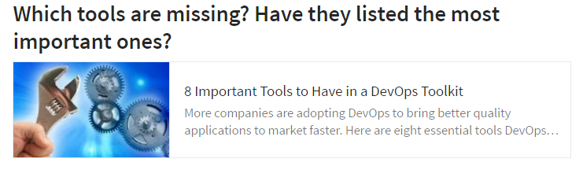](http://www.eweek.com/enterprise-apps/slideshows/8-important-tools-to-have-in-a-devops-toolkit.html)

<blockquote class="twitter-tweet tw-align-center" data-lang="es">
Periodic Table of DevOps Tools <a href="https://t.co/xkWVqwLPkq">https://t.co/xkWVqwLPkq</a> <a href="https://t.co/KQPeAsVzTO">pic.twitter.com/KQPeAsVzTO</a>
&mdash; DevOps Guy (@DevopsG) <a href="https://twitter.com/DevopsG/status/739067366575738880">4 de junio de 2016</a></blockquote>

### Rundeck 
- [rundeck.org](http://rundeck.org/)
- [oraclejavamagazine-digital.com: 7 Open Source tools for java deployment:Jenkins, Chef, Vagrant, Packer, Docker, Flyway, Rundeck, Go](http://www.oraclejavamagazine-digital.com/javamagazine_twitter/20140506?pg=6#pg6)
- [twitter.com/Rundeck](https://twitter.com/Rundeck)

[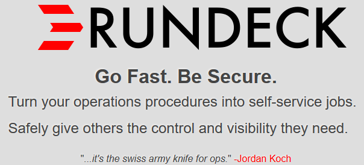](http://rundeck.org/)

<blockquote class="twitter-tweet tw-align-center" data-lang="es">
We just replaced Ansible Tower with Rundeck which is running Ansible tasks in Docker containers. Biggest win of the year already. <a href="https://twitter.com/Rundeck">@Rundeck</a>
&mdash; Bandesz (@bandeszhu) <a href="https://twitter.com/bandeszhu/status/738072407135662083">1 de junio de 2016</a></blockquote>

<iframe src="//www.slideshare.net/slideshow/embed_code/key/eGSBBwR2xQZ8Fk" width="595" height="485" frameborder="0" marginwidth="0" marginheight="0" scrolling="no" style="border:1px solid #CCC; border-width:1px; margin-bottom:5px; max-width: 100%;" allowfullscreen class="video"> </iframe> 
 <strong> <a href="//www.slideshare.net/dev2ops/rundecks-history-and-future" title="Rundeck&#x27;s History and Future" target="_blank">Rundeck&#x27;s History and Future</a> </strong> from <strong><a href="//www.slideshare.net/dev2ops" target="_blank">dev2ops</a></strong> 

 

### Server Provisioning and Automation: Red Hat Satellite, Katello, Foreman, Cobbler and others 
- [nixCraft: Top 5 Open Source Linux Server Provisioning Software](http://www.cyberciti.biz/tips/server-provisioning-software.html)
- [Red Hat Satellite](https://access.redhat.com/products/red-hat-satellite)
	- [redhat.com: Product Documentation for Red Hat Network Satellite](https://access.redhat.com/documentation/en/red-hat-network-satellite/)
	- [community.dell.com: Red Hat Network Satellite administration tips](http://en.community.dell.com/techcenter/os-applications/w/wiki/red-hat-network-satellite-administration-tips)
	- [Satellite 6 and Foreman re-provisioning](https://chruz.wordpress.com/2015/11/23/satellite-6-and-foreman-re-provisioning/)
- [Katello](http://www.katello.org/)
	- [The Katello project is the Open Source, upstream equivalent of the new iteration of Red Hat’s Satellite Server](http://itnerdchronicles.com/katello-one-cloud-to-rule-them-all/)
- [Foreman is a complete lifecycle management tool](http://www.theforeman.org/)
- [Cobbler](http://cobbler.github.io/)
- [Candlepin](http://www.candlepinproject.org/)
- [Pulp](http://www.pulpproject.org/)
- [Puppetlabs' Razor is next generation provisioning software that handles bare metal hardware and virtual server provisioning](https://github.com/puppetlabs/razor-server)
- [Provisioning the Entire Stack](http://devops.sys-con.com/node/3692599)
	- [stackiq.com](http://www.stackiq.com)
	- [stacki.com](http://www.stacki.com) Stacki 3 is Here. The World's Fastest Linux Provisioning Tool.
> When speccing out a datacenter automation or DevOps automation project, look for a server provisioning tool that can hand off to the application provisioning tool of choice, has some subset of application provisioning for complex systems (unless your application provisioning tool is already taking care of that of course), and can be fully automated.
> There are several very good application provisioning tools on the market – Puppet, Chef, Saltstack, Ansible to name a few. A server provisioning tool, as the first step that runs in server-up datacenter automation, should be able to work reliably with all of these.
>  It is easy enough to poke at products and determine if they suit the needs of your level of automation. A good example is that only about half of the products on the market make any attempt at RAID configuration as part of server provisioning. But if operators have to sit and configure RAID before an automated installation, then it’s not really fully automated, is it?
> And of course I recommend that you consider automation. Partially because my employer plays in the space, but moreso because there are far more impactful things operations could be doing than sitting and watching an OS install, or typing in IP addresses, masks, and gateways.

<a href="http://securityreactions.tumblr.com/post/134927085230/when-client-confidently-references-sneakernet">http://securityreactions.tumblr.com/post/134927085230/when-client-confidently-references-sneakernet</a>

## Agile planning: Scrum, Kanban, Lean
- [Manifesto for Agile Software Development 🌟🌟🌟🌟🌟](http://agilemanifesto.org)
- [Scrumguides.org: Scrum’s creators seek definitive place for Scrum knowledge 🌟🌟🌟](http://www.scrumguides.org/)
- [Why estimates never work 🌟🌟🌟](http://www.brandonsavage.net/why-estimates-never-work/)
- [In Support of DevOps: Kanban vs. Scrum](http://devops.com/2014/07/29/kanban-vs-scrum/)
- [You will not become agile by implementing scrum 🌟](https://www.linkedin.com/pulse/you-become-agile-implementing-scrum-jurriaan-kamer)
- [Kanban board is one of the most effective and popular tools for boosting productivity. Here is a collection of Kanban board's examples including plane simple and complicated Kanban board's style](http://tracks.roojoom.com/r/340)
- [Lean vs Agile Programming](http://www.mytechlogy.com/IT-blogs/9408/tech-blogs-lean-vs-agile-programming/)
- [Think Scrum is Only for Developers? Think Again](https://www.linkedin.com/pulse/20140917144235-128811924-think-scrum-is-only-for-developers-think-again)
- [dzone.com: 5 Issues with Agile and What’s Next](https://dzone.com/articles/5-issues-with-agile-and-whats-next) Agile is increasingly popular, but it isn't perfect. Check out these 5 issues with Agile, and learn how the space will further evolve. Problems include lack of software architecture focus, and unclear definition of self-organization.
- [enterprisersproject.com: A conversation with Gene Kim on DevOps, waterfall development, and containers](https://enterprisersproject.com/article/2015/4/conversation-gene-kim-devops-waterfall-development-and-containers)
- [opensource.com - Scrum is dead: breaking down the new open development method](https://opensource.com/business/15/11/open-development-method)
- [DZone refcard: Scrum 🌟🌟](https://dzone.com/refcardz/scrum)

[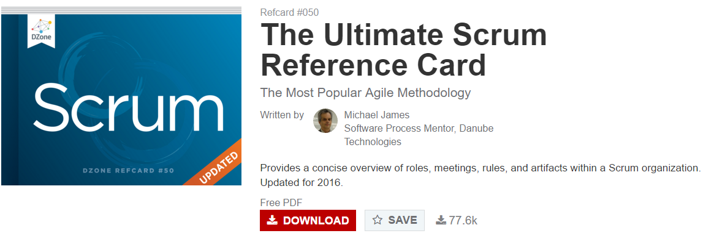](https://dzone.com/refcardz/scrum)

[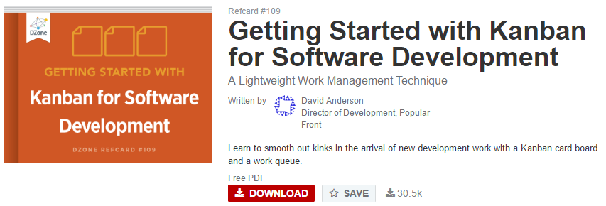](https://dzone.com/refcardz/getting-started-kanban)

[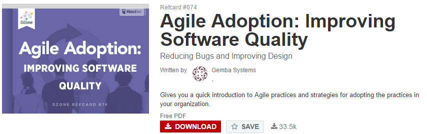](https://dzone.com/refcardz/agile-adoption-improving)

[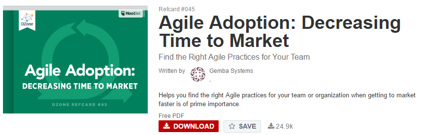](https://dzone.com/refcardz/agile-adoption-decreasing-time)

[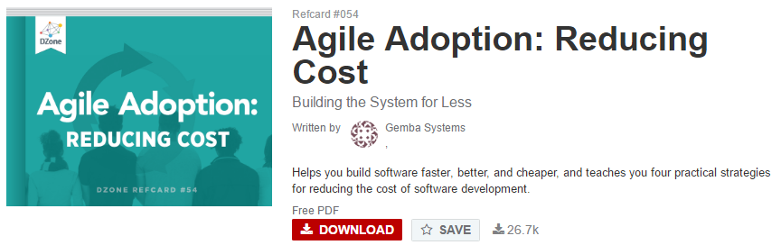](https://dzone.com/refcardz/agile-adoption-reducing-cost)

[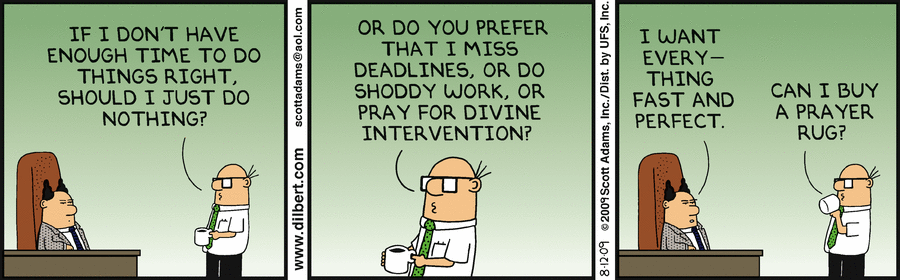](http://dilbert.com/strip/2009-08-12)

### Javier Garzas 
- [slideshare: 233 grados de TI 🌟🌟🌟](http://www.slideshare.net/233gradosdeTI)
- [Javier Garzás: Agilidad 🌟🌟🌟🌟🌟](https://www.youtube.com/watch?v=oShXAC26rcs)
- [¿Qué es un líder técnico? Y los cambios que están sufriendo los roles típicos en un proyecto tecnológico 🌟🌟🌟](http://www.javiergarzas.com/2014/12/que-es-un-lider-tecnico.html)
- [Aléjate del concepto “Proyecto” si quieres usar bien Scrum: confundir “versión a entregar” al cliente con final de sprint](http://www.javiergarzas.com/2015/11/alejate-del-concepto-proyecto-si-quieres-usar-bien-scrum-12-confundir-version-a-entregar-al-cliente-con-final-de-sprint.html)
- [El Product Owner del lado oscuro y otros anti-patrones](http://www.javiergarzas.com/2016/01/el-product-owner-del-lado-oscuro-y-otros-anti-patrones.html)
- [Un video imprescindible sobre la buena gestión de equipos software 🌟🌟🌟](http://www.javiergarzas.com/2014/09/un-video-sobre-la-buena-gestion-de-equipos-software.html)
- [¿Es bueno tener equipos estables? (vamos, que no rote constantemente la gente)](http://www.javiergarzas.com/2015/09/es-bueno-tener-equipos-estables-vamos-que-no-rote-constantemente-la-gente.html)
- [Agilidad y DevOps… ¿Son lo mismo? y ¿Qué es DevOps?](http://www.javiergarzas.com/2015/12/agilidad-y-devops-son-lo-mismo-y-que-es-devops.html)
- [¿Las disputas y discusiones son una constante en tu equipo – entorno de trabajo? No te preocupes, no estás solo 🌟](http://www.javiergarzas.com/2015/04/las-disputas-y-discusiones-son-una-constante-en-tu-equipo-entorno-de-trabajo-no-te-preocupes-no-estas-solo.html)
- [Escalar agilidad: Liderazgo tribal (1/3). ¿Qué cultura tiene la tribu en la que trabajas?](http://www.javiergarzas.com/2015/12/escalar-agilidad-liderazgo-tribal-1.html)
- [¿Tiene futuro que en tu empresa tengas un CPD? ¿Y que te dediques profesionalmente a mantenerlo? 🌟](http://www.javiergarzas.com/2015/11/tiene-futuro-que-en-tu-empresa-tengas-un-cpds-un-centro-de-proceso-de-datos-y-que-te-dediques-profesionalmente-a-ello.html)
- [Si pasamos de externalizar el Testing a integrarlo en los equipos… ¿Qué va a pasar con las testing factories?](http://www.javiergarzas.com/2015/10/si-pasamos-de-externalizar-el-testing-a-integrarlo-en-los-equipos-que-va-a-pasar-con-las-testing-factories.html)
- [Cómo y quién recuperó uno de los mayores desastres del desarrollo software: la web healthcare... 🌟🌟](http://www.javiergarzas.com/2014/12/como-y-quien-recupero-healthcare-gov.html)
- [Next time you're stressing out about code bug, just be glad it's not one that causes a $440M loss in only 45 mins](https://en.wikipedia.org/wiki/Knight_Capital_Group#2012_stock_trading_disruption)
- [Web del senado, costó 448.819€, pero la del Ayuntamiento de Madrid 100.000€ ¿Nuevo caso de populismo tecnológico?](http://www.javiergarzas.com/2015/10/web-del-senado-costo-448-819e-pero-la-del-ayuntamiento-de-madrid-100-000e-nuevo-caso-de-populismo-tecnologico.html)
- [Los decoradores no saben crear equipos de trabajo potentes 🌟](http://www.javiergarzas.com/2016/01/los-decoradores-no-saben-crear-equipos-de-trabajo-potentes.html)
- [Las cuatro dimensiones para mejorar una organización](http://www.javiergarzas.com/2016/06/14063.html)

<blockquote class="twitter-tweet tw-align-center" data-lang="es">
Maneras de usar un Gantt para matar un proyecto <a href="https://t.co/dUkacExFmr">https://t.co/dUkacExFmr</a> vía <a href="https://twitter.com/jgarzas">@jgarzas</a>
&mdash; Johnny Bravo (@jbravot) <a href="https://twitter.com/jbravot/status/706515419348213761">6 de marzo de 2016</a></blockquote>

<iframe width="560" height="315" src="https://www.youtube-nocookie.com/embed/oShXAC26rcs?rel=0" frameborder="0" allowfullscreen class="video"></iframe>

 

<iframe width="560" height="315" src="https://www.youtube.com/embed/o90o6Oassec?rel=0" frameborder="0" allowfullscreen class="video"></iframe>

 

### Project Management
- [cio.com: Why less is more with project management](http://www.cio.com/article/3031636/leadership-management/why-less-is-more-with-project-management.html)

<blockquote class="twitter-tweet tw-align-center" data-lang="es">
The amount of time it takes to fix <a href="https://twitter.com/hashtag/technical?src=hash">#technical</a> debt could save you so much more time, effort &amp; hassle. <a href="https://twitter.com/hashtag/WorthIt?src=hash">#WorthIt</a> <a href="https://twitter.com/hashtag/Lean?src=hash">#Lean</a> <a href="https://t.co/Q4PCqzNXas">https://t.co/Q4PCqzNXas</a>
&mdash; Scrum.org (@Scrumdotorg) <a href="https://twitter.com/Scrumdotorg/status/744980516072456196">20 de junio de 2016</a></blockquote>

[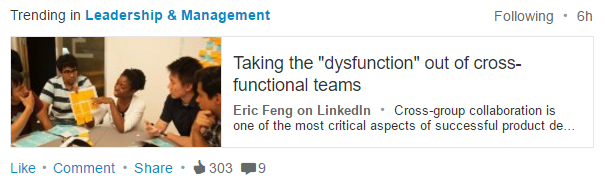](https://www.linkedin.com/pulse/taking-dysfunction-out-cross-functional-teams-eric-feng)

<iframe width="560" height="315" src="https://www.youtube.com/embed/ZY8iQVIjnXg?rel=0" frameborder="0" allowfullscreen class="video"></iframe>

 

#### Product Owner
- [medium.com: Product Owner Responsibilities in Agile (Scrum Methodologies) 🌟🌟](https://medium.com/agile-project-management-scrum-lean-kanban/product-owner-responsibilities-in-agile-scrum-methodologies-dc7aeeb5ff71)
- [blog.scrum.org: What Product Ownership might entangle](http://blog.scrum.org/what-product-ownership-might-entangle/)
- [20 Product Owners anti patterns in scrum](http://lmsgoncalves.com/2014/09/29/product-owner-anti-patterns/)
- [¿Cuantos Product Owner puede tener un equipo? 🌟](http://www.javiergarzas.com/2015/10/cuantos-product-owner-puede-tener-un-equipo.html)
- [The Product Owner Role When Scaling Scrum](https://appdevelopermagazine.com/3666/2016/2/23/The-Product-Owner-Role-When-Scaling-Scrum)

<blockquote class="twitter-tweet tw-align-center" data-lang="es">
<a href="https://t.co/ZnRN31hRt3">pic.twitter.com/ZnRN31hRt3</a>
&mdash; Rainbow DashOps (@mattstratton) <a href="https://twitter.com/mattstratton/status/740233864887566336">7 de junio de 2016</a></blockquote>

<a href="http://uxreactions.com/post/131683232219/working-with-a-product-owner-whos-new-to-agile">http://uxreactions.com/post/131683232219/working-with-a-product-owner-whos-new-to-agile</a>

<blockquote class="twitter-tweet tw-align-center" data-lang="es">
Estimates <a href="https://t.co/w1XL7sM1P3">https://t.co/w1XL7sM1P3</a> <a href="https://twitter.com/hashtag/ProjectManagement?src=hash">#ProjectManagement</a> <a href="https://twitter.com/hashtag/webcomic?src=hash">#webcomic</a> <a href="https://twitter.com/hashtag/TimeEstimates?src=hash">#TimeEstimates</a> <a href="https://t.co/1vSpPvgN0R">pic.twitter.com/1vSpPvgN0R</a>
&mdash; Don&#39;t Hit Save (@donthitsave) <a href="https://twitter.com/donthitsave/status/705854945103364097">4 de marzo de 2016</a></blockquote>

<blockquote class="twitter-tweet tw-align-center" data-lang="es">
But it took 20 years of experience to know which 3 lines of code to change, and 10hrs of engineering to do it right <a href="https://t.co/4jLc69TJ4X">https://t.co/4jLc69TJ4X</a>
&mdash; John Arundel (@bitfield) <a href="https://twitter.com/bitfield/status/706453449211305984">6 de marzo de 2016</a></blockquote>

#### Scrum Master. Scrum Cheat Sheet
- [DZone/Agile Zone. Hiring: 38 Scrum Master Interview Questions To Avoid Imposters](https://dzone.com/articles/hiring-38-scrum-master-interview-questions-to-avoi) A free pdf from DZone user Stefan Wolpers for those looking to hire Scrum Masters or agile professionals.
- [The shortest and greatest SCRUM cheat sheet that I've seen so far 🌟🌟🌟](https://www.protechtraining.com/pdf/ScrumCheatSheet.pdf)
- [What Is the Relationship Between Story Points and Task Effort in Hours?](https://www.scrumalliance.org/community/articles/2016/january/what-is-the-relationship-between-story-points-and)
- [Agile adoption by numbers – and some problems](http://www.javacodegeeks.com/2016/01/agile-adoption-numbers-problems.html)
- [Daily Scrum – Tips & Tactics](http://www.barryovereem.com/daily-scrum-tips-tactics/)
- [Ponga un Scrum Master en su vida](https://www.beeva.com/beeva-view/metodologiasagiles/ponga-un-scrum-master-en-su-vida/)
- [blog.trello.com: Tips For Managing A Remote Team](http://blog.trello.com/tips-for-managing-a-remote-team/)
- [Meetings are not just about status updates! Never forget the "why" at the Daily](https://hbr.org/2016/02/the-perils-of-overmonitoring-your-behavior-and-goals)

<blockquote class="twitter-tweet tw-align-center" data-lang="es">
How to build a visual, shared editorial calendar &amp; content management system <a href="https://t.co/LgmtS0WOtO">https://t.co/LgmtS0WOtO</a> <a href="https://t.co/aYYKruFA7q">pic.twitter.com/aYYKruFA7q</a>
&mdash; Trello (@trello) <a href="https://twitter.com/trello/status/699367622857531392">febrero 15, 2016</a></blockquote>

<blockquote class="twitter-tweet tw-align-center" data-lang="es">
Warning: Things are about to get dangerously productive with this board of <a href="https://twitter.com/hashtag/TrelloTips?src=hash">#TrelloTips</a> <a href="https://t.co/ZhwopBgAhj">https://t.co/ZhwopBgAhj</a> <a href="https://t.co/irysVm5Qh7">pic.twitter.com/irysVm5Qh7</a>
&mdash; Trello (@trello) <a href="https://twitter.com/trello/status/700417017937985537">febrero 18, 2016</a></blockquote>

<blockquote class="twitter-tweet tw-align-center" data-lang="es">
At over 50% remote, here are some tools &amp; tips that help us manage our teams - <a href="https://t.co/epV8CRF7qU">https://t.co/epV8CRF7qU</a> <a href="https://t.co/N8i3h0VODy">pic.twitter.com/N8i3h0VODy</a>
&mdash; Trello (@trello) <a href="https://twitter.com/trello/status/700749202591092737">febrero 19, 2016</a></blockquote>

<blockquote class="twitter-tweet tw-align-center" data-lang="es">
Meetings are not just about status updates! Never forget the &quot;why&quot; at the Daily <a href="https://twitter.com/hashtag/Scrum?src=hash">#Scrum</a>, <a href="https://twitter.com/hashtag/Sprint?src=hash">#Sprint</a> <a href="https://twitter.com/hashtag/Retrospective?src=hash">#Retrospective</a> etc. <a href="https://t.co/1asZMoxiIo">https://t.co/1asZMoxiIo</a>
&mdash; Scrum.org (@Scrumdotorg) <a href="https://twitter.com/Scrumdotorg/status/702899793748738048">25 de febrero de 2016</a></blockquote>

<blockquote class="twitter-tweet tw-align-center" data-partner="tweetdeck">
Default to 30 minute meetings and remember why you&#39;re there <a href="https://twitter.com/opensourceway">@opensourceway</a> <a href="https://t.co/VvsyqstgEE">https://t.co/VvsyqstgEE</a> <a href="https://t.co/JDRdm0KpQQ">pic.twitter.com/JDRdm0KpQQ</a>
&mdash; Jim Whitehurst (@JWhitehurst) <a href="https://twitter.com/JWhitehurst/status/707014321218461698">March 8, 2016</a></blockquote>

<blockquote class="twitter-tweet tw-align-center" data-lang="es">
Changes to the <a href="https://twitter.com/hashtag/ScrumGuide?src=hash">#ScrumGuide</a> are official! What&#39;s new? Find out here: <a href="https://t.co/enmoWzWAgv">https://t.co/enmoWzWAgv</a> <a href="https://t.co/oZZs6qwU6c">pic.twitter.com/oZZs6qwU6c</a>
&mdash; Scrum.org (@Scrumdotorg) <a href="https://twitter.com/Scrumdotorg/status/750723577155088384">6 de julio de 2016</a></blockquote>

<iframe src="//www.slideshare.net/slideshow/embed_code/key/sivZnLLIue3AZO" width="595" height="485" frameborder="0" marginwidth="0" marginheight="0" scrolling="no" style="border:1px solid #CCC; border-width:1px; margin-bottom:5px; max-width: 100%;" allowfullscreen class="video"> </iframe> 
 <strong> <a href="//www.slideshare.net/infoDiagram/how-to-start-scrum-from-traditional-project-management" title="How to Start Scrum from Traditional Project Management" target="_blank">How to Start Scrum from Traditional Project Management</a> </strong> from <strong><a href="//www.slideshare.net/infoDiagram" target="_blank">Peter Zvirinsky</a></strong> 

 

<iframe src="//www.slideshare.net/slideshow/embed_code/key/bZjjK2TIilBKfB" width="595" height="485" frameborder="0" marginwidth="0" marginheight="0" scrolling="no" style="border:1px solid #CCC; border-width:1px; margin-bottom:5px; max-width: 100%;" allowfullscreen class="video"> </iframe> 
 <strong> <a href="//www.slideshare.net/fabokzs/what-scrum-kanban-lean-ever-done-for-us" title="What Scrum Kanban Lean Ever Done for Us" target="_blank">What Scrum Kanban Lean Ever Done for Us</a> </strong> from <strong><a href="//www.slideshare.net/fabokzs" target="_blank">Zsolt Fabok</a></strong> 

 

<iframe src="//www.slideshare.net/slideshow/embed_code/key/pdvmXZM6Alb34F" width="595" height="485" frameborder="0" marginwidth="0" marginheight="0" scrolling="no" style="border:1px solid #CCC; border-width:1px; margin-bottom:5px; max-width: 100%;" allowfullscreen class="video"> </iframe> 
 <strong> <a href="//www.slideshare.net/blossom_io/the-definitive-guide-to-agile-kanban" title="A Guide to Agile Kanban" target="_blank">A Guide to Agile Kanban</a> </strong> from <strong><a href="//www.slideshare.net/blossom_io" target="_blank">Blossom</a></strong> 

 

<a href="http://my-twisted-code.tumblr.com/post/131735580276">http://my-twisted-code.tumblr.com/post/131735580276</a>

<iframe src="//www.slideshare.net/slideshow/embed_code/key/5734B86up4wKLs" width="595" height="485" frameborder="0" marginwidth="0" marginheight="0" scrolling="no" style="border:1px solid #CCC; border-width:1px; margin-bottom:5px; max-width: 100%;" allowfullscreen class="video"> </iframe> 
 <strong> <a href="//www.slideshare.net/projectcareer/top-14-project-management-interview-questions-and-answers-33073123" title="175 project management interview questions and answers pdf" target="_blank">175 project management interview questions and answers pdf</a> </strong> from <strong><a target="_blank" href="//www.slideshare.net/projectcareer">projectcareer</a></strong> 

 

<iframe width="560" height="315" src="https://www.youtube.com/embed/go5XyuI7DkA?rel=0" frameborder="0" allowfullscreen class="video"></iframe>

 

<iframe src="//www.slideshare.net/slideshow/embed_code/key/I0egS4zlPJ1w78" width="595" height="485" frameborder="0" marginwidth="0" marginheight="0" scrolling="no" style="border:1px solid #CCC; border-width:1px; margin-bottom:5px; max-width: 100%;" allowfullscreen class="video"> </iframe> 
 <strong> <a href="//www.slideshare.net/chuparkoff/introduction-to-jira-38474943" title="Introduction to JIRA &amp; Agile Project Management" target="_blank">Introduction to JIRA &amp; Agile Project Management</a> </strong> from <strong><a href="//www.slideshare.net/chuparkoff" target="_blank">Dan Chuparkoff</a></strong> 

 

<blockquote class="twitter-tweet tw-align-center" data-lang="es">
<a href="https://t.co/68YcOcz8MM">pic.twitter.com/68YcOcz8MM</a>
&mdash; Sarah Andersen (@SarahCAndersen) <a href="https://twitter.com/SarahCAndersen/status/739101900856037376">4 de junio de 2016</a></blockquote>

<blockquote class="twitter-tweet tw-align-center" data-lang="es">
Who&#39;s in charge of Product Backlog <a href="https://twitter.com/hashtag/management?src=hash">#management</a>? What are some other challenges &amp;responsibilities of a <a href="https://twitter.com/hashtag/ProductOwner?src=hash">#ProductOwner</a>? <a href="https://t.co/VMLNWloQWq">https://t.co/VMLNWloQWq</a>
&mdash; Scrum.org (@Scrumdotorg) <a href="https://twitter.com/Scrumdotorg/status/748151086721142784">29 de junio de 2016</a></blockquote>

#### Open Project
- [openproject.org 🌟](https://www.openproject.org)
- [OpenProject: An open source project management solution](https://opensource.com/business/16/2/openproject-open-source-project-management-solution)

### Continuous Integration and Delivery
- [Martin Fowler. Continuous Delivery 🌟🌟🌟🌟](https://www.youtube.com/watch?v=aoMfbgF2D_4)
	- [A Brief Guide to Success with Agile, Martin Fowler](http://martinfowler.com/articles/agileFluency.html)
- [continuousdelivery.com](http://continuousdelivery.com/)
	- [Visualizations of Continuous Delivery](http://continuousdelivery.com/2014/02/visualizations-of-continuous-delivery/)
- [Learn about how to apply Continuous Delivery principles to SOA, when test services aren't adequate, and the mechanics of service virtualization](https://dzone.com/articles/continuously-delivering-soa)
- [Continuously Delivering SOA. Learn about how to apply Continuous Delivery principles to SOA, when test services aren't adequate, and the mechanics of service virtualization](https://dzone.com/articles/continuously-delivering-soa)
- [28 DevOps and Continuous Delivery Reference Architectures](https://medium.com/@weekstweets/28-devops-and-continuous-delivery-reference-architectures-6a6ec82c4182#.1ju1glurv)
	- [DevOps and Continuous Delivery Reference Architectures (including Nexus and other popular tools)](http://www.slideshare.net/SonatypeCorp/nexus-and-continuous-delivery)
	- [DevOps and Continuous Delivery Reference Architectures - Volume 2](http://www.slideshare.net/SonatypeCorp/devops-and-continuous-delivery-reference-architectures)
	- [Experts Share DevOps/CD Reference Architectures](https://youtu.be/deQ_EcMXh7o)
- [DZone: Continuous Delivery: The Atlassian Way 🌟](https://dzone.com/articles/continuous-delivery-the-atlassian-way) Sonatype's Mark Miller catches up with Ian Buchanan at Atlassian to discuss DevOps leadership, ChatOps, and usage of tools in the continuous delivery pipeline.
- [DZone refcard: Deployment Automation Patterns 🌟](https://dzone.com/refcardz/deployment-automation-patterns)
- [DZone refcard: Preparing for Continuous Delivery 🌟](https://dzone.com/refcardz/preparing-continuous-delivery)
- [DZone refcard: Continuous Delivery 🌟](https://dzone.com/refcardz/continuous-delivery-patterns)

<iframe width="560" height="315" src="https://www.youtube.com/embed/aoMfbgF2D_4" frameborder="0" allowfullscreen class="video"></iframe>

 

<iframe src="//www.slideshare.net/slideshow/embed_code/key/vy55GV54z52Zds" width="595" height="485" frameborder="0" marginwidth="0" marginheight="0" scrolling="no" style="border:1px solid #CCC; border-width:1px; margin-bottom:5px; max-width: 100%;" allowfullscreen class="video"> </iframe> 
 <strong> <a href="//www.slideshare.net/SonatypeCorp/nexus-and-continuous-delivery" title="DevOps and Continuous Delivery Reference Architectures (including Nexus and other popular tools)" target="_blank">DevOps and Continuous Delivery Reference Architectures (including Nexus and other popular tools)</a> </strong> from <strong><a href="//www.slideshare.net/SonatypeCorp" target="_blank">Sonatype </a></strong> 

 

#### Continuous Integration Tools
- [Continuous Integration Tools](jenkins-git.md)

## Metrics
- [Metrics](metrics.md)

## Example of DevOps Job description

You will be working closely with the product engineering teams to ensure products are secure, highly available and scalable. Your development and scripting skills will help you automate scaling and management of server resources and implement zero-downtime deployments. This position offers an outstanding opportunity for a unique individual who possesses a solid development and web services background. 

Requirements: 

- Extensive experience supporting customer facing web servers and web sites in production environment 
- Software development experience with at least one language (Ruby, Python, Java) 
- Management of continuous integration servers like Jenkins 
- Automated provisioning, configuration of many nodes with code deployment and configuration management tools (Chef, Puppet, SaltStack...)
- BS Degree in Information Technology, Engineering, Computer Science or equivalent experience 
- Strong experience in Linux Systems Administration and troubleshooting 
- Willingness to participate in 7/24 on call rotation to respond to and resolve application issues to ensure SaaS applications are online 
- Good organizational skills and the ability the track and prioritize several tasks 
- Ability to pair with other engineers to dig into problems that occur in production and ship production code 
- Experience with source code repositories (Git, Perforce, subversion) 
- Experience with cloud environments like AWS

Preferred Qualifications: 

- Understanding and experience with code deployment and micro-services 
- Good understanding of relational databases such as MS SQL Server or MySQL or PostgreSQL 
- Excellent problem solving skills, along with the ability to work independently, as well as part of a cross-functional global team 
- Ability to work on complex problems where analysis of situations or data requires in-depth evaluation of various factors 
- Understanding of ITIL "best practices" 
- Windows and Linux certifications 
- Working knowledge of networking and security concepts 
- Experience working with architecture or engineering disciplines 
- Experience working with containers – Docker / Mesos 

# ITIL
## Is DevOps replacing ITIL?
- [slideshare.net: Is DevOps replacing ITIL? Busting the Five Biggest DevOps Myths 🌟](http://www.slideshare.net/CAinc/busting-the-five-biggest-devops-myths)
- [Is DevOps Killing Some Types of Jobs? 🌟🌟🌟](https://developer.ibm.com/urbancode/2014/10/28/devops-killing-types-jobs/)
- [IT managers: we're hurting for more cloud and DevOps skills. Despite years of cloud and DevOps adoption, IT departments are still mired in backlogs of user demands, survey shows](http://www.zdnet.com/article/it-managers-were-hurting-for-more-cloud-and-devops-skills/)
- [Why everyone hates DevOps 🌟](http://www.networkworld.com/article/2915893/software/why-everyone-hates-devops.html)
	- [8 Reasons IT Pros Hate The Cloud](http://www.informationweek.com/cloud/8-reasons-it-pros-hate-the-cloud/d/d-id/1320531)
	- [The IT Culture War: The Struggle to Adopt DevOps | WIRED](http://www.wired.com/2015/03/culture-war-struggle-adopt-devops/)
- [DevOps does not negate ITIL or ITSM; they can be leveraged for greater agility](http://www.itworldcanada.com/article/devops-does-not-negate-itil-or-itsm-they-can-be-leveraged-for-greater-agility)
- [Operations is Dead, but Please Don’t Replace it with DevOps](http://diversity.net.nz/operations-is-dead-but-please-dont-replace-it-with-devops/2013/05/15/)
- [ITSM vs. DevOps – Agility vs. Control – is this really battle royale?](http://www.vigilantguy.com/itsm-vs-devops-agility-vs-control-is-this-really-battle-royale/)
- [ABCs of ITIL®](http://www.globalknowledge.com/training/whitepaperdetail.asp?pageid=502&wpid=1428)

## ITIL Tools
- [ITIL v3 (Information Technology Infrastructure Library)](https://en.wikibooks.org/wiki/ITIL_v3_%28Information_Technology_Infrastructure_Library%29)
- [itop - ITSM & CMDB OpenSource. A simple, web based IT Service Management tool 🌟](http://sourceforge.net/projects/itop/)
- [RackTables.org - a datacenter asset management system 🌟](http://racktables.org/)

<a href="http://devopstips.tumblr.com/post/121071300360/programming-isnt-manual-labor-but-it-still-sucks">http://devopstips.tumblr.com/post/121071300360/programming-isnt-manual-labor-but-it-still-sucks</a>

<a href="http://devops-testing.tumblr.com/post/136666346908/software-testing-the-devops-strategy">http://devops-testing.tumblr.com/post/136666346908/software-testing-the-devops-strategy</a>

<iframe width="420" height="315" src="https://www.youtube.com/embed/iTZyudLLJSU?rel=0" frameborder="0" allowfullscreen class="video"></iframe>

 