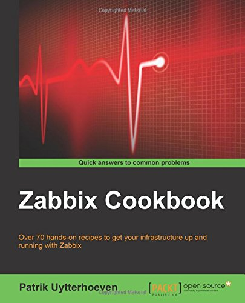
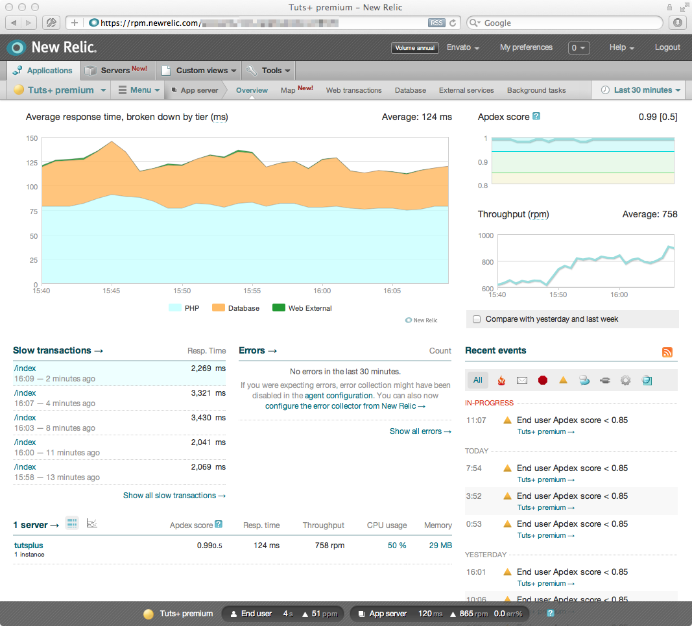

**Table of Contents**
<!-- MarkdownTOC -->

- [DevOps](#devops)
	- [DevOps Blogs](#devops-blogs)
	- [Description](#description)
	- [DevOps Tools 2016](#devops-tools-2016)
	- [Agile planning: Scrum, Kanban, Lean](#agile-planning-scrum-kanban-lean)
		- [Continuous Integration and Delivery](#continuous-integration-and-delivery)
			- [CI Jenkins, Travis](#ci-jenkins-travis)
			- [CI Docker](#ci-docker)
			- [CI RPM build](#ci-rpm-build)
			- [CI Maven and Gradle](#ci-maven-and-gradle)
	- [Git](#git)
		- [Git clients](#git-clients)
	- [Performance Testing - Traffic injectors](#performance-testing---traffic-injectors)
		- [JMeter](#jmeter)
		- [Alternatives](#alternatives)
	- [Metric monitoring](#metric-monitoring)
		- [Tools](#tools)
		- [Monitoring of JavaEE applications](#monitoring-of-javaee-applications)
		- [Monitoring Network Bandwidth](#monitoring-network-bandwidth)
		- [APM: Application Performance Management](#apm-application-performance-management)
			- [APM Blogs](#apm-blogs)
			- [APM Solutions](#apm-solutions)
		- [Centralized logging. Big Data Log Management Tools (Data Analytics Platforms)](#centralized-logging-big-data-log-management-tools-data-analytics-platforms)
- [ITIL](#itil)
	- [Is DevOps replacing ITIL?](#is-devops-replacing-itil)
	- [ITIL Tools](#itil-tools)

<!-- /MarkdownTOC -->

# DevOps
## DevOps Blogs
- [devops.com](http://devops.com/)
- [DevOps Library: The Best Videos for the Best Admins](http://devopslibrary.com/)

## Description
- [What is DevOps? - In Simple English ](https://youtu.be/_I94-tJlovg)
- [Software Development in the 21st century](https://www.thoughtworks.com/talks/software-development-21st-century-xconf-europe-2014)
- [New Relic eBook: What is DevOps and Why it Can Help Your Business?](http://newrelic.com/devops-101)
- [slideshare: Jelastic - DevOps for Java with Docker Containers - Madrid 2015](http://www.slideshare.net/jelastic/jelastic-devops-for-java-with-docker-containers-madrid-2015-55033859)
- [ebook: IBM DevOps for Dummies (free)](http://www.ibm.com/ibm/devops/us/en/resources/dummiesbooks/)
- [New Relic: Glossary of DevOps Tools. Get a glimpse into some of New Relic's favorite DevOps tools](http://newrelic.com/devops/toolset)
- [What to Expect From a DevOps Interview](https://dzone.com/articles/what-to-expect-from-a-devops-interview)
	- [Why You’ll NEVER Nail That DevOps Interview](https://dzone.com/articles/why-youll-never-nail-that-devops-interview-1)
- [Cómo y quién recuperó uno de los mayores desastres del desarrollo software: la web healthcare...](http://www.javiergarzas.com/2014/12/como-y-quien-recupero-healthcare-gov.html)
- [Deloitte: The DevOps Difference](http://deloitte.wsj.com/cio/2014/04/24/the-devops-difference/)
- [MountainWest Devops 2014 - How I Learned to Stop Worrying and Love DevOps](https://youtu.be/uLfIp-2zm6I)
- [DevOps does not negate ITIL or ITSM; they can be leveraged for greater agility](http://www.itworldcanada.com/article/devops-does-not-negate-itil-or-itsm-they-can-be-leveraged-for-greater-agility/379603)
- [thoughtsoncloud.com: Why are we racing to DevOps?](http://www.thoughtsoncloud.com/2015/12/why-are-we-racing-to-devops/)
- [DevOps isn’t just about engineering better processes. It’s also about cultural transformation](http://cloudcomputing.sys-con.com/node/3588052)

## DevOps Tools 2016
- [Top 10 DevOps Tools to look out for in 2016](https://www.linkedin.com/pulse/top-10-devops-tools-look-out-2016-matthew-smith)
	1. [Packaging - FPM](https://github.com/jordansissel/fpm)
	2. [Pipeline - GoCD](https://www.go.cd/)
	3. [Logging - GrayLog](https://www.graylog.org/)
	4. [Container Orchestration - Kubernetes](http://kubernetes.io/)
	5. [Monitoring - Dataloop.IO](https://www.dataloop.io/)
	6. [Alerting - PagerDuty](https://www.pagerduty.com/)
	7. [Deployment - Atlas](https://atlas.hashicorp.com/)
	8. [Cost Control - CloudHealth](https://www.cloudhealthtech.com/)
	9. [PaaS - Drie.co](http://www.drie.co/)
	10. [Configuration management - Ansible](http://www.ansible.com/)
- [devops.com: DevOps in 2016, the year of implementation](http://devops.com/2015/12/22/devops-2016-year-implementation/)
- [dzone.com: Five Software Delivery Industry Predictions for 2016](https://dzone.com/articles/five-software-delivery-industry-predictions-for-20-1)
- [Periodic Table of DevOps Tools](https://xebialabs.com/periodic-table-of-devops-tools/)
- [oraclejavamagazine-digital.com: 7 Open Source tools for java deployment:Jenkins, Chef, Vagrant, Packer, Docker, Flyway, Rundeck, Go](http://www.oraclejavamagazine-digital.com/javamagazine_twitter/20140506?pg=6#pg6)
- [oraclejavamagazine-digital.com: Using Docker in Java Applications](http://www.oraclejavamagazine-digital.com/javamagazine_twitter/20151112?pg=52#pg52)
- [How We Use AWS, Ansible, and Packer to Make Deployment Awesome](https://blog.branch.io/how-we-use-aws-ansible-and-packer-to-make-deployment-awesome)
- [Fabric8 is an integrated open source DevOps and Integration Platform](http://fabric8.io/)

## Agile planning: Scrum, Kanban, Lean
- [Javier Garzás: Agilidad](https://www.youtube.com/watch?v=oShXAC26rcs)
	- [Aléjate del concepto “Proyecto” si quieres usar bien Scrum: confundir “versión a entregar” al cliente con final de sprint](http://www.javiergarzas.com/2015/11/alejate-del-concepto-proyecto-si-quieres-usar-bien-scrum-12-confundir-version-a-entregar-al-cliente-con-final-de-sprint.html)
	- [Un video imprescindible sobre la buena gestión de equipos software](http://www.javiergarzas.com/2014/09/un-video-sobre-la-buena-gestion-de-equipos-software.html)
	- [Agilidad y DevOps… ¿Son lo mismo? y ¿Qué es DevOps?](http://www.javiergarzas.com/2015/12/agilidad-y-devops-son-lo-mismo-y-que-es-devops.html)
- [Scrumguides.org: Scrum’s creators seek definitive place for Scrum knowledge](http://www.scrumguides.org/)
- [Why estimates never work](http://www.brandonsavage.net/why-estimates-never-work/)
- [You will not become agile by implementing scrum](https://www.linkedin.com/pulse/you-become-agile-implementing-scrum-jurriaan-kamer)
- [Kanban board is one of the most effective and popular tools for boosting productivity. Here is a collection of Kanban board's examples including plane simple and complicated Kanban board's style](http://tracks.roojoom.com/r/340)
- [Lean vs Agile Programming](http://www.mytechlogy.com/IT-blogs/9408/tech-blogs-lean-vs-agile-programming/)
- [Think Scrum is Only for Developers? Think Again](https://www.linkedin.com/pulse/20140917144235-128811924-think-scrum-is-only-for-developers-think-again)
- [dzone.com: 5 Issues with Agile and What’s Next](https://dzone.com/articles/5-issues-with-agile-and-whats-next) Agile is increasingly popular, but it isn't perfect. Check out these 5 issues with Agile, and learn how the space will further evolve. Problems include lack of software architecture focus, and unclear definition of self-organization.

### Continuous Integration and Delivery
- [Martin Fowler - Continuous Delivery](https://www.youtube.com/watch?v=aoMfbgF2D_4)
	- [A Brief Guide to Success with Agile, Martin Fowler](http://martinfowler.com/articles/agileFluency.html)
- [continuousdelivery.com](http://continuousdelivery.com/)
- [Learn about how to apply Continuous Delivery principles to SOA, when test services aren't adequate, and the mechanics of service virtualization](https://dzone.com/articles/continuously-delivering-soa)
- [Continuously Delivering SOA. Learn about how to apply Continuous Delivery principles to SOA, when test services aren't adequate, and the mechanics of service virtualization](https://dzone.com/articles/continuously-delivering-soa)

#### CI Jenkins, Travis
- [Jenkins User Conference West 2015 - Slides available](https://www.cloudbees.com/jenkins/juc-2015/us-west)
	- [Jenkins and Docker: Next Generation Continuous Delivery](https://www.linkedin.com/pulse/jenkins-docker-next-generation-continuous-delivery-khadija-kerissi)
	- [Tutorial: Gestión de Configuración – Ansible + Vagrant + Jenkins](http://www.carlessanagustin.com/2015/08/20/tutorial-gestion-de-configuracion-ansible-vagrant-jenkins/)
	- [Jenkins Docker Plugin](https://wiki.jenkins-ci.org/display/JENKINS/Docker+Plugin)
	- [jenkins-rpm-builder, wrapper for easy building of rpm packages in jenkins ci server](https://github.com/jhrcz/jenkins-rpm-builder)
- [Travis CI](https://travis-ci.org/)

#### CI Docker
- [pyvideo.org: Ship Python Apps with Docker!](http://pyvideo.org/video/3646/ship-python-apps-with-docker) Build a docker image for a simple python app and then deploy it to a computer, EC2, and Google cloud engine

#### CI RPM build
- [Continuous integration + rpmbuild + Docker](https://access.redhat.com/discussions/1174853)
	- [Build native RPM packages by leveraging docker capabilities](https://github.com/alanfranz/docker-rpm-builder)
	- [Building RPM with Docker images](http://blog.chmouel.com/2014/12/31/building-rpm-with-docker-images/)
	- [Reddit: Creating internal RPM build environment?](https://www.reddit.com/r/linuxadmin/comments/2ke2vs/creating_internal_rpm_build_environment/)

#### CI Maven and Gradle
- [Java: Maven vs Gradle](https://dzone.com/articles/maven-vs-gradle-one-year-later)
- [Gradle | Modern Open-Source Enterprise Build Automation](http://gradle.org/)

## Git
- [One Million Downloads of GitLab](https://about.gitlab.com/2015/10/29/one-million-downloads-of-gitlab/)
- [git.training](http://git.training/)
- [training.github.com - GitHub Training](https://training.github.com/classes/developers/)
	- [GitHub lanza su propio curso de formación; objetivo:Que los desarrolladores exploten todo su potencial](http://www.genbeta.com/comparativa/github-lanza-su-propio-curso-de-formacion-el-objetivo-que-los-desarrolladores-exploten-todo-su-potencial)
- [Git Magic - training](http://www-cs-students.stanford.edu/~blynn/gitmagic/)
- [opentechschool.github.io - Social Coding with GitHub. This is the course content for Social Coding with GitHub](http://opentechschool.github.io/social-coding/)
- [Git-scm.com](http://git-scm.com/)
- [Git-scm ebook - free](http://git-scm.com/book/en/v2)
- [Git-Flow tutorial](https://es.atlassian.com/git/tutorials/comparing-workflowhttps://github.com/wdm0006/git-pandass/gitflow-workflow)
- [Git HowTo: How to get started with GIT and work with GIT Remote Repo](https://www3.ntu.edu.sg/home/ehchua/programming/howto/Git_HowTo.html)
- [Associating text editors with Git](https://help.github.com/articles/associating-text-editors-with-git/)
- [Using GIT to backup your website files on linux](http://techarena51.com/index.php/using-git-backup-website-files-on-linux/)
- [Sysadmincasts.com: Git to Puppet Deployment Workflow](https://sysadmincasts.com/episodes/33-git-to-puppet-deployment-workflow)
- [David Baumgold - Advanced Git - PyCon 2015](https://www.youtube.com/watch?v=4EOZvow1mk4)
- [Newrelic: GitHub Flow - Collaborating effectively using Git and GitHub](https://newrelic.com/webinar/github-for-teams)
- [Git Recipes. A Problem-Solution Approach](http://it-ebooks.info/book/3259/)
- [Git Pocket Guide](http://it-ebooks.info/book/2517/)
- [Git Pandas. A wrapper around gitpython to produce pandas dataframes for analysis](https://github.com/wdm0006/git-pandas)

### Git clients
- [SourceTree](https://www.sourcetreeapp.com/)
- [git-scm clients](http://git-scm.com/downloads)
- [TortoiseGit](https://tortoisegit.org/)

## Performance Testing - Traffic injectors
### JMeter
- [javacodegeeks.com: JMeter Tutorial for Load Testing – The ULTIMATE Guide](http://www.javacodegeeks.com/2014/11/jmeter-tutorial-load-testing.html)
- [blazemeter.com: The Ultimate JMeter Resource List (july 2015)](https://blazemeter.com/blog/ultimate-jmeter-resource-list)
- [blazemeter.com: How to Load Test HTTP Live Media Streaming (HLS) with JMeter](http://blazemeter.com/blog/how-load-test-http-live-media-streaming-hls-jmeter)
- [guru99.com: Free Jmeter Tutorials](http://www.guru99.com/jmeter-tutorials.html)
- [unpocodejava.wordpress.com: ¿Cómo hacer pruebas de carga de una clase Java con JMeter?](https://unpocodejava.wordpress.com/2015/12/21/como-hacer-pruebas-de-carga-de-una-clase-java-con-jmeter-2/)
- [xmodulo.com: What are good web server benchmarking tools for Linux](http://xmodulo.com/web-server-benchmarking-tools-linux.html)
- [Performance Testing With Real Browsers: using Selenium WebDriver with BlazeMeter and/or JMeter on its own](https://blazemeter.com/blog/view-webcast-performance-testing-real-browsers)

### Alternatives
- [Siege, a CLI tool ideal for a simple testing of AWS Auto Scaling](https://www.joedog.org/siege-home/)
- [Grinder](http://grinder.sourceforge.net/)

## Metric monitoring
### Tools
- [Stop using Nagios (so it can die peacefully)](http://www.slideshare.net/superdupersheep/stop-using-nagios-so-it-can-die-peacefully)
	- [nagiosql.org](http://www.nagiosql.org/)
- [GoAccess real time web log analyzer](http://goaccess.io/)
- [Linux cluster sysadmin — OS metric monitoring with colmux](http://www.rittmanmead.com/2014/12/linux-cluster-sysadmin-os-metric-monitoring-with-colmux/)
- [Netflix and linux performance analysis in 60 seconds](http://www.itworld.com/article/3010558/linux/netflix-linux-performance-analysis-in-60-seconds.html)
- [Why use Sensu?](http://www.rampmeupscotty.com/blog/2013/01/20/why-use-sensu/)
	- [Sensu monitoring](https://sensuapp.org/)
- [StatsD: Simple daemon for easy stats aggregation](https://github.com/etsy/statsd/)
- [munin monitoring](http://munin-monitoring.org/)
- [OMD - The Open Monitoring Distribution](http://omdistro.org/)
- Zabbix:
	- [tecmint.com: Installing and Configuring Zabbix 2.4.5 on Debian 8 and RHEL/CentOS 7](http://www.tecmint.com/install-and-configure-zabbix-monitoring-on-debian-centos-rhel/)
	- [All the slides of Zabbix Conference 2015](http://www.zabbix.com/conf2015_agenda.php)
	- [Zabbix for Beginners webinar](https://www.youtube.com/watch?v=uqFaz2HyxVM)
	- [Reddit: Zabbix vs Nagios - what are the cases for using one or the other in an enterprise setting?](https://www.reddit.com/r/linuxadmin/comments/2i4k04/zabbix_vs_nagios_what_are_the_cases_for_using_one/)
- [Anemometer: MySQL Slow Query Monitor](http://olindata.com/blog/2014/07/anemometer-mysql-slow-query-monitor)
- [SQL Monitoring in PostgreSQL. Identify long running queries](http://blog.dbi-services.com/sql-monitoring-in-postgresql-1-the-logging-system/)
- [Zipkin](http://zipkin.io)
	- [Zipkin architecture](http://twitter.github.io/zipkin/Architecture.html)
	- [Zipkin is a distributed tracing system. It helps gather timing data needed to troubleshoot latency problems in microservice architectures](https://github.com/openzipkin/zipkin)
	- [Zipkin is a distributed tracing system that helps us gather timing data for all the disparate services at Twitter](http://twitter.github.io/zipkin)
- [The Bro Network Security Monitor](https://www.bro.org/)
	- [FLOSS Weekly 296, Bro](https://twit.tv/shows/floss-weekly/episodes/296)
- [pingdom.com webiste monitoring](https://www.pingdom.com/)
- [Server Density, The Server Monitoring SaaS, Raises $1.5M For Further U.S. Expansion](http://techcrunch.com/2015/12/10/server-density/)

### Monitoring of JavaEE applications
- [javamelody](https://github.com/javamelody)
- [visualvm](http://visualvm.java.net/)
- [Red Hat Subscription: How do I analyze a Java heap dump?](https://access.redhat.com/solutions/18301)
- [javacodegeeks.com: Java Mission Control 5.2 is Finally Here! Welcome 7u40!](http://www.javacodegeeks.com/2013/09/java-mission-control-5-2-is-finally-here-welcome-7u40.html)

### Monitoring Network Bandwidth
- [ntop](http://www.ntop.org/)
- [Iperf.fr - The TCP,UDP and SCTP network bandwidth measurement tool](https://iperf.fr/)
- [Red Hat Subscription: Using iperf to test network bandwidth throughput](https://access.redhat.com/solutions/33103)

### APM: Application Performance Management
- [APM Convergence: Monitoring vs. Management. APM is entering into a period of intense competition of technology and strategy with a multiplicity of vendors and viewpoints](http://apmdigest.com/apm-convergence-monitoring-vs-management)
- [Performance management from the client's point of view](http://www.networkworld.com/article/2300639/data-center/performance-management-from-the-client-s-point-of-view.html)
- [APMdigest: Where Application Performance Management, BSM, Virtualization, and Cloud Computing Meet](http://apmdigest.com/)
- [4 Reasons to Use APM Tools](http://apmdigest.com/4-reasons-to-use-apm-tools)
- [Application Performance Management and the Cloud](http://apmdigest.com/application-performance-management-and-the-cloud)

#### APM Blogs
- [applicationperformancemanagement.org: APM, ALM and Performance Monitoring](http://www.applicationperformancemanagement.org/)
- [apmblog.dynatrace.com](http://apmblog.dynatrace.com)
- [AppDynamics Blog](https://blog.appdynamics.com/apm/)

#### APM Solutions
- [RTI - Application Performance Management for Red Hat Middleware (JBoss, Fuse, Tomcat)](http://www.rtiperformance.com/)
- [MoSKito.org APM. Monitoring for Java applications. Complete ecosystem for DevOps. Free & open source](http://www.moskito.org/)
- [Metrics is a Java library which gives you unparalleled insight into what your code does in production (application-level metrics)](http://metrics.dropwizard.io/)
	- [GitHub: Dropwizard metrics](https://github.com/dropwizard/metrics)
- [New Relic para monitorizar el rendimiento y las conexiones de red de aplicaciones mรณviles Android e iOS](http://www.genbetadev.com/desarrollo-aplicaciones-moviles/new-relic-para-monitorizar-el-rendimiento-y-las-conexiones-de-red-de-aplicaciones-moviles-android-e-ios)
	- [Youtube - New Relic - Dashboard & Feature Tour](https://www.youtube.com/watch?v=J5tzI-8k__Q)
	- [New Relic - Developers: 30 minutes discovering how New Relic monitors your servers ](https://youtu.be/7Mg0UtzYql4)
	- [New Relic - Free Server Monitoring as a core feature of New Relic app management](https://blog.newrelic.com/2011/11/08/server-monitoring-is-here/)
- [AppDynamics Application Intelligence Platform](http://www.appdynamics.com/product/)
- [Introducing AppDynamics Integration with BlazeMeter:](https://blazemeter.com/blog/introducing-appdynamics-integration-blazemeter) A great way to enhance a #perftest scenario is to add deep inspection capabilities
- [AppDynamics ebook - Top 10 Java Performance Problems](https://www.appdynamics.com/lp/ebook-top-10-java-performance-problems/)
- [Everything You Know About Latency Is Wrong](https://dzone.com/articles/everything-you-know-about-latency-is-wrong-brave-n)

### Centralized logging. Big Data Log Management Tools (Data Analytics Platforms)
- [Devops and Log Management Tools Drive Agile IT](http://blog.xpolog.com/2014/04/17/devops-and-log-analysis-tools-drive-agile-it/)
- [Splunk](http://www.splunk.com)
	- [Splunk feels the heat from stronger, cheaper open source rivals](http://www.infoworld.com/article/2610524/log-analysis/splunk-feels-the-heat-from-stronger--cheaper-open-source-rivals.html)
- [XpoLog](http://www.xpolog.com/)
- [GrayLog2 | Open Source Log Management](https://www.graylog.org/)
- [Fluentd | Open Source Data Collector | Unified Logging Layer](http://www.fluentd.org/)
	- [Free Alternative to Splunk Using Fluentd](docs.fluentd.org/articles/free-alternative-to-splunk-by-fluentd)
	- [Fluentd and Graylog2 for End-to-End Log Analysis](http://www.fluentd.org/guides/recipes/graylog2)
- [Logstash | Collect, Enrich & Transport Data](https://www.elastic.co/products/logstash)
	- [Kibana | Explore & Visualize Your Data](https://www.elastic.co/products/kibana)
	- [Nagios Log Server vs. Elasticsearch – Logstash – Kibana](http://labs.nagios.com/2014/10/19/nagios-log-server-vs-elasticsearch-logstash-kibana/)
	- [Kibana is a highly scalable interface for Logstash and ElasticSearch that allows you to efficiently search, graph, analyze and otherwise make sense of a mountain of logs](http://kibana.org)
	- [Using elasticsearch, logstash and kibana to create realtime dashboards (slides)](https://speakerdeck.com/elasticsearch/using-elasticsearch-logstash-and-kibana-to-create-realtime-dashboards)
	- [Apache Solr vs ElasticSearch](http://solr-vs-elasticsearch.com/)
	- [youtube: Logstash Presentation](https://www.youtube.com/watch?v=U3m0jKygAqU)
	- [Getting Started on Centralized Logging with Logstash, Elasticsearch and Kibana](http://www.ericvb.com/archives/getting-started-on-centralized-logging-with-logstash-elasticsearch-and-kibana)
	- [My Logstash and Graylog2 notes](http://jpmens.net/2012/08/06/my-logstash-and-graylog2-notes/)
	- [speakerdeck.com: Using elasticsearch, logstash & kibana to create realtime dashboards](https://speakerdeck.com/elasticsearch/using-elasticsearch-logstash-and-kibana-to-create-realtime-dashboards)
	- [pyvideo.org - log everything with logstash and elasticsearch](http://pyvideo.org/video/3021/log-everything-with-logstash-and-elasticsearch)
	- [logz.io: A Logstash Tutorial: How to Get Started](http://logz.io/blog/logstash-tutorial/)
	- [logz.io: How to Use ELK to Monitor Performance](http://logz.io/blog/elk-monitor-platform-performance/)
	- [adictosaltrabajo.com: Introducción a Kibana](http://www.adictosaltrabajo.com/tutoriales/introduccion-a-kibana/)
- [rsyslog, the rocket-fast system for logs processing](http://www.rsyslog.com/)
- [Cloudlytics.com - Analytics for AWS Cloud Logs | CloudFront, CloudTrail, ELB & S3 Logs and Billing Analytics](https://www.cloudlytics.com/)
- [Choosing a Central Logging Tool: 5 Important Features, 6 Optional Tools: Splunk Storm, Graylog, Sumlogic, Logentries, Papertrail](https://www.ravellosystems.com/blog/choosing-central-logging-tool-5-features-6-tools/)

# ITIL
## Is DevOps replacing ITIL?
- [slideshare.net: Is DevOps replacing ITIL? Busting the Five Biggest DevOps Myths](http://www.slideshare.net/CAinc/busting-the-five-biggest-devops-myths)
- [Is DevOps Killing Some Types of Jobs?](https://developer.ibm.com/urbancode/2014/10/28/devops-killing-types-jobs/)
- [IT managers: we're hurting for more cloud and DevOps skills. Despite years of cloud and DevOps adoption, IT departments are still mired in backlogs of user demands, survey shows](http://www.zdnet.com/article/it-managers-were-hurting-for-more-cloud-and-devops-skills/)
- [Why everyone hates DevOps](http://www.networkworld.com/article/2915893/software/why-everyone-hates-devops.html)
	- [8 Reasons IT Pros Hate The Cloud](http://www.informationweek.com/cloud/8-reasons-it-pros-hate-the-cloud/d/d-id/1320531)
	- [The IT Culture War: The Struggle to Adopt DevOps | WIRED](http://www.wired.com/2015/03/culture-war-struggle-adopt-devops/)

## ITIL Tools
- [itop - ITSM & CMDB OpenSource. A simple, web based IT Service Management tool ](http://sourceforge.net/projects/itop/)
