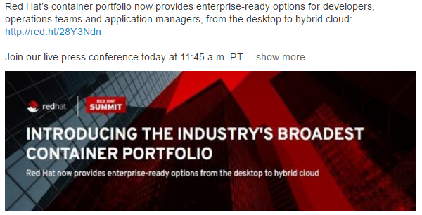
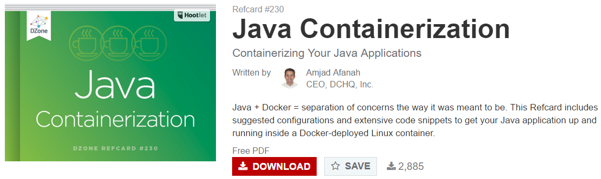
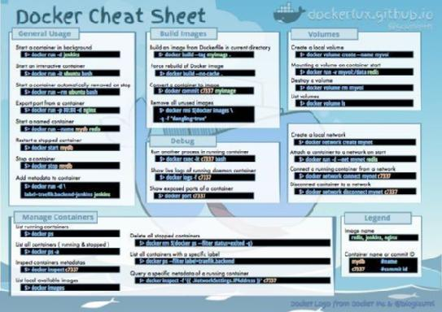
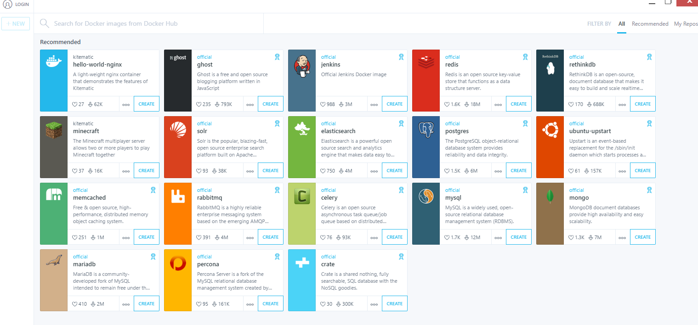
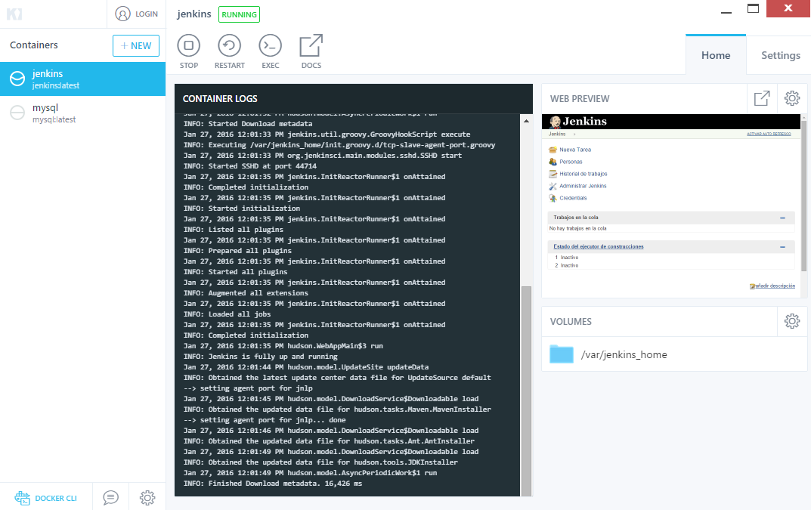
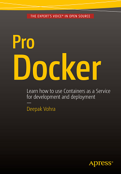
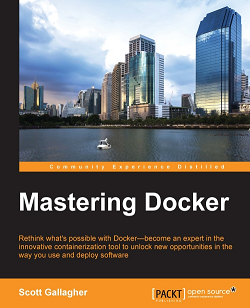
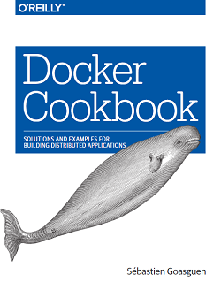
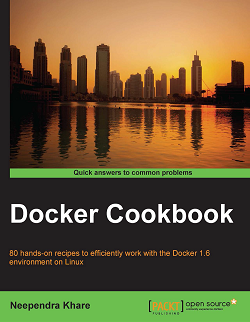
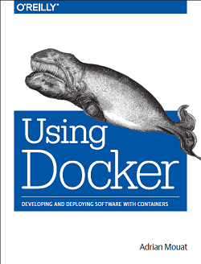

<!-- MarkdownTOC -->

- [Docker](#docker)
    - [Docker on Twitter](#docker-on-twitter)
    - [Docker references](#docker-references)
    - [Referencias Docker](#referencias-docker)
    - [Docker Networking](#docker-networking)
    - [Docker security](#docker-security)
    - [Docker Tools. Docker Machine. Docker Toolbox](#docker-tools-docker-machine-docker-toolbox)
        - [Docker and Eclipse IDE](#docker-and-eclipse-ide)
        - [Docker and Sublime Text](#docker-and-sublime-text)
    - [Docker Datacenter CaaS \(Container as a Service\)](#docker-datacenter-caas-container-as-a-service)
    - [MySQL via Docker](#mysql-via-docker)
    - [PostgreSQL via Docker](#postgresql-via-docker)
    - [WebLogic via Docker](#weblogic-via-docker)
    - [JBoss via Docker](#jboss-via-docker)
    - [Elasticsearch via Docker](#elasticsearch-via-docker)
    - [Swift via Docker](#swift-via-docker)
- [IBM Rational ClearCase](#ibm-rational-clearcase)

<!-- /MarkdownTOC -->

<blockquote class="twitter-tweet tw-align-center" data-lang="es">
My little <a href="https://twitter.com/docker">@docker</a> helper <a href="https://t.co/Td5ItMzZpu">https://t.co/Td5ItMzZpu</a> is today&#39;s #1 in /r/docker/ ! See it in action: <a href="https://t.co/JYnlTgW90R">https://t.co/JYnlTgW90R</a>
&mdash; Sergei Egorov (@bsideup) <a href="https://twitter.com/bsideup/status/702576371466440704">24 de febrero de 2016</a></blockquote>

<blockquote class="twitter-tweet tw-align-center" data-lang="es">
The <a href="https://twitter.com/docker">@docker</a> documentation is absolutely excellent. Learning Docker is a breeze.
&mdash; Akbar Ahmed (@Akbar501) <a href="https://twitter.com/Akbar501/status/702963778200035328">25 de febrero de 2016</a></blockquote>

<blockquote class="twitter-tweet tw-align-center" data-lang="es">
<a href="https://twitter.com/hashtag/Google?src=hash">#Google</a>&#39;s new managed <a href="https://twitter.com/hashtag/containers?src=hash">#containers</a> are brought to you by <a href="https://twitter.com/hashtag/RedHat?src=hash">#RedHat</a> <a href="https://t.co/yJXtuvCUo8">https://t.co/yJXtuvCUo8</a> via <a href="https://twitter.com/infoworld">@infoworld</a>
&mdash; Red Hat Cloud (@RedHatCloud) <a href="https://twitter.com/RedHatCloud/status/706987546434080768">7 de marzo de 2016</a></blockquote>

<blockquote class="twitter-tweet tw-align-center" data-lang="es">
.<a href="https://twitter.com/docker">@Docker</a>  Engine 1.12 natively deploys entire multi-tier distributed <a href="https://twitter.com/hashtag/apps?src=hash">#apps</a> by creating a distributed <a href="https://twitter.com/hashtag/app?src=hash">#app</a> bundle. <a href="https://t.co/0HFEmKlOOh">https://t.co/0HFEmKlOOh</a>
&mdash; Docker (@docker) <a href="https://twitter.com/docker/status/744947205971185664">20 de junio de 2016</a></blockquote>

<blockquote class="twitter-tweet tw-align-center" data-lang="es">
Ashesh, what&#39;s the transformation to containers and services been like?<a href="https://twitter.com/hashtag/CUBEgems?src=hash">#CUBEgems</a> <a href="https://twitter.com/asheshbadani">@asheshbadani</a> <a href="https://twitter.com/hashtag/RHSummit?src=hash">#RHSummit</a> <a href="https://t.co/b1pQZU4mZh">pic.twitter.com/b1pQZU4mZh</a>
&mdash; theCUBE (@theCUBE) <a href="https://twitter.com/theCUBE/status/748240026811531264">29 de junio de 2016</a></blockquote>

## Docker
### Docker on Twitter
- [twitter.com/docker](https://twitter.com/docker)
- [twitter.com/solomonstre](https://twitter.com/solomonstre)
- [twitter.com/DockerCon](https://twitter.com/DockerCon)
- [twitter.com/jpetazzo](https://twitter.com/jpetazzo)
- [twitter.com/frazelledazzell](https://twitter.com/frazelledazzell)
- [twitter.com/golubbe](https://twitter.com/golubbe)
- [twitter.com/coreoslinux](https://twitter.com/coreoslinux)
- [twitter.com/docker_fr](https://twitter.com/docker_fr)
- [twitter.com/DockerParis](https://twitter.com/DockerParis)
- [twitter.com/SecureDocker](https://twitter.com/SecureDocker)
- [twitter.com/DockerSwarm](https://twitter.com/DockerSwarm)

<blockquote class="twitter-tweet tw-align-center" data-lang="es">
<a href="https://twitter.com/hashtag/SwarmWeek?src=hash">#SwarmWeek</a>: Slides on <a href="https://twitter.com/docker">@Docker</a> as a Service and clustering with <a href="https://twitter.com/hashtag/DockerSwarm?src=hash">#DockerSwarm</a>: <a href="https://t.co/f8kbYjvs6u">https://t.co/f8kbYjvs6u</a>
&mdash; Docker (@docker) <a href="https://twitter.com/docker/status/707081671695323136">8 de marzo de 2016</a></blockquote>

<blockquote class="twitter-tweet tw-align-center" data-lang="es">
New to Docker? Check this video from <a href="https://t.co/G4aqEEmW4C">https://t.co/G4aqEEmW4C</a>, explaining Docker in 5 minutes | <a href="https://t.co/NdFvGgAiWg">https://t.co/NdFvGgAiWg</a>
&mdash; Red Hat Training (@RedHat_Training) <a href="https://twitter.com/RedHat_Training/status/710054254879215616">16 de marzo de 2016</a></blockquote>

<blockquote class="twitter-tweet tw-align-center" data-lang="es">
Creating local <a href="https://twitter.com/hashtag/DockerSwarm?src=hash">#DockerSwarm</a> cluster running in VMs on <a href="https://twitter.com/hashtag/Boot2Docker?src=hash">#Boot2Docker</a> <a href="https://t.co/f7x2D4vkrn">https://t.co/f7x2D4vkrn</a> <a href="https://twitter.com/docker_saigon">@docker_saigon</a> <a href="https://twitter.com/hashtag/SwarmWeek?src=hash">#SwarmWeek</a> <a href="https://t.co/OrGNVxHSm5">pic.twitter.com/OrGNVxHSm5</a>
&mdash; Docker (@docker) <a href="https://twitter.com/docker/status/710529394712956928">17 de marzo de 2016</a></blockquote>

### Docker references
- [gettopical.com: Docker Latest News](http://gettopical.com/docker)
- [Docker Hub](https://hub.docker.com)
- [github.com: Docker Official Images](https://github.com/docker-library/official-images)
- [docs.docker.com: Official Repositories on Docker Hub](https://docs.docker.com/docker-hub/official_repos/)
- [github.com: Docker Library](https://github.com/docker-library/)
- [Awesome Docker. A curated list of Docker resources and projects 🌟🌟🌟](https://github.com/veggiemonk/awesome-docker)
- [medium.com: Review of @nigelpoulton's course on @Docker and #Containers](https://medium.com/@vinrandazzo/docker-and-containers-do-you-want-to-design-beautiful-apps-99ad61d82168#.yfeaa5iiu)
- [DZone Refcard: Getting started with docker](https://dzone.com/refcardz/getting-started-with-docker-1)
- [blog.docker.com: Ten Docker Tips and Tricks That Will Make You Sing A Whale Song of Joy (July 2014) 🌟](https://blog.docker.com/2014/07/10-docker-tips-and-tricks-that-will-make-you-sing-a-whale-song-of-joy/)
- [10 Awesome Docker Tutorials to Kick-Start your DevOps Projects](http://www.javacodegeeks.com/2015/11/10-awesome-docker-tutorials-to-kick-start-your-devops-projects.html)
- [Introduction to Docker for Java Developers – Getting started with Docker](http://examples.javacodegeeks.com/devops/introduction-docker-java-developers/)
- [javacodegeeks.com: Why docker](http://www.javacodegeeks.com/2015/11/why-docker.html)
- [Why Docker Could Revolutionize Enterprise Cloud Computing](https://www.linkedin.com/pulse/why-docker-could-revolutionize-enterprise-cloud-computing-andy-waroma)
- [Adoption/popularity is the new king. The only constant is change! - puppet, chef, ansible, docker ](http://getcloudify.org/2015/10/21/configuration-management-chef-puppet-ansible-emc-dell-vmware-orchestration.html)
- [DockerCon EU: Software Testing with Docker](http://thenewstack.io/software-testing-docker/)
- [Docker for the python developer, podcast at http://talkpython.fm/](http://talkpython.fm/episodes/show/9/docker-for-the-python-developer)
- [How to be Successful Running Docker in Production](http://www.infoq.com/news/2015/11/running-docker-production)
- [Monitoring Docker: Part II](http://blog.logscape.com/2014/07/monitoring-docker-part-ii/)
- [Gathering LXC and Docker containers metrics](http://blog.docker.com/2013/10/gathering-lxc-docker-containers-metrics/)
- [Red Hat containers](http://www.redhat.com/en/insights/containers)
- [Red Hat loves containers in RHEL 7.2](http://www.zdnet.com/article/red-hat-loves-containers-in-rhel-7-2/)
- [Taste of Red Hat Training: Customizing a container to deploy a network service](http://www.redhat.com/en/about/videos/taste-red-hat-training-customizing-container-deploy-network-service)
- [Red Hat Drives Networking, Linux Container Innovation in Latest Version of Red Hat Enterprise Linux 7](http://www.redhat.com/en/about/press-releases/red-hat-drives-networking-linux-container-innovation-latest-version-red-hat-enterprise-linux-7)
- [Architecting Containers Part 1: Why Understanding User Space vs. Kernel Space Matters](http://rhelblog.redhat.com/2015/07/29/architecting-containers-part-1-user-space-vs-kernel-space/)
- [How Red Hat’s Inception DevOps team utilized Docker for the Release Engine](http://developerblog.redhat.com/2014/07/29/red-hat-inception-devops-team-utilized-docker-release-engine/)
- [5 Ways to Make Your DevOps Team More Efficient](https://www.linkedin.com/pulse/20140804141049-8208183-5-ways-to-make-your-devops-team-more-efficient)
- [slideshare: Busting the Five Biggest DevOps Myths](http://www.slideshare.net/CAinc/busting-the-five-biggest-devops-myths/)
- [Red Hat CEO Whitehurst on DevOps, apps, and infrastructure](http://www.networkworld.com/article/2688724/opensource-subnet/red-hat-ceo-whitehurst-on-devops-apps-and-infrastructure.html)
- [The DevOps Lifecycle: Keep C.A.L.M. and Carry On](http://newrelic.com/devops/lifecycle)
	- [How to Keep CALMS and Release More!](https://blog.logentries.com/2014/10/how-to-keep-calms-and-release-more/)
- [​CoreOS brings end-to-end trusted computing to containers](http://www.zdnet.com/article/coreos-brings-end-to-end-trusted-computing-to-containers/)
- [Docker cookbook](http://shop.oreilly.com/product/0636920036791.do?sortby=publicationDate)
- [Docker in Action - Fitter, Happier, More Productive](https://realpython.com/blog/python/docker-in-action-fitter-happier-more-productive/)
- [Docker for PHP Developers.Efficient Nginx, PHP, and MySQL development environments with Docker](http://www.newmediacampaigns.com/blog/docker-for-php-developers)
- [Dockerizing a Node.js Web Application](https://semaphoreci.com/community/tutorials/dockerizing-a-node-js-web-application)
- [DockerCon EU 2015 Videos: Use Cases](http://blog.docker.com/2015/12/dockercon-eu-2015-use-cases/)
- [Podcast: Docker & Puppet: Uniting Containers with Configuration Management](https://puppetlabs.com/podcasts/podcast-docker-puppet-combining-containers-configuration-management)
- [dchq.io via webcodegeeks.com: Advanced Platform for Automation of Container based Apps on any Cloud](http://www.webcodegeeks.com/web-development/step-step-guide-deploying-managing-php-application-docker-lamp-lapp-laop-stacks/)
- [medium.com: Logging with Docker — Part 1.1](https://medium.com/@yoanis_gil/logging-with-docker-part-1-b23ef1443aac#.j04jttgqb)
- [javacodegeeks.com: Docker Java Application With Solr, Mongo & Cassandra: Design, Deployment, Service Discovery, And Management In Production](http://www.javacodegeeks.com/2015/12/docker-java-application-with-solr-mongo-cassandra.html)
- [opensource.com: 10 cool tools from the Docker community](https://opensource.com/business/15/12/10-cool-tools-docker-community)
- [Docker Monitoring: Best Practices, and a Comparison of the cAdvisor and Prometheus Monitoring Tools](http://www.infoq.com/news/2015/12/dockercon-docker-monitoring)
- [The Role of Configuration Management in a Containerized World](http://www.infoq.com/news/2015/12/containers-vs-config-mgmt)
- [How to be Successful Running Docker in Production](http://www.infoq.com/news/2015/11/running-docker-production)
- [Stop Being Lazy, and Test Your Software (with the Help of Docker)](http://www.infoq.com/news/2015/11/testing-software-docker)
- [medium.com: Development environments with Docker](https://medium.com/on-docker/development-environments-with-docker-89657c7b4ea2#.paptr5pep)
- [Securing Docker with TLS certificates](http://tech.paulcz.net/2016/01/secure-docker-with-tls/)
- [ibm.com: Docker: A boon for the modern developer](http://www.ibm.com/developerworks/library/wa-docker-polyglot-programmers/index.html) Make the transition to containerized apps to increase coding productivity and boost your development IQ
- [javacodegeeks.com: 10 Awesome Docker Tutorials to Kick-Start your DevOps Projects](http://www.javacodegeeks.com/2015/11/10-awesome-docker-tutorials-to-kick-start-your-devops-projects.html)
- [examples.javacodegeeks.com: Docker Compose example](http://examples.javacodegeeks.com/devops/docker-compose-example)
- [Spotify GitHub: Docker garbage collection of containers and images](https://github.com/spotify/docker-gc) If you’re using Docker for development, you should probably know about this.
- [DevOps: The Importance of Monitoring Containers](http://www.javacodegeeks.com/2016/01/devops-the-importance-monitoring-containers.html)
- [Cisco slideshare: Monitoring docker container and dockerized applications](http://www.slideshare.net/AnanthCB/monitoring-docker-container-and-dockerized-applications)
- [prakhar.me: Docker for Beginners. Learn to build & deploy your distributed applications easily to the cloud with Docker](http://prakhar.me/docker-curriculum/)
	- [prakhar.me github: A comprehensive tutorial on getting started with Docker!](https://github.com/prakhar1989/docker-curriculum)
- [Dockerizing Commands (PHP). Chris Tankersley, author of 'Docker for Developers'](http://ctankersley.com/2015/12/23/dockerize-commands/)
	- [Docker for Developers, by Chris Tankersley](https://leanpub.com/dockerfordevs)
- [developerblog.redhat.com: A Practical Introduction to Docker Container Terminology](http://developerblog.redhat.com/2016/01/13/a-practical-introduction-to-docker-container-terminology/)
- [Starter, an open-source command line tool to generate a Dockerfile and a service.yml file from arbitrary source code](http://www.startwithdocker.com/)
	- [vimeo.com: Containers #101: Introduction to Starter](https://vimeo.com/149675614) In this session Khash gave an introduction to the the starter project. Starter is an open source project. It reads your code and generates a Dockerfile and service composition file you can then use to build images needed to run your application and the composition file to host it.
- [Swarm, a cluster manager for Docker: Collecting Metrics, Events & Logs](http://blog.sematext.com/2016/01/12/docker-swarm-collecting-metrics-events-logs/)
- [blog.emccode.com: Discovering Docker Volume Plugins and Applications with VirtualBox](http://blog.emccode.com/2016/01/06/discovering-docker-volume-plugins-and-applications-with-virtualbox/)
- [redhat.com: Great intro to container best practices on RHEL (and in general)..](https://access.redhat.com/documentation/en/red-hat-enterprise-linux-atomic-host/7/recommended-practices-for-container-development/recommended-practices-for-container-development) Best Practices Guide for Container Development
- [Containers: Just Because Everyone Else is Doing Them Wrong, Doesn't Mean You Have To (Feb 2016) 🌟🌟🌟](https://www.hastexo.com/blogs/florian/2016/02/21/containers-just-because-everyone-else/)
- [cio.com: FAQ What are containers and why do you need them? 🌟](http://www.cio.com/article/2924995/enterprise-software/what-are-containers-and-why-do-you-need-them.html)
- [infoworld.com: Are containers ready for prime time yet? 🌟](http://www.infoworld.com/article/3019136/cloud-computing/are-containers-ready-for-prime-time-yet.html) "Is now really the right time to be adopting containers? Hell no"
- [Docker, Red Hat & Linux: How containers can boost business and save time for developers](http://www.cbronline.com/news/enterprise-it/software/docker-red-hat-linux-how-containers-can-boost-business-and-save-time-for-developers-4816851)
- [video: Dockerize your Development Workstation 🌟](http://nauts.io/videos/2016/02/09/dockerize-your-development-workstation/)
- [DZone: Quick Java 8 or Java 7 Dev Environments With Docker](https://dzone.com/articles/docker-quick-java-8-or-java-7-dev-environment-with)
- [Techniques and tools to reduce Docker image size](http://chrisstump.online/2016/02/23/docker-image-reduction-techniques-and-tools/)
- [developmentalmadness.com: Working with Docker 🌟](http://www.developmentalmadness.com/2016/02/27/working-with-docker/)
- [medium.freecodecamp.com: A Beginner-Friendly Introduction to Containers, VMs and Docker 🌟🌟🌟](https://medium.freecodecamp.com/a-beginner-friendly-introduction-to-containers-vms-and-docker-79a9e3e119b)
- [The Do’s, Don’ts of Docker Containers 🌟](http://www.enterprisetech.com/2016/03/02/the-dos-donts-of-docker-containers/) Drawbacks and advantages of application containers. The initial problem argues Rafael Benevides, a senior software developer at Red Hat, is that many new users continue to treat containers like virtual machines.
- [10 things to avoid in docker containers 🌟🌟](http://developerblog.redhat.com/2016/02/24/10-things-to-avoid-in-docker-containers/)
- [developers.redhat.com: More about docker images size](http://developers.redhat.com/blog/2016/03/09/more-about-docker-images-size)
- [Docker Overview, Part One](https://deis.com/blog/2016/docker-overview-pt-1/)
- [linux.com: Introduction to Docker Compose Tool for Multi-Container Applications](http://www.linux.com/learn/tutorials/893685-introduction-to-docker-compose-tool-for-multi-container-applications)
- [DZone refcard: Java Containerization 🌟🌟](https://dzone.com/refcardz/java-containerization)
- [4 Cluster Management Tools to Compare 🌟🌟🌟](https://dzone.com/articles/4-cluster-management-tools-to-compare)
- [Docker Meets Continuous Deployment](https://dzone.com/articles/docker-meets-continuous-deployment)

### Referencias Docker
- [Dockerfile: Creación de imágenes docker 🌟](http://www.josedomingo.org/pledin/2016/02/dockerfile-creacion-de-imagenes-docker/)

<blockquote class="twitter-tweet tw-align-center" data-lang="es">
9 Common Dockerfile Mistakes <a href="https://twitter.com/hashtag/linux?src=hash">#linux</a> <a href="https://twitter.com/hashtag/sysadmin?src=hash">#sysadmin</a> <a href="https://twitter.com/hashtag/programmatic?src=hash">#programmatic</a> <a href="https://twitter.com/hashtag/CloudComputing?src=hash">#CloudComputing</a>  <a href="https://t.co/sb3KaHjdsi">https://t.co/sb3KaHjdsi</a>
&mdash; nixCraft (@nixcraft) <a href="https://twitter.com/nixcraft/status/742805356703711232">14 de junio de 2016</a></blockquote>

### Docker Networking
- [Deploying Containers with Docker Swarm and Docker Networking](http://www.javacodegeeks.com/2015/11/deploying-containers-docker-swarm-docker-networking.html)
- [Docker networking overview 🌟](http://filipv.net/2016/02/17/docker-networking-overview/)
- [Docker Swarm 1.0 with Multi-host Networking: Manual Setup](http://goelzer.com/blog/2015/12/29/docker-swarmoverlay-networks-manual-method/)

<iframe src="//www.slideshare.net/slideshow/embed_code/key/Dk9c8VYYykVABw" width="595" height="485" frameborder="0" marginwidth="0" marginheight="0" scrolling="no" style="border:1px solid #CCC; border-width:1px; margin-bottom:5px; max-width: 100%;" allowfullscreen class="video"> </iframe> 
 <strong> <a href="//www.slideshare.net/robertreiz/docker-ansible-51576034" title="Infrastructure Deployment with Docker &amp; Ansible" target="_blank">Infrastructure Deployment with Docker &amp; Ansible</a> </strong> from <strong><a href="//www.slideshare.net/robertreiz" target="_blank">Robert Reiz</a></strong> 

 

<iframe width="960" height="540" src="https://www.youtube.com/embed/WVGRaApIwkU" frameborder="0" allowfullscreen class="video"></iframe>

 

<blockquote class="twitter-tweet tw-align-center" data-lang="es">
Container Networking <a href="https://t.co/XgLoL48IZL">https://t.co/XgLoL48IZL</a>  <a href="https://twitter.com/hashtag/docker?src=hash">#docker</a> <a href="https://t.co/MsXKbhG009">pic.twitter.com/MsXKbhG009</a>
&mdash; DevOps Guy (@DevopsG) <a href="https://twitter.com/DevopsG/status/706489990654496768">6 de marzo de 2016</a></blockquote>

<blockquote class="twitter-tweet tw-align-center" data-lang="es">
Keep it small: a closer look at <a href="https://twitter.com/hashtag/Docker?src=hash">#Docker</a> image sizing - <a href="https://t.co/hMJSNnK5Ke">https://t.co/hMJSNnK5Ke</a> <a href="https://twitter.com/hashtag/Containers?src=hash">#Containers</a> <a href="https://twitter.com/hashtag/Cloud?src=hash">#Cloud</a> <a href="https://twitter.com/hashtag/Developers?src=hash">#Developers</a> <a href="https://t.co/9s1zeyvv8Y">pic.twitter.com/9s1zeyvv8Y</a>
&mdash; Red Hat Cloud (@RedHatCloud) <a href="https://twitter.com/RedHatCloud/status/712027257267589120">21 de marzo de 2016</a></blockquote>

<iframe src="//www.slideshare.net/slideshow/embed_code/key/D3becdVWdMCK5l" width="595" height="485" frameborder="0" marginwidth="0" marginheight="0" scrolling="no" style="border:1px solid #CCC; border-width:1px; margin-bottom:5px; max-width: 100%;" allowfullscreen class="video"> </iframe> 
 <strong> <a href="//www.slideshare.net/vsrecios/docker-up-and-running" title="Docker up and running" target="_blank">Docker up and running</a> </strong> from <strong><a target="_blank" href="//www.slideshare.net/vsrecios">Victor S. Recio</a></strong> 

 

<iframe width="560" height="315" src="https://www.youtube.com/embed/cxveLKw6BVw?rel=0" frameborder="0" allowfullscreen class="video"></iframe>

 

### Docker security
- [Free eBook - Docker Security: Using Containers Safely in Production](https://www.openshift.com/promotions/docker-security.html)
- [Docker and Security: How do they fit together?](https://jaxenter.com/docker-and-security-how-do-they-fit-together-122333.html)
- [youtube: Container security: Do containers actually contain? Should you care? - 2015 Red Hat Summit](https://youtu.be/a9lE9Urr6AQ)
- [Docker Security – part 1(Overview)](https://sreeninet.wordpress.com/2016/03/06/docker-security-part-1overview/)
- [Docker & Security refcard 🌟](https://www.ernw.de/download/ERNW_Stocard_Docker-Devops-Security_fbarth-mluft.pdf)

<blockquote class="twitter-tweet tw-align-center" data-lang="es">
Containers in Dev vs Prod <a href="https://t.co/YqDHvigW8r">pic.twitter.com/YqDHvigW8r</a>
&mdash; Michael Ducy (@mfdii) <a href="https://twitter.com/mfdii/status/697532387240996864">10 de febrero de 2016</a></blockquote>

### Docker Tools. Docker Machine. Docker Toolbox
- [Docker Machine](https://docs.docker.com/machine/)
	- [Docker toolbox](https://www.docker.com/docker-toolbox) The Docker Toolbox is an installer to quickly and easily install and setup a Docker environment on your computer. Available for both Windows and Mac, the Toolbox installs Docker Client, Machine, Compose, Kitematic and VirtualBox.
	- [Using Ansible with Docker Machine to Bootstrap Host Nodes](http://nathanleclaire.com/blog/2015/11/10/using-ansible-with-docker-machine-to-bootstrap-host-nodes/)
- [Get started with Docker on Windows using Chocolatey](https://stefanscherer.github.io/get-started-with-docker-on-windows-using-chocolatey/)
	- [chocolatey.org](https://chocolatey.org/) Chocolatey NuGet is a Machine Package Manager, somewhat like apt-get, but built with Windows in mind.
- [Runc Containers on the Desktop](https://blog.jessfraz.com/post/runc-containers-on-the-desktop/)
- [DLite: Simplifying Docker on OS X](https://blog.andyet.com/2016/01/25/easy-docker-on-osx/)

#### Docker and Eclipse IDE
- [DZone: New Tools for Using Docker in Eclipse](https://dzone.com/articles/new-tools-for-using-docker-in-eclipse)
- [eclipse.org: Eclipse for Docker](https://www.eclipse.org/community/eclipse_newsletter/2015/june/article3.php)
    - [Docker Tooling User Guide](https://wiki.eclipse.org/Linux_Tools_Project/Docker_Tooling/User_Guide)
- [Doclipser in GitHub](https://github.com/domeide/doclipser)
    - [Doclipser or how I’ve put Docker in your favorite IDE](https://jaxenter.com/doclipser-or-how-ive-put-docker-in-your-favorite-ide-124167.html)

#### Docker and Sublime Text
- [sublime-docker](https://github.com/domeide/sublime-docker)

<iframe src="//www.slideshare.net/slideshow/embed_code/key/92DXWf6Bo78A52" width="595" height="485" frameborder="0" marginwidth="0" marginheight="0" scrolling="no" style="border:1px solid #CCC; border-width:1px; margin-bottom:5px; max-width: 100%;" allowfullscreen class="video"> </iframe> 
 <strong> <a href="//www.slideshare.net/vsrecios/docker-started" title="Docker Started" target="_blank">Docker Started</a> </strong> from <strong><a target="_blank" href="//www.slideshare.net/vsrecios">Victor S. Recio</a></strong> 

 

<iframe src="//www.slideshare.net/slideshow/embed_code/key/2QFbK1HJKdU7it" width="595" height="485" frameborder="0" marginwidth="0" marginheight="0" scrolling="no" style="border:1px solid #CCC; border-width:1px; margin-bottom:5px; max-width: 100%;" allowfullscreen class="video"> </iframe> 
 <strong> <a href="//www.slideshare.net/yonghweekim/docker-toolbox" title="Docker toolbox" target="_blank">Docker toolbox</a> </strong> from <strong><a target="_blank" href="//www.slideshare.net/yonghweekim">Yonghwee Kim</a></strong> 

 

<iframe width="560" height="315" src="https://www.youtube.com/embed/0BmWDysy9RY" frameborder="0" allowfullscreen class="video"></iframe>

 

<iframe src="//www.slideshare.net/slideshow/embed_code/key/tZiMtKhOtaXQya" width="595" height="485" frameborder="0" marginwidth="0" marginheight="0" scrolling="no" style="border:1px solid #CCC; border-width:1px; margin-bottom:5px; max-width: 100%;" allowfullscreen class="video"> </iframe> 
 <strong> <a href="//www.slideshare.net/raychaser/comprehensive-monitoring-for-docker" title="Comprehensive Monitoring for Docker" target="_blank">Comprehensive Monitoring for Docker</a> </strong> from <strong><a target="_blank" href="//www.slideshare.net/raychaser">Christian Beedgen</a></strong> 

 

<iframe width="560" height="315" src="https://www.youtube.com/embed/67Mo5rMlN-k?rel=0" frameborder="0" allowfullscreen class="video"></iframe>

 

### Docker Datacenter CaaS (Container as a Service)
- [Docker Datacenter](http://www.docker.com/products/docker-datacenter)
- [Introducing Docker Datacenter to Power Your On-Premises CaaS](https://blog.docker.com/2016/02/docker-datacenter-caas/)

### MySQL via Docker
- [MySQL 5.7 Docker images](http://mysqlrelease.com/2015/12/update-from-dockerland-fruitful-collaboration-and-some-security-news/)

### PostgreSQL via Docker
- [Dockerizing PostgreSQL](https://docs.docker.com/engine/examples/postgresql_service/)

### WebLogic via Docker
- [multikoop.blogspot.com.es - WebLogic 12.2.1 on Docker](http://multikoop.blogspot.com.es/2015/12/weblogic-1221-on-docker.html)
- [community.oracle.com: Creating Fast, Scalable and Portable WebLogic Development Environments with Docker](https://community.oracle.com/docs/DOC-919606)
- [blogs.oracle.com: WebLogic on Docker Containers Series, Part 1](https://blogs.oracle.com/brunoborges/entry/docker_and_weblogic_enabling_cloud)
	- [blogs.oracle.com: WebLogic on Docker Containers Series, Part 2](https://blogs.oracle.com/brunoborges/entry/weblogic_on_docker_containers_series)
	- [dzone: WebLogic on Docker Containers Series — Part 2 ](https://dzone.com/articles/weblogic-on-docker-containers-series-part-2)
- [github: WebLogic on Docker](https://github.com/oracle/docker-images/tree/master/OracleWebLogic) Sample Docker configurations to facilitate installation, configuration, and environment setup for DevOps users. This project includes dockerfiles and samples for both WebLogic 12.1.3 and 12.2.1 based on Oracle Linux and Oracle JDK 8
	- [Oracle WebLogic on Multihost Network Docker](https://github.com/oracle/docker-images/tree/master/OracleWebLogic/samples/1221-multihost) Say hello to WebLogic on a multihost network of Docker containers using Docker Machine. This sample demonstrates how to create a cluster of WebLogic on a multihost network of Docker containers.
- [github: Oracle's docker images. A real WebLogic cluster on a swarm of Docker containers](https://github.com/oracle/docker-images/commit/ad34abf5f5b1186ea119ec4586fd158c0631182b)
- [blogs.oracle.com: Faster FMW Devops using Docker Containers](https://blogs.oracle.com/OracleWebCenterSuite/entry/faster_fmw_devops_using_docker)
- [blogs.oracle.com: Orchestrate FMW Environments with Docker Compose](https://blogs.oracle.com/OracleWebCenterSuite/entry/docker_compose_fusion_middleware_12c)

### JBoss via Docker
- [oraclejavamagazine-digital.com: Using Docker in Java Applications](http://www.oraclejavamagazine-digital.com/javamagazine_twitter/20151112?pg=52#pg52) The lightweight virtualization container is fast becoming the preferred way to package and deploy Java web apps.

### Elasticsearch via Docker

<iframe src="//www.slideshare.net/slideshow/embed_code/key/MBkpsrtRagSGKu" width="595" height="485" frameborder="0" marginwidth="0" marginheight="0" scrolling="no" style="border:1px solid #CCC; border-width:1px; margin-bottom:5px; max-width: 100%;" allowfullscreen class="video"> </iframe> 
 <strong> <a href="//www.slideshare.net/sematext/running-highperformance-and-fault-tolerant-elasticsearch-clusters-on-docker" title="Running High Performance and Fault Tolerant Elasticsearch Clusters on Docker" target="_blank">Running High Performance and Fault Tolerant Elasticsearch Clusters on Docker</a> </strong> from <strong><a href="//www.slideshare.net/sematext" target="_blank">Sematext Group, Inc. </a></strong> 

 

### Swift via Docker
- [developer.ibm.com: running swift within docker](https://developer.ibm.com/swift/2015/12/15/running-swift-within-docker/)

## IBM Rational ClearCase 
- [Deploying secure software configuration management](http://www.ibm.com/developerworks/rational/library/rational-deploy-secure-software-configuration-management-trs/index.html)

<a href="http://tech.crowdfireapp.com/post/119849601579/hello-docker">http://tech.crowdfireapp.com/post/119849601579/hello-docker</a>

<blockquote class="twitter-tweet tw-align-center" data-lang="es">
How to host a coder dinner-party  <a href="https://t.co/m0ydFQMNnA">https://t.co/m0ydFQMNnA</a> <a href="https://t.co/hhV5NBpHHB">pic.twitter.com/hhV5NBpHHB</a>
&mdash; CommitStrip (@CommitStrip) <a href="https://twitter.com/CommitStrip/status/746407865485766657">24 de junio de 2016</a></blockquote>

<blockquote class="twitter-tweet tw-align-center" data-lang="es">
LOL. Yes. Jail all fat a$$ process ;) Via <a href="https://t.co/IYk50bh6ua">https://t.co/IYk50bh6ua</a> <a href="https://twitter.com/hashtag/sysadmin?src=hash">#sysadmin</a> <a href="https://twitter.com/hashtag/linux?src=hash">#linux</a> <a href="https://twitter.com/hashtag/docker?src=hash">#docker</a> <a href="https://twitter.com/hashtag/IT?src=hash">#IT</a> <a href="https://t.co/njWwxrc0ap">pic.twitter.com/njWwxrc0ap</a>
&mdash; nixCraft (@nixcraft) <a href="https://twitter.com/nixcraft/status/712933048761892864">24 de marzo de 2016</a></blockquote>
