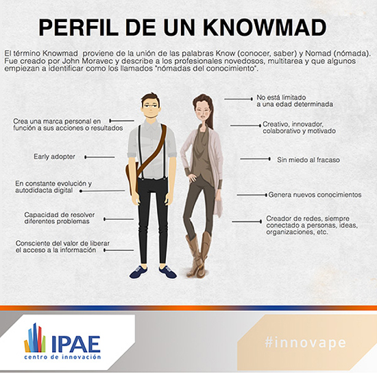
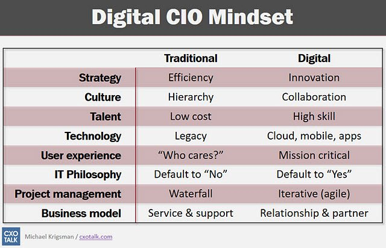
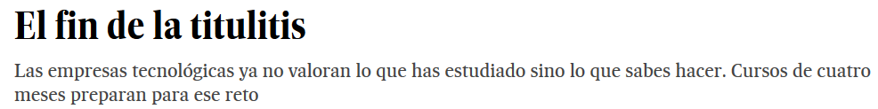
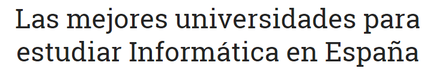
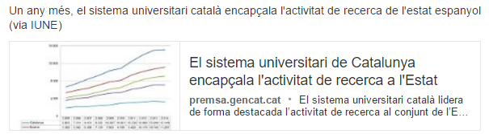
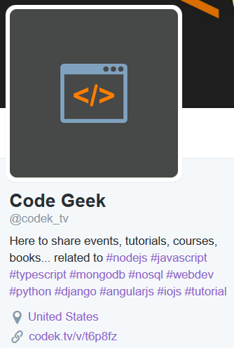
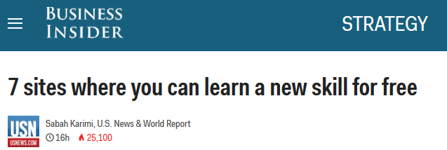
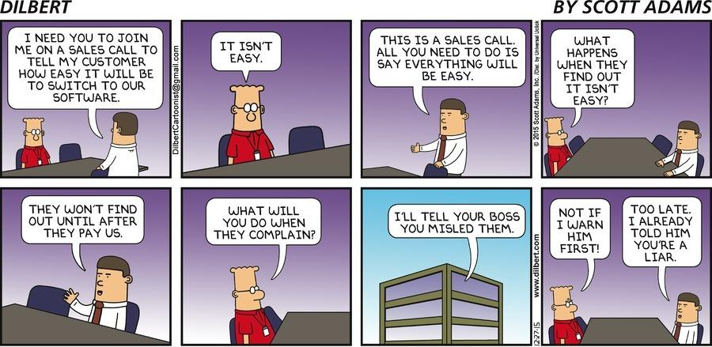

**Table of Contents**
<!-- MarkdownTOC -->

- [E-Learning](#e-learning)
	- [Professional Certification](#professional-certification)
	- [Udemy. Lifetime access with no subscription. Drop the price of any Udemy Course to 11 or 12 euro with a Coupon Code](#udemy-lifetime-access-with-no-subscription-drop-the-price-of-any-udemy-course-to-11-or-12-euro-with-a-coupon-code)
	- [Free e-learning](#free-e-learning)
	- [Download Free Legal eBooks](#download-free-legal-ebooks)
	- [Alternatives](#alternatives)

<!-- /MarkdownTOC -->

<blockquote class="twitter-tweet tw-align-center" data-lang="es">
<a href="https://twitter.com/hashtag/DrHouse?src=hash">#DrHouse</a> atiende a mujer con asma: <a href="http://t.co/IwNjEizN">http://t.co/IwNjEizN</a> vía <a href="https://twitter.com/YouTube">@youtube</a>
&mdash; María José.✌ (@MajoRamosR) <a href="https://twitter.com/MajoRamosR/status/294219139717922816">23 de enero de 2013</a></blockquote>

<iframe width="560" height="315" src="https://www.youtube.com/embed/6529hLGsJW8?rel=0" frameborder="0" allowfullscreen class="video"></iframe>

 

# E-Learning
- [who's responsible addressing the skills gap? The employee or the employer? In 2016, Bridging the Skills Gap Is Everyone's Opportunity](http://www.huffingtonpost.com/dennis-yang/in-2016-bridging-the-skills-gap-is-everyones-opportunity_b_8855796.html)
- [ycombinator.com: What's the best way to train/onboard new programmers?](https://news.ycombinator.com/item?id=10890032)
- [Martin Fowler: Certification Vs Competence](http://martinfowler.com/bliki/CertificationCompetenceCorrelation.html)
- [Please Don't Learn to Code Unless... 🌟🌟](https://www.linkedin.com/pulse/please-dont-learn-code-unless-basel-farag)

## Professional Certification
- [certifications.bcs.org](http://certifications.bcs.org)
- [Six Certification Exam Mistakes to Avoid](http://www.globalknowledge.com/training/generic.asp?pageid=3833)

<blockquote class="twitter-tweet tw-align-center" data-lang="es">
When someone asks about certification, show them this. <a href="https://twitter.com/hashtag/sysadmin?src=hash">#sysadmin</a> <a href="https://twitter.com/hashtag/humor?src=hash">#humor</a> <a href="https://twitter.com/hashtag/IT?src=hash">#IT</a> <a href="https://t.co/4mgZlTnnt2">pic.twitter.com/4mgZlTnnt2</a>
&mdash; Portnox (@portnox) <a href="https://twitter.com/portnox/status/715569497332191233">31 de marzo de 2016</a></blockquote>

## Udemy. Lifetime access with no subscription. Drop the price of any Udemy Course to 11 or 12 euro with a Coupon Code
- [twitter.com/udemy](https://twitter.com/udemy)
- [ITIL Lite, a basic introduction to the world of ITIL](https://www.udemy.com/itil-lite/)
- [Basics of Scrum, Agile and Project Delivery](https://www.udemy.com/scrum-methodology/)
- [The Enterprise Lean Startup Survival Guide (Free)](https://www.udemy.com/the-enterprise-lean-startup-survival-guide/) Learn how to identify and address common organizational traps when introducing Lean Startup to large organizations
    - [Project Management For Entrepreneurs: 10X Results Today](https://www.udemy.com/project-management-hacks-to-less-stress-and-bigger-paychecks)
- [Red Hat Certified System Administrator - Exam EX200 - RHCSA](https://www.udemy.com/red-hat-certified-system-administrator-exam-ex200-rhcsa/)
	- [Learn To Run Linux Servers From Scratch (LPI Level 1-101)](https://www.udemy.com/draft/19966/)
	- [Learn To Run Linux Servers Part 2 (LPI Level 1-102)](https://www.udemy.com/linuxacademy2/)
- [Learning Puppet](https://www.udemy.com/learning-puppet/)
    - [Build your own Manageable Puppet Infrastructure](https://www.udemy.com/manageable-puppet-infrastructure/)
- [Mastering Ansible - November 2015](https://www.udemy.com/mastering-ansible/?couponCode=REDDIT15)
- [Git Complete: The definitive, step-by-step guide to Git](https://www.udemy.com/git-complete)
	- [Command Line Essentials: Git Bash for Windows (free)](https://www.udemy.com/git-bash/)
	- [Git Going Fast: One Hour Git Crash Course (free)](https://www.udemy.com/git-going-fast/)
	- [Vagrant Up! Comprehensive development system automation](https://www.udemy.com/vagrant-up/)
- [Jenkins Bootcamp: Fully Automate Builds Through Deployment 🌟🌟](https://www.udemy.com/jenkins-continuous-integration-bootcamp/)
	- [Jenkins: Learn continuous integration with Jenkins](https://www.udemy.com/jenkins-learn-continuous-integration/)
	- [Learn Devops: Continuously Deliver Better Software](https://www.udemy.com/learn-devops-continuously-deliver-better-software/)
- [Oracle WebLogic 12c for Administrators](https://www.udemy.com/oracle-weblogic-12c-for-administrators/)
	- [learnweblogiconline.com: free weblogic webinar](http://www.learnweblogiconline.com/free-weblogic-webinar/)
- [Oracle Database 12c Lenguaje de programación PL/SQL](https://www.udemy.com/oracle-database-12c-lenguaje-de-programacion-plsql)
- [Learn Database Design using PostgreSQL](https://www.udemy.com/learn-database-design-using-postgresql/?couponCode=POSTGREs20)
- [MySQL for Beginners ](https://www.udemy.com/mysql-db-for-beginners)
    - [Learning MySQL5 - An Easy Way To Master MySQL](https://www.udemy.com/learning-mysql5)
    - [MySQL Database MasterClass: Go From Pupil To Master!](https://www.udemy.com/mysql-for-beginners-mysql-101-how-to-use-mysql/)
- [Learning MongoDB](https://www.udemy.com/learning-mongodb2/)
- [VMware ESXi and vSphere Admin Tutorial](https://www.udemy.com/vmware-esxi-and-vsphere-admin-tutorial/)
- [Learn Software Testing from Scratch](https://www.udemy.com/learn-software-testing-from-scratch/?ccManual=&dtcode=wmOZ6Dq2WrKO&couponCode=qa10)
    - [Selenium Webdriver 2.0: Master Automated Testing](https://www.udemy.com/selenium-webdriver-20-a-beginners-guide-to-selenium)
	- [Selenium WebDriver With Java - Novice To Ninja + Interview](https://www.udemy.com/selenium-webdriver-with-java-testng-and-log4j/)
	- [Advanced Selenium(Architect)-Pageobject,TestNG,Maven,Jenkins](https://www.udemy.com/selenium-framework-design-pageobjecttestngmavenjenkins/)
- [The Complete Web Developer Course - Build 14 Websites](https://www.udemy.com/complete-web-developer-course/)
- [Build an application from scratch: JEE 7, Java 8 and Wildfly](https://www.udemy.com/build-an-application-from-scratch-jee-7-java-8-and-wildfly/)
- [JavaScript: Understanding the Weird Parts](https://www.udemy.com/understand-javascript)
- [Taming Big Data with Apache Spark - Hands On!](https://www.udemy.com/taming-big-data-with-apache-spark-hands-on/?couponCode=SPARK15)
- [Taming Big Data with MapReduce and Hadoop - Hands On!](https://www.udemy.com/taming-big-data-with-mapreduce-and-hadoop/)
- [Learning Python for Data Analysis and Visualization](https://www.udemy.com/learning-python-for-data-analysis-and-visualization)
- [Transition your SQL skills into R skills with this FREE training. Baseball Database Queries with SQL and dplyr](https://www.udemy.com/baseball1/)
- [Data visualization: Tableau](https://www.udemy.com/tableau/)
- [Zabbix Network Monitoring Essentials](https://www.udemy.com/zabbix-network-monitoring-essentials/)
- [Sensu - Introduction (free, alternative to Zabbix, Icinga & Nagios)](https://www.udemy.com/sensu-introduction/)
- [Wireshark Crash Course](https://www.udemy.com/wireshark-crash-course/)
- [The Complete Ethical Hacking Course: Beginner to Advanced! ethical hacking, penetration testing, web testing, and wifi hacking using kali linux](https://www.udemy.com/penetration-testing/?couponCode=PA9)
    - [Start Kali Linux, Ethical Hacking and Penetration Testing! (Free)](https://www.udemy.com/ethical-hacker/)
	- [Certified WhiteHat Hacker Level 1 (CWHH Level 1) (Free)](https://www.udemy.com/certified-whitehat-hacker-level-1/)
    - [Certified White Hat Hacker Level 2 (CWHH Level 2)](https://www.udemy.com/certified-white-hat-hacker-level-2/)
    - [CWHH Level 2 - Break the Security (CWHH-BTS)](https://www.udemy.com/certified-whitehat-hacker-level-2-break-the-security/)
- [An Entire MBA in 1 Course:Award Winning Business School Prof](https://www.udemy.com/an-entire-mba-in-1-courseaward-winning-business-school-prof/)
	- [A former Goldman Sachs employee has condensed an entire MBA into one online course](http://www.businessinsider.com/goldman-sachs-mba-online-course-udemy-deal-2016-2)

<blockquote class="twitter-tweet tw-align-center" data-lang="es">
Passed the AWS Solution Architect Associate exam today.. Highly recommend the <a href="https://twitter.com/acloudguru">@acloudguru</a> courses for exam prep. <a href="https://t.co/lJiJefDbsD">https://t.co/lJiJefDbsD</a>
&mdash; Mairtin O Sullivan (@_mairtin_) <a href="https://twitter.com/_mairtin_/status/691612822002868224">enero 25, 2016</a></blockquote>

<iframe width="560" height="315" src="https://www.youtube.com/embed/k1Pu0_tIgR4" frameborder="0" allowfullscreen class="video"></iframe>

 

<iframe width="560" height="315" src="https://www.youtube.com/embed/i07qz_6Mk7g?rel=0" frameborder="0" allowfullscreen class="video"></iframe>

 

<blockquote class="twitter-tweet tw-align-center" data-lang="es">
La revolución digital pide un nuevo modelo de formación <a href="https://t.co/epmputfc5y">https://t.co/epmputfc5y</a> <a href="https://t.co/nbC4rhjP3m">pic.twitter.com/nbC4rhjP3m</a>
&mdash; Cinco Días (@CincoDiascom) <a href="https://twitter.com/CincoDiascom/status/707861359254343680">10 de marzo de 2016</a></blockquote>

<blockquote class="twitter-tweet tw-align-center" data-lang="es">
¿Cuáles son las universidades más valoradas por las empresas? <a href="https://twitter.com/elmundoes">@elmundoes</a> <a href="https://t.co/H627FC2439">https://t.co/H627FC2439</a> <a href="https://t.co/vmdTgYxo4o">pic.twitter.com/vmdTgYxo4o</a>
&mdash; Santiago Satué (@satueabogado) <a href="https://twitter.com/satueabogado/status/742807082471182344">14 de junio de 2016</a></blockquote>

## Free e-learning
- [e-learning.zeef.com: list of free e-learning tools](https://e-learning.zeef.com)
- [Flo-Joe: THE place on the web for Cambridge exam preparation](http://www.flo-joe.co.uk/) 
- [edx.org](https://www.edx.org)
- [edX.org: English Grammar and Essay Writing, Berkeley](https://www.edx.org/course/english-grammar-essay-writing-uc-berkeleyx-colwri2-2x)
- [edx.org: Implementing DHCP in Microsoft Windows Server](https://www.edx.org/course/implementing-dhcp-microsoft-windows-microsoft-inf201-31x)
- [edx.org: Introduction to Python for Data Science (Microsoft)](https://www.edx.org/course/introduction-python-data-science-microsoft-dat208x)
- [Coursera](http://coursera.org)
- [Codecademy](https://www.codecademy.com)
- [Udacity](https://www.udacity.com/)
	- [Deep Learning by Google](https://www.udacity.com/course/deep-learning--ud730)
- [Guru99: Selenium,QTP,Java, SAP,Test Management, Linux,Ethical Hacking, Mobile Testing,Accounting, etc](http://www.guru99.com/)
- [TutorialsPoint](http://www.tutorialspoint.com)
- [Vogella tutorials](http://www.vogella.com/tutorials/)
- [Typing, una web para que los programadores practiquen](http://wwwhatsnew.com/2015/06/19/typing-una-web-para-que-los-programadores-practiquen/)
- [Databricks to run two massive online courses on Apache Spark](https://databricks.com/blog/2014/12/02/announcing-two-spark-based-moocs.html)
	- [edx.org - Introduction to Big Data with Apache Spark](https://www.edx.org/course/uc-berkeleyx/uc-berkeleyx-cs100-1x-introduction-big-6181)
	- [edx.org - Scalable Machine Learning](https://www.edx.org/course/uc-berkeleyx/uc-berkeleyx-cs190-1x-scalable-machine-6066)
- [INE.com training videos: Wireshark, vSphere 6.0, CCNA, MPLS, BGP, etc](https://www.youtube.com/user/INEtraining/playlists)
- [training.linuxfoundation.org: Free Linux Training Publications](https://training.linuxfoundation.org/free-linux-training/download-training-materials)
- [khanacademy.org](https://khanacademy.org/)
- [patreon.com/crashcourse](https://www.patreon.com/crashcourse) We provide entertaining high-quality education to the entire world for free... no big
	- [CrashCourse - youtube](https://www.youtube.com/user/crashcourse)
- [tutorialepractico.com](http://www.tutorialepractico.com)
- [tutorialepractico.com: Google presenta ocho cursos gratuitos y certificados que no debes perderte](http://www.tutorialepractico.com/2016/02/google-presenta-ocho-cursos-gratuitos-y.html)
- [codek.tv 🌟🌟](https://codek.tv/)
    - [twitter.com/codek_tv](https://twitter.com/codek_tv)
- [codely.TV 🌟](http://codely.tv/) Vídeos cada jueves. Objetivos: Transmitir conocimiento mediante screencasts de programación y dar a conocer el mundo de la informática vía entrevistas.
	- [twitter.com/CodelyTV](https://twitter.com/CodelyTV)

## Download Free Legal eBooks
- [wowebook.org: Download Free Legal eBooks](http://www.wowebook.org/)
	- [Amazon Web Services in Action](http://www.wowebook.org/amazon-web-services-in-action.html)
- [it-ebooks.info 🌟🌟](https://it-ebooks.info/)
- [webcodegeeks.tradepub.com](http://webcodegeeks.tradepub.com/)
- [Microsoft has released over 100 Free Ebooks 🌟](http://blogs.msdn.com/b/mssmallbiz/archive/2014/07/07/largest-collection-of-free-microsoft-ebooks-ever-including-windows-8-1-windows-8-windows-7-office-2013-office-365-office-2010-sharepoint-2013-dynamics-crm-powershell-exchange-server-lync-2013-system-center-azure-cloud-sql.aspx)
- [OpenLibra.com 🌟](https://openlibra.com) La Biblioteca Libre online: libros y ebooks en PDF gratis

## Alternatives
- [javacodegeeks.com: 11 Online Learning websites to learn how to code and more!](http://www.javacodegeeks.com/2013/01/15-online-learning-websites-that-you-should-check-out.html)
- [eLearning at deals.slashdot.org](https://deals.slashdot.org/deals/elearning)
- [A Cloud Guru, AWS Certification Courses (available in Udemy)](https://acloud.guru)
	- [What is the value of an AWS certification?](https://read.acloud.guru/the-value-of-an-aws-certification-b326779c9679)
- [CloudAcademy](https://cloudacademy.com/)
	- [AWS Certification Books: free e-book downloads](http://cloudacademy.com/blog/aws-certification-book/)
	- [AWS Certified Developer Fundamentals](https://cloudacademy.com/learning-paths/aws-certified-developer-fundamentals/)
- [Global Knowledge is named as Amazon Web Services (AWS) Authorized Training Provider in the UK 🌟](http://www.trainingpressreleases.com/news/global-knowledge/2016/global-knowledge-is-named-as-amazon-web-services-aws-authorized-training-provider-in-the-uk)
	- [www.globalknowledge.co.uk/aws 🌟🌟](http://www.globalknowledge.co.uk/aws)
- [AWS Solutions Architect – Education options. Good blog on AWS certification options](http://nimbusarchitect.us/blog/?p=7)
- [deals.slashdot.org: AWS Engineer Certification Bundle](https://deals.slashdot.org/sales/aws-associate-certification-bundle)
- [slashdot.org: Project Management Certification Bundle](https://deals.slashdot.org/sales/pmp-certification-bundle) 6 Foolproof Training Courses: Ace the Globally-Recognized Project Management Professional Exam
- [Aba English - Barcelona](http://www.abaenglish.com)
- [Pearson English](http://www.english.com/)
	- [Pearson English Business Solutions](http://www.globalenglish.com)
- [BBC Learning English](http://www.bbc.co.uk/learningenglish)
- [Los mejores canales de YouTube para aprender inglés gratis 🌟](http://www.ticbeat.com/educacion/los-mejores-canales-de-youtube-para-aprender-ingles-gratis/)
- [Red Hat Training announces new way to train: Video Classroom](http://servicesblog.redhat.com/2015/08/17/red-hat-training-announces-new-way-to-train-video-classroom/)
- [Nuevos Cursos de Formación Oficial OpenStack](http://www.josemariagonzalez.es/2016/01/20/nuevos-cursos-de-formacion-oficial-openstack.html)
- [Lynda.com Databases](http://www.lynda.com/Databases-training-tutorials/)
- [springboard.com - Learn Data Science & UX Design online](https://www.springboard.com)
- [udemy.com: Fired To Hired: 8 Steps To Get You Back To Work](https://www.udemy.com/fired-to-hired-8-steps-to-get-you-back-to-work/)

<blockquote class="twitter-tweet tw-align-center" data-lang="es">
En tan solo 4 días te preparamos para conseguir tu certificación <a href="https://twitter.com/hashtag/RedHat?src=hash">#RedHat</a> JBoss Administrator <a href="https://t.co/WydpYsPJPv">https://t.co/WydpYsPJPv</a> <a href="https://t.co/2IGiZVPvro">pic.twitter.com/2IGiZVPvro</a>
&mdash; Global Knowledge ESP (@GK_Spain) <a href="https://twitter.com/GK_Spain/status/742749900371267584">14 de junio de 2016</a></blockquote>

<iframe width="560" height="315" src="https://www.youtube.com/embed/Djt2Br1SYP0?rel=0" frameborder="0" allowfullscreen class="video"></iframe>

 

<iframe width="560" height="315" src="https://www.youtube.com/embed/V-tukkn1cOk?rel=0" frameborder="0" allowfullscreen class="video"></iframe>

 

<blockquote class="twitter-tweet tw-align-center" data-lang="es">
This is crazy. RT <a href="https://twitter.com/RearAdBsBlog">@RearAdBsBlog</a>: Wow RT <a href="https://twitter.com/dre_65">@dre_65</a>: Jack Nicholson preppin&#39; for The Shining <a href="https://t.co/REqW3iWc8y">https://t.co/REqW3iWc8y</a>
&mdash; Toucher and Rich (@Toucherandrich) <a href="https://twitter.com/Toucherandrich/status/708824229312122880">13 de marzo de 2016</a></blockquote>

<iframe width="560" height="315" src="https://www.youtube.com/embed/SDGPjQgzZY0?rel=0" frameborder="0" allowfullscreen class="video"></iframe>

 

<iframe src='http://players.brightcove.net/1898269467/default_default/index.html?videoId=4922929276001' allowfullscreen frameborder=0 class="video"></iframe>

 

<blockquote class="twitter-tweet tw-align-center" data-lang="es">
<a href="https://twitter.com/hashtag/EUSkillsAgenda?src=hash">#EUSkillsAgenda</a> 1 in 5 EU adult workers at serious risk of <a href="https://twitter.com/hashtag/skill?src=hash">#skill</a> obsolescence says <a href="https://twitter.com/Cedefop">@Cedefop</a> <a href="https://twitter.com/hashtag/ESJsurvey?src=hash">#ESJsurvey</a> <a href="https://twitter.com/EU_Social">@EU_Social</a> <a href="https://t.co/4gLpTP8kBt">pic.twitter.com/4gLpTP8kBt</a>
&mdash; Kostas Pouliakas (@K_Pouliakas) <a href="https://twitter.com/K_Pouliakas/status/741239641077121024">10 de junio de 2016</a></blockquote>

<blockquote class="twitter-tweet tw-align-center" data-lang="es">
10 jobs that didn’t exist 10 years ago <a href="https://t.co/rNnpxLkRwU">https://t.co/rNnpxLkRwU</a> <a href="https://twitter.com/hashtag/work?src=hash">#work</a> <a href="https://t.co/bVjaKp8LWr">pic.twitter.com/bVjaKp8LWr</a>
&mdash; World Economic Forum (@wef) <a href="https://twitter.com/wef/status/741249855562092544">10 de junio de 2016</a></blockquote>

<blockquote class="twitter-tweet tw-align-center" data-lang="es">
When your homie lands their trick <a href="https://t.co/yldgeXaKxa">pic.twitter.com/yldgeXaKxa</a>
&mdash; Matt (@mattwithav) <a href="https://twitter.com/mattwithav/status/712362125423849473">22 de marzo de 2016</a></blockquote>