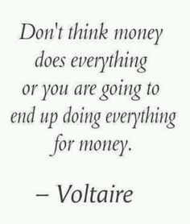
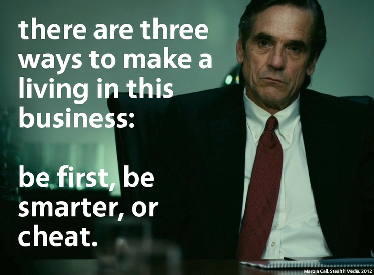

<!-- MarkdownTOC -->

- [Economy Videos](#economy-videos)
    - [IT Leaders](#it-leaders)
    - [Margin Call film](#margin-call-film)
    - [Wall Street film](#wall-street-film)
    - [The Wolf of Wall Street film](#the-wolf-of-wall-street-film)
    - [Glengarry Glen Ross film](#glengarry-glen-ross-film)
    - [Boiler Room film](#boiler-room-film)
    - [Paths of Glory film](#paths-of-glory-film)
    - [Capitalism and Socialism](#capitalism-and-socialism)
    - [The Hollywood Blacklist: 1947-1960](#the-hollywood-blacklist-1947-1960)
    - [JFK film](#jfk-film)
    - [How I Learned to Stop Worrying and Love the Bomb](#how-i-learned-to-stop-worrying-and-love-the-bomb)
    - [Antonio Gasset en Dias de Cine](#antonio-gasset-en-dias-de-cine)

<!-- /MarkdownTOC -->

# Economy Videos

<iframe width="560" height="315" src="https://www.youtube.com/embed/XKYQa5zvVvE?rel=0" frameborder="0" allowfullscreen class="video"></iframe>

 

<iframe width="560" height="315" src="https://www.youtube.com/embed/n_2zMQyn7VQ?rel=0" frameborder="0" allowfullscreen class="video"></iframe>

 

<iframe width="560" height="315" src="https://www.youtube.com/embed/j4_tyEl84IQ?rel=0" frameborder="0" allowfullscreen class="video"></iframe>

 

<iframe width="560" height="315" src="https://www.youtube.com/embed/aS6tNw3xi2o?rel=0" frameborder="0" allowfullscreen class="video"></iframe>

 

<iframe width="560" height="315" src="https://www.youtube.com/embed/ULQiCN0YNmw?rel=0" frameborder="0" allowfullscreen class="video"></iframe>

 

<iframe width="560" height="315" src="https://www.youtube.com/embed/XkcL1McJJ4Y?rel=0" frameborder="0" allowfullscreen class="video"></iframe>

 

<iframe width="560" height="315" src="https://www.youtube.com/embed/Z1LCBp0twLE?rel=0" frameborder="0" allowfullscreen class="video"></iframe>

 

<iframe width="560" height="315" src="https://www.youtube.com/embed/5XfSbtckpnA?rel=0" frameborder="0" allowfullscreen class="video"></iframe>

 

<iframe width="560" height="315" src="https://www.youtube.com/embed/VQzEWeGJLP0?rel=0" frameborder="0" allowfullscreen class="video"></iframe>

 

## IT Leaders

<iframe width="560" height="315" src="https://www.youtube.com/embed/667WfX-6yCM?rel=0" frameborder="0" allowfullscreen class="video"></iframe>

 

## Margin Call film

<iframe width="1280" height="720" src="https://www.youtube-nocookie.com/embed/IjZ-ke1kJrA?rel=0" frameborder="0" allowfullscreen class="video"></iframe>

  

<iframe width="560" height="315" src="https://www.youtube.com/embed/e6WyN4z0VGc?list=PL_U58TaSOS-VEg9U3ePdmkSu7VzIyrdW1" frameborder="0" allowfullscreen class="video"></iframe>

  

<iframe width="560" height="315" src="https://www.youtube.com/embed/v4P4cS5jKmQ?list=PL_U58TaSOS-VEg9U3ePdmkSu7VzIyrdW1" frameborder="0" allowfullscreen class="video"></iframe>

 

## Wall Street film

<blockquote class="twitter-tweet tw-align-center" data-lang="es">
Wall Street - Trailer (Starring: Charlie Sheen, Michael Douglas, Tamara ... <a href="https://t.co/qQAnbcMUxC">https://t.co/qQAnbcMUxC</a> via <a href="https://twitter.com/YouTube">@YouTube</a>
&mdash; Suzi (@suzi_sunshine99) <a href="https://twitter.com/suzi_sunshine99/status/651373854527463425">6 de octubre de 2015</a></blockquote>

<blockquote class="twitter-tweet tw-align-center" data-lang="es">
Wall Street 2: Money Never Sleeps- <a href="https://t.co/QCuCTWPzxK">https://t.co/QCuCTWPzxK</a> via <a href="https://twitter.com/youtube_men">@YouTube_MEN</a>,WOMEN&amp; KIDS,THAT STEAL FROM THERE OWN KIDS,FAMILY &amp; FREINDS,,...
&mdash; JodieQ@COPYRIGHTED (@jodielynnQ) <a href="https://twitter.com/jodielynnQ/status/702967992695562240">25 de febrero de 2016</a></blockquote>

<blockquote class="twitter-tweet tw-align-center" data-lang="es">
Wall Street (1987) - Gordon Gekko (Michael Douglas) to Bud Fox (Charlie Sheen):  Are You With Me?!    <a href="https://t.co/8oIYgmqKFI">https://t.co/8oIYgmqKFI</a>
&mdash; TRAMP (@LT38) <a href="https://twitter.com/LT38/status/615553386344136704">29 de junio de 2015</a></blockquote>

<blockquote class="twitter-tweet tw-align-center" data-lang="es">
<a href="https://twitter.com/DatesInMovies">@DatesInMovies</a> on February 3, 1637, the Dutch Tulip market crashes. (As seen in Wall Street: Money Never Sleeps) <a href="https://t.co/mcw9ZxJ02G">pic.twitter.com/mcw9ZxJ02G</a>
&mdash; jspoke (@bobloblawla) <a href="https://twitter.com/bobloblawla/status/694924504586457088">3 de febrero de 2016</a></blockquote>

<iframe width="560" height="315" src="https://www.youtube.com/embed/IVjCRWbvM4c?rel=0" frameborder="0" allowfullscreen class="video"></iframe>

 

<iframe width="560" height="315" src="https://www.youtube.com/embed/PF_iorX_MAw?rel=0" frameborder="0" allowfullscreen class="video"></iframe>

 

<iframe src="https://player.vimeo.com/video/78119270" width="500" height="277" frameborder="0" webkitallowfullscreen mozallowfullscreen allowfullscreen class="video"></iframe>

<a href="https://vimeo.com/78119270">Gordon Gekko Speech - Wall Street 2</a> from <a href="https://vimeo.com/user2104969">UpTraders</a> on <a href="https://vimeo.com">Vimeo</a>.

 

## The Wolf of Wall Street film

<iframe width="560" height="315" src="https://www.youtube.com/embed/PQleT6BtCbE?rel=0" frameborder="0" allowfullscreen class="video"></iframe>

 

<iframe width="560" height="315" src="https://www.youtube.com/embed/sxRStrx8xtc?rel=0" frameborder="0" allowfullscreen class="video"></iframe>

 

## Glengarry Glen Ross film

<iframe width="420" height="315" src="https://www.youtube.com/embed/v9XW6P0tiVc?rel=0" frameborder="0" allowfullscreen class="video"></iframe>

 

## Boiler Room film

<iframe width="560" height="315" src="https://www.youtube.com/embed/w4Pu_JuPILw?rel=0" frameborder="0" allowfullscreen class="video"></iframe>

 

## Paths of Glory film

<blockquote class="twitter-tweet tw-align-center" data-lang="es">
『突撃』(1957)予告編　Paths of Glory (1957) Trailer: <a href="https://t.co/6PgRy5IAN4">https://t.co/6PgRy5IAN4</a>
&mdash; ジム・トンプスンbot (@jimthompson1280) <a href="https://twitter.com/jimthompson1280/status/700789209007652864">19 de febrero de 2016</a></blockquote>

<blockquote class="twitter-tweet tw-align-center" data-lang="es">
Trump&#39;s handlers must have gotten through to his illegal orders decree by showing him Kubrick&#39;s Paths of Glory. <a href="https://t.co/3xJsPRXm98">https://t.co/3xJsPRXm98</a>
&mdash; Sam Valley (@SamValley) <a href="https://twitter.com/SamValley/status/705831448113074176">4 de marzo de 2016</a></blockquote>

<blockquote class="twitter-tweet tw-align-center" data-lang="es">
On March 2 at 7pm come and witness Kubrick&#39;s mastery on a big screen with the anti-war epic PATHS OF GLORY<a href="https://t.co/EPkzsbPIYn">https://t.co/EPkzsbPIYn</a> <a href="https://twitter.com/hashtag/FWW?src=hash">#FWW</a> <a href="https://twitter.com/hashtag/YYT?src=hash">#YYT</a>
&mdash; The Rooms (@TheRooms_NL) <a href="https://twitter.com/TheRooms_NL/status/701025615957221376">20 de febrero de 2016</a></blockquote>

## Capitalism and Socialism

<iframe width="560" height="315" src="https://www.youtube.com/embed/B3u4EFTwprM?rel=0" frameborder="0" allowfullscreen class="video"></iframe>

 

## The Hollywood Blacklist: 1947-1960

<iframe width="560" height="315" src="https://www.youtube.com/embed/nJzV6-wJ3SQ?rel=0" frameborder="0" allowfullscreen class="video"></iframe>

 

## JFK film

<iframe width="560" height="315" src="https://www.youtube.com/embed/w16bYZ-4nmE?rel=0" frameborder="0" allowfullscreen class="video"></iframe>

 

<iframe width="560" height="315" src="https://www.youtube.com/embed/Ol2sZNPqpo4?rel=0" frameborder="0" allowfullscreen class="video"></iframe>

 

## How I Learned to Stop Worrying and Love the Bomb

<iframe width="420" height="315" src="https://www.youtube.com/embed/UAeqVGP-GPM?rel=0" frameborder="0" allowfullscreen class="video"></iframe>

 

## Antonio Gasset en Dias de Cine

<iframe width="560" height="315" src="https://www.youtube.com/embed/BR2RoK3Bb9Y?rel=0" frameborder="0" allowfullscreen class="video"></iframe>

 

