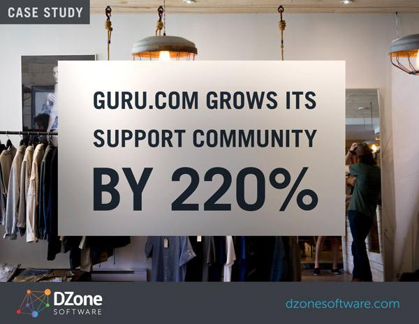

<!-- MarkdownTOC -->

- [Freelance jobs](#freelance-jobs)
	- [Trabajos Freelance](#trabajos-freelance)

<!-- /MarkdownTOC -->

# Freelance jobs
- [reddit.com/r/freelance](https://www.reddit.com/r/freelance)
- [crunch.co.uk: The very best freelance job sites](https://www.crunch.co.uk/blog/freelancer-advice/2015/07/24/best-freelance-job-boards-to-find-work/)
	- [upwork.com](https://www.upwork.com/)
	- [onsite.io](http://onsite.io/)
	- [yunojuno.com](https://www.yunojuno.com/)
- [crunch.co.uk: Five freelance job sites that actually pay well](https://www.crunch.co.uk/blog/freelancer-advice/2013/04/15/five-freelance-work-from-home-job-sites-that-actually-pay-well/)
	- [www.3desk.com](http://www.3desk.com)
	- [crew.co](https://crew.co/)
- [entrepreneur.com: The 15 Best Freelance Websites to Find Jobs](http://www.entrepreneur.com/article/245953)
	- [toptal.com](http://www.toptal.com/)
	- [elance.com](https://www.elance.com/)
	- [freelancers.net](http://www.freelancers.net/)
	- [guru.com 🌟🌟](http://www.guru.com/)
	- [craigslist.com](http://craigslist.com)
- [huffingtonpost.com: 10 Best Freelance Sites To Find Jobs](http://www.huffingtonpost.com/larry-alton/10-best-freelance-sites-t_b_7445126.html)

## Trabajos Freelance
- [computerhoy.com: Las 10 mejores webs donde conseguir trabajo como freelance](http://computerhoy.com/listas/internet/8-mejores-webs-donde-conseguir-trabajo-como-freelance-8742)

<iframe width="420" height="315" src="https://www.youtube.com/embed/rU5PrcxFln0?rel=0" frameborder="0" allowfullscreen class="video"></iframe>

 

<blockquote class="twitter-tweet tw-align-center" data-lang="es">
Wanna know what life is really like as a freelancer? Let these movie at TV clips do the talking. <a href="https://twitter.com/hashtag/freelancing?src=hash">#freelancing</a> <a href="https://t.co/XnqDiy05Fo">https://t.co/XnqDiy05Fo</a>
&mdash; Tonya (@Beachbudget) <a href="https://twitter.com/Beachbudget/status/636191059299602434">25 de agosto de 2015</a></blockquote>

<blockquote class="twitter-tweet tw-align-center" data-lang="es">
Todo el mundo puede <a href="https://twitter.com/hashtag/emprender?src=hash">#emprender</a>, pero no todos se deciden a hacerlo. Perfil del emprendedor español➡ <a href="https://t.co/kfvBp5Ziyu">https://t.co/kfvBp5Ziyu</a> <a href="https://twitter.com/nuevarutaempleo">@nuevarutaempleo</a>
&mdash; Movistar pymes (@Movistar_pymes) <a href="https://twitter.com/Movistar_pymes/status/709046755321626624">13 de marzo de 2016</a></blockquote>

<blockquote class="twitter-tweet tw-align-center" data-lang="es">
Think you&#39;re going to start a business? Now&#39;s the time: <a href="https://t.co/gIG5g0VQwg">https://t.co/gIG5g0VQwg</a> <a href="https://t.co/UdzBinVv4u">pic.twitter.com/UdzBinVv4u</a>
&mdash; Forbes (@Forbes) <a href="https://twitter.com/Forbes/status/711548095373385728">20 de marzo de 2016</a></blockquote>

<blockquote class="twitter-tweet tw-align-center" data-lang="es">
Una de mis escenas favoritas de The Wolf of Wall Street: &quot;The Key To Making Money&quot; <a href="https://t.co/ILTBoLaT3D">https://t.co/ILTBoLaT3D</a> ¡Vaya que da ánimos de vender!
&mdash; Jaime Florián (@JFasesor) <a href="https://twitter.com/JFasesor/status/705796860015939584">4 de marzo de 2016</a></blockquote>

<blockquote class="twitter-tweet tw-align-center" data-lang="es">
Yep. <a href="https://t.co/bh9n2aTgPF">pic.twitter.com/bh9n2aTgPF</a>
&mdash; The Wolf of Wall St. (@TheWolfofWaIlSt) <a href="https://twitter.com/TheWolfofWaIlSt/status/705103000738598913">2 de marzo de 2016</a></blockquote>

<iframe width="560" height="315" src="https://www.youtube.com/embed/Osqtr0Mqfn0?rel=0" frameborder="0" allowfullscreen class="video"></iframe>

 