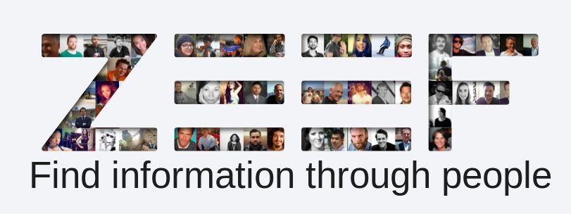
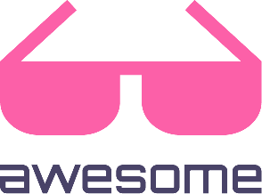
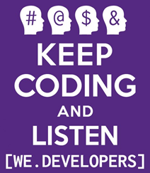
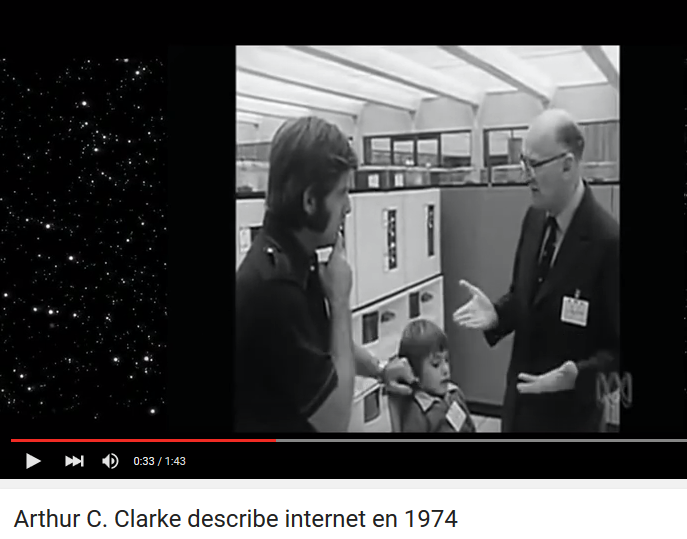

**Table of Contents**
<!-- MarkdownTOC -->

- [High quality tech resources and search engines](#high-quality-tech-resources-and-search-engines)
	- [Zeef.com: Find and share quality development/tech resources](#zeefcom-find-and-share-quality-developmenttech-resources)
	- [Awesome List. Awesome AWS, Awesome SysAdmin, Awesome Docker, Awesome BigData, etc](#awesome-list-awesome-aws-awesome-sysadmin-awesome-docker-awesome-bigdata-etc)
	- [Stack Exchange family of Q&A websites](#stack-exchange-family-of-qa-websites)
	- [DZone](#dzone)
	- [Java Code Geeks](#java-code-geeks)
	- [Web Code Geeks](#web-code-geeks)
	- [stackshare.io: Discover and discuss the best software tools and services](#stackshareio-discover-and-discuss-the-best-software-tools-and-services)
	- [Reddit](#reddit)
	- [Podcasts](#podcasts)
		- [Cloud Computing Podcasts](#cloud-computing-podcasts)
		- [Devops Podcasts](#devops-podcasts)
			- [AWS Youtube channel and Podcasts](#aws-youtube-channel-and-podcasts)
		- [Spanish podcasts](#spanish-podcasts)
	- [Wikibooks](#wikibooks)
	- [Webcomics](#webcomics)
	- [Reactions. When words aren't enough, say it with animations](#reactions-when-words-arent-enough-say-it-with-animations)

<!-- /MarkdownTOC -->

# High quality tech resources and search engines

## Zeef.com: Find and share quality development/tech resources
- [Zeef.com](https://zeef.com)
- [awesome-awesomeness.zeef.com](https://awesome-awesomeness.zeef.com)
- [startup-resources.zeef.com](https://startup-resources.zeef.com)
- [startup.zeef.com](https://startup.zeef.com/)
- [agile.zeef.com](https://agile.zeef.com)
- [sublime-text.zeef.com](https://sublime-text.zeef.com)
- [git.zeef.com](https://git.zeef.com)
- [web-tools.zeef.com](https://web-tools.zeef.com)
- [wordpress.zeef.com](https://wordpress.zeef.com)
- [web-publishing.zeef.com](https://web-publishing.zeef.com)
- [security.zeef.com](https://security.zeef.com)
- [selinux.zeef.com](https://selinux.zeef.com)
- [malware.zeef.com](https://malware.zeef.com)
- [penetration-testing.zeef.com](https://penetration-testing.zeef.com)
- [mobile-app-testing.zeef.com](https://mobile-app-testing.zeef.com)
- [ab-testing.zeef.com](https://ab-testing.zeef.com)
- [databases.zeef.com](https://databases.zeef.com)
- [nosql.zeef.com](https://nosql.zeef.com)
- [docker.zeef.com](https://docker.zeef.com)
- [linux.zeef.com](https://linux.zeef.com)
- [linux-for-administrators.zeef.com](https://linux-for-administrators.zeef.com)
- [open-source-networking.zeef.com](https://open-source-networking.zeef.com)
- [virtualization.zeef.com](https://virtualization.zeef.com)
- [devops.zeef.com](https://devops.zeef.com)
- [dev-ops-tools.zeef.com](https://dev-ops-tools.zeef.com)
- [data-stack.zeef.com](https://data-stack.zeef.com)
- [continuous-integration.zeef.com](https://continuous-integration.zeef.com)
- [python.zeef.com](https://python.zeef.com)
- [python-tutorials.zeef.com](https://python-tutorials.zeef.com)
- [unix-shell.zeef.com](https://unix-shell.zeef.com)
- [html.zeef.com](https://html.zeef.com)
- [javaee8.zeef.com](https://javaee8.zeef.com)
- [nodejs.zeef.com](https://nodejs.zeef.com)
- [free-programming-books.zeef.com](https://free-programming-books.zeef.com)
- [programming.zeef.com](https://programming.zeef.com)
- [frontend.zeef.com](https://frontend.zeef.com)
- [apps-and-tools.zeef.com](https://apps-and-tools.zeef.com)
- [data-science.zeef.com](https://data-science.zeef.com)
- [big-data.zeef.com](https://big-data.zeef.com)
- [data-visualization.zeef.com](https://data-visualization.zeef.com)
- [datapyr.zeef.com](https://datapyr.zeef.com)
- [apache-spark.zeef.com](https://apache-spark.zeef.com)
- [cloud.zeef.com](https://cloud.zeef.com)
- [online-collaboration-tools.zeef.com](https://online-collaboration-tools.zeef.com)
- [digital-marketing.zeef.com](https://digital-marketing.zeef.com)
- [email-marketing.zeef.com](https://email-marketing.zeef.com)
- [bitcoin.zeef.com](https://bitcoin.zeef.com)
- etc

## Awesome List. Awesome AWS, Awesome SysAdmin, Awesome Docker, Awesome BigData, etc
- [Awesome List - A curated list of awesome lists](https://github.com/sindresorhus/awesome)
- [Awesome Awesomeness](https://github.com/bayandin/awesome-awesomeness)
- [Awesome AWS](https://github.com/donnemartin/awesome-aws)
- [awesome sysadmin](https://github.com/kahun/awesome-sysadmin)
- [awesome docker](https://github.com/veggiemonk/awesome-docker)
- [Awesome Puppet](https://github.com/olindata/awesome-puppet)
- [Awesome Ansible](https://github.com/jdauphant/awesome-ansible)
- [Awesome Chef](https://github.com/obazoud/awesome-chef)
- [awesome big data](https://github.com/onurakpolat/awesome-bigdata)
- [awesome openstack](http://ramitsurana.github.io/awesome-openstack/)
- [awesome java](https://github.com/akullpp/awesome-java)
- [awesome django](https://gitlab.com/rosarior/awesome-django)
- [awesome python](https://github.com/vinta/awesome-python/)
- [awesome node.js](https://github.com/sindresorhus/awesome-nodejs)
- [awesome ruby](https://github.com/markets/awesome-ruby)
- [awesome php](https://github.com/ziadoz/awesome-php)

## Stack Exchange family of Q&A websites
- [stackoverflow.com](http://stackoverflow.com/)
	- [How to Find the Best Software Engineers on Stack Overflow](http://booleanblackbelt.com/2013/08/how-to-find-the-best-software-engineers-on-stack-overflow/)
	- [Stack Overflow en español es un sitio de preguntas y respuestas para programadores y profesionales de la informática](http://es.stackoverflow.com/)
	- [careers.stackoverflow.com](http://careers.stackoverflow.com/)
- [Startups Stack Exchange](http://startups.stackexchange.com/)
- [The Workplace Stack Exchange](http://workplace.stackexchange.com/)
- [Freelancing Stack Exchange](http://freelancing.stackexchange.com/)
- [Unix & Linux Stack Exchange](http://unix.stackexchange.com/)
- [networkengineering.stackexchange.com](http://networkengineering.stackexchange.com/)
- [Server Fault is a question and answer site for system and network administrators](http://serverfault.com/)
- [Vi and Vim Stack Exchange](http://vi.stackexchange.com/)
- [emacs.stackexchange.com](http://emacs.stackexchange.com/)
- [dba.stackexchange.com](http://dba.stackexchange.com/)
- [security.stackexchange.com](http://security.stackexchange.com/)
- [datascience.stackexchange.com](http://datascience.stackexchange.com/)
- [codereview.stackexchange.com](http://codereview.stackexchange.com/)
- [Open Data Stack Exchange is a question and answer site for developers and researchers interested in open data](http://opendata.stackexchange.com/)
- [Project Management Stack Exchange](http://pm.stackexchange.com/)
- [programmers.stackexchange.com](http://programmers.stackexchange.com/)
- [opensource.stackexchange.com](http://opensource.stackexchange.com/)
- [Software Quality Assurance & Testing Stack Exchange](http://sqa.stackexchange.com/)
- [Stack Apps is a question and answer site for apps, scripts, and development with the Stack Exchange API](http://stackapps.com/)
- [Reverse Engineering Stack Exchange](http://reverseengineering.stackexchange.com/)
- [Hardware Recommendations Stack Exchange](http://hardwarerecs.stackexchange.com/)
- [Software Recommendations Stack Exchange](http://softwarerecs.stackexchange.com/)
- [Web Applications Stack Exchange is a question and answer site for power users of web applications](http://webapps.stackexchange.com/)
- [Salesforce Stack Exchange](http://salesforce.stackexchange.com/)
- [sharepoint.stackexchange.com](http://sharepoint.stackexchange.com/)
- [WordPress Development Stack Exchange is a question and answer site for WordPress developers and administrators](http://wordpress.stackexchange.com/)
- [civicrm.stackexchange.com](http://civicrm.stackexchange.com/)
- [drupal.stackexchange.com](http://drupal.stackexchange.com/)
- [joomla.stackexchange.com](http://joomla.stackexchange.com/)
- [tridion.stackexchange.com](http://tridion.stackexchange.com/)
- [webmasters.stackexchange.com](http://webmasters.stackexchange.com/)
- [graphicdesign.stackexchange.com](http://graphicdesign.stackexchange.com/)
- [Sound Design Stack Exchange](http://sound.stackexchange.com/)
- [User Experience Stack Exchange](http://ux.stackexchange.com/)
- [Super User is a question and answer site for computer enthusiasts and power users](http://superuser.com/)
- [TeX - LaTeX Stack Exchange](http://tex.stackexchange.com/)
- [Video Production Stack Exchange is a question and answer site for engineers, producers, editors, and enthusiasts spanning the fields of video, and media creation](http://video.stackexchange.com/)
- [Magento Stack Exchange](http://magento.stackexchange.com/)
- [android.stackexchange.com](http://android.stackexchange.com/)
- [windowsphone.stackexchange.com](http://windowsphone.stackexchange.com/)
- [Raspberry Pi Stack Exchange](http://raspberrypi.stackexchange.com/)
- [arduino.stackexchange.com](http://arduino.stackexchange.com/)
- [robotics.stackexchange.com](http://robotics.stackexchange.com/)
- [Geographic Information Systems Stack Exchange](http://gis.stackexchange.com/)
- [english.stackexchange.com](http://english.stackexchange.com/)
- [italian.stackexchange.com](http://italian.stackexchange.com/)
- [french.stackexchange.com](http://french.stackexchange.com/)
- [german.stackexchange.com](http://german.stackexchange.com/)
- [Expatriates Stack Exchange](http://expatriates.stackexchange.com/)
- [History Stack Exchange](http://history.stackexchange.com/)
- [Mathematics Stack Exchange](http://math.stackexchange.com/)
- [engineering.stackexchange.com](http://engineering.stackexchange.com/)
- [Electrical Engineering Stack Exchange](http://electronics.stackexchange.com/)
- [economics.stackexchange.com](http://economics.stackexchange.com/)
- [Bitcoin Stack Exchange](http://bitcoin.stackexchange.com/)
- [Law Stack Exchange](http://law.stackexchange.com/)
- [Music Fans Stack Exchange](http://musicfans.stackexchange.com/)
- [Music: Practice & Theory Stack Exchange](http://music.stackexchange.com/)
- [Movies & TV Stack Exchange](http://movies.stackexchange.com/)
- [Travel Stack Exchange](http://travel.stackexchange.com/)
- [Sports Stack Exchange](http://sports.stackexchange.com/)
- [Bicycles Stack Exchange](http://bicycles.stackexchange.com/)
- [Physical Fitness Stack Exchange](http://fitness.stackexchange.com/)
- [Photography Stack Exchange](http://photo.stackexchange.com/)
- [The Great Outdoors Stack Exchange](http://outdoors.stackexchange.com/)
- [Space Exploration Stack Exchange](http://space.stackexchange.com/)

## DZone
- [DZone](https://dzone.com) Over a million developers have joined DZone
- [Refcard](https://dzone.com/refcardz) The world's largest library of technical cheat sheets
- [Guides](https://dzone.com/guides)
- [Zones](https://dzone.com/portals)
- [Agile](https://dzone.com/agile-methodology-training-tools-news)
- [Big Data](https://dzone.com/big-data-analytics-tutorials-tools-news)
- [Cloud](https://dzone.com/cloud-computing-tutorials-tools-news)
- [Database](https://dzone.com/cloud-computing-tutorials-tools-news)
- [DevOps](https://dzone.com/devops-tutorials-tools-news)
- [Integration](https://dzone.com/enterprise-integration-training-tools-news)
- [IOT](https://dzone.com/iot-developer-tutorials-tools-news-reviews)
- [Java](https://dzone.com/java-jdk-development-tutorials-tools-news)
- [Mobile](https://dzone.com/mobile-app-developer-tutorials-tools-news)
- [Performance](https://dzone.com/apm-tools-performance-monitoring-optimization)
- [Web Dev](https://dzone.com/web-development-programming-tutorials-tools-news)

## Java Code Geeks
- [javacodegeeks.com](http://www.javacodegeeks.com/)
- [Android](http://www.javacodegeeks.com/category/android/)
- [Java](http://www.javacodegeeks.com/category/java/)
- [JVM Languages](http://www.javacodegeeks.com/category/jvm-languages/)
- [Software Development](http://www.javacodegeeks.com/category/software-development/)
- [Agile](http://www.javacodegeeks.com/category/agile/)
- [Career](http://www.javacodegeeks.com/category/career/)
- [Communications](http://www.javacodegeeks.com/category/communications/)
- [DevOps](http://www.javacodegeeks.com/category/devops/)
- [Meta JCG](http://www.javacodegeeks.com/category/meta-jcg/)

## Web Code Geeks
- [webcodegeeks.com](http://www.webcodegeeks.com/)
- [ASP.Net](http://www.webcodegeeks.com/category/asp-net/)
- [Cloud](http://www.webcodegeeks.com/category/cloud/)
- [CSS](http://www.webcodegeeks.com/category/css/)
- [DevOps](http://www.webcodegeeks.com/category/devops/)
- [HTML5](http://www.webcodegeeks.com/category/html5/)
- [Javascript](http://www.webcodegeeks.com/category/javascript/)
- [Nosql](http://www.webcodegeeks.com/category/nosql/)
- [PHP](http://www.webcodegeeks.com/category/php/)
- [Python](http://www.webcodegeeks.com/category/python/)
- [Ruby](http://www.webcodegeeks.com/category/ruby/)
- [Web Dev](http://www.webcodegeeks.com/category/web-development/)
- [Web Server](http://www.webcodegeeks.com/category/web-servers/)
- [Wordpress](http://www.webcodegeeks.com/category/wordpress/)
- [Meta WCG](http://www.webcodegeeks.com/category/meta-wcg/)

## stackshare.io: Discover and discuss the best software tools and services
- [stackshare.io](http://stackshare.io/)
	- [whatsnew.com - stackshare.io - para saber la tecnología que usan las grandes empresas de Internet](http://wwwhatsnew.com/2014/11/07/stackshare-para-saber-la-tecnologia-que-usan-las-grandes-empresas-de-internet/)
- [Amazon ECS vs Joyent Triton Elastic Container Infrastructure](http://stackshare.io/convox/amazon-ecs-vs-joyent-triton)
	- [Joyent Triton Elastic Container Infrastructure](https://www.joyent.com/)
	- [Microservices stack in seconds: Node.js + Docker + NoSQL](https://www.joyent.com/blog/how-to-dockerize-a-complete-application)
- [Medium's Stack: The Stack That Helped Medium Scale To 2.6 Millennia Of Reading Time](http://stackshare.io/medium/the-stack-that-helped-medium-scale-to-2-6-millennia-of-reading-time)

## Reddit
- [Upvoted - A Redditorial Publication](https://upvoted.com/)
- [Freelance](https://www.reddit.com/r/freelance)
- [Devops](https://www.reddit.com/r/devops)
- [Jenkins](https://www.reddit.com/r/jenkinsci/)
- [Docker](https://www.reddit.com/r/docker)
- [Ansible](https://www.reddit.com/r/ansible/)
- [Puppet](https://www.reddit.com/r/puppet)
- [Linuxadmin](https://www.reddit.com/r/linuxadmin)
- [RedHat](https://www.reddit.com/r/redhat/)
- [Ubuntu](https://www.reddit.com/r/ubuntu)
- [sysadmin](http://www.reddit.com/r/sysadmin/)
- [Python](http://reddit.com/r/Python/)
- [Learn Python](https://www.reddit.com/r/learnpython)
- [Django](https://www.reddit.com/r/django)
- [Ruby](https://www.reddit.com/r/ruby)
- [Java](https://www.reddit.com/r/java)
- [Bash](https://www.reddit.com/r/bash)
- [Javascript](https://www.reddit.com/r/javascript)
- [sql](https://www.reddit.com/r/sql)
- [Data is beautiful](https://www.reddit.com/r/dataisbeautiful)
- [MongoDB](https://www.reddit.com/r/mongodb)
- [NoSQL](https://www.reddit.com/r/nosql)
- [BigData](https://www.reddit.com/r/bigdata)
- [Hadoop](https://www.reddit.com/r/hadoop)
- [Spark](https://www.reddit.com/r/apachespark)
- [Security](https://www.reddit.com/r/security)
- [Cloud](https://www.reddit.com/r/cloud)
- [AWS](https://www.reddit.com/r/aws)
- [OpenStack](https://www.reddit.com/r/openstack)
- [Rackspace](https://www.reddit.com/r/rackspace)
- [Wireshark](https://www.reddit.com/r/wireshark/)

## Podcasts 
- [Awesome and Interesting Talks concerning Programming ](https://github.com/hellerve/programming-talks)
- [Talk Python To Me](http://talkpython.fm/)
- [Puppet Labs Podcasts](https://puppetlabs.com/conversations-puppet-labs-podcast)
- [No dogma podcast: Discussions on software development](http://nodogmapodcast.bryanhogan.net/)
	- [#41 Ken Finnegan, What Ireland Offers the Tech World](http://nodogmapodcast.bryanhogan.net/41-ken-finnegan-what-ireland-offers/)
- [Best programming podcasts](https://player.fm/featured/programming)
	- [The Stack Exchange Podcast](https://player.fm/series/the-stack-exchange-podcast)
- [10 podcasts for programmers and budding developers](http://www.techrepublic.com/article/10-podcasts-for-programmers-and-budding-developers/)
- [42 Podcasts for Developers and Programmers](https://www.loggly.com/blog/42-podcasts-for-developers-and-programmers/)

### Cloud Computing Podcasts
- [Are You Subscribed to These Cloud Computing Podcasts?](http://solutions-review.com/cloud-platforms/are-you-subscribed-to-these-cloud-computing-podcasts/)
	- [The Cloudcast](http://www.thecloudcast.net/)
		- [The Cloudcast: Cloud Computing Whiteboard Videos](http://www.thecloudcast.net/2012/01/new-cloud-computing-whiteboard-videos.html)
		- [The Cloudcast youtube channel](https://www.youtube.com/user/TheCloudcastNET)
	- [Cloud Computing Podcast](http://www.cloudtp.com/insights/cloud-computing-weekly-podcast/)
	- [Compare the Cloud](http://www.stitcher.com/podcast/compare-the-cloud-the-issues)
	- [soundcloud: a16z podcast](https://soundcloud.com/a16z)
- [WHIR Cloud Podcasts](http://www.thewhir.com/whir-podcast)
	- [Top 5 The WHIR: Cloud Talks Podcasts for 2015](http://www.thewhir.com/blog/top-5-the-whir-cloud-talks-podcasts-for-2015)

### Devops Podcasts
- [The ship show](http://theshipshow.com/)
- [Arrested Devops](http://theshipshow.com/)
- [Devops Cafe](http://devopscafe.org/)

#### AWS Youtube channel and Podcasts
- [Amazon Web Services Youtube](https://www.youtube.com/user/AmazonWebServices)
- [AWS Podcasts](https://aws.amazon.com/podcasts/aws-podcast/)
- [Stitcher AWS Podcasts](http://www.stitcher.com/podcast/amazon-web-services/aws-podcast)

### Spanish podcasts
- [We.Developers: El podcast para desarrolladores en castellano](http://wedevelopers.com/)
	- [twitter.com/WeDevelopers](https://twitter.com/WeDevelopers)
	- [Trabajo en Remoto](http://wedevelopers.com/2016/01/08/we-developers-044-trabajo-en-remoto/)
	- [De cero a la App Store](http://wedevelopers.com/2013/03/01/we-developers-017-de-cero-a-la-app-store/)
    - [Metodologías de desarrollo ágil](http://wedevelopers.com/2012/11/30/we-developers-012-metodologias-agiles/)
    - [Diseño y desarrollo](http://wedevelopers.com/2012/11/23/we-developers-011-diseno-y-desarrollo/)
    - [Optimización web](http://wedevelopers.com/2012/08/10/we-developers-010-optimizacion-web/)
    - [Como ser desarrollador (y no morir en el intento)](http://wedevelopers.com/2015/09/03/we-developers-040-como-ser-desarrollador/)
- [Podcasts de programación web](http://montesjmm.es/2014/07/09/podcasts-de-programacion-web/)
- [Podcasts recomendados para programadores](http://www.jaimeolmo.com/2014/12/podcasts-recomendados-para-programadores/)
- [Preceptos Digitales: Podcast sobre planificación, diseño y desarrollo de proyectos Web](http://www.preceptosdigitales.com/)

## Wikibooks
>The main difference between the two "wikis" is that Wikipedia is composed of weakly connected separate pages and Wikibooks contains e-books built of multiple hierarchically linked pages. So who has a bigger idea (philosophy) for a particular area of ​​knowledge prefers to work in Wikibooks. 

- [The Linux Kernel Book - A Linux kernel API and internals Reference](https://en.wikibooks.org/wiki/The_Linux_Kernel)
- [Computing](https://en.wikibooks.org/wiki/Subject:Computing)
- [ITIL v3 (Information Technology Infrastructure Library)](https://en.wikibooks.org/wiki/ITIL_v3_%28Information_Technology_Infrastructure_Library%29)
- [Python](https://en.wikibooks.org/wiki/Python)
- [Python Programming](https://en.wikibooks.org/wiki/Python_Programming)
	- [PDF version](https://upload.wikimedia.org/wikipedia/commons/9/91/Python_Programming.pdf)
- [Non-Programmer's Tutorial for Python 2.6](https://en.wikibooks.org/wiki/Non-Programmer's_Tutorial_for_Python_2.6)
	- [PDF version](https://upload.wikimedia.org/wikipedia/commons/6/69/Non-Programmer's_Tutorial_for_Python_2.6.pdf)
- [Non-Programmer's Tutorial for Python 3](https://en.wikibooks.org/wiki/Non-Programmer's_Tutorial_for_Python_3)
- [LPI](https://en.wikibooks.org/wiki/LPI_Linux_Certification)
- [Linux Networking](https://en.wikibooks.org/wiki/Linux_Networking)

## Webcomics
- [commitstrip.com](http://www.commitstrip.com)
- [dilbert.com](http://dilbert.com/)
- [Geek & Poke](http://geek-and-poke.com)

## Reactions. When words aren't enough, say it with animations
- [Infosec Reactions](http://securityreactions.tumblr.com/)
	- [twitter.com/sec_reactions](https://twitter.com/sec_reactions)
- [DevOps Reactions](http://devopsreactions.tumblr.com/)
	- [twitter.com/devopsreactions](https://twitter.com/devopsreactions)
- [9gag.com](http://9gag.com)

