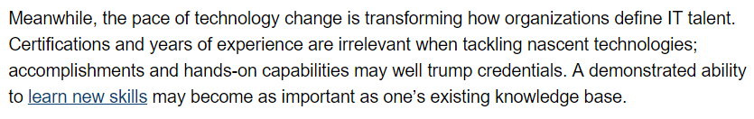
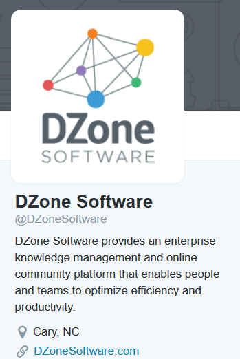

**Table of Contents**
<!-- MarkdownTOC -->

- [High quality tech resources and search engines](#high-quality-tech-resources-and-search-engines)
	- [Gartner](#gartner)
	- [Goldman Sachs](#goldman-sachs)
	- [Zeef.com: Find and share quality development/tech resources](#zeefcom-find-and-share-quality-developmenttech-resources)
	- [Awesome List. Awesome AWS, Awesome SysAdmin, Awesome Docker, Awesome BigData, etc](#awesome-list-awesome-aws-awesome-sysadmin-awesome-docker-awesome-bigdata-etc)
	- [Code geek](#code-geek)
	- [Codely TV](#codely-tv)
	- [Cubeupload image sharing](#cubeupload-image-sharing)
	- [Shared presentations](#shared-presentations)
	- [Stack Exchange family of Q&A websites](#stack-exchange-family-of-qa-websites)
	- [DZone](#dzone)
	- [Interview Questions](#interview-questions)
	- [Java Code Geeks](#java-code-geeks)
	- [Web Code Geeks](#web-code-geeks)
	- [stackshare.io: Discover and discuss the best software tools and services](#stackshareio-discover-and-discuss-the-best-software-tools-and-services)
	- [Tutorialzine](#tutorialzine)
	- [Marketplaces](#marketplaces)
		- [Noodlio](#noodlio)
	- [Reddit](#reddit)
	- [Screencasts](#screencasts)
	- [Podcasts](#podcasts)
		- [Non IT related podcasts](#non-it-related-podcasts)
		- [Cloud Computing Podcasts](#cloud-computing-podcasts)
		- [Devops Podcasts](#devops-podcasts)
			- [AWS Youtube channel and Podcasts](#aws-youtube-channel-and-podcasts)
		- [Spanish podcasts](#spanish-podcasts)
	- [TLDP.org The Linux Documentation Project](#tldporg-the-linux-documentation-project)
	- [Wikibooks](#wikibooks)
	- [Webcomics](#webcomics)
	- [Reactions. When words aren't enough, say it with animations](#reactions-when-words-arent-enough-say-it-with-animations)
	- [Public domain images](#public-domain-images)

<!-- /MarkdownTOC -->

<iframe width="560" height="315" src="https://www.youtube.com/embed/8Cb_CTyquok?rel=0" frameborder="0" allowfullscreen class="video"></iframe>

 

# High quality tech resources and search engines
- [The history of open source and a glimpse at its future. Open source changed startups, and then startups turned around and changed open source. Open source became the default, not an alternative 🌟🌟🌟🌟🌟](https://medium.com/@nayafia/we-re-in-a-brave-new-post-open-source-world-56ef46d152a3) Two startups, in particular: GitHub and Stack Overflow. Together, they launched a new chapter for software technology. And the decisions we make from here will determine how the next 5–10 years of software unfold. But to understand why, we have to start at the beginning.
	- [Choosing an open source license 🌟🌟🌟](http://choosealicense.com) GitHub started taking a stance on licensing in 2013. They now suggest a license when creating a new project, and they made a microsite to help project owners choose.
	- [DZone: Selecting an Open Source License for Your Project](https://dzone.com/articles/selecting-an-open-source-license-for-your-project)
- [Why There Will Never Be Another RedHat: The Economics Of Open Source 🌟](http://techcrunch.com/2014/02/13/please-dont-tell-me-you-want-to-be-the-next-red-hat/)
- [8 advantages of using open source in the enterprise](https://enterprisersproject.com/article/2015/1/top-advantages-open-source-offers-over-proprietary-solutions)
- [First Timers Only](http://www.firsttimersonly.com/) Friendly Open Source projects should reserve specific issues for newbies.

<blockquote class="twitter-tweet tw-align-center" data-lang="es">
Carlos Aguayo shares why <a href="https://twitter.com/hashtag/Linux?src=hash">#Linux</a> and <a href="https://twitter.com/hashtag/opensource?src=hash">#opensource</a> are the future: <a href="https://t.co/k1Xs1ZoDZO">https://t.co/k1Xs1ZoDZO</a>
&mdash; Open Source Way (@opensourceway) <a href="https://twitter.com/opensourceway/status/707265881781342208">marzo 8, 2016</a></blockquote>

<blockquote class="twitter-tweet tw-align-center" data-lang="es">
5 open source skills in high demand <a href="https://t.co/gCuwIHVlOm">https://t.co/gCuwIHVlOm</a>
&mdash; CIO.com (@CIOonline) <a href="https://twitter.com/CIOonline/status/735456011239231489">25 de mayo de 2016</a></blockquote>

<blockquote class="twitter-tweet tw-align-center" data-lang="es">
The shift in <a href="https://twitter.com/hashtag/opensource?src=hash">#opensource</a>: A new kind of platform war: <a href="https://t.co/Fih41jOdLk">https://t.co/Fih41jOdLk</a> <a href="https://t.co/FapMuYeSsV">pic.twitter.com/FapMuYeSsV</a>
&mdash; Red Hat, Inc. (@RedHatNews) <a href="https://twitter.com/RedHatNews/status/736983197850861569">29 de mayo de 2016</a></blockquote>

<blockquote class="twitter-tweet tw-align-center" data-lang="es">
<a href="https://twitter.com/hashtag/RedHat?src=hash">#RedHat</a>&#39;s <a href="https://twitter.com/jgershater">@jgershater</a> discusses the difference between open and <a href="https://twitter.com/hashtag/opensource?src=hash">#opensource</a> on <a href="https://twitter.com/idgconnect">@idgconnect</a>: <a href="https://t.co/XRtSMlFH6h">https://t.co/XRtSMlFH6h</a> <a href="https://t.co/vlnIlTC0tz">pic.twitter.com/vlnIlTC0tz</a>
&mdash; Red Hat, Inc. (@RedHatNews) <a href="https://twitter.com/RedHatNews/status/737848901697343488">1 de junio de 2016</a></blockquote>

<blockquote class="twitter-tweet tw-align-center" data-lang="es">
Want a good <a href="https://twitter.com/hashtag/tech?src=hash">#tech</a> job? Report says ​<a href="https://twitter.com/hashtag/opensource?src=hash">#opensource</a> skills are hotter than ever: <a href="https://t.co/hqq79stT2J">https://t.co/hqq79stT2J</a> via <a href="https://twitter.com/ZDNet">@ZDNet</a> <a href="https://t.co/uQj5pFQzUa">pic.twitter.com/uQj5pFQzUa</a>
&mdash; Red Hat, Inc. (@RedHatNews) <a href="https://twitter.com/RedHatNews/status/731927131165331456">15 de mayo de 2016</a></blockquote>

<iframe width="560" height="315" src="https://www.youtube.com/embed/NxUyTA81epg?rel=0" frameborder="0" allowfullscreen class="video"></iframe>

 

## Gartner
- [Gartner](http://www.gartner.com/)
- [Gartner wikipedia](https://en.wikipedia.org/wiki/Gartner)

<iframe width="560" height="315" src="https://www.youtube.com/embed/KjnfOhCbCr4?rel=0" frameborder="0" allowfullscreen class="video"></iframe>

 

## Goldman Sachs

<iframe width="560" height="315" src="https://www.youtube.com/embed/mqqyAlr50fU?rel=0" frameborder="0" allowfullscreen class="video"></iframe>

 

## Zeef.com: Find and share quality development/tech resources
- [Zeef.com 🌟🌟🌟🌟🌟](https://zeef.com)
- [awesome-awesomeness.zeef.com](https://awesome-awesomeness.zeef.com)
- [startup-resources.zeef.com](https://startup-resources.zeef.com)
- [startup.zeef.com](https://startup.zeef.com/)
- [agile.zeef.com 🌟](https://agile.zeef.com)
- [sublime-text.zeef.com 🌟](https://sublime-text.zeef.com)
- [git.zeef.com 🌟](https://git.zeef.com)
- [web-tools.zeef.com](https://web-tools.zeef.com)
- [wordpress.zeef.com](https://wordpress.zeef.com)
- [web-publishing.zeef.com](https://web-publishing.zeef.com)
- [security.zeef.com](https://security.zeef.com)
- [selinux.zeef.com](https://selinux.zeef.com)
- [malware.zeef.com](https://malware.zeef.com)
- [penetration-testing.zeef.com](https://penetration-testing.zeef.com)
- [mobile-app-testing.zeef.com](https://mobile-app-testing.zeef.com)
- [ab-testing.zeef.com](https://ab-testing.zeef.com)
- [databases.zeef.com](https://databases.zeef.com)
- [nosql.zeef.com](https://nosql.zeef.com)
- [docker.zeef.com 🌟](https://docker.zeef.com)
- [linux.zeef.com](https://linux.zeef.com)
- [linux-for-administrators.zeef.com 🌟](https://linux-for-administrators.zeef.com)
- [open-source-networking.zeef.com](https://open-source-networking.zeef.com)
- [virtualization.zeef.com 🌟](https://virtualization.zeef.com)
- [devops.zeef.com](https://devops.zeef.com)
- [dev-ops-tools.zeef.com 🌟](https://dev-ops-tools.zeef.com)
- [data-stack.zeef.com](https://data-stack.zeef.com)
- [continuous-integration.zeef.com](https://continuous-integration.zeef.com)
- [python.zeef.com 🌟](https://python.zeef.com)
- [python-tutorials.zeef.com](https://python-tutorials.zeef.com)
- [unix-shell.zeef.com](https://unix-shell.zeef.com)
- [html.zeef.com](https://html.zeef.com)
- [javaee8.zeef.com 🌟](https://javaee8.zeef.com)
- [Java EE 8 Progress Tracker 🌟](https://java-ee-8-progress-tracker.zeef.com) This page is a Java EE 8 progress tracker. Follow JIRA issues, check resources (downloads, source code, playgrounds), mailing list, twitter posts, EG events, discussion and wikis. 
- [nodejs.zeef.com](https://nodejs.zeef.com)
- [angularjs.zeef.com 🌟](https://angularjs.zeef.com)
- [free-programming-books.zeef.com](https://free-programming-books.zeef.com)
- [programming.zeef.com](https://programming.zeef.com)
- [frontend.zeef.com](https://frontend.zeef.com)
- [apps-and-tools.zeef.com](https://apps-and-tools.zeef.com)
- [data-science.zeef.com](https://data-science.zeef.com)
- [big-data.zeef.com 🌟](https://big-data.zeef.com)
- [data-visualization.zeef.com](https://data-visualization.zeef.com)
- [datapyr.zeef.com](https://datapyr.zeef.com)
- [apache-spark.zeef.com](https://apache-spark.zeef.com)
- [cloud.zeef.com](https://cloud.zeef.com)
- [online-collaboration-tools.zeef.com](https://online-collaboration-tools.zeef.com)
- [digital-marketing.zeef.com](https://digital-marketing.zeef.com)
- [email-marketing.zeef.com](https://email-marketing.zeef.com)
- [bitcoin.zeef.com](https://bitcoin.zeef.com)
- etc

## Awesome List. Awesome AWS, Awesome SysAdmin, Awesome Docker, Awesome BigData, etc
- [Awesome List - A curated list of awesome lists 🌟🌟🌟🌟🌟](https://github.com/sindresorhus/awesome)
- [Awesome Awesomeness](https://github.com/bayandin/awesome-awesomeness)
- [Awesome AWS 🌟🌟🌟🌟🌟](https://github.com/donnemartin/awesome-aws)
- [Awesome sysadmin 🌟🌟🌟🌟🌟](https://github.com/kahun/awesome-sysadmin)
- [Awesome security 🌟🌟🌟🌟](https://github.com/sbilly/awesome-security)
	- [Awesome security talks](https://github.com/PaulSec/awesome-sec-talks)
	- [Awesome penetration testing](https://github.com/enaqx/awesome-pentest)
	- [Awesome android security](https://github.com/ashishb/android-security-awesome)
- [Awesome docker 🌟🌟🌟🌟](https://github.com/veggiemonk/awesome-docker)
- [Awesome Puppet](https://github.com/olindata/awesome-puppet)
- [Awesome Ansible 🌟](https://github.com/jdauphant/awesome-ansible)
- [Awesome Chef](https://github.com/obazoud/awesome-chef)
- [Awesome big data 🌟](https://github.com/onurakpolat/awesome-bigdata)
- [Awesome sql](https://github.com/danhuss/awesome-sql)
- [Awesome database](https://github.com/numetriclabz/awesome-db)
- [Awesome NoSQL](https://github.com/jasonkying/awesome-NoSQL)
- [Awesome MongoDB](https://github.com/ximaoxo/awesome-mongodb)
- [Awesome openstack](http://ramitsurana.github.io/awesome-openstack/)
- [Awesome java](https://github.com/akullpp/awesome-java)
- [Awesome django](https://gitlab.com/rosarior/awesome-django)
- [Awesome python 🌟🌟🌟🌟](https://github.com/vinta/awesome-python/)
- [Awesome node.js](https://github.com/sindresorhus/awesome-nodejs)
- [Awesome ruby](https://github.com/markets/awesome-ruby)
- [Awesome php 🌟🌟🌟🌟🌟](https://github.com/ziadoz/awesome-php)
- [Awesome Electron](https://github.com/sindresorhus/awesome-electron) With Electron, creating a desktop application for your company or idea is easy. Initially developed for GitHub's Atom editor, Electron has since been used to create applications by companies like Microsoft, Facebook, Slack, and Docker.
- [WomenWhoCode/guidelines-resources](https://github.com/WomenWhoCode/guidelines-resources/blob/master/learn_to_program.md)

## Code geek
- [codek.tv 🌟🌟](https://codek.tv/)
- [twitter.com/codek_tv](https://twitter.com/codek_tv)

## Codely TV
- [codely.TV 🌟](http://codely.tv/) Vídeos cada jueves. Objetivos: Transmitir conocimiento mediante screencasts de programación y dar a conocer el mundo de la informática vía entrevistas.
- [twitter.com/CodelyTV](https://twitter.com/CodelyTV)
	

## Cubeupload image sharing
- [cubeupload.com](http://cubeupload.com) Zero compression image sharing

## Shared presentations
- [slideshare.net 🌟🌟🌟🌟](http://www.slideshare.net)
- [speakerdeck.com 🌟🌟](https://speakerdeck.com)
- [prezi.com 🌟](https://prezi.com)
- [scribd.com 🌟](https://scribd.com)
- [PresentationGo 🌟🌟](http://www.presentationgo.com) The free PowerPoint library
- [issuu.com](https://issuu.com) leading digital publishing platform delivering exceptional reading experiences of magazines, catalogs, and newspapers....
- [glisser.com](http://www.glisser.com) Interactive presentation software made easy
- [slidecorner.com](http://www.slidecorner.com)
- [emaze.com](https://www.emaze.com)
- [slidedeck.io](http://slidedeck.io) repository of great HTML presentations

## Stack Exchange family of Q&A websites
- [stackoverflow.com 🌟🌟🌟🌟🌟](http://stackoverflow.com/)
	- [How to Find the Best Software Engineers on Stack Overflow](http://booleanblackbelt.com/2013/08/how-to-find-the-best-software-engineers-on-stack-overflow/)
	- [Stack Overflow en español es un sitio de preguntas y respuestas para programadores y profesionales de la informática](http://es.stackoverflow.com/)
	- [careers.stackoverflow.com](http://careers.stackoverflow.com/)
- [Blogs - Stack Exchange](http://stackexchange.com/blogs)
- [Startups Stack Exchange](http://startups.stackexchange.com/)
- [The Workplace Stack Exchange](http://workplace.stackexchange.com/)
- [Freelancing Stack Exchange](http://freelancing.stackexchange.com/)
- [Unix & Linux Stack Exchange](http://unix.stackexchange.com/)
- [networkengineering.stackexchange.com](http://networkengineering.stackexchange.com/)
- [Server Fault is a question and answer site for system and network administrators](http://serverfault.com/)
- [Vi and Vim Stack Exchange](http://vi.stackexchange.com/)
- [emacs.stackexchange.com](http://emacs.stackexchange.com/)
- [dba.stackexchange.com](http://dba.stackexchange.com/)
- [security.stackexchange.com](http://security.stackexchange.com/)
- [datascience.stackexchange.com](http://datascience.stackexchange.com/)
- [codereview.stackexchange.com](http://codereview.stackexchange.com/)
- [Open Data Stack Exchange is a question and answer site for developers and researchers interested in open data](http://opendata.stackexchange.com/)
- [Project Management Stack Exchange](http://pm.stackexchange.com/)
- [programmers.stackexchange.com](http://programmers.stackexchange.com/)
- [opensource.stackexchange.com](http://opensource.stackexchange.com/)
- [Software Quality Assurance & Testing Stack Exchange](http://sqa.stackexchange.com/)
- [Stack Apps is a question and answer site for apps, scripts, and development with the Stack Exchange API](http://stackapps.com/)
- [Reverse Engineering Stack Exchange](http://reverseengineering.stackexchange.com/)
- [Hardware Recommendations Stack Exchange](http://hardwarerecs.stackexchange.com/)
- [Software Recommendations Stack Exchange](http://softwarerecs.stackexchange.com/)
- [Web Applications Stack Exchange is a question and answer site for power users of web applications](http://webapps.stackexchange.com/)
- [Salesforce Stack Exchange](http://salesforce.stackexchange.com/)
- [sharepoint.stackexchange.com](http://sharepoint.stackexchange.com/)
- [WordPress Development Stack Exchange is a question and answer site for WordPress developers and administrators](http://wordpress.stackexchange.com/)
- [civicrm.stackexchange.com](http://civicrm.stackexchange.com/)
- [drupal.stackexchange.com](http://drupal.stackexchange.com/)
- [joomla.stackexchange.com](http://joomla.stackexchange.com/)
- [tridion.stackexchange.com](http://tridion.stackexchange.com/)
- [webmasters.stackexchange.com](http://webmasters.stackexchange.com/)
- [graphicdesign.stackexchange.com](http://graphicdesign.stackexchange.com/)
- [Sound Design Stack Exchange](http://sound.stackexchange.com/)
- [User Experience Stack Exchange](http://ux.stackexchange.com/)
- [Super User is a question and answer site for computer enthusiasts and power users](http://superuser.com/)
- [TeX - LaTeX Stack Exchange](http://tex.stackexchange.com/)
- [Video Production Stack Exchange is a question and answer site for engineers, producers, editors, and enthusiasts spanning the fields of video, and media creation](http://video.stackexchange.com/)
- [Magento Stack Exchange](http://magento.stackexchange.com/)
- [android.stackexchange.com](http://android.stackexchange.com/)
- [windowsphone.stackexchange.com](http://windowsphone.stackexchange.com/)
- [Raspberry Pi Stack Exchange](http://raspberrypi.stackexchange.com/)
- [arduino.stackexchange.com](http://arduino.stackexchange.com/)
- [robotics.stackexchange.com](http://robotics.stackexchange.com/)
- [Geographic Information Systems Stack Exchange](http://gis.stackexchange.com/)
- [english.stackexchange.com](http://english.stackexchange.com/)
- [italian.stackexchange.com](http://italian.stackexchange.com/)
- [french.stackexchange.com](http://french.stackexchange.com/)
- [german.stackexchange.com](http://german.stackexchange.com/)
- [Expatriates Stack Exchange](http://expatriates.stackexchange.com/)
- [History Stack Exchange](http://history.stackexchange.com/)
- [Mathematics Stack Exchange](http://math.stackexchange.com/)
- [engineering.stackexchange.com](http://engineering.stackexchange.com/)
- [Electrical Engineering Stack Exchange](http://electronics.stackexchange.com/)
- [economics.stackexchange.com](http://economics.stackexchange.com/)
- [Bitcoin Stack Exchange](http://bitcoin.stackexchange.com/)
- [Law Stack Exchange](http://law.stackexchange.com/)
- [Music Fans Stack Exchange](http://musicfans.stackexchange.com/)
- [Music: Practice & Theory Stack Exchange](http://music.stackexchange.com/)
- [Movies & TV Stack Exchange](http://movies.stackexchange.com/)
- [Travel Stack Exchange](http://travel.stackexchange.com/)
- [Sports Stack Exchange](http://sports.stackexchange.com/)
- [Bicycles Stack Exchange](http://bicycles.stackexchange.com/)
- [Physical Fitness Stack Exchange](http://fitness.stackexchange.com/)
- [Photography Stack Exchange](http://photo.stackexchange.com/)
- [The Great Outdoors Stack Exchange](http://outdoors.stackexchange.com/)
- [Space Exploration Stack Exchange](http://space.stackexchange.com/)

<blockquote class="twitter-tweet tw-align-center" data-lang="es">
The last and best programming book you&#39;ll ever need ;) <a href="https://twitter.com/hashtag/humor?src=hash">#humor</a> <a href="https://t.co/657JVbpwFX">pic.twitter.com/657JVbpwFX</a>
&mdash; nixCraft (@nixcraft) <a href="https://twitter.com/nixcraft/status/705848396926464000">4 de marzo de 2016</a></blockquote>

## DZone
- [DZone 🌟🌟🌟🌟🌟](https://dzone.com) Over a million developers have joined DZone
- [Refcard](https://dzone.com/refcardz) The world's largest library of technical cheat sheets
- [Guides](https://dzone.com/guides)
- [Zones](https://dzone.com/portals)
- [Agile](https://dzone.com/agile-methodology-training-tools-news)
- [Big Data](https://dzone.com/big-data-analytics-tutorials-tools-news)
- [Cloud](https://dzone.com/cloud-computing-tutorials-tools-news)
- [Database](https://dzone.com/cloud-computing-tutorials-tools-news)
- [DevOps](https://dzone.com/devops-tutorials-tools-news)
- [Integration](https://dzone.com/enterprise-integration-training-tools-news)
- [IOT](https://dzone.com/iot-developer-tutorials-tools-news-reviews)
- [Java](https://dzone.com/java-jdk-development-tutorials-tools-news)
- [Mobile](https://dzone.com/mobile-app-developer-tutorials-tools-news)
- [Performance](https://dzone.com/apm-tools-performance-monitoring-optimization)
- [Web Dev](https://dzone.com/web-development-programming-tutorials-tools-news)

## Interview Questions
- [intellipaat.com 🌟🌟🌟](https://intellipaat.com/interview-questions/)
- [Tecmint 🌟🌟](http://www.tecmint.com/category/interview-questions)

## Java Code Geeks
- [javacodegeeks.com](http://www.javacodegeeks.com/)
- [Android](http://www.javacodegeeks.com/category/android/)
- [Java](http://www.javacodegeeks.com/category/java/)
- [JVM Languages](http://www.javacodegeeks.com/category/jvm-languages/)
- [Software Development](http://www.javacodegeeks.com/category/software-development/)
- [Agile](http://www.javacodegeeks.com/category/agile/)
- [Career](http://www.javacodegeeks.com/category/career/)
- [Communications](http://www.javacodegeeks.com/category/communications/)
- [DevOps](http://www.javacodegeeks.com/category/devops/)
- [Meta JCG](http://www.javacodegeeks.com/category/meta-jcg/)

## Web Code Geeks
- [webcodegeeks.com](http://www.webcodegeeks.com/)
- [ASP.Net](http://www.webcodegeeks.com/category/asp-net/)
- [Cloud](http://www.webcodegeeks.com/category/cloud/)
- [CSS](http://www.webcodegeeks.com/category/css/)
- [DevOps](http://www.webcodegeeks.com/category/devops/)
- [HTML5](http://www.webcodegeeks.com/category/html5/)
- [Javascript](http://www.webcodegeeks.com/category/javascript/)
- [Nosql](http://www.webcodegeeks.com/category/nosql/)
- [PHP](http://www.webcodegeeks.com/category/php/)
- [Python](http://www.webcodegeeks.com/category/python/)
- [Ruby](http://www.webcodegeeks.com/category/ruby/)
- [Web Dev](http://www.webcodegeeks.com/category/web-development/)
- [Web Server](http://www.webcodegeeks.com/category/web-servers/)
- [Wordpress](http://www.webcodegeeks.com/category/wordpress/)
- [Meta WCG](http://www.webcodegeeks.com/category/meta-wcg/)

## stackshare.io: Discover and discuss the best software tools and services
- [stackshare.io 🌟](http://stackshare.io/)
	- [whatsnew.com - stackshare.io - para saber la tecnología que usan las grandes empresas de Internet](http://wwwhatsnew.com/2014/11/07/stackshare-para-saber-la-tecnologia-que-usan-las-grandes-empresas-de-internet/)
- [Amazon ECS vs Joyent Triton Elastic Container Infrastructure](http://stackshare.io/convox/amazon-ecs-vs-joyent-triton)
	- [Joyent Triton Elastic Container Infrastructure](https://www.joyent.com/)
	- [Microservices stack in seconds: Node.js + Docker + NoSQL](https://www.joyent.com/blog/how-to-dockerize-a-complete-application)
- [Medium's Stack: The Stack That Helped Medium Scale To 2.6 Millennia Of Reading Time 🌟🌟](http://stackshare.io/medium/the-stack-that-helped-medium-scale-to-2-6-millennia-of-reading-time)

## Tutorialzine
- [tutorialzine.com 🌟](http://tutorialzine.com/)

## Marketplaces
### Noodlio
- [Noodlio, the community-driven marketplace for app development. Buy and sell themes, templates and components](https://www.noodl.io)
	- [twitter.com/noodl_io](https://twitter.com/noodl_io)

## Reddit
- [Upvoted - A Redditorial Publication](https://upvoted.com/)
- [Freelance](https://www.reddit.com/r/freelance)
- [Devops](https://www.reddit.com/r/devops)
- [Zabbix](https://www.reddit.com/r/zabbix)
- [Jenkins](https://www.reddit.com/r/jenkinsci/)
- [Docker 🌟](https://www.reddit.com/r/docker)
- [Ansible 🌟](https://www.reddit.com/r/ansible/)
- [Puppet](https://www.reddit.com/r/puppet)
- [Linuxadmin 🌟🌟](https://www.reddit.com/r/linuxadmin)
- [RedHat 🌟🌟🌟🌟🌟](https://www.reddit.com/r/redhat/)
- [Ubuntu](https://www.reddit.com/r/ubuntu)
- [sysadmin 🌟🌟](http://www.reddit.com/r/sysadmin/)
- [Python 🌟](http://reddit.com/r/Python/)
- [Learn Python 🌟](https://www.reddit.com/r/learnpython)
- [Django](https://www.reddit.com/r/django)
- [Ruby 🌟](https://www.reddit.com/r/ruby)
- [Java 🌟](https://www.reddit.com/r/java)
- [Bash 🌟](https://www.reddit.com/r/bash)
- [Javascript](https://www.reddit.com/r/javascript)
- [sql 🌟](https://www.reddit.com/r/sql)
- [Data is beautiful](https://www.reddit.com/r/dataisbeautiful)
- [MongoDB 🌟](https://www.reddit.com/r/mongodb)
- [NoSQL](https://www.reddit.com/r/nosql)
- [BigData](https://www.reddit.com/r/bigdata)
- [Hadoop](https://www.reddit.com/r/hadoop)
- [Spark](https://www.reddit.com/r/apachespark)
- [Security](https://www.reddit.com/r/security)
- [Cloud](https://www.reddit.com/r/cloud)
- [AWS 🌟🌟](https://www.reddit.com/r/aws)
- [OpenStack](https://www.reddit.com/r/openstack)
- [Rackspace](https://www.reddit.com/r/rackspace)
- [Wireshark](https://www.reddit.com/r/wireshark/)
- [Google 🌟](https://www.reddit.com/r/google)

## Screencasts
- [sysadmincasts.com 🌟🌟🌟🌟](https://sysadmincasts.com)
- [build-podcast.com 🌟🌟🌟](http://build-podcast.com)
	- [git-flow 🌟](http://build-podcast.com/git-flow/)

## Podcasts 
- [Awesome and Interesting Talks concerning Programming](https://github.com/hellerve/programming-talks)
- [Talk Python To Me](http://talkpython.fm/)
- [Puppet Labs Podcasts](https://puppetlabs.com/conversations-puppet-labs-podcast)
- [No dogma podcast: Discussions on software development 🌟](http://nodogmapodcast.bryanhogan.net/)
	- [#41 Ken Finnegan, What Ireland Offers the Tech World 🌟](http://nodogmapodcast.bryanhogan.net/41-ken-finnegan-what-ireland-offers/)
- [Best programming podcasts](https://player.fm/featured/programming)
	- [The Stack Exchange Podcast](https://player.fm/series/the-stack-exchange-podcast)
- [10 podcasts for programmers and budding developers](http://www.techrepublic.com/article/10-podcasts-for-programmers-and-budding-developers/)
- [42 Podcasts for Developers and Programmers](https://www.loggly.com/blog/42-podcasts-for-developers-and-programmers/)
- [DevOps radio 🌟](https://www.cloudbees.com/resources/devops-radio) The newest podcast series covering all things related to software delivery

### Non IT related podcasts
- [The Stitcher List. What the World is Listening to Now](http://www.stitcher.com/stitcher-list/)
	- [Freakonomics radio 🌟](http://www.stitcher.com/podcast/wnyc/freakonomics-radio)
		- [The True Story of the Gender Pay Gap](http://www.stitcher.com/podcast/wnyc/freakonomics-radio/e/the-true-story-of-the-gender-pay-gap-41957500)
	- [Reuters top news](http://www.stitcher.com/podcast/reuters/top-news)
	- [Planet money](http://www.stitcher.com/podcast/national-public-radio/npr-planet-money-podcast)

### Cloud Computing Podcasts
- [Are You Subscribed to These Cloud Computing Podcasts?](http://solutions-review.com/cloud-platforms/are-you-subscribed-to-these-cloud-computing-podcasts/)
	- [The Cloudcast 🌟🌟🌟](http://www.thecloudcast.net/)
		- [The Cloudcast: Cloud Computing Whiteboard Videos](http://www.thecloudcast.net/2012/01/new-cloud-computing-whiteboard-videos.html)
		- [The Cloudcast youtube channel](https://www.youtube.com/user/TheCloudcastNET)
	- [Cloud Computing Podcast](http://www.cloudtp.com/insights/cloud-computing-weekly-podcast/)
	- [Compare the Cloud](http://www.stitcher.com/podcast/compare-the-cloud-the-issues)
	- [soundcloud: a16z podcast](https://soundcloud.com/a16z)
- [WHIR Cloud Podcasts](http://www.thewhir.com/whir-podcast)
	- [Top 5 The WHIR: Cloud Talks Podcasts for 2015](http://www.thewhir.com/blog/top-5-the-whir-cloud-talks-podcasts-for-2015)

<iframe style="border: solid 1px #dedede;"  src="http://app.stitcher.com/splayer/f/53806/37340198" width="220" height="150" frameborder="0" scrolling="no"></iframe>

### Devops Podcasts
- [The ship show](http://theshipshow.com/)
- [Arrested Devops](http://theshipshow.com/)
- [Devops Cafe](http://devopscafe.org/)

#### AWS Youtube channel and Podcasts
- [Amazon Web Services Youtube 🌟🌟🌟](https://www.youtube.com/user/AmazonWebServices)
- [AWS Podcasts](https://aws.amazon.com/podcasts/aws-podcast/)
- [Stitcher AWS Podcasts](http://www.stitcher.com/podcast/amazon-web-services/aws-podcast)

### Spanish podcasts
- [We.Developers: El podcast para desarrolladores en castellano 🌟🌟🌟](http://wedevelopers.com/)
	- [twitter.com/WeDevelopers](https://twitter.com/WeDevelopers)
	- [Trabajo en Remoto 🌟🌟🌟🌟](http://wedevelopers.com/2016/01/08/we-developers-044-trabajo-en-remoto/)
	- [De cero a la App Store](http://wedevelopers.com/2013/03/01/we-developers-017-de-cero-a-la-app-store/)
    - [Metodologías de desarrollo ágil 🌟](http://wedevelopers.com/2012/11/30/we-developers-012-metodologias-agiles/)
    - [Diseño y desarrollo 🌟](http://wedevelopers.com/2012/11/23/we-developers-011-diseno-y-desarrollo/)
    - [Optimización web 🌟](http://wedevelopers.com/2012/08/10/we-developers-010-optimizacion-web/)
    - [Como ser desarrollador (y no morir en el intento) 🌟🌟](http://wedevelopers.com/2015/09/03/we-developers-040-como-ser-desarrollador/)
- [Podcasts de programación web](http://montesjmm.es/2014/07/09/podcasts-de-programacion-web/)
- [Podcasts recomendados para programadores](http://www.jaimeolmo.com/2014/12/podcasts-recomendados-para-programadores/)
- [Preceptos Digitales: Podcast sobre planificación, diseño y desarrollo de proyectos Web](http://www.preceptosdigitales.com/)

## TLDP.org The Linux Documentation Project
- [tldp.org](http://tldp.org/)
- [Advanced Bash-Scripting Guide 🌟🌟](http://tldp.org/LDP/abs/html/index.html) An in-depth exploration of the art of shell scripting
- [LVM HOWTO](http://www.tldp.org/HOWTO/html_single/LVM-HOWTO/)
- [TCP Keepalive HOWTO 🌟](http://www.tldp.org/HOWTO/html_single/TCP-Keepalive-HOWTO/)
- [Linux Security HOWTO](http://www.tldp.org/HOWTO/html_single/Security-HOWTO/)

## Wikibooks
>The main difference between the two "wikis" is that Wikipedia is composed of weakly connected separate pages and Wikibooks contains e-books built of multiple hierarchically linked pages. So who has a bigger idea (philosophy) for a particular area of ​​knowledge prefers to work in Wikibooks. 

- [The Linux Kernel Book - A Linux kernel API and internals Reference 🌟](https://en.wikibooks.org/wiki/The_Linux_Kernel)
- [Computing](https://en.wikibooks.org/wiki/Subject:Computing)
- [ITIL v3 (Information Technology Infrastructure Library)](https://en.wikibooks.org/wiki/ITIL_v3_%28Information_Technology_Infrastructure_Library%29)
- [Python](https://en.wikibooks.org/wiki/Python)
- [Python Programming](https://en.wikibooks.org/wiki/Python_Programming)
	- [PDF version](https://upload.wikimedia.org/wikipedia/commons/9/91/Python_Programming.pdf)
- [Non-Programmer's Tutorial for Python 2.6](https://en.wikibooks.org/wiki/Non-Programmer's_Tutorial_for_Python_2.6)
	- [PDF version](https://upload.wikimedia.org/wikipedia/commons/6/69/Non-Programmer's_Tutorial_for_Python_2.6.pdf)
- [Non-Programmer's Tutorial for Python 3](https://en.wikibooks.org/wiki/Non-Programmer's_Tutorial_for_Python_3)
- [LPI](https://en.wikibooks.org/wiki/LPI_Linux_Certification)
- [Linux Networking](https://en.wikibooks.org/wiki/Linux_Networking)

<iframe width="560" height="315" src="https://www.youtube.com/embed/e8w6WcZPcG4" frameborder="0" allowfullscreen class="video"></iframe>

 

## Webcomics
- [commitstrip.com 🌟](http://www.commitstrip.com)
- [dilbert.com](http://dilbert.com/)
- [GeeksFun](http://geeksfun.blogspot.com)
- [Geek & Poke](http://geek-and-poke.com)
- [tumblr gifs](https://www.tumblr.com/explore/gifs)
- [rachelnabors.com](http://rachelnabors.com)
- [donthitsave.com](http://donthitsave.com)
- [cartoonstock.com](https://www.cartoonstock.com)

## Reactions. When words aren't enough, say it with animations
- [Infosec Reactions](http://securityreactions.tumblr.com/)
	- [twitter.com/sec_reactions](https://twitter.com/sec_reactions)
- [DevOps Reactions 🌟](http://devopsreactions.tumblr.com/)
	- [twitter.com/devopsreactions](https://twitter.com/devopsreactions)
- [9gag.com](http://9gag.com)

<blockquote class="twitter-tweet tw-align-center" data-lang="es">
When my wife asked why I had to have computers set up all over the house via <a href="https://t.co/BiX2xfAS3h">https://t.co/BiX2xfAS3h</a> <a href="https://twitter.com/hashtag/humor?src=hash">#humor</a> <a href="https://t.co/cS0MgoRRVl">pic.twitter.com/cS0MgoRRVl</a>
&mdash; nixCraft (@nixcraft) <a href="https://twitter.com/nixcraft/status/702578433570672640">24 de febrero de 2016</a></blockquote>

## Public domain images
- [Wikipedia: Public domain images resources](https://en.wikipedia.org/wiki/Wikipedia:Public_domain_image_resources)
- [openclipart.org 🌟](https://openclipart.org)
	- [Openclipart: A library of public domain images](https://opensource.com/life/16/2/create-on-openclipart)
- [clker.com](http://www.clker.com)
- [brandsoftheworld.com](http://www.brandsoftheworld.com)

<blockquote class="twitter-tweet tw-align-center" data-lang="es">
😉 <a href="https://t.co/se1e42KOpJ">pic.twitter.com/se1e42KOpJ</a>
&mdash; The Wolf of Wall St. (@TheWolfofWaIlSt) <a href="https://twitter.com/TheWolfofWaIlSt/status/706680877456162816">7 de marzo de 2016</a></blockquote>

<iframe width="560" height="315" src="https://www.youtube.com/embed/E5G31VO1c0U" frameborder="0" allowfullscreen class="video"></iframe>

 

