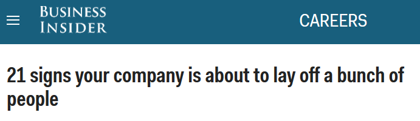
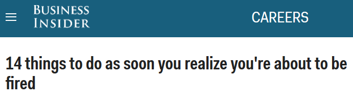
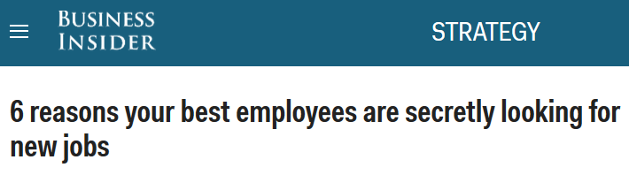
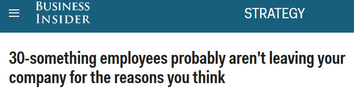
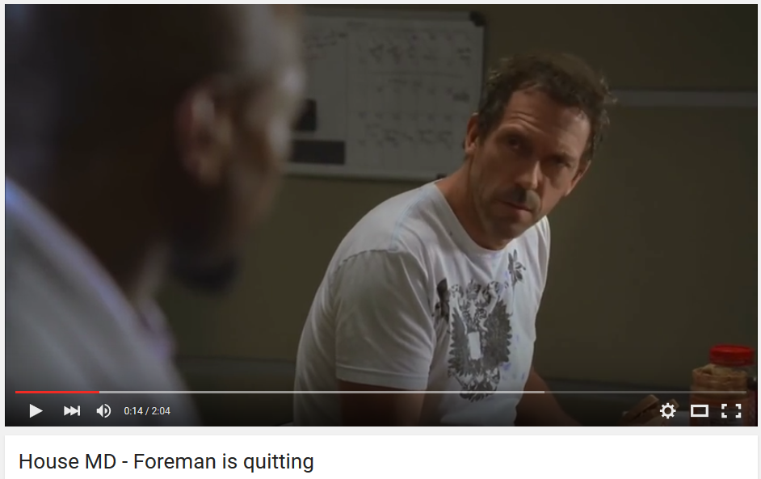
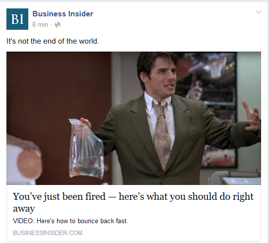
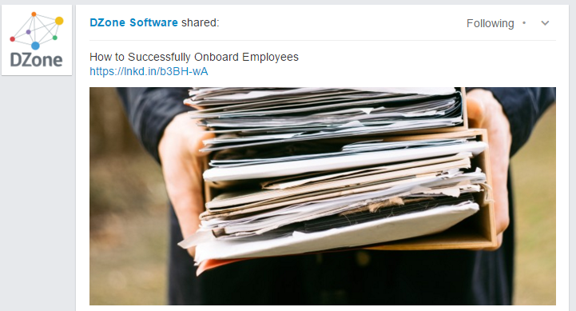

<!-- MarkdownTOC -->

- [How to Fire and Onboard Employees](#how-to-fire-and-onboard-employees)
    - [How to Fire](#how-to-fire)
    - [How to Successfully Onboard Employees](#how-to-successfully-onboard-employees)

<!-- /MarkdownTOC -->

<blockquote class="twitter-tweet tw-align-center" data-lang="es">
Sometimes bad things happen in life. See a big bird hitting a KLM Boeing 747 during landing.  cc <a href="https://twitter.com/MarkRWheeler2">@MarkRWheeler2</a> <a href="https://t.co/7rMvuiJpMJ">pic.twitter.com/7rMvuiJpMJ</a>
&mdash; Airplane Pictures ✈️ (@iLove_Aviation) <a href="https://twitter.com/iLove_Aviation/status/734022548980011008">21 de mayo de 2016</a></blockquote>

# How to Fire and Onboard Employees
## How to Fire
- [How to Fire Someone You Like](https://www.linkedin.com/pulse/how-fire-someone-you-like-zeynep-ilgaz)

<blockquote class="twitter-tweet tw-align-center" data-partner="tweetdeck">
Check out this HBR article on how to embrace complex change. | <a href="https://t.co/McNTpbrQwP">https://t.co/McNTpbrQwP</a> <a href="https://t.co/p8aMSXyauL">pic.twitter.com/p8aMSXyauL</a>
&mdash; Red Hat Training (@RedHat_Training) <a href="https://twitter.com/RedHat_Training/status/706809624440266752">March 7, 2016</a></blockquote>

<blockquote class="twitter-tweet tw-align-center" data-lang="es">
19 unprofessional habits that could cost you a job <a href="https://t.co/RKXSzBZXLu">https://t.co/RKXSzBZXLu</a> <a href="https://t.co/9Aze2ABFJ5">pic.twitter.com/9Aze2ABFJ5</a>
&mdash; Business Insider (@businessinsider) <a href="https://twitter.com/businessinsider/status/708699357487472641">12 de marzo de 2016</a></blockquote>

<iframe width="560" height="315" src="https://www.youtube.com/embed/u1zX5ftiI2U?rel=0" frameborder="0" allowfullscreen class="video"></iframe>

 

<iframe width="560" height="315" src="https://www.youtube.com/embed/nRUkLUwX67M?rel=0" frameborder="0" allowfullscreen class="video"></iframe>

 

<iframe width="560" height="315" src="https://www.youtube.com/embed/M-WBXb2aPbQ?rel=0" frameborder="0" allowfullscreen class="video"></iframe>

 

<blockquote class="twitter-tweet tw-align-center" data-lang="es">
Muy bueno - recomendado para mis estudiantes del Grado RRLL y RRHH: &quot;PECERA&quot;, el corto más reivindicativo del año. <a href="https://t.co/tdNSHbk0c4">https://t.co/tdNSHbk0c4</a>
&mdash; Alberto R.Villaverde (@alberto_ugr) <a href="https://twitter.com/alberto_ugr/status/683382607699152897">2 de enero de 2016</a></blockquote>

<blockquote class="twitter-tweet tw-align-center" data-lang="es">
Best way to deliver bad news: <a href="https://t.co/CyRZExxfU7">https://t.co/CyRZExxfU7</a> via <a href="https://twitter.com/YouTube">@youtube</a> <a href="https://twitter.com/hashtag/moneyball?src=hash">#moneyball</a>
&mdash; Jenny Kay Pollock (@jennykaypollock) <a href="https://twitter.com/jennykaypollock/status/707406607328485377">9 de marzo de 2016</a></blockquote>

<iframe width="560" height="315" src="https://www.youtube.com/embed/Sfm2OzP1cRQ?rel=0" frameborder="0" allowfullscreen class="video"></iframe>

 

<iframe width="560" height="315" src="https://www.youtube.com/embed/sJQL8w-jgEs?rel=0" frameborder="0" allowfullscreen class="video"></iframe>

 

<blockquote class="twitter-tweet tw-align-center" data-lang="es">
American Beauty How to Quit a Job With Kevin Spacey. What a way to quit a job and start a new life.. <a href="http://t.co/On0SDsEe0e">http://t.co/On0SDsEe0e</a>
&mdash; David J Harvey (@davidharvey192) <a href="https://twitter.com/davidharvey192/status/574684272298086401">8 de marzo de 2015</a></blockquote>

<blockquote class="twitter-tweet tw-align-center" data-lang="es">
I liked a <a href="https://twitter.com/YouTube">@YouTube</a> video <a href="http://t.co/Fe1lPk58OR">http://t.co/Fe1lPk58OR</a> Fight Club (4/5) Movie CLIP - Jack&#39;s Smirking Revenge (1999) HD
&mdash; Flavor (@Flavorant) <a href="https://twitter.com/Flavorant/status/634471694351007744">20 de agosto de 2015</a></blockquote>

<iframe width="560" height="315" src="https://www.youtube.com/embed/WVr1NcBdGTg?rel=0" frameborder="0" allowfullscreen class="video"></iframe>

 

<iframe width="560" height="315" src="https://www.youtube.com/embed/Km6bFBSVty4?rel=0" frameborder="0" allowfullscreen class="video"></iframe>

 

## How to Successfully Onboard Employees
- [How to Successfully Onboard Employees](http://www.dzonesoftware.com/blog/how-to-successfully-onboard-employees)

<blockquote class="twitter-tweet tw-align-center" data-lang="es">
According to <a href="https://twitter.com/Forbes">@Forbes</a>, the expense to replace an employee ranging from $3k-$18k. <a href="https://t.co/YXGa8ZVkQr">https://t.co/YXGa8ZVkQr</a> <a href="https://twitter.com/hashtag/onboarding?src=hash">#onboarding</a>
&mdash; DZone Software (@DZoneSoftware) <a href="https://twitter.com/DZoneSoftware/status/707955522662768640">marzo 10, 2016</a></blockquote>

<iframe width="560" height="315" src="https://www.youtube.com/embed/Ga2zo_chWlQ?rel=0" frameborder="0" allowfullscreen class="video"></iframe>

 

<iframe width="560" height="315" src="https://www.youtube.com/embed/34WhFregGDU?rel=0" frameborder="0" allowfullscreen class="video"></iframe>

 

<iframe width="420" height="315" src="https://www.youtube.com/embed/0vAq-_R-EiI?rel=0" frameborder="0" allowfullscreen class="video"></iframe>

 

<iframe width="560" height="315" src="https://www.youtube.com/embed/A4peB4yfPKM?rel=0" frameborder="0" allowfullscreen class="video"></iframe>

 

<iframe width="560" height="315" src="https://www.youtube.com/embed/otjzLH8Gdto?rel=0" frameborder="0" allowfullscreen class="video"></iframe>

 
