<!-- MarkdownTOC -->

- [Human Resources](#human-resources)
    - [HR Blogs](#hr-blogs)
    - [Employee Engagement](#employee-engagement)
    - [Flexible Work Policies](#flexible-work-policies)
    - [Management](#management)
    - [Work environment issues](#work-environment-issues)
    - [Code of conduct](#code-of-conduct)
    - [Employee Poaching & Non-Compete Agreements](#employee-poaching--non-compete-agreements)
    - [Job hunting](#job-hunting)
        - [Job Description](#job-description)
        - [Networking](#networking)
    - [Restructuring](#restructuring)
        - [How to Fire and Onboard Employees](#how-to-fire-and-onboard-employees)
    - [Culture and collaboration](#culture-and-collaboration)
    - [Office Politics](#office-politics)
    - [Talks](#talks)
    - [Leadership Blogs](#leadership-blogs)
    - [9 Box Model for classifying people in organizations](#9-box-model-for-classifying-people-in-organizations)
    - [Interview Preparation Guide](#interview-preparation-guide)
    - [References](#references)
- [Recursos Humanos](#recursos-humanos)

<!-- /MarkdownTOC -->

<blockquote class="twitter-tweet tw-align-center" data-lang="es">
<a href="https://twitter.com/hashtag/RedHat?src=hash">#RedHat</a> is the best place to work according to <a href="https://twitter.com/Glassdoor">@Glassdoor</a> <a href="https://twitter.com/TriangleBIZJrnl">@TriangleBIZJrnl</a> &amp; <a href="https://twitter.com/NCTA">@NCTA</a> read more in our Awards Roundup <a href="https://t.co/RnBwdH2B3m">https://t.co/RnBwdH2B3m</a>
&mdash; Red Hat, Inc. (@RedHatNews) <a href="https://twitter.com/RedHatNews/status/703296727374106624">26 de febrero de 2016</a></blockquote>

<blockquote class="twitter-tweet tw-align-center" data-lang="es">
&quot;Once something is a passion, the motivation is there.&quot; ~ Michael Schumacher <a href="https://twitter.com/hashtag/quote?src=hash">#quote</a> <a href="https://twitter.com/hashtag/leadership?src=hash">#leadership</a> <a href="https://twitter.com/hashtag/inspiration?src=hash">#inspiration</a> <a href="https://twitter.com/hashtag/F1?src=hash">#F1</a> <a href="https://t.co/PSRLbjVqnt">pic.twitter.com/PSRLbjVqnt</a>
&mdash; Tamara McCleary (@TamaraMcCleary) <a href="https://twitter.com/TamaraMcCleary/status/706243435376709632">5 de marzo de 2016</a></blockquote>

[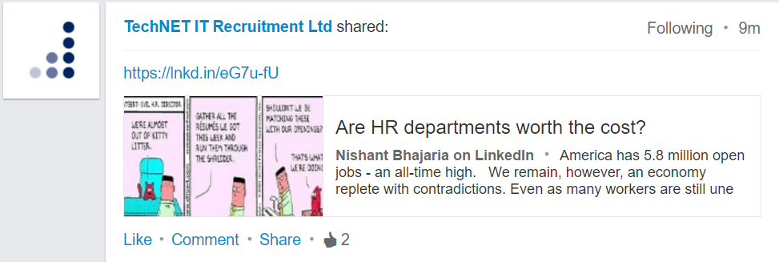](https://www.linkedin.com/pulse/hr-departments-worth-cost-nishant-bhajaria)

<blockquote class="twitter-tweet tw-align-center" data-lang="es">
Businesses are embracing the idea of working in teams—but managing them is hard <a href="https://t.co/O9FDDRVDop">https://t.co/O9FDDRVDop</a> <a href="https://t.co/UG7BIMIzHw">pic.twitter.com/UG7BIMIzHw</a>
&mdash; The Economist (@TheEconomist) <a href="https://twitter.com/TheEconomist/status/710130155470102528">16 de marzo de 2016</a></blockquote>

# Human Resources 
## HR Blogs
- [careerealism.com](http://www.careerealism.com/)
- [careersherpa.net](http://careersherpa.net)
- [hbr.org: Harvard Business Review - Ideas and Advice for Leaders](https://hbr.org/)
- [Undercover Recruiter - Career and Recruitment Blog](http://theundercoverrecruiter.com/)
- [L. David Marquet](https://davidmarquet.wordpress.com/blog-posts/)

## Employee Engagement
- [How Maslow’s Hierarchy of Needs influences Employee Engagement](http://www.scancapture.co.uk/how-maslows-hierarchy-of-needs-influences-employee-engagement/)

## Flexible Work Policies
- [medium: Oh Sh*t. Your top female talent is pregnant](https://medium.com/swlh/oh-sh-t-your-top-female-talent-is-pregnant-7625cbc0a755)
- [Which is the best country to be a working woman? 🌟](http://www.weforum.org/agenda/2016/02/where-is-the-best-country-to-be-a-working-woman)
- [‘Flexible Work Policies Shouldn’t Just Be About Parents’ 🌟](http://motto.time.com/4219863/parental-leave-flexible-work-policies-for-non-parents) People without children have personal lives that matter, too 

[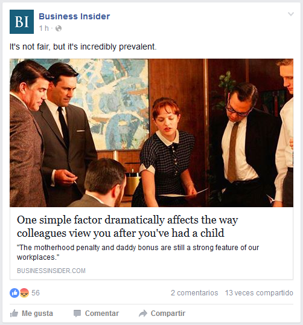](http://www.businessinsider.com/r-motherhood-penalty-daddy-bonus-new-british-parents-judged-at-work-2016-3)

## Management
- [What is conservative management style?](http://www.answers.com/Q/What_is_conservative_management_style)
- [Good vs Bad Leader](http://vladmihalcea.com/2013/12/28/good-vs-bad-leader/)
- [Good Boss, Bad Boss: How to Be the Best... and Learn from the Worst 🌟](http://www.amazon.com/Good-Boss-Bad-Learn-Worst/dp/0446556076/ref=pd_sim_sbs_14_1?ie=UTF8&dpID=41iCWG-MEiL&dpSrc=sims&preST=_AC_UL160_SR106%2C160_&refRID=1CGD4PA2V77XTVWRXXW6)
- [9 Signs You’ve Got a Bad Boss](http://www.learnvest.com/2012/02/9-signs-youve-got-a-bad-boss/)
- [Can You Be Friends With Your Boss?](https://hbr.org/2014/11/can-you-be-friends-with-your-boss)
- [21 Signs That Your Boss Doesn't Like You 🌟](http://www.inc.com/business-insider/signs-your-boss-does-not-like-you.html) The signals may be subtle--but if you know what to look for, they are usually easy to spot.
- [When Your Manager Doesn't Want You To Succeed](https://www.linkedin.com/pulse/when-your-manager-doesnt-want-you-succeed-liz-ryan)
- [24 signs you have a terrible boss](http://www.businessinsider.com/signs-you-have-a-bad-boss-2016-2-4)
- [How to Manage the 3 Worst Types of Bosses](http://www.inc.com/larry-alton/how-to-manage-the-3-worst-types-of-bosses.html) It's hard to find a good boss, so it's important to know how to handle a bad one.
- [enterprisersproject.com: Why too much talent is wasted by managers not daring to lose control](https://enterprisersproject.com/article/2014/11/cios-and-ctos-empower-your-teams)
- [The 17 things you should never say to your boss](http://www.news.com.au/finance/small-business/the-17-things-you-should-never-say-to-your-boss/story-fn9evb64-1226726850961)
- [8 phrases to eliminate from your work vocabulary](http://www.businessinsider.com/phrases-to-eliminate-from-your-work-vocab-2016-1)
- [9 Things Managers Do That Make Good Employees Quit](http://www.entrepreneur.com/article/249903)
- [Learning as A Leader: The Good, the Bad and the Ugly (Part 2)](https://www.linkedin.com/pulse/learning-leader-good-bad-ugly-part-2-marla-kaplowitz)
- [businessinsider.com: Researchers discovered a surprising trait shared by the worst bosses](http://www.businessinsider.com/study-finds-the-worst-bosses-are-unpredictable-2016-3)
- [Daniel Goleman: How to Coach A Dictatorial Leader 🌟](https://www.linkedin.com/pulse/how-coach-dictatorial-leader-daniel-goleman)
- [10 Things HR Doesn't Want You to Know (but I'll Tell You) 🌟🌟](http://www.inc.com/jt-odonnell/10-things-hr-doesn-t-want-you-to-know-but-i-ll-tell-you.html) HR and recruiting have some secrets you should know..
- [Feels Like My Boss Doesn't Like Me (And, It's Hurting My Career) 🌟](https://www.linkedin.com/pulse/feels-like-my-boss-doesnt-me-its-hurting-career-j-t-o-donnell)
- [20 things the most respected bosses never say](http://www.businessinsider.com/20-things-the-most-respected-bosses-never-say-2016-3)
- [businessinsider.com: 13 signs you're about to get a promotion at work 🌟](http://www.businessinsider.com/signs-youre-about-to-be-promoted-at-work-2016-3)
- [forbes: 9 Things You Can Do When The Boss Takes Credit For Your Work](http://www.forbes.com/sites/jacquelynsmith/2013/04/30/9-things-you-can-do-when-the-boss-takes-credit-for-your-work)

[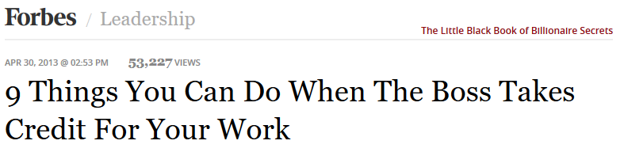](http://www.forbes.com/sites/jacquelynsmith/2013/04/30/9-things-you-can-do-when-the-boss-takes-credit-for-your-work)

<blockquote class="twitter-tweet tw-align-center" data-lang="es">
&quot;The only difference between a good day and a bad day is your attitude.&quot; -- Dennis Brown<a href="https://twitter.com/hashtag/Sysadmin?src=hash">#Sysadmin</a> <a href="https://twitter.com/hashtag/Life?src=hash">#Life</a> <a href="https://twitter.com/hashtag/quoteoftheday?src=hash">#quoteoftheday</a>
&mdash; nixCraft (@nixcraft) <a href="https://twitter.com/nixcraft/status/706214302244405248">5 de marzo de 2016</a></blockquote>

<iframe width="420" height="315" src="https://www.youtube.com/embed/c2UUSp4bkNs?rel=0" frameborder="0" allowfullscreen class="video"></iframe>

 

[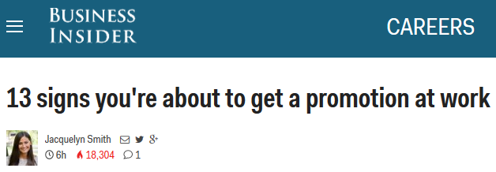](http://www.businessinsider.com/signs-youre-about-to-be-promoted-at-work-2016-3)

## Work environment issues
- [forbes.com: How To Handle A Frenemy At Work](http://www.forbes.com/sites/lizryan/2016/02/11/how-to-handle-a-frenemy-at-work) What is a frenemy? It’s a person who acts like a friend until they suddenly decide to stab you in the back.
- [businessinsider.com: 19 signs your coworkers secretly hate you](http://www.businessinsider.com/signs-your-colleagues-secretly-hate-you-2016-1)
- [Don't let 'jerks' ruin your day — here's how to overcome their bad energy at work](http://www.businessinsider.com/avoid-jerks-work-bad-energy-2016-1)
- [It’s Better to Avoid a Toxic Employee than Hire a Superstar](https://hbr.org/2015/12/its-better-to-avoid-a-toxic-employee-than-hire-a-superstar)
- [cityam.com: "Ghosting" is the new skiving as nine per cent of UK workers admit to giving their employers the silent treatment](http://www.cityam.com/234699/ghosting-is-the-new-skiving-as-nine-per-cent-of-uk-workers-admit-to-giving-their-employers-the-silent-treatment)
- [Examples of Bullying in the Workplace](https://www.linkedin.com/pulse/20140723143757-143588541-examples-of-bullying-in-the-workplace)
- [How To Tell If Your Boss Is a Bully or Just Tough](https://www.hrbartender.com/2012/leadership-and-management/how-to-tell-if-your-boss-is-a-bully-or-just-tough/)
- [How to Unlock the “Respect Me” Code at Work](https://www.linkedin.com/pulse/how-unlock-respect-me-code-work-j-t-o-donnell)
- [Are You A Jerk At Work? (How To Know For Sure) 🌟](https://www.linkedin.com/pulse/you-jerk-work-how-know-sure-nathalie-salles)
- [Why some teams don’t get along — and what we learned from the commander of the International Space Station](https://www.linkedin.com/pulse/why-some-teams-dont-get-along-what-we-learned-from-commander-elton)
- [An Empathy Video That Asks You To Stand in Someone Else's Shoes 🌟](http://www.onbeing.org/blog/an-empathy-video-that-asks-you-to-stand-in-someone-elses-shoes/5063)
- [cityam - Personality clash: Dealing with conflict in the workplace](http://www.cityam.com/235878/personality-clash-dealing-with-conflict-in-the-workplace)
- [What it was like to leave Microsoft for a less stressful, lower-paying job](http://www.businessinsider.com/what-it-was-like-to-leave-microsoft-for-a-less-stressful-lower-paying-job-2016-3)

[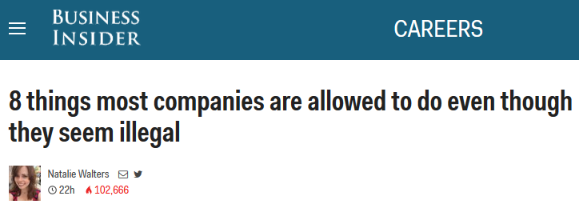](http://www.businessinsider.com/things-your-boss-can-legally-do-2016-3)

[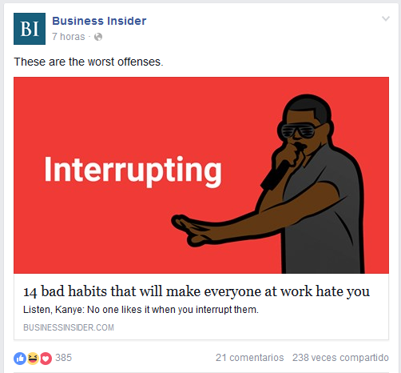](http://www.businessinsider.com/bad-habits-that-make-everyone-at-work-hate-you-2016-3)

<blockquote class="twitter-tweet tw-align-center" data-partner="tweetdeck">
<a href="https://twitter.com/hashtag/F1VaultVideo?src=hash">#F1VaultVideo</a> - Part 2 of <a href="https://twitter.com/hashtag/Schumacher?src=hash">#Schumacher</a> vs <a href="https://twitter.com/hashtag/Coulthard?src=hash">#Coulthard</a>. Who was in the wrong? <a href="https://twitter.com/hashtag/F1?src=hash">#F1</a> <a href="https://t.co/f2x6QujJ2n">pic.twitter.com/f2x6QujJ2n</a>
&mdash; F1 Fanzone (@F1FanzoneMag) <a href="https://twitter.com/F1FanzoneMag/status/705857928595636224">March 4, 2016</a></blockquote>

<blockquote class="twitter-tweet tw-align-center" data-lang="es">
<a href="https://twitter.com/hashtag/Doctor?src=hash">#Doctor</a> <a href="https://twitter.com/hashtag/House?src=hash">#House</a> <a href="https://twitter.com/hashtag/Quotes?src=hash">#Quotes</a> - <a href="https://t.co/1W6ENWI9fq">https://t.co/1W6ENWI9fq</a><a href="https://twitter.com/hashtag/MovieTVShow?src=hash">#MovieTVShow</a> <a href="https://twitter.com/hashtag/Quote?src=hash">#Quote</a> <a href="https://t.co/dxjhdNKTpP">pic.twitter.com/dxjhdNKTpP</a>
&mdash; Hikmet Gulsesli (@glsesli) <a href="https://twitter.com/glsesli/status/703239008479023104">26 de febrero de 2016</a></blockquote>

<blockquote class="twitter-tweet tw-align-center" data-lang="es">
VÍDEO | Bouhanni, DESCALIFICADO. Mejor verlo que tratar de explicarlo  <a href="https://twitter.com/hashtag/ParisNice?src=hash">#ParisNice</a> (via <a href="https://twitter.com/Eurosport_ES">@Eurosport_ES</a>) <a href="https://t.co/NzociigkDn">pic.twitter.com/NzociigkDn</a>
&mdash; adriangroca (@adriangroca) <a href="https://twitter.com/adriangroca/status/707251488846958593">8 de marzo de 2016</a></blockquote>

<blockquote class="twitter-tweet tw-align-center" data-lang="es">
16 signs your job is ruining your marriage <a href="https://t.co/Y0f4b2JyXA">https://t.co/Y0f4b2JyXA</a> <a href="https://t.co/PCQgplEUdz">pic.twitter.com/PCQgplEUdz</a>
&mdash; Business Insider (@businessinsider) <a href="https://twitter.com/businessinsider/status/708010250612436992">10 de marzo de 2016</a></blockquote>

<blockquote class="twitter-tweet tw-align-center" data-lang="es">
Apple, Google and Microsoft top the list of tech companies where women feel treated fairly: <a href="https://t.co/KjV9TbOj01">https://t.co/KjV9TbOj01</a> <a href="https://t.co/liDh0CTceA">pic.twitter.com/liDh0CTceA</a>
&mdash; Forbes Tech News (@ForbesTech) <a href="https://twitter.com/ForbesTech/status/708699102058512384">12 de marzo de 2016</a></blockquote>

<blockquote class="twitter-tweet tw-align-center" data-lang="es">
Adapt or Die. It&#39;s a data story - <a href="https://t.co/M8Nx3cATPY">https://t.co/M8Nx3cATPY</a>
&mdash; Namster Travel (@namsterzw) <a href="https://twitter.com/namsterzw/status/709319654846697472">14 de marzo de 2016</a></blockquote>

<blockquote class="twitter-tweet tw-align-center" data-lang="es">
Office Space (3/5) Movie CLIP - Motivation Problems (1999) HD Ever feel like this? <a href="http://t.co/G3HvQOClpw">http://t.co/G3HvQOClpw</a>
&mdash; Keith Gorman (@wfo420) <a href="https://twitter.com/wfo420/status/651792710966206464">7 de octubre de 2015</a></blockquote>

[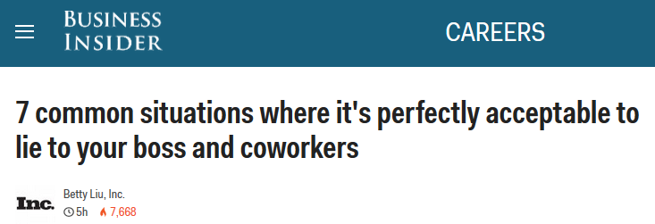](http://www.businessinsider.com/when-its-okay-to-lie-to-your-boss-and-coworkers-2016-3)

## Code of conduct
- [The complex reality of adopting a meaningful code of conduct](https://subfictional.com/2016/01/25/the-complex-reality-of-adopting-a-meaningful-code-of-conduct/)
- [Bad Employee Handbook Policies Sure to Land You in Court](http://www.mjms.net/blog/bad-employee-handbook-policies-sure-to-land-you-in-court/) What's overwhelming? Creating an employee handbook while avoiding common policy mistakes.

## Employee Poaching & Non-Compete Agreements
- [High-Tech Employee Antitrust Litigation](https://en.wikipedia.org/wiki/High-Tech_Employee_Antitrust_Litigation)
- [Apple, Google, others settle antipoaching lawsuit for $415 million](http://www.cnet.com/news/apple-google-others-settle-anti-poaching-lawsuit-for-415-million/)
- [Apple, Google reach new deal to end U.S. lawsuit over poaching](http://www.reuters.com/article/us-apple-google-settlement-idUSKBN0KN02Z20150114)
- [Demanda multimillonaria a Apple, Google, Intel y Adobe por pactar que no se robarían empleados](http://www.elperiodico.com/es/noticias/economia/apple-google-intel-adobe-pagaran-372-millones-euros-por-pactar-que-robarian-empleados-4480311)
- [¿Que os parece la actitud de Google, Apple, Intel, Adobe, etc?](http://www.xataka.com/respuestas/que-os-parece-la-actitud-de-google-apple-intel-adobe-etc)

[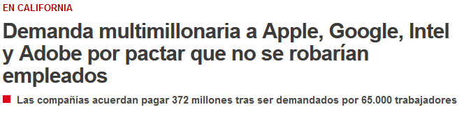](http://www.elperiodico.com/es/noticias/economia/apple-google-intel-adobe-pagaran-372-millones-euros-por-pactar-que-robarian-empleados-4480311)

<blockquote class="twitter-tweet tw-align-center" data-lang="es">
Non-compete agreements are becoming more common - here&#39;s how to arm yourself if you&#39;re asked to sign: <a href="https://t.co/nMpQSr7ym1">https://t.co/nMpQSr7ym1</a>
&mdash; Ross School of Bus. (@MichiganRoss) <a href="https://twitter.com/MichiganRoss/status/710475048893718528">17 de marzo de 2016</a></blockquote>

## Job hunting
- [9 Signs You Should Run Away From That Job Offer](http://www.inc.com/jt-odonnell/9-signs-you-should-run-away-from-that-job-offer.html)
- [modelviewculture.com: The Full-Stack Employee and The Glorification of Generalization](https://modelviewculture.com/news/the-full-stack-employee-and-the-glorification-of-generalization)
- [Employer Loved Me... Then Rejected Me](https://www.linkedin.com/pulse/employer-loved-me-rejected-j-t-o-donnell)
- [3 Things You Need to Find a Job Faster](http://www.inc.com/jt-odonnell/these-3-things-will-help-you-find-a-job-faster.html)
- [A hedge fund HR boss says too many young people are making this error and destroying their chances at a job](http://www.businessinsider.com/point-72-mike-butler-resume-errors-2016-2) More and more young candidates for hedge fund positions aren't being completely honest on their résumés.

[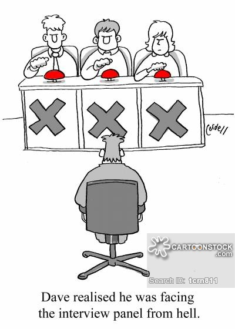](https://www.cartoonstock.com/directory/j/job_hunting.asp)

<iframe width="560" height="315" src="https://www.youtube.com/embed/zj0eTrIHWYA?rel=0" frameborder="0" allowfullscreen class="video"></iframe>

 

<iframe width="560" height="315" src="https://www.youtube.com/embed/Lv8BUJ_JodY?rel=0" frameborder="0" allowfullscreen class="video"></iframe>

 

<iframe width="560" height="315" src="https://www.youtube.com/embed/x9fHdaiA0I4?rel=0" frameborder="0" allowfullscreen class="video"></iframe>

 

<iframe width="560" height="315" src="https://www.youtube.com/embed/q323W7shB4A?rel=0" frameborder="0" allowfullscreen class="video"></iframe>

 

<iframe width="560" height="315" src="https://www.youtube.com/embed/ts0yeBheNbw?rel=0" frameborder="0" allowfullscreen class="video"></iframe>

 

<blockquote class="twitter-tweet tw-align-center" data-lang="es">
How I see recruiters   <a href="https://t.co/M5BSseIqDl">https://t.co/M5BSseIqDl</a> <a href="https://t.co/WTdalBHu6q">pic.twitter.com/WTdalBHu6q</a>
&mdash; CommitStrip (@CommitStrip) <a href="https://twitter.com/CommitStrip/status/703286172043313154">26 de febrero de 2016</a></blockquote>

<blockquote class="twitter-tweet tw-align-center" data-lang="es">
When you need experience to get a job but you need a job for experience 🙃 <a href="https://t.co/Xm37xnBcKP">pic.twitter.com/Xm37xnBcKP</a>
&mdash; Nerd (@SmartInsults) <a href="https://twitter.com/SmartInsults/status/702547713573916672">24 de febrero de 2016</a></blockquote>

<blockquote class="twitter-tweet tw-align-center" data-lang="es">
Most of these require effort not talent. Still good list though for any one working in IT :) <a href="https://t.co/5fvzFl94V2">pic.twitter.com/5fvzFl94V2</a>
&mdash; nixCraft (@nixcraft) <a href="https://twitter.com/nixcraft/status/710541752847839232">17 de marzo de 2016</a></blockquote>

### Job Description
- [4 Benefits of Accurate Job Descriptions for Small Businesses](http://www.mjms.net/blog/4-benefits-of-accurate-job-descriptions-for-small-businesses/)

<blockquote class="twitter-tweet tw-align-center" data-lang="es">
<a href="https://twitter.com/MLoParis">@MLoParis</a> Or Michael Douglas in Falling Down <a href="https://t.co/m5HYjn4XWx">pic.twitter.com/m5HYjn4XWx</a>
&mdash; Eileen Toomey-Wright (@ToomeyWright) <a href="https://twitter.com/ToomeyWright/status/676908732027129857">15 de diciembre de 2015</a></blockquote>

### Networking
- [5 Networking Mistakes And How To Easily Avoid Them](http://www.careerealism.com/networking-mistakes-avoid-easily/)
- [How NOT to Contact Recruiters on LinkedIn](http://theundercoverrecruiter.com/how-not-to-contact-recruiters-on-linkedin-10-ways/)
- [careerealism.com: 5 Networking Tips Every Job Seeker Needs](http://www.careerealism.com/networking-tips-job-seeker-needs/)

## Restructuring
- [GitHub is undergoing a full-blown overhaul as execs and employees depart — and we have the full inside story](http://www.businessinsider.com/github-the-full-inside-story-2016-2)

### How to Fire and Onboard Employees
- [How to Fire and Onboard](howto_fire_onboard.md)

## Culture and collaboration
- [Culture and collaboration](culture_collaboration.md)

## Office Politics
- [Office Politics](office_politics.md)

## Talks
- [Apple CEO Tim Cook on Collaboration](https://youtu.be/EZPYLZ7I6gs)
- [Ted Talks. Susan Cain: The power of introverts](http://www.ted.com/talks/susan_cain_the_power_of_introverts)
- [Simon Sinek: If You Don't Understand People, You Don't Understand Business](https://youtu.be/llKvV8_T95M)
- [Simon Sinek: Love Your Work](https://youtu.be/jDIZS4IQlQk)
- [The 7 Habits of Highly Effective People](https://youtu.be/ktlTxC4QG8g)

## Leadership Blogs
- [Leadership Blogs](leadership.md)

## 9 Box Model for classifying people in organizations
- [slideshare.net: 9 Box Model for classifying people in organizations](http://es.slideshare.net/ryancruz08/9-box-model-with-titles)
- [slideshare.net: 9 Box Performance-Potential Matrix](http://www.slideshare.net/shakib362/9-box)

[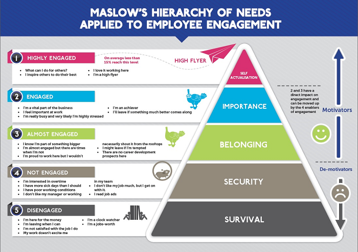](http://www.scancapture.co.uk/how-maslows-hierarchy-of-needs-influences-employee-engagement/)

[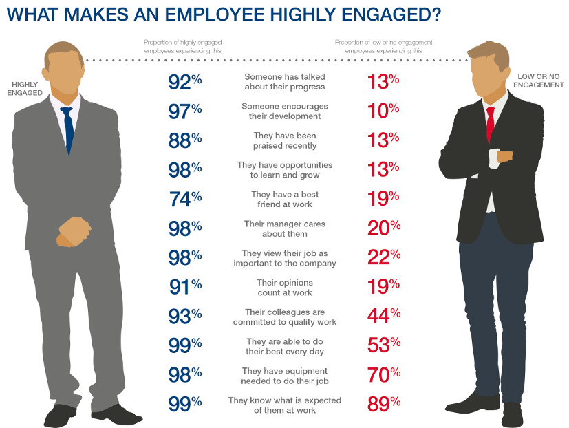](http://www.callcentre.co.uk/engage-contact-centre-staff-boost-productivity/)

<iframe style="border: solid 1px #dedede;"  src="http://app.stitcher.com/splayer/f/11394/41957500" width="220" height="150" frameborder="0" scrolling="no"></iframe>

<iframe width="560" height="315" src="https://www.youtube.com/embed/kRtBgGE5kQw?rel=0" frameborder="0" allowfullscreen class="video"></iframe>

 

## Interview Preparation Guide
- [Interview Preparation Guide](interview_preparation_guide.md)

## References
- [References](references.md)

# Recursos Humanos
- [Recursos Humanos](rrhh.md)

<iframe width="560" height="315" src="https://www.youtube.com/embed/lXXlBJ7aIsI?rel=0" frameborder="0" allowfullscreen class="video"></iframe>

 

<iframe width="560" height="315" src="https://www.youtube.com/embed/3cBLbNcvaN0?rel=0" frameborder="0" allowfullscreen class="video"></iframe>

 

[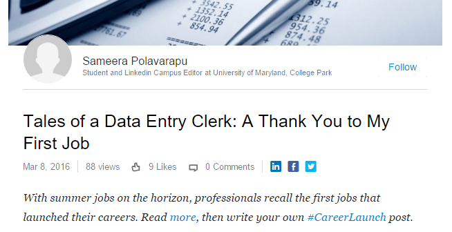](https://www.linkedin.com/pulse/tales-data-entry-clerk-thank-you-my-first-job-sameera-polavarapu)

<iframe width="560" height="315" src="https://www.youtube.com/embed/z5avVsKjNyo?rel=0" frameborder="0" allowfullscreen class="video"></iframe>

 

<iframe width="560" height="315" src="https://www.youtube.com/embed/SzBj0CNP3pA?rel=0" frameborder="0" allowfullscreen class="video"></iframe>

 

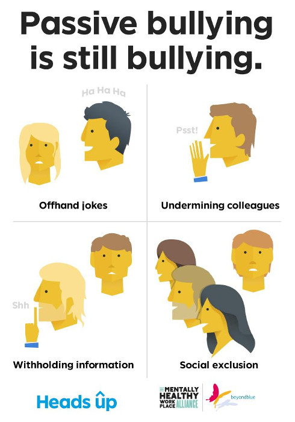

[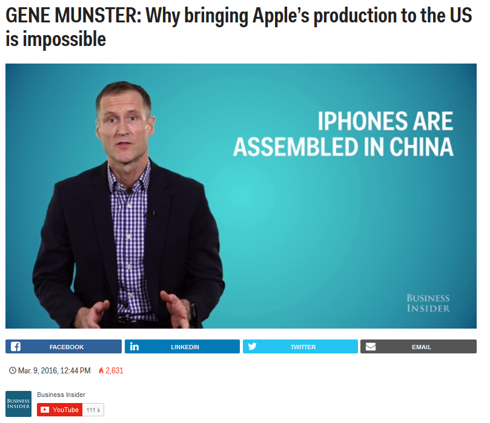](http://www.businessinsider.com/apple-production-trump-boycott-iphone-trump-2016-3)

<iframe width="560" height="315" src="https://www.youtube.com/embed/cDDWvj_q-o8?rel=0" frameborder="0" allowfullscreen class="video"></iframe>

 

<iframe width="560" height="315" src="https://www.youtube.com/embed/llj7LzTULog?rel=0" frameborder="0" allowfullscreen class="video"></iframe>

 

<iframe width="560" height="315" src="https://www.youtube.com/embed/ktlTxC4QG8g?rel=0" frameborder="0" allowfullscreen class="video"></iframe>

 

