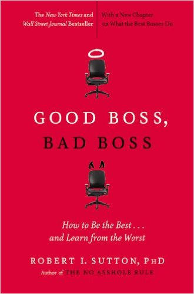
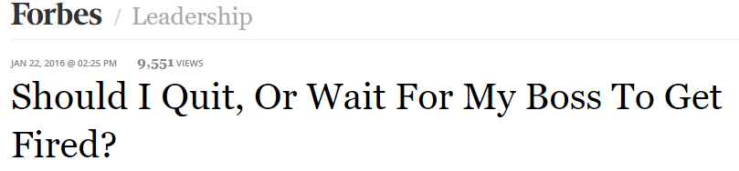
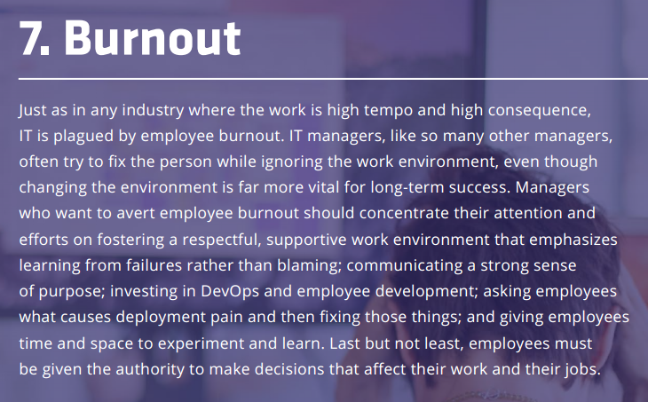
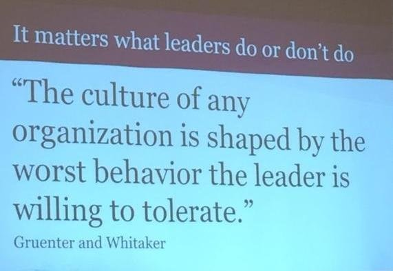
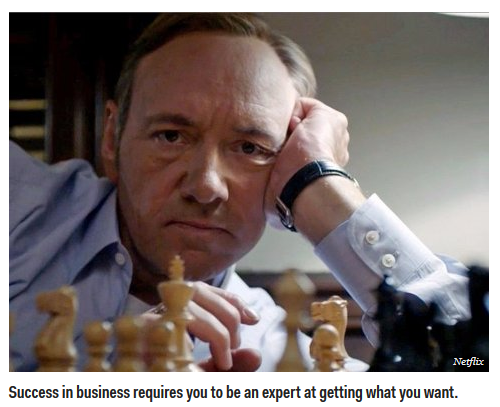
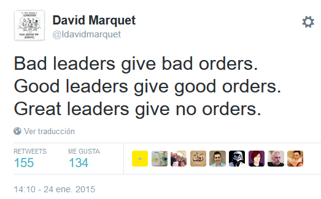
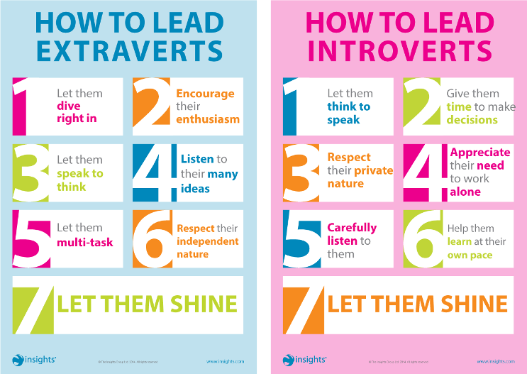
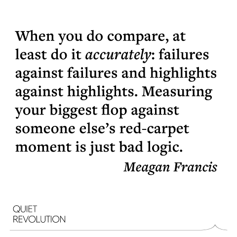
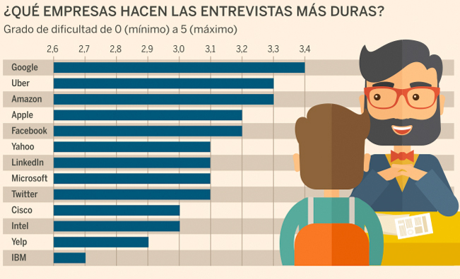
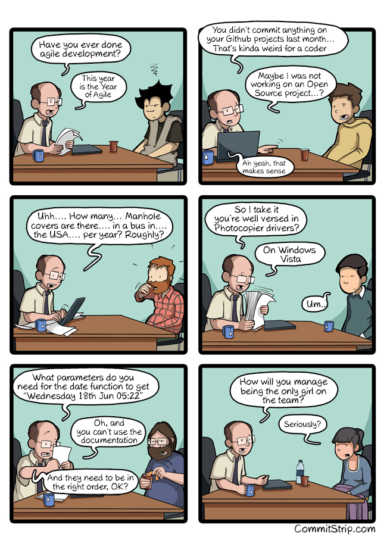

<!-- MarkdownTOC -->

- [Human Resources](#human-resources)
    - [HR Blogs](#hr-blogs)
    - [Articles](#articles)
        - [Employee Engagement](#employee-engagement)
        - [Flexible Work Policies](#flexible-work-policies)
        - [Management](#management)
        - [Work environment issues](#work-environment-issues)
        - [Code of conduct](#code-of-conduct)
        - [Job hunting](#job-hunting)
        - [Job Description](#job-description)
            - [Networking](#networking)
        - [Restructuring](#restructuring)
            - [How to Fire](#how-to-fire)
        - [Culture and collaboration](#culture-and-collaboration)
    - [Office Politics](#office-politics)
    - [Talks](#talks)
    - [Leadership Blogs](#leadership-blogs)
    - [9 Box Model for classifying people in organizations](#9-box-model-for-classifying-people-in-organizations)
    - [Interview Preparation Guide](#interview-preparation-guide)
        - [Salary Negotiation](#salary-negotiation)
    - [Technical Resume](#technical-resume)
- [Recursos Humanos](#recursos-humanos)
    - [RRHH Blogs](#rrhh-blogs)
    - [Orientacion laboral](#orientacion-laboral)
    - [Articulos](#articulos)

<!-- /MarkdownTOC -->

<blockquote class="twitter-tweet tw-align-center" data-lang="es">
<a href="https://twitter.com/hashtag/RedHat?src=hash">#RedHat</a> is the best place to work according to <a href="https://twitter.com/Glassdoor">@Glassdoor</a> <a href="https://twitter.com/TriangleBIZJrnl">@TriangleBIZJrnl</a> &amp; <a href="https://twitter.com/NCTA">@NCTA</a> read more in our Awards Roundup <a href="https://t.co/RnBwdH2B3m">https://t.co/RnBwdH2B3m</a>
&mdash; Red Hat, Inc. (@RedHatNews) <a href="https://twitter.com/RedHatNews/status/703296727374106624">26 de febrero de 2016</a></blockquote>

# Human Resources 
## HR Blogs
- [careerealism.com](http://www.careerealism.com/)
- [careersherpa.net](http://careersherpa.net)
- [hbr.org: Harvard Business Review - Ideas and Advice for Leaders](https://hbr.org/)
- [Undercover Recruiter - Career and Recruitment Blog](http://theundercoverrecruiter.com/)
- [L. David Marquet](https://davidmarquet.wordpress.com/blog-posts/)

## Articles
### Employee Engagement
- [How Maslow’s Hierarchy of Needs influences Employee Engagement](http://www.scancapture.co.uk/how-maslows-hierarchy-of-needs-influences-employee-engagement/)

### Flexible Work Policies
- [medium: Oh Sh*t. Your top female talent is pregnant](https://medium.com/swlh/oh-sh-t-your-top-female-talent-is-pregnant-7625cbc0a755)
- [Which is the best country to be a working woman? 🌟](http://www.weforum.org/agenda/2016/02/where-is-the-best-country-to-be-a-working-woman)
- [‘Flexible Work Policies Shouldn’t Just Be About Parents’ 🌟](http://motto.time.com/4219863/parental-leave-flexible-work-policies-for-non-parents) People without children have personal lives that matter, too 

### Management
- [What is conservative management style?](http://www.answers.com/Q/What_is_conservative_management_style)
- [Good vs Bad Leader](http://vladmihalcea.com/2013/12/28/good-vs-bad-leader/)
- [Good Boss, Bad Boss: How to Be the Best... and Learn from the Worst 🌟](http://www.amazon.com/Good-Boss-Bad-Learn-Worst/dp/0446556076/ref=pd_sim_sbs_14_1?ie=UTF8&dpID=41iCWG-MEiL&dpSrc=sims&preST=_AC_UL160_SR106%2C160_&refRID=1CGD4PA2V77XTVWRXXW6)
- [9 Signs You’ve Got a Bad Boss](http://www.learnvest.com/2012/02/9-signs-youve-got-a-bad-boss/)
- [Can You Be Friends With Your Boss?](https://hbr.org/2014/11/can-you-be-friends-with-your-boss)
- [21 Signs That Your Boss Doesn't Like You 🌟](http://www.inc.com/business-insider/signs-your-boss-does-not-like-you.html) The signals may be subtle--but if you know what to look for, they are usually easy to spot.
- [When Your Manager Doesn't Want You To Succeed](https://www.linkedin.com/pulse/when-your-manager-doesnt-want-you-succeed-liz-ryan)
- [24 signs you have a terrible boss](http://www.businessinsider.com/signs-you-have-a-bad-boss-2016-2-4)
- [How to Manage the 3 Worst Types of Bosses](http://www.inc.com/larry-alton/how-to-manage-the-3-worst-types-of-bosses.html) It's hard to find a good boss, so it's important to know how to handle a bad one.
- [enterprisersproject.com: Why too much talent is wasted by managers not daring to lose control](https://enterprisersproject.com/article/2014/11/cios-and-ctos-empower-your-teams)
- [The 17 things you should never say to your boss](http://www.news.com.au/finance/small-business/the-17-things-you-should-never-say-to-your-boss/story-fn9evb64-1226726850961)
- [8 phrases to eliminate from your work vocabulary](http://www.businessinsider.com/phrases-to-eliminate-from-your-work-vocab-2016-1)
- [9 Things Managers Do That Make Good Employees Quit](http://www.entrepreneur.com/article/249903)
- [Learning as A Leader: The Good, the Bad and the Ugly (Part 2)](https://www.linkedin.com/pulse/learning-leader-good-bad-ugly-part-2-marla-kaplowitz)

### Work environment issues
- [forbes.com: How To Handle A Frenemy At Work](http://www.forbes.com/sites/lizryan/2016/02/11/how-to-handle-a-frenemy-at-work) What is a frenemy? It’s a person who acts like a friend until they suddenly decide to stab you in the back.
- [businessinsider.com: 19 signs your coworkers secretly hate you](http://www.businessinsider.com/signs-your-colleagues-secretly-hate-you-2016-1)
- [Don't let 'jerks' ruin your day — here's how to overcome their bad energy at work](http://www.businessinsider.com/avoid-jerks-work-bad-energy-2016-1)
- [It’s Better to Avoid a Toxic Employee than Hire a Superstar](https://hbr.org/2015/12/its-better-to-avoid-a-toxic-employee-than-hire-a-superstar)
- [cityam.com: "Ghosting" is the new skiving as nine per cent of UK workers admit to giving their employers the silent treatment](http://www.cityam.com/234699/ghosting-is-the-new-skiving-as-nine-per-cent-of-uk-workers-admit-to-giving-their-employers-the-silent-treatment)
- [Examples of Bullying in the Workplace](https://www.linkedin.com/pulse/20140723143757-143588541-examples-of-bullying-in-the-workplace)
- [How To Tell If Your Boss Is a Bully or Just Tough](https://www.hrbartender.com/2012/leadership-and-management/how-to-tell-if-your-boss-is-a-bully-or-just-tough/)
- [How to Unlock the “Respect Me” Code at Work](https://www.linkedin.com/pulse/how-unlock-respect-me-code-work-j-t-o-donnell)

### Code of conduct
- [The complex reality of adopting a meaningful code of conduct](https://subfictional.com/2016/01/25/the-complex-reality-of-adopting-a-meaningful-code-of-conduct/)
- [Bad Employee Handbook Policies Sure to Land You in Court](http://www.mjms.net/blog/bad-employee-handbook-policies-sure-to-land-you-in-court/) What's overwhelming? Creating an employee handbook while avoiding common policy mistakes.

### Job hunting
- [9 Signs You Should Run Away From That Job Offer](http://www.inc.com/jt-odonnell/9-signs-you-should-run-away-from-that-job-offer.html)
- [modelviewculture.com: The Full-Stack Employee and The Glorification of Generalization](https://modelviewculture.com/news/the-full-stack-employee-and-the-glorification-of-generalization)
- [Employer Loved Me... Then Rejected Me](https://www.linkedin.com/pulse/employer-loved-me-rejected-j-t-o-donnell)
- [3 Things You Need to Find a Job Faster](http://www.inc.com/jt-odonnell/these-3-things-will-help-you-find-a-job-faster.html)
- [A hedge fund HR boss says too many young people are making this error and destroying their chances at a job](http://www.businessinsider.com/point-72-mike-butler-resume-errors-2016-2) More and more young candidates for hedge fund positions aren't being completely honest on their résumés.

### Job Description
- [4 Benefits of Accurate Job Descriptions for Small Businesses](http://www.mjms.net/blog/4-benefits-of-accurate-job-descriptions-for-small-businesses/)

#### Networking
- [5 Networking Mistakes And How To Easily Avoid Them](http://www.careerealism.com/networking-mistakes-avoid-easily/)
- [How NOT to Contact Recruiters on LinkedIn](http://theundercoverrecruiter.com/how-not-to-contact-recruiters-on-linkedin-10-ways/)
- [careerealism.com: 5 Networking Tips Every Job Seeker Needs](http://www.careerealism.com/networking-tips-job-seeker-needs/)

### Restructuring
- [GitHub is undergoing a full-blown overhaul as execs and employees depart — and we have the full inside story](http://www.businessinsider.com/github-the-full-inside-story-2016-2)

#### How to Fire
- [How to Fire Someone You Like](https://www.linkedin.com/pulse/how-fire-someone-you-like-zeynep-ilgaz)

### Culture and collaboration
- [hbr.org: Aligning Your Organization with an Agile Workforce](https://hbr.org/2016/02/aligning-your-organization-with-an-agile-workforce)
- [deloitte: Cultivating the IT Workforce of the Future](http://deloitte.wsj.com/cio/2015/10/20/cultivating-the-it-workforce-of-the-future/)
- [businessinsider.com: 8 mistakes that make great employees leave](http://www.businessinsider.com/8-mistakes-that-make-great-employees-leave-2016-2)
- [Forbes: Addicted To Ambition: 3 Ways Millennials Can Manage Their Stress](http://www.forbes.com/sites/carolinebeaton/2016/02/10/addicted-to-ambition-3-ways-millennials-can-manage-their-stress/)
- [Forbes: How To Successfully Manage A Multigenerational Team 🌟](http://www.forbes.com/sites/adp/2016/02/12/how-to-successfully-manage-a-multigenerational-team)
- [cityam.com: Why you should stop trying to make your team like you](http://www.cityam.com/234743/why-you-should-stop-trying-to-make-your-team-like-you)
- [VW damaged by a culture of fear](https://www.linkedin.com/pulse/vw-damaged-culture-fear-l-david-marquet)
- [Forbes: Seven Ways To Inspire Your Team To Collaborate 🌟🌟🌟](http://www.forbes.com/sites/carolkinseygoman/2016/02/21/seven-ways-to-inspire-your-team-to-collaborate) “How many of you are totally comfortable sharing information with others in your organization?”
- [L. David Marquet: Control In An Emergency 🌟](https://www.linkedin.com/pulse/control-emergency-l-david-marquet)
- [businessinsider.com: 27 jobs to avoid if you hate stress](http://www.businessinsider.com/jobs-to-avoid-if-you-hate-stress-2015-9)
- [businessinsider.com: 13 bad habits you should break in 2016 to be more productive 🌟](http://www.businessinsider.com/bad-habits-that-are-killing-your-productivity-2015-12)

<iframe width="560" height="315" src="https://www.youtube.com/embed/H4gOYlBO0ys?rel=0" frameborder="0" allowfullscreen class="video"></iframe>

 

<iframe width="560" height="315" src="https://www.youtube.com/embed/ZhyuuwkwSao?rel=0" frameborder="0" allowfullscreen class="video"></iframe>

 

<iframe width="560" height="315" src="https://www.youtube.com/embed/qHw9e3iVhKQ?rel=0" frameborder="0" allowfullscreen class="video"></iframe>

 

<blockquote class="twitter-tweet tw-align-center" data-lang="es">
PHOTOS: The 10 happiest jobs: <a href="https://t.co/Dw88jn7gkY">https://t.co/Dw88jn7gkY</a> <a href="https://t.co/R1LYgpgOIT">pic.twitter.com/R1LYgpgOIT</a>
&mdash; Forbes (@Forbes) <a href="https://twitter.com/Forbes/status/705837970125950976">4 de marzo de 2016</a></blockquote>

<blockquote class="twitter-tweet tw-align-center" data-lang="es">
Diversity in the workplace should be celebrated. But not the box-ticking kind <a href="https://t.co/u9sBkBTFLy">https://t.co/u9sBkBTFLy</a> <a href="https://t.co/gk0i6jgteb">pic.twitter.com/gk0i6jgteb</a>
&mdash; The Economist (@TheEconomist) <a href="https://twitter.com/TheEconomist/status/699642973957595137">febrero 16, 2016</a></blockquote>

<blockquote class="twitter-tweet tw-align-center" data-lang="es">
17 signs your boss is about to quit <a href="https://t.co/sielMFFp1q">https://t.co/sielMFFp1q</a> <a href="https://t.co/yCiUljiHCL">pic.twitter.com/yCiUljiHCL</a>
&mdash; Business Insider (@businessinsider) <a href="https://twitter.com/businessinsider/status/699651429959598081">febrero 16, 2016</a></blockquote>

<blockquote class="twitter-tweet tw-align-center" data-lang="es">
How loyal are millennial employees? <a href="https://t.co/uaNXKspauh">https://t.co/uaNXKspauh</a> <a href="https://twitter.com/hashtag/work?src=hash">#work</a> <a href="https://t.co/LYBQbboeD2">pic.twitter.com/LYBQbboeD2</a>
&mdash; World Economic Forum (@wef) <a href="https://twitter.com/wef/status/701055035623526400">febrero 20, 2016</a></blockquote>

<blockquote class="twitter-tweet tw-align-center" data-lang="es">
Show me a person who has never made a mistake and I&#39;ll show you somebody who has never achieved much. ~ Joan Collins
&mdash; Zen Moments (@Zen_Moments) <a href="https://twitter.com/Zen_Moments/status/702151633334046720">febrero 23, 2016</a></blockquote>

## Office Politics
- [Forbes.com: Office Politics: Must You Play? A Handbook For Survival/Success](http://www.forbes.com/sites/cherylsnappconner/2013/04/14/office-politics-must-you-play-a-handbook-for-survivalsuccess/)
- [Setting up to fail](https://en.wikipedia.org/wiki/Setting_up_to_fail)
- [businessinsider.com: Only idiots don't play office politics — here's how to master the game](http://www.businessinsider.com/how-to-play-office-politics-2015-3)
- [Apple CEO Tim Cook on Collaboration and Office Politics](https://youtu.be/EZPYLZ7I6gs)
- [An Introvert's Guide to Surviving Team Lunches](http://goingconcern.com/post/introverts-guide-surviving-team-lunches)
- [workplace.stackexchange.com: Staying late for appearance?](http://workplace.stackexchange.com/questions/50655/staying-late-for-appearance)
- [cityam.com: I've been passed over for a promotion: Should I move jobs? 🌟](http://www.cityam.com/234517/debretts-ask-the-expert-ive-been-passed-over-for-a-promotion-should-i-move-jobs) 

<iframe width="560" height="315" src="https://www.youtube.com/embed/EZPYLZ7I6gs" frameborder="0" allowfullscreen class="video"></iframe>

 

## Talks
- [Apple CEO Tim Cook on Collaboration](https://youtu.be/EZPYLZ7I6gs)
- [Ted Talks. Susan Cain: The power of introverts](http://www.ted.com/talks/susan_cain_the_power_of_introverts)
- [Simon Sinek: If You Don't Understand People, You Don't Understand Business](https://youtu.be/llKvV8_T95M)
- [Simon Sinek: Love Your Work](https://youtu.be/jDIZS4IQlQk)
- [The 7 Habits of Highly Effective People](https://youtu.be/ktlTxC4QG8g)

## Leadership Blogs
- [forbes.com/leadership](http://www.forbes.com/leadership)
- [Addicted to success](http://addicted2success.com)
- [Quiet Revolution: Unlocking the Power of Introverts. Susan Cain](http://www.quietrev.com)

<iframe src="https://embed-ssl.ted.com/talks/susan_cain_the_power_of_introverts.html" width="640" height="360" frameborder="0" scrolling="no" webkitAllowFullScreen mozallowfullscreen allowFullScreen class="video"></iframe>

 

<iframe width="420" height="315" src="https://www.youtube-nocookie.com/embed/llKvV8_T95M?rel=0" frameborder="0" allowfullscreen class="video"></iframe>

 

<iframe src="https://embed-ssl.ted.com/talks/lang/en/simon_sinek_how_great_leaders_inspire_action.html" width="640" height="360" frameborder="0" scrolling="no" webkitAllowFullScreen mozallowfullscreen allowFullScreen class="video"></iframe>

 

## 9 Box Model for classifying people in organizations
- [slideshare.net: 9 Box Model for classifying people in organizations](http://es.slideshare.net/ryancruz08/9-box-model-with-titles)
- [slideshare.net: 9 Box Performance-Potential Matrix](http://www.slideshare.net/shakib362/9-box)

<iframe style="border: solid 1px #dedede;"  src="http://app.stitcher.com/splayer/f/11394/41957500" width="220" height="150" frameborder="0" scrolling="no"></iframe>

<iframe width="560" height="315" src="https://www.youtube.com/embed/kRtBgGE5kQw?rel=0" frameborder="0" allowfullscreen class="video"></iframe>

 

## Interview Preparation Guide
- [Interview Preparation Guide](https://github.com/ride/interview-prep)
- [The Ultimate Guide to Acing Your Skype Interview](https://www.themuse.com/advice/the-ultimate-guide-to-acing-your-skype-interview)
- [7 Questions Only the Smartest Job Candidates Ask](http://www.inc.com/jeff-haden/7-insightful-questions-only-the-best-job-candidates-think-to-ask.html)
- [7 Essential Questions To Ask In Your Job Interview 🌟](http://www.careerealism.com/job-interview-essential-questions-ask/)
- [7 Lies Employers Use To Trick You Into Working For Them](https://www.linkedin.com/pulse/7-lies-employers-use-trick-you-working-them-j-t-o-donnell)
- [10 Questions Never to Ask in an Interview](http://www.mjms.net/blog/10-questions-never-to-ask-in-an-interview/)
- [Resume Dilemma: Employment Gaps and Job-Hopping](http://career-advice.monster.com/resumes-cover-letters/resume-writing-tips/resume-dilemma-employment-gaps/article.aspx)
- [10 Questions to Ask Before You Take a New Job](http://www.levo.com/articles/career-advice/10-questions-to-ask-before-you-take-a-new-job)
- [careerealism.com: 6 Questions To Ask Before Taking The Job](http://www.careerealism.com/taking-job-questions-ask/)
- [5 Reasons You May Not Want to Work for Google](https://www.linkedin.com/pulse/20140603115508-7668018-5-reasons-you-may-not-want-to-work-for-google)
- [An Interview Is a Conversation, Not an Interrogation](http://career-advice.monster.com/job-interview/interview-preparation/tame-hostile-interviewer/article.aspx)
- [monster.com: Your Turn to Ask Questions](http://career-advice.monster.com/job-interview/interview-questions/your-turn-to-ask-questions/article.aspx)
- [businessinsider.com: The 29 smartest questions to ask at the end of every job interview](http://www.businessinsider.com/questions-to-ask-in-a-job-interview-2016-1)
- [How to get any job you want — even if you're not technically qualified](http://www.businessinsider.com/how-to-get-any-job-you-want-even-if-youre-not-technically-qualified-2016-1)
- [Surviving the technical interview](https://wilsonericn.wordpress.com/2012/10/29/surviving-the-technical-interview/)
- [How to Solve Google’s Crazy Open-Ended Interview Questions](http://www.wired.com/2014/08/how-to-solve-crazy-open-ended-google-interview-questions/)
- [businessinsider.com: The surprisingly simple solution to a trick question Apple asks in job interviews](http://www.businessinsider.com/apple-job-interview-question-brainteaser-2016-2)
- [How To Ask For An Introduction On LinkedIn (And Get It!)](http://careerhmo.com/ask-introduction-linkedin/)
- [The one question you should always ask at the end of a job interview 🌟](http://www.businessinsider.com/the-one-question-you-should-always-ask-at-the-end-of-a-job-interview-2016-2) One question all job candidates should always ask, no matter what: "Who succeeds in this position?". Another way to phrase it: "How would you define success for this position?"
- [9 signs you just nailed that job interview](http://www.businessinsider.com/how-to-know-if-i-nailed-an-interview-2016-2-19)
- [opensource.com: How to interview for culture fit 🌟🌟](https://opensource.com/open-organization/16/2/how-hire-people-who-just-get-it)
- [careerealism.com: How To Spot A Jerk Boss During An Interview](http://www.careerealism.com/jerk-boss-interview/)
- [mashable.com: 3 professional ways to bring up your personal life during the job search](http://mashable.com/2016/02/25/talk-personal-life-job-search/)
- [The (Depressing) Truth About Applying To Jobs Online 🌟](https://www.linkedin.com/pulse/depressing-truth-applying-jobs-online-j-t-o-donnell)
- [businessinsider.com: The CEO of billion-dollar startup Slack starts every job interview with this question — and it reveals a lot about him](http://www.businessinsider.com/slack-ceo-starts-job-interviews-with-this-question-2016-2)
- [theundercoverrecruiter.com: 10 Awesome Interview Tips from Actual Hiring Managers](http://theundercoverrecruiter.com/interviewing-tips-from-hiring-managers/)
- [Big Misconception About Being 'Let Go' 🌟](https://www.linkedin.com/pulse/20140414200108-7668018-big-misconception-about-being-let-go)

### Salary Negotiation 
- [Sorry, Recruiters! My Salary History Is None of Your Business 🌟](https://www.linkedin.com/pulse/sorry-recruiters-my-salary-history-none-your-business-liz-ryan)
- [4 Steps to Negotiating a Great Salary](http://www.inc.com/jt-odonnell/4-steps-to-negotiating-a-great-salary.html) Here's how to get employers to pay you what you want.
- [robertwalters.co.uk Salary Survey](https://www.robertwalters.co.uk/salarysurvey.html)
- [Achieve the Job Offer You Deserve by Avoiding These 10 Salary Negotiation Mistakes](http://www.quintcareers.com/salary-negotiation-mistakes/)
- [How to Negotiate Salary: 37 Tips You Need to Know](https://www.themuse.com/advice/how-to-negotiate-salary-37-tips-you-need-to-know)
- [Forbes: How To Negotiate Your Salary Once You Have The Job Offer 🌟](www.forbes.com/sites/susanadams/2014/06/26/how-to-negotiate-your-salary-once-you-have-the-job-offer/)

<iframe width="560" height="315" src="https://www.youtube.com/embed/XCJ4L2so118?rel=0" frameborder="0" allowfullscreen class="video"></iframe>

 

## Technical Resume
- [Why I Like People with Unconventional Resumés](https://hbr.org/2012/07/why-i-like-people-with-unconve)
- [The 6 Musts of a Cover Letter](http://www.entrepreneur.com/article/269614)
- [How to rock your tech resume (3 steps)](http://learntocodewith.me/posts/tech-resumes/) Just how you dislike writing your resume, hiring managers dislike reviewing them.
- [Job Interview Thank You Letter Sample](http://jobsearch.about.com/od/thankyouletters/a/blthank.htm)
- [Forbes: Cover Letters Are Dead And Other 2016 Recruiting Trends](http://www.forbes.com/sites/lizryan/2016/02/04/cover-letters-are-dead-and-other-2016-recruiting-trends/)
- [Linkedin: The One Thing Every Employer Wants to See On Your Resume](https://www.linkedin.com/pulse/one-thing-every-employer-wants-see-your-resume-brian-de-haaff)
- [opensource.com: How to add open source experience to your resume 🌟](https://opensource.com/business/16/2/add-open-source-to-your-resume)

# Recursos Humanos
## RRHH Blogs
- [elblogderrhh.com](http://www.elblogderrhh.com/)
- [equiposytalento.com](http://www.equiposytalento.com/)
- [RRHH Press - Actualidad y noticias sobre recursos humanos, RRHH, laboral y empleo](http://www.rrhhpress.com)
- [orientacion-laboral.infojobs.net](https://orientacion-laboral.infojobs.net)

## Orientacion laboral
- [orientacion-laboral.infojobs.net](https://orientacion-laboral.infojobs.net)
    - [Webinar | Cómo enamorar a tu seleccionador](https://orientacion-laboral.infojobs.net/webinar-como-enamorar-al-seleccionador)
    - [Encontrar trabajo por enchufe o por recomendación 🌟](https://orientacion-laboral.infojobs.net/encontrar-trabajo-recomendacion)
- [¿Os habéis arrepentido en alguna ocasión de no preguntar determinadas cosas en la entrevista de trabajo?](http://www.elblogderrhh.com/2011/02/%C2%BFos-habeis-arrepentido-en-alguna-ocasion-de-no-preguntar-determinadas-cosas-en-la-entrevista-de-trabajo.html)
- [Los sueldos informáticos en Europa](http://www.think-progress.com/es/blog/posts/los-sueldos-informaticos-en-europa/)

## Articulos
- [¿Soy imprescindible en mi puesto de trabajo?](http://www.elblogderrhh.com/2008/04/soy-imprescindible-en-mi-puesto-de.html)
- [Buen jefe, mal jefe (Spanish Edition)](http://www.amazon.com/dp/0307882934/)
- [El jefe de RRHH de Google es tajante: "El expediente académico no sirve para nada"](http://www.elconfidencial.com/alma-corazon-vida/2013-06-28/el-expediente-academico-no-sirve-para-nada-asegura-el-responsable-de-rrhh-de-google_501910/)
- [Nepotismo y amiguismo: lo bueno y lo malo de los favores en el trabajo 🌟](http://www.bbc.com/mundo/noticias/2015/10/151011_vert_cap_nepotismo_en_empreas_yv)
- [Amiguismo](https://es.wikipedia.org/wiki/Amiguismo)
- [Spanish Beautynomics o Cómo usted puede llegar a verse sin empleo](http://www.gurusblog.com/archives/spanish-beautynomics-o-como-usted-puede-llegar-a-verse-sin-empleo/30/11/2015/)
- [9 cosas que hacen los jefes que obligan a renunciar](http://www.soyentrepreneur.com/29403-9-cosas-que-hacen-los-jefes-que-obligan-a-renunciar.html)
- [30 características de una empresa con fuerte cultura de innovación. ¿Cuántas cumples?](http://www.sociedaddelainnovacion.es/30-caracteristicas-de-una-empresa-con-fuerte-cultura-de-innovacion-cuantas-cumples/)
- [Procura no cabrear a tu jefe](https://balcon40.com/2016/02/07/procura-no-cabrear-a-tu-jefe/)
- [Porqué las empresas deberían facilitar la conciliación de la vida laboral y personal](https://balcon40.com/2016/02/10/porque-las-empresas-deberian-facilitar-la-conciliacion-de-la-vida-laboral-y-personal/)
- [Acoso laboral 🌟](https://es.wikipedia.org/wiki/Acoso_laboral)
- [El jefe tóxico, cuando el responsable del mal ambiente en la empresa es el que manda](http://www.pymesyautonomos.com/management/el-jefe-toxico-cuando-el-responsable-del-mal-ambiente-en-la-empresa-es-el-que-manda)
- [neupic.com: El paro. El «enemigo» en casa 🌟](https://neupic.com/articles/el-paro-el-enemigo-en-casa) 
- [6 estilos de liderazgo empresarial](http://blog.fuerzacomercial.es/6-estilos-de-liderazgo-empresarial/)
- [¿Es bueno tener equipos estables? (vamos, que no rote constantemente la gente)](http://www.javiergarzas.com/2015/09/es-bueno-tener-equipos-estables-vamos-que-no-rote-constantemente-la-gente.html)
- [El oscuro secreto del proceso de selección 🌟](http://zumodeempleo.com/el-oscuro-secreto-del-proceso-de-seleccion/)
- [Las denuncias por cesión ilegal de empleados caen por miedo al despido](http://ccaa.elpais.com/ccaa/2015/01/10/catalunya/1420916172_146008.html)
- [elmundo.es: Trabajar de informático ya no es lo que era 🌟](http://www.elmundo.es/tecnologia/2014/05/17/5375ce54268e3edb7a8b456d.html)
    - [Ser informático ya no es lo que era](http://www.readwriteweb.es/ser-informatico/)
    - [nubelo.com: Las empresas TIC y el BodyShopping en España](http://www.nubelo.com/blog/las-empresas-tic-bodyshopping-espana/)
- [¿Qué dificultad tienen las distintas carreras universitarias según los propios estudiantes?](http://www.dudasbecasmec.com/2016/02/que-dificultad-tienen-las-distintas.html)
- [forbes.es: Antes de aceptar una oferta de empleo, piensa en estas seis cosas](http://www.forbes.es/actualizacion/5381/antes-de-aceptar-una-oferta-de-empleo-piensa-en-estas-seis-cosas)
- [La sombra de las entrevistas de trabajo es alargada 🌟](http://yoriento.com/2010/03/la-sombra-de-las-entrevistas-de-trabajo-es-alargada-685.html/)
- [30 preguntas para hacer y evitar en una entrevista de trabajo 🌟](http://www.forbes.com.mx/30-preguntas-para-hacer-y-evitar-en-una-entrevista-de-trabajo/)
- [Cómo lidiar con las malas referencias](http://es.wikihow.com/lidiar-con-las-malas-referencias)
    - [Mi antiguo jefe habla mal de mí](http://www.cnnexpansion.com/mi-carrera/2009/12/18/mi-antiguo-jefe-habla-mal-de-mi)
    - [Cómo se gestionan las malas referencias](http://www.expansion.com/2012/11/30/empleo/desarrollo-de-carrera/1354301718.html)
    - [Problemas legales por dar malas referencias laborales](http://www.ehowenespanol.com/problemas-legales-dar-malas-referencias-laborales-info_406759/)
- [yoriento.com: 10 verdades personales sobre los portales de empleo 🌟🌟](http://yoriento.com/2009/09/10-verdades-sobre-los-portales-de-empleo-602.html/)
- [xataka.com: Esto es lo que Google ha averiguado sobre por qué hay equipos de trabajo que fracasan y otros que funcionan](http://magnet.xataka.com/en-diez-minutos/esto-es-lo-que-google-ha-averiguado-sobre-por-que-hay-equipos-de-trabajo-que-fracasan-y-otros-que-funcionan)
- [eleconomista.es: ¿Por qué no te contratan si eres el candidato perfecto?](http://www.eleconomista.es/emprendedores-pymes/noticias/6784455/06/15/Por-que-no-te-contratan-si-eres-el-candidato-perfecto.html)
- [eleconomista.es: Hacer la pelota al jefe es malo para el negocio, dicen expertos](http://www.eleconomista.es/mercados-cotizaciones/noticias/1165153/04/09/Hacer-la-pelota-al-jefe-es-malo-para-el-negocio-dicen-expertos.html)
- [elconfidencial.com: Las prácticas de las empresas asiáticas en Europa (y se parecen mucho a las chinas)](http://www.elconfidencial.com/alma-corazon-vida/2016-03-01/las-practicas-de-las-empresas-asiaticas-en-europa-y-se-parece-mucho-a-china_1161447/) 
- [kartcsainz.com: 10 claves para mejorar el ambiente laboral](http://www.kartcsainz.com/es/noticia/10-claves-para-mejorar-el-ambiente-laboral)
- [Qué hacer si tu mentor bloquea tu carrera profesional](http://www.expansion.com/emprendedores-empleo/desarrollo-carrera/2016/03/03/56d883bd268e3ed7138b45c6.html)

<blockquote class="twitter-tweet tw-align-center" data-lang="es">
4 cosas por las que NO te contratan: aplicable a cualquier tipo de <a href="https://twitter.com/hashtag/trabajo?src=hash">#trabajo</a>. Vía <a href="https://twitter.com/Domestika">@domestika</a> <a href="https://t.co/O06WegHZmd">https://t.co/O06WegHZmd</a> <a href="https://t.co/aLHewyDC1s">pic.twitter.com/aLHewyDC1s</a>
&mdash; Belisa Bartra (@BelisaBartra) <a href="https://twitter.com/BelisaBartra/status/705335637742895104">3 de marzo de 2016</a></blockquote>

<blockquote class="twitter-tweet tw-align-center" data-lang="es">
How I see recruiters   <a href="https://t.co/M5BSseIqDl">https://t.co/M5BSseIqDl</a> <a href="https://t.co/WTdalBHu6q">pic.twitter.com/WTdalBHu6q</a>
&mdash; CommitStrip (@CommitStrip) <a href="https://twitter.com/CommitStrip/status/703286172043313154">26 de febrero de 2016</a></blockquote>

<iframe width="560" height="315" src="https://www.youtube.com/embed/ktlTxC4QG8g?rel=0" frameborder="0" allowfullscreen class="video"></iframe>

 