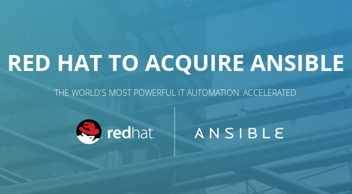
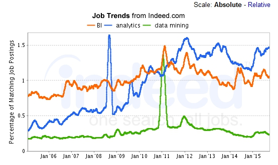
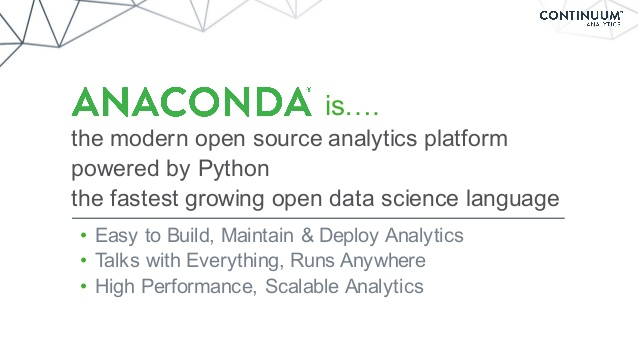
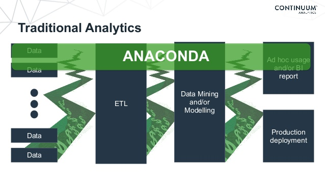
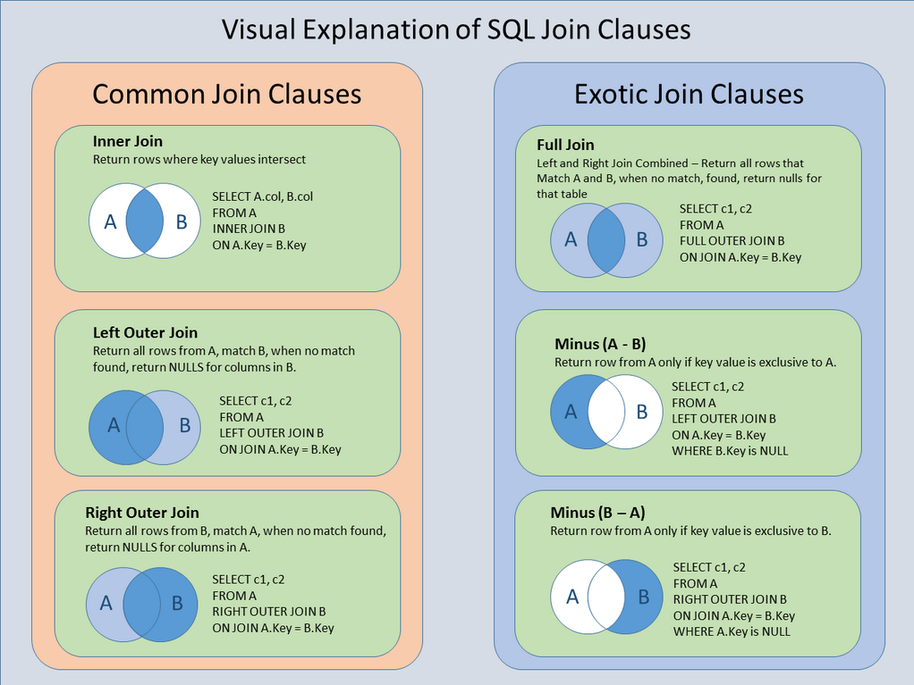

# Awesome Tech 

**Table of Contents**  
<!-- MarkdownTOC -->

- [High quality tech resources and search engines](#high-quality-tech-resources-and-search-engines)
	- [Zeef.com: Find and share quality development/tech resources](#zeefcom-find-and-share-quality-developmenttech-resources)
	- [Awesome List. Awesome AWS](#awesome-list-awesome-aws)
	- [stackshare.io: Discover and discuss the best software tools and services](#stackshareio-discover-and-discuss-the-best-software-tools-and-services)
- [Startups](#startups)
	- [Startup related links](#startup-related-links)
	- [Startup jobs](#startup-jobs)
- [Scalability and Reliability](#scalability-and-reliability)
	- [Scalability Solutions](#scalability-solutions)
	- [Data Center Blogs](#data-center-blogs)
- [Linux](#linux)
	- [Linux Blogs and Forums](#linux-blogs-and-forums)
	- [Linux Docs and Resources](#linux-docs-and-resources)
- [Red Hat](#red-hat)
	- [Red Hat Blogs and Forums](#red-hat-blogs-and-forums)
	- [Red Hat Docs](#red-hat-docs)
	- [Red Hat Virtualization](#red-hat-virtualization)
	- [Red Hat OpenShift PaaS](#red-hat-openshift-paas)
	- [Red Hat Mobile Application Platform: Feed Henry](#red-hat-mobile-application-platform-feed-henry)
	- [JBoss (WildFly)](#jboss-wildfly)
		- [JBoss Blogs](#jboss-blogs)
		- [JBoss GateIn, Exo, Forge, Forums, Developer Studio, Arquillian, and others](#jboss-gatein-exo-forge-forums-developer-studio-arquillian-and-others)
		- [JBoss Resources](#jboss-resources)
		- [JBoss BPM Suite and JBoss BRMS](#jboss-bpm-suite-and-jboss-brms)
		- [JBoss Fuse - Enterprise Service Bus (ESB)](#jboss-fuse---enterprise-service-bus-esb)
		- [JBoss Data Virtualization](#jboss-data-virtualization)
		- [JBoss Data Grid](#jboss-data-grid)
	- [Red Hat Development](#red-hat-development)
	- [Red Hat Videos](#red-hat-videos)
- [Microsoft](#microsoft)
	- [Microsoft Monitoring and Management](#microsoft-monitoring-and-management)
- [WebApp](#webapp)
	- [HTTP/2](#http2)
	- [Enterprise Search Platforms](#enterprise-search-platforms)
	- [Apache and Tomcat](#apache-and-tomcat)
	- [Nginx](#nginx)
	- [WebLogic](#weblogic)
		- [Oracle Blogs: Middleware and Java](#oracle-blogs-middleware-and-java)
		- [WebLogic Resources](#weblogic-resources)
	- [JVM Latency: Caching, Off Heap, Data Grid](#jvm-latency-caching-off-heap-data-grid)
		- [Java Garbage Collection: Changes in Java 8. JMX monitoring](#java-garbage-collection-changes-in-java-8-jmx-monitoring)
	- [E-Mail](#e-mail)
- [Security](#security)
	- [Security Blogs](#security-blogs)
	- [Security Toolkits](#security-toolkits)
	- [Identity Management](#identity-management)
	- [Application Security: Web App Firewall. Blocking bots](#application-security-web-app-firewall-blocking-bots)
	- [Breaking Firewalls](#breaking-firewalls)
	- [Major security issues and blogs](#major-security-issues-and-blogs)
- [Configuration Management and orchestration](#configuration-management-and-orchestration)
	- [Vagrant](#vagrant)
	- [Ansible](#ansible)
		- [Is ansible replacing puppet?](#is-ansible-replacing-puppet)
		- [Apache via Ansible](#apache-via-ansible)
		- [WebLogic via Ansible](#weblogic-via-ansible)
		- [Databases via Ansible](#databases-via-ansible)
			- [MySQL via Ansible](#mysql-via-ansible)
			- [PostgreSQL via Ansible](#postgresql-via-ansible)
			- [Oracle via Ansible](#oracle-via-ansible)
	- [Puppet](#puppet)
		- [WebLogic via Puppet](#weblogic-via-puppet)
	- [Provisioning: Red Hat Satellite, Katello, Foreman, Cobbler and others](#provisioning-red-hat-satellite-katello-foreman-cobbler-and-others)
	- [Chef and SAP](#chef-and-sap)
	- [Docker](#docker)
		- [Microservices](#microservices)
		- [Docker references](#docker-references)
		- [MySQL via Docker](#mysql-via-docker)
		- [WebLogic via Docker](#weblogic-via-docker)
- [DevOps](#devops)
	- [DevOps Blogs](#devops-blogs)
	- [Description](#description)
	- [DevOps Tools 2016](#devops-tools-2016)
	- [Agile planning: Scrum, Kanban, Lean](#agile-planning-scrum-kanban-lean)
		- [Continuous Integration and Delivery](#continuous-integration-and-delivery)
			- [CI Jenkins, Travis](#ci-jenkins-travis)
			- [CI Docker](#ci-docker)
			- [CI RPM build](#ci-rpm-build)
			- [CI Maven and Gradle](#ci-maven-and-gradle)
	- [Git](#git)
		- [Git clients](#git-clients)
	- [Load Testing - Traffic injectors](#load-testing---traffic-injectors)
		- [JMeter](#jmeter)
		- [Alternatives](#alternatives)
	- [Metric monitoring](#metric-monitoring)
		- [Tools](#tools)
		- [Monitoring of JavaEE applications](#monitoring-of-javaee-applications)
		- [Monitoring Network Bandwidth](#monitoring-network-bandwidth)
		- [APM: Application Performance Management](#apm-application-performance-management)
			- [APM Blogs](#apm-blogs)
			- [APM Solutions](#apm-solutions)
		- [Centralized logging. Big Data Log Management Tools](#centralized-logging-big-data-log-management-tools)
- [ITIL](#itil)
	- [Is DevOps replacing ITIL?](#is-devops-replacing-itil)
	- [ITIL Tools](#itil-tools)
- [Software Development. Programming languages](#software-development-programming-languages)
	- [Blogs and Forums](#blogs-and-forums)
	- [Domain driven design](#domain-driven-design)
	- [API and Documentation Generators](#api-and-documentation-generators)
	- [Editors](#editors)
		- [Sublime](#sublime)
			- [Sublime Blogs](#sublime-blogs)
			- [Setting up Sublime](#setting-up-sublime)
			- [Sublime Git](#sublime-git)
		- [Alternative editors](#alternative-editors)
		- [Diff Tools](#diff-tools)
	- [Regular expressions](#regular-expressions)
	- [Bash](#bash)
	- [Python](#python)
		- [Python Blogs and Forums](#python-blogs-and-forums)
		- [Python docs](#python-docs)
	- [Python and AWS](#python-and-aws)
	- [Java](#java)
	- [Front-end: HTML5, javascript/node.js](#front-end-html5-javascriptnodejs)
		- [JSON](#json)
	- [QA. Software Testing](#qa-software-testing)
- [Data Science](#data-science)
	- [Data collection and processing is growing in sports](#data-collection-and-processing-is-growing-in-sports)
	- [Python analytics](#python-analytics)
		- [Anaconda Analytics](#anaconda-analytics)
			- [Anaconda Code examples](#anaconda-code-examples)
		- [Apache Zeppelin](#apache-zeppelin)
	- [Big Data](#big-data)
		- [Big Data Blogs](#big-data-blogs)
		- [Spark](#spark)
	- [SQL](#sql)
		- [SQL Blogs and Forums](#sql-blogs-and-forums)
		- [SQL Docs](#sql-docs)
		- [SQL replication](#sql-replication)
		- [NoSQL](#nosql)
			- [MongoDB Tools and MongoDB as a Service](#mongodb-tools-and-mongodb-as-a-service)
			- [Redis, Coudhdb, and others](#redis-coudhdb-and-others)
			- [Schema free SQL query on everything engines](#schema-free-sql-query-on-everything-engines)
		- [NewSQL](#newsql)
- [Networking](#networking)
	- [Next Generation Firewalls](#next-generation-firewalls)
	- [Network virtualization](#network-virtualization)
	- [Network Forensics](#network-forensics)
		- [Network Forensics Blogs](#network-forensics-blogs)
		- [Network Forensics Docs](#network-forensics-docs)
	- [VoIP](#voip)
	- [WiFi security](#wifi-security)
	- [WebPerf and Resilient Networking: Planning for Failure](#webperf-and-resilient-networking-planning-for-failure)
- [Servers, Storage and Backup](#servers-storage-and-backup)
	- [Dell](#dell)
	- [HP](#hp)
	- [RAID disks](#raid-disks)
	- [Remote PC Access](#remote-pc-access)
	- [Storage](#storage)
	- [Backup](#backup)
- [Cloud](#cloud)
	- [The Twelve-Factor App methodology for building apps in modern cloud environments](#the-twelve-factor-app-methodology-for-building-apps-in-modern-cloud-environments)
	- [Development environments in the Cloud](#development-environments-in-the-cloud)
	- [Cloud references](#cloud-references)
	- [Cloud Pricing](#cloud-pricing)
	- [Awesome AWS](#awesome-aws)
	- [AWS re:Invent 2015](#aws-reinvent-2015)
	- [AWS Official Blog, AWS Labs, AWS Quick Start](#aws-official-blog-aws-labs-aws-quick-start)
		- [AWS New features](#aws-new-features)
		- [AWS DevOps](#aws-devops)
			- [AWS Cloud Formation](#aws-cloud-formation)
		- [AWS Security](#aws-security)
	- [AWS Partner Network (APN)](#aws-partner-network-apn)
	- [AWS Startup Collection. For startups building on AWS](#aws-startup-collection-for-startups-building-on-aws)
- [Desktop Tools](#desktop-tools)
- [E-Learning](#e-learning)
	- [Udemy. Lifetime access with no subscription. Drop the price of any Udemy Course to 11 or 12 euro with a Coupon Code](#udemy-lifetime-access-with-no-subscription-drop-the-price-of-any-udemy-course-to-11-or-12-euro-with-a-coupon-code)
	- [Free e-learning](#free-e-learning)
	- [Alternatives](#alternatives-1)

<!-- /MarkdownTOC -->

# High quality tech resources and search engines

## Zeef.com: Find and share quality development/tech resources
- [Zeef.com](https://zeef.com)
- [agile.zeef.com](https://agile.zeef.com)
- [sublime-text.zeef.com](https://sublime-text.zeef.com)
- [git.zeef.com](https://git.zeef.com)
- [web-tools.zeef.com](https://web-tools.zeef.com)
- [wordpress.zeef.com](https://wordpress.zeef.com)
- [web-publishing.zeef.com](https://web-publishing.zeef.com)
- [security.zeef.com](https://security.zeef.com)
- [selinux.zeef.com](https://selinux.zeef.com)
- [malware.zeef.com](https://malware.zeef.com)
- [penetration-testing.zeef.com)](https://penetration-testing.zeef.com)
- [mobile-app-testing.zeef.com](https://mobile-app-testing.zeef.com)
- [ab-testing.zeef.com](https://ab-testing.zeef.com)
- [databases.zeef.com](https://databases.zeef.com)
- [nosql.zeef.com](https://nosql.zeef.com)
- [docker.zeef.com](https://docker.zeef.com)
- [linux.zeef.com](https://linux.zeef.com)
- [linux-for-administrators.zeef.com](https://linux-for-administrators.zeef.com)
- [open-source-networking.zeef.com](https://open-source-networking.zeef.com)
- [virtualization.zeef.com](https://virtualization.zeef.com)
- [devops.zeef.com](https://devops.zeef.com)
- [dev-ops-tools.zeef.com](https://dev-ops-tools.zeef.com)
- [data-stack.zeef.com](https://data-stack.zeef.com)
- [continuous-integration.zeef.com](https://continuous-integration.zeef.com)
- [python.zeef.com](https://python.zeef.com)
- [python-tutorials.zeef.com](https://python-tutorials.zeef.com)
- [unix-shell.zeef.com](https://unix-shell.zeef.com)
- [html.zeef.com](https://html.zeef.com)
- [javaee8.zeef.com](https://javaee8.zeef.com)
- [nodejs.zeef.com](https://nodejs.zeef.com)
- [free-programming-books.zeef.com](https://free-programming-books.zeef.com)
- [programming.zeef.com](https://programming.zeef.com)
- [frontend.zeef.com](https://frontend.zeef.com)
- [apps-and-tools.zeef.com](https://apps-and-tools.zeef.com)
- [data-science.zeef.com](https://data-science.zeef.com)
- [big-data.zeef.com](https://big-data.zeef.com)
- [data-visualization.zeef.com](https://data-visualization.zeef.com)
- [datapyr.zeef.com](https://datapyr.zeef.com)
- [apache-spark.zeef.com](https://apache-spark.zeef.com)
- [cloud.zeef.com](https://cloud.zeef.com)
- [online-collaboration-tools.zeef.com](https://online-collaboration-tools.zeef.com)
- [digital-marketing.zeef.com](https://digital-marketing.zeef.com)
- [email-marketing.zeef.com](https://email-marketing.zeef.com)
- [bitcoin.zeef.com](https://bitcoin.zeef.com)
- [startup.zeef.com](https://startup.zeef.com/)
- etc

## Awesome List. Awesome AWS
- [Awesome List - A curated list of awesome lists](https://github.com/sindresorhus/awesome)
- [Awesome AWS](https://github.com/donnemartin/awesome-aws)

## stackshare.io: Discover and discuss the best software tools and services
- [stackshare.io](http://stackshare.io/)
	- [whatsnew.com - stackshare.io - para saber la tecnología que usan las grandes empresas de Internet](http://wwwhatsnew.com/2014/11/07/stackshare-para-saber-la-tecnologia-que-usan-las-grandes-empresas-de-internet/)
- [Amazon ECS vs Joyent Triton Elastic Container Infrastructure](http://stackshare.io/convox/amazon-ecs-vs-joyent-triton)
	- [Joyent Triton Elastic Container Infrastructure](https://www.joyent.com/)
	- [Microservices stack in seconds: Node.js + Docker + NoSQL](https://www.joyent.com/blog/how-to-dockerize-a-complete-application)

# Startups
[La economía crece](mkeiser.md)

## Startup related links
- [Startupxplore, map with all the IT startups and investors](https://startupxplore.com/)
- [European Startup Initiative](http://www.startupheatmap.eu/)
- [Barcelona vs Madrid vs everywhere else: Spain's regions slug it out to be named startup capital](http://www.zdnet.com/article/barcelona-vs-madrid-vs-everywhere-else-spains-regions-slug-it-out-to-be-startup-capital/)
- [Glassdoor.com: Best Places to Work in 2016!](https://www.glassdoor.com/Best-Places-to-Work-LST_KQ0,19.htm)
- [startup.zeef.com](https://startup.zeef.com/)

## Startup jobs
- [AngelList jobs](https://angel.co)
	- [AngelList jobs Barcelona](https://angel.co/barcelona)
	- [AngelList Jobs Madrid](https://angel.co/barcelona)
	- [AngelList Jobs Valencia](https://angel.co/valencia)
	- [AngelList Jobs Bilbao](https://angel.co/bilbao)
	- [AngelList Jobs Sevilla](https://angel.co/sevilla)
	- [AngelList Jobs Malaga](https://angel.co/malaga)
- [Jobs BCN, All Startup Jobs in Barcelona](http://www.jobsbcn.com/)
- [techstartupjobs.com](http://www.techstartupjobs.com/)
- [tyba startup jobs](http://tyba.com/)

# Scalability and Reliability
- [Scalable Internet Architectures" slides - Theo Schlossnagle how to build scalable production Internet services and... how not to build them](http://lethargy.org/~jesus/misc/Scalable%20Ti.pdf)
	- ["Scalable Internet Architectures" book - Theo Schlossnagle](http://scalableinternetarchitectures.com/)
	- [video: Scalable Internet Architectures - Theo Schlossnagle](https://www.youtube.com/watch?v=2WuT2rdLK5A)
- [slides: Scalable Web Architectures: Common Patterns and Approaches](http://es.slideshare.net/techdude/scalable-web-architectures-common-patterns-and-approaches)
- [highscalability.com](http://highscalability.com/)
- [video: Making Architecture Matter - Martin Fowler Keynote](https://www.youtube.com/watch?v=DngAZyWMGR0)
- [book: Building Scalable Web Sites - Cal Henderson](http://shop.oreilly.com/product/9780596102357.do)
- [book: Site Reliability Engineering. How Google Runs Production Systems - 2016](http://shop.oreilly.com/product/0636920041528.do)

## Scalability Solutions
- [OpenShift Dedicated](https://www.openshift.com/dedicated/)
- [OpenStack](http://www.openstack.org/)
- [Apache Mesos](http://mesos.apache.org/)
- [Kubernetes.io](http://kubernetes.io/)
	- [Kubernetes repo analyzed with gitm. Top changeset contributors by employer](https://github.com/karlkfi/kubernetes-gitdm/wiki#top-changeset-contributors-by-employer)
- [Univa Grid Engine](http://www.univa.com/)

## Data Center Blogs
- [Data Center Knowledge](http://www.datacenterknowledge.com/)

# Linux
## Linux Blogs and Forums
- [Tecmint.com Linux Howto's Guide](http://www.tecmint.com/)
- [Sysadmincasts.com](http://sysadmincasts.com)
- [Linuxadmin 'subreddit'](https://www.reddit.com/r/linuxadmin)
- [opensource.com](https://opensource.com/)
- [Linux.com](http://www.linux.com/)
- [The Linux Foundation](http://www.linuxfoundation.org/)
- [nixCraft/cyberciti.biz: Linux Tips, Hacks, Tutorials, And Ideas In Blog](http://www.cyberciti.biz/)
- [LinuxJournal](http://www.linuxjournal.com)
- [Xmodulo - Linux FAQs, tips and tutorials](http://xmodulo.com)
- [MyLinuxSoftware.com: A Linux Software Directory for GUI and Console Apps](http://www.mylinuxsoftware.com/)
- [unixetc.co.uk](http://unixetc.co.uk/)
- [LWN.net](http://lwn.net/)
- [Linux-tutorial.info](http://www.linux-tutorial.info/)
- [The Lone Sysadmin](https://lonesysadmin.net/)
- [systemadmin.es](http://systemadmin.es/)
	- [muylinux.com](http://www.muylinux.com/)
- [cathcam.wordpress.com - blogger](https://cathcam.wordpress.com/)

## Linux Docs and Resources
- [7 Steps to Start Your Linux SysAdmin Career](https://www.linux.com/news/featured-blogs/191-linux-training/834644-7-steps-to-start-your-linux-sysadmin-career)
- [Linux / Unix pv Command: Monitor Progress of Data Sent Via a Pipe](http://www.cyberciti.biz/open-source/command-line-hacks/pv-command-examples/)
- [Slow System? iotop Is Your Friend](http://www.linuxjournal.com/content/slow-system-iotop-your-friend)
- [Linux and Unix Port Scanning With netcat 'nc' Command](http://www.cyberciti.biz/faq/linux-port-scanning/)
- [Sysadmincasts.com: LVM Linear vs Striped Logical Volumes](https://sysadmincasts.com/episodes/27-lvm-linear-vs-striped-logical-volumes)
- [unixetc.co.uk: Profiling and Tracing Processes in Linux](http://unixetc.co.uk/2012/10/28/profiling-and-tracing-processes-in-linux/)
- [vim graphical cheat sheet](http://www.viemu.com/vi-vim-cheat-sheet.gif)
- [conn-check, a deployment utility to check connectivity between services](http://conn-check.org/)
- [Linux: Keep An Eye On Your System With Glances Monitor](http://www.cyberciti.biz/faq/linux-install-glances-monitoring-tool/)
- [mylinuxsoftware.com: Linux Monitoring Software](http://www.mylinuxsoftware.com/linux_monitoring_software.html)
- [What are useful command-line network monitors on Linux](http://xmodulo.com/useful-command-line-network-monitors-linux.html)
- [GoAccess real time web log analyzer](http://goaccess.io/)
- [awesome-sysadmin - A curated list of amazingly awesome open source sysadmin resources inspired by Awesome PHP](https://github.com/kahun/awesome-sysadmin)

# Red Hat
## Red Hat Blogs and Forums
- [RedHat "subreddit"](https://www.reddit.com/r/redhat/)
- [Red Hat Enterprise Linux Blog](http://rhelblog.redhat.com/)
- [Red Hat Community](http://community.redhat.com)
- [Red Hat Cloud Strategy Blog](http://www.redhat-cloudstrategy.com/)
- [OpenShift Blog](https://blog.openshift.com)
- [Red Hat Stack | An OpenStack Blog](http://redhatstackblog.redhat.com/)
- [ossmentor.com](http://www.ossmentor.com)
- [Fedora Magazine](http://fedoramagazine.org/)
- [Red Hat Developer Blog](http://developerblog.redhat.com)
- [Red Hat Developers](http://developers.redhat.com)
- [Planet JBoss Developer](http://planet.jboss.org/)

## Red Hat Docs
- [Red Hat Enterprise Linux 5, 6, and 7.Common administrative commands](https://access.redhat.com/sites/default/files/attachments/rhel_5_6_7_cheatsheet_a4_1114_jcs.pdf)
	- [A big step forward in business Linux: Red Hat Enterprise Linux 7 arrives](http://www.zdnet.com/article/a-big-step-forward-in-business-linux-red-hat-enterprise-linux-7-arrives/)
- [Product documentation](https://access.redhat.com/documentation/en/)
- [Fedora 23 released - Fedora Magazine](http://fedoramagazine.org/fedora-23-released/)
	- [Fedora 23: An Impressive Release for Advanced Linux Users](https://www.linux.com/news/software/applications/868617-fedora-23-an-impressive-release-for-advanced-linux-users/)

## Red Hat Virtualization
- [How to Install RedHat Enterprise Virtualization (RHEV) 3.5](http://www.tecmint.com/install-redhat-virtualization-rhev/)
	- [Open source Virtualization by Quru, the fastest-growing Red Hat solution provider based in London](https://youtu.be/F2lxJTdfVy8)
	- [How to Create Virtual Machines in Linux Using KVM (Kernel-based Virtual Machine)](http://www.tecmint.com/install-and-configure-kvm-in-linux/)
- [Up and Running with oVirt 3.5](http://community.redhat.com/blog/2014/10/up-and-running-with-ovirt-3-5/)
	- [Up and Running with oVirt 3.5, Part Two](http://community.redhat.com/blog/2014/11/up-and-running-with-ovirt-3-5-part-two/)
- [GlusterFS scalable network filesystem](http://www.gluster.org/)
	- [GlusterFS Documentation](http://gluster.readthedocs.org/en/latest/)

## Red Hat OpenShift PaaS
- [OpenShift Dedicated, a new Amazon-based option for deploying its open source PaaS applications platform, with the aid of Google’s Kubernetes](http://www.cmswire.com/information-management/red-hat-bids-to-drive-openshift-deeper-into-enterprises/)
	- [OpenShift Dedicated](https://www.openshift.com/dedicated/)
	- [Red Hat OpenShift 3.1 Opens the Door for Both .NET and JBoss Middleware](http://thenewstack.io/openshift-3-1-opens-door-net-jboss-middleware/)
	- [Red Hat quiere que su canal se vuelque en middleware y cloud](http://www.channelpartner.es/oportunidades-negocio/noticias/1079121002302/red-hat-quiere-canal-vuelque-middleware-cloud.1.html)
- [Red Hat announces availability of containerized middleware capabilities on OpenShift](http://www.redhat.com/en/about/blog/red-hat-announces-availability-containerized-middleware-capabilities-openshift)
	- [zdnet.com: Containers, OpenShift, and Middleware](http://www.zdnet.com/article/containers-openshift-and-middleware/)

## Red Hat Mobile Application Platform: Feed Henry
- [Feed Henry](http://feedhenry.org/)
- [Open sourcing Red Hat Mobile Application Platform – Unified Push Server](http://developerblog.redhat.com/2015/12/16/open-sourcing-red-hat-mobile-application-platform-unified-push-server)

## JBoss (WildFly)
- [List of JBoss software](https://en.wikipedia.org/wiki/List_of_JBoss_software)
- [Product Documentation for JBoss Enterprise Application Platform](https://access.redhat.com/documentation/en/jboss-enterprise-application-platform/)
- [WildFly 10 ebook - Francesco Marchioni](http://www.itbuzzpress.com/ebooks/wildfly-10-ebook.html)

### JBoss Blogs
- [docs.jboss.org](http://docs.jboss.org )
- [community.jboss.org](https://community.jboss.org )
- [JBoss Developer](https://developer.jboss.org/)
- [JBoss Issue Tracker](https://issues.jboss.org)
- [middlewaresnippets.blogspot.com](http://middlewaresnippets.blogspot.com)
- [developerblog.redhat.com - JBoss](http://developerblog.redhat.com/tag/jboss/)
- [schabell.org - Eric D. Schabell's blog](http://www.schabell.org)
- [JBoss Tutotials - JBoss training courses](http://www.mastertheboss.com/)

### JBoss GateIn, Exo, Forge, Forums, Developer Studio, Arquillian, and others
- [JBoss GateIn Portal](http://gatein.jboss.org/)
- [JBoss eXo Platform Enterprise Social collaboration software](https://www.exoplatform.com)
- [JBoss Forge to build Maven-based Java EE projects](http://forge.jboss.org/)
- [JBoss Forums](http://jbossforums.jboss.org/)
- [JBoss Developer Studio](https://www.jboss.org/products/devstudio/overview/)
- [Arquillian, a testing platform built on the JVM that substantially reduces the effort required to write and execute Java middleware integration and functional tests](http://arquillian.org/)

### JBoss Resources
- [middlewaresnippets.blogspot.com - WildFlying Java EE 7](http://middlewaresnippets.blogspot.com/2014/07/wildflying-java-ee-7.html)
- [developerblog.redhat.com - JBoss on Docker At a Glance](http://developerblog.redhat.com/2015/01/14/jboss-on-docker-at-a-glance/)
- [blog.openshift.com: A Java EE 7 Application on OpenShift 3 With JBoss Tools](https://blog.openshift.com/a-java-ee-7-application-on-openshift-3-with-jboss-tools/)
- [C2B2Consulting - JBoss EAP 6: installation, configuration & clustering](http://www.c2b2.co.uk/introduction_to_jboss_eap_6_webinar)
- [dzone.com - Red Hat JBoss Fuse Workshop 101: Fuse in EAP](https://dzone.com/articles/red-hat-jboss-fuse-workshop-101-fuse-in-eap)
- [youtube - 2014 Red Hat Summit: Red Hat JBoss Middleware keynote](https://youtu.be/XPK2RTqlBxk)
- [youtube - Craig Muzilla delivers middleware keynote at 2015 Red Hat Summit](https://youtu.be/wWNVpFibayA)

### JBoss BPM Suite and JBoss BRMS
- [Red Hat Updates JBoss BPM Suite and JBoss BRMS Products](http://www.redhat.com/de/about/blog/red-hat-updates-jboss-bpm-suite-and-jboss-brms-products)
- [schabell.org: The ultimate collection of JBoss BPM Suite demos](http://www.schabell.org/2015/12/ultimate-collection-jboss-bpmsuite-demos.html)
- [schabell.org: Quick Tour #4 Start your first JBoss BRMS project (video)](http://www.schabell.org/2015/12/quick-tour-4-first-brms-project.html)

### JBoss Fuse - Enterprise Service Bus (ESB)
- [JBoss Fuse Description](http://www.jboss.org/products/fuse/overview/)
- [planet.jboss.org - JBoss Developer - Red Hat JBoss Fuse - Integrating Database, Java Bean and Restful Services in EAP, Spring DSL](http://planet.jboss.org/post/red_hat_jboss_fuse_integrating_database_java_bean_and_restful_services_in_eap_spring_dsl)

### JBoss Data Virtualization
- [ossmentor.com - JBoss Data Virtualization 6.1](http://www.ossmentor.com/2015/04/data-virtualization-61-getting-started.html)

### JBoss Data Grid
- [JBoss Data Grid description. ](http://www.jboss.org/products/datagrid/overview/)JBoss Data Grid is an in-memory, distributed, NoSQL data store that helps boost application performance and improve scalability and development flexibility.
- [C2B2Consulting - JBoss Data Grid](http://www.c2b2.co.uk/jboss_data_grid)
	- [C2B2Consulting - JBoss Data Grid: Webinar](http://www.c2b2.co.uk/jboss_data_grid_webinar_part_1)
	- [C2B2Consulting - JBoss Data Grid: Installation and Development](http://blog.c2b2.co.uk/2014/03/jboss-data-grids-installation-and.html)
	- [C2B2Consulting - Youtube - Learn How to Supercharge Your Applications with Intelligent, Distributed Caching](https://youtu.be/q52_C9WW70Q)

## Red Hat Development
- [developerblog.redhat.com: 2015 Year in Review – oh what a year](http://developerblog.redhat.com/2015/12/14/2015-year-in-review-oh-what-a-year/)
	- [Our 5 most popular developer posts in 2014](http://developerblog.redhat.com/2014/12/31/5-most-popular-posts-2014/)
	- [Red Hat Software Collections 2.1 now generally available](http://developerblog.redhat.com/2015/11/17/software-collections-2-1-generally-available/)
	- [Red Hat developers blog, an Enterprise Developer’s Journey to the IoT](http://developerblog.redhat.com/2015/12/02/enterprise-developers-journey-to-iot/)
- [developers.redhat.com: So, what are containers??](http://developers.redhat.com/containers/overview/)
- [How to use Red Hat Software Collections (RHSCL) or Red Hat Developer Toolset (DTS)?](https://access.redhat.com/solutions/472793)
	- [Reddit: Red Hat Software Collections (SCL) is not provided with RHEL Server/Workstation, Self Support](https://www.reddit.com/r/redhat/comments/39kk0s/red_hat_software_collections_scl_is_not_provided/)
- [pyvideo.org - Red Hat Loves Python (EuroPython 2014)](http://pyvideo.org/video/2962/red-hat-loves-python)

## Red Hat Videos
- [Red Hat Developers at Devoxx 2015](http://developers.redhat.com/events/devoxx/2015/)
- [youtube - Red Hat Summit](https://www.youtube.com/user/redhatsummit)
- [Flock Fedora Conference](https://fedoramagazine.org/tag/flock/)
	- [Flock 2014 Fedora Conference](http://community.redhat.com/blog/2014/08/flock-2014-fedora-conference-live-streaming-schedule-and-video-archives/)
	- [Flock 2015 Fedora Conference](https://www.youtube.com/playlist?list=PL0x39xti0_64fA6uRtcfoJPkHfZdeVTRC)

# Microsoft
- [SSH for Windows open sourced by Microsoft. Qué está pasando?](https://github.com/PowerShell/Win32-OpenSSH)
- [Microsoft open sources its Visual Studio Code light-weight editor](http://www.zdnet.com/article/microsoft-open-sources-its-visual-studio-code-light-weight-editor/)
- [Microsoft has released over 100 Free Ebooks](http://blogs.msdn.com/b/mssmallbiz/archive/2014/07/07/largest-collection-of-free-microsoft-ebooks-ever-including-windows-8-1-windows-8-windows-7-office-2013-office-365-office-2010-sharepoint-2013-dynamics-crm-powershell-exchange-server-lync-2013-system-center-azure-cloud-sql.aspx)
- [Windows Migration Best Practices and Resources from Dell & Microsoft](http://www.migrationexpertzone.com/)
- [PowerShell Magazine](http://www.powershellmagazine.com/)
- [PowerShell.org](http://powershell.org)

## Microsoft Monitoring and Management
- [Spiceworks](http://www.spiceworks.com/)
	- [Spiceworks Overview,inventory & helpdesk](https://www.youtube.com/watch?v=kHnEXoPxiJ4)
	- [Spiceworks Profiles are Better Than a Resume for IT Geeks - Daily Blob - Dec 23, 2013](https://www.youtube.com/watch?v=BJ2mQpOZHPE)
- [Unofficial Spiceworks. Spiceworks news and reviews from the underground...](http://www.unofficialspiceworks.com/)

# WebApp
## HTTP/2
- [SPDY & HTTP 2 with Akamai CTO Guy Podjarny](https://www.youtube.com/watch?v=WkLBrHW4NhQ)
	- [http2.github.io HTTP/2](https://http2.github.io)
	- [http2.github.io HTTP/2 Frequently Asked Questions](https://http2.github.io/faq/)
	- [HTTP/2 resources](https://pinboard.in/u:rmurphey/t:http2/)
	- [A Simple Performance Comparison of HTTPS, SPDY and HTTP/2](https://blog.httpwatch.com/2015/01/16/a-simple-performance-comparison-of-https-spdy-and-http2/comment-page-1/)
	- [blog.cloudflare.com - Tools for debugging, testing and using HTTP/2](https://blog.cloudflare.com/tools-for-debugging-testing-and-using-http-2/)
	- [blog.cloudflare.com - HTTP/2 For Web Developers](https://blog.cloudflare.com/http-2-for-web-developers/)
- [HTTP/2 With JBoss EAP 7 - Tech Preview](http://blog.eisele.net/2015/11/http2-with-jboss-eap-7.html)
	- [Dzone - HTTP/2 With JBoss EAP 7: Tech Preview](https://dzone.com/articles/http2-with-jboss-eap-7-tech-preview)
- [5 Tips to Boost the Performance of Your Apache Web Server](http://www.tecmint.com/apache-performance-tuning/)
- [Enabling HTTPS Without Sacrificing Your Web Performance](http://moz.com/blog/enabling-https-without-sacrificing-web-performance)
	- [As sites move to SHA2 encryption, millions face HTTPS lock-out | ZDNet](http://www.zdnet.com/article/as-sha1-winds-down-sha2-leap-will-leave-millions-stranded/)
	- [Microsoft may block SHA1 certificates sooner than expected](http://www.zdnet.com/article/as-attacks-near-microsoft-mulls-banning-sha1-certificates/)

## Enterprise Search Platforms
- [Apache Solr vs ElasticSearch](http://solr-vs-elasticsearch.com/)

## Apache and Tomcat
- [5 Tips to Boost the Performance of Your Apache Web Server](http://www.tecmint.com/apache-performance-tuning/)
- [How to set up a cluster with Tomcat 8, Apache and mod_jk.Tomcat Performance Monitoring and Tuning](http://blog.c2b2.co.uk/2014/05/tomcat-performance-monitoring-and-tuning.html)
- [middlewaresnippets.blogspot.com - Working with Apache HTTP Server](http://middlewaresnippets.blogspot.com/2015/05/working-with-apache-http-server.html)
	- [middlewaresnippets.blogspot.com - Working some more with Apache HTTP Server](http://middlewaresnippets.blogspot.com/2015/09/working-some-more-with-apache-http.html)

## Nginx
- [How to Setup Name-based and IP-based Virtual Hosts (Server Blocks) with NGINX](http://www.tecmint.com/nginx-name-based-and-ip-based-virtual-hosts-server-blocks/)
- [TCP Load Balancing in NGINX Plus r5 - NGINX](http://nginx.com/blog/tcp-load-balancing-in-nginx-plus-r5/)
- [Nginxconf 2014. When Dynamic Becomes Static:The Next Step in Web Caching Techniques: Wim Godden](https://www.youtube.com/watch?v=OssIuHbgzJY)

## WebLogic
### Oracle Blogs: Middleware and Java
- [Oracle Middleware Blog](http://oraclemiddlewareblog.com/)
- [oraclejavamagazine-digital.com - Java Magazine](http://www.oraclejavamagazine-digital.com)
- [javacodegeeks.com](http://www.javacodegeeks.com/)
- [Oracle Community](https://community.oracle.com)
	- [Oracle Community - WebLogic](https://community.oracle.com/community/fusion_middleware/weblogic)
- [middlewaresnippets.blogspot.com](http://middlewaresnippets.blogspot.com)
- [multikoop.blogspot.com - Practical experience on Oracle products. WebLogic, ADF, MAF, SOA, WebCenter, JDeveloper, Oracle Cloud](http://multikoop.blogspot.com)
	- [multikoop.blogspot.com - WebLogic](http://multikoop.blogspot.com/search/label/weblogic)
- [avanttic blog](http://blog.avanttic.com/)
	- [avanttic blog - weblogic](http://blog.avanttic.com/tag/weblogic/)

### WebLogic Resources
- [WebLogic 12c Enterprise Deployment Architecture in the Amazon Cloud](http://oraclemiddlewareblog.com/2015/10/13/weblogic12c-architecture-in-the-amazon-cloud/)
- [SlideShare - 12 Things You Should Know About WebLogic Server 12.2.1](http://www.slideshare.net/FrankMunz1/12-things-you-should-know-about-weblogic-server-1221-oow2015)
- [middlewaresnippets.blogspot.com - WebLogic Server on Linux 7](http://middlewaresnippets.blogspot.com/2015/04/weblogic-server-on-linux-7.html)
	- [middlewaresnippets.blogspot.com - WebLogic Domain Partitioning](http://middlewaresnippets.blogspot.com/2015/11/weblogic-domain-partitioning.html)
	- [middlewaresnippets.blogspot.com - Monitoring Domain Partitions](http://middlewaresnippets.blogspot.com/2015/11/monitoring-domain-partitions.html)
	- [middlewaresnippets.blogspot.com - Deploying Applications to Domain Partitions](http://middlewaresnippets.blogspot.com/2015/11/deploying-applications-to-domain.html)
	- [middlewaresnippets.blogspot.com - Security Recovery - LDAP server](http://middlewaresnippets.blogspot.com/2015/07/security-recovery.html)
- [blogs.oracle.com - WLST Scripting to Get WebLogic Libraries and Deployed Applications](https://blogs.oracle.com/practicalbpm/entry/wlst_scripting_to_get_weblogic)
- [Java Serialization Vulnerability Threatens Millions of Applications . Contrast security is promoting their solution for a vulnerability that affects WebLogic, WebSphere, JBoss, Jenkins, and OpenNMS.](https://dzone.com/articles/java-serialization-vulnerability-threatens-million)
- [Oracle WebLogic Server 12c Advanced Administration Cookbook](http://it-ebooks.info/book/3020/)

## JVM Latency: Caching, Off Heap, Data Grid
- [dzone.com - Refcard: Java Caching. JCache and other caching APIs, as well as multiple strategies for implementing temporary data storage in your application](http://bit.ly/1RbGgms)
- [Reminder: JDK 7 will be EOL soon. Oracle won't publish any Public Updates to JDK 7 after April 2015](http://www.oracle.com/technetwork/java/javase/downloads/eol-135779.html)
- [Free eGuide: JVM Troubleshooting Guide](http://freepromagazine.blogspot.de/2014/07/free-eguide-jvm-troubleshooting-guide.html)
- [vogella.com: Java Performance - Memory and Runtime Analysis - Tutorial](http://www.vogella.com/tutorials/JavaPerformance/article.html)
- [On heap vs off heap memory usage](http://www.javacodegeeks.com/2014/12/on-heap-vs-off-heap-memory-usage.html)
- [Dr. Low Latency or: How I Learned to Stop Worrying about Pauses and Love the Memory](http://www.c2b2.co.uk/javazone-2013-low-latency)
- [What is a Data Grid?](http://www.c2b2.co.uk/what_is_data_grid_webinar)

### Java Garbage Collection: Changes in Java 8. JMX monitoring
- [How Garbage Collection differs in the three big JVMs](http://apmblog.dynatrace.com/2011/05/11/how-garbage-collection-differs-in-the-three-big-jvms/)
- [One important change in Memory Management in Java 8](http://karunsubramanian.com/websphere/one-important-change-in-memory-management-in-java-8/)
	- [PermGen removed](http://www.infoq.com/articles/Java-PERMGEN-Removed)
	- [Mi análisis: cambios en la gestión de memoria de Java 8. Diferencias en distintas implementaciones de JVM](jvm-mem.md)
- [middlewaresnippets.blogspot.com - Monitoring with JMX](http://middlewaresnippets.blogspot.com/2014/10/monitoring-with-jmx.html)

## E-Mail
- [Best Transactional Email Service Comparison](http://socialcompare.com/en/comparison/transactional-emailing-providers-mailjet-sendgrid-critsend)
- [Google Improves Gmail’s Spam Filters, Launches New Analytics Tool For Bulk Senders](http://techcrunch.com/2015/07/09/google-improves-gmails-spam-filters-launches-new-analytics-tool-for-bulk-senders/)

# Security
## Security Blogs
- [ehacking.net](http://www.ehacking.net)
- [Sucuri Blog](https://blog.sucuri.net/)

## Security Toolkits
- [Kali Linux | Penetration Testing and Ethical Hacking Linux Distribution](https://www.kali.org/)
- [Network Security Toolkit](http://www.networksecuritytoolkit.org)

## Identity Management
- [rhelblog.redhat.com - Ten New Identity Management (IdM) Features in Red Hat Enterprise Linux 7.1](http://rhelblog.redhat.com/2015/03/25/ten-new-identity-management-idm-features-in-red-hat-enterprise-linux-7-1/)
- [redhat.com - Improvements to Identity Management (IdM) in RHEL 7.1](http://www.redhat.com/en/about/press-releases/red-hat-continues-platform-innovation-general-availability-first-minor-release-red-hat-enterprise-linux-7)
- [Dell Authentication Services](http://software.dell.com/products/authentication-services/)
- [Centrify](https://www.centrify.com/)
- [Employees have no qualms in selling corporate passwords](http://www.csoonline.com/article/2905682/data-breach/employees-have-no-qualms-in-selling-corporate-passwords.html)
- [Are their any valid Active Directory Alternatives?](http://community.spiceworks.com/topic/689453-are-their-any-valid-active-directory-alternatives)
- [Active Directory Single Sign-On (SSO) on AWS with Bitium](https://aws.amazon.com/es/blogs/apn/active-directory-single-sign-on-sso-on-aws-with-bitium)
- [Announcing Managed Microsoft Active Directory in the AWS Cloud](https://aws.amazon.com/es/about-aws/whats-new/2015/12/announcing-managed-microsoft-active-directory-in-the-aws-cloud/)
- [Apache Syncope, Open Source Identity Management software](http://syncope.apache.org/)
- [Apache Shiro is a powerful and easy-to-use Java security framework that performs authentication, authorization, cryptography, and session management](http://shiro.apache.org/)
- [Open source identity management 20121106 - apache con eu](http://www.slideshare.net/ilgrosso/open-source-identity-management-20121106-apache-con-eu)

## Application Security: Web App Firewall. Blocking bots
- [dzone.com - The 2015 DZone Guide to Application Security](http://bit.ly/1RksReA)
- [JBossDeveloper - Theft-Proof Java EE - Securing Your Java EE Enterprise Applications](http://planet.jboss.org/post/theft_proof_java_ee_securing_your_java_ee_enterprise_applications)
- [pyvideo.org: Let's Be Bad Guys: Exploiting and Mitigating the Top 10 Web App Vulnerabilities](http://www.pyvideo.org/video/3512/shiny-lets-be-bad-guys-exploiting-and-mitigati-3)
- [What is Baiduspider?](https://chineseseoshifu.com/blog/what-is-baiduspider.html)
- [Estándar de exclusión de robots](https://es.wikipedia.org/wiki/Est%C3%A1ndar_de_exclusi%C3%B3n_de_robots)
- [Robots Database](http://www.robotstxt.org/db.html)

## Breaking Firewalls
- [Breaking Firewalls with OpenSSH and PuTTY](http://souptonuts.sourceforge.net/sshtips.htm)
- [Punching holes into firewalls. Why firewalls shouldn't be considered a ultimate weapon for network security. Secure TCP-into-HTTP tunnelling guide](http://sebsauvage.net/punching/)

## Major security issues and blogs
- [Digital Attack Map. Top daily DDoS attacks worldwide](http://www.digitalattackmap.com/#anim=1&color=2&country=ALL&list=0&time=16064&view=map)
- [dzone.com - Java Serialization Vulnerability Threatens Millions of Applications . Contrast security is promoting their solution for a vulnerability that affects WebLogic, WebSphere, JBoss, Jenkins, and OpenNMS.](https://dzone.com/articles/java-serialization-vulnerability-threatens-million)
	- [dzone.com - This Java Vulnerability Makes Heartbleed Look Tame.Find out what the big deal is with the Java serialization security flaw that the community is buzzing about](https://dzone.com/articles/point-of-viewwhy-the-java-serialization-vulnerabil)
- [keychain: Set Up Secure Passwordless SSH Access For Backup Scripts](http://www.cyberciti.biz/faq/ssh-passwordless-login-with-keychain-for-scripts/)
- [New High Severity OpenSSL Vulnerabilities Announced: CVE-2015-0291 & CVE-2015-0204](http://www.tripwire.com/state-of-security/vulnerability-management/new-high-severity-openssl-vulnerabilities-announced-cve-2015-0291-cve-2015-0204/)
- [Red Hat security blog: Heartbleed](https://securityblog.redhat.com/tag/heartbleed/)
	- [Fixing Heartbleed with Ansible](http://www.ansible.com/blog/fixing-heartbleed-with-ansible)
- [Patching the GHOST glibc gethostbyname CVE-2015-0235 bug](https://sysadmincasts.com/episodes/44-patching-the-ghost-glibc-gethostbyname-cve-2015-0235-bug)
- [Shellshock: Bash bug 'bigger than Heartbleed' could undermine security of millions of websites – and there's nothing you can do to protect yourself](http://www.independent.co.uk/life-style/gadgets-and-tech/shell-shock-bash-bug-bigger-than-heartbleed-could-undermine-security-of-millions-of-websites-9754720.html)
	- [Ansible.com shellshock](http://www.ansible.com/blog/shellshock)
	- [Patch Shellshock with Ansible](https://raymii.org/s/articles/Patch_CVE-2014-6271_Shellshock_with_Ansible.html)
	- [servercheck.in: Secure your servers from Shellshock Bash vulnerability using Ansible](https://servercheck.in/blog/secure-your-servers-shellshock-bash-vulnerability)
	- [aroundthecode.org: Ansible - massively fix bash shellshock](http://aroundthecode.org/2014/09/26/fix_bash_shellshock/)
	- [shellshock CVE-2014-6271 fix for ubuntu bash](https://gist.github.com/kacy/2b9408af04c71fab686e)
	- [community.redhat.com: Critical Bash Security Vulnerability: Update Your Systems Today](http://community.redhat.com/blog/2014/09/critical-bash-security-vulnerability-update-your-systems-today/)
	- [Lynda.com: Protect Your System from the Shellshock Bash Exploit](http://www.lynda.com/articles/shellshock-bash-exploit)
	- [Red Hat security blog: Frequently Asked Questions about the Shellshock Bash flaws](https://securityblog.redhat.com/2014/09/26/frequently-asked-questions-about-the-shellshock-bash-flaws/)
- [La inyección SQL se colocó como el ataque número uno en 2015](http://www.seguridad.unam.mx/noticia/?noti=2657)
- [PuTTY vulnerability vuln-ech-overflow](http://www.chiark.greenend.org.uk/~sgtatham/putty/wishlist/vuln-ech-overflow.html)

# Configuration Management and orchestration
## Vagrant
- [How Vagrant Eases the Software Research and Testing - The New Stack](http://thenewstack.io/vagrant-developers-researchers/)
- [Improve your development environments with virtualization - Vagrant, Python ](http://pyvideo.org/video/3411/improve-your-development-environments-with-virtua)
- [Why tools like Docker, Vagrant, and Ansible are hotter than ever](http://opensource.com/business/15/5/why-Docker-Vagrant-and-Ansible)
- [Crash course on Vagrant, video tutorial at sysadmincasts.com](https://sysadmincasts.com/episodes/42-crash-course-on-vagrant-revised)

## Ansible
- [Ansible, Just Use It - slide](https://speakerdeck.com/vranac/ansible-just-use-it)
- [Ansible playbook to provision a WebLogic Fusion Middleware Domain on RHEL/CentOS 7](http://unversioned.blogspot.gr/2015/10/ansible-playbook-provision-weblogic-fusion-middleware-12.1.3-centos-7.html)
- [Ansible vs Puppet – Hands-On with Ansible](https://dantehranian.wordpress.com/2015/01/20/ansible-vs-puppet-hands-on-with-ansible/)
- [Ansible.com Blog - Confessions of a Full Stack DevOp](http://www.ansible.com/blog/confessions-of-a-full-stack-devop)
- [Ansible for DevOps, a book on Ansible by Jeff Geerling](http://www.ansiblefordevops.com/)
- [Ansible examples from Ansible for DevOps - github code](https://github.com/geerlingguy/ansible-for-devops)
- [How to Install and Configure ‘Ansible’ Automation Tool for IT Management](http://www.tecmint.com/install-and-configure-ansible-automation-tool-in-linux/)
- [Ansible video tutorial at sysadmincasts.com](https://sysadmincasts.com/episodes/43-19-minutes-with-ansible-part-1-4)
- [Ansible Introduction video tutorial](https://www.youtube.com/watch?t=24&v=2jXHxkLBOHg)
- [PyCon US 2015: Ansible beyond YAML](http://www.pyvideo.org/video/3484/ansible-beyond-yaml)
- [DevOps.com: Ansible: Automation, Provisioning and Configuration Management](http://devops.com/2015/05/19/ansible-automation-provisioning-configuration-management/)
- [AnsibleFest San Francisco 2015 Presentations](http://www.ansible.com/videos-ansiblefest-sf-2015)
	- [Microservices via Ansible. Deploying services with rollback and error handling, truncating releases, and restarting processes](http://www.ansible.com/ansiblefest-videos-spark-central-sf15)
	- [Lessons Automating the Deployment of J.Crew’s Website](http://www.ansible.com/ansiblefest-videos-jcrew-sf15)+
- [slideshare.net: Debugging ansible modules](http://www.slideshare.net/aleonhardt/debugging-ansible-modules)

### Is ansible replacing puppet?
- [redhat subreddit: Is ansible replacing puppet?](https://www.reddit.com/r/redhat/comments/3xj6ja/is_ansible_replacing_puppet/)
- [Demo: Chef vs Puppet vs Ansible](https://www.youtube.com/watch?v=miO00M4vPok)
- [Are Docker Users Migrating to Ansible and Away from Puppet and Chef?](http://thenewstack.io/are-docker-users-migrating-to-ansible-and-away-from-puppet-and-chef/)
- [Twitter's transition from Puppet to Ansible](https://www.youtube.com/watch?v=fwGrKXzocg4)

### Apache via Ansible
- [middlewaresnippets.blogspot.com - Ansible the Apache HTTP Server](http://middlewaresnippets.blogspot.com/2015/08/ansible-apache-http-server.html)

### WebLogic via Ansible
- [middlewaresnippets.blogspot.com - set-up Oracle WebLogic Server environment with Ansible (3 hosts, one control node and two managed nodes)](http://middlewaresnippets.blogspot.com/2015/03/fun-with-ansible.html)
- [blogs.oracle.com - Ansible playbook to provision a WebLogic Fusion Middleware Domain on RHEL/CentOS 7 by Christos Vezalis](https://blogs.oracle.com/emeapartnerweblogic/entry/ansible_playbook_to_provision_a)
	- [Ansible Playbook: install and configure WebLogic server 12c with Oracle Fusion Middleware in RHEL7](https://github.com/cvezalis/weblogic-ansible)
	- [Ansible playbook: deploy and create a WebLogic 12c R2 Domain with Oracle Fusion Middleware](https://github.com/cvezalis/ansible-weblogic-fmw-infra-12c-R2)

### Databases via Ansible
- [List of Database Modules](http://docs.ansible.com/ansible/list_of_database_modules.html)
- [Ansible Role: MySQL](https://github.com/geerlingguy/ansible-role-mysql)
- [Example Ansible playbook that uses the MySQL module](https://github.com/ansible/ansible-examples/blob/master/language_features/mysql.yml)

#### MySQL via Ansible
- [Ansible and Loading MySQL Databases Part I](https://opensourcedba.wordpress.com/2015/07/14/ansible-and-loading-mysql-databases-part-i/)
	- [Ansible and Loading MySQL Databases Part II](https://opensourcedba.wordpress.com/2015/07/29/ansible-and-loading-mysql-databases-part-ii/)

#### PostgreSQL via Ansible
- [Ansible Loves PostgreSQL](http://blog.2ndquadrant.com/ansible-loves-postgresql/)

#### Oracle via Ansible
- [Nodalpoint.com: Using Ansible to configure a CentOS 7.1 server with Oracle 12c R1 Enterprise Edition Database](http://www.nodalpoint.com/devops-ansible-oracle-database-oraclelinux-7-vagrant/)
	- [middlewaresnippets.blogspot.com - How to set-up an Oracle Database with Ansible](http://middlewaresnippets.blogspot.com/2015/06/more-fun-with-ansible.html)

## Puppet
- [sysadmincasts.com: Learning Puppet with Vagrant](http://sysadmincasts.com/episodes/8-learning-puppet-with-vagrant)
	- [Sysadmincasts.com: Git to Puppet Deployment Workflow](https://sysadmincasts.com/episodes/33-git-to-puppet-deployment-workflow)
- [Webinar: Getting Started with Puppet Enterprise 3.3](https://puppetlabs.com/webinars/getting-started-puppet-enterprise-33-us)
	- [Puppet Enterprise 3.3 disponible con soporte para RHEL 7, Ubuntu 14.04 LTS, Windows Server 2012 R2, y Mac OS X Mavericks](https://puppetlabs.com/blog/puppet-enterprise-3.3-get-started-faster)
	- [Learning Puppet can be like drinking from a fire hose. Here is a guide to basic terms and resources to help you learn](https://puppetlabs.com/blog/starting-puppet-basics-from-puppet-labs-employee)
	- [puppetlabs/mcollective](https://forge.puppetlabs.com/puppetlabs/mcollective)
- [Github: The Puppet Dashboard is a web interface providing node classification and reporting features for Puppet, an open source system configuration management tool](https://github.com/sodabrew/puppet-dashboard)
- [Github: Smarter Puppet deployment.R10k provides a general purpose toolset for deploying Puppet environments and modules](https://github.com/puppetlabs/r10k)
- [Librarian-puppet is a bundler for your puppet infrastructure. You can use librarian-puppet to manage the puppet modules your infrastructure depends on, whether the modules come from the Puppet Forge, Git repositories or a just a path](http://librarian-puppet.com/)
- [Puppet and Python](http://pyvideo.org/video/3649/puppet-and-python)
- [Puppet Modules: Apps for Ops](http://pyvideo.org/video/2589/puppet-modules-apps-for-ops)
- [Geppetto, eclipse plugin for puppet](https://puppetlabs.com/blog-tags/geppetto)

### WebLogic via Puppet
- [Setup WebLogic 12c environment with Vagrant and Puppet](http://multikoop.blogspot.com.br/2013/11/setup-weblogic-12c-environment-with.html)
- [New Puppet 3 Weblogic provisioning module by Edwin Biemond](https://blogs.oracle.com/emeapartnerweblogic/entry/new_puppet_3_weblogic_provisioning)
	- [puppet forge: Oracle WebLogic / Fusion Middleware ( ADF, OSB, WebCenter, SOA Suite, WebCenter ,OAM, OIM) puppet module](https://forge.puppetlabs.com/biemond/wls)
	- [middlewaresnippets.blogspot.com - Install and Configure a WebLogic Server Environment using Puppet](http://middlewaresnippets.blogspot.com/2015/03/install-and-configure-weblogic-server.html)

## Provisioning: Red Hat Satellite, Katello, Foreman, Cobbler and others
- [Red Hat Satellite](https://access.redhat.com/products/red-hat-satellite)
	- [redhat.com: Product Documentation for Red Hat Network Satellite](https://access.redhat.com/documentation/en/red-hat-network-satellite/)
	- [community.dell.com: Red Hat Network Satellite administration tips](http://en.community.dell.com/techcenter/os-applications/w/wiki/red-hat-network-satellite-administration-tips)
	- [Satellite 6 and Foreman re-provisioning](https://chruz.wordpress.com/2015/11/23/satellite-6-and-foreman-re-provisioning/)
- [Katello](http://www.katello.org/)
	- [The Katello project is the Open Source, upstream equivalent of the new iteration of Red Hat’s Satellite Server](http://itnerdchronicles.com/katello-one-cloud-to-rule-them-all/)
- [Foreman is a complete lifecycle management tool](http://www.theforeman.org/)
- [Cobbler](http://cobbler.github.io/)
- [Candlepin](http://www.candlepinproject.org/)
- [Pulp](http://www.pulpproject.org/)

## Chef and SAP
- [docs.chef.io](https://docs.chef.io/)
- [SAP cookbooks with chef](http://sapcc.github.io/sap-cookbook-docs/)
- [Chef for DevOps - an Introduction. This slide deck Introduces Chef and its role in DevOps](http://www.slideshare.net/sanjeev-sharma/chef-for-dev-ops-an-introduction)

## Docker
### Microservices
- [Introduction to Microservices | NGINX](https://www.nginx.com/blog/introduction-to-microservices/)
- [Microservices, Martin Fowler](http://martinfowler.com/articles/microservices.html)
- [What are Microservices?](https://www.linkedin.com/pulse/what-microservices-walli-datoo)
- [Microservices architecture: advantages and drawbacks](http://cloudacademy.com/blog/microservices-architecture-challenge-advantage-drawback/)
- [Welcome to Microservices.TV, where you will get the latest news, trends and tutorials on all things microservices](https://developer.ibm.com/tv/microservices/)
- [Microservices via Ansible. Deploying services with rollback and error handling, truncating releases, and restarting processes](http://www.ansible.com/ansiblefest-videos-spark-central-sf15)

### Docker references
- [DZone Refcard: Getting started with docker](https://dzone.com/refcardz/getting-started-with-docker-1)
- [Awesome Docker. A curated list of Docker resources and projects](https://github.com/veggiemonk/awesome-docker)
- [Free eBook - Docker Security: Using Containers Safely in Production](https://www.openshift.com/promotions/docker-security.html)
- [javacodegeeks.com: Why docker](http://www.javacodegeeks.com/2015/11/why-docker.html)
- [Why Docker Could Revolutionize Enterprise Cloud Computing](https://www.linkedin.com/pulse/why-docker-could-revolutionize-enterprise-cloud-computing-andy-waroma)
- [Adoption/popularity is the new king. The only constant is change! - puppet, chef, ansible, docker ](http://getcloudify.org/2015/10/21/configuration-management-chef-puppet-ansible-emc-dell-vmware-orchestration.html)
- [DockerCon EU: Software Testing with Docker](http://thenewstack.io/software-testing-docker/)
- [Deploying Containers with Docker Swarm and Docker Networking](http://www.javacodegeeks.com/2015/11/deploying-containers-docker-swarm-docker-networking.html)
- [Docker for the python developer, podcast at http://talkpython.fm/](http://talkpython.fm/episodes/show/9/docker-for-the-python-developer)
- [How to be Successful Running Docker in Production](http://www.infoq.com/news/2015/11/running-docker-production)
- [Monitoring Docker: Part II](http://blog.logscape.com/2014/07/monitoring-docker-part-ii/)
- [Gathering LXC and Docker containers metrics](http://blog.docker.com/2013/10/gathering-lxc-docker-containers-metrics/)
- [Red Hat containers](http://www.redhat.com/en/insights/containers)
- [Red Hat loves containers in RHEL 7.2](http://www.zdnet.com/article/red-hat-loves-containers-in-rhel-7-2/)
- [Taste of Red Hat Training: Customizing a container to deploy a network service](http://www.redhat.com/en/about/videos/taste-red-hat-training-customizing-container-deploy-network-service)
- [Red Hat Drives Networking, Linux Container Innovation in Latest Version of Red Hat Enterprise Linux 7](http://www.redhat.com/en/about/press-releases/red-hat-drives-networking-linux-container-innovation-latest-version-red-hat-enterprise-linux-7)
- [Architecting Containers Part 1: Why Understanding User Space vs. Kernel Space Matters](http://rhelblog.redhat.com/2015/07/29/architecting-containers-part-1-user-space-vs-kernel-space/)
- [​CoreOS brings end-to-end trusted computing to containers](http://www.zdnet.com/article/coreos-brings-end-to-end-trusted-computing-to-containers/)
- [10 Awesome Docker Tutorials to Kick-Start your DevOps Projects](http://www.javacodegeeks.com/2015/11/10-awesome-docker-tutorials-to-kick-start-your-devops-projects.html)
- [Docker cookbook](http://shop.oreilly.com/product/0636920036791.do?sortby=publicationDate)
- [Docker in Action - Fitter, Happier, More Productive](https://realpython.com/blog/python/docker-in-action-fitter-happier-more-productive/)
- [Docker for PHP Developers.Efficient Nginx, PHP, and MySQL development environments with Docker](http://www.newmediacampaigns.com/blog/docker-for-php-developers)
- [DockerCon EU 2015 Videos: Use Cases](http://blog.docker.com/2015/12/dockercon-eu-2015-use-cases/)
- [Podcast: Docker & Puppet: Uniting Containers with Configuration Management](https://puppetlabs.com/podcasts/podcast-docker-puppet-combining-containers-configuration-management)

### MySQL via Docker
- [MySQL 5.7 Docker images](http://mysqlrelease.com/2015/12/update-from-dockerland-fruitful-collaboration-and-some-security-news/)

### WebLogic via Docker
- [multikoop.blogspot.com.es - WebLogic 12.2.1 on Docker](http://multikoop.blogspot.com.es/2015/12/weblogic-1221-on-docker.html)
- [community.oracle.com: Creating Fast, Scalable and Portable WebLogic Development Environments with Docker](https://community.oracle.com/docs/DOC-919606)

# DevOps
## DevOps Blogs
- [devops.com](http://devops.com/)
- [DevOps Library: The Best Videos for the Best Admins](http://devopslibrary.com/)

## Description
- [What is DevOps? - In Simple English ](https://youtu.be/_I94-tJlovg)
- [Software Development in the 21st century](https://www.thoughtworks.com/talks/software-development-21st-century-xconf-europe-2014)
- [New Relic eBook: What is DevOps and Why it Can Help Your Business?](http://newrelic.com/devops-101)
- [ebook: IBM DevOps for Dummies (free)](http://www.ibm.com/ibm/devops/us/en/resources/dummiesbooks/)
- [New Relic: Glossary of DevOps Tools. Get a glimpse into some of New Relic's favorite DevOps tools](http://newrelic.com/devops/toolset)
- [What to Expect From a DevOps Interview](https://dzone.com/articles/what-to-expect-from-a-devops-interview)
	- [Why You’ll NEVER Nail That DevOps Interview](https://dzone.com/articles/why-youll-never-nail-that-devops-interview-1)
- [Cómo y quién recuperó uno de los mayores desastres del desarrollo software: la web healthcare...](http://www.javiergarzas.com/2014/12/como-y-quien-recupero-healthcare-gov.html)
- [Deloitte: The DevOps Difference](http://deloitte.wsj.com/cio/2014/04/24/the-devops-difference/)
- [MountainWest Devops 2014 - How I Learned to Stop Worrying and Love DevOps](https://youtu.be/uLfIp-2zm6I)

## DevOps Tools 2016
- [Top 10 DevOps Tools to look out for in 2016](https://www.linkedin.com/pulse/top-10-devops-tools-look-out-2016-matthew-smith)
	1. [Packaging - FPM](https://github.com/jordansissel/fpm)
	2. [Pipeline - GoCD](https://www.go.cd/)
	3. [Logging - GrayLog](https://www.graylog.org/)
	4. [Container Orchestration - Kubernetes](http://kubernetes.io/)
	5. [Monitoring - Dataloop.IO](https://www.dataloop.io/)
	6. [Alerting - PagerDuty](https://www.pagerduty.com/)
	7. [Deployment - Atlas](https://atlas.hashicorp.com/)
	8. [Cost Control - CloudHealth](https://www.cloudhealthtech.com/)
	9. [PaaS - Drie.co](http://www.drie.co/)
	10. [Configuration management - Ansible](http://www.ansible.com/)
- [Periodic Table of DevOps Tools](https://xebialabs.com/periodic-table-of-devops-tools/)
- [oraclejavamagazine-digital.com: 7 Open Source tools for java deployment:Jenkins, Chef, Vagrant, Packer, Docker, Flyway, Rundeck, Go](http://www.oraclejavamagazine-digital.com/javamagazine_twitter/20140506?pg=6#pg6)
- [How We Use AWS, Ansible, and Packer to Make Deployment Awesome](https://blog.branch.io/how-we-use-aws-ansible-and-packer-to-make-deployment-awesome)

## Agile planning: Scrum, Kanban, Lean
- [Javier Garzás: Agilidad](https://www.youtube.com/watch?v=oShXAC26rcs)
	- [Aléjate del concepto “Proyecto” si quieres usar bien Scrum: confundir “versión a entregar” al cliente con final de sprint](http://www.javiergarzas.com/2015/11/alejate-del-concepto-proyecto-si-quieres-usar-bien-scrum-12-confundir-version-a-entregar-al-cliente-con-final-de-sprint.html)
	- [Un video imprescindible sobre la buena gestión de equipos software](http://www.javiergarzas.com/2014/09/un-video-sobre-la-buena-gestion-de-equipos-software.html)
- [Scrumguides.org: Scrum’s creators seek definitive place for Scrum knowledge](http://www.scrumguides.org/)
- [Why estimates never work](http://www.brandonsavage.net/why-estimates-never-work/)
- [You will not become agile by implementing scrum](https://www.linkedin.com/pulse/you-become-agile-implementing-scrum-jurriaan-kamer)
- [Kanban board is one of the most effective and popular tools for boosting productivity. Here is a collection of Kanban board's examples including plane simple and complicated Kanban board's style](http://tracks.roojoom.com/r/340)
- [Lean vs Agile Programming](http://www.mytechlogy.com/IT-blogs/9408/tech-blogs-lean-vs-agile-programming/)
- [Think Scrum is Only for Developers? Think Again](https://www.linkedin.com/pulse/20140917144235-128811924-think-scrum-is-only-for-developers-think-again)

### Continuous Integration and Delivery
- [Martin Fowler - Continuous Delivery](https://www.youtube.com/watch?v=aoMfbgF2D_4)
	- [A Brief Guide to Success with Agile, Martin Fowler](http://martinfowler.com/articles/agileFluency.html)
- [continuousdelivery.com](http://continuousdelivery.com/)
- [Learn about how to apply Continuous Delivery principles to SOA, when test services aren't adequate, and the mechanics of service virtualization](https://dzone.com/articles/continuously-delivering-soa)
- [Continuously Delivering SOA. Learn about how to apply Continuous Delivery principles to SOA, when test services aren't adequate, and the mechanics of service virtualization](https://dzone.com/articles/continuously-delivering-soa)

#### CI Jenkins, Travis
- [Jenkins User Conference West 2015 - Slides available](https://www.cloudbees.com/jenkins/juc-2015/us-west)
	- [Jenkins and Docker: Next Generation Continuous Delivery](https://www.linkedin.com/pulse/jenkins-docker-next-generation-continuous-delivery-khadija-kerissi)
	- [Tutorial: Gestión de Configuración – Ansible + Vagrant + Jenkins](http://www.carlessanagustin.com/2015/08/20/tutorial-gestion-de-configuracion-ansible-vagrant-jenkins/)
	- [Jenkins Docker Plugin](https://wiki.jenkins-ci.org/display/JENKINS/Docker+Plugin)
	- [jenkins-rpm-builder, wrapper for easy building of rpm packages in jenkins ci server](https://github.com/jhrcz/jenkins-rpm-builder)
- [Travis CI](https://travis-ci.org/)

#### CI Docker
- [pyvideo.org: Ship Python Apps with Docker!](http://pyvideo.org/video/3646/ship-python-apps-with-docker) Build a docker image for a simple python app and then deploy it to a computer, EC2, and Google cloud engine

#### CI RPM build
- [Continuous integration + rpmbuild + Docker](https://access.redhat.com/discussions/1174853)
	- [Build native RPM packages by leveraging docker capabilities](https://github.com/alanfranz/docker-rpm-builder)
	- [Building RPM with Docker images](http://blog.chmouel.com/2014/12/31/building-rpm-with-docker-images/)
	- [Reddit: Creating internal RPM build environment?](https://www.reddit.com/r/linuxadmin/comments/2ke2vs/creating_internal_rpm_build_environment/)

#### CI Maven and Gradle
- [Java: Maven vs Gradle](https://dzone.com/articles/maven-vs-gradle-one-year-later)
- [Gradle | Modern Open-Source Enterprise Build Automation](http://gradle.org/)

## Git
- [One Million Downloads of GitLab](https://about.gitlab.com/2015/10/29/one-million-downloads-of-gitlab/)
- [git.training](http://git.training/)
- [training.github.com - GitHub Training](https://training.github.com/classes/developers/)
	- [GitHub lanza su propio curso de formación; objetivo:Que los desarrolladores exploten todo su potencial](http://www.genbeta.com/comparativa/github-lanza-su-propio-curso-de-formacion-el-objetivo-que-los-desarrolladores-exploten-todo-su-potencial)
- [Git Magic - training](http://www-cs-students.stanford.edu/~blynn/gitmagic/)
- [opentechschool.github.io - Social Coding with GitHub. This is the course content for Social Coding with GitHub](http://opentechschool.github.io/social-coding/)
- [Git-scm.com](http://git-scm.com/)
- [Git-scm ebook - free](http://git-scm.com/book/en/v2)
- [Git HowTo: How to get started with GIT and work with GIT Remote Repo](https://www3.ntu.edu.sg/home/ehchua/programming/howto/Git_HowTo.html)
- [Associating text editors with Git](https://help.github.com/articles/associating-text-editors-with-git/)
- [Using GIT to backup your website files on linux](http://techarena51.com/index.php/using-git-backup-website-files-on-linux/)
- [Sysadmincasts.com: Git to Puppet Deployment Workflow](https://sysadmincasts.com/episodes/33-git-to-puppet-deployment-workflow)
- [David Baumgold - Advanced Git - PyCon 2015](https://www.youtube.com/watch?v=4EOZvow1mk4)
- [Newrelic: GitHub Flow - Collaborating effectively using Git and GitHub](https://newrelic.com/webinar/github-for-teams)
- [Git Recipes. A Problem-Solution Approach](http://it-ebooks.info/book/3259/)
- [Git Pocket Guide](http://it-ebooks.info/book/2517/)

### Git clients
- [SourceTree](https://www.sourcetreeapp.com/)
- [git-scm clients](http://git-scm.com/downloads)
- [TortoiseGit](https://tortoisegit.org/)

## Load Testing - Traffic injectors
### JMeter
- [javacodegeeks.com: JMeter Tutorial for Load Testing – The ULTIMATE Guide](http://www.javacodegeeks.com/2014/11/jmeter-tutorial-load-testing.html)
- [blazemeter.com: The Ultimate JMeter Resource List (july 2015)](https://blazemeter.com/blog/ultimate-jmeter-resource-list)
- [blazemeter.com: How to Load Test HTTP Live Media Streaming (HLS) with JMeter](http://blazemeter.com/blog/how-load-test-http-live-media-streaming-hls-jmeter)
- [guru99.com: Free Jmeter Tutorials](http://www.guru99.com/jmeter-tutorials.html)

### Alternatives
- [Siege, a CLI tool ideal for a simple testing of AWS Auto Scaling](https://www.joedog.org/siege-home/)
- [Grinder](http://grinder.sourceforge.net/)

## Metric monitoring
### Tools
- [Stop using Nagios (so it can die peacefully)](http://www.slideshare.net/superdupersheep/stop-using-nagios-so-it-can-die-peacefully)
	- [nagiosql.org](http://www.nagiosql.org/)
- [GoAccess real time web log analyzer](http://goaccess.io/)
- [Linux cluster sysadmin — OS metric monitoring with colmux](http://www.rittmanmead.com/2014/12/linux-cluster-sysadmin-os-metric-monitoring-with-colmux/)
- [Netflix and linux performance analysis in 60 seconds](http://www.itworld.com/article/3010558/linux/netflix-linux-performance-analysis-in-60-seconds.html)
- [Why use Sensu?](http://www.rampmeupscotty.com/blog/2013/01/20/why-use-sensu/)
	- [Sensu monitoring](https://sensuapp.org/)
- [StatsD: Simple daemon for easy stats aggregation](https://github.com/etsy/statsd/)
- [munin monitoring](http://munin-monitoring.org/)
- [OMD - The Open Monitoring Distribution](http://omdistro.org/)
- [All the slides of Zabbix Conference 2015](http://www.zabbix.com/conf2015_agenda.php)
	- [Zabbix for Beginners webinar](https://www.youtube.com/watch?v=uqFaz2HyxVM)
	- [Reddit: Zabbix vs Nagios - what are the cases for using one or the other in an enterprise setting?](https://www.reddit.com/r/linuxadmin/comments/2i4k04/zabbix_vs_nagios_what_are_the_cases_for_using_one/)
- [Anemometer: MySQL Slow Query Monitor](http://olindata.com/blog/2014/07/anemometer-mysql-slow-query-monitor)
- [SQL Monitoring in PostgreSQL. Identify long running queries](http://blog.dbi-services.com/sql-monitoring-in-postgresql-1-the-logging-system/)
- [Zipkin](http://zipkin.io)
	- [Zipkin architecture](http://twitter.github.io/zipkin/Architecture.html)
	- [Zipkin is a distributed tracing system. It helps gather timing data needed to troubleshoot latency problems in microservice architectures](https://github.com/openzipkin/zipkin)
	- [Zipkin is a distributed tracing system that helps us gather timing data for all the disparate services at Twitter](http://twitter.github.io/zipkin)
- [The Bro Network Security Monitor](https://www.bro.org/)
	- [FLOSS Weekly 296, Bro](https://twit.tv/shows/floss-weekly/episodes/296)
- [pingdom.com webiste monitoring](https://www.pingdom.com/)
- [Server Density, The Server Monitoring SaaS, Raises $1.5M For Further U.S. Expansion](http://techcrunch.com/2015/12/10/server-density/)

### Monitoring of JavaEE applications
- [javamelody](https://github.com/javamelody)
- [visualvm](http://visualvm.java.net/)
- [Red Hat Subscription: How do I analyze a Java heap dump?](https://access.redhat.com/solutions/18301)

### Monitoring Network Bandwidth
- [Iperf.fr - The TCP,UDP and SCTP network bandwidth measurement tool](https://iperf.fr/)
- [Red Hat Subscription: Using iperf to test network bandwidth throughput](https://access.redhat.com/solutions/33103)

### APM: Application Performance Management
- [APM Convergence: Monitoring vs. Management. APM is entering into a period of intense competition of technology and strategy with a multiplicity of vendors and viewpoints](http://apmdigest.com/apm-convergence-monitoring-vs-management)
- [Performance management from the client's point of view](http://www.networkworld.com/article/2300639/data-center/performance-management-from-the-client-s-point-of-view.html)
- [APMdigest: Where Application Performance Management, BSM, Virtualization, and Cloud Computing Meet](http://apmdigest.com/)
- [4 Reasons to Use APM Tools](http://apmdigest.com/4-reasons-to-use-apm-tools)
- [Application Performance Management and the Cloud](http://apmdigest.com/application-performance-management-and-the-cloud)

#### APM Blogs
- [apmblog.dynatrace.com](http://apmblog.dynatrace.com)

#### APM Solutions
- [RTI - Application Performance Management for Red Hat Middleware (JBoss, Fuse, Tomcat)](http://www.rtiperformance.com/)
- [MoSKito.org APM. Monitoring for Java applications. Complete ecosystem for DevOps. Free & open source](http://www.moskito.org/)
- [Metrics is a Java library which gives you unparalleled insight into what your code does in production (application-level metrics)](http://metrics.dropwizard.io/)
	- [GitHub: Dropwizard metrics](https://github.com/dropwizard/metrics)
- [New Relic para monitorizar el rendimiento y las conexiones de red de aplicaciones mรณviles Android e iOS](http://www.genbetadev.com/desarrollo-aplicaciones-moviles/new-relic-para-monitorizar-el-rendimiento-y-las-conexiones-de-red-de-aplicaciones-moviles-android-e-ios)
	- [Youtube - New Relic - Dashboard & Feature Tour](https://www.youtube.com/watch?v=J5tzI-8k__Q)
	- [New Relic - Developers: 30 minutes discovering how New Relic monitors your servers ](https://youtu.be/7Mg0UtzYql4)
	- [New Relic - Free Server Monitoring as a core feature of New Relic app management](https://blog.newrelic.com/2011/11/08/server-monitoring-is-here/)
- [AppDynamics Application Intelligence Platform](http://www.appdynamics.com/product/)
- [Everything You Know About Latency Is Wrong](https://dzone.com/articles/everything-you-know-about-latency-is-wrong-brave-n)

### Centralized logging. Big Data Log Management Tools
- [Devops and Log Management Tools Drive Agile IT](http://blog.xpolog.com/2014/04/17/devops-and-log-analysis-tools-drive-agile-it/)
- [Splunk](http://www.splunk.com)
	- [Splunk feels the heat from stronger, cheaper open source rivals](http://www.infoworld.com/article/2610524/log-analysis/splunk-feels-the-heat-from-stronger--cheaper-open-source-rivals.html)
- [XpoLog](http://www.xpolog.com/)
- [GrayLog2 | Open Source Log Management](https://www.graylog.org/)
- [Fluentd | Open Source Data Collector | Unified Logging Layer](http://www.fluentd.org/)
	- [Free Alternative to Splunk Using Fluentd](docs.fluentd.org/articles/free-alternative-to-splunk-by-fluentd)
	- [Fluentd and Graylog2 for End-to-End Log Analysis](http://www.fluentd.org/guides/recipes/graylog2)
- [Logstash | Collect, Enrich & Transport Data](https://www.elastic.co/products/logstash)
	- [Kibana | Explore & Visualize Your Data](https://www.elastic.co/products/kibana)
	- [Nagios Log Server vs. Elasticsearch – Logstash – Kibana](http://labs.nagios.com/2014/10/19/nagios-log-server-vs-elasticsearch-logstash-kibana/)
	- [Kibana is a highly scalable interface for Logstash and ElasticSearch that allows you to efficiently search, graph, analyze and otherwise make sense of a mountain of logs](http://kibana.org)
	- [Using elasticsearch, logstash and kibana to create realtime dashboards (slides)](https://speakerdeck.com/elasticsearch/using-elasticsearch-logstash-and-kibana-to-create-realtime-dashboards)
	- [Apache Solr vs ElasticSearch](http://solr-vs-elasticsearch.com/)
	- [youtube: Logstash Presentation](https://www.youtube.com/watch?v=U3m0jKygAqU)
	- [Getting Started on Centralized Logging with Logstash, Elasticsearch and Kibana](http://www.ericvb.com/archives/getting-started-on-centralized-logging-with-logstash-elasticsearch-and-kibana)
	- [My Logstash and Graylog2 notes](http://jpmens.net/2012/08/06/my-logstash-and-graylog2-notes/)
	- [speakerdeck.com: Using elasticsearch, logstash & kibana to create realtime dashboards](https://speakerdeck.com/elasticsearch/using-elasticsearch-logstash-and-kibana-to-create-realtime-dashboards)
	- [pyvideo.org - log everything with logstash and elasticsearch](http://pyvideo.org/video/3021/log-everything-with-logstash-and-elasticsearch)
- [rsyslog, the rocket-fast system for logs processing](http://www.rsyslog.com/)
- [Cloudlytics.com - Analytics for AWS Cloud Logs | CloudFront, CloudTrail, ELB & S3 Logs and Billing Analytics](https://www.cloudlytics.com/)
- [Choosing a Central Logging Tool: 5 Important Features, 6 Optional Tools: Splunk Storm, Graylog, Sumlogic, Logentries, Papertrail](https://www.ravellosystems.com/blog/choosing-central-logging-tool-5-features-6-tools/)

# ITIL
## Is DevOps replacing ITIL?
- [slideshare.net: Is DevOps replacing ITIL? Busting the Five Biggest DevOps Myths](http://www.slideshare.net/CAinc/busting-the-five-biggest-devops-myths)
- [IT managers: we're hurting for more cloud and DevOps skills. Despite years of cloud and DevOps adoption, IT departments are still mired in backlogs of user demands, survey shows](http://www.zdnet.com/article/it-managers-were-hurting-for-more-cloud-and-devops-skills/)
- [Why everyone hates DevOps](http://www.networkworld.com/article/2915893/software/why-everyone-hates-devops.html)
	- [8 Reasons IT Pros Hate The Cloud](http://www.informationweek.com/cloud/8-reasons-it-pros-hate-the-cloud/d/d-id/1320531)
	- [The IT Culture War: The Struggle to Adopt DevOps | WIRED](http://www.wired.com/2015/03/culture-war-struggle-adopt-devops/)

## ITIL Tools
- [itop - ITSM & CMDB OpenSource. A simple, web based IT Service Management tool ](http://sourceforge.net/projects/itop/)

# Software Development. Programming languages
## Blogs and Forums
- [Stack Overflow Developer Survey 2015](http://stackoverflow.com/research/developer-survey-2015)
- [Web Code Geeks - Web Developers Resource Center](http://www.webcodegeeks.com/)

## Domain driven design
- [domaindrivendesign.org - Domain Driven Design Community](http://www.domaindrivendesign.org/)
- [Domain-driven design description](https://en.wikipedia.org/wiki/Domain-driven_design)
	- [Diseño guiado por el dominio](https://es.wikipedia.org/wiki/Dise%C3%B1o_guiado_por_el_dominio)
- [Demonstrating domain-driven design](http://dddsample.sourceforge.net/)
	- [Demonstrating domain-driven design (GitHub)](https://github.com/citerus/dddsample-core)

## API and Documentation Generators
- [Devdocs.io: Devdocs API Documentation Browser. DevDocs combines multiple API documentations in a fast, organized, and searchable interface](http://devdocs.io)
- [ReadtheDocs.org - Create, host, and browse documentation](https://readthedocs.org/)

## Editors
### Sublime

#### Sublime Blogs
- [sublimetexttips.com Free Sublime Text tips and tricks, delivered straight to your inbox](http://sublimetexttips.com/)
- [Sublime Text Unofficial Documentation](http://sublime-text-unofficial-documentation.readthedocs.org)
- [Welcome to SublimeLinter 3](http://www.sublimelinter.com)

#### Setting up Sublime
- [Realpython.com - Setting Up Sublime Text 3 for Full Stack Python Development](https://realpython.com/blog/python/setting-up-sublime-text-3-for-full-stack-python-development/)
- [Perfect Workflow in Sublime Text 2](http://code.tutsplus.com/courses/perfect-workflow-in-sublime-text-2)
	- [An excellent free video course on Sublime Text 2 - Sublime Text 3 is still in beta](http://code.tutsplus.com/courses/perfect-workflow-in-sublime-text-2)

#### Sublime Git
- [SublimeGit: Full-featured Git integration for Sublime Text 2 and 3](https://sublimegit.net/)
- [Using Git Inside of Sublime Text to Improve Workflow](https://scotch.io/tutorials/using-git-inside-of-sublime-text-to-improve-workflow)
- [Improve your git workflow with this new Sublime Text 3 feature](http://sublimetexttips.com/improve-your-git-workflow-with-this-new-sublime-text-3-feature/)
- [Create and Open GitHub Gists from Sublime Text](http://sublimetexttips.com/create-and-open-github-gists-from-sublime-text/)
- [Associating text editors with Git](https://help.github.com/articles/associating-text-editors-with-git/)
- [Git for Windows tip: opening Sublime Text from bash](https://danlimerick.wordpress.com/2014/01/07/git-for-windows-tip-opening-sublime-text-from-bash/)

### Alternative editors
- [Atom 1.1 is out](http://blog.atom.io/2015/10/29/atom-1-1-is-out.html)
- [Android Studio 2.0](http://developer.android.com/sdk/index.html)
	- [Say hello to a faster Android emulator](https://infinum.co/the-capsized-eight/articles/say-hello-to-a-faster-android-emulator)
	- [Android development is 30% more expensive than iOS. And we have the numbers to prove it!](https://infinum.co/the-capsized-eight/articles/android-development-is-30-percent-more-expensive-than-ios)
	- [Eclipse ha muerto, larga vida a Android Studio](http://www.elandroidelibre.com/2015/12/eclipse-vs-android-studio.html)
- [Screencast of Docker Tooling for Eclipse](http://tools.jboss.org/blog/docker_tooling_eclipse_mars.html)

### Diff Tools
- [Comparison of file comparison tools](https://en.wikipedia.org/wiki/Comparison_of_file_comparison_tools)
- [winmerge.org](http://winmerge.org/)
	- [youtube: Diff tools on Windows - Compare It! and WinMerge](https://youtu.be/Pbqhg3FrKQ4)
- [meldmerge.org](http://meldmerge.org/)
- [KDiff3](http://kdiff3.sourceforge.net/)

## Regular expressions
- [RegExr: Learn, Build, & Test RegEx](http://www.regexr.com/)
- [pythex is a quick way to test your Python regular expressions](http://pythex.org/)

## Bash
- [explainshell.com: write down a command-line to see the help text that matches each argument](http://explainshell.com/)
- [shellcheck.net shell script analyzer:automatically detects problems in sh/bash scripts and commands](http://www.shellcheck.net/)
- [Writing Robust Bash Shell Scripts](http://www.davidpashley.com/articles/writing-robust-shell-scripts/)
- [Defensive BASH Programming](http://www.kfirlavi.com/blog/2012/11/14/defensive-bash-programming)

## Python
### Python Blogs and Forums
- [Learn Python 'subreddit'](https://www.reddit.com/r/learnpython)
	- [reddit: python cheat sheet](https://www.reddit.com/r/learnpython/comments/3r2hsq/python_cheat_sheet/)
- [Full Stack Python is an open book that explains each Python web application stack layer and provides the best web resources for those topics](http://www.fullstackpython.com/)
	- [Full Stack Python: Best Python Resources](http://www.fullstackpython.com/best-python-resources.html)
- [realpython.com](http://realpython.com)
- [LearnPython.org interactive Python tutorial](http://www.learnpython.org)
- [Dough Hellmann - Python, OpenStack and Open Source](https://doughellmann.com)
- [The docker-py repository: an API client for docker written in Python](http://docker-py.readthedocs.org)
- [Awesome Python. A curated list of awesome Python frameworks, libraries and software](https://github.com/vinta/awesome-python/)
- [Awesome Django. A curated list of awesome Django apps, projects and resources](https://gitlab.com/rosarior/awesome-django)
- [pyvideo.org](http://pyvideo.org)
- [Talk Python To Me Podcast](http://talkpython.fm)

### Python docs
- [Python progression path - From apprentice to guru](https://stackoverflow.com/questions/2573135/python-progression-path-from-apprentice-to-guru)
- [Setting up Python on OSX: UPDATED](http://staticnat.com/setting-up-python-on-osx/)
- [Python 3.4 Programming Tutorials - YouTube](https://www.youtube.com/playlist?list=PL6gx4Cwl9DGAcbMi1sH6oAMk4JHw91mC_)
	- [Python mini-course](http://ai.berkeley.edu/tutorial.html#PythonBasics)
	- [Web Development using Python & Django](https://www.mysliderule.com/learning-paths/web-development-python-django/)
	- [A beginner's guide to web development with Python 2.7 / Django 1.7](http://www.tangowithdjango.com/)
	- [I wish I knew these things when I learned Python](http://bugra.github.io/work/notes/2015-01-03/i-wish-i-knew-these-things-when-i-first-learned-python/)
	- [The Bottom-Line Single Main Difference Between Python 2 and 3](http://migrateup.com/main-difference-python-3/)
- [15 Essential Python Interview Questions](https://www.codementor.io/python/tutorial/essential-python-interview-questions)
	- [Python mini-quiz](http://www.mypythonquiz.com/)
- [Testing Python](http://it-ebooks.info/book/3778/)
	- [Profiling Python using cProfile: a concrete case](https://julien.danjou.info/blog/2015/guide-to-python-profiling-cprofile-concrete-case-carbonara)
	- [gabbi - Declarative HTTP testing library pypi](http://pypi.python.org/pypi/gabbi/)
- [Learn Python Django in 4 Hours](https://dzone.com/articles/learn-python-django-in-4-hours)
	- [realpython.com: Django Development With Docker Compose and Machine](https://realpython.com/blog/python/django-development-with-docker-compose-and-machine/)
	- [realpython.com: Fun With Django's New Postgres Features](https://realpython.com/blog/python/fun-with-djangos-new-postgres-features/)
	- [realpython.com: Deploying a Django App to AWS Elastic Beanstalk](https://realpython.com/blog/python/deploying-a-django-app-to-aws-elastic-beanstalk/)
	- [TaskBuster Django Tutorial, made with Django 1.8 and Python 3](http://www.marinamele.com/taskbuster-django-tutorial)
	- [TDD with Django, from scratch: a beginner's intro to testing and web development](http://www.pyvideo.org/video/3509/tdd-with-django-from-scratch-a-beginners-intro)
	- [Cómo crear un servicio REST en 30 líneas de código de Django y Python](http://www.genbetadev.com/desarrolloparastartups/como-crear-un-servicio-rest-en-30-lineas-de-codigo-de-django-y-python)
	- [Django Development With Docker Compose and Machine](https://realpython.com/blog/python/django-development-with-docker-compose-and-machine/)
	- [Installing and Configuring Django Web Framework with Virtual Environments in CentOS/Debian](http://www.tecmint.com/install-and-configure-django-web-framework-in-centos-debian-ubuntu/)
- [The Flask Mega-Tutorial: Now with Python 3 Support](http://blog.miguelgrinberg.com/post/the-flask-mega-tutorial-now-with-python-3-support)
- [How do you handle the ORM problem? When do you say YES or NO to using ORM?](http://www.vertabelo.com/blog/technical-articles/orms-under-the-hood)
- [Don't Make Us Say We Told You So: virtualenv for New Pythonistas](http://pyvideo.org/video/3460/dont-make-us-say-we-told-you-so-virtualenv-for)
- [Java Vs. Python - Which Programming Language is More Productive? - Infographic](http://blogs.perceptionsystem.com/infographic/java-vs-python-programming-language-productive)
- [Talk Python To Me Podcast. Episode #36: Python IDEs with the PyCharm team](http://talkpython.fm/episodes/show/36/python-ides-with-the-pycharm-team)

## Python and AWS
- [Ansible and AWS: cloud IT automation management](http://cloudacademy.com/blog/ansible-aws/)
- [Python and AWS Cookbook. Boto library](http://it-ebooks.info/book/542/)
- [Boto](https://github.com/boto/boto)
- [Managing the Cloud with a Few Lines of Python (EuroPython 2014)](http://pyvideo.org/video/2987/managing-the-cloud-with-a-few-lines-of-python)

## Java
- [genbetadev.com: java-j2ee](http://www.genbetadev.com/categoria/java-j2ee)
- [genbetadev.com: Herramientas imprescindibles para un desarrollador de Java (2011)](http://www.genbetadev.com/java-j2ee/herramientas-imprescindibles-para-un-desarrollador-de-java)

## Front-end: HTML5, javascript/node.js
- [medium.com/javascript-scene: Forget the Click Bait. Here’s What the JavaScript Job Market Really Looks Like in 2016](https://medium.com/javascript-scene/forget-the-click-bait-here-s-what-the-javascript-job-market-really-looks-like-in-2016-ddfe0d39b467)
- [HTML5 and CSS3 Code Generator Tools List, Initializr is perhaps the most popular](http://www.webcodegeeks.com/html5/html5-css3-code-generator-tools-list)
	- [Initializr: Start an HTML5 project in 15 seconds!](http://www.initializr.com/)
- [Good things in life are free. Read online "Programming JavaScript Applications" book for free](http://chimera.labs.oreilly.com/books/1234000000262)
- [redsilice.com - Node.js. Una Introducción](http://www.redsilice.com/redsilice/?p=329)
- [wired.com - Google's Angular 2 release pushes javascript beyond the browser](http://www.wired.com/2015/12/googles-angular-2-release-helps-push-javascript-beyond-the-browser/)
- [Top front-ends blogs, videos, repos, accounts and articles. This all is about javascript/node.js, html5, css, mobile web and etc](https://frontend.zeef.com)
- [Ur/Web makes writing Web applications easier — and more secure](http://bostinno.streetwise.co/2014/12/23/urweb-new-programming-language-out-of-mit/)
- [Hipster Ipsum, Artisanal filler text for your site or project](http://hipsum.co/)

### JSON
- [json.org](http://json.org/)
- [Json Parser Online](http://json.parser.online.fr/)
- [BSON - Binary JSON](http://bsonspec.org/)
- [Stop Comparing JSON and XML](https://dzone.com/articles/stop-comparing-json-and-xml)

## QA. Software Testing
- [dzone.com: The QA Checklist Framework. 13 considerations for building your own QA checklist](https://dzone.com/articles/the-qa-checklist-avoid-costly-oversights-by-implem)
- [blog.testproject.io - World’s most desirable test automation skills!](http://blog.testproject.io/2015/12/03/worlds-most-desirable-automation-skills/)
- [Selenium, QTP Job Trends](http://www.indeed.com/publicanalytics/jobanalytics/jobtrends?q=selenium%2C+qtp&l=)
- [thenewstack.io: How Vagrant Eases Software Research and Testing](http://thenewstack.io/vagrant-developers-researchers/)
- [JUnit Tutorial for Unit Testing – The ULTIMATE Guide (PDF Download)](http://www.javacodegeeks.com/2014/11/junit-tutorial-unit-testing.html)
- [Free online Book: O'Reilly® Test-Driven Development with Python](http://freecomputerbooks.com/Test-Driven-Development-with-Python.html)
- [eBook: Testing Python. Applying Unit Testing, TDD, BDD and Acceptance Testing](http://it-ebooks.info/book/3778/)
- [pyvideo.org: TDD with Django, from scratch: a beginner's intro to testing and web development](http://www.pyvideo.org/video/3509/tdd-with-django-from-scratch-a-beginners-intro)
- [Declarative HTTP Testing. Gabbi is a tool for running HTTP tests where requests and responses are represented in a declarative YAML-based form](http://gabbi.readthedocs.org/)
- [The first tool that automatically refactors your Python code](https://www.quantifiedcode.com/how-it-works)

# Data Science
- [Data is beautiful 'subreddit'](https://www.reddit.com/r/dataisbeautiful)
- [All of the World’s Money and Markets in One Visualization](http://money.visualcapitalist.com/all-of-the-worlds-money-and-markets-in-one-visualization/)

### Data collection and processing is growing in sports
- [reddit: Are there any good resources for Python and Proffesional sports data?](https://www.reddit.com/r/Python/comments/3xa59x/are_there_any_good_resources_for_python_and/)
	- [nba_py - stats.nba.com API for python](https://github.com/seemethere/nba_py)
	- [Pro Football Statistics](http://www.pro-football-reference.com/)
	- [how data collection and processing is growing in sports. TED talk](https://www.youtube.com/watch?v=66ko_cWSHBU)

## Python analytics
- [PyData, a community for developers and users of Python data tools](http://pydata.org)
- [Python for Data Science vs Python for Web Development](http://www.datasciencecentral.com/profiles/blogs/python-for-data-science-vs-python-for-web-development)
- [Python for Social Scientists](http://www.pythonforsocialscientists.org/#welcome-to-python-for-social-scientists)
- [Cheat Sheet: Data Visualisation in Python](http://www.analyticsvidhya.com/blog/2015/06/data-visualization-in-python-cheat-sheet/)
- [Distributed Computing on your Cluster with Anaconda (modern open source analytics platform powered by Python) - Webinar 2015](http://www.slideshare.net/continuumio/distributed-computing-on-your-cluster-with-anaconda-webinar-2015)

### Anaconda Analytics
- [docs.continuum.io](http://docs.continuum.io/anaconda/index)
- [Python: The Next Big Thing in Big Data](https://dzone.com/articles/python-the-next-big-thing-in-big-data)
- [The State of Python for Data Science, PySS 2015](https://speakerdeck.com/chdoig/the-state-of-python-for-data-science-pyss-2015)
- [Continuum analytics videos](https://www.continuum.io/content/videos)
- [PyData NYC 2015. See talks on Anaconda, Bokeh, pandas, and more. Travis Oliphant & Peter Wang (Keynote): Python as the Zen of Data Science](https://youtu.be/mNvPiV37F7Q?list=PLGVZCDnMOq0ourWlul1F7aYE30VQPaMRL)
	- [Slide: Python as the Zen of Data Science](http://www.slideshare.net/teoliphant/python-as-the-zen-of-data-science)
	- [Continuum Analytics' Peter Wang on the State of Analytics](https://youtu.be/Xb5r_495_-k)
	- [Jessica Forde: Visualizing Wireless Router Timeseries Data with the Density API, Seaborn, and Pandas](https://www.youtube.com/watch?v=V85G5Q-Lj9o&feature=youtu.be&list=PLGVZCDnMOq0ourWlul1F7aYE30VQPaMRL)
	- [Network data, also known as linked data, is the new frontier of data analysis](https://www.youtube.com/watch?v=wcrwASR5DCQ&index=42&list=PLGVZCDnMOq0ourWlul1F7aYE30VQPaMRL)
- [Talk Python to Me Podcast. Episode #34: Continuum: Scientific Python and The Business of Open Source](http://talkpython.fm/episodes/show/34/continuum-scientific-python-and-the-business-of-open-source)

#### Anaconda Code examples
- [Introduction to Python for data mining](http://nbviewer.ipython.org/github/tfolkman/learningwithdata/blob/master/Python_For_Data_Mining.ipynb)
- [Jeff Reback's pandas tutorial at PyDataNYC2015, notebooks included](https://github.com/jreback/pydatanyc2015)
- [Nginx log analysis with pandas and matplotlib](https://github.com/grokcode/ipython-notebooks/blob/master/nginx-log-analysis.ipynb)
- [Exploring U.S. Traffic Fatality Data](http://blog.yhathq.com/posts/traffic-fatalities-in-us.html)
- [Data mining with Anaconda proof of concept](https://github.com/inafev/anacondalearning)

### Apache Zeppelin
- [Apache Zeppelin. A web-based notebook that enables interactive data analytics. Very cool for data exploration and data science](https://zeppelin.incubator.apache.org/)

## Big Data
- [Big data is simply another name for complicated business intelligence: New visualization tools like Tableau, Clearstory, and Domo aims to unlock enterprise data for a broader audience than before](http://www.infoworld.com/article/2868007/big-data/big-data-is-just-another-name-for-complicated-business-intelligence.html)
- [dzone.com The DZone Guide to Big Data, Business Intelligence and Analytics, 2015 Edition](http://bit.ly/1MHcFT4)
- [Don't use Hadoop - your data isn't that big](https://www.reddit.com/r/programming/comments/1mkvhs/dont_use_hadoop_your_data_isnt_that_big/)
- [OpenRefine, a power tool for working with messy data](http://openrefine.org/)
- [stratebi - Apache Storm: Introduccion](http://es.slideshare.net/zanorte/apache-storm-introduccion)
- [stratebi - Instalación de Storm](http://es.slideshare.net/zanorte/apache-storm-instalacin)
- [HP Big Data Reference Architecture for Apache Spark based on RHEL](http://hpe.to/6019BO4TW)
- [datanami.com: Top 33 Big Data Predictions for 2016](http://www.datanami.com/2015/12/15/industry-speaks-top-33-big-data-predictions-for-2016/)

### Big Data Blogs
- [datanami.com](http://www.datanami.com)

### Spark
- [Tools for Troubleshooting, Installation and Setup of Apache Spark Environments](https://dzone.com/articles/tools-for-troubleshooting-installation-and-setup-o)
- [Spark Streaming: What Is It and Who’s Using It?](http://www.datanami.com/2015/11/30/spark-streaming-what-is-it-and-whos-using-it/)
- [Getting Started with Spark (in Python)](https://districtdatalabs.silvrback.com/getting-started-with-spark-in-python)

## SQL
### SQL Blogs and Forums
- [New subreddit about SQL](https://www.reddit.com/r/sqlporn)
- [essentialsql.com](http://www.essentialsql.com)
- [Use-the-index-luke.com: SQL Indexing and Tuning e-Book](http://use-the-index-luke.com/)
- [T-SQL Tidy: Online T-SQL Statement Parser and Formatter](http://tsqltidy.com/)
- [SQL Joins Visualizer. SQL Joins Visualizer help to you build SQL JOIN between two tables by using of Venn diagrams](http://sql-joins.leopard.in.ua/)

### SQL Docs
- [18 Best Online Resources For Learning SQL and Database Concepts](http://www.vertabelo.com/blog/notes-from-the-lab/18-best-online-resources-for-learning-sql-and-database)
- [essentialsql.com: Get Ready to Learn SQL: 8. Database Normalization Explained in Simple English](http://www.essentialsql.com/get-ready-to-learn-sql-database-normalization-explained-in-simple-english/)
	- [essentialsql.com: What is the Difference Between Cast and Convert?](http://www.essentialsql.com/get-ready-to-learn-sql-database-normalization-explained-in-simple-english/)
	- [essentialsql.com's twitter](https://twitter.com/sqlkris)
- [SQL in ten minutes](http://www.codeproject.com/Articles/2059/SQL-in-ten-minutes)
- [10 sql tips to speed up your database](http://www.catswhocode.com/blog/10-sql-tips-to-speed-up-your-database)
- [dzone.com: SQL GROUP BY and Functional Dependencies: a Very Useful Feature](https://dzone.com/articles/sql-group-by-and-functional-dependencies-a-very-us)
- [How do you handle the ORM problem? When do you say YES or NO to using ORM?](http://www.vertabelo.com/blog/technical-articles/orms-under-the-hood)
- [SQL Query to find all table names on database in MySQL and SQL Server Examples](http://javarevisited.blogspot.com.es/2012/10/sql-query-to-find-all-table-on-database-mysql-sqlserver.html)
- [Curso SQL. Referencias cruzadas. Vídeo 15](https://www.youtube.com/watch?v=_kIWDzZUdA8)
- [Difference between Primary and Foreign key in table](http://java67.blogspot.com.es/2015/12/difference-between-primary-and-foreign.html)
- [Naming Conventions in Database Modeling](http://www.vertabelo.com/blog/technical-articles/naming-conventions-in-database-modeling)
- [Syadmincasts: Crash Course on MySQL](https://sysadmincasts.com/episodes/38-crash-course-on-mysql)
	- [What Every Data Scientist Needs to Know about SQL](http://joshualande.com/data-science-sql/)
	- [Top 20+ MySQL Best Practices](http://code.tutsplus.com/tutorials/top-20-mysql-best-practices--net-7855)
	- [highperfmysql.com - High Performance MySQL. Learn to Build Fast, Reliable, Scalable Systems with MySQL](http://www.highperfmysql.com/)
	- [MySQL very high CPU usage (and other processes)](http://www.corrspt.com/blog/2015/07/01/mysql-very-high-cpu-usage/)
	- [It’s the Hardware, idiot! Increasing MySQL Performance](http://www.monitis.com/blog/2012/09/04/hardware-solutions-for-increasing-mysql-performance/)
	- [Python Mysql Connector](http://jasonralph.org/?p=291)
	- [Tutorialspoint.com - MySQL Tutorial](http://www.tutorialspoint.com/mysql/index.htm)
	- [Anemometer: MySQL Slow Query Monitor](http://olindata.com/blog/2014/07/anemometer-mysql-slow-query-monitor)
	- [MySQL for Excel 1.3.5](http://insidemysql.com/mysql-for-excel-1-3-5-has-been-released/)
	- [Top 20+ MySQL Best Practices](http://code.tutsplus.com/tutorials/top-20-mysql-best-practices--net-7855)
	- [Find and remove duplicate indexes](https://www.percona.com/blog/2012/06/20/find-and-remove-duplicate-indexes/)
	- [MySQL Indexing Explained](https://blog.viaduct.io/mysql-indexes-primer/)
	- [High Performance MySQL, 3rd Edition](http://it-ebooks.info/book/676/)
	- [Terrible choices: MySQL (for Django)](https://www.reddit.com/r/Python/comments/2qm448/terrible_choices_mysql_for_django)
	- [MySQL 5.7: Improved Performance of Queries with Derived Tables](http://mysqlserverteam.com/mysql-5-7-improved-performance-of-queries-with-derived-tables/)
- [SQL Monitoring in PostgreSQL. Identify long running queries](http://blog.dbi-services.com/sql-monitoring-in-postgresql-1-the-logging-system/)

### SQL replication
- [Traditional database replication drawbacks](http://www.nuodb.com/blog/replication-is-it-easy)
- [Amazon RDS](https://serversforhackers.com/amazon-rds)
- [Tungsten Replicator is an open source replication engine supporting a variety of different extractor and applier modules](https://github.com/vmware/tungsten-replicator)
- [Multi-source replication in MySQL 5.7 vs Tungsten Replicator](https://www.percona.com/blog/2015/07/29/multi-source-replication-in-mysql-5-7-vs-tungsten-replicator/)
- [MySQL Multi-Source Replication](https://dev.mysql.com/doc/refman/5.7/en/replication-multi-source.html)
- [MariaDB Galera Cluster 10.0.21 and 5.5.45 now available](https://blog.mariadb.org/mariadb-galera-cluster-10-0-21-and-5-5-45-now-available/)
- [What is MariaDB Galera Cluster?](https://mariadb.com/kb/en/mariadb/what-is-mariadb-galera-cluster/)
- [Replication Manager for PostgreSQL Clusters](http://repmgr.org/)

### NoSQL
- [Introduction to NoSQL by Martin Fowler, video tutorial](https://www.youtube.com/watch?v=qI_g07C_Q5I)
- [NoSQL vs. SQL: Choosing a Data Management Solution](http://www.javacodegeeks.com/2015/10/nosql-vs-sql.html)
- [NoSQL Guide, by Martin Fowler](http://martinfowler.com/nosql.html)
- [thoughtworks.com: NoSQL Databases, an overview](https://www.thoughtworks.com/insights/blog/nosql-databases-overview)
- [Diferencias entre SQL y NoSQL ¿Sabes cuál usar?](http://www.facilcloud.com/noticias/?p=1294&lang=es_ES)

#### MongoDB Tools and MongoDB as a Service
- [MongoDB Tools - Admin GUIs, Monitoring and Other Good Stuff](http://mongodb-tools.com/)
- [blog.mongodirector.com: Which is the best MongoDB GUI?](http://blog.mongodirector.com/which-is-the-best-mongodb-gui/)
- [MongoLab: Fully managed MongoDB-as-a-Service](https://mongolab.com/)
- [Orchestrate: DBaaS|NoSQL with One REST API](https://orchestrate.io/)
- [mongodirector: MongoDB Hosting](http://mongodirector.com)
- [3T MongoChef – Your New MongoDB GUI](http://3t.io/)
	- [Connecting to your MongoDB at MongoLab](http://3t.io/blog/how-to-connect-to-mongolab/)
	- Effortless CSV import into MongoDB with MongoChef 3.2 (click to see the video). You can export your collections to CSV:

#### Redis, Coudhdb, and others
- [NoSQL - Wikipedia](https://en.wikipedia.org/wiki/NoSQL)
- [Redis](http://redis.io/)
- [Couchdb.apache.org](http://couchdb.apache.org)
- [Cassandra.apache.org](http://cassandra.apache.org/)
- [HBase.apache.org](http://hbase.apache.org/)
- [Hive.apache.org](https://hive.apache.org/)

#### Schema free SQL query on everything engines
- [Apache Drill](https://drill.apache.org/)
- [dzone: SQL Syntax for Apache Drill](https://dzone.com/refcardz/sql-syntax-for-apache-drill)

### NewSQL
- [NuoDB, elastically scalable database. A revolution compared to traditional monolithic 1-box databases. NuoDB is ACID,SQL, distributed/scalable and support flexible schemas](http://www.nuodb.com/)
- [Traditional database replication drawbacks](http://www.nuodb.com/blog/replication-is-it-easy)

# Networking
## Next Generation Firewalls
- Compliant with new Enterprise Broadband Internet Connections (300 & 500Mbps)
- [Dell SonicWALL PowerPoint Presentation](http://www.infinigate.dk/fileadmin/user_upload/CH/Events/ITSCR2015/DELL_SonicWALL1.pdf)
- [Dell SonicWALL TZ500 Firewall Review](http://www.storagereview.com/dell_sonicwall_tz500_firewall_review)
- [Dell Security Live Demo](http://livedemo.sonicwall.com)
- [New Dell SonicWALL 6th Generation TZ Series Firewalls Deliver Enterprise-Class Capabilities for Small Business Budgets](http://www.dell.com/learn/us/en/uscorp1/press-releases/2015-04-28-dell-sonic-wall-tz-series)
- [SonicWALL Firewall vs. Fortinet Fortigate](http://www.firewalls.com/sonicwall_vs_fortigate)
- [Dell Security Adds 50 Percent Rebate On SonicWall TZ And NSA Appliances](http://www.crn.com/news/channel-programs/300077951/dell-security-adds-50-percent-rebate-on-sonicwall-tz-and-nsa-appliances.htm)

## Network virtualization
- [FOSS Network Functions Virtualization](https://www.opnfv.org)

## Network Forensics

### Network Forensics Blogs
- [seguridadyredes.wordpress.com](https://seguridadyredes.wordpress.com/)
- [packetbomb.com](http://packetbomb.com/)
- [blog.packet-foo.com](https://blog.packet-foo.com)
- [LoveMyTool - Building an Open Community for Network Management and Monitoring](http://www.lovemytool.com/blog)
- [thevisiblenetwork.com](http://www.thevisiblenetwork.com)
- [packetlife.net](http://packetlife.net/)
- [Packet Pushers](http://packetpushers.net/)
- [The Networking Nerd](http://networkingnerd.net/)

- [sharkfest.wireshark.org](http://sharkfest.wireshark.org)

### Network Forensics Docs
- [Digital Attack Map. Top daily DDoS attacks worldwide](http://www.digitalattackmap.com/#anim=1&color=2&country=ALL&list=0&time=16064&view=map)
- [WireEdit. First-Of-A-Kind and The Only Full Stack WYSIWYG Packet Editor Edit L2 - L7 with just a few clicks](https://wireedit.com/)
- [Optimal Wireshark Setup | Enhance Your Wireshark Experience](https://www.youtube.com/watch?v=F4l3CedRlJc)
	- [Switches And Tool Placement (by Tony Fortunato). Ubicación de las herramientas de análisis de tráfico en redes conmutadas (switched networks). Taps, span ports y hubs](http://www.lovemytool.com/blog/2014/06/switches-and-tool-placement-by-tony-fortunato.html)
- [Wireshark 101: Transmission Control Protocol, video tutorial](https://www.youtube.com/watch?v=iX44XIZafiw)
- [Tip: do not capture on a computer directly unless you understand the side effects and you can live with them.](https://blog.packet-foo.com/2014/05/the-drawbacks-of-local-packet-captures/) Do not capture on local systems. Use SPAN ports and TAPs, if you have to. It’s the only way to get good readings. Unless you don’t care about frame sizes, timings, broken checksums, interference from other software you should not capture on a local system.
- [HTTP Basic Authentication with wireshark](http://www.networkcomputing.com/applications/http-basic-authentication-primer/d/d-id/1323331)
- [youtube: TCP Window Performance Analysis](https://youtu.be/N-n1n6WKmRs)
- [How Can the Packet Size Be Greater than the MTU?](http://packetbomb.com/how-can-the-packet-size-be-greater-than-the-mtu/)
- [INE.com training videos: Analyzing Packet Lengths](https://youtu.be/qsUaB36CVDw)
- [blog.cloudflare.com - The story of one latency spike](https://blog.cloudflare.com/the-story-of-one-latency-spike/)
	- [packetbomb.com: Case Study: All Web Pages Load Slooooowly](http://packetbomb.com/case-study-all-web-pages-load-slooooowly/)
	- [Calculate HTTP response time in wireshark](http://www.thevisiblenetwork.com/2015/01/21/calculate-http-response-time-in-wireshark/)
	- [Diagnose slow connections with Wireshark](http://theitjuggler.com/how-to/diagnose-slow-connections-wireshark/)
	- [Toubleshooting with Wireshark: Detect HTTP Delays](http://youtu.be/5k16DWEnEGA)
	- [Troubleshooting with Wireshark: Detect TCP Delays (full video)](https://www.youtube.com/watch?v=YJRmh6L2Hls)
	- [Packet timing and Average IO Graph with Wireshark](http://www.lovemytool.com/blog/2014/09/documenting-why-its-slow-by-tony-fortunato.html)
	- [Calculate HTTP response time in wireshark](http://thevisiblenetwork.com/2015/01/21/calculate-http-response-time-in-wireshark/)
	- [Understanding Application Performance on the Network – Part VII: TCP Window Size](http://apmblog.dynatrace.com/2014/08/12/understanding-application-performance-network-part-tcp-window-size/)
- [Troubleshooting with Wireshark: Identifying SIP Errors](https://www.youtube.com/watch?v=bu6kpneLlFc)
	- [How to Capture and Debug SIP Packets from asterisk using tcpdump and Wireshark](https://www.youtube.com/watch?v=OFpQLyQxt84)
- [Laura Chappell's Top Videos](https://www.youtube.com/user/thebitgirl/videos)
	- [Wireshark Tip 10: Identify Separate TCP Conversations with TCP Stream Index (Laura Chappell)](https://www.youtube.com/watch?v=0dFndZwkDGY)
	- [Wireshark profiles](https://www.youtube.com/watch?v=pxxcuR7fwXM)
	- [PacketLife.net](http://packetlife.net/)
	- [Sharkfest 2013 - Wireshark Network Forensics (Laura Chappell). Seguridad con Wireshark: ejemplos de ataques de seguridad DDoS (macof, DNS), filtros, perfiles, coloreado de frames y tshark para trazas largas](https://www.youtube.com/watch?v=UXAHvwouk6Q)
	- [wireshark's colors, by Laura Chappell](http://bit.ly/nmapcolors)
- [Sharkfest '14 Retrospective](http://sharkfest.wireshark.org/sharkfest.14/)
	- [How to Use Wireshark to Analyze Video](http://sharkfest.wireshark.org/sharkfest.13/presentations/PA-11_How-to-Use-Wireshark-to-Analyze-Video_Betty-DuBois.pdf)
	- [Sharkfest '14 presentation: Get started with HTTP Analysis](http://sharkfest.wireshark.org/sharkfest.14/presentations/B6-Get%20Started%20with%20HTTP%20Analysis.pdf)
	- [Tuning Win7 Using Wireshark’s TCP Stream Graph](http://sharkfest.wireshark.org/sharkfest.12/presentations/A-3_A-10_Tuning_Win7_Using_Wireshark_TCP_Stream_Graph_a_Case_Study.pdf)
- **One way to prevent DDoS attacks similar to macof is by blocking connections (SYN) going through the firewall with MSS=0 and WinSize=0.**
	- [Flood network with random MAC addresses with macof tool](https://tournasdimitrios1.wordpress.com/2011/03/04/flood-network-with-random-mac-addresses-with-macof-tool/)
	- ['itsoknoproblembro' Toolkit - The Beast that Beat Banks](http://www.ehacking.net/2013/01/itsoknoproblembro-toolkit-beast-that.html)
	- [HTCIA | High Technology Crime Investigation Association](https://www.htcia.org/)
- [Fiddler is an HTTP debugging proxy server that complements Firefox or Chrome devtools (F12 key)](http://www.telerik.com/fiddler)
	- [Fiddler, un proxy para depurar aplicaciones](http://www.vozidea.com/fiddler-proxy-para-depurar-aplicaciones)
- [TRANSUM Wireshark Plugin. Some Wireshark dissectors provide response time measurement values, but what gets measured is not ideal for performance analysis work](http://www.tribelabzero.com/transum)
	- [Wireshark Transum Quickstart (by Tony Fortunato)](http://www.lovemytool.com/blog/2014/08/wireshark-transum-quickstart-by-tony-fortunato.html)
- [Corvil.com Network Data Analsysis. Free eBook: Understanding Packet Loss](http://corvil.com/resources/white-papers/ebook-understanding-packet-loss)

## VoIP
- [VoIP Planning: Calculate Your Bandwidth Before Adding SIP Trunk Service](http://it.toolbox.com/blogs/voip-news/voip-planning-calculate-your-bandwidth-before-adding-sip-trunk-service-66093)
- [The Importance of VoIP Voice Quality](http://it.toolbox.com/blogs/voip-news/the-importance-of-voip-voice-quality-65970)
- [10 Key VoIP Trends to Track in 2015](http://it.toolbox.com/blogs/voip-news/10-key-voip-trends-to-track-in-2015-66121)
- [The Power of VoIP in Disaster Recovery](http://it.toolbox.com/blogs/voip-news/the-power-of-voip-in-disaster-recovery-66205)
- [Implementing A Successful VoIP System](http://it.toolbox.com/blogs/voip-news/implementing-a-successful-voip-system-66450)
- [Hosted vs SIP and PBX: Which is best for your Business?](http://it.toolbox.com/blogs/voip-news/hosted-vs-sip-and-pbx-which-is-best-for-your-business-66697)
	- [Reddit: Hosted VoIP/PBX Suggestions. Moving FreePBX/Asterisk/3CX to the Cloud](http://www.reddit.com/r/sysadmin/comments/11ii9l/hosted_pbx_suggestions/)
- [Understanding the Key Differences between ESBCs and Firewalls?](https://www.edgewaternetworks.com/2015/05/understanding-the-key-differences-between-esbcs-and-firewalls/)

## WiFi security
- [Analyzing the 1000 Most Common Wi-Fi Network Names](https://ghostpath.com/blog/ssid-analyzing-the-1000-most-common-wi-fi-network-names/)
	- [Recommend Length for Wi-FI PSK?](http://security.stackexchange.com/questions/15653/recommend-length-for-wi-fi-psk)
	- [Is a WPA/WPA2 Wi-Fi network secure?](https://www.acrylicwifi.com/en/blog/is-a-wpawpa2-wi-fi-network-secure/)
	- [wikipedia: Wi-Fi Protected Access](https://en.wikipedia.org/wiki/Wi-Fi_Protected_Access)
- [Ubiquiti Networks](https://www.ubnt.com)
- [Aruba Networks](http://www.arubanetworks.com)

## WebPerf and Resilient Networking: Planning for Failure
- [WebPerf & Resilient Networking: Planning for Failure. Service Worker tool, wireless and mobile network optimization](https://www.igvita.com/2015/01/26/resilient-networking/)
	- [HTML5: Introduction to Service Worker](http://www.html5rocks.com/en/tutorials/service-worker/introduction/)
- [10 emuladores WAN para que pruebes distintas condiciones de red](http://www.hackplayers.com/2015/10/10-emuladores-wan-para-que-pruebes.html)
- [NEWfly, Redes Cisco y Packet Tracker: Network, ejercicios Packet Tracer y simulación de vuelo](https://newfly.wordpress.com/)

# Servers, Storage and Backup

## Dell
- [Dell Community](http://community.dell.com/)
- [New PowerEdge R930: Powerful and reliable, ideal for customers migrating to more innovative x86 platforms from proprietary UNIX](http://www.dell.com/learn/us/en/uscorp1/press-releases/2015-04-28-dell-r930-server)
- [Dell PowerEdge R930](http://www.dell.com/es/empresas/p/poweredge-r930/pd?~ck=anav)
- [Dell launches PowerEdge entry-level servers for SMBs](http://www.infotechlead.com/networking/dell-launches-entry-level-servers-for-smbs-36295)
- [storagereview.com Dell PowerEdge 13G R730 Server Review](http://www.storagereview.com/dell_poweredge_13g_r730_server_review)

## HP
- [HP releases new servers and storage for SMEs](http://www.itwire.com/business-it-news/hardware-and-storage/67312-hp-releases-new-servers-and-storage-for-smes)
- [HP Intros New StoreVirtual-Based Hyper-Converged Infrastructure Appliance](http://www.crn.com/news/storage/300077656/hp-intros-new-storevirtual-based-hyper-converged-infrastructure-appliance.htm)
- [HP’s hyper-converged portfolio grows: meet the CS250-HC](http://www.bitcon.be/?p=3093)

## RAID disks
- [Practical RAID Choices for Spindle Based Arrays](http://www.smbitjournal.com/2015/03/practical-raid-choices-for-spindle-based-arrays/)
- [Can I use a desktop hard drive in my storage array?](http://blog.seagate.com/business/can-i-use-a-desktop-hard-drive-in-my-storage-array/)

## Remote PC Access
- [Alternatives to LogMeIn for Remote PC Access](http://www.storagecraft.com/blog/alternatives-logmein-remote-pc-access/)
- [Guacamole is a clientless remote desktop gateway. It supports standard protocols like VNC and RDP](http://guac-dev.org/)
- [Nomachine](https://www.nomachine.com/)
- [X2Go](http://x2go.org)

## Storage
- [StorageReview.com](http://www.storagereview.com/)
- [Presentación Synology 2015 Evento Madrid](http://qloudea.com/blog/evento-synology-2015-madrid/)
	- [Forum.synology.com](http://forum.synology.com)
	- [Synology Add-on Packages](https://www.synology.com/en-uk/dsm/app_packages)
	- [Synology Case Study: Somersault Productions](https://www.synology.com/en-uk/company/case_study/somersault)
	- [Synology Case Study: Bridges Electrical Engineers](https://www.synology.com/en-uk/company/case_study/Bridges_Electrical)
	- [Lanzamiento Synology DS3615xs](http://qloudea.com/blog/synology-ds3615xs-lanzamiento/)
	- [Synology RackStation RS18016xs+](https://www.synology.com/en-uk/products/RS18016xs+)
	- [Synology RS815+ NAS](https://www.synology.com/es-es/products/RS815+)
	- [Synology DS214Play Revisión a fondo](http://qloudea.com/blog/review-synology-ds214play/)
	- [Synology DiskStation DS3615xs review](http://www.itpro.co.uk/storage/23990/synology-diskstation-ds3615xs-review)
- [12 best NAS drives 2015/2016 UK: What's the best network storage you can buy in the UK?](http://www.pcadvisor.co.uk/test-centre/pc-peripheral/12-best-nas-drives-2015-2016-uk-3217608/)
- [Soluciones de almacenamiento Flash Array basadas en Dell y en Supermicro](http://searchdatacenter.techtarget.com/feature/Rethinking-data-center-components-as-commodities)
- [All Flash Buying Guide](http://www.infostor.com/disk-arrays/all-flash-buying-guide.html)

## Backup
- [6 Steps to Better Data Backup and Quicker Recovery](https://www.linkedin.com/pulse/6-steps-better-data-backup-quicker-recovery-manuel-w-lloyd)
	- [3 Ways To Ensure 100 Percent Secure Enterprise File Sharing](http://www.vaultize.com/blog/3-ways-to-ensure-100-percent-secure-enterprise-file-sharing)
- [Best Practices for Linux Backup Every Administrator Should Know](http://www.storagecraft.com/blog/best-practices-for-linux-backup-every-administrator-should-know/)
- [Synology Data Backup](https://www.synology.com/en-us/dsm/data_backup)
	- [Synology RC18015xs+ and Snapshot Manager at Computex 2015](https://youtu.be/YeMoCDxZYDU?list=PLbeBr03sf2pUuYdoZCwJQ5oGvFhIMvAWM)
	- [Automatiza tus backups con rsync en Synology NAS - Qloudea Blog](http://qloudea.com/blog/automatiza-tus-backups-con-rsync-en-synology/)
- [rsnapshot Remote MySQL Backup Shell Script](http://bash.cyberciti.biz/backup/rsnapshot-remote-mysql-backup-shell-script/)
	- [rsnapshot.org, filesystem snapshot](http://rsnapshot.org/)
- [rsync.net Enterprise Cloud Storage](http://rsync.net)
	- [rsync.net: ZFS Replication to the cloud is finally here—and it’s fast](http://arstechnica.com/information-technology/2015/12/rsync-net-zfs-replication-to-the-cloud-is-finally-here-and-its-fast/)
- [Moving from Tape to Disk Backup with Data Deduplication](http://www.datamation.com/data-center/moving-from-tape-to-disk-backup-with-data-deduplication.html)
- [You need deduplication to do disk backup! Really?](http://www.virtualtothecore.com/en/you-need-deduplication-to-do-disk-backup-really/)
- [Top 5 Benefits of Online Backup](http://www.cwps.com/blog/top-5-benefits-of-online-backup)
- [Infrascale: Cloud Disaster Recovery. Is it time to breakup with your backup?](https://www.infrascale.com/)
- [Bacula Enterprise is changing the definition of Open-source Backup Software](http://storageswiss.com/2015/03/19/bacula-enterprise-changing-the-definition/)
- [Bareos open source data protection](http://www.bareos.com/en/)
- [Metricon Reduces Backup Time by 80% with NetApp SteelStore](http://community.netapp.com/t5/Technology/Metricon-Reduces-Backup-Time-by-80-with-NetApp-SteelStore/ba-p/102486)
- [Dell Software adds encryption at rest capabilities to updated deduplication appliances](http://www.networksasia.net/article/dell-software-adds-encryption-rest-capabilities-updated-deduplication-appliances.1430791085/)
	- [Dell Deduplication Backup and Recovery Appliances](http://software.dell.com/solutions/deduplication-appliances/)
	- [Dell DR4100 Disk Backup Appliance](http://www.dell.com/us/business/p/dell-software-dr4100-disk-backup-appliance/pd)
- [Veeam Endpoint Backup Free for desktops and laptops](http://www.veeam.com/endpoint-backup-free.html)
	- [VMWare ESXi 5.1 (Free) Easily backup your Virtual Machines using Veeam Backup & Replication (Free)](https://www.youtube.com/watch?v=05dkQnhY9qo)
	- [Architecture and Deployment Deep Dive Veeam Backup & Replication v7](https://www.youtube.com/watch?v=8xiucXOinqw)
	- [Libro sobre Veeam Backup, by Xavier Genestós](https://www.linkedin.com/pulse/libro-sobre-veeam-backup-xavier-genestós-josep-ros)
	- [Announcing: Veeam Backup for Linux](https://www.veeam.com/blog/announcing-linux-server-backup.html)
- [Vembu Online Backup supports Amazon Glacier](https://www.vembu.com/blog/vembu-supports-amazon-glacier)

# Cloud

## The Twelve-Factor App methodology for building apps in modern cloud environments
- [The Twelve-Factor App](http://12factor.net/)
- [blog.openshift.com: Optimizing Twelve (12) Factor app for OpenShift](https://blog.openshift.com/optimizing-twelve-12-factor-app-for-red-hat-openshift/)

## Development environments in the Cloud
- [Cloud9](https://c9.io/)
- [Koding](https://koding.com/)
- [Codio](https://codio.com/)
- [Nitrous](https://www.nitrous.io/)
- [Runnable](https://runnable.io/)
- [Floobits](https://floobits.com/)

## Cloud references
- [The cloud wars explained: Why nobody can catch up with Amazon](http://www.businessinsider.com/why-amazon-is-so-hard-to-topple-in-the-cloud-and-where-everybody-else-falls-2015-10)
- [Sysadmincasts.com: Introduction to Amazon Web Services (AWS)](https://sysadmincasts.com/episodes/29-introduction-to-amazon-web-services-aws)
- [Amazon RDS](https://serversforhackers.com/amazon-rds)
- [reddit: Size of your AWS infrastructure and who manages it/how it's managed](https://www.reddit.com/r/aws/comments/277zli/size_of_your_aws_infrastructure_and_who_manages/)
- [Disadvantages of Cloud Computing](http://cloudacademy.com/blog/disadvantages-of-cloud-computing/)

## Cloud Pricing
- [EC2Instances.info Easy Amazon EC2 Instance Comparison](http://www.ec2instances.info/)
	- [Amazon's AWS simple monthly calculator](http://calculator.s3.amazonaws.com/index.html)
	- [AWS Blog - New – AWS Cost and Usage Reports for Comprehensive and Customizable Reporting](https://aws.amazon.com/es/blogs/aws/new-aws-cost-and-usage-reports-for-comprehensive-and-customizable-reporting/)
- [Google Cloud Platform Pricing Calculator](https://cloud.google.com/products/calculator/)
- [Azure Pricing Calculator](http://azure.microsoft.com/en-us/pricing/calculator/)
- [Linode pricing calculator](https://www.linode.com/pricing)

## Awesome AWS
- [Awesome AWS](https://github.com/donnemartin/awesome-aws)

## AWS re:Invent 2015
- [Festín de novedades en re:Invent 2015](http://www.siliconweek.es/data-storage/business-intelligence/festin-de-novedades-en-reinvent-2015-89129)
- [What's New from Amazon Web Services](https://aws.amazon.com/es/new/)
- [AWS Well Architected Framework](https://d0.awsstatic.com/whitepapers/architecture/AWS_Well-Architected_Framework.pdf)
- [AWS re:Invent 2015 Keynote | Werner Vogels](https://www.youtube.com/watch?v=y-0Wf2Zyi5Q)
	- [AWS re:Invent 2015 Keynote | Andy Jassy](https://www.youtube.com/watch?v=D5-ifl7KJ00)
- [AWS re:Invent: Five takeaways on Amazon's new cloud services](http://www.zdnet.com/article/aws-reinvent-five-takeaways-on-new-services/)
- [Amazon Web Services gets serious about big data analytics with bevy of new services](http://www.zdnet.com/article/amazon-web-services-big-data-analytics-enterprise-datacenters/)
- [Amazon QuickSight: Fast, easy to use, in-memory, Cloud BI service for everyone in an organization (not only technical people). It is 1/10 the cost of traditional BI tools](https://aws.amazon.com/es/quicksight/)
- [Revealed at AWS re:Invent: Amazon Kinesis Firehose - easily load streaming data into Amazon S3 & Amazon RedShift](http://oak.ctx.ly/r/3tfr7)
- [What is Streaming Data?](https://aws.amazon.com/es/streaming-data/)
- [Amazon RDS Update – MariaDB is Now Available](https://aws.amazon.com/es/blogs/aws/amazon-rds-update-mariadb-is-now-available)
- [AWS Database Migration Service with AWS Schema Conversion Tool](http://aws.amazon.com/es/dms/)
- [AWS Import/Export Snowball – Transfer 1 Petabyte Per Week Using Amazon-Owned Storage Appliances](https://aws.amazon.com/es/blogs/aws/aws-importexport-snowball-transfer-1-petabyte-per-week-using-amazon-owned-storage-appliances/)
- [AWS Web Application Firewall](https://aws.amazon.com/es/blogs/aws/category/aws-web-application-firewall/)
- [AWS Config Rules – Dynamic Compliance Checking for Cloud Resources](https://aws.amazon.com/es/blogs/aws/aws-config-rules-dynamic-compliance-checking-for-cloud-resources/)
- [Amazon Inspector – Automated Security Assessment Service](https://aws.amazon.com/es/blogs/aws/amazon-inspector-automated-security-assessment-service)
- [Coming Soon – EC2 Dedicated Hosts](https://aws.amazon.com/es/blogs/aws/coming-soon-ec2-dedicated-hosts)
- [AWS Device Farm Pruebe su aplicación en dispositivos reales en la nube de AWS. Mejore la calidad de sus aplicaciones iOS, Android y Fire OS al probarlas en smartphones y tablets reales en la nube de AWS](http://aws.amazon.com/es/device-farm)
- [EC2 Instance Update – X1 (SAP HANA) & T2.Nano (Websites)](https://aws.amazon.com/es/blogs/aws/ec2-instance-update-x1-sap-hana-t2-nano-websites)
- [EC2 Container Service Update – Container Registry, ECS CLI, AZ-Aware Scheduling, and More](https://aws.amazon.com/es/blogs/aws/ec2-container-service-update-container-registry-ecs-cli-az-aware-scheduling-and-more)
- [CloudWatch Dashboards – Create & Use Customized Metrics Views](https://aws.amazon.com/es/blogs/aws/cloudwatch-dashboards-create-use-customized-metrics-views)
- [AWS Lambda Update – Python, VPC, Increased Function Duration, Scheduling, and More](https://aws.amazon.com/es/blogs/aws/aws-lambda-update-python-vpc-increased-function-duration-scheduling-and-more)
- [Amazon Launches AWS Mobile Hub To Help Mobile Developers Build Back-End Processes](http://techcrunch.com/2015/10/08/amazon-launches-aws-mobile-hub-to-help-mobile-developers-build-back-end-processes/)
- [AWS IoT – Cloud Services for Connected Devices](https://aws.amazon.com/es/blogs/aws/aws-iot-cloud-services-for-connected-devices)
- [AWS Mobile Hub – Build, Test, and Monitor Mobile Applications](https://aws.amazon.com/es/blogs/aws/aws-mobile-hub-build-test-and-monitor-mobile-applications)

## AWS Official Blog, AWS Labs, AWS Quick Start
- [AWS Official Blog](http://blogs.aws.amazon.com/)
- [AWS Labs GitHub](https://github.com/awslabs)
- [AWS Quick Start Reference Deployments](http://aws.amazon.com/es/quickstart/)
	- [AWS Quick Start - GitHub](https://github.com/awslabs/aws-quickstart)
- [InfoWorld Review – Amazon Aurora Rocks MySQL](https://aws.amazon.com/es/blogs/aws/infoworld-review-amazon-aurora-rocks-mysql/)

### AWS New features
- [Amazon EFS: Amazon Elastic File System – Shared File Storage for Amazon EC2](https://aws.amazon.com/es/blogs/aws/amazon-elastic-file-system-shared-file-storage-for-amazon-ec2/)
- [New – Encrypted EBS Boot Volumes](https://aws.amazon.com/es/blogs/aws/new-encrypted-ebs-boot-volumes)

### AWS DevOps
- [AWS DevOps Blog](https://blogs.aws.amazon.com/application-management/)
- [Setting Up the Jenkins Plugin for AWS CodeDeploy](https://blogs.aws.amazon.com/application-management/post/TxMJROUIFQZ4HS/Setting-Up-the-Jenkins-Plugin-for-AWS-CodeDeploy)
- [Continuous Delivery for a PHP Application Using AWS CodePipeline, AWS Elastic Beanstalk, and Solano Labs](https://blogs.aws.amazon.com/application-management/post/TxYSRRBH57NP2P/Continuous-Delivery-for-a-PHP-Application-Using-AWS-CodePipeline-AWS-Elastic-Bea)

#### AWS Cloud Formation
- [AWS Cloud Formation Release History](http://docs.aws.amazon.com/AWSCloudFormation/latest/UserGuide/ReleaseHistory.html)

### AWS Security
- [AWS Security Blog](http://blogs.aws.amazon.com/security)
- [How to Automatically Update Your Security Groups for Amazon CloudFront and AWS WAF by Using AWS Lambda (boto3 python)](http://blogs.aws.amazon.com/security/post/Tx1LPI2H6Q6S5KC/How-to-Automatically-Update-Your-Security-Groups-for-Amazon-CloudFront-and-AWS-W)
- [Tutorial: Configure Apache Web Server on Amazon Linux to use SSL/TLS](http://docs.aws.amazon.com/AWSEC2/latest/UserGuide/SSL-on-an-instance.html)

## AWS Partner Network (APN)
- [AWS Partner Network](https://aws.amazon.com/partners/)
	- [APN Technology Partners](https://aws.amazon.com/partners/technology/)
	- [APN Consulting Partners](https://aws.amazon.com/partners/consulting/)
- [AWS Partner Network (APN) blog](https://aws.amazon.com/es/blogs/apn/)
	- [Active Directory Single Sign-On (SSO) on AWS with Bitium](https://aws.amazon.com/es/blogs/apn/active-directory-single-sign-on-sso-on-aws-with-bitium)

## AWS Startup Collection. For startups building on AWS
- [bitmovin: Improving Video Quality on the Web](https://medium.com/aws-activate-startup-blog/bitmovin-improving-video-quality-on-the-web-8670039c4334)
- [What Startups Should Know about Amazon VPC — Part 1](https://medium.com/aws-activate-startup-blog/what-startups-should-know-about-amazon-vpc-part-1-bebe94b7f228)

# Desktop Tools
- [How to avoid 'death by PowerPoint'](http://www.bbc.com/news/technology-35038429) These days, there are plenty of alternatives to PowerPoint - [Keynote](http://www.apple.com/mac/keynote/), [Slides](https://slides.com/), [Prezi](https://prezi.com), [SlideRocket](http://www.sliderocket.com/), [Easel.ly](http://easel.ly/), [Emaze](https://www.emaze.com), [Slidedog](http://slidedog.com/), to name but a few - many of which are freely available online.

# E-Learning

## Udemy. Lifetime access with no subscription. Drop the price of any Udemy Course to 11 or 12 euro with a Coupon Code
- [ITIL Lite, a basic introduction to the world of ITIL](https://www.udemy.com/itil-lite/)
- [Basics of Scrum, Agile and Project Delivery](https://www.udemy.com/scrum-methodology/)
- [Red Hat Certified System Administrator - Exam EX200 - RHCSA](https://www.udemy.com/red-hat-certified-system-administrator-exam-ex200-rhcsa/)
	- [Learn To Run Linux Servers From Scratch (LPI Level 1-101)](https://www.udemy.com/draft/19966/)
	- [Learn To Run Linux Servers Part 2 (LPI Level 1-102)](https://www.udemy.com/linuxacademy2/)
- [Learning Puppet](https://www.udemy.com/learning-puppet/)
- [Git Complete: The definitive, step-by-step guide to Git](https://www.udemy.com/git-complete)
	- [Command Line Essentials: Git Bash for Windows (free)](https://www.udemy.com/git-bash/)
	- [Git Going Fast: One Hour Git Crash Course (free)](https://www.udemy.com/git-going-fast/)
	- [Vagrant Up! Comprehensive development system automation](https://www.udemy.com/vagrant-up/)
- [Oracle WebLogic 12c for Administrators](https://www.udemy.com/oracle-weblogic-12c-for-administrators/)
- [Learn Database Design using PostgreSQL](https://www.udemy.com/learn-database-design-using-postgresql/?couponCode=POSTGREs20)
- [Learn Software Testing from Scratch](https://www.udemy.com/learn-software-testing-from-scratch/?ccManual=&dtcode=wmOZ6Dq2WrKO&couponCode=qa10)
- [The Complete Web Developer Course - Build 14 Websites](https://www.udemy.com/complete-web-developer-course/)
- [JavaScript: Understanding the Weird Parts](https://www.udemy.com/understand-javascript)
- [Taming Big Data with Apache Spark - Hands On!](https://www.udemy.com/taming-big-data-with-apache-spark-hands-on/?couponCode=SPARK15)
- [Zabbix Network Monitoring Essentials](https://www.udemy.com/zabbix-network-monitoring-essentials/)
- [Sensu - Introduction (free, alternative to Zabbix, Icinga & Nagios)](https://www.udemy.com/sensu-introduction/)
- [Wireshark Crash Course](https://www.udemy.com/wireshark-crash-course/)
	- [The Complete Ethical Hacking Course: Beginner to Advanced! ethical hacking, penetration testing, web testing, and wifi hacking using kali linux](https://www.udemy.com/penetration-testing/?couponCode=PA9)

## Free e-learning
- [e-learning.zeef.com: list of free e-learning tools](https://e-learning.zeef.com)
- [Flo-Joe: THE place on the web for Cambridge exam preparation](http://www.flo-joe.co.uk/)
- [Coursera](http://coursera.org)
- [Codecademy](https://www.codecademy.com)
- [Guru99: Selenium,QTP,Java, SAP,Test Management, Linux,Ethical Hacking, Mobile Testing,Accounting, etc](http://www.guru99.com/)
- [Vogella tutorials](http://www.vogella.com/tutorials/)
- [Typing, una web para que los programadores practiquen](http://wwwhatsnew.com/2015/06/19/typing-una-web-para-que-los-programadores-practiquen/)
- [Databricks to run two massive online courses on Apache Spark](https://databricks.com/blog/2014/12/02/announcing-two-spark-based-moocs.html)
	- [edx.org - Introduction to Big Data with Apache Spark](https://www.edx.org/course/uc-berkeleyx/uc-berkeleyx-cs100-1x-introduction-big-6181)
	- [edx.org - Scalable Machine Learning](https://www.edx.org/course/uc-berkeleyx/uc-berkeleyx-cs190-1x-scalable-machine-6066)
- [INE.com training videos: Wireshark, vSphere 6.0, CCNA, MPLS, BGP, etc](https://www.youtube.com/user/INEtraining/playlists)
- [training.linuxfoundation.org: Free Linux Training Publications](https://training.linuxfoundation.org/free-linux-training/download-training-materials)
- [khanacademy.org](https://khanacademy.org/)

## Alternatives
- [A Cloud Guru, AWS Certification Courses (available in Udemy)](https://acloud.guru)
- [Red Hat Training announces new way to train: Video Classroom](http://servicesblog.redhat.com/2015/08/17/red-hat-training-announces-new-way-to-train-video-classroom/)
- [Lynda.com Databases](http://www.lynda.com/Databases-training-tutorials/)
- [springboard.com - Learn Data Science & UX Design online](https://www.springboard.com)
