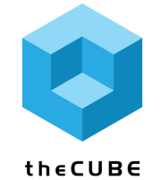
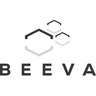
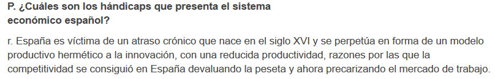
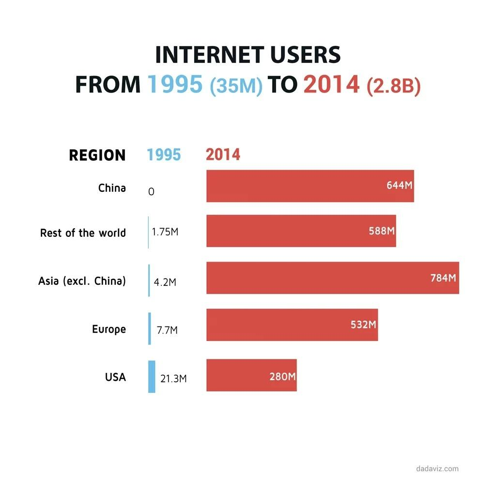

# Awesome Tech 

<iframe src="http://tunein.com/embed/player/s182103/" style="width:100%;height:100px;" scrolling="no" frameborder="no"></iframe>

 

Automation/DevOps CI/CD | Testing | Solutions/Systems Architect | Middleware SysAdmin | RedHat Solutions | Contract & Permanent (no freelance) 

Available for work in Barcelona, Madrid, Bilbao. <strike> Looking for new opportunities across Northern-Western Europe based more on the quality of my work and less whom I know </strike>

Wifi N or AC recommended. Disable Tracking Protection in Firefox in order to render the embedded tweets</strike>

<a href="http://paper.li/tag/redhat">The #redhat Daily</a>

<a href="http://paper.li/tag/aws">The #aws Daily</a>

<a href="http://paper.li/tag/azure">The #azure Daily</a>

**Table of Contents**

1. [High quality tech resources and search engines 🌟🌟🌟](high-quality-tech-resources.md)
	- [Newsfeeds and Twitter resources 😀](twitter.md)
	- [Miscellaneous. IT Blogs, Support](it-blogs.md)
2. [Startups, multinationals and IT Jobs. In-Demand Skills](startups.md)
	- [Leadership Styles Around the World 🌟](leadership_styles_around_world.md)
	- [Barcelona Tech, Startups and Innovation](startups_bcn.md)
	- [Madrid Tech, Startups and Innovation](startups_madrid.md)
	- [Rules for success](rules_for_success.md)
	- [Freelance jobs](freelance_jobs.md)
	- [Motivational videos](motivational_videos.md)
3. [Human Resources 🙈 🙉 🙊](hr.md) Stimulating and provocative!
	- [How to Fire and Onboard](howto_fire_onboard.md)
	- [Culture and Collaboration](culture_collaboration.md)
	- [Office Politics](office_politics.md)
	- [Leadership Blogs](leadership.md)
	- [Interview Preparation Guide](interview_preparation_guide.md)
	- [References and online defamation](references.md)
	- [Recursos Humanos](rrhh.md)
4. [Linux](linux.md)
	- [Red Hat 🌟🌟🌟](redhat.md)
		- [Red Hat Virtualization 🌟🌟](redhatvirt.md)
		- [Red Hat OpenStack](redhat_openstack.md)
		- [Red Hat Cluster](redhatcluster.md)
	- [Linux Commands Examples 🌟](linux-commands-examples.md)
	- [Linux Commands Tweets](linux-commands-tweets.md)
5. [Microsoft](microsoft.md)
6. [WebApp, HTTP/2, e-mail, Middleware, JVM, Video 🌟](webapp.md)
    - [Caching. CDN Content Delivery Network 🌟](caching.md)
    - [Nginx](nginx.md)
    - [F5 Load Balancer](f5lb.md)
	- [Cambios en Java 8](jvm-mem.md)
7. [Security 🌟🌟🌟](security.md)
	- [Next Generation Firewalls (NGFW)](NGFW.md)
	- [HTTPs and HSTS 🌟](https.md)
	- [Security auditing tools](auditing-tools.md)
	- [Security Toolkits and Policies. Penetration Testing](pen_testing.md)
	- [SQL injection 🌟](sql_injection.md)
8. [DevOps and ITIL 🌟🌟🌟](devops-itil.md)
	- [Metrics with APM, Backend Server Monitoring and Alarm System. Grafana, Graphite, Influxdb, Zabbix 🌟](metrics.md)
	- [Elasticsearch, Graylog, Syslog ng](elasticsearch.md)
	- [Continuous Integration Tools. Jenkins, Nexus, Bamboo, Git](jenkins-git.md)
9. [Configuration Management and Orchestration. Microservices 🌟🌟](config-mgmt.md)
	- [Ansible 🌟🌟🌟](ansible.md)
	- [Puppet](puppet.md)
    - [Chef](chef.md)
	- [Docker](docker.md)
10. [Software Development](sw-devel.md)
    - [Sublime Text Editor](sublime.md)
    - [Java](java.md)
	- [Python](python.md)
	- [Static Site Generators 🌟🌟](staticsitegen.md)
11. [QA and Testing 🌟🌟🌟](qa.md)
    - [Testing Tools 🌟🌟](qa_tools.md)
    - [Performance Testing Tools. JMeter, Webpagetest, Taurus, Gatling](webperftesting.md)
	- [Scalability and Reliability 🌟](scalability.md)
	- [Continuous Integration Tools. Jenkins, Git](jenkins-git.md)
12. [Data Science and Big Data](data-science.md)
	- [SQL and Databases](databases.md)
	- [NoSQL and NewSQL. MongoDB 🌟](nosql.md)
	- [Anaconda Analytics](anaconda.md)
	- [Big Bang Data 🌟🌟🌟](bigbangdata.md)
13. [Networking 🌟🌟🌟](networking.md)
    - [Virtual LAN](VLAN.md)
    - [Next Generation Firewalls (NGFW)](NGFW.md)
	- [Network Forensics](nw_forensics.md)
    - [Network Performance](nw_performance.md)
    - [CDN Content delivery network](cdn.md)
    - [VoIP](voip.md)
    - [Mobile Core Network & Signaling. Diameter](mobilecore.md)
    - [IMS IP Multimedia Subsystem](ims.md)
    - [IPTV Internet Protocol Television](iptv.md)
14. [Servers, Storage and Backup](servers-storage-backup.md)
	- [VMware, VirtualBox](vmware.md)
15. [Cloud](cloud.md)
	- [Amazon Web Services 🌟🌟🌟](aws.md)
16. [Desktop Tools and Presentations](desktop-tools.md)
17. [E-Learning 🌟🌟🌟](e-learning.md)
18. [Economy](economy.md)
    - [Economy Videos](economy-videos.md)
    - [Economics Films](economics_films.md)
    - [Live News 🌟](live-news.md)
    - [World Press Photo 🌟🌟🌟🌟](world-press-photo.md)
    - [Quote](mkeiser.md)

| |  | |   |  | | 
|:---:|:---:|:---:|:---:|:---:|:---:|

| |  | |    | |  |
|:---:|:---:|:---:|:---:|:---:|:---:|

| || | |  ||
|:---:|:---:|:---:|:---:|:---:|:---:|

||  |  | |||
|:---:|:---:|:---:|:---:|:---:|:---:|

| |   |  |  | | |
|:---:|:---:|:---:|:---:|:---:|:---:|

|||||||
|:---:|:---:|:---:|:---:|:---:|:---:|

| |   |  |  |  |  |
|:---:|:---:|:---:|:---:|:---:|:---:|

||| ||| |
|:---:|:---:|:---:|:---:|:---:|:---:|

| || | | ||
|:---:|:---:|:---:|:---:|:---:|:---:|

|||||||
|:---:|:---:|:---:|:---:|:---:|:---:|

|  |  |  |  | ||
|:---:|:---:|:---:|:---:|:---:|:---:|

|||||||
|:---:|:---:|:---:|:---:|:---:|:---:|

|| | | | | |
|:---:|:---:|:---:|:---:|:---:|:---:|

||||||
|:---:|:---:|:---:|:---:|:---:|:---:|

|||||||
|:---:|:---:|:---:|:---:|:---:|:---:|

|||||||
|:---:|:---:|:---:|:---:|:---:|:---:|

|||||||
|:---:|:---:|:---:|:---:|:---:|:---:|

|||||||
|:---:|:---:|:---:|:---:|:---:|:---:|

|||||||
|:---:|:---:|:---:|:---:|:---:|:---:|

<blockquote class="twitter-tweet tw-align-center" data-lang="es">
Science is not perfect. It&#39;s often misused. It&#39;s only a tool. But it&#39;s the best tool we have.
&mdash; Carl Sagan (@drcarlsagan) <a href="https://twitter.com/drcarlsagan/status/341313812357582848">2 de junio de 2013</a></blockquote>

<blockquote class="twitter-tweet tw-align-center" data-lang="es">
Technology is anything invented after you were born. - Alan Kay
&mdash; Tech-FAQ (@tech_faq) <a href="https://twitter.com/tech_faq/status/711841287792504833">21 de marzo de 2016</a></blockquote>

<iframe width="560" height="315" src="https://www.youtube.com/embed/9d500RXYCcA?rel=0" frameborder="0" allowfullscreen class="video"></iframe>

 

<iframe width="560" height="315" src="https://www.youtube.com/embed/7HF1Sfos3v4?list=PL_h5o0KnrCrgB0Xo19U6orpWOv9yxK-c7" frameborder="0" allowfullscreen class="video"></iframe>

 

<iframe width="420" height="315" src="https://www.youtube.com/embed/E1o-NWNmQLM?rel=0" frameborder="0" allowfullscreen class="video"></iframe>

 

<iframe width="560" height="315" src="https://www.youtube.com/embed/GWvqkDvv4mE?list=RDGWvqkDvv4mE" frameborder="0" allowfullscreen class="video"></iframe>

 

<iframe width="560" height="315" src="https://www.youtube.com/embed/3qSSrTx1vjE?list=RD3qSSrTx1vjE" frameborder="0" allowfullscreen class="video"></iframe>

 

<iframe width="560" height="315" src="https://www.youtube.com/embed/_Sol6AASguc?rel=0" frameborder="0" allowfullscreen class="video"></iframe>

 

<iframe width="560" height="315" src="https://www.youtube.com/embed/WBavpeSScxU?rel=0" frameborder="0" allowfullscreen class="video"></iframe>

 

<blockquote class="twitter-tweet tw-align-center" data-lang="es">
<a href="https://t.co/VUYG2OPTrw">pic.twitter.com/VUYG2OPTrw</a>
&mdash; Sarah Andersen (@SarahCAndersen) <a href="https://twitter.com/SarahCAndersen/status/748161815679467520">29 de junio de 2016</a></blockquote>

<blockquote class="twitter-tweet tw-align-center" data-lang="es">
<a href="https://t.co/LOKOX0yXl3">https://t.co/LOKOX0yXl3</a>
&mdash; RedHatSpain (@RedHatSpain) <a href="https://twitter.com/RedHatSpain/status/750384551290167296">5 de julio de 2016</a></blockquote>

<blockquote class="twitter-tweet tw-align-center" data-lang="es">
<a href="https://t.co/jmBeCBREB1">https://t.co/jmBeCBREB1</a>
&mdash; RedHatSpain (@RedHatSpain) <a href="https://twitter.com/RedHatSpain/status/750383381846851584">5 de julio de 2016</a></blockquote>

<blockquote class="twitter-tweet tw-align-center" data-lang="es">
<a href="https://t.co/nMDlDBiFic">https://t.co/nMDlDBiFic</a>
&mdash; inafevDevOps (@inafevDevOps) <a href="https://twitter.com/inafevDevOps/status/750796644346654720">6 de julio de 2016</a></blockquote>

<blockquote class="twitter-tweet tw-align-center" data-lang="es">
<a href="https://t.co/E3DKzC8bIT">https://t.co/E3DKzC8bIT</a>
&mdash; inafevDevOps (@inafevDevOps) <a href="https://twitter.com/inafevDevOps/status/750797072845209604">6 de julio de 2016</a></blockquote>

<blockquote class="twitter-tweet tw-align-center" data-lang="es">
GDP, 2015. ($ trillion)  Germany: 3.41 UK: 2.85 France: 2.46 Italy: 1.84 Spain: 1.23 Russia: 1.17 Turkey: 0.75 <a href="https://t.co/ltCVGhOtz2">pic.twitter.com/ltCVGhOtz2</a>
&mdash; The Int&#39;l Spectator (@intlspectator) <a href="https://twitter.com/intlspectator/status/750299133852790784">5 de julio de 2016</a></blockquote>

<iframe width="560" height="315" src="https://www.youtube.com/embed/y60wDzZt8yg?rel=0" frameborder="0" allowfullscreen class="video"></iframe>

 

<iframe width="560" height="315" src="https://www.youtube.com/embed/bXEqR7KWlew?rel=0" frameborder="0" allowfullscreen class="video"></iframe>

 

<iframe width="560" height="315" src="https://www.youtube.com/embed/Jp79HDViQ9s?rel=0" frameborder="0" allowfullscreen class="video"></iframe>

 

<iframe width="560" height="315" src="https://www.youtube.com/embed/4qN-HQlfF5o?rel=0" frameborder="0" allowfullscreen class="video"></iframe>

 

<!-- <iframe width="100%" height="45" src="https://www.youtube.com/embed/uuvDToxhZO0?rel=0&amp;autohide=2&amp;showinfo=0&amp;autoplay=1&amp;controls=2&amp;start=33&amp;end=82" frameborder="0" allowfullscreen></iframe> -->

