<!-- MarkdownTOC -->

- [Interview Preparation Guide](#interview-preparation-guide)
    - [Reasons You are Still Unemployed](#reasons-you-are-still-unemployed)
    - [Applicant Tracking System](#applicant-tracking-system)
    - [Salary Negotiation](#salary-negotiation)
        - [Technical Resume](#technical-resume)

<!-- /MarkdownTOC -->

<blockquote class="twitter-tweet tw-align-center" data-lang="es">
Honest tech recruiter. <a href="https://twitter.com/hashtag/programming?src=hash">#programming</a>  h/t <a href="https://twitter.com/ThePracticalDev">@ThePracticalDev</a> <a href="https://t.co/HWqelL1sz4">pic.twitter.com/HWqelL1sz4</a>
&mdash; Randy Olson (@randal_olson) <a href="https://twitter.com/randal_olson/status/708661402618228738">12 de marzo de 2016</a></blockquote>

[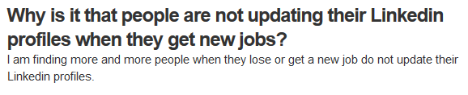](https://www.quora.com/Why-is-it-that-people-are-not-updating-their-Linkedin-profiles-when-they-get-new-jobs)

[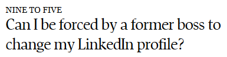](http://www.theglobeandmail.com/report-on-business/careers/career-advice/life-at-work/can-i-be-forced-by-a-former-boss-to-change-my-linkedin-profile/article27051185/)

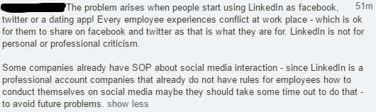

[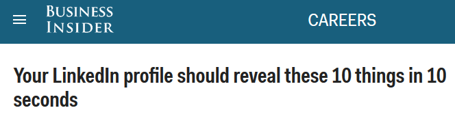](http://www.businessinsider.com/your-linkedin-profile-should-reveal-these-10-things-2016-7)

<blockquote class="twitter-tweet tw-align-center" data-lang="es">
<a href="https://t.co/iM11wnRwlC">https://t.co/iM11wnRwlC</a>
&mdash; RedHatSpain (@RedHatSpain) <a href="https://twitter.com/RedHatSpain/status/747069828121399296">26 de junio de 2016</a></blockquote>

<blockquote class="twitter-tweet tw-align-center" data-lang="es">
Diversity in tech and the challenges of unconscious bias: <a href="https://t.co/s98C7uh8e5">https://t.co/s98C7uh8e5</a>
&mdash; Open Source Way (@opensourceway) <a href="https://twitter.com/opensourceway/status/711967611030888448">21 de marzo de 2016</a></blockquote>

<blockquote class="twitter-tweet tw-align-center" data-lang="es">
&quot;The ideal candidate should have at least 15+ years of experience with RHEL 7 and OpenStack.&quot; Who writes this stuff? <a href="https://t.co/AnYCJwDvoJ">pic.twitter.com/AnYCJwDvoJ</a>
&mdash; nixCraft (@nixcraft) <a href="https://twitter.com/nixcraft/status/712554322278612992">23 de marzo de 2016</a></blockquote>

<iframe width="560" height="315" src="https://www.youtube.com/embed/Ba6Igu1MvE0?list=PLE_MSMq5bSYLnxwcRSGs65mTCMgHgBhpi" frameborder="0" allowfullscreen class="video"></iframe>

 

[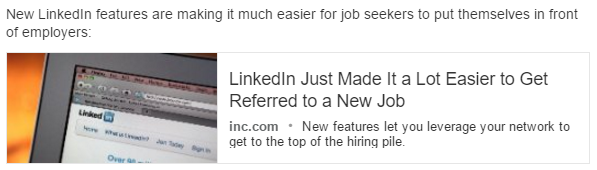](http://www.inc.com/jt-odonnell/getting-referred-to-a-new-job-just-got-easier-on-linkedin.html)

<blockquote class="twitter-tweet tw-align-center" data-lang="es">
Loved reading this! Definitely, Maybe: What Brexit Could Mean For Recruitment. <a href="https://t.co/zs6cMeDYNQ">https://t.co/zs6cMeDYNQ</a> by Salma El… <a href="https://t.co/7A9sB5Ql7g">pic.twitter.com/7A9sB5Ql7g</a>
&mdash; Nadja Weidner (@NadjaWeidner) <a href="https://twitter.com/NadjaWeidner/status/744868475357765632">20 de junio de 2016</a></blockquote>

<iframe width="420" height="315" src="https://www.youtube.com/embed/rQKis2Cfpeo?rel=0" frameborder="0" allowfullscreen class="video"></iframe>

 

[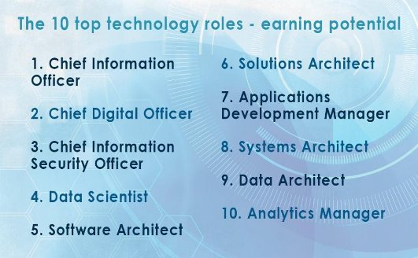](http://www.computing.co.uk/ctg/news/2464111/the-10-top-earning-technology-roles)

[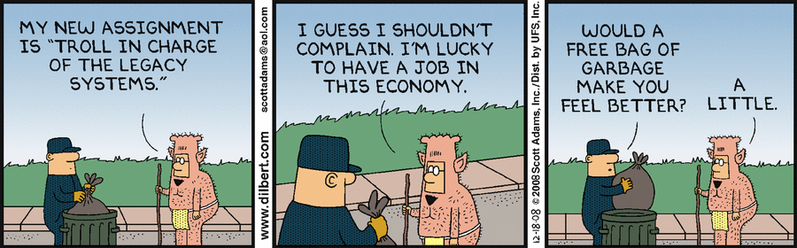](http://dilbert.com/strip/2008-12-18)

[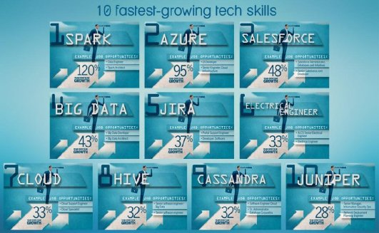](http://www.computerworld.com/article/3064436/it-skills-training/10-fastest-growing-tech-skills.html)

<iframe src="//www.slideshare.net/slideshow/embed_code/key/7u34JkyVLROPz" width="668" height="714" frameborder="0" marginwidth="0" marginheight="0" scrolling="no" style="border:1px solid #CCC; border-width:1px; margin-bottom:5px; max-width: 100%;" allowfullscreen class="video"> </iframe> 
 <strong> <a href="//www.slideshare.net/IQGroup/top-10-tech-jobs-for-2016" title="Top 10 Tech Jobs for 2016" target="_blank">Top 10 Tech Jobs for 2016</a> </strong> from <strong><a href="//www.slideshare.net/IQGroup" target="_blank">InterQuest Group</a></strong> 

 

<blockquote class="twitter-tweet tw-align-center" data-lang="es">
Mas candidatos que oferta en empleo TIC <a href="https://twitter.com/ticjob">@ticjob</a><a href="https://t.co/W4Rus6i0bd">https://t.co/W4Rus6i0bd</a>
&mdash; ComputerWorld España (@ComputerworldES) <a href="https://twitter.com/ComputerworldES/status/751432003006832640">8 de julio de 2016</a></blockquote>

# Interview Preparation Guide
- [Interview Preparation Guide](https://github.com/ride/interview-prep)
- [The Ultimate Guide to Acing Your Skype Interview](https://www.themuse.com/advice/the-ultimate-guide-to-acing-your-skype-interview)
- [7 Questions Only the Smartest Job Candidates Ask](http://www.inc.com/jeff-haden/7-insightful-questions-only-the-best-job-candidates-think-to-ask.html)
- [7 Essential Questions To Ask In Your Job Interview 🌟](http://www.careerealism.com/job-interview-essential-questions-ask/)
- [7 Lies Employers Use To Trick You Into Working For Them](https://www.linkedin.com/pulse/7-lies-employers-use-trick-you-working-them-j-t-o-donnell)
- [10 Questions Never to Ask in an Interview](http://www.mjms.net/blog/10-questions-never-to-ask-in-an-interview/)
- [Resume Dilemma: Employment Gaps and Job-Hopping](http://career-advice.monster.com/resumes-cover-letters/resume-writing-tips/resume-dilemma-employment-gaps/article.aspx)
- [10 Questions to Ask Before You Take a New Job](http://www.levo.com/articles/career-advice/10-questions-to-ask-before-you-take-a-new-job)
- [careerealism.com: 6 Questions To Ask Before Taking The Job](http://www.careerealism.com/taking-job-questions-ask/)
- [5 Reasons You May Not Want to Work for Google](https://www.linkedin.com/pulse/20140603115508-7668018-5-reasons-you-may-not-want-to-work-for-google)
- [An Interview Is a Conversation, Not an Interrogation](http://career-advice.monster.com/job-interview/interview-preparation/tame-hostile-interviewer/article.aspx)
- [monster.com: Your Turn to Ask Questions](http://career-advice.monster.com/job-interview/interview-questions/your-turn-to-ask-questions/article.aspx)
- [businessinsider.com: The 29 smartest questions to ask at the end of every job interview](http://www.businessinsider.com/questions-to-ask-in-a-job-interview-2016-1)
- [How to get any job you want — even if you're not technically qualified](http://www.businessinsider.com/how-to-get-any-job-you-want-even-if-youre-not-technically-qualified-2016-1)
- [Surviving the technical interview](https://wilsonericn.wordpress.com/2012/10/29/surviving-the-technical-interview/)
- [How to Solve Google’s Crazy Open-Ended Interview Questions](http://www.wired.com/2014/08/how-to-solve-crazy-open-ended-google-interview-questions/)
- [businessinsider.com: The surprisingly simple solution to a trick question Apple asks in job interviews](http://www.businessinsider.com/apple-job-interview-question-brainteaser-2016-2)
- [How To Ask For An Introduction On LinkedIn (And Get It!)](http://careerhmo.com/ask-introduction-linkedin/)
- [The one question you should always ask at the end of a job interview 🌟](http://www.businessinsider.com/the-one-question-you-should-always-ask-at-the-end-of-a-job-interview-2016-2) One question all job candidates should always ask, no matter what: "Who succeeds in this position?". Another way to phrase it: "How would you define success for this position?"
- [9 signs you just nailed that job interview](http://www.businessinsider.com/how-to-know-if-i-nailed-an-interview-2016-2-19)
- [opensource.com: How to interview for culture fit 🌟🌟](https://opensource.com/open-organization/16/2/how-hire-people-who-just-get-it)
- [careerealism.com: How To Spot A Jerk Boss During An Interview](http://www.careerealism.com/jerk-boss-interview/)
- [mashable.com: 3 professional ways to bring up your personal life during the job search](http://mashable.com/2016/02/25/talk-personal-life-job-search/)
- [The (Depressing) Truth About Applying To Jobs Online 🌟](https://www.linkedin.com/pulse/depressing-truth-applying-jobs-online-j-t-o-donnell)
- [businessinsider.com: The CEO of billion-dollar startup Slack starts every job interview with this question — and it reveals a lot about him](http://www.businessinsider.com/slack-ceo-starts-job-interviews-with-this-question-2016-2)
- [theundercoverrecruiter.com: 10 Awesome Interview Tips from Actual Hiring Managers](http://theundercoverrecruiter.com/interviewing-tips-from-hiring-managers/)
- [Linkedin: Big Misconception About Being 'Let Go' 🌟](https://www.linkedin.com/pulse/20140414200108-7668018-big-misconception-about-being-let-go)
- [inc.com: 7 (Really Hard) Interview Questions You Must Answer Properly 🌟](http://www.inc.com/jt-odonnell/7-intense-interview-questions-you-need-to-answer-correctly.html) Getting the interview is hard enough. Don't blow your chances by saying the wrong thing.
- [opensource.com: Are you using this highly effective interview technique?](https://opensource.com/business/16/3/highly-effective-interviewing-technique)
- [The Perfect Way To Answer ‘Where Do You See Yourself In 5 Years?’ In A Job Interview](http://www.careerealism.com/job-interivew-where-see-youself-5-years/)
- [How to Ask for a Reference That Will Get You Hired](https://www.linkedin.com/pulse/how-ask-reference-get-you-hired-bernard-marr)
- [forbes: Five Questions That Make Job Interviewers Look Dumb 🌟🌟](http://www.forbes.com/sites/lizryan/2016/03/03/five-questions-that-make-job-interviewers-look-dumb)
- [Find out the ideal work style for your personality](http://www.businessinsider.com/quiz-ideal-work-style-for-your-personality)
- [The 3 questions one CEO hopes to hear from everyone he interviews — but hardly ever does](http://www.businessinsider.com/interview-questions-job-candidates-forget-to-ask-2016-3)
- [A CEO says this is the best question you can ask when you meet an influential person](http://www.businessinsider.com/the-best-question-to-ask-when-you-meet-an-influential-person-2016-2)
- [social.hays.com: Do you know when and how to say no?](https://social.hays.com/2015/08/31/do-you-know-when-and-how-to-say-no/)
- [4 Things You Can’t Forget To Do Before Your Interview](http://www.careerealism.com/interview-cant-forget-do-before/)
- [businessinsider.com: What hiring managers REALLY want to know when they ask these 4 common interview questions](http://www.businessinsider.com/what-the-hiring-manager-wants-to-know-when-they-ask-these-questions-in-job-interviews-2016-3)
- [Ten Things Recruiters Don't Need To Know About You](http://www.forbes.com/sites/lizryan/2016/03/17/ten-things-recruiters-dont-need-to-know-about-you/2/#4ae3c5361bc7)
- [Jacks-Of-All-Trades Don't Get Interviews Because...](https://www.linkedin.com/pulse/20140114003036-7668018-jacks-of-all-trades-don-t-get-interviews-because)
- [How To Get A Job Anywhere With NO Connections 🌟](http://cultivatedculture.com/how-to-get-a-job-anywhere-no-connections/)
- [careerealism.com: 5 Secrets To Staying Upbeat In A Job Search](http://www.careerealism.com/job-search-secrets-staying-upbeat/)
- [The 1 Question You Should Never (Ever) Ask in a Job Interview](http://www.inc.com/jt-odonnell/dont-ever-ask-this-question-in-a-job-interview.html)
- [udemy.com: Fired To Hired: 8 Steps To Get You Back To Work](https://www.udemy.com/fired-to-hired-8-steps-to-get-you-back-to-work/)
- [Job Seeker In Total Denial (Don't Be This Guy)](https://www.linkedin.com/pulse/20140326122122-7668018-job-seeker-in-total-denial-don-t-be-this-guy)
- [The Secret To Getting Interviews: Tap The Hidden Job Market](http://www.careerealism.com/interviews-tap-hidden-job-market/)
- [Interview Questions That Top CEOs LOVE to Ask (Infographic)](http://www.socialtalent.co/blog/interview-questions-that-top-ceos-love-to-ask)
- [3 Things You Need to Find a Job Faster](http://www.inc.com/jt-odonnell/these-3-things-will-help-you-find-a-job-faster.html)
- [How To Write A LinkedIn Profile When You’re Unemployed](http://www.careerealism.com/linkedin-profile-unemployed/)
- [5 Secrets To Staying Upbeat In A Job Search](http://www.careerealism.com/job-search-secrets-staying-upbeat/)
- [How to Answer 'Why Should I Hire You?' 🌟](https://www.entrepreneur.com/article/277683)
- [10 Reasons Why You Haven’t Heard Back From A Recruiter 🌟🌟🌟](http://www.careerealism.com/reasons-why-havent-heard-recruiter/)
- [#1 Darkest Fear of Every Job Seeker](https://www.linkedin.com/pulse/20121002131101-7668018--1-darkest-fear-of-every-job-seeker) 
- [The Interview Secret HR Doesn't Want You To Know...](https://www.linkedin.com/pulse/interview-secret-hr-doesnt-want-you-know-j-t-o-donnell)
- [Rejection: It's not about you](https://www.linkedin.com/pulse/rejection-its-you-jay-kaufmann)
- [What To Write In A Thank You Email After Your Interview](http://www.careerealism.com/thank-you-email-after-interview/)
- [7 Career Regrets To Let Go Of In 2016](https://www.linkedin.com/pulse/7-career-regrets-let-go-2016-j-t-o-donnell) Everyone has regrets. Especially, when it comes to our careers. We all make mistakes we wish we could take back. We all have things we wish we could do over. Here are seven career regrets you need to let go of in 2016.
- [5 Things Every Employer Wants To Hear In An Interview 🌟](http://www.careerealism.com/every-employer-wants-hear-interview/)
- [How To Get Out Of Your Unemployment Funk 🌟🌟](http://www.careerealism.com/unemployment-funk/) Looking for a job is not an easy task, especially when you’ve been out of a job for more than six months. You don’t know what day it is, you don’t have to wake up early (at least not for work), and you’ve developed a not-so-friendly relationship with your computer.
- [10 Hilarious Signs You Should Not Take That Job (Infographic) 🌟🌟🌟🌟](https://www.entrepreneur.com/article/269906)

[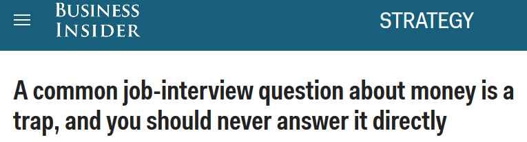](http://www.businessinsider.com/never-directly-answer-a-salary-question-2016-6)

 

[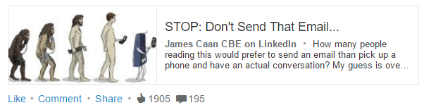](https://www.linkedin.com/pulse/stop-dont-send-email-james-caan-cbe)

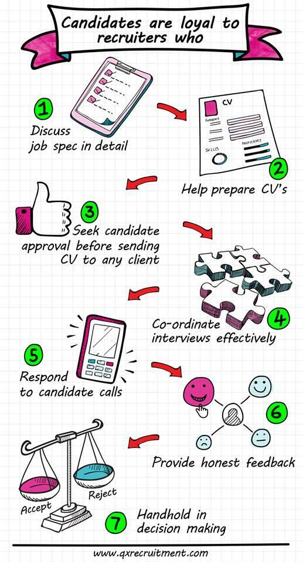

[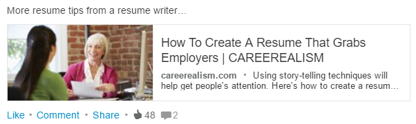](http://www.careerealism.com/resume-captures-hearts-minds-job-offers-employers/)

[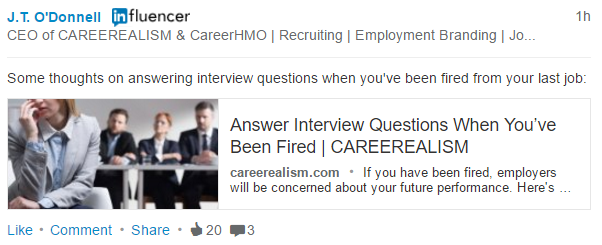](http://www.careerealism.com/interview-questions-answer-been-fired/)

[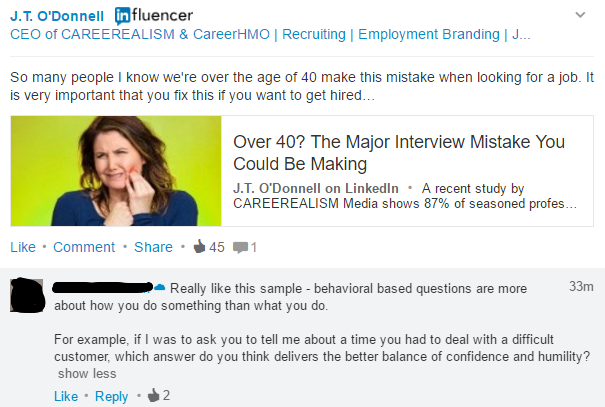](https://www.linkedin.com/pulse/over-40-major-interview-mistake-you-could-making-j-t-o-donnell)

[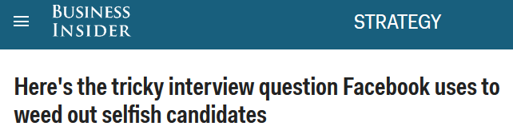](http://www.businessinsider.com/the-tricky-interview-question-facebook-uses-to-weed-out-selfish-candidates-2016-6)

[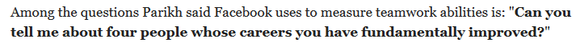](http://www.businessinsider.com/the-tricky-interview-question-facebook-uses-to-weed-out-selfish-candidates-2016-6)

[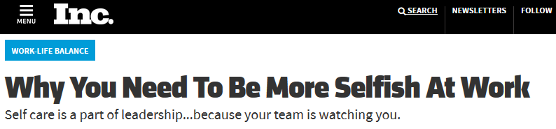](http://www.inc.com/sarah-vermunt/why-you-need-to-be-more-selfish-at-work.html)

[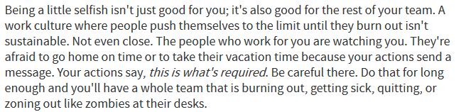](http://www.inc.com/sarah-vermunt/why-you-need-to-be-more-selfish-at-work.html)

<iframe width="560" height="315" src="https://www.youtube.com/embed/tkmi_UTsjtE?rel=0" frameborder="0" allowfullscreen class="video"></iframe>

 

<blockquote class="twitter-tweet tw-align-center" data-lang="es">
78% of well-paying “middle-skill” positions call for basic proficiency with technology. <a href="https://t.co/K3dn8fWHVJ">https://t.co/K3dn8fWHVJ</a> <a href="https://t.co/ZRQSyj77no">pic.twitter.com/ZRQSyj77no</a>
&mdash; Forbes (@Forbes) <a href="https://twitter.com/Forbes/status/745315355027996672">21 de junio de 2016</a></blockquote>

<iframe width="560" height="315" src="https://www.youtube.com/embed/vMiSf7LpFQE?rel=0" frameborder="0" allowfullscreen class="video"></iframe>

 

<iframe width="560" height="315" src="https://www.youtube.com/embed/CcNQUbVOYbU?rel=0" frameborder="0" allowfullscreen class="video"></iframe>

 

<iframe src='//players.brightcove.net/1352575774/dd8fb2f1-e284-4dfb-99b1-bc0b1171a8ca_default/index.html?videoId=4842094814001' allowfullscreen frameborder=0 class="video"></iframe>

 

<iframe width="560" height="315" src="https://www.youtube.com/embed/D9W4h9NqPhI?rel=0" frameborder="0" allowfullscreen class="video"></iframe>

 

<blockquote class="twitter-tweet tw-align-center" data-lang="es">
Are you using this highly effective interview technique? <a href="https://t.co/eeWUCOic24">https://t.co/eeWUCOic24</a>
&mdash; Open Source Way (@opensourceway) <a href="https://twitter.com/opensourceway/status/705914978633551873">5 de marzo de 2016</a></blockquote>

<blockquote class="twitter-tweet tw-align-center" data-lang="es">
The script for a perfect job interview: <a href="https://t.co/ufmCIu3owU">https://t.co/ufmCIu3owU</a>
&mdash; Forbes (@Forbes) <a href="https://twitter.com/Forbes/status/708785138499493893">12 de marzo de 2016</a></blockquote>

<blockquote class="twitter-tweet tw-align-center" data-lang="es">
Why do so many job interviewers stick to the same, tired job interview script? <a href="https://t.co/SMCo4gqacU">https://t.co/SMCo4gqacU</a>
&mdash; Forbes (@Forbes) <a href="https://twitter.com/Forbes/status/706248424157552640">5 de marzo de 2016</a></blockquote>

<iframe width="560" height="315" src="https://www.youtube.com/embed/sY5BPvQbLdM?rel=0" frameborder="0" allowfullscreen class="video"></iframe>

 

<blockquote class="twitter-tweet tw-align-center" data-lang="es">
<a href="https://twitter.com/hashtag/programmers?src=hash">#programmers</a> these days be like <a href="https://t.co/BugqcIu5rg">pic.twitter.com/BugqcIu5rg</a>
&mdash; unixstickers (@unixstickers) <a href="https://twitter.com/unixstickers/status/749606370845028352">3 de julio de 2016</a></blockquote>

<blockquote class="twitter-tweet tw-align-center" data-lang="es">
Ask HN: How do detect a crappy boss / toxic environment when interviewing? | Hacker News <a href="https://twitter.com/hashtag/goodread?src=hash">#goodread</a>  <a href="https://t.co/KjaYBwktW2">https://t.co/KjaYBwktW2</a>
&mdash; nixCraft (@nixcraft) <a href="https://twitter.com/nixcraft/status/718389363386818560">8 de abril de 2016</a></blockquote>

<blockquote class="twitter-tweet tw-align-center" data-lang="es">
Your Guide to Hiring a Good Programmer<a href="https://twitter.com/hashtag/Agile?src=hash">#Agile</a><a href="https://t.co/NyjK9hOxcJ">https://t.co/NyjK9hOxcJ</a>  via <a href="https://twitter.com/hashtag/MVB?src=hash">#MVB</a> <a href="https://twitter.com/yegor256">@yegor256</a> <a href="https://t.co/9Mw1RvxCep">pic.twitter.com/9Mw1RvxCep</a>
&mdash; DZone (@DZone) <a href="https://twitter.com/DZone/status/748123868007641088">29 de junio de 2016</a></blockquote>

<blockquote class="twitter-tweet tw-align-center" data-lang="es">
Which big tech companies employ the most women? <a href="https://t.co/JWV8NTv1iq">https://t.co/JWV8NTv1iq</a>
&mdash; Forbes (@Forbes) <a href="https://twitter.com/Forbes/status/708749654930952193">12 de marzo de 2016</a></blockquote>

<iframe width="420" height="315" src="https://www.youtube.com/embed/RQLY2xKLlDk?rel=0" frameborder="0" allowfullscreen class="video"></iframe>

 

<iframe src="//www.slideshare.net/slideshow/embed_code/key/J4vIu5qJl4L9rD" width="668" height="714" frameborder="0" marginwidth="0" marginheight="0" scrolling="no" style="border:1px solid #CCC; border-width:1px; margin-bottom:5px; max-width: 100%;" allowfullscreen class="video"> </iframe> 
 <strong> <a href="//www.slideshare.net/IQGroup/how-to-make-your-linkedin-profile-desireable" title="How To Make Your LinkedIn Profile Desireable" target="_blank">How To Make Your LinkedIn Profile Desireable</a> </strong> from <strong><a href="//www.slideshare.net/IQGroup" target="_blank">InterQuest Group</a></strong> 

 

<blockquote class="twitter-tweet tw-align-center" data-lang="es">
Quote of the day: <a href="https://t.co/evmuW9Fqfr">https://t.co/evmuW9Fqfr</a> <a href="https://t.co/A2IggUSmxE">pic.twitter.com/A2IggUSmxE</a>
&mdash; Forbes (@Forbes) <a href="https://twitter.com/Forbes/status/706509897060450304">6 de marzo de 2016</a></blockquote>

<blockquote class="twitter-tweet tw-align-center" data-lang="es">
We can stop here  <a href="https://t.co/Jgtn694sZo">https://t.co/Jgtn694sZo</a> <a href="https://t.co/zzTFfRedEG">pic.twitter.com/zzTFfRedEG</a>
&mdash; CommitStrip (@CommitStrip) <a href="https://twitter.com/CommitStrip/status/725398686486945792">27 de abril de 2016</a></blockquote>

<blockquote class="twitter-tweet tw-align-center" data-lang="es">
Tres simuladores para practicar tu <a href="https://twitter.com/hashtag/entrevista?src=hash">#entrevista</a> de <a href="https://twitter.com/hashtag/trabajo?src=hash">#trabajo</a> <a href="https://t.co/GKCD2PXC6C">https://t.co/GKCD2PXC6C</a> vía <a href="https://twitter.com/Infoempleo">@Infoempleo</a> <a href="https://twitter.com/hashtag/orientacionline?src=hash">#orientacionline</a> <a href="https://twitter.com/hashtag/orientaci%C3%B3n?src=hash">#orientación</a>
&mdash; Orientación_Online (@Orientacionline) <a href="https://twitter.com/Orientacionline/status/737269053832736769">30 de mayo de 2016</a></blockquote>

<iframe width="560" height="315" src="https://www.youtube.com/embed/z-5iCygFd9M?rel=0" frameborder="0" allowfullscreen class="video"></iframe>

 

<blockquote class="twitter-tweet tw-align-center" data-lang="es">
How to answer dumb job interview questions in Silicon Valley <a href="https://t.co/5q4WFLRBnH">https://t.co/5q4WFLRBnH</a> <a href="https://t.co/ROOXCIHBnb">pic.twitter.com/ROOXCIHBnb</a>
&mdash; Forbes Tech News (@ForbesTech) <a href="https://twitter.com/ForbesTech/status/733391780385853440">19 de mayo de 2016</a></blockquote>

[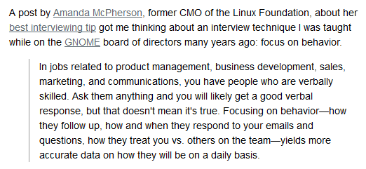](https://opensource.com/business/16/3/highly-effective-interviewing-technique)

<iframe width="560" height="315" src="https://www.youtube.com/embed/kBHgMzkp6_c?rel=0" frameborder="0" allowfullscreen class="video"></iframe>

 

<iframe width="560" height="315" src="https://www.youtube.com/embed/U9rn5kuTpHw?rel=0" frameborder="0" allowfullscreen class="video"></iframe>

 

<iframe src="//www.slideshare.net/slideshow/embed_code/key/CvuglPKjVFBXb0" width="595" height="485" frameborder="0" marginwidth="0" marginheight="0" scrolling="no" style="border:1px solid #CCC; border-width:1px; margin-bottom:5px; max-width: 100%;" allowfullscreen class="video"> </iframe> 
 <strong> <a href="//www.slideshare.net/Pmq150/top-10-hr-interview-questions-and-answers-for-freshers-54046963" title="Top 10 hr interview questions and answers for freshers" target="_blank">Top 10 hr interview questions and answers for freshers</a> </strong> from <strong><a target="_blank" href="//www.slideshare.net/Pmq150">Pmq150</a></strong> 

 

[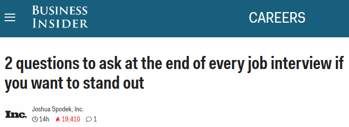](http://www.businessinsider.com/questions-to-ask-at-the-end-of-a-job-interview-2016-3)

[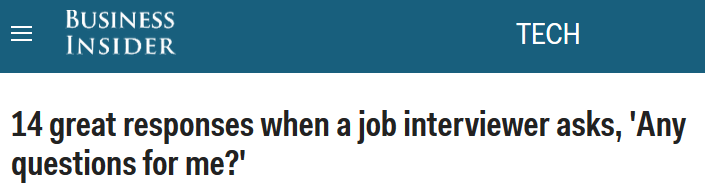](http://www.businessinsider.com/14-great-responses-when-a-job-interviewer-asks-any-questions-for-me-2016-3)

<iframe width="560" height="315" src="https://www.youtube.com/embed/rQwanxQmFnc?rel=0" frameborder="0" allowfullscreen class="video"></iframe>

 

## Reasons You are Still Unemployed
- [careerealism.com: 18 Good Reasons You’re Still Unemployed](http://www.careerealism.com/reasons-unemployed/)
- [5 Reasons YOU are STILL Unemployed](https://www.linkedin.com/pulse/5-reasons-you-still-unemployed-robynn-storey-phr)
- [Why are you still unemployed?](https://www.linkedin.com/pulse/why-you-still-unemployed-robert-j-hardy)
- [Five More Reasons You May Still Be Unemployed](Five More Reasons You May Still Be Unemployed)

[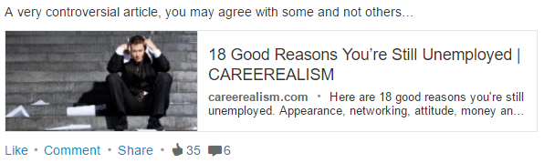](http://www.careerealism.com/reasons-unemployed/)

## Applicant Tracking System
- [Applicant tracking system](https://en.wikipedia.org/wiki/Applicant_tracking_system)

<iframe width="560" height="315" src="https://www.youtube.com/embed/AVvaECOmSS4?rel=0" frameborder="0" allowfullscreen class="video"></iframe>

 

<iframe width="420" height="315" src="https://www.youtube.com/embed/6vDKNIY185A?rel=0" frameborder="0" allowfullscreen class="video"></iframe>

 

<iframe width="560" height="315" src="https://www.youtube.com/embed/j9ezxzrpD1Q?rel=0" frameborder="0" allowfullscreen class="video"></iframe>

 

## Salary Negotiation 
- [Sorry, Recruiters! My Salary History Is None of Your Business 🌟](https://www.linkedin.com/pulse/sorry-recruiters-my-salary-history-none-your-business-liz-ryan)
- [4 Steps to Negotiating a Great Salary](http://www.inc.com/jt-odonnell/4-steps-to-negotiating-a-great-salary.html) Here's how to get employers to pay you what you want.
- [robertwalters.co.uk Salary Survey](https://www.robertwalters.co.uk/salarysurvey.html)
- [Achieve the Job Offer You Deserve by Avoiding These 10 Salary Negotiation Mistakes](http://www.quintcareers.com/salary-negotiation-mistakes/)
- [How to Negotiate Salary: 37 Tips You Need to Know](https://www.themuse.com/advice/how-to-negotiate-salary-37-tips-you-need-to-know)
- [Forbes: How To Negotiate Your Salary Once You Have The Job Offer 🌟](www.forbes.com/sites/susanadams/2014/06/26/how-to-negotiate-your-salary-once-you-have-the-job-offer/)
- [Why, and how, to negotiate a fair salary](https://www.linkedin.com/pulse/why-how-negotiate-fair-salary-hansi-mehrotra-cfa)
- [computerworld.com: Salary negotiations: 6 tips from the experts](http://www.computerworld.com/video/63226/salary-negotiations-6-tips-from-the-experts)

<blockquote class="twitter-tweet tw-align-center" data-lang="es">
Generation Y, Curling or Maybe: what the world calls millennials <a href="https://t.co/cQWAO8yyxe">https://t.co/cQWAO8yyxe</a>
&mdash; The Guardian (@guardian) <a href="https://twitter.com/guardian/status/707102616032026629">8 de marzo de 2016</a></blockquote>

<blockquote class="twitter-tweet tw-align-center" data-lang="es">
Me ha gustado un vídeo de <a href="https://twitter.com/YouTube">@YouTube</a> (<a href="https://t.co/SD7G5BwnuV">https://t.co/SD7G5BwnuV</a> - &quot;Everybody Has a Number&quot; Clip - Wall Street: Money Never Sleeps).
&mdash; Artur Debat (@Arturdebat) <a href="https://twitter.com/Arturdebat/status/696084018647924736">6 de febrero de 2016</a></blockquote>

<blockquote class="twitter-tweet tw-align-center" data-lang="es">
Smart Tips <a href="https://twitter.com/hashtag/empleo?src=hash">#empleo</a> Expectativas salariales, la pregunta del millón <a href="https://t.co/ES2CrNBZlC">https://t.co/ES2CrNBZlC</a>
&mdash; MªJosé Vizcaíno (@VentProfesional) <a href="https://twitter.com/VentProfesional/status/706615881611112448">6 de marzo de 2016</a></blockquote>

<blockquote class="twitter-tweet tw-align-center" data-lang="es">
Salary negotiations: 6 tips from the experts <a href="https://t.co/uV1TKXYHgC">https://t.co/uV1TKXYHgC</a>
&mdash; Computerworld (@Computerworld) <a href="https://twitter.com/Computerworld/status/715503846810914816">31 de marzo de 2016</a></blockquote>

[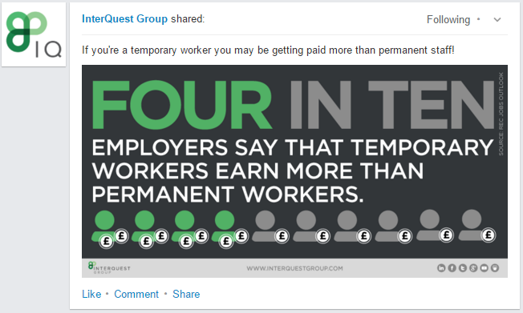](http://www.interquestgroup.com/)

[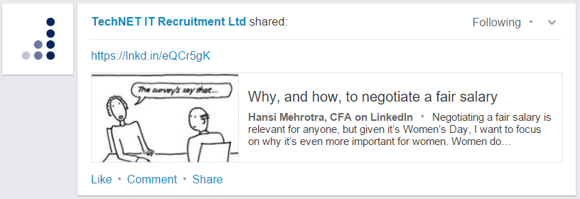](https://www.linkedin.com/pulse/why-how-negotiate-fair-salary-hansi-mehrotra-cfa)

<iframe width="560" height="315" src="https://www.youtube.com/embed/XCJ4L2so118?rel=0" frameborder="0" allowfullscreen class="video"></iframe>

 

<iframe width="560" height="315" src="https://www.youtube.com/embed/1mHjMNZZvFo?rel=0" frameborder="0" allowfullscreen class="video"></iframe>

 

<iframe width="560" height="315" src="https://www.youtube.com/embed/bLdb9_TITSw?rel=0" frameborder="0" allowfullscreen class="video"></iframe>

 

<iframe width="560" height="315" src="https://www.youtube.com/embed/Zy1oNk616_U?rel=0" frameborder="0" allowfullscreen class="video"></iframe>

 

<iframe width="560" height="315" src="https://www.youtube.com/embed/pUQB1_MSWno?rel=0" frameborder="0" allowfullscreen class="video"></iframe>

 

<iframe width="560" height="315" src="https://www.youtube.com/embed/ahDDUK51XPY?rel=0" frameborder="0" allowfullscreen class="video"></iframe>

 

<iframe width="560" height="315" src="https://www.youtube.com/embed/XY5SeCl_8NE?rel=0" frameborder="0" allowfullscreen class="video"></iframe>

 

<iframe width="560" height="315" src="https://www.youtube.com/embed/d3qfJeLQDoY?rel=0" frameborder="0" allowfullscreen class="video"></iframe>

 

<iframe width="560" height="315" src="https://www.youtube.com/embed/1mW-mkZXAlg?rel=0" frameborder="0" allowfullscreen class="video"></iframe>

 

<iframe width="560" height="315" src="https://www.youtube.com/embed/qBpp8Rt37dU?rel=0" frameborder="0" allowfullscreen class="video"></iframe>

 

<iframe width="560" height="315" src="https://www.youtube.com/embed/c4sV9YItOjo?rel=0" frameborder="0" allowfullscreen class="video"></iframe>

 

<blockquote class="twitter-tweet tw-align-center" data-lang="es">
Cuánto ganamos los españoles ➡ <a href="https://t.co/auaveUijjo">https://t.co/auaveUijjo</a> por <a href="https://twitter.com/raulalonsoenred">@raulalonsoenred</a> <a href="https://t.co/WhO9WCIpay">pic.twitter.com/WhO9WCIpay</a>
&mdash; Movistar pymes (@Movistar_pymes) <a href="https://twitter.com/Movistar_pymes/status/718366612714364928">8 de abril de 2016</a></blockquote>

<blockquote class="twitter-tweet tw-align-center" data-lang="es">
Where are the world’s highest minimum wages? <a href="https://t.co/samaDvy5dj">https://t.co/samaDvy5dj</a> <a href="https://t.co/OZBuLMiwC5">pic.twitter.com/OZBuLMiwC5</a>
&mdash; World Economic Forum (@wef) <a href="https://twitter.com/wef/status/717210424492605440">5 de abril de 2016</a></blockquote>

<blockquote class="twitter-tweet tw-align-center" data-lang="es">
Moneyball Job Offer <a href="https://t.co/oR0SUF6mnC">https://t.co/oR0SUF6mnC</a>
&mdash; Scott (@kawebbScott) <a href="https://twitter.com/kawebbScott/status/708726103872032768">12 de marzo de 2016</a></blockquote>

<iframe width="560" height="315" src="https://www.youtube.com/embed/ewek-6TudOM?list=PLE_MSMq5bSYLnxwcRSGs65mTCMgHgBhpi" frameborder="0" allowfullscreen class="video"></iframe>

 

### Technical Resume
- [Why I Like People with Unconventional Resumés](https://hbr.org/2012/07/why-i-like-people-with-unconve)
- [The 6 Musts of a Cover Letter](http://www.entrepreneur.com/article/269614)
- [How to rock your tech resume (3 steps)](http://learntocodewith.me/posts/tech-resumes/) Just how you dislike writing your resume, hiring managers dislike reviewing them.
- [Job Interview Thank You Letter Sample](http://jobsearch.about.com/od/thankyouletters/a/blthank.htm)
- [Forbes: Cover Letters Are Dead And Other 2016 Recruiting Trends](http://www.forbes.com/sites/lizryan/2016/02/04/cover-letters-are-dead-and-other-2016-recruiting-trends/)
- [Linkedin: The One Thing Every Employer Wants to See On Your Resume](https://www.linkedin.com/pulse/one-thing-every-employer-wants-see-your-resume-brian-de-haaff)
- [opensource.com: How to add open source experience to your resume 🌟](https://opensource.com/business/16/2/add-open-source-to-your-resume)
- [Why Your Resume Is Making Recruiters Cringe](https://www.linkedin.com/pulse/why-your-resume-making-recruiters-cringe-j-t-o-donnell)
- [careerealism.com: What To Do If You’ve Lied On Your Resume](http://www.careerealism.com/lied-resume-what-to-do/)
- [This resume for Elon Musk proves you never, ever need to use more than one page](http://www.businessinsider.com/elons-musk-resume-all-on-one-page-2016-4)
- [Tick tock: You have just seconds to impress with your CV](http://www.talentinternational.com/tick-tock-you-have-just-seconds-to-impress-with-your-cv/)
- [20 CV fixes you can make in less than 20 minutes](http://uk.hudson.com/job-seekers/career-advice/20-cv-fixes-you-can-do-in-20-minutes)
- [4 Tips To Updating The Old Resume 🌟](http://www.careerealism.com/updating-old-resume-tips/)
- [How Long Should A Resume Be? 🌟🌟🌟](http://www.careerealism.com/how-long-resume-be/)

[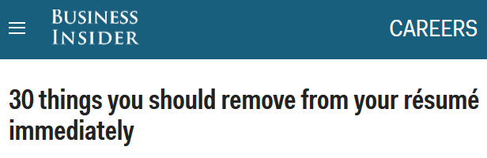](http://www.businessinsider.com/dont-put-these-things-on-your-resume-2015-3-31)

[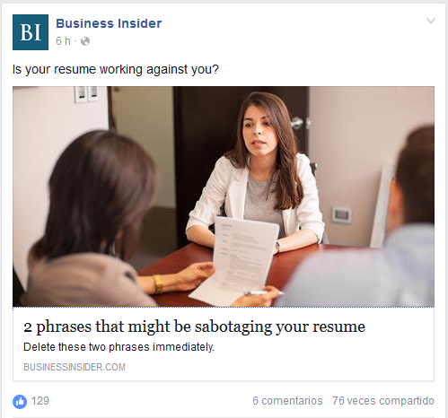](http://www.businessinsider.com/phrases-that-are-sabotaging-your-rsum-2016-3)

<blockquote class="twitter-tweet tw-align-center" data-lang="es">
&quot;El método Gronholm&quot; Una <a href="https://twitter.com/hashtag/pel%C3%ADcula?src=hash">#película</a> para analizar el comportamiento humano ante una <a href="https://twitter.com/hashtag/entrevista?src=hash">#entrevista</a> de <a href="https://twitter.com/hashtag/trabajo?src=hash">#trabajo</a> <a href="http://t.co/wg6SqrTNd7">http://t.co/wg6SqrTNd7</a> <a href="https://twitter.com/hashtag/escalARTE?src=hash">#escalARTE</a>
&mdash; Escala Psicologia (@escalapsi) <a href="https://twitter.com/escalapsi/status/580280463429890048">24 de marzo de 2015</a></blockquote>

<blockquote class="twitter-tweet tw-align-center" data-lang="es">
&quot;where do you see yourself in 10 years&quot; <a href="https://t.co/1kvTgTHvKX">pic.twitter.com/1kvTgTHvKX</a>
&mdash; Sam Ruble (@Cookies) <a href="https://twitter.com/Cookies/status/711968330479968256">21 de marzo de 2016</a></blockquote>

<blockquote class="twitter-tweet tw-align-center" data-lang="es">
Resumes are overrated for startup hiring <a href="https://t.co/TTr4bO4dJH">https://t.co/TTr4bO4dJH</a> <a href="https://t.co/Q1tnSyw9LC">pic.twitter.com/Q1tnSyw9LC</a>
&mdash; Business Insider (@businessinsider) <a href="https://twitter.com/businessinsider/status/733769254928064517">20 de mayo de 2016</a></blockquote>

<iframe width="560" height="315" src="https://www.youtube.com/embed/-JBvfZTx-vs?rel=0" frameborder="0" allowfullscreen class="video"></iframe>

 

<iframe width="560" height="315" src="https://www.youtube.com/embed/b56eAUCTLok?list=PLE_MSMq5bSYLnxwcRSGs65mTCMgHgBhpi" frameborder="0" allowfullscreen class="video"></iframe>

 

<iframe width="560" height="315" src="https://www.youtube.com/embed/kBxRi_udy9I?list=PLE_MSMq5bSYLnxwcRSGs65mTCMgHgBhpi" frameborder="0" allowfullscreen class="video"></iframe>

 

<iframe width="560" height="315" src="https://www.youtube.com/embed/KVucOxw9fFM?list=PLE_MSMq5bSYLnxwcRSGs65mTCMgHgBhpi" frameborder="0" allowfullscreen class="video"></iframe>

 

<iframe width="560" height="315" src="https://www.youtube.com/embed/7W_qrc-TkR8?rel=0" frameborder="0" allowfullscreen class="video"></iframe>

 

<a href="https://www.reddit.com/r/programming/comments/16qbxn/if_carpenters_were_hired_like_programmers/">If Carpenters Were Hired Like Programmers</a>

[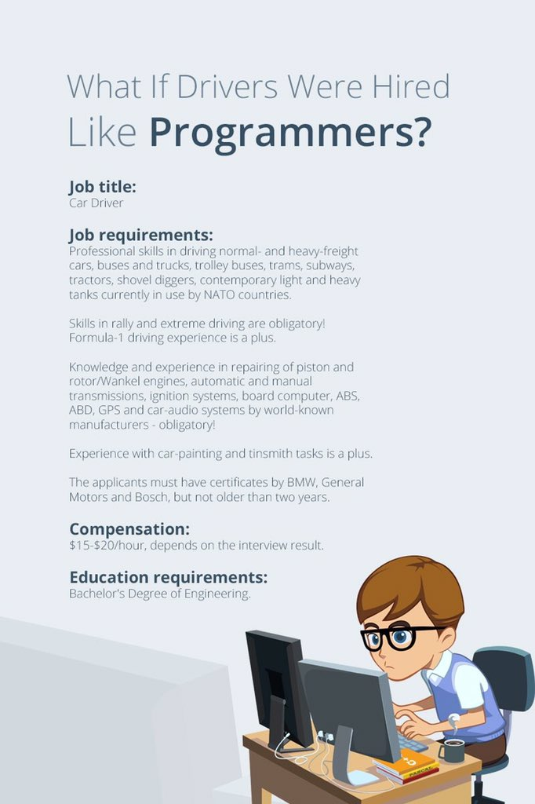](https://www.jitbit.com/alexblog/203-what-if-drivers-were-hired-like-programmers/)

<iframe width="560" height="315" src="https://www.youtube.com/embed/-gkibxWr0DY?rel=0" frameborder="0" allowfullscreen class="video"></iframe>

 