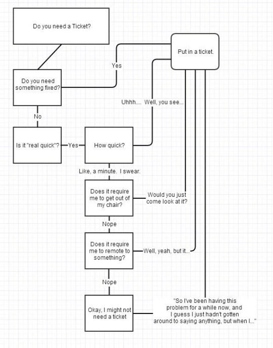
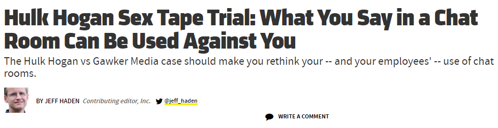
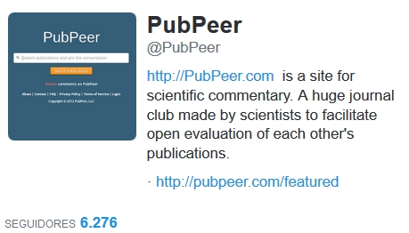

**Table of Contents**
<!-- MarkdownTOC -->

- [Miscellaneous](#miscellaneous)
	- [IT Blogs and Forums](#it-blogs-and-forums)
	- [IT Spain Blogs](#it-spain-blogs)
	- [Blog Hosting](#blog-hosting)
	- [Support](#support)
	- [Non IT related Blogs](#non-it-related-blogs)
	- [Non IT related Podcasts](#non-it-related-podcasts)

<!-- /MarkdownTOC -->

# Miscellaneous
## IT Blogs and Forums
- [medium.com 🌟🌟](https://medium.com)
- [gettopical.com. Search for a favorite topic and get its latest news](http://gettopical.com/)
	- [gettopical.com: Internet of Things latest news](http://gettopical.com/internetofthings)
- [ZDNet 🌟🌟🌟](http://www.zdnet.com/)
- [DZone 🌟🌟🌟](https://dzone.com)
	- [twitter.com/DZone](https://twitter.com/DZone)
- [CityAM Tech 🌟🌟](http://www.cityam.com/news/tech)
- [Forbes Tech 🌟](http://www.forbes.com/technology/)
- [Tech Insider 🌟](http://www.techinsider.io/)
- [techcrunch.com 🌟](http://techcrunch.com/)
- [The enterprisers project](https://enterprisersproject.com/) Sponsored By Red Hat
- [techrepublic.com](http://www.techrepublic.com/)
- [eWeek.com](http://www.eweek.com)
- [ars technica 🌟](http://arstechnica.com/)
- [slashdot.org](http://slashdot.org)
- [The VAR Guy 🌟](http://thevarguy.com)
- [time.com/tech 🌟](http://time.com/tech)
- [BBC Research & Development](http://www.bbc.co.uk/rd)
- [Network World](http://www.networkworld.com/)
- [GeekWire](http://www.geekwire.com/)
- [enterprisetech.com](http://www.enterprisetech.com/)
- [Digitalist magazine](http://www.digitalistmag.com/)
- [Triplebyte. Building a better hiring process for engineers](https://data.triplebyte.com/)
- [Tom's Guide: tech products reviews, top picks and How To](http://www.tomsguide.com/)
- [techpageone.co.uk](http://www.techpageone.co.uk/)
- [uk.businessinsider.com/tech](http://uk.businessinsider.com/tech)
- [Simple talk: A technical journal and community hub from Redgate](https://www.simple-talk.com/)
- [JAXenter.com: News, Articles, Code](https://jaxenter.com/)
- [TechSpective](http://techspective.net/)
- [Tech.Co - Tech & Startup Events, News and Resources](http://tech.co/)
- [tech-faq.com 🌟](http://www.tech-faq.com/)
- [Solutions Review. Buyer's guides and best practices](http://solutions-review.com/)
- [topdata.news: Big Data News](http://topdata.news/)
- [Internet of Things News](http://internetofthings.posthaven.com/)
- [AngularJS News](http://angularjs.posthaven.com/)
- [ReactJS News](http://reactjs.posthaven.com/)
- [Bitcoin News](http://btc.posthaven.com/)
- [information-age.com](http://www.information-age.com/)
- [The Next Web - International technology news, business & culture 🌟](http://thenextweb.com/)
- [nextplatform.com 🌟🌟](http://www.nextplatform.com)
- [infoworld.com](http://www.infoworld.com)
- [cio.com 🌟](http://www.cio.com)
- [vigilantguy.com](http://www.vigilantguy.com) CIO leadership
- [AppDeveloperMagazine.com](https://appdevelopermagazine.com)
- [thestack.com 🌟](https://thestack.com) Security, IoT, Cloud and the latest tech news
- [opensource.com 🌟🌟🌟](https://opensource.com)
- [blogs.vmware.com](http://blogs.vmware.com/)
- [mashable.com/apps-software](http://mashable.com/apps-software)
- [diginomica.com](http://diginomica.com) business insights for the digital enterprise
- [TechVision Research | IT Research and Consulting](http://techvisionresearch.com/)

## IT Spain Blogs
- [hipertextual.com](http://hipertextual.com/)
- [javiergarzas.com 🌟🌟🌟](http://www.javiergarzas.com/)
- [Pymes y autónomos](http://www.pymesyautonomos.com)
- [unpocodejava.wordpress.com 🌟🌟🌟](https://unpocodejava.wordpress.com/)
- [blog.jreypo.io 🌟](http://blog.jreypo.io/)
- [dbigcloud.com 🌟](http://www.dbigcloud.com/)
- [Aprendiendo a virtualizar](http://aprendiendoavirtualizar.com/)
- [josemariagonzalez.es: Virtualización & Cloud Computing](http://www.josemariagonzalez.es/)
- [blogvmware.com](http://www.blogvmware.com/)
- [mundosql.es](http://www.mundosql.es)
- [A un clic de las TIC. Telefónica Grandes Empresas 🌟](http://www.aunclicdelastic.com/)
- [Con Tu Negocio. Los mejors contenidos para tu pyme 🌟](http://www.contunegocio.es/)
- [TLife.guru: Tecnología aplicada a la vida](http://tlife.guru/)
- [TICbeat](http://www.ticbeat.com/)
- [adictosaltrabajo.com](http://www.adictosaltrabajo.com/)
- [systemadmin.es 🌟](http://systemadmin.es/)
- [muylinux.com 🌟](http://www.muylinux.com/)
- [linuxadictos.com 🌟](http://www.linuxadictos.com)
- [adslzone.net](http://www.adslzone.net)
- [innovaspain.com 🌟](http://www.innovaspain.com)
- [emezeta.com](http://www.emezeta.com)
- [ecommerce-news.es 🌟](http://ecommerce-news.es)
	- [Mercadona pierde entre 30 y 40 M€ al año en su canal online](http://ecommerce-news.es/actualidad/mercadona-pierde-30-40-me-al-ano-canal-online-38119.html)
	- [Tienda online de Mercadona: un 1% de las ventas y pérdidas por 40 millones](http://cincodias.com/cincodias/2016/03/04/empresas/1457075734_828492.html)

## Blog Hosting
- [How to Start a Blog with WordPress (Step by Step Guide for Blog Hosting)](http://www.webcodegeeks.com/wordpress/how-to-start-blog-wordpress-hosting/)

## Support
- [Stack Exchange](high-quality-tech-resources.md#stack-exchange-family-of-qa-websites)
- [roguewave.com: 2015 Open Source Support Report](http://www.roguewave.com/programs/open-source-support-report)
- [IT Workers Share the Most Idiotic Things Non-Techies Have Told Them](https://upvoted.com/2015/12/15/it-workers-share-the-most-idiotic-things-non-techies-have-told-them/)

<iframe src="//www.slideshare.net/slideshow/embed_code/key/FyDLH9jfv239KT" width="595" height="485" frameborder="0" marginwidth="0" marginheight="0" scrolling="no" style="border:1px solid #CCC; border-width:1px; margin-bottom:5px; max-width: 100%;" allowfullscreen class="video"> </iframe> 
 <strong> <a href="//www.slideshare.net/bhavna123/handling-difficult-calls-presentation" title="Handling Difficult Calls" target="_blank">Handling Difficult Calls</a> </strong> from <strong><a target="_blank" href="//www.slideshare.net/bhavna123">Bhavana Agarwal</a></strong> 

 

<blockquote class="twitter-tweet tw-align-center" data-lang="es">
Every effing developers vs sysadmin ;) Via <a href="https://t.co/T6G8dEZyke">https://t.co/T6G8dEZyke</a>? <a href="https://twitter.com/hashtag/devops?src=hash">#devops</a> <a href="https://twitter.com/hashtag/unix?src=hash">#unix</a> <a href="https://twitter.com/hashtag/linux?src=hash">#linux</a> <a href="https://twitter.com/hashtag/humor?src=hash">#humor</a> <a href="https://t.co/dFW77Urdf4">pic.twitter.com/dFW77Urdf4</a>
&mdash; nixCraft (@nixcraft) <a href="https://twitter.com/nixcraft/status/707678435879964672">marzo 9, 2016</a></blockquote>

<blockquote class="twitter-tweet tw-align-center" data-lang="es">
Straks Falling Down met Michael Douglas <a href="https://twitter.com/hashtag/SBS9?src=hash">#SBS9</a> met deze geweldige scene. And you ma&#39;am, how is the food? <a href="https://twitter.com/hashtag/bleblehbleh?src=hash">#bleblehbleh</a> <a href="https://t.co/IEOZu0iKk9">https://t.co/IEOZu0iKk9</a>
&mdash; Richard van Meerten (@richardvmeerten) <a href="https://twitter.com/richardvmeerten/status/697501436263972865">10 de febrero de 2016</a></blockquote>

## Non IT related Blogs
- [Upvoted - A Redditorial Publication](https://upvoted.com/)

## Non IT related Podcasts
- [theguardian.com: The 10 best lesser-known podcasts ](http://www.theguardian.com/culture/gallery/2014/jan/18/10-best-lesser-known-podcasts-miranda-sawyer)
- [Welcome to Night Vale](https://soundcloud.com/nightvaleradio)
- [James O’Brien’s Mystery Hour](http://www.lbc.co.uk/james-obriens-mystery-hour-podcast---free-54729)
- [The Broad Experience](http://www.thebroadexperience.com/)
- [Love + Radio](http://loveandradio.org/)
- [Flop House](http://www.flophousepodcast.com/)
- [Shift Run Stop](http://shiftrunstop.co.uk/)
- [The Bugle](http://thebuglepodcast.com/)
- [The Moth](http://themoth.org/)
- [Savage Lovecast](http://www.savagelovecast.com/)
- [Velo Club Don Logan](http://veloclubdonlogan.co.uk/category/podcast/)

_______________________________________________

<blockquote class="twitter-tweet tw-align-center" data-lang="es">
<a href="https://twitter.com/hashtag/RespectMyNet?src=hash">#RespectMyNet</a> en <a href="https://twitter.com/El_Diagonal">@El_Diagonal</a> herramienta que lanzamos con organizaciones europeas para proteger la <a href="https://twitter.com/hashtag/Netneutrality?src=hash">#Netneutrality</a> <a href="https://t.co/ENFcDJtDOY">https://t.co/ENFcDJtDOY</a>
&mdash; Xnet (@X_net_) <a href="https://twitter.com/X_net_/status/705677809449099264">4 de marzo de 2016</a></blockquote>

___________________________________________________________
<blockquote class="twitter-tweet tw-align-center" data-lang="es">
This machine keeps hearts alive after they&#39;re taken out of the human body<a href="https://t.co/lBK5AuPW6J">https://t.co/lBK5AuPW6J</a>
&mdash; INSIDER (@thisisinsider) <a href="https://twitter.com/thisisinsider/status/705811960881807362">4 de marzo de 2016</a></blockquote>

<iframe width="420" height="315" src="https://www.youtube.com/embed/k4ULNPyW2gM?rel=0" frameborder="0" allowfullscreen class="video"></iframe>

 

<blockquote class="twitter-tweet tw-align-center" data-lang="es">
The evolution of virtual tourism: <a href="https://t.co/MqTeIxXKop">https://t.co/MqTeIxXKop</a> <a href="https://t.co/Pn3WLI4IVQ">pic.twitter.com/Pn3WLI4IVQ</a>
&mdash; Mashable Tech (@mashabletech) <a href="https://twitter.com/mashabletech/status/717458220705587200">5 de abril de 2016</a></blockquote>

<iframe width="560" height="315" src="https://www.youtube.com/embed/2nh1itve0AQ" frameborder="0" allowfullscreen class="video"></iframe>

 