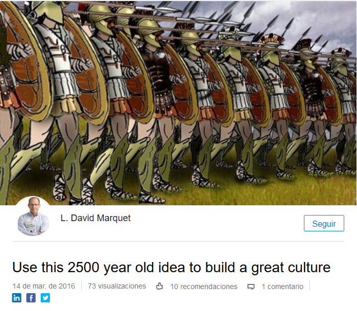
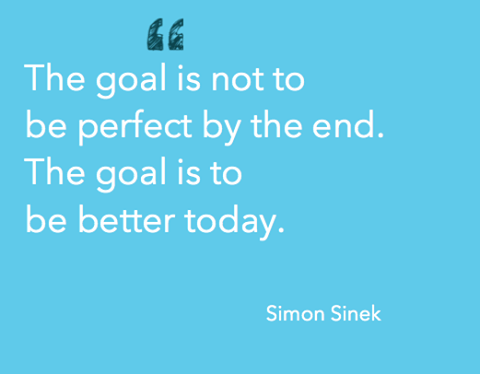
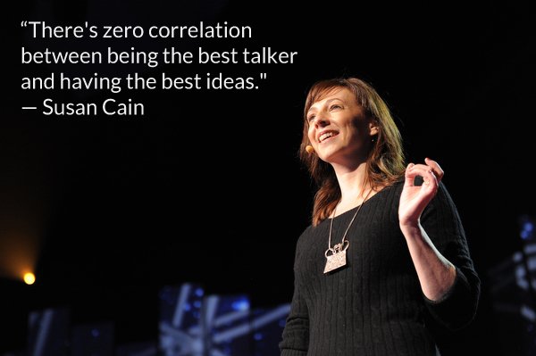

<!-- MarkdownTOC -->

- [Leadership Blogs](#leadership-blogs)
    - [Leaders on Twitter](#leaders-on-twitter)

<!-- /MarkdownTOC -->

# Leadership Blogs
- [forbes.com/leadership](http://www.forbes.com/leadership)
- [Addicted to success](http://addicted2success.com)
- [Quiet Revolution: Unlocking the Power of Introverts. Susan Cain](http://www.quietrev.com)

## Leaders on Twitter
- [twitter.com/TEDTalks](https://twitter.com/TEDTalks)
- [twitter.com/DanielPink](https://twitter.com/DanielPink)
- [twitter.com/Inc](https://twitter.com/Inc)
- [twitter.com/simonsinek 🌟](https://twitter.com/simonsinek)
- [Susan Cain 🌟](https://twitter.com/susancain)
- [facebook.com/ldavidmarquet](https://www.facebook.com/ldavidmarquet/)
- [twitter.com/Ldavidmarquet](https://twitter.com/Ldavidmarquet)
- [twitter.com/Autorrealizarte](https://twitter.com/Autorrealizarte)

<iframe src="https://embed-ssl.ted.com/talks/susan_cain_the_power_of_introverts.html" width="640" height="360" frameborder="0" scrolling="no" webkitAllowFullScreen mozallowfullscreen allowFullScreen class="video"></iframe>

 

<iframe width="420" height="315" src="https://www.youtube-nocookie.com/embed/llKvV8_T95M?rel=0" frameborder="0" allowfullscreen class="video"></iframe>

 

<iframe width="560" height="315" src="https://www.youtube.com/embed/qp0HIF3SfI4?rel=0" frameborder="0" allowfullscreen class="video"></iframe>

 

<iframe width="560" height="315" src="https://www.youtube.com/embed/6SOTBHAcLV4?rel=0" frameborder="0" allowfullscreen class="video"></iframe>

 

<blockquote class="twitter-tweet tw-align-center" data-lang="es">
Love your work and do good for others. <a href="https://t.co/Lv4zdPQwiG">https://t.co/Lv4zdPQwiG</a> <a href="https://twitter.com/hashtag/visie?src=hash">#visie</a> <a href="https://twitter.com/hashtag/leiderschap?src=hash">#leiderschap</a> <a href="https://twitter.com/hashtag/hrm?src=hash">#hrm</a> <a href="https://twitter.com/hashtag/simonsinek?src=hash">#simonsinek</a>
&mdash; Martijn van Iersel (@MartijnvIersel) <a href="https://twitter.com/MartijnvIersel/status/651826680802189312">7 de octubre de 2015</a></blockquote>

<iframe width="560" height="315" src="https://www.youtube.com/embed/QKmnLiAGj10?rel=0" frameborder="0" allowfullscreen class="video"></iframe>

 