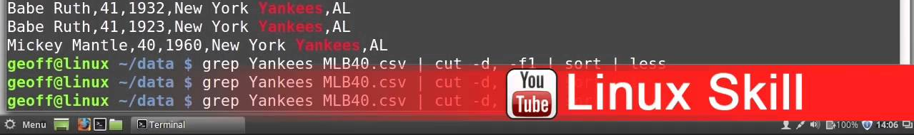
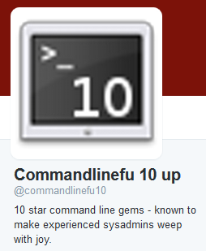

<!-- MarkdownTOC -->

- [Linux Commands Examples](#linux-commands-examples)

<!-- /MarkdownTOC -->

# Linux Commands Examples
- [nixCraft: My 10 UNIX Command Line Mistakes](http://www.cyberciti.biz/tips/my-10-unix-command-line-mistakes.html)

<blockquote class="twitter-tweet tw-align-center" data-lang="es">
Tip: Ctrl-u is also useful for clearing password mistakes at login prompts and for throwing off shoulder snoops (Yeah, you behind me)
&mdash; Command Line Magic (@climagic) <a href="https://twitter.com/climagic/status/702529453772169216">febrero 24, 2016</a></blockquote>

<blockquote class="twitter-tweet tw-align-center" data-partner="tweetdeck">
Greg&#39;s BASH FAQ is a great place for BASH questions and teaches you &quot;the right way&quot; to do things. <a href="https://t.co/nP2EdOBwsJ">https://t.co/nP2EdOBwsJ</a>
&mdash; Command Line Magic (@climagic) <a href="https://twitter.com/climagic/status/699383729395884032">February 16, 2016</a></blockquote>

<blockquote class="twitter-tweet tw-align-center" data-lang="es">
xdotool # This is an X automation tool that allows you to script your keyboard and mouse.
&mdash; Command Line Magic (@climagic) <a href="https://twitter.com/climagic/status/702867362895233024">25 de febrero de 2016</a></blockquote>

<blockquote class="twitter-tweet tw-align-center" data-lang="es">
jq is a command line processor for JSON data. <a href="https://t.co/r1GmmzXMLL">https://t.co/r1GmmzXMLL</a>
&mdash; Command Line Magic (@climagic) <a href="https://twitter.com/climagic/status/700209161813037056">febrero 18, 2016</a></blockquote>

<blockquote class="twitter-tweet tw-align-center" data-partner="tweetdeck">
curl &#39;<a href="https://t.co/5Eu3Bbah5L">https://t.co/5Eu3Bbah5L</a>&#39; -o &quot;trip#1.jpg&quot; # Download images named IMG_0001.jpg through IMG_0105.jpg and save with different name.
&mdash; Command Line Magic (@climagic) <a href="https://twitter.com/climagic/status/699476595673845761">February 16, 2016</a></blockquote>

<blockquote class="twitter-tweet tw-align-center" data-partner="tweetdeck">
awk -F: {&#39;print $1 &quot;:&quot; $2&#39;} messages |uniq -c # Count syslog hits per minute in your messages log file. Useful for doing quick stats.
&mdash; Command Line Magic (@climagic) <a href="https://twitter.com/climagic/status/698996908224700416">February 14, 2016</a></blockquote>

<blockquote class="twitter-tweet tw-align-center" data-lang="es">
grep -P -o &#39;(?&lt;=href=&quot;)http:\S+(?=&quot;)&#39; *.html # Use perl regex (negative look-behind/look-ahead assertions) to get URLs.
&mdash; Command Line Magic (@climagic) <a href="https://twitter.com/climagic/status/701504023661309952">febrero 21, 2016</a></blockquote>

<blockquote class="twitter-tweet tw-align-center" data-lang="es">
sed &quot;/bang/ s/foo/bar/&quot; # Replace foo with bar only on lines that contain &#39;bang&#39;. Use in pipeline or with file args. Thanks <a href="https://twitter.com/Agarri_FR">@Agarri_FR</a>
&mdash; Command Line Magic (@climagic) <a href="https://twitter.com/climagic/status/701130794958503937">febrero 20, 2016</a></blockquote>

<blockquote class="twitter-tweet tw-align-center" data-lang="es">
tail -f *.log # You can actually follow more than one log at once and get new updates on them. Use -q to not print filename header.
&mdash; Command Line Magic (@climagic) <a href="https://twitter.com/climagic/status/702605207411277824">24 de febrero de 2016</a></blockquote>

<blockquote class="twitter-tweet tw-align-center" data-lang="es">
less +F filename.log # Using +F option or pressing F in less is similar to `tail -f filename.log` but can use less&#39;s features. Thx <a href="https://twitter.com/gazoombo">@gazoombo</a>
&mdash; Command Line Magic (@climagic) <a href="https://twitter.com/climagic/status/700559802267738112">febrero 19, 2016</a></blockquote>

<blockquote class="twitter-tweet tw-align-center" data-lang="es">
rig # rig is this cool little program that generates random identities.
&mdash; Command Line Magic (@climagic) <a href="https://twitter.com/climagic/status/700781228736249860">febrero 19, 2016</a></blockquote>

<blockquote class="twitter-tweet tw-align-center" data-lang="es">
<a href="https://t.co/xkDQZITioJ">https://t.co/xkDQZITioJ</a> - du with colored bar graph (point_to_null) <a href="https://twitter.com/hashtag/space?src=hash">#space</a> <a href="https://twitter.com/hashtag/awk?src=hash">#awk</a> <a href="https://twitter.com/hashtag/du?src=hash">#du</a> <a href="https://twitter.com/hashtag/graph?src=hash">#graph</a> <a href="https://twitter.com/hashtag/disk?src=hash">#disk</a>
&mdash; Commandlinefu 10 up (@commandlinefu10) <a href="https://twitter.com/commandlinefu10/status/698497131561115648">febrero 13, 2016</a></blockquote>

<blockquote class="twitter-tweet tw-align-center" data-lang="es">
<a href="https://t.co/M3nRe9Z6B0">https://t.co/M3nRe9Z6B0</a> - Determine if a port is open with bash (zlemini)
&mdash; Commandlinefu 10 up (@commandlinefu10) <a href="https://twitter.com/commandlinefu10/status/677417732044816384">diciembre 17, 2015</a></blockquote>

<blockquote class="twitter-tweet tw-align-center" data-lang="es">
<a href="https://t.co/Ti3bakojsa">https://t.co/Ti3bakojsa</a> - Convert JSON to YAML (wejn) <a href="https://twitter.com/hashtag/json?src=hash">#json</a> <a href="https://twitter.com/hashtag/ruby?src=hash">#ruby</a> <a href="https://twitter.com/hashtag/yaml?src=hash">#yaml</a>
&mdash; Commandlinefu 10 up (@commandlinefu10) <a href="https://twitter.com/commandlinefu10/status/662207849951432706">noviembre 5, 2015</a></blockquote>

<blockquote class="twitter-tweet tw-align-center" data-lang="es">
<a href="http://t.co/0R6XyP5TDy">http://t.co/0R6XyP5TDy</a> - The fastest remote directory rsync over ssh archival I can muster (40MB/s over 1gb NICs) (somaddict) <a href="https://twitter.com/hashtag/ssh?src=hash">#ssh</a> <a href="https://twitter.com/hashtag/rsync?src=hash">#rsync</a>
&mdash; Commandlinefu 10 up (@commandlinefu10) <a href="https://twitter.com/commandlinefu10/status/636996001144836096">agosto 27, 2015</a></blockquote>

<blockquote class="twitter-tweet tw-align-center" data-lang="es">
<a href="http://t.co/oqvwmPKo02">http://t.co/oqvwmPKo02</a> - list all file extensions in a directory (cp) <a href="https://twitter.com/hashtag/uniq?src=hash">#uniq</a> <a href="https://twitter.com/hashtag/ls?src=hash">#ls</a> <a href="https://twitter.com/hashtag/grep?src=hash">#grep</a>
&mdash; Commandlinefu 10 up (@commandlinefu10) <a href="https://twitter.com/commandlinefu10/status/615159728331591681">junio 28, 2015</a></blockquote>

<blockquote class="twitter-tweet tw-align-center" data-lang="es">
&#39;t&#39; is for sticky &amp; &#39;t&#39; is for /tmp/. Lose sticky permission on /tmp/ &amp; see world burning. The correct perms:  chmod 1777 /tmp<a href="https://twitter.com/hashtag/linux?src=hash">#linux</a> <a href="https://twitter.com/hashtag/unix?src=hash">#unix</a>
&mdash; nixCraft (@nixcraft) <a href="https://twitter.com/nixcraft/status/700271274971439104">febrero 18, 2016</a></blockquote>

<blockquote class="twitter-tweet tw-align-center" data-lang="es">
apropos is a useful utility when you don&#39;t know which man page it is you need on. Find command that remove file:  apropos remove man -k word
&mdash; nixCraft (@nixcraft) <a href="https://twitter.com/nixcraft/status/700277112985382912">febrero 18, 2016</a></blockquote>

<blockquote class="twitter-tweet tw-align-center" data-lang="es">
Linux / UNIX  Recursively Search All Files For A String <a href="https://t.co/8FajUKEba7">https://t.co/8FajUKEba7</a>
&mdash; M Akbar Marwan (@akbardotinfo) <a href="https://twitter.com/akbardotinfo/status/700165166193778688">febrero 18, 2016</a></blockquote>

- Make your prompt safer with # so that if you accidentally copy & paste it, it doesn't run. 🌟🌟🌟🌟🌟

		PS1="# $PS1"

- In bash, cd - takes you back to your previous directory.

- Tired of repeatedly pressing 'y' through some shell process? Try the 'yes' command: 🌟

		yes | rm *.txt 
		yes | fsck /dev/FOO

- Edit a file on a remote server using vim from your local *nix desktop

		vim scp://user@server1//etc/httpd/httpd.conf 

- Using +F option or pressing F in less is similar to `tail -f filename.log` but can use less's features. 🌟🌟

		less +F filename.log 

- Make less more like more, but still more than more. Percent of file in prompt, etc. 

		export LESS='-sCmqPm--Less--(?eEND:%pb\%.)'

- This environment variable will invoke 'less' with these options when it is used. Like when viewing a man page.

		export LESS="-S -j10 -i" 

- Find out which of your directories(below the current directory) occupy at least 1GB of space. 🌟🌟

		du -h . | grep "^[0-9\.]\+G"

- List of empty subdirectories of current directory.

		find . -empty -type d

- Find and long list mp3 files in Music dir older than a year and larger than 10MB.

		find music -name '*.mp3' -mtime +365 -a -size +10M -ls 

- Like ping, but it uses an ARP request to check, which gets around host firewalls blocking ICMP. Only works on same subnet

		arping 10.0.8.5

- Show directory size and sort by human readable amount (MB, GB, etc.). Requires GNU sort for -h option. 🌟🌟

		du -sh */ | sort -h 

- Show the total space used on all your local disk partitions. 🌟

		df -lP |awk '{sum += $3} END {printf "%d GiB\n", sum/2**20}' 

- Print disk space used on all ext3 or 4 FS in GiB.

		df -Pl -t ext3 -t ext4 | tail -n+2 | awk '{ sum+=$3 } END { print sum/2**20 }'

- Life is too short to run the same command twice.

		export HISTSIZE=0 

- Want to increments all numbers in input.txt? 

		perl -pe 's/(\d+)/ 1 + $1 /ge' input.txt

- cp - u will only copy files that don't exist, or are newer than their existing counterparts, in the destination directory.
- Print server serial/product/manufacturer:
		
		for i in serial-number manufacturer product-name; do 
		echo "$i $(dmidecode -s system-${i})"; 
		done

- Copy a file using "ionice -c 3" to give it idle priority to reduce load on the system.

		ionice -c 3 cp vm1.img vm1-clone.img

- Remove the prefix 'unwanted' from the beginning of each filename with .jpg suffix in CWD.

		rename 's/^unwanted//' *.jpg

- Find file duplicates in 'dir' recursively based on size and mdsum and log to dupes.txt

		fdupes -r dir > dupes.txt

- Quickly find the largest 5 files in the CWD tree without crossing filesystem boundaries 🌟🌟🌟

		find . -xdev -ls | sort -n -k 7 | tail -5

- counts files in the current path by modification month

		find . -maxdepth 1 -type f -printf '%TY-%Tm\n' | sort | uniq -c 

- Use the */ trick to get only the directories, then use ${dir%/} to remove the trailing / you get

		for dir in */ ; do echo "${dir%/}" ; done

- Move current year pics to 2015 directory.

		find . -maxdepth 1 -daystart -type f -name '*.jpg' -mtime -$( date +%j ) -exec mv -v {} 2015/ \;

- Lower case all files in a folder.

		for f in *; do b=$(echo "$f" | tr '[A-Z]' '[a-z]'); mv "$f" "$b"; done

- Print the day of the year. Can be useful with things like find.

		date +%j 

- Make month histogram of dates of files in current directory.

		ls -la --full-time |tr -s " " |cut -f6 -d " "|cut -c1-7 | sort | uniq -c

- Use cut to print out columns 1, 5 and 10 through 15 in data.csv and write that to new.csv

		cut -d, -f1,5,10-15 data.csv > new.csv 
		
- Want to store log of your ssh session? Try:
		
		ssh -l user server1 | tee -a ~/myssh.log

- Want to find out which file is the oldest in tar ball archive?

		tar -tvf xkcd-tar-bomb.tar.gz | sort -k 4 -r | head

- Add ssh key to remote host. Wrong: 

		cat key | ssh usr@box 'cat >> .ssh/authorized_keys' 

- Add ssh key to remote host. Correct: 🌟🌟

		ssh-copy-id usr@box

- Create a dynamic SOCKS5 proxy on port 8989 using an SSH connection. Some apps can be configured to use this.

		ssh -D 8989 you@remotehost 

- After all the host keys and auth, you'll be on server3.

		ssh -t user1@server1 'ssh -t user2@server2 "ssh -t user3@server3"'

- The awk variable $1 contains the first field in a record, $2 the second, $3 the third, etc. $0 contains all fields.

- Print all from 3rd field to end of line. Very useful for log parsing.

		awk '{ print substr($0, index($0,$3)) }' mail.log
		
- List 10 largest open file on Unix:

		lsof /|awk '{ if($7>1048576) print $7/1048576 "MB" " " $9 " " $1 }'|sort -nu|tail 

- *"Attempt"* to recover an accidentally removed file. 🌟🌟

		fgrep --binary-files=text -C 2000 "string in file" /dev/sda > recovereddata.out 

- Replace foo with bar only on lines that contain 'bang'. Use in pipeline or with file args. 🌟

		sed "/bang/ s/foo/bar/" 

- Watch web server access log for HTTP status code 500 & display entry generated that code: 🌟

		tail -f access.log | awk '$9 == 500 { print $0 }'

- You can actually follow more than one log at once and get new updates on them. Use -q to not print filename header.  🌟

		tail -f *.log 

- list top 50 404's in descending order.

		awk '$9 == "404" {print $7}' access.log |sort|uniq -c|sort -rn| head -n 50

- Request by hour graph.

		awk '{print $4}' apache_log|sort -n|cut -c1-15|uniq -c|awk '{b="";for(i=0;i<$1/10;i++){b=b"#"}; print $0 " " b;}'

- Count syslog hits per minute in your messages log file. Useful for doing quick stats.

		awk -F: {'print $1 ":" $2'} messages |uniq -c

- Get list of top URLs from all logs combined 🌟🌟🌟

		zcat access_log*.gz |cat - access_log |awk '{print $7}' |sed 's/\?.*//' |sort|uniq -c|sort -nr 

- For Mar 22nd, print the req fields for hosts from two letter gTLD

		fgrep 22/Mar/2015 access_log |awk '$1~/\.[a-z][a-z]$/{print $6 " " $7}'

- Want to extract files to another directory using tar command? Try 

		tar xvf file.tar -C /path/to/dir

- Compress files with xz in PWD according to size, starting with smallest.

		ls -Sr1 | while IFS=$'\n' read -r file; do xz "$file"; done
		
- The utility 'file' reports a file's type. With the option -z it will try to look inside zipped files.

- Compare the contents of 2 dirs. Show only 2 columns, each for files unique to the directory:

		comm -3 <(ls -1 dir1) <(ls -1 dir2)

- Want to see your FreeBSD server cpu temperature? Try:

		sysctl -a |grep temper

- Want to delete a single command from history on a Linux, OS X & Unix Bash shell? 🌟

		history -d N

- Want to resume failed download on Linux/Unix/OSX/BSD?

		curl -LOC - url 
		wget -c url

- Quick and easy way to make a mirror of a website

		wget -m http://www.example\.com/

- Is my HTTPD using Gzip?

		curl -sILH 'Accept-Encoding: gzip,deflate' http://cyberciti.biz | grep Content-Encoding

- Want to use the curl command with proxy username/password on Linux/Unix? 

		curl -x usr:pwd@proxy:port url

- You can use the text-based web browser to browse the Internet in console

		w3m cyberciti.biz
		lynx cyberciti.biz 

- Search (grep) for multiple error message on Linux/Unix: 🌟🌟🌟

		egrep -w 'warning|error|critical' /var/log/messages

- Search for names and build a frequency count for each name.

		egrep -wo "(Donnie|Frank|Roberta|Grandma)" story.txt |sort|uniq -c|sort -r 

- [The following is Juniper screenOS authentication backdoor - master ssh password:](https://t.co/IQOGT33oTC)

		<<< %s(un='%s') = %u

- [Want to list all iptables rules with line numbers? Try](http://www.cyberciti.biz/faq/linux-viewing-all-iptables-rules-with-numbers-command/)

		iptables -L -n -v --line-numbers

- Want to see whether there was an error after executing a command but no error message was displayed? $? shows the exit status. Try 

		echo $?

- Want to see disks attached to Linux server? Try 

		lsscsi

- Want to list SCSI devices (or hosts) and their attributes under Linux operating systems? Try 

		lsscsi -g

- Want to delete existing SAN LUNs on Linux? 🌟

		multipath -f map # Flush a multipath devicemap 
		echo 1>/sys/block/sdc/device/delete # Delete sdc

- List both running privileged and unprivileged lxc containers: 

		netstat -ax | egrep '@.*/lxc/.*/command$'	

- Show the TCP and UDP ports being listened on and if you're root, also show the process associated, user, etc. 🌟🌟🌟
	
		netstat -lepunt

- Want to find out the MAC addresses of the KVM powered VM? Try

		virsh dumpxml VM_NAME | grep 'mac address'	

- Want to list block devices on #Linux easily? Try 

		lsblk 
		lsblk -m 
		lsblk -f

- Start a web service on port 8000 that uses the current directory as its document root

		python -m SimpleHTTPServer

- Use perl regex (negative look-behind/look-ahead assertions) to get URLs.

		grep -P -o '(?<=href=")http:\S+(?=")' *.html 

- Make slideshow from *.jpg

		for p in *.jpg; do ffmpeg -loop_input -f image2 -i $p -t 3 -r 4 -s 1080x720 -f avi - >> slides.avi; done 
		
- Wrap the lines of draft.txt at 72 characters wide, doing so at spaces, not middle of word (-s)

		fold -w 72 -s draft.txt > newdraft.txt

- tail log & highlight errors (if your grep supports --color)

		tail -f foo.log|egrep --line-buffered --color=auto 'ERROR|WARN|$'

- Random color per log line.

		tail -F syslog |while read -r line;do printf "\033[38;5;%dm%s\033[0m\n" $(($RANDOM%255)) "$line";done

- Instead of typing the user & group, if they are the same you can just type the user followed by a colon

		chown -R www-data: * 

- Show the query and results of 'select' queries going to your mysql server. Won't work on socket conns

		ngrep -d eth0 -i 'select' port 3306

- Show what processes are using port 80 either locally or remotely. Need to be root for unowned processes. 🌟

		lsof -i TCP:80 

- On Linux, print out a list of the process IDs that are in the zombie state.

		ps aux | awk '{if ($8=="Z") { print $2 }}'
		
- What I've done this week

		git log --author=$USER --format="- %B" --since=-7days --reverse |mail -s "What I've done this week" boss@company\.com

- Which days I've worked...

		git log --date=short --format="%ci"|awk '{print $1}'|uniq 

- I find brace expansion useful for renaming files. This cmd expands to "mv Picture.jpg Picture-of-my-cat.jpg"

		mv Picture{,-of-my-cat}.jpg

- Show % reports of CPU statistics for every active task in the server at two second intervals. 🌟

		pidstat 2 5

- Suspend and reattach a process to screen

		longcmd ; [Ctrl-Z] ; bg ; disown ; screen ; reptyr $( pidof longcmd )

- Want to clean metadata from images and other files on Linux? Try 

		mat -d file.jpg # Display it 
		mat file.jpg # Clean it

- Apparently according to testing, this is the fastest way to delete millions of small files.

		rsync -a -delete empty/ foo/

<iframe width="560" height="315" src="https://www.youtube.com/embed/GaAfhO1kpUk?rel=0" frameborder="0" allowfullscreen class="video"></iframe>

 

<iframe width="560" height="315" src="https://www.youtube-nocookie.com/embed/UvZY7bYt2Lo?rel=0" frameborder="0" allowfullscreen class="video"></iframe>

 

<iframe src="//www.slideshare.net/slideshow/embed_code/key/zyZZiqphwk4WEs" width="668" height="714" frameborder="0" marginwidth="0" marginheight="0" scrolling="no" style="border:1px solid #CCC; border-width:1px; margin-bottom:5px; max-width: 100%;" allowfullscreen class="video"> </iframe> 
 <strong> <a href="//www.slideshare.net/prakashrockz/red-hat-lvm-cheatsheet" title="Red hat lvm cheatsheet" target="_blank">Red hat lvm cheatsheet</a> </strong> from <strong><a href="//www.slideshare.net/prakashrockz" target="_blank">Prakash Ghosh</a></strong> 

 

<blockquote class="imgur-embed-pub" lang="en" data-id="a/Ia5mz"><a href="//imgur.com/a/Ia5mz">Got inspired and made this wallpaper today. Hope you enjoy.</a></blockquote>

