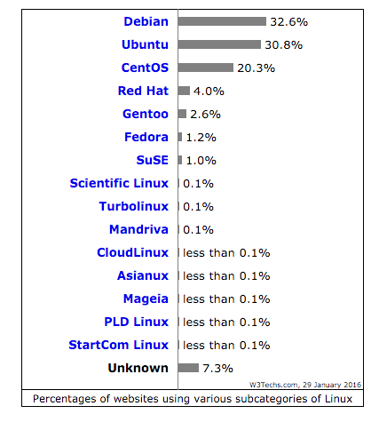
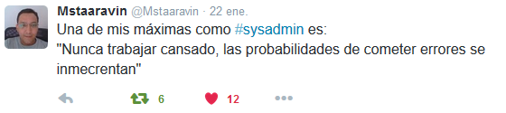
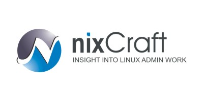
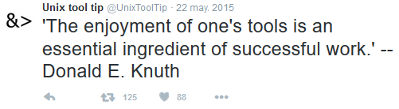
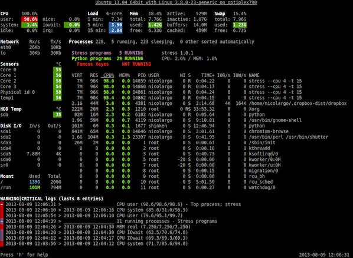
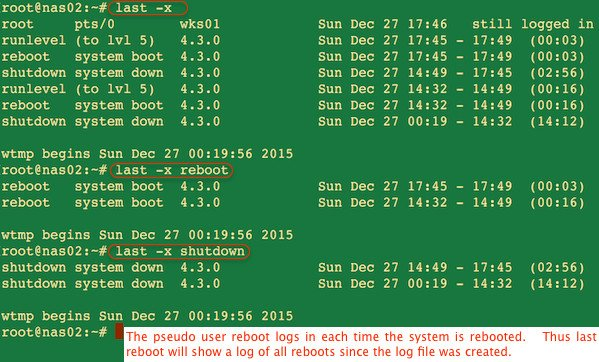
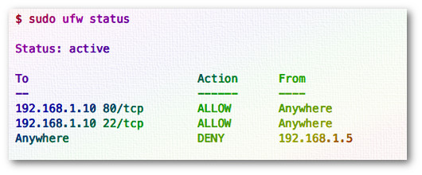
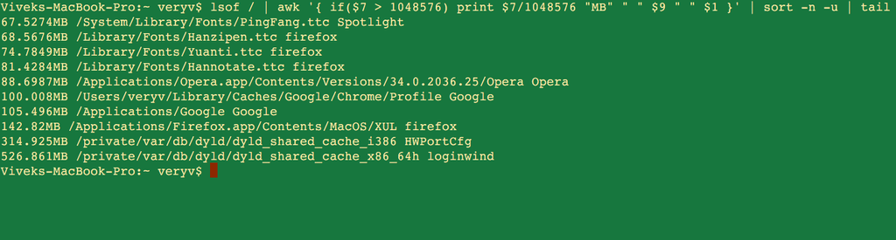

**Table of Contents**
<!-- MarkdownTOC -->

- [Linux](#linux)
	- [Linux and FOSS Blogs and Forums](#linux-and-foss-blogs-and-forums)
		- [Best Linux Blogs](#best-linux-blogs)
		- [Alternatives](#alternatives)
	- [FOSS youtube channels](#foss-youtube-channels)
	- [Linux on Twitter](#linux-on-twitter)
	- [Linux References](#linux-references)
		- [Linux web tools](#linux-web-tools)
		- [BashHub Bash History in the Cloud](#bashhub-bash-history-in-the-cloud)
		- [Linux storage](#linux-storage)
		- [Linux processes](#linux-processes)
		- [Linux user accounts](#linux-user-accounts)
		- [Linux backups](#linux-backups)
		- [Downgrade or Rollback Updates](#downgrade-or-rollback-updates)
		- [man pages on steroids with examples](#man-pages-on-steroids-with-examples)
		- [Linux bash](#linux-bash)
		- [Command line text manipulation tools](#command-line-text-manipulation-tools)
		- [Linux Terminals](#linux-terminals)
		- [Linux Virtualization](#linux-virtualization)
		- [FOSS Software](#foss-software)
	- [Linux Performance](#linux-performance)
	- [Linux Networking](#linux-networking)
		- [Networking FOSS Tools](#networking-foss-tools)
		- [Networking CLI and settings](#networking-cli-and-settings)
	- [Linux Security](#linux-security)
		- [SELinux, AppArmor and OpenSCAP](#selinux-apparmor-and-openscap)
	- [Vim and Emacs](#vim-and-emacs)
		- [Vim](#vim)
		- [Emacs](#emacs)
			- [Jed](#jed)
		- [Python Idle](#python-idle)
	- [Apple OS X](#apple-os-x)
	- [Linux Commands Examples](#linux-commands-examples)
- [Red Hat](#red-hat)
	- [Red Hat on Twitter](#red-hat-on-twitter)
	- [Red Hat Blogs and Forums](#red-hat-blogs-and-forums)
	- [Red Hat Docs](#red-hat-docs)
		- [Fedora](#fedora)
	- [Red Hat Insights. Modern infrastructure management](#red-hat-insights-modern-infrastructure-management)
	- [Cockpit web based server manager](#cockpit-web-based-server-manager)
	- [Red Hat Virtualization](#red-hat-virtualization)
	- [Red Hat OpenShift PaaS](#red-hat-openshift-paas)
	- [Red Hat OpenStack](#red-hat-openstack)
	- [Red Hat Storage](#red-hat-storage)
	- [Red Hat and IBM](#red-hat-and-ibm)
	- [Red Hat and AWS](#red-hat-and-aws)
		- [Red Hat Server with GUI and remote access with RDP](#red-hat-server-with-gui-and-remote-access-with-rdp)
	- [Red Hat Mobile Application Platform: Feed Henry](#red-hat-mobile-application-platform-feed-henry)
	- [GlassFish](#glassfish)
	- [JBoss (WildFly)](#jboss-wildfly)
		- [JBoss Blogs](#jboss-blogs)
		- [JBoss on Twitter](#jboss-on-twitter)
		- [JBoss GateIn, Exo, Forge, Forums, Developer Studio, Arquillian Testing Platform, and others](#jboss-gatein-exo-forge-forums-developer-studio-arquillian-testing-platform-and-others)
		- [JBoss Resources](#jboss-resources)
		- [JBoss BPM Suite and JBoss BRMS](#jboss-bpm-suite-and-jboss-brms)
		- [JBoss Fuse - Enterprise Service Bus (ESB)](#jboss-fuse---enterprise-service-bus-esb)
		- [JBoss Data Virtualization](#jboss-data-virtualization)
		- [JBoss Data Grid](#jboss-data-grid)
	- [Red Hat Development](#red-hat-development)
	- [Red Hat Varnish](#red-hat-varnish)
	- [Red Hat Videos](#red-hat-videos)
- [Ubuntu](#ubuntu)
- [Microsoft](#microsoft)
	- [Microsoft Monitoring and Management](#microsoft-monitoring-and-management)
- [VirtualBox](#virtualbox)
- [VMware](#vmware)

<!-- /MarkdownTOC -->

# Linux
- [7 Steps to Start Your Linux SysAdmin Career](https://www.linux.com/news/featured-blogs/191-linux-training/834644-7-steps-to-start-your-linux-sysadmin-career)
- [medium.com: I Moved to Linux and It’s Even Better Than I Expected](https://medium.com/backchannel/i-moved-to-linux-and-it-s-even-better-than-i-expected-9f2dcac3f8fb#.ifoqwzclj)
- [Best Linux Distros For Newcomers](http://www.datamation.com/open-source/best-linux-distros-for-newcomers.html)
- [Predictably, it is hard to make money from something that is free. That includes Linux](http://www.theworldin.com/article/12077/what-next-linux) Only one Linux company has made it big: Red Hat, which is expected to take about  $2 billion in its 2015 financial year, mostly by selling support services to users of the operating system and other open-source programs. The main beneficiaries of such software have been operators of huge data centres, such as Amazon, Facebook and Google, which wouldn’t be able to offer cheap cloud-computing services if they had to pay for the software.

## Linux and FOSS Blogs and Forums

### Best Linux Blogs
- [commandlinefu.com](http://commandlinefu.com/)
- [Tecmint.com Linux Howto's Guide](http://www.tecmint.com/)
- [nixCraft/cyberciti.biz: Linux Tips, Hacks, Tutorials, And Ideas In Blog](http://www.cyberciti.biz/)
- [Sysadmincasts.com](http://sysadmincasts.com)
	- [Episode Guide](https://sysadmincasts.com/episode-guide)
- [Linux Home Networking | Tutorials and Forums](http://www.linuxhomenetworking.com/)
- [Linuxadmin 'subreddit'](https://www.reddit.com/r/linuxadmin)
- [HowtoForge Linux Tutorials](https://www.howtoforge.com/)
- [LinuxPitstop: Linux Tips, Techniques, HowTo's & Open Source News](http://linuxpitstop.com/)

### Alternatives
- [FOSS Force](http://fossforce.com/)
- [opensource.com](https://opensource.com/)
- [Linux.com](http://www.linux.com/)
- [The Linux Foundation](http://www.linuxfoundation.org/)
- [LinuxJournal](http://www.linuxjournal.com)
- [linuxtoday.com](http://www.linuxtoday.com/)
- [Xmodulo - Linux FAQs, tips and tutorials](http://xmodulo.com)
- [MyLinuxSoftware.com: A Linux Software Directory for GUI and Console Apps](http://www.mylinuxsoftware.com/)
- [unixetc.co.uk](http://unixetc.co.uk/)
- [LWN.net](http://lwn.net/)
- [Linux-tutorial.info](http://www.linux-tutorial.info/)
- [The Lone Sysadmin](https://lonesysadmin.net/)
- [Linux 101 Hacks](http://linux.101hacks.com/)
- [Linoxide.com](http://linoxide.com/)
- [LinuxLinks.com](http://www.linuxlinks.com)
- [The Geek Stuff | Linux | DB | Open Source | Web](http://www.thegeekstuff.com/)
- [cathcam.wordpress.com - blogger](https://cathcam.wordpress.com/)
- [tech.paulcz.net](http://tech.paulcz.net/#blog)
- [Benjamin Cane](http://bencane.com/) A Systems Architect writing about Linux Systems Administration
- [chruz.wordpress.com](https://chruz.wordpress.com) Linux, OpenStack & Provisioning

## FOSS youtube channels
- [Sysadmincasts.com - Episode Guide](https://sysadmincasts.com/episode-guide)
- [SourceForge](https://www.youtube.com/channel/UC4Y3JZq09X-xMYVbXH8xpZA)
- [Linux/Unix Video Tutorials - nixCraft](https://www.youtube.com/user/nixcraftcom)
- [TecMint.com](https://www.youtube.com/channel/UCkiRkzdLvoGBtW_YArytJlQ)

## Linux on Twitter
- [@nixcraft](https://twitter.com/nixcraft)
- [UnixToolTip](https://twitter.com/UnixToolTip)
- [Command Line Magic](https://twitter.com/climagic)
- [Shell OSS](https://twitter.com/oss_sh)
- [Tecmint](https://twitter.com/tecmint)
- [RegexTip](https://twitter.com/RegexTip)
- [github](https://twitter.com/github)
- [twitter.com/linuxfoundation](twitter.com/linuxfoundation)
- [twitter.com/LinuxDotCom](https://twitter.com/LinuxDotCom)
- [twitter.com/linuxtoday](https://twitter.com/linuxtoday)
- [twitter.com/LinuxDotCom](https://twitter.com/LinuxDotCom)
- [twitter.com/LinuxUserMag](https://twitter.com/LinuxUserMag)
- [https://twitter.com/Linux](https://twitter.com/Linux)

<iframe width="560" height="315" src="https://www.youtube.com/embed/oBZ1-E_NcMg" frameborder="0" allowfullscreen class="video"></iframe>

 

## Linux References
- [Linux and Unix SysAdmins New Year’s Resolutions (2016)](http://www.cyberciti.biz/linux-news/linux-and-unix-sysadmins-new-years-resolutions-2016/)
- [certsimple.com: How to deploy your node app on Linux, 2016 edition](https://certsimple.com/blog/deploy-node-on-linux)
- [Linux Command: Show Linux Version](http://www.cyberciti.biz/faq/command-to-show-linux-version/)

### Linux web tools
- [curl Command Resume Broken Download](http://www.cyberciti.biz/faq/curl-command-resume-broken-download/)
- [Wget: Resume Broken Download](http://www.cyberciti.biz/tips/wget-resume-broken-download.html)
- [GoAccess real time web log analyzer](http://goaccess.io/)
- [A curl cheat sheet](http://daniel.haxx.se/blog/2015/09/16/a-curl-cheat-sheet/)
- [How to use curl command with proxy username and password on Linux or Unix](http://www.cyberciti.biz/faq/linux-unix-curl-command-with-proxy-username-password-http-options/)
- [DZone: Quickly Share a Folder Using HTTP On a Linux Host](https://dzone.com/articles/quickly-share-a-folder-using-http-on-a-linux-host)
- [How to Optimize and Compress JPEG or PNG Images in Linux Commandline](http://www.tecmint.com/optimize-and-compress-jpeg-or-png-batch-images-linux-commandline/)

### BashHub Bash History in the Cloud
- [BashHub](https://bashhub.com/)
- [twitter.com/bashhub](https://twitter.com/bashhub)

### Linux storage
- [Linux: Use smartctl To Check Disk Behind Adaptec RAID Controllers](http://www.cyberciti.biz/faq/linux-checking-sas-sata-disks-behind-adaptec-raid-controllers/)
- [Linux/Unix pv Command: Monitor Progress of Data Sent Via a Pipe](http://www.cyberciti.biz/open-source/command-line-hacks/pv-command-examples/)
- [agedu: Unix/Linux Command For Tracking Down Wasted Disk Space](http://www.cyberciti.biz/hardware/linux-find-and-recover-wasted-disk-space/)
- [Linux lsscsi: See List Of All SCSI/SATA Hard Disks and CD/DVD Drives](http://www.cyberciti.biz/faq/debian-ubuntu-linux-list-scsi-devices-hosts-attributes-lsscsi-command/)

### Linux processes
- [Linux: Find Out Which Process Is Listening Upon a Port](http://www.cyberciti.biz/faq/what-process-has-open-linux-port/)
- [tecmint.com: A Guide to Kill, Pkill and Killall Commands to Terminate a Process in Linux](http://www.tecmint.com/how-to-kill-a-process-in-linux/)
- [Sysadmincasts.com: LVM Linear vs Striped Logical Volumes](https://sysadmincasts.com/episodes/27-lvm-linear-vs-striped-logical-volumes)
	- [youtube: How To Install CentOS 6 Software RAID & LVM ](https://www.youtube.com/watch?v=nsdwScqjuCU)
- [unixetc.co.uk: Profiling and Tracing Processes in Linux](http://unixetc.co.uk/2012/10/28/profiling-and-tracing-processes-in-linux/)
- [ibm.com: Use the /proc filesystem to get a handle on your system](http://www.ibm.com/developerworks/linux/library/l-adfly/index.html)
- [Linux Server See the Historical and Statistical Uptime of System With tuptime Utility](http://www.cyberciti.biz/hardware/howto-see-historical-statistical-uptime-on-linux-server/)

### Linux user accounts
- [cyberciti.biz: Linux Find Out Last System Reboot Time and Date Command](http://www.cyberciti.biz/tips/linux-last-reboot-time-and-date-find-out.html)

### Linux backups
- [cyberciti.biz: How To Avoid Sudden Outburst Of Backup Shell Script or Program Disk I/O on Linux](http://www.cyberciti.biz/tips/linux-set-io-scheduling-class-priority.html)
- [luckybackup.sourceforge.net: is an application for data back-up and synchronization powered by the rsync tool](http://luckybackup.sourceforge.net/)
- [15 Useful Linux and Unix Tape Managements Commands For Sysadmins](http://www.cyberciti.biz/hardware/unix-linux-basic-tape-management-commands/)
- [cyberciti.biz: Backup & restore a partition table (including GPT) on Linux in case table get corrupted/modified/deleted by mistake](http://www.cyberciti.biz/faq/linux-backup-restore-a-partition-table-with-sfdisk-command/)
- [Book Review: Tarsnap Mastery Online Backup For the Truly Paranoid](http://www.cyberciti.biz/cloud-computing/book-review-tarsnap-mastery-online-backup-for-the-truly-paranoid/)
- [Back In Time - A simple backup tool for Linux written in Python3](https://github.com/bit-team/backintime)
	- [backintime.readthedocs.org](http://backintime.readthedocs.org)
- [Linux Get List of Installed Software for Reinstallation / Restore All the Software Programs](http://www.cyberciti.biz/tips/linux-get-list-installed-software-reinstallation-restore.html)
	- [How to find out when Debian or Ubuntu package installed or updated](http://www.cyberciti.biz/faq/debian-ubuntu-linux-find-package-installed-updated-date/)

### Downgrade or Rollback Updates
- [CentOS/RHEL Use yum Command To Downgrade or Rollback Updates](http://www.cyberciti.biz/faq/howto-yum-downgrade-packages-on-rhel-centos-fedora-scientific-linux/)
- [Rollback an apt-get upgrade if something goes wrong on Debian/Ubuntu Linux](http://www.cyberciti.biz/howto/debian-linux/ubuntu-linux-rollback-an-apt-get-upgrade/)

### man pages on steroids with examples
- [TLDR pages](http://tldr-pages.github.io/)
- [Bro pages](http://bropages.org/)

### Linux bash 
- [A Bash Shell Scripting Directory](https://bash.cyberciti.biz/)
	- [bash.cyberciti.biz: Linux Shell Scripting Tutorial (LSST) v2.0](https://bash.cyberciti.biz/guide/Main_Page)
- [explainshell.com](http://explainshell.com) match command-line arguments to their help text
- [SlideShare: find, grep, sed, and awk](https://wilsonericn.wordpress.com/2011/08/25/find-grep-sed-and-awk/)
- [Github: Bioinformatics one-liners. Useful bash one-liners useful for bioinformatics (and some, more generally useful)](https://github.com/stephenturner/oneliners)
- [cyberciti.biz: List All Environment Variables Command](http://www.cyberciti.biz/faq/linux-list-all-environment-variables-env-command/)
- [cyberciti.biz: Search Multiple Words/String Pattern Using grep Command](http://www.cyberciti.biz/faq/searching-multiple-words-string-using-grep/)
- [ack-grep, un grep mejorado para programadores](https://ubuntulife.wordpress.com/2009/03/20/ack-grep-un-grep-mejorado-para-programadores/)
	- [ack-grep](http://beyondgrep.com/)
- [ibm.com: Learn Linux, 101: Customize and use the shell environment](http://www.ibm.com/developerworks/linux/library/l-lpic1-105-1/index.html)
- [Rich’s sh (POSIX shell) tricks](http://www.etalabs.net/sh_tricks.html)
- [Learning bash scripting for beginners](http://www.cyberciti.biz/open-source/learning-bash-scripting-for-beginners/)
- [How to undefine and unset a bash environment variable on Linux or Unix](www.cyberciti.biz/faq/linux-osx-bsd-unix-bash-undefine-environment-variable/)
- [30 Handy Bash Shell Aliases For Linux/Unix/Mac OS X](http://www.cyberciti.biz/tips/bash-aliases-mac-centos-linux-unix.html)
- [Bash For Loop Examples](http://www.cyberciti.biz/faq/bash-for-loop/)
- [20 Unix Command Line Tricks – Part I](http://www.cyberciti.biz/open-source/command-line-hacks/20-unix-command-line-tricks-part-i/)
- [My 10 UNIX Command Line Mistakes](http://www.cyberciti.biz/tips/my-10-unix-command-line-mistakes.html)
- [Understanding Linux/UNIX tr command](http://www.cyberciti.biz/faq/how-to-use-linux-unix-tr-command/)
- [How to delete a single command from history on a Linux, OS X and Unix Bash shell](http://www.cyberciti.biz/faq/delete-command-from-history-linux-unix-osx-bash-shell/)
- [How to change system’s hostname on HP-UX Unix system](http://www.cyberciti.biz/faq/hp-ux-change-systems-hostname-command/)
- [Linux/Unix: bg Command Examples](http://www.cyberciti.biz/faq/unix-linux-bg-command-examples-usage-syntax/)
- [Linux/Unix: jobs Command Examples](http://www.cyberciti.biz/faq/unix-linux-jobs-command-examples-usage-syntax/)
- [diff Command: Colorize Output On The Unix/Linux Command Line](http://www.cyberciti.biz/programming/color-terminal-highlighter-for-diff-files/)
- [Linux Run Command As Another User](http://www.cyberciti.biz/open-source/command-line-hacks/linux-run-command-as-different-user/)
- [Much faster incremental apt updates](https://juliank.wordpress.com/2015/12/26/much-faster-incremental-apt-updates/)
- [Linux/UNIX: Convert Hexadecimal to Decimal Number](http://www.cyberciti.biz/faq/linux-unix-convert-hex-to-decimal-number/)
- [A Shell Primer: Master Your Linux, OS X, Unix Shell Environment](http://www.cyberciti.biz/howto/shell-primer-configuring-your-linux-unix-osx-environment/)
- [Monkeying around on the bash command line in 2016](http://www.computerworld.com/article/3018637/open-source-tools/monkeying-around-on-the-bash-command-line-in-2016.html)
- [Linux/UNIX: Find Out If File Exists With Conditional Expressions](http://www.cyberciti.biz/tips/find-out-if-file-exists-with-conditional-expressions.html)

### Command line text manipulation tools 
- [AWK](https://en.wikipedia.org/wiki/AWK)
- [Sed](https://en.wikipedia.org/wiki/Sed)
- [pyp: Python Power at the Prompt](https://code.google.com/p/pyp/)
- [Hawk: Haskell text processor for the command-line](https://github.com/gelisam/hawk)
- [Hwk: A Haskell based awk and sed alternative](https://github.com/lukasmartinelli/hwk)

### Linux Terminals
- [15 Greatest Open Source Terminal Applications Of 2012](http://www.cyberciti.biz/open-source/best-terminal-applications-for-linux-unix-macosx/)
- [Pymux: A terminal multiplexer (like tmux) in Python](https://github.com/jonathanslenders/pymux)

### Linux Virtualization
- [Linux & Unix Virtualization Guides](http://www.cyberciti.biz/faq/category/virtualization/)
- [Troubleshooting KVM Virtualization Problem With Log Files](http://www.cyberciti.biz/faq/troubleshooting-kvm-virtualization-problem-with-log-files/)
- [linuxpitstop.com: Install and Configure KVM (Kernel Based Virtual Machine) On Ubuntu Linux 15.04](http://linuxpitstop.com/install-kvm-on-ubuntu-linux-15-04/)

### FOSS Software
- [30 Cool Open Source Software I Discovered in 2013](http://www.cyberciti.biz/open-source/30-cool-best-open-source-softwares-of-2013/)
- [Postfix Flush the Mail Queue](http://www.cyberciti.biz/tips/howto-postfix-flush-mail-queue.html)
- [ownCloud 8.2.2, 8.1.5, 8.0.10 and 7.0.12 here with Sharing, LDAP fixes](https://owncloud.org/blog/owncloud-8-2-2-8-1-5-8-0-10-and-7-0-12-here-with-sharing-ldap-fixes/)
- [Zentyal Exchange email on Linux](http://www.zentyal.org/)
- [Top 10 Open Source Web-Based Project Management Software](http://www.cyberciti.biz/tips/open-source-project-management-software.html)
- [alternativeto.net: A way to find alternative software, filters let you show only open source](https://alternativeto.net/)
- [Buku: cmdline bookmark manager... your mini web!](https://github.com/jarun/Buku) Buku (formerly markit) is a cmdline bookmark management utility written in Python3 and SQLite3. buku exists because of my monumental dependency on historious. I wanted the same database on my local system. However, I couldn't find an equally flexible cmdline solution. Hence, Buku! 
	- [historious: bookmarking you can love](http://historio.us/) historious saves you time by helping you find webpages you saw before. Bookmark sites with a single click, then find them again by searching for any word in the content of the page! 
- [GoogleApps  or Office365 replacement. Kolab + CloudSuite: It's collaborative all the way down](https://kolab.org/group-blog/2016/01/30/kolab-collabora/)

## Linux Performance
- [mylinuxsoftware.com: Linux Monitoring Software](http://www.mylinuxsoftware.com/linux_monitoring_software.html)
- [cyberciti.biz: Linux - Keep An Eye On Your System With Glances Monitor](http://www.cyberciti.biz/faq/linux-install-glances-monitoring-tool/)
	- [tecmint.com: Glances – An Advanced Real Time System Monitoring Tool for Linux](http://www.tecmint.com/glances-an-advanced-real-time-system-monitoring-tool-for-linux/)
- [tecmint.com: Sysstat – All-in-One System Performance and Usage Activity Monitoring Tool For Linux](http://www.tecmint.com/install-sysstat-in-linux/)
- [tecmint.com: How to Produce and Deliver System Activity Reports Using Linux Toolsets](http://www.tecmint.com/linux-performance-monitoring-and-file-system-statistics-reports/)
- [tecmint.com: Linux Performance Monitoring with Vmstat and Iostat Commands](http://www.tecmint.com/linux-performance-monitoring-with-vmstat-and-iostat-commands/)
- [tecmint.com: 20 Useful Commands of ‘Sysstat’ Utilities (mpstat, pidstat, iostat and sar) for Linux Performance Monitoring](http://www.tecmint.com/sysstat-commands-to-monitor-linux/)
- [tecmint.com: 10 ‘free’ Commands to Check Memory Usage in Linux](http://www.tecmint.com/check-memory-usage-in-linux/)
- [Slow System? iotop Is Your Friend](http://www.linuxjournal.com/content/slow-system-iotop-your-friend)
- [htop - an interactive process viewer for Unix](http://hisham.hm/htop/)
	- [Manage your Linux Box with htop](http://freedompenguin.com/articles/how-to/manage-your-linux-box-with-htop/)
- [system activity reporter (SAR)](http://www.ibm.com/developerworks/aix/library/au-unix-perfmonsar.html)
- [byte-unixbench: BYTE UNIX benchmark suite](https://github.com/kdlucas/byte-unixbench)
- [mbw: Memory Bandwidth Benchmark](https://github.com/raas/mbw/)
- [tiobench: portable, fully-threaded I/O benchmark program](http://sourceforge.net/projects/tiobench/)
- [IOzone Filesystem Benchmark](http://www.iozone.org/)
- [Dstat, a versatile replacement for vmstat, iostat, netstat and ifstat](http://dag.wiee.rs/home-made/dstat/)
- [pgbench -- run a benchmark test on PostgreSQL](http://www.postgresql.org/docs/devel/static/pgbench.html)
- [seeker: measuring disk performance in virtual machines](http://www.linuxinsight.com/how_fast_is_your_disk.html)
- [Linux.101hacks.com: lsof Command Examples](http://linux.101hacks.com/monitoring-performance/lsof-command-examples/)
- [nixCraft: Linux Increase The Maximum Number Of Open Files / File Descriptors (FD)](http://www.cyberciti.biz/faq/linux-increase-the-maximum-number-of-open-files/)
- [rittmanmead.com: Linux cluster sysadmin — OS metric monitoring with colmux](http://www.rittmanmead.com/2014/12/linux-cluster-sysadmin-os-metric-monitoring-with-colmux/)
- [Collecting Ubuntu Linux System Information](http://www.cyberciti.biz/hardware/collecting-ubuntu-linux-system-information/)
- [howtoforge.com: Server Monitoring with Munin and Monit on Ubuntu 14.04 LTS](https://www.howtoforge.com/tutorial/server-monitoring-with-munin-and-monit-on-ubuntu-14-04/)
- [github: Script for automating Linux memory capture and analysis](https://github.com/halpomeranz/lmg)
- [slideshare.net: Broken Linux Performance Tools 2016](http://www.slideshare.net/brendangregg/broken-linux-performance-tools-2016)
- [How To Stress Test CPU and Memory (VM) On a Linux and Unix With Stress-ng](http://www.cyberciti.biz/faq/stress-test-linux-unix-server-with-stress-ng/)
	- [Forcing out kernel bugs with stress-ng](http://smackerelofopinion.blogspot.co.uk/2016/01/forcing-out-bugs-with-stress-ng.html)

## Linux Networking
### Networking FOSS Tools
- [ntop](http://www.ntop.org/)
- [Angry IP Scanner (or simply ipscan)](http://angryip.org/) Alternative to Nmap and cross-platform
- [observium.org: Network monitoring with intuition](http://www.observium.org/)
- [zmap.io](https://zmap.io/)
- [Masscan](https://github.com/robertdavidgraham/masscan) TCP port scanner, spews SYN packets asynchronously, scanning entire Internet in under 5 minutes
	- [Masscan: the entire Internet in 3 minutes](http://blog.erratasec.com/2013/09/masscan-entire-internet-in-3-minutes.html)

<a href="http://securityreactions.tumblr.com/post/136893048895/how-sysadmins-view-people-scanning-the-net-with">http://securityreactions.tumblr.com/post/136893048895/how-sysadmins-view-people-scanning-the-net-with</a>

### Networking CLI and settings
- [Linux ip Command Examples](http://www.cyberciti.biz/faq/linux-ip-command-examples-usage-syntax/)
- [What are useful command-line network monitors on Linux](http://xmodulo.com/useful-command-line-network-monitors-linux.html)
- [conn-check, a deployment utility to check connectivity between services](http://conn-check.org/)
- [tc command: adds latency to NIC for testing purposes](http://bencane.com/2012/07/16/tc-adding-simulated-network-latency-to-your-linux-server/)
- ['traceroute' in Linux is like 'route get' in Solaris](http://www.cyberciti.biz/faq/traceroute-tracepath-unix-linux-command/)
- [Using TCP Traceroute on Windows And Linux](https://support.logicboxes.com/helpdesk/index.php?/Knowledgebase/Article/View/11/37/using-tcp-traceroute-on-windows-and-linux) TCPTraceroute to trace a path through the network, using a specific TCP port number. This tool is very useful for determining if a port is being blocked by a firewall. If it is being blocked, we can get an idea of where it is being blocked.
- [tracepath: What's the difference between traceroute and tracepath?](https://www.quora.com/Whats-the-difference-between-traceroute-and-tracepath)
- [LHN: linuxhomenetworking.com](http://www.linuxhomenetworking.com/)
	- [Quick HOWTO : Ch03 : Linux Networking](http://www.linuxhomenetworking.com/wiki/index.php/Quick_HOWTO_:_Ch03_:_Linux_Networking)
	- [Quick HOWTO : Ch04 : Simple Network Troubleshooting](http://www.linuxhomenetworking.com/wiki/index.php/Quick_HOWTO_:_Ch04_:_Simple_Network_Troubleshooting)
	- [Quick HOWTO : Ch04 : Simple Network Troubleshooting : Using MTR To Detect Network Congestion](http://www.linuxhomenetworking.com/wiki/index.php/Quick_HOWTO_:_Ch04_:_Simple_Network_Troubleshooting#Using_MTR_To_Detect_Network_Congestion)
- [Linux and Unix nload App: Monitor Network Traffic and Bandwidth Usage In Real Time](http://www.cyberciti.biz/networking/nload-linux-command-to-monitor-network-traffic-bandwidth-usage/)
- [Linux: Find Out What Is Using TCP Port 80](http://www.cyberciti.biz/faq/find-linux-what-running-on-port-80-command/)
- [dropwatch: a monitoring utility that monitors packets dropped by the kernel](http://prefetch.net/blog/index.php/2011/07/11/using-netstat-and-dropwatch-to-observe-packet-loss-on-linux-servers/)
- [Linux and Unix Port Scanning With netcat 'nc' Command](http://www.cyberciti.biz/faq/linux-port-scanning/)
- [tecmint.com: 29 Practical Examples of Nmap Commands for Linux System/Network Administrators](http://www.tecmint.com/nmap-command-examples/)
- [Top 30 Nmap Command Examples For Sys/Network Admins](http://www.cyberciti.biz/networking/nmap-command-examples-tutorials/)
- [cyberciti.biz: HowTo: Speedup ping and traceroute Command Responses under Linux/Unix](http://www.cyberciti.biz/faq/unix-linux-bsd-appleosx-speedup-ping-traceroute-command-probs/)
- [UNIX ping Command Examples](http://www.cyberciti.biz/faq/unix-ping-command-examples/)
- [20 Linux System Monitoring Tools Every SysAdmin Should Know](http://www.cyberciti.biz/tips/top-linux-monitoring-tools.html)
- [How To Install Speedtest-cli On a CentOS/RHEL/Scientific/Fedora Linux To Check Internet Speed](http://www.cyberciti.biz/faq/install-speedtest-cli-on-centos-redhat-fedoa-scientific-to-measure-internetspeed/)
- [Linux/Unix Curl: Find Out If a Website Is Using Gzip/Deflate](http://www.cyberciti.biz/faq/linux-unix-curl-gzip-compression-test/)
- [ss: Display Linux TCP / UDP Network and Socket Information](http://www.cyberciti.biz/tips/linux-investigate-sockets-network-connections.html)
- [Deptyr, or how I learned to love UNIX domain sockets](https://boinkor.net/2016/01/deptyr-or-how-i-learned-to-love-unix-domain-sockets/)
	- [reptyr: Reparent a running program to a new terminal](https://github.com/nelhage/reptyr)
	- [deptyr: Run your tty programs pseudo-headlessly under a process supervisor](https://github.com/antifuchs/deptyr)
- [HowTo: Compile And Run a C/C++ Code In Linux](http://www.cyberciti.biz/faq/howto-compile-and-run-c-cplusplus-code-in-linux/)
- [Using strace to track system calls in Linux](https://opensource.com/business/16/1/scale-14x-interview-alex-juarez-rackspace)
- [How to: Detect Duplicate IP Address With arping command under Linux](http://www.cyberciti.biz/faq/linux-duplicate-address-detection-with-arping/)

<iframe width="420" height="315" src="https://www.youtube.com/embed/Z1IoXIxLJVE" frameborder="0" allowfullscreen class="video"></iframe>

 

## Linux Security
- [tecmint.com: 25 Hardening Security Tips for Linux Servers](http://www.tecmint.com/linux-server-hardening-security-tips/)
- [CentOS 7 Server Hardening Guide](https://www.smittix.co.uk/centos-7-server-hardening-guide/)
- [keychain: Set Up Secure Passwordless SSH Access For Backup Scripts](http://www.cyberciti.biz/faq/ssh-passwordless-login-with-keychain-for-scripts/)
- [ssh-copy-id: Install/Append SSH Key In A Remote Linux/UNIX Servers Authorized_keys](http://www.cyberciti.biz/faq/install-ssh-identity-key-remote-host/)
- [Linoxide.com: Set Access Control List Using Setfacl And Getfacl Commands](http://linoxide.com/how-tos/linux-set-access-control-list-using-setfacl-and-getfacl-commands/)
- [Rsync](https://en.wikipedia.org/wiki/Rsync)
	- [How to exclude directories while using rsync](http://supportex.net/2011/07/exceptions-copying-directory-rsync/)
- [20 Linux Server Hardening Security Tips](http://www.cyberciti.biz/tips/linux-security.html)
- [Top 20 OpenSSH Server Best Security Practices](http://www.cyberciti.biz/tips/linux-unix-bsd-openssh-server-best-practices.html)
- [20 Linux Server Hardening Security Tips](http://www.cyberciti.biz/tips/linux-security.html)
- [Top 20 Nginx WebServer Best Security Practices](http://www.cyberciti.biz/tips/linux-unix-bsd-nginx-webserver-security.html)
- [Mitigating DDoS Attacks with NGINX and NGINX Plus](https://www.nginx.com/blog/mitigating-ddos-attacks-with-nginx-and-nginx-plus/)
- [On the Juniper backdoor](http://blog.cryptographyengineering.com/2015/12/on-juniper-backdoor.html)
- [Linux: 25 PHP Security Best Practices For Sys Admins](http://www.cyberciti.biz/tips/php-security-best-practices-tutorial.html)
- [certsimple.com: You won't remember the options for OpenSSL, so here's bash shortcuts for everything](https://certsimple.com/blog/openssl-shortcuts)
- [Software with the most vulnerabilities in 2015: Mac OS X, iOS, and Flash](http://venturebeat.com/2015/12/31/software-with-the-most-vulnerabilities-in-2015-mac-os-x-ios-and-flash/)
- [howtoforge.com: How to install ProFTPd with TLS support on Ubuntu 15.10](https://www.howtoforge.com/tutorial/install-proftpd-with-tls-on-ubuntu-15-10/)
- [cyberciti.biz: Linux Netfilter Tutorials (iptables)](http://www.cyberciti.biz/faq/category/iptables/)
	- [Linux: 20 Iptables Examples For New SysAdmins](http://www.cyberciti.biz/tips/linux-iptables-examples.html)
	- [How to list all iptables rules with line numbers on Linux](http://www.cyberciti.biz/faq/linux-viewing-all-iptables-rules-with-numbers-command/)
- [7 Awesome Open Source Cloud Storage Software For Your Privacy and Security](http://www.cyberciti.biz/cloud-computing/7-awesome-open-source-cloud-storage-software-for-your-privacy-and-security/)
- [webcodegeeks.tradepub.com free ebook: Securing & Optimizing Linux: The Hacking Solution (v.3.0)](http://webcodegeeks.tradepub.com/free/w_opeb01/)
- [How to block an IP address with ufw on Ubuntu Linux server](http://www.cyberciti.biz/faq/how-to-block-an-ip-address-with-ufw-on-ubuntu-linux-server/)
- [How Do I Drop or Block Attackers IP Address With Null Routes On a Linux?](http://www.cyberciti.biz/tips/how-do-i-drop-or-block-attackers-ip-with-null-routes.html)
- [Secure Your Linux Desktop and SSH Login Using Two Factor Google Authenticator](http://www.cyberciti.biz/open-source/howto-protect-linux-ssh-login-with-google-authenticator/)
- [Find Out If Patch Number (CVE) Has Been Applied To RHEL/CentOS Linux](http://www.cyberciti.biz/faq/linux-find-out-patch-can-cve-applied/)

### SELinux, AppArmor and OpenSCAP
- [Red Hat Security: Celebrating 15 Years of SELinux](http://www.redhat.com/en/about/blog/celebrating-15-years-selinux)
- [SELinux](https://en.wikipedia.org/wiki/SELinux)
- [AppArmor](https://en.wikipedia.org/wiki/AppArmor)
- [OpenSCAP](https://www.open-scap.org)

<iframe width="560" height="315" src="https://www.youtube-nocookie.com/embed/p4uNlzYld-Y?rel=0" frameborder="0" allowfullscreen class="video"></iframe>

 

## Vim and Emacs
### Vim
- [tecmint.com: Learn Useful ‘Vi/Vim’ Editor Tips and Tricks to Enhance Your Skills – Part 1](http://www.tecmint.com/learn-vi-and-vim-editor-tips-and-tricks-in-linux/)
- [tecmint.com: 8 Interesting ‘Vi/Vim’ Editor Tips and Tricks for Every Linux Administrator – Part 2](http://www.tecmint.com/how-to-use-vi-and-vim-editor-in-linux/)
- [tecmint.com: LFCS: How to Install and Use vi/vim as a Full Text Editor – Part 2](http://www.tecmint.com/vi-editor-usage/)
- [vim graphical cheat sheet](http://www.viemu.com/vi-vim-cheat-sheet.gif)
- [Vim Essentials](http://www.semicomplete.com/presentations/vim/)
- [8 Essential Vim Editor Navigation Fundamentals](http://www.thegeekstuff.com/2009/03/8-essential-vim-editor-navigation-fundamentals/)
- [IBM: vi tips and tricks: Ten cool commands sure to impress your friends](http://www.ibm.com/developerworks/aix/library/au-vitips.html)
- [Vim: carta de referencia rápida](http://tnerual.eriogerg.free.fr/vimqrc-es.html)
- [.vimrc at master from matason's vimstuff - GitHub](https://github.com/matason/vimstuff/blob/master/.vimrc)
- [drupal.org: Configuring vim](https://www.drupal.org/node/29325)
- [cyberciti.biz: Turn On or Off Color Syntax Highlighting In vi or vim Editor](http://www.cyberciti.biz/faq/turn-on-or-off-color-syntax-highlighting-in-vi-or-vim/)
- [Highlight all search pattern matches - Vim Tips Wiki](http://vim.wikia.com/wiki/Highlight_all_search_pattern_matches)
- [Vim Commands Cheat Sheet](http://bullium.com/support/vim.html)
- [gvim - Replace Tab with Spaces in VIM](http://stackoverflow.com/questions/426963/replace-tab-with-spaces-in-vim)
- [Vim and Haskell in 2016](http://www.stephendiehl.com/posts/vim_2016.html)

### Emacs
- [Emacs cheat sheet](https://www.gnu.org/software/emacs/refcards/pdf/refcard.pdf)
- [Black Hats - GNU/Emacs](http://www.blackhats.es)
	- [blackhats.es: emacs refcard](http://www.blackhats.es/emacs/emacs-refcard.pdf)
	- [supervivencia en emacs](http://www.blackhats.es/wordpress/?p=3)
- [Emacs org-mode examples and cookbook](http://home.fnal.gov/~neilsen/notebook/orgExamples/org-examples.html)
- [In Emacs, what does "M-x command" mean?](http://kb.iu.edu/data/acqm.html)
- [Emacs goto line | Stylesen](http://www.stylesen.org/emacs_goto_line)
- [Simple Emacs Configuration](http://homepages.inf.ed.ac.uk/s0243221/emacs/)
- [EmacsWiki.org: Mapa Del Sitio](http://www.emacswiki.org/)
- [emacs quick reference card](http://www.unexpected-vortices.com/emacs/quick-ref.html)

#### Jed
- [Configuring Jed](http://www.faqs.org/docs/ldev/0130091154_56.htm)
- [Jed Intrinsic Function Reference Manual](http://www.jedsoft.org/jed/doc/jedfuns.html)
- [JED Editor Quick Reference](http://www.cs.cmu.edu/%7Ejeliza/work/jed-intro.html)
- [How-to show current line number & column number in the Jed editor status bar « Harbinger's Hollow](https://travelingfrontiers.wordpress.com/2010/07/03/how-to-show-line-numbers-and-tab-python-style-in-the-jed-editor/)
- [JED Modes Repository](http://jedmodes.sourceforge.net/)
	- [Jedmodes - Modes](http://jedmodes.sourceforge.net/modes/)
	- [Jedmodes - Modes - ffap : Find File At Point](http://jedmodes.sourceforge.net/mode/ffap/)

### Python Idle
- [HowTo: Install Python idle IDE On Linux Operating System](http://www.cyberciti.biz/faq/rhel-centos-debian-ubuntu-python-idle-linux-installation/)

## Apple OS X
- [How to secure and lock down Apple OS X 10.11 (El Capitan) with osxlockdown](http://www.cyberciti.biz/faq/how-to-secure-and-lock-down-apple-os-x-10-11-el-capitan-with-osxlockdown/)
- [How to enable colorized output for the ls command in Mac OS X Terminal](http://www.cyberciti.biz/faq/apple-mac-osx-terminal-color-ls-output-option/)

## Linux Commands Examples
- Want to increments all numbers in input.txt? 

		perl -pe 's/(\d+)/ 1 + $1 /ge' input.txt

- cp - u will only copy files that don't exist, or are newer than their existing counterparts, in the destination directory.
- Print server serial/product/manufacturer:
		
		for i in serial-number manufacturer product-name; do 
		echo "$i $(dmidecode -s system-${i})"; 
		done

- Quickly find the largest 5 files in the CWD tree without crossing filesystem boundaries

		find . -xdev -ls | sort -n -k 7 | tail -5

- Want to store log of your ssh session? Try:
		
		ssh -l user server1 | tee -a ~/myssh.log

- Want to find out which file is the oldest in tar ball archive?

		tar -tvf xkcd-tar-bomb.tar.gz | sort -k 4 -r | head

- Add ssh key to remote host. Wrong: 

		cat key | ssh usr@box 'cat >> .ssh/authorized_keys' 

- Add ssh key to remote host. Correct: 

		ssh-copy-id usr@box

- List 10 largest open file on Unix:

		lsof /|awk '{ if($7>1048576) print $7/1048576 "MB" " " $9 " " $1 }'|sort -nu|tail 

- Want to extract files to another directory using tar command? Try 

		tar xvf file.tar -C /path/to/dir

- Want to see your FreeBSD server cpu temperature? Try:

		sysctl -a |grep temper

- Want to delete a single command from history on a Linux, OS X & Unix Bash shell? 

		history -d N

- Want to resume failed download on Linux/Unix/OSX/BSD?

		curl -LOC - url 
		wget -c url

- Quick and easy way to make a mirror of a website

		wget -m http://www.example\.com/

- Is my HTTPD using Gzip?

		curl -sILH 'Accept-Encoding: gzip,deflate' http://cyberciti.biz | grep Content-Encoding

- Want to use the curl command with proxy username/password on Linux/Unix? 

		curl -x usr:pwd@proxy:port url

- You can use the text-based web browser to browse the Internet in console

		w3m cyberciti.biz
		lynx cyberciti.biz 

- Search (grep) for multiple error message on Linux/Unix:

		egrep -w 'warning|error|critical' /var/log/messages

- [The following is Juniper screenOS authentication backdoor - master ssh password:](https://t.co/IQOGT33oTC)

		<<< %s(un='%s') = %u

- [Want to list all iptables rules with line numbers? Try](http://www.cyberciti.biz/faq/linux-viewing-all-iptables-rules-with-numbers-command/)

		iptables -L -n -v --line-numbers

- Want to see whether there was an error after executing a command but no error message was displayed? $? shows the exit status. Try 

		echo $?

- Want to see disks attached to Linux server? Try 

		lsscsi

- Want to list SCSI devices (or hosts) and their attributes under Linux operating systems? Try 

		lsscsi -g

- Want to delete existing SAN LUNs on Linux?

		multipath -f map # Flush a multipath devicemap 
		echo 1>/sys/block/sdc/device/delete # Delete sdc

- List both running privileged and unprivileged lxc containers: 

		netstat -ax | egrep '@.*/lxc/.*/command$'	

- Show the TCP and UDP ports being listened on and if you're root, also show the process associated, user, etc.
	
		netstat -lepunt

- Want to find out the MAC addresses of the KVM powered VM? Try

		virsh dumpxml VM_NAME | grep 'mac address'	

- Want to list block devices on #Linux easily? Try 

		lsblk 
		lsblk -m 
		lsblk -f

- Start a web service on port 8000 that uses the current directory as its document root

		python -m SimpleHTTPServer

- Make slideshow from *.jpg

		for p in *.jpg; do ffmpeg -loop_input -f image2 -i $p -t 3 -r 4 -s 1080x720 -f avi - >> slides.avi; done 
		
- Wrap the lines of draft.txt at 72 characters wide, doing so at spaces, not middle of word (-s)

		fold -w 72 -s draft.txt > newdraft.txt

- tail log & highlight errors (if your grep supports --color)

		tail -f foo.log|egrep --line-buffered --color=auto 'ERROR|WARN|$'

- Instead of typing the user & group, if they are the same you can just type the user followed by a colon

		chown -R www-data: * 

- Show the query and results of 'select' queries going to your mysql server. Won't work on socket conns

		ngrep -d eth0 -i 'select' port 3306

- Show what processes are using port 80 either locally or remotely. Need to be root for unowned processes.

		lsof -i TCP:80 

- What I've done this week

		git log --author=$USER --format="- %B" --since=-7days --reverse |mail -s "What I've done this week" boss@company\.com

- I find brace expansion useful for renaming files. This cmd expands to "mv Picture.jpg Picture-of-my-cat.jpg"

		mv Picture{,-of-my-cat}.jpg

- Suspend and reattach a process to screen

		longcmd ; [Ctrl-Z] ; bg ; disown ; screen ; reptyr $( pidof longcmd )

- Apparently according to testing, this is the fastest way to delete millions of small files.

		rsync -a -delete empty/ foo/

<iframe width="560" height="315" src="https://www.youtube-nocookie.com/embed/UvZY7bYt2Lo?rel=0" frameborder="0" allowfullscreen class="video"></iframe>

 

# Red Hat
## Red Hat on Twitter
- [twitter.com/RedHatNews](https://twitter.com/RedHatNews)
- [twitter.com/fedora](https://twitter.com/fedora)
- [twitter.com/openshift](https://twitter.com/openshift)
- [twitter.com/RedHatAtomic](https://twitter.com/RedHatAtomic)

## Red Hat Blogs and Forums
- [RedHat.com Blog](http://www.redhat.com/en/about/blog)
- [RedHat "subreddit"](https://www.reddit.com/r/redhat/)
- [Red Hat Enterprise Linux Blog](http://rhelblog.redhat.com/)
- [Red Hat Community](http://community.redhat.com)
- [Red Hat Cloud Strategy Blog](http://www.redhat-cloudstrategy.com/)
- [OpenShift Blog](https://blog.openshift.com)
- [Red Hat Stack | An OpenStack Blog](http://redhatstackblog.redhat.com/)
- [Red Hat Security](https://securityblog.redhat.com)
- [Open Studio](http://openstudio.redhat.com/)
	- [Open Source stories. Telling stories about the open source way](http://www.redhat.com/en/open-source/stories)
- [middlewareblog.redhat.com](http://middlewareblog.redhat.com)
- [ossmentor.com](http://www.ossmentor.com)
- [Fedora Magazine](http://fedoramagazine.org/)
- [Red Hat Developer Blog](http://developerblog.redhat.com)
- [Red Hat Developers](http://developers.redhat.com)
- [Planet JBoss Developer](http://planet.jboss.org/)
- [opensourcerers.org](http://www.opensourcerers.org/)

## Red Hat Docs
- [Red Hat Enterprise Linux 5, 6, and 7.Common administrative commands](https://access.redhat.com/sites/default/files/attachments/rhel_5_6_7_cheatsheet_a4_1114_jcs.pdf)
	- [A big step forward in business Linux: Red Hat Enterprise Linux 7 arrives](http://www.zdnet.com/article/a-big-step-forward-in-business-linux-red-hat-enterprise-linux-7-arrives/)
- [Product documentation](https://access.redhat.com/documentation/en/)
- [State of the Red Hat Union is Secure. An exciting year ahead, from containeres to mobile](http://www.redhat.com/en/about/blog/state-red-hat-union-secure)

### Fedora
- [Fedora 23 released - Fedora Magazine](http://fedoramagazine.org/fedora-23-released/)
	- [Fedora 23: An Impressive Release for Advanced Linux Users](https://www.linux.com/news/software/applications/868617-fedora-23-an-impressive-release-for-advanced-linux-users/)

## Red Hat Insights. Modern infrastructure management
- [Red Hat Insights. Proactively manage your infrastructure with Red Hat® Insights](https://access.redhat.com/insights/info/)

## Cockpit web based server manager
- Cockpit was created by Red Hat to make server administration easier. With this web-based GUI you can tackle tasks like storage administration, journal inspection, starting/stopping services, and multiple server monitoring. Cockpit will run on Fedora Server, Arch Linux, CentOS Atomic, Fedora Atomic, and Red Hat Enterprise Linux.
- [cockpit-project.org](http://cockpit-project.org/)
- [tecmint.com: Installation of Fedora 23 Server and Administration with Cockpit Management Tool](http://www.tecmint.com/installation-of-fedora-23-server-and-administration-with-cockpit-tool/)
- [linuxpitstop.com: Install Cockpit on CentOS 7 – A Web Based System Monitoring Tool](http://linuxpitstop.com/install-cockpit-on-centos-7/)
- [linoxide.com: How to Install Cockpit on Linux CentOS 7](http://linoxide.com/linux-how-to/install-cockpit-linux-centos-7/)

<iframe width="560" height="315" src="https://www.youtube.com/embed/xMMNRSxdNvQ" frameborder="0" allowfullscreen class="video"></iframe>

 

## Red Hat Virtualization
- [tecmint.com: How to Install RedHat Enterprise Virtualization (RHEV) 3.5](http://www.tecmint.com/install-redhat-virtualization-rhev/)
	- [Open source Virtualization by Quru, the fastest-growing Red Hat solution provider based in London](https://youtu.be/F2lxJTdfVy8)
	- [How to Create Virtual Machines in Linux Using KVM (Kernel-based Virtual Machine)](http://www.tecmint.com/install-and-configure-kvm-in-linux/)
- [community.redhat.com: Up and Running with oVirt 3.5](http://community.redhat.com/blog/2014/10/up-and-running-with-ovirt-3-5/)
	- [Up and Running with oVirt 3.5, Part Two](http://community.redhat.com/blog/2014/11/up-and-running-with-ovirt-3-5-part-two/)
- [gluster.org: GlusterFS scalable network filesystem](http://www.gluster.org/)
	- [GlusterFS Documentation](http://gluster.readthedocs.org/en/latest/)
	- [tecmint.com: Introduction to GlusterFS (File System) and Installation on RHEL/CentOS and Fedora](http://www.tecmint.com/introduction-to-glusterfs-file-system-and-installation-on-rhelcentos-and-fedora/)
- [Apple Dumps VMware Licensing Agreement, Will Step Up Deployment Of Open-Source KVM Virtualization](http://www.crn.com/news/data-center/300078323/sources-apple-dumps-vmware-licensing-agreement-will-step-up-deployment-of-open-source-kvm-virtualization.htm)

<iframe width="560" height="315" src="https://www.youtube-nocookie.com/embed/F2lxJTdfVy8?rel=0" frameborder="0" allowfullscreen class="video"></iframe>

 

## Red Hat OpenShift PaaS
- [Enterprise OpenShift](https://enterprise.openshift.com/)
- [OpenShift Dedicated, a new Amazon-based option for deploying its open source PaaS applications platform, with the aid of Google’s Kubernetes](http://www.cmswire.com/information-management/red-hat-bids-to-drive-openshift-deeper-into-enterprises/)
	- [OpenShift Dedicated](https://www.openshift.com/dedicated/)
	- [Red Hat OpenShift 3.1 Opens the Door for Both .NET and JBoss Middleware](http://thenewstack.io/openshift-3-1-opens-door-net-jboss-middleware/)
	- [Red Hat quiere que su canal se vuelque en middleware y cloud](http://www.channelpartner.es/oportunidades-negocio/noticias/1079121002302/red-hat-quiere-canal-vuelque-middleware-cloud.1.html)
- [Red Hat announces availability of containerized middleware capabilities on OpenShift](http://www.redhat.com/en/about/blog/red-hat-announces-availability-containerized-middleware-capabilities-openshift)
	- [zdnet.com: Containers, OpenShift, and Middleware](http://www.zdnet.com/article/containers-openshift-and-middleware/)
- [OpenShift 3.1 Log files for Pods](https://blog.openshift.com/openshift-3-1-log-files-for-pods/)
- [opensourcerers.org: First Fuse application on OpenShift V3.1](http://www.opensourcerers.org/first-fuse-application-on-openshift-v3-1/)
- [DZone/Integration Zone: Red Hat Launches OpenShift v3.1, Full of Docker/Kubernetes Goodness](https://dzone.com/articles/red-hat-launches-openshift-v31-full-of-dockerkuber)

## Red Hat OpenStack
- [RDO Project](https://www.rdoproject.org/)
- [twitter.com/RDOcommunity](https://twitter.com/RDOcommunity)
- [redhatstackblog.redhat.com: Can’t we just install and manage OpenStack ourselves?](http://redhatstackblog.redhat.com/2015/03/26/an-openstack-cloud-that-frees-you-to-pursue-your-business/)
- [Red Hat Whitepaper: Preparing for Private Cloud and Hybrid IT with Red Hat Cloud Infrastructure](http://www.redhat.com/en/resources/managing-hybrid-cloud-diversified-workloads-and-unified-cloud-infrastructure-administration)
- [slideshare.net: Transforming to OpenStack: a sample roadmap to DevOps](http://www.slideshare.net/NicolasBarcet/os-summit-transformingtoopenstack)
- [enterprisetech.com: Red Hat Seeks To Ease OpenStack Deployments](http://www.enterprisetech.com/2014/08/27/red-hat-seeks-ease-openstack-deployments/)
- [redhat.com: Looking for a new way to integrate your OpenStack deployment with Active Directory?](https://access.redhat.com/documentation/en/red-hat-enterprise-linux-openstack-platform/version-7/integrate-with-identity-service/)
- [redhat-cloudstrategy.com: Elephant In The Room: What’s The Total Cost Ownership For An OpenStack Cloud?](http://www.redhat-cloudstrategy.com/elephant-in-the-room-whats-the-tco-for-an-openstack-cloud/)

## Red Hat Storage
- [redhat.com/storage](http://redhat.com/storage)
- [redhat.lookbookhq.com: Is Open, Software-defined Storage Right for Your Organization?](http://redhat.lookbookhq.com/sds/asset1)

<iframe width="1280" height="720" src="https://www.youtube-nocookie.com/embed/lvYQlLnuyNY?rel=0" frameborder="0" allowfullscreen class="video"></iframe>

 

<iframe width="1280" height="720" src="https://www.youtube-nocookie.com/embed/bskU4ealzMk?rel=0" frameborder="0" allowfullscreen class="video"></iframe>

 

## Red Hat and IBM
- [Installing Red Hat Enterprise Linux 7.2 on IBM POWER8 and x86 in bare metal mode: A comparison](http://www.ibm.com/developerworks/linux/library/l-installing-rhel-7-2-on-ibm-power8-and-x86/index.html)

## Red Hat and AWS
### Red Hat Server with GUI and remote access with RDP
- [How To Install and Configure GUI for Amazon EC2 RHEL 7 Instance](http://devopscube.com/how-to-setup-gui-for-amazon-ec2-rhel-7-instance/)

## Red Hat Mobile Application Platform: Feed Henry
- [Feed Henry](http://feedhenry.org/)
- [Open sourcing Red Hat Mobile Application Platform – Unified Push Server](http://developerblog.redhat.com/2015/12/16/open-sourcing-red-hat-mobile-application-platform-unified-push-server)

<iframe width="560" height="315" src="https://www.youtube-nocookie.com/embed/5_qsqPOi6kE?rel=0" frameborder="0" allowfullscreen class="video"></iframe>

 

<iframe width="1280" height="720" src="https://www.youtube-nocookie.com/embed/5KbMVQTd3ks?rel=0" frameborder="0" allowfullscreen class="video"></iframe>

 

## GlassFish
- [twitter.com/glassfish](https://twitter.com/glassfish)

## JBoss (WildFly)
- [List of JBoss software](https://en.wikipedia.org/wiki/List_of_JBoss_software)
- [Product Documentation for JBoss Enterprise Application Platform](https://access.redhat.com/documentation/en/jboss-enterprise-application-platform/)
- [WildFly 10 ebook - Francesco Marchioni](http://www.itbuzzpress.com/ebooks/wildfly-10-ebook.html)
- [javacodegeeks.com: WildFly Swarm – Deploying Java EE Applications As Standalone Jars](http://www.javacodegeeks.com/2016/01/wildfly-swarm-deploying-java-ee-applications-standalone-jars.html)
	- [wildfly-swarm.io](http://wildfly-swarm.io/)
- [planet.jboss.org: This week in JBoss (11th January 2016): New Beginnings!](http://planet.jboss.org/post/this_week_in_jboss_11th_january_2016_new_beginnings)

### JBoss Blogs
- [docs.jboss.org](http://docs.jboss.org )
- [community.jboss.org](https://community.jboss.org )
- [blog.eisele.net: Enterprise Software Development with Java](http://blog.eisele.net/)
- [JBoss Developer](https://developer.jboss.org/)
- [Planet JBoss](http://planet.jboss.org/)
- [JBoss Issue Tracker](https://issues.jboss.org)
- [middlewaresnippets.blogspot.com](http://middlewaresnippets.blogspot.com)
- [developerblog.redhat.com - JBoss](http://developerblog.redhat.com/tag/jboss/)
- [schabell.org - Eric D. Schabell's blog](http://www.schabell.org)
- [JBoss Tutotials - JBoss training courses](http://www.mastertheboss.com/)

### JBoss on Twitter
- [twitter.com/JBoss](https://twitter.com/JBoss)
- [twitter.com/jbossdeveloper](https://twitter.com/jbossdeveloper)
- [JBoss Community twitter.com/jbossorg](https://twitter.com/jbossorg)
- [twitter.com/JBossForge](https://twitter.com/JBossForge)
- [twitter.com/WildFlyAS](https://twitter.com/WildFlyAS)
- [twitter.com/jtgreene](https://twitter.com/jtgreene)
- [twitter.com/arungupta](https://twitter.com/arungupta)

<iframe width="560" height="315" src="https://www.youtube-nocookie.com/embed/9gYLKxJ9NbY?rel=0" frameborder="0" allowfullscreen class="video"></iframe>

 

### JBoss GateIn, Exo, Forge, Forums, Developer Studio, Arquillian Testing Platform, and others
- [JBoss GateIn Portal](http://gatein.jboss.org/)
- [JBoss eXo Platform Enterprise Social collaboration software](https://www.exoplatform.com)
- [JBoss Forge to build Maven-based Java EE projects](http://forge.jboss.org/)
- [JBoss Forums](http://jbossforums.jboss.org/)
- [JBoss Developer Studio](https://www.jboss.org/products/devstudio/overview/)
- [Arquillian, a testing platform built on the JVM that substantially reduces the effort required to write and execute Java middleware integration and functional tests](http://arquillian.org/)
- [Container Object pattern. A new pattern for your tests. Arquillian  community](http://www.javacodegeeks.com/2016/01/container-object-pattern-new-pattern-tests.html)
- [Testing persistence with Arquillian on TomEE: Excellent step by step introduction tutorial on persistence unit testing](http://www.tomitribe.com/blog/2016/01/testing-persistence-with-arquillian-on-tomee/)

<iframe width="960" height="720" src="https://www.youtube-nocookie.com/embed/V-klCvWDnT4?rel=0" frameborder="0" allowfullscreen class="video"></iframe>

 

### JBoss Resources
- [tecmint.com: WildFly (JBoss AS) – How to Access and Manage CLI Using GUI](http://www.tecmint.com/wildfly-jboss-as-how-to-access-and-manage-cli-using-gui/)
- [middlewaresnippets.blogspot.com - WildFlying Java EE 7](http://middlewaresnippets.blogspot.com/2014/07/wildflying-java-ee-7.html)
- [developerblog.redhat.com - JBoss on Docker At a Glance](http://developerblog.redhat.com/2015/01/14/jboss-on-docker-at-a-glance/)
- [blog.openshift.com: A Java EE 7 Application on OpenShift 3 With JBoss Tools](https://blog.openshift.com/a-java-ee-7-application-on-openshift-3-with-jboss-tools/)
- [C2B2Consulting - JBoss EAP 6: installation, configuration & clustering](http://www.c2b2.co.uk/introduction_to_jboss_eap_6_webinar)
- [dzone.com - Red Hat JBoss Fuse Workshop 101: Fuse in EAP](https://dzone.com/articles/red-hat-jboss-fuse-workshop-101-fuse-in-eap)
- [youtube - 2014 Red Hat Summit: Red Hat JBoss Middleware keynote](https://youtu.be/XPK2RTqlBxk)
- [youtube - Craig Muzilla delivers middleware keynote at 2015 Red Hat Summit](https://youtu.be/wWNVpFibayA)
- [dzone: JBoss EAP 7 and NoSQL Using Java EE and Docker](https://dzone.com/articles/jboss-eap-7-and-nosql-using-java-ee-and-docker)
- [blog.eisele.net: A Refresher - Top 5 Java EE 7 Frontend. Resources to get you started with JBoss EAP 7 and WildFly](http://blog.eisele.net/2016/01/a-refresher-top-5-java-ee-7-frontend.html)
	- [Getting Started With EAP 7 Alpha and Java EE 7](http://blog.eisele.net/2015/11/getting-started-with-eap-7-alpha-and.html)
	- [A Java EE 7 Application on OpenShift 3 With JBoss Tools](http://blog.eisele.net/2015/12/a-java-ee-7-application-on-openshift-3.html)
	- [Java EE 7 Samples on GitHub](https://github.com/javaee-samples/javaee7-samples)
	- [Getting Started With The JBoss EAP 7 Quickstarts](http://blog.eisele.net/2015/12/getting-started-with-jboss-eap-7.html)
	- [Red Hat JBoss Engineers about Java EE, Container, Microservices and Testing](http://blog.eisele.net/2015/11/jboss-engineers-about-java-ee-microservices-container-testing.html)

<iframe width="1280" height="720" src="https://www.youtube-nocookie.com/embed/kMS6b40GsJo?rel=0" frameborder="0" allowfullscreen></iframe>

 

### JBoss BPM Suite and JBoss BRMS
- [Red Hat Updates JBoss BPM Suite and JBoss BRMS Products](http://www.redhat.com/de/about/blog/red-hat-updates-jboss-bpm-suite-and-jboss-brms-products)
- [schabell.org: The ultimate collection of JBoss BPM Suite demos](http://www.schabell.org/2015/12/ultimate-collection-jboss-bpmsuite-demos.html)
- [schabell.org: Quick Tour #4 Start your first JBoss BRMS project (video)](http://www.schabell.org/2015/12/quick-tour-4-first-brms-project.html)
- [Clustering and session failover with WildFly9](http://blog.eisele.net/2015/01/developer-interview-di-11-stuart-douglas-about-wildfly9-undertow.html)
- [dzone: Using jBPM's RESTful API as a Black Box Workflow Server](https://dzone.com/articles/using-jbpms-restful-api-as-a-black-box-workflow-se) Here's how to properly employee JBoss jBPM for RESTful APIs.

### JBoss Fuse - Enterprise Service Bus (ESB)
- [JBoss Fuse Description](http://www.jboss.org/products/fuse/overview/)
- [planet.jboss.org - JBoss Developer - Red Hat JBoss Fuse - Integrating Database, Java Bean and Restful Services in EAP, Spring DSL](http://planet.jboss.org/post/red_hat_jboss_fuse_integrating_database_java_bean_and_restful_services_in_eap_spring_dsl)

### JBoss Data Virtualization
- [ossmentor.com - JBoss Data Virtualization 6.1](http://www.ossmentor.com/2015/04/data-virtualization-61-getting-started.html)

### JBoss Data Grid
- [JBoss Data Grid description. ](http://www.jboss.org/products/datagrid/overview/)JBoss Data Grid is an in-memory, distributed, NoSQL data store that helps boost application performance and improve scalability and development flexibility.
- [JBossDataGrid named leader in in-memory data grids](https://www.redhat.com/en/resources/jboss-data-grid-named-leader-forrester-research)
- [C2B2Consulting - JBoss Data Grid](http://www.c2b2.co.uk/jboss_data_grid)
	- [C2B2Consulting - JBoss Data Grid: Webinar](http://www.c2b2.co.uk/jboss_data_grid_webinar_part_1)
	- [C2B2Consulting - JBoss Data Grid: Installation and Development](http://blog.c2b2.co.uk/2014/03/jboss-data-grids-installation-and.html)
	- [C2B2Consulting - Youtube - Learn How to Supercharge Your Applications with Intelligent, Distributed Caching](https://youtu.be/q52_C9WW70Q)

<iframe width="560" height="315" src="https://www.youtube-nocookie.com/embed/OXL4EAS8RXw?rel=0" frameborder="0" allowfullscreen class="video"></iframe>

 

## Red Hat Development
- [developerblog.redhat.com: 12 Top blog articles of 2015](http://developerblog.redhat.com/2015/12/29/12-top-blog-articles-of-2015/)
- [developerblog.redhat.com: 2015 Year in Review – oh what a year](http://developerblog.redhat.com/2015/12/14/2015-year-in-review-oh-what-a-year/)
	- [Our 5 most popular developer posts in 2014](http://developerblog.redhat.com/2014/12/31/5-most-popular-posts-2014/)
	- [Red Hat Software Collections 2.1 now generally available](http://developerblog.redhat.com/2015/11/17/software-collections-2-1-generally-available/)
	- [Red Hat developers blog, an Enterprise Developer’s Journey to the IoT](http://developerblog.redhat.com/2015/12/02/enterprise-developers-journey-to-iot/)
- [developers.redhat.com: So, what are containers??](http://developers.redhat.com/containers/overview/)
- [How to use Red Hat Software Collections (RHSCL) or Red Hat Developer Toolset (DTS)?](https://access.redhat.com/solutions/472793)
	- [Reddit: Red Hat Software Collections (SCL) is not provided with RHEL Server/Workstation, Self Support](https://www.reddit.com/r/redhat/comments/39kk0s/red_hat_software_collections_scl_is_not_provided/)
- [pyvideo.org - Red Hat Loves Python (EuroPython 2014)](http://pyvideo.org/video/2962/red-hat-loves-python)
- [dzone.com: Red Hat Explores Node.js and Java Integration Options and Partners With Azure](https://dzone.com/articles/red-hat-explores-nodejs-and-java-integration-optio)

## Red Hat Varnish
- [Varnish Cache](https://www.varnish-cache.org/)
- [fedoramagazine.org: Varnish: Your site faster and more stable](https://fedoramagazine.org/varnish-site-faster-stable/)
- [Red Hat Developer Blog. Tag: Varnish](https://developerblog.redhat.com/tag/varnish/)
- [Red Hat Enterprise Linux Blog. Tag: Varnish](http://rhelblog.redhat.com/tag/varnish/)
- [varnish-cache.org: Installation on RedHat](https://www.varnish-cache.org/installation/redhat)
- [Hitch - scalable TLS proxy. Hitch is a libev-based high performance SSL/TLS proxy by Varnish Software](https://hitch-tls.org/)

## Red Hat Videos
- [redhat.com videos](http://www.redhat.com/en/about/videos)
- [Red Hat Videos - youtube channel](https://www.youtube.com/user/RedHatVideos)
- [Red Hat Middleware - youtube channel](https://www.youtube.com/channel/UCj1LxybwM853cCvndtZmOkQ)
- [Red Hat Developers at Devoxx 2015](http://developers.redhat.com/events/devoxx/2015/)
- [youtube - Red Hat Summit](https://www.youtube.com/user/redhatsummit)
- [Flock Fedora Conference](https://fedoramagazine.org/tag/flock/)
	- [Flock 2014 Fedora Conference](http://community.redhat.com/blog/2014/08/flock-2014-fedora-conference-live-streaming-schedule-and-video-archives/)
	- [Flock 2015 Fedora Conference](https://www.youtube.com/playlist?list=PL0x39xti0_64fA6uRtcfoJPkHfZdeVTRC)

<iframe width="560" height="315" src="https://www.youtube-nocookie.com/embed/_v-qAlxyrms?rel=0" frameborder="0" allowfullscreen class="video"></iframe>

 

# Ubuntu
- [twitter.com/ubuntu](https://twitter.com/ubuntu)
- [forbes: 10 Reasons Why Ubuntu Is Killing It In The Cloud](http://www.forbes.com/sites/janakirammsv/2016/01/12/10-reasons-why-ubuntu-is-killing-it-in-the-cloud/#2715e4857a0b19d6c8d819a2)

# Microsoft
- [zdnet: Linux and open source have won, get over it](http://www.zdnet.com/article/linux-and-open-source-have-won-get-over-it/) 2015 was the year Linux and open-source software took over the IT world, but many open-source and proprietary software fans still haven't figured it out.
- [SSH for Windows open sourced by Microsoft. What's going on?](https://github.com/PowerShell/Win32-OpenSSH)
- [Microsoft open sources its Visual Studio Code light-weight editor](http://www.zdnet.com/article/microsoft-open-sources-its-visual-studio-code-light-weight-editor/)
- [Microsoft has released over 100 Free Ebooks](http://blogs.msdn.com/b/mssmallbiz/archive/2014/07/07/largest-collection-of-free-microsoft-ebooks-ever-including-windows-8-1-windows-8-windows-7-office-2013-office-365-office-2010-sharepoint-2013-dynamics-crm-powershell-exchange-server-lync-2013-system-center-azure-cloud-sql.aspx)
- [Windows Migration Best Practices and Resources from Dell & Microsoft](http://www.migrationexpertzone.com/)
- [deals.slashdot.org: Microsoft Certified Solutions Engineer: Server Infrastructure Bundle](https://deals.slashdot.org/sales/microsoft-certified-solutions-engineer-server-infrastructure-bundle)
- [computerworld.com: Microsoft's new tally for Windows 10: 200M](http://www.computerworld.com/article/3018882/windows-pcs/microsofts-new-tally-for-windows-10-200m.html)
- [It's time to accept the reality of device diversity. 9 tips for mobilizing your Microsoft investment](https://media.good.com/documents/ts-9-tips-for-mobilizing.pdf)
- [zdnet.com: Microsoft open sources Edge web browser's JavaScript engine, plans port to Linux](http://www.zdnet.com/article/microsoft-open-sources-its-edge-web-browser-javascript-engine-and-plans-to-port-it-to-linux/) Microsoft open sources ChakraCore, Windows 10's Edge web browser JavaScript engine. More amazing still, Microsoft will port it to Ubuntu Linux.https://blogs.vmware.com/teamfusion/2016/01/workaround-of-nat-port-forwarding-issue-in-fusion-8-1.html
	- [thenextweb.com: Microsoft’s speedy Chakra JavaScript engine is now open source](http://thenextweb.com/dd/2016/01/13/microsofts-speedy-chakra-javascript-engine-is-now-open-source/)
- [Acompli is now Outlook app. Microsoft acquires Acompli, provider of innovative mobile email apps](https://www.acompli.com/)
- [ChatOps on Windows with Hubot and PowerShell](https://hodgkins.io/chatops-on-windows-with-hubot-and-powershell/)
- [Microsoft opens up its deep-learning toolkit on GitHub](http://www.pcworld.com/article/3026236/microsoft-opens-up-its-deep-learning-toolkit-on-github.html)

## Microsoft Monitoring and Management
- [PowerShell Magazine](http://www.powershellmagazine.com/)
- [PowerShell.org](http://powershell.org)
- [Simple Talk](https://www.simple-talk.com)
- [simple-talk.com/sysadmin](https://www.simple-talk.com/sysadmin/)
- [Spiceworks](http://www.spiceworks.com/)
	- [spiceworks.com/app](http://www.spiceworks.com/app/)
	- [Spiceworks Overview,inventory & helpdesk](https://www.youtube.com/watch?v=kHnEXoPxiJ4)
	- [Spiceworks Profiles are Better Than a Resume for IT Geeks - Daily Blob - Dec 23, 2013](https://www.youtube.com/watch?v=BJ2mQpOZHPE)
- [Unofficial Spiceworks. Spiceworks news and reviews from the underground...](http://www.unofficialspiceworks.com/)
- [Revolution R renamed Microsoft R, available free to developers and students](http://blog.revolutionanalytics.com/2016/01/microsoft-r-open.html)
- [BlackWasp](http://www.blackwasp.co.uk/) This site is dedicated to providing articles, tips and tricks and useful software related to Windows-based "Smart Client" and enterprise software development using Microsoft programming technologies. These include the .NET Framework, Visual Studio, C# and Microsoft SQL Server.
- [Windows Sysinternals](https://technet.microsoft.com/en-us/sysinternals)
	- [Process Explorer](https://technet.microsoft.com/en-us/sysinternals/bb896653)
- [Windows Remote Management and WMI](https://msdn.microsoft.com/es-es/library/windows/desktop/aa384463%28v=vs.85%29.aspx)

<iframe width="1280" height="720" src="https://www.youtube-nocookie.com/embed/W3LReMTFeFU?rel=0" frameborder="0" allowfullscreen></iframe>

 

# VirtualBox
- [10 ways to get the most from VirtualBox](http://www.techrepublic.com/blog/10-things/10-ways-to-get-the-most-from-virtualbox/)

# VMware
- [VMware Front Experience](http://www.v-front.de/)
	- [VMware launches vSphere 6 - What's in ESXi 6.0 for free license and white box users?](http://www.v-front.de/2015/02/whats-in-esxi-60-for-free-license-and.html)
- [blogvmware.com](http://www.blogvmware.com/)
- [maquinasvirtuales.eu: Blog VMware en español](http://www.maquinasvirtuales.eu/)
- [aprendiendoavirtualizar.com](http://aprendiendoavirtualizar.com/)
- [VMware Photon OS - Minimal Linux Container Host](https://vmware.github.io/photon/)
- [You can run Cockpit in VMware Photon OS](http://blog.jreypo.io/cloud-native/devops/vmware/sysadmin/you-can-run-cockpit-in-photon-os/)
- [Docker vs. VMWare: How Do They Stack Up?](https://www.scriptrock.com/articles/docker-vs.-vmware-how-do-they-stack-up)
- [blogs.vmware.com](http://blogs.vmware.com/)
	- [Workaround for the NAT port forwarding issue in Fusion 8.1](https://blogs.vmware.com/teamfusion/2016/01/workaround-of-nat-port-forwarding-issue-in-fusion-8-1.html)
- [Upgrade de host VMware vSphere ESXi 5.5 a 6.0](http://www.tundra-it.com/upgrade-de-host-vmware-vsphere-esxi-5-5-6-0/) En este documento veremos una forma sencilla de actualizar un host de VMware ESXi a la nueva versión 6

