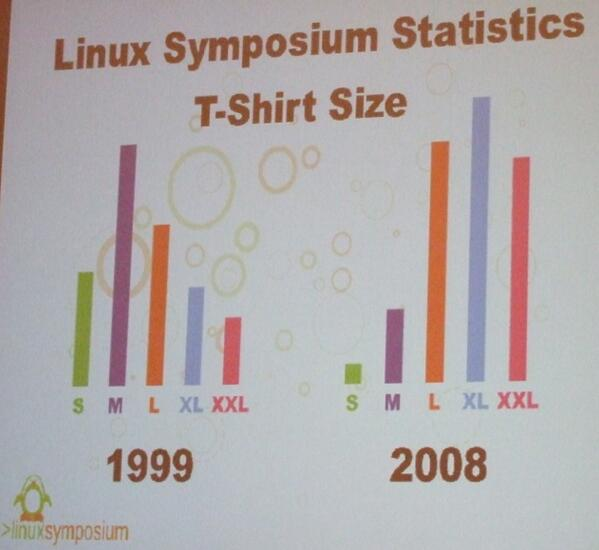
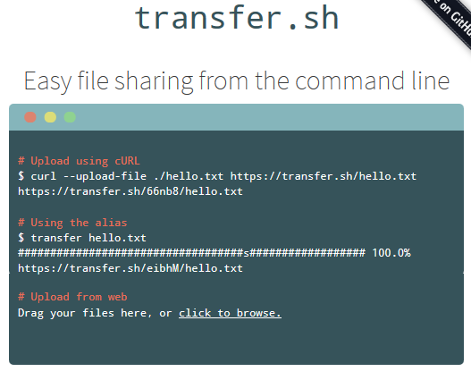

**Table of Contents**
<!-- MarkdownTOC -->

- [Sysadmin Blogs](#sysadmin-blogs)
- [Sysadmin Forums](#sysadmin-forums)
- [Linux](#linux)
	- [Linux and FOSS Blogs and Forums](#linux-and-foss-blogs-and-forums)
		- [Best Linux Blogs](#best-linux-blogs)
		- [Alternatives](#alternatives)
		- [Spanish Linux Blogs](#spanish-linux-blogs)
	- [FOSS youtube channels](#foss-youtube-channels)
	- [Linux on Twitter](#linux-on-twitter)
	- [Linux in 2016](#linux-in-2016)
		- [PHP 7](#php-7)
	- [Linux web tools](#linux-web-tools)
	- [BashHub Bash History in the Cloud](#bashhub-bash-history-in-the-cloud)
	- [Linux storage](#linux-storage)
		- [Linux LVM Logical Volume Management and FileSystems](#linux-lvm-logical-volume-management-and-filesystems)
	- [Linux processes](#linux-processes)
	- [Linux System Calls](#linux-system-calls)
	- [Linux user accounts](#linux-user-accounts)
	- [Linux backups](#linux-backups)
	- [Package Management](#package-management)
		- [Downgrade or Rollback Updates](#downgrade-or-rollback-updates)
	- [man pages on steroids with examples](#man-pages-on-steroids-with-examples)
	- [Linux bash](#linux-bash)
	- [Linux Tips](#linux-tips)
	- [Command line text manipulation tools](#command-line-text-manipulation-tools)
	- [Linux Terminals](#linux-terminals)
		- [Terminal Multiplexers](#terminal-multiplexers)
	- [Linux Virtualization](#linux-virtualization)
	- [FOSS Software](#foss-software)
	- [Linux Performance](#linux-performance)
		- [htop](#htop)
		- [Glances](#glances)
		- [Netdata](#netdata)
		- [bcc Dynamic Tracing Tools](#bcc-dynamic-tracing-tools)
	- [Linux Networking](#linux-networking)
		- [Networking FOSS Tools](#networking-foss-tools)
		- [Networking CLI and settings](#networking-cli-and-settings)
	- [Linux Security](#linux-security)
		- [Linux SSH](#linux-ssh)
		- [Rsync](#rsync)
		- [iptables](#iptables)
		- [SELinux, AppArmor and OpenSCAP](#selinux-apparmor-and-openscap)
	- [Vim and Emacs](#vim-and-emacs)
		- [Vim](#vim)
		- [Emacs](#emacs)
			- [Jed](#jed)
		- [Python Idle](#python-idle)
- [Ubuntu](#ubuntu)
- [ArchLinux](#archlinux)
- [Linux interview questions](#linux-interview-questions)
- [Apple OS X](#apple-os-x)

<!-- /MarkdownTOC -->

<blockquote class="twitter-tweet tw-align-center" data-lang="es">
Consider single points of failure and how to deal with them should they fail. <a href="https://twitter.com/hashtag/sysadmin?src=hash">#sysadmin</a> <a href="https://twitter.com/hashtag/life?src=hash">#life</a> <a href="https://twitter.com/hashtag/truth?src=hash">#truth</a>
&mdash; nixCraft (@nixcraft) <a href="https://twitter.com/nixcraft/status/707865797947842561">marzo 10, 2016</a></blockquote>

<blockquote class="twitter-tweet tw-align-center" data-lang="es">
My boss just wants new web-server while I and friend fight over what Linux distro we need  to use for deployment ;) <a href="https://t.co/4ce85A7lMv">pic.twitter.com/4ce85A7lMv</a>
&mdash; nixCraft (@nixcraft) <a href="https://twitter.com/nixcraft/status/715184148269281280">30 de marzo de 2016</a></blockquote>

<blockquote class="twitter-tweet tw-align-center" data-lang="es">
5 Things I Dislike and Love About <a href="https://twitter.com/hashtag/GNU?src=hash">#GNU</a> /<a href="https://twitter.com/hashtag/Linux?src=hash">#Linux</a><a href="https://t.co/mlh2hTLdL8">https://t.co/mlh2hTLdL8</a> <a href="https://t.co/j1iDW9APSP">pic.twitter.com/j1iDW9APSP</a>
&mdash; TecMint.com (@tecmint) <a href="https://twitter.com/tecmint/status/739077772656533504">4 de junio de 2016</a></blockquote>

<blockquote class="twitter-tweet tw-align-center" data-lang="es">
&quot;Linux Journey is a site dedicated to making learning Linux fun and easy.&quot;  <a href="https://t.co/6zFkticGrB">https://t.co/6zFkticGrB</a>
&mdash; Anthony Pisapia (@anthonypisapia) <a href="https://twitter.com/anthonypisapia/status/738578805053259778">3 de junio de 2016</a></blockquote>

# Sysadmin Blogs
- [The 79 Best Tech Blogs for sysadmins to follow](http://www.gfi.com/blog/the-79-best-tech-blogs-for-sysadmins-to-follow/)
- [The Lone SysAdmin](https://lonesysadmin.net)
	- [Interesting Dell iDRAC Tricks](https://lonesysadmin.net/2015/08/13/interesting-dell-idrac-tricks/)
- [Standalone Sysadmin](http://www.standalone-sysadmin.com) A blog for IT Admins who do everything by an IT Admin who does everything
- [planetsysadmin.com](http://planetsysadmin.com)
- [systemadmin.es 🌟](http://systemadmin.es/)
- [elmundoenbits.com](http://www.elmundoenbits.com)
- [Blog de un sysadmin](http://ernestogamez.es)

# Sysadmin Forums
- [sysadmin 'subreddit'](https://www.reddit.com/r/sysadmin/)
	- [Sysadmin BestOf 2015 Results](https://www.reddit.com/r/sysadmin/comments/42wdj6/sysadmin_bestof_2015_results/)
- [alt.sysadmin.recovery: Getting over the trauma of system administration](https://groups.google.com/forum/#!forum/alt.sysadmin.recovery) Alt.sysadmin.recovery is for discussion by recovered and recovering sysadmins. It is a forum for mutual support and griping over idiot lusers, stupid tech support, brain dead hardware and generally how stupid this idiotic job is. Think of it as a virtual pub, where we can all go after hours and gripe about our job. Since the concept of "after hours" (or, for that matter, "pubs") is an anathema for your average sysadmin, we have this instead. 
- [linuxsay.com](http://linuxsay.com/)

<blockquote class="twitter-tweet tw-align-center" data-lang="es">
Life of a sysadmin :( <a href="https://twitter.com/hashtag/truth?src=hash">#truth</a> <a href="https://twitter.com/hashtag/unix?src=hash">#unix</a> <a href="https://twitter.com/hashtag/linux?src=hash">#linux</a> <a href="https://twitter.com/hashtag/IT?src=hash">#IT</a> <a href="https://t.co/QEqEOgZaWZ">pic.twitter.com/QEqEOgZaWZ</a>
&mdash; nixCraft (@nixcraft) <a href="https://twitter.com/nixcraft/status/705316661767700480">3 de marzo de 2016</a></blockquote>

<blockquote class="twitter-tweet tw-align-center" data-lang="es">
This. <a href="https://twitter.com/hashtag/sysadmin?src=hash">#sysadmin</a> <a href="https://twitter.com/hashtag/IT?src=hash">#IT</a> <a href="https://t.co/IVdfEjIpjP">pic.twitter.com/IVdfEjIpjP</a>
&mdash; nixCraft (@nixcraft) <a href="https://twitter.com/nixcraft/status/707869367766097920">marzo 10, 2016</a></blockquote>

<blockquote class="twitter-tweet tw-align-center" data-lang="es">
When, we do our job well:  We are invisible.  We are sysadmins.  We are......... fuck it. I&#39;m going home. <a href="https://twitter.com/hashtag/Truth?src=hash">#Truth</a> <a href="https://twitter.com/hashtag/noloveforus?src=hash">#noloveforus</a> <a href="https://twitter.com/hashtag/IT?src=hash">#IT</a>
&mdash; nixCraft (@nixcraft) <a href="https://twitter.com/nixcraft/status/710926652285411328">18 de marzo de 2016</a></blockquote>

<iframe width="560" height="315" src="https://www.youtube.com/embed/_nhxm5QEbYI?rel=0" frameborder="0" allowfullscreen class="video"></iframe>

 

# Linux
- [7 Steps to Start Your Linux SysAdmin Career](https://www.linux.com/news/featured-blogs/191-linux-training/834644-7-steps-to-start-your-linux-sysadmin-career)
- [medium.com: I Moved to Linux and It’s Even Better Than I Expected](https://medium.com/backchannel/i-moved-to-linux-and-it-s-even-better-than-i-expected-9f2dcac3f8fb#.ifoqwzclj)
- [Best Linux Distros For Newcomers](http://www.datamation.com/open-source/best-linux-distros-for-newcomers.html)
- [Predictably, it is hard to make money from something that is free. That includes Linux](http://www.theworldin.com/article/12077/what-next-linux) Only one Linux company has made it big: Red Hat, which is expected to take about  $2 billion in its 2015 financial year, mostly by selling support services to users of the operating system and other open-source programs. The main beneficiaries of such software have been operators of huge data centres, such as Amazon, Facebook and Google, which wouldn’t be able to offer cheap cloud-computing services if they had to pay for the software.

<iframe width="420" height="315" src="https://www.youtube.com/embed/XMm0HsmOTFI?rel=0" frameborder="0" allowfullscreen class="video"></iframe>

 

<blockquote class="twitter-tweet tw-align-center" data-lang="es">
Microsoft isn&#39;t evil, they just make really crappy operating systems. - Linus Torvalds
&mdash; Tech-FAQ (@tech_faq) <a href="https://twitter.com/tech_faq/status/701060245414481920">febrero 20, 2016</a></blockquote>

<blockquote class="twitter-tweet tw-align-center" data-lang="es">
&quot;If Microsoft ever does applications for Linux it means I&#39;ve won.&quot; --Linus Torvalds<a href="https://twitter.com/nixcraft">@nixcraft</a>  <a href="https://t.co/kHMvZhNXuE">https://t.co/kHMvZhNXuE</a>
&mdash; Pepe Roni (@polkatwitt) <a href="https://twitter.com/polkatwitt/status/706954908302450688">7 de marzo de 2016</a></blockquote>

<blockquote class="twitter-tweet tw-align-center" data-lang="es">
Breaking news: <a href="https://twitter.com/satyanadella">@satyanadella</a> and <a href="https://twitter.com/Microsoft">@Microsoft</a> Announces Windows 12. Based upon industry strenght <a href="https://twitter.com/ubuntu">@Ubuntu</a> Linux 21.04 LTS code base.
&mdash; nixCraft (@nixcraft) <a href="https://twitter.com/nixcraft/status/707687944488747008">marzo 9, 2016</a></blockquote>

<blockquote class="twitter-tweet tw-align-center" data-lang="es">
An &quot;Ohnosecond&quot; is defined as  period of time between when you hit enter &amp; you realize what you just did <a href="https://twitter.com/hashtag/sysadmin?src=hash">#sysadmin</a> <a href="https://t.co/QmSTu0gpYr">pic.twitter.com/QmSTu0gpYr</a>
&mdash; nixCraft (@nixcraft) <a href="https://twitter.com/nixcraft/status/710674366875328512">18 de marzo de 2016</a></blockquote>

## Linux and FOSS Blogs and Forums

### Best Linux Blogs
- [Tecmint.com Linux Howto's Guide  🌟🌟🌟🌟🌟](http://www.tecmint.com/)
	- [Linux Distributions 🌟🌟🌟](http://www.tecmint.com/best-linux-distributions/)
- [nixCraft/cyberciti.biz: Linux Tips, Hacks, Tutorials, And Ideas In Blog  🌟🌟🌟🌟🌟](http://www.cyberciti.biz/)
- [learnitguide.net](http://www.learnitguide.net/)
- [Sysadmincasts.com  🌟🌟🌟](http://sysadmincasts.com)
	- [Episode Guide](https://sysadmincasts.com/episode-guide)
- [commandlinefu.com  🌟🌟🌟](http://commandlinefu.com/)
- [Linux Skill Youtube Channel](https://www.youtube.com/channel/UCmzTzKZT3yWaIiFvEyIHrOg)
- [linuxnix.com 🌟🌟🌟](http://www.linuxnix.com)
- [Linux Home Networking | Tutorials and Forums](http://www.linuxhomenetworking.com/)
- [Linuxadmin 'subreddit'](https://www.reddit.com/r/linuxadmin)
- [HowtoForge Linux Tutorials](https://www.howtoforge.com/)
- [LinuxPitstop: Linux Tips, Techniques, HowTo's & Open Source News](http://linuxpitstop.com/)
- [tecadmin.net](http://tecadmin.net)
- [unixmen.com 🌟](https://www.unixmen.com)
- [linuxjourney.com 🌟🌟🌟](https://linuxjourney.com/) Linux Journey is a site dedicated to making learning Linux fun and easy

### Alternatives
- [FOSS Force](http://fossforce.com/)
- [opensource.com](https://opensource.com/)
- [Linux.com](http://www.linux.com/)
- [The Linux Foundation](http://www.linuxfoundation.org/)
- [LinuxJournal](http://www.linuxjournal.com)
- [linuxtoday.com](http://www.linuxtoday.com/)
- [Xmodulo - Linux FAQs, tips and tutorials](http://xmodulo.com)
- [MyLinuxSoftware.com: A Linux Software Directory for GUI and Console Apps](http://www.mylinuxsoftware.com/)
- [unixetc.co.uk](http://unixetc.co.uk/)
- [LWN.net](http://lwn.net/)
- [Linux-tutorial.info](http://www.linux-tutorial.info/)
- [The Lone Sysadmin](https://lonesysadmin.net/)
- [Linux 101 Hacks](http://linux.101hacks.com/)
- [Linoxide.com](http://linoxide.com/)
- [LinuxLinks.com](http://www.linuxlinks.com)
- [The Geek Stuff | Linux | DB | Open Source | Web](http://www.thegeekstuff.com/)
- [cathcam.wordpress.com - blogger](https://cathcam.wordpress.com/)
- [tech.paulcz.net](http://tech.paulcz.net/#blog)
- [Benjamin Cane](http://bencane.com/) A Systems Architect writing about Linux Systems Administration
- [chruz.wordpress.com](https://chruz.wordpress.com) Linux, OpenStack & Provisioning
- [climagic.org](http://www.climagic.org)
- [unixmages.com](http://unixmages.com) Unix Mages started in the summer of 2005 with the purpose of teaching Unix and Linux by using stories of wizards, mages, magic, and spells.

<blockquote class="twitter-tweet tw-align-center" data-lang="es">
Unix poster from the 80&#39;s <a href="https://t.co/OqRavp5Qgf">pic.twitter.com/OqRavp5Qgf</a>
&mdash; Christian Maioli (@christianmaioli) <a href="https://twitter.com/christianmaioli/status/718417623898320896">8 de abril de 2016</a></blockquote>

### Spanish Linux Blogs
- [systemadmin.es 🌟](http://systemadmin.es/)
- [muylinux.com 🌟](http://www.muylinux.com/)
- [linuxadictos.com 🌟](http://www.linuxadictos.com)
- [systemadmin.es 🌟](http://systemadmin.es/)

## FOSS youtube channels
- [Sysadmincasts.com - Episode Guide](https://sysadmincasts.com/episode-guide)
- [SourceForge](https://www.youtube.com/channel/UC4Y3JZq09X-xMYVbXH8xpZA)
- [Linux/Unix Video Tutorials - nixCraft](https://www.youtube.com/user/nixcraftcom)
- [TecMint.com](https://www.youtube.com/channel/UCkiRkzdLvoGBtW_YArytJlQ)

## Linux on Twitter
- [@nixcraft 🌟🌟🌟🌟🌟](https://twitter.com/nixcraft)
- [UnixToolTip 🌟](https://twitter.com/UnixToolTip)
- [Command Line Magic 🌟🌟🌟🌟](https://twitter.com/climagic)
- Commandlinefu:
	- [commandlinefu](http://twitter.com/commandlinefu)
	- [commandlinefu3](http://twitter.com/commandlinefu3)
	- [commandlinefu10 🌟🌟🌟🌟🌟](http://twitter.com/commandlinefu10)
- [Shell OSS](https://twitter.com/oss_sh)
- [Tecmint 🌟🌟🌟🌟🌟](https://twitter.com/tecmint)
- [Open Source Way 🌟](https://twitter.com/opensourceway) Discover an open source world. Tweets from http://opensource.com
- [SysAdmHowto 🌟](https://twitter.com/SysAdmHowto)
- [twitter.com/linuxtutorials 🌟](https://twitter.com/linuxtutorials)
- [RegexTip](https://twitter.com/RegexTip)
- [github](https://twitter.com/github)
- [twitter.com/linuxfoundation](twitter.com/linuxfoundation)
- [twitter.com/LinuxDotCom](https://twitter.com/LinuxDotCom)
- [twitter.com/linuxtoday](https://twitter.com/linuxtoday)
- [twitter.com/LinuxDotCom](https://twitter.com/LinuxDotCom)
- [twitter.com/LinuxUserMag](https://twitter.com/LinuxUserMag)
- [twitter.com/Linux 🌟](https://twitter.com/Linux)
- [20 Linux Accounts to Follow on Twitter](http://www.tecmint.com/linux-accounts-to-follow-on-twitter/)

<iframe width="560" height="315" src="https://www.youtube.com/embed/oBZ1-E_NcMg" frameborder="0" allowfullscreen class="video"></iframe>

 

<blockquote class="twitter-tweet tw-align-center" data-lang="es">
Must have book for every developer and sysadmin ;) <a href="https://t.co/0mIxe3vJeZ">pic.twitter.com/0mIxe3vJeZ</a>
&mdash; nixCraft (@nixcraft) <a href="https://twitter.com/nixcraft/status/717063409871626240">4 de abril de 2016</a></blockquote>

<blockquote class="twitter-tweet tw-align-center" data-lang="es">
20 <a href="https://twitter.com/hashtag/Linux?src=hash">#Linux</a> Accounts to Follow on <a href="https://twitter.com/twitter">@twitter</a> <a href="https://t.co/xTOObN70sZ">https://t.co/xTOObN70sZ</a> RT <a href="https://twitter.com/linuxtoday">@linuxtoday</a> <a href="https://t.co/rOhmlK1Fdo">pic.twitter.com/rOhmlK1Fdo</a>
&mdash; TecMint.com (@tecmint) <a href="https://twitter.com/tecmint/status/738234785806458880">2 de junio de 2016</a></blockquote>

## Linux in 2016
- [Linux and Unix SysAdmins New Year’s Resolutions (2016)](http://www.cyberciti.biz/linux-news/linux-and-unix-sysadmins-new-years-resolutions-2016/)
- [certsimple.com: How to deploy your node app on Linux, 2016 edition](https://certsimple.com/blog/deploy-node-on-linux)
- [Linux Command: Show Linux Version](http://www.cyberciti.biz/faq/command-to-show-linux-version/)

### PHP 7
- [nixCraft: How to install PHP 7 on Ubuntu Linux 14.04 LTS 🌟](http://www.cyberciti.biz/faq/ubuntu-linux-14-04-install-php7-using-apt-get-command/)

## Linux web tools
- [curl Command Resume Broken Download](http://www.cyberciti.biz/faq/curl-command-resume-broken-download/)
- [Wget: Resume Broken Download](http://www.cyberciti.biz/tips/wget-resume-broken-download.html)
- [Run wget In Background For an Unattended Download of Files on Linux and Unix 🌟](http://www.cyberciti.biz/tips/howto-run-wget-in-background.html)
- [GoAccess real time web log analyzer](http://goaccess.io/)
- [A curl cheat sheet](http://daniel.haxx.se/blog/2015/09/16/a-curl-cheat-sheet/)
- [How to use curl command with proxy username and password on Linux or Unix](http://www.cyberciti.biz/faq/linux-unix-curl-command-with-proxy-username-password-http-options/)
- [DZone: Quickly Share a Folder Using HTTP On a Linux Host](https://dzone.com/articles/quickly-share-a-folder-using-http-on-a-linux-host)
- [How to Optimize and Compress JPEG or PNG Images in Linux Commandline](http://www.tecmint.com/optimize-and-compress-jpeg-or-png-batch-images-linux-commandline/)
- [transfer.sh](https://transfer.sh/) Easy file sharing from the command line

<blockquote class="twitter-tweet tw-align-center" data-lang="es">
Want to provide a username and password to gnu wget on Linux/Unix? <a href="https://t.co/mtceVy76vq">https://t.co/mtceVy76vq</a><a href="https://twitter.com/hashtag/sysadmin?src=hash">#sysadmin</a> <a href="https://t.co/w7TsRdJgLy">pic.twitter.com/w7TsRdJgLy</a>
&mdash; nixCraft (@nixcraft) <a href="https://twitter.com/nixcraft/status/715179937167048704">30 de marzo de 2016</a></blockquote>

<blockquote class="twitter-tweet tw-align-center" data-lang="es">
<a href="https://twitter.com/nixcraft">@nixcraft</a> <a href="https://t.co/hbwHXeFOI0">https://t.co/hbwHXeFOI0</a> this is also a cool Unix tool to provide files easy and fast from CLI
&mdash; Andreas (@npoxy) <a href="https://twitter.com/npoxy/status/711543356480950272">20 de marzo de 2016</a></blockquote>

<blockquote class="twitter-tweet tw-align-center" data-lang="es">
Is curl|bash insecure? <a href="https://twitter.com/hashtag/unix?src=hash">#unix</a> <a href="https://twitter.com/hashtag/linux?src=hash">#linux</a> <a href="https://twitter.com/hashtag/osx?src=hash">#osx</a> <a href="https://twitter.com/hashtag/sysadmin?src=hash">#sysadmin</a> <a href="https://twitter.com/hashtag/devops?src=hash">#devops</a> <a href="https://twitter.com/hashtag/security?src=hash">#security</a> <a href="https://twitter.com/hashtag/infosec?src=hash">#infosec</a>  <a href="https://t.co/UwcgHDJZ32">https://t.co/UwcgHDJZ32</a>
&mdash; nixCraft (@nixcraft) <a href="https://twitter.com/nixcraft/status/738915261252702209">4 de junio de 2016</a></blockquote>

## BashHub Bash History in the Cloud
- [BashHub](https://bashhub.com/)
- [twitter.com/bashhub](https://twitter.com/bashhub)

## Linux storage
- [Linux: Use smartctl To Check Disk Behind Adaptec RAID Controllers](http://www.cyberciti.biz/faq/linux-checking-sas-sata-disks-behind-adaptec-raid-controllers/)
- [Linux/Unix pv Command: Monitor Progress of Data Sent Via a Pipe](http://www.cyberciti.biz/open-source/command-line-hacks/pv-command-examples/)
- [agedu: Unix/Linux Command For Tracking Down Wasted Disk Space](http://www.cyberciti.biz/hardware/linux-find-and-recover-wasted-disk-space/)
- [Linux lsscsi: See List Of All SCSI/SATA Hard Disks and CD/DVD Drives](http://www.cyberciti.biz/faq/debian-ubuntu-linux-list-scsi-devices-hosts-attributes-lsscsi-command/)
- [How to reload sysctl.conf variables on Linux without rebooting the server](http://www.cyberciti.biz/faq/reload-sysctl-conf-on-linux-using-sysctl/) 
- [nixCraft: HowTo: Find Out Hard Disk Specs/Details on Linux](http://www.cyberciti.biz/faq/find-hard-disk-hardware-specs-on-linux/)

<blockquote class="twitter-tweet tw-align-center" data-lang="es">
God bless the hdparm command. 2 identical SSD, only diff is form factor Which one to remove? <a href="https://t.co/9prsnj88BD">https://t.co/9prsnj88BD</a> <a href="https://t.co/Umv8EaME0W">pic.twitter.com/Umv8EaME0W</a>
&mdash; Phil Baker (@philbaker1) <a href="https://twitter.com/philbaker1/status/739101875186716673">4 de junio de 2016</a></blockquote>

### Linux LVM Logical Volume Management and FileSystems 
- [Linux LVM Logical Volume Management and FileSystems](servers-storage-backup.md#linux-lvm-logical-volume-management-and-filesystems)

<blockquote class="twitter-tweet tw-align-center" data-lang="es">
awk &#39;{print $4}&#39; apache_log|sort -n|cut -c1-15|uniq -c|awk &#39;{b=&quot;&quot;;for(i=0;i&lt;$1/10;i++){b=b&quot;#&quot;}; print $0 &quot; &quot; b;}&#39; # Request by hour graph.
&mdash; Command Line Magic (@climagic) <a href="https://twitter.com/climagic/status/696591310266847232">febrero 8, 2016</a></blockquote>

<blockquote class="twitter-tweet tw-align-center" data-lang="es">
du -h . | grep &quot;^[0-9\.]\+G&quot; # # Find out which of your directories(below the current directory) occupy at least 1GB of space.
&mdash; Command Line Magic (@climagic) <a href="https://twitter.com/climagic/status/696200949786767360">febrero 7, 2016</a></blockquote>

<blockquote class="twitter-tweet tw-align-center" data-lang="es">
ls -la --full-time |tr -s &quot; &quot; |cut -f6 -d &quot; &quot;|cut -c1-7 | sort | uniq -c # Make month histogram of dates of files in current directory.
&mdash; Command Line Magic (@climagic) <a href="https://twitter.com/climagic/status/695843060119400448">febrero 6, 2016</a></blockquote>

## Linux processes
- [Linux: Find Out Which Process Is Listening Upon a Port](http://www.cyberciti.biz/faq/what-process-has-open-linux-port/)
- [tecmint.com: A Guide to Kill, Pkill and Killall Commands to Terminate a Process in Linux](http://www.tecmint.com/how-to-kill-a-process-in-linux/)
- [Sysadmincasts.com: LVM Linear vs Striped Logical Volumes](https://sysadmincasts.com/episodes/27-lvm-linear-vs-striped-logical-volumes)
	- [youtube: How To Install CentOS 6 Software RAID & LVM ](https://www.youtube.com/watch?v=nsdwScqjuCU)
- [unixetc.co.uk: Profiling and Tracing Processes in Linux](http://unixetc.co.uk/2012/10/28/profiling-and-tracing-processes-in-linux/)
- [ibm.com: Use the /proc filesystem to get a handle on your system](http://www.ibm.com/developerworks/linux/library/l-adfly/index.html)
- [Linux Server See the Historical and Statistical Uptime of System With tuptime Utility](http://www.cyberciti.biz/hardware/howto-see-historical-statistical-uptime-on-linux-server/)
- [tecmint.com: How to Find and Kill Running Processes in Linux](http://www.tecmint.com/find-and-kill-running-processes-pid-in-linux/)

<blockquote class="twitter-tweet tw-align-center" data-lang="es">
Whatportis, a command to search port names and numbers <a href="https://t.co/WUxc1iha5v">https://t.co/WUxc1iha5v</a> <a href="https://twitter.com/hashtag/python?src=hash">#python</a> <a href="https://twitter.com/hashtag/sysadmin?src=hash">#sysadmin</a> <a href="https://twitter.com/hashtag/devops?src=hash">#devops</a> <a href="https://t.co/DHgqwupDCn">pic.twitter.com/DHgqwupDCn</a>
&mdash; Nicolas Crocfer (@ncrocfer) <a href="https://twitter.com/ncrocfer/status/692129299047026688">26 de enero de 2016</a></blockquote>

<blockquote class="twitter-tweet tw-align-center" data-lang="es">
How to Find and Kill Running Processes in <a href="https://twitter.com/hashtag/Linux?src=hash">#Linux</a> <a href="https://t.co/5ALOrcHjgy">https://t.co/5ALOrcHjgy</a> RT <a href="https://twitter.com/linuxtoday">@linuxtoday</a> <a href="https://t.co/cCMh2W46lw">pic.twitter.com/cCMh2W46lw</a>
&mdash; TecMint.com (@tecmint) <a href="https://twitter.com/tecmint/status/739336698044108805">5 de junio de 2016</a></blockquote>

## Linux System Calls
- [Using strace to track system calls in Linux](https://opensource.com/business/16/1/scale-14x-interview-alex-juarez-rackspace)
- [The Definitive Guide to Linux System Calls](http://blog.packagecloud.io/eng/2016/04/05/the-definitive-guide-to-linux-system-calls/)

## Linux user accounts
- [cyberciti.biz: Linux Find Out Last System Reboot Time and Date Command](http://www.cyberciti.biz/tips/linux-last-reboot-time-and-date-find-out.html)

## Linux backups
- [cyberciti.biz: How To Avoid Sudden Outburst Of Backup Shell Script or Program Disk I/O on Linux](http://www.cyberciti.biz/tips/linux-set-io-scheduling-class-priority.html)
- [luckybackup.sourceforge.net: is an application for data back-up and synchronization powered by the rsync tool](http://luckybackup.sourceforge.net/)
- [Debian/Ubuntu Linux Install and Configure Remote Filesystem Snapshot with rsnapshot Incremental Backup Utility](http://www.cyberciti.biz/faq/linux-rsnapshot-backup-howto/)
- [Rsnapshot (Rsync Based) – A Local/Remote File System Backup Utility for Linux 🌟](http://www.tecmint.com/rsnapshot-a-file-system-backup-utility-for-linux/)
- [15 Useful Linux and Unix Tape Managements Commands For Sysadmins](http://www.cyberciti.biz/hardware/unix-linux-basic-tape-management-commands/)
- [cyberciti.biz: Backup & restore a partition table (including GPT) on Linux in case table get corrupted/modified/deleted by mistake](http://www.cyberciti.biz/faq/linux-backup-restore-a-partition-table-with-sfdisk-command/)
- [Book Review: Tarsnap Mastery Online Backup For the Truly Paranoid](http://www.cyberciti.biz/cloud-computing/book-review-tarsnap-mastery-online-backup-for-the-truly-paranoid/)
- [Back In Time - A simple backup tool for Linux written in Python3](https://github.com/bit-team/backintime)
	- [backintime.readthedocs.org](http://backintime.readthedocs.org)
- [Linux Get List of Installed Software for Reinstallation / Restore All the Software Programs](http://www.cyberciti.biz/tips/linux-get-list-installed-software-reinstallation-restore.html)
	- [How to find out when Debian or Ubuntu package installed or updated](http://www.cyberciti.biz/faq/debian-ubuntu-linux-find-package-installed-updated-date/)

## Package Management
- [rpm command cheat sheet for Linux](http://www.cyberciti.biz/howto/question/linux/linux-rpm-cheat-sheet.php)
- [apt-get command cheat sheet for Debian Linux](http://www.cyberciti.biz/howto/question/linux/apt-get-cheat-sheet.php)
- [Debian Linux apt-get package management cheat sheet](http://www.cyberciti.biz/tips/linux-debian-package-management-cheat-sheet.html)

<iframe src="https://player.vimeo.com/video/46877604" width="640" height="360" frameborder="0" webkitallowfullscreen mozallowfullscreen allowfullscreen class="video"></iframe>

 

<blockquote class="twitter-tweet tw-align-center" data-lang="es">
Adios apt and yum? Ubuntu’s snap apps are coming to distros everywhere <a href="https://twitter.com/hashtag/sysadmin?src=hash">#sysadmin</a> <a href="https://twitter.com/hashtag/linux?src=hash">#linux</a>  <a href="https://t.co/eyV4HNiY60">https://t.co/eyV4HNiY60</a>
&mdash; nixCraft (@nixcraft) <a href="https://twitter.com/nixcraft/status/742798889233747968">14 de junio de 2016</a></blockquote>

### Downgrade or Rollback Updates
- [CentOS/RHEL Use yum Command To Downgrade or Rollback Updates](http://www.cyberciti.biz/faq/howto-yum-downgrade-packages-on-rhel-centos-fedora-scientific-linux/)
- [Rollback an apt-get upgrade if something goes wrong on Debian/Ubuntu Linux](http://www.cyberciti.biz/howto/debian-linux/ubuntu-linux-rollback-an-apt-get-upgrade/)

<iframe width="560" height="315" src="https://www.youtube.com/embed/UiUFV3sOJ2k?rel=0" frameborder="0" allowfullscreen class="video"></iframe>

 

## man pages on steroids with examples
- [TLDR pages](http://tldr-pages.github.io/)
- [Bro pages](http://bropages.org/)

## Linux bash 
- [A Bash Shell Scripting Directory](https://bash.cyberciti.biz/)
	- [bash.cyberciti.biz: Linux Shell Scripting Tutorial (LSST) v2.0](https://bash.cyberciti.biz/guide/Main_Page)
- [explainshell.com](http://explainshell.com) match command-line arguments to their help text
- [BashFAQ: BASH Frequently Asked Questions](http://mywiki.wooledge.org/BashFAQ)
- [SlideShare: find, grep, sed, and awk](https://wilsonericn.wordpress.com/2011/08/25/find-grep-sed-and-awk/)
- [Github: Bioinformatics one-liners. Useful bash one-liners useful for bioinformatics (and some, more generally useful)](https://github.com/stephenturner/oneliners)
- [HowTo: Use bash For Loop In One Line 🌟](http://www.cyberciti.biz/faq/linux-unix-bash-for-loop-one-line-command/)
- [cyberciti.biz: List All Environment Variables Command](http://www.cyberciti.biz/faq/linux-list-all-environment-variables-env-command/)
- [cyberciti.biz: Search Multiple Words/String Pattern Using grep Command](http://www.cyberciti.biz/faq/searching-multiple-words-string-using-grep/)
- [Grep Include Only *.txt File Pattern When Running Recursive Mode 🌟](http://www.cyberciti.biz/faq/unix-linux-grep-include-file-pattern-recursive-example/)
- [ack-grep, un grep mejorado para programadores](https://ubuntulife.wordpress.com/2009/03/20/ack-grep-un-grep-mejorado-para-programadores/)
	- [ack-grep](http://beyondgrep.com/)
- [ibm.com: Learn Linux, 101: Customize and use the shell environment](http://www.ibm.com/developerworks/linux/library/l-lpic1-105-1/index.html)
- [Rich’s sh (POSIX shell) tricks](http://www.etalabs.net/sh_tricks.html)
- [nixCraft: Learning bash scripting for beginners 🌟](http://www.cyberciti.biz/open-source/learning-bash-scripting-for-beginners/)
- [How to undefine and unset a bash environment variable on Linux or Unix](www.cyberciti.biz/faq/linux-osx-bsd-unix-bash-undefine-environment-variable/)
- [30 Handy Bash Shell Aliases For Linux/Unix/Mac OS X](http://www.cyberciti.biz/tips/bash-aliases-mac-centos-linux-unix.html)
- [Bash For Loop Examples](http://www.cyberciti.biz/faq/bash-for-loop/)
- [20 Unix Command Line Tricks – Part I 🌟](http://www.cyberciti.biz/open-source/command-line-hacks/20-unix-command-line-tricks-part-i/)
- [My 10 UNIX Command Line Mistakes](http://www.cyberciti.biz/tips/my-10-unix-command-line-mistakes.html)
- [Understanding Linux/UNIX tr command](http://www.cyberciti.biz/faq/how-to-use-linux-unix-tr-command/)
- [How to delete a single command from history on a Linux, OS X and Unix Bash shell](http://www.cyberciti.biz/faq/delete-command-from-history-linux-unix-osx-bash-shell/)
- [How to change system’s hostname on HP-UX Unix system](http://www.cyberciti.biz/faq/hp-ux-change-systems-hostname-command/)
- [Linux/Unix: bg Command Examples](http://www.cyberciti.biz/faq/unix-linux-bg-command-examples-usage-syntax/)
- [Linux/Unix: jobs Command Examples](http://www.cyberciti.biz/faq/unix-linux-jobs-command-examples-usage-syntax/)
- [diff Command: Colorize Output On The Unix/Linux Command Line](http://www.cyberciti.biz/programming/color-terminal-highlighter-for-diff-files/)
- [Linux Run Command As Another User](http://www.cyberciti.biz/open-source/command-line-hacks/linux-run-command-as-different-user/)
- [Much faster incremental apt updates](https://juliank.wordpress.com/2015/12/26/much-faster-incremental-apt-updates/)
- [Linux/UNIX: Convert Hexadecimal to Decimal Number](http://www.cyberciti.biz/faq/linux-unix-convert-hex-to-decimal-number/)
- [nixCraft - A Shell Primer: Master Your Linux, OS X, Unix Shell Environment 🌟](http://www.cyberciti.biz/howto/shell-primer-configuring-your-linux-unix-osx-environment/)
- [Monkeying around on the bash command line in 2016](http://www.computerworld.com/article/3018637/open-source-tools/monkeying-around-on-the-bash-command-line-in-2016.html)
- [Linux/UNIX: Find Out If File Exists With Conditional Expressions](http://www.cyberciti.biz/tips/find-out-if-file-exists-with-conditional-expressions.html)
- [Linux/UNIX Recursively Search All Files For A String 🌟](http://www.cyberciti.biz/faq/howto-recursively-search-all-files-for-words/)
- [Finding a File Containing a Particular Text String In Linux Server 🌟](http://www.cyberciti.biz/faq/howto-search-find-file-for-text-string/)
- [How To Find and Overcome Shell Command Line Length Limitations](http://www.cyberciti.biz/faq/argument-list-too-long-error-solution/)
- [Linux/UNIX Recursively Search All Files For A String](http://www.cyberciti.biz/faq/howto-recursively-search-all-files-for-words/)
- [HowTo: Use cat Command In Linux/UNIX](http://www.cyberciti.biz/faq/howto-use-cat-command-in-unix-linux-shell-script/)
- [Bash Shell: Check File Exists or Not](http://www.cyberciti.biz/faq/unix-linux-test-existence-of-file-in-bash/)
- [Linux: Delete/Remove User Account](http://www.cyberciti.biz/faq/linux-remove-user-command/)
- [HowTo: Add Jobs To cron Under Linux or UNIX?](http://www.cyberciti.biz/faq/how-do-i-add-jobs-to-cron-under-linux-or-unix-oses/)
- [Bash History: Correct/Repeat The Last Command With a Substitution](http://www.cyberciti.biz/faq/bash-history-repeat-substitution-command-syntax/)
- [computerworld.com: 9 really odd linux commands](http://www.computerworld.com/article/3035480/linux/9-really-odd-linux-commands.html)
- [RHEL/Centos Linux 7: Change and Set Hostname Command](http://www.cyberciti.biz/faq/rhel-redhat-centos-7-change-hostname-command/)
- [Small & opinionated selection of basic Bash configurations for an improved command-line user experience 🌟](http://mrzool.cc/writing/sensible-bash/)
- [Use the Unofficial Bash Strict Mode (Unless You Looove Debugging)](http://redsymbol.net/articles/unofficial-bash-strict-mode/)
- [Howto display error message instantly when command fails](http://www.cyberciti.biz/tips/shell-displaying-error-messages.html)
- [Unix/Linux: Remove duplicate lines from a text file using awk or perl](http://www.cyberciti.biz/faq/how-to-remove-delete-duplicate-lines-from-textfile-on-unix-linux/)

<blockquote class="twitter-tweet tw-align-center" data-lang="es">
You an automatically trim long paths in the prompt using Bash 4.x  on a Unix/Linux (~/.bashrc)  PROMPT_DIRTRIM=2 <a href="https://t.co/AinsQbyKEf">pic.twitter.com/AinsQbyKEf</a>
&mdash; nixCraft (@nixcraft) <a href="https://twitter.com/nixcraft/status/706172095038787584">5 de marzo de 2016</a></blockquote>

<blockquote class="twitter-tweet tw-align-center" data-lang="es">
Linux Shell Scripting Part-2: Check how to display messages from Shell Script, user Variables and Environment... <a href="https://t.co/vuEflkXcQE">https://t.co/vuEflkXcQE</a>
&mdash; Unixmen (@unixmen) <a href="https://twitter.com/unixmen/status/735493398862299142">25 de mayo de 2016</a></blockquote>

<blockquote class="twitter-tweet tw-align-center" data-lang="es">
for loop <a href="https://twitter.com/hashtag/oneliner?src=hash">#oneliner</a> in <a href="https://twitter.com/hashtag/bash?src=hash">#bash</a> <a href="https://t.co/oSvQ9DLMag">https://t.co/oSvQ9DLMag</a>
&mdash; Barthelemy Dagenais (@bartdag) <a href="https://twitter.com/bartdag/status/740160113160359936">7 de junio de 2016</a></blockquote>

## Linux Tips
- [nixCraft: 20 Examples: Make Sure Unix/Linux Configuration Files Are Free From Syntax Errors](http://www.cyberciti.biz/tips/check-unix-linux-configuration-file-for-syntax-errors.html) Stop! Test Your Server Configuration Before Restarting Unix and Linux Services

<blockquote class="twitter-tweet tw-align-center" data-lang="es">
The smallest things like missing ; in Unix/Linux config file can cause greatest pain. But u can chk for syntax error <a href="https://t.co/HgYfKs7VcQ">https://t.co/HgYfKs7VcQ</a>
&mdash; nixCraft (@nixcraft) <a href="https://twitter.com/nixcraft/status/703553266160766977">27 de febrero de 2016</a></blockquote>

<blockquote class="twitter-tweet tw-align-center" data-lang="es">
Just typed wrong Linux command into the wrong SSH session :( More here <a href="https://t.co/TRPJfC3zp5">https://t.co/TRPJfC3zp5</a> <a href="https://twitter.com/hashtag/sysadmin?src=hash">#sysadmin</a> <a href="https://twitter.com/hashtag/unix?src=hash">#unix</a> <a href="https://twitter.com/hashtag/Life?src=hash">#Life</a> <a href="https://t.co/12u5Bll16b">pic.twitter.com/12u5Bll16b</a>
&mdash; nixCraft (@nixcraft) <a href="https://twitter.com/nixcraft/status/715263341279584256">30 de marzo de 2016</a></blockquote>

## Command line text manipulation tools 
- [AWK](https://en.wikipedia.org/wiki/AWK)
- [Sed](https://en.wikipedia.org/wiki/Sed)
- [pyp: Python Power at the Prompt](https://code.google.com/p/pyp/)
- [Hawk: Haskell text processor for the command-line](https://github.com/gelisam/hawk)
- [Hwk: A Haskell based awk and sed alternative](https://github.com/lukasmartinelli/hwk)
- [faqs.org: AWK FAQ](http://www.faqs.org/faqs/computer-lang/awk/faq/)
- [tecmint.com: How to Use Awk to Print Fields and Columns in File](http://www.tecmint.com/awk-print-fields-columns-with-space-separator/)

<iframe src="//www.slideshare.net/slideshow/embed_code/key/9OjHYI1AZXVGAf" width="595" height="485" frameborder="0" marginwidth="0" marginheight="0" scrolling="no" style="border:1px solid #CCC; border-width:1px; margin-bottom:5px; max-width: 100%;" allowfullscreen class="video"> </iframe> 
 <strong> <a href="//www.slideshare.net/EricWilson4/unix-commandline-tools" title="Unix command-line tools" target="_blank">Unix command-line tools</a> </strong> from <strong><a href="//www.slideshare.net/EricWilson4" target="_blank">Eric Wilson</a></strong> 

 

<blockquote class="twitter-tweet tw-align-center" data-lang="es">
Learn how to use AWK to print fields and columns in text files.. <a href="https://t.co/gV5FqfI2a9">https://t.co/gV5FqfI2a9</a> RT <a href="https://twitter.com/linuxtoday">@linuxtoday</a> <a href="https://t.co/MrSmSpwSyG">pic.twitter.com/MrSmSpwSyG</a>
&mdash; TecMint.com (@tecmint) <a href="https://twitter.com/tecmint/status/724597310991159296">25 de abril de 2016</a></blockquote>

## Linux Terminals
- [15 Greatest Open Source Terminal Applications Of 2012](http://www.cyberciti.biz/open-source/best-terminal-applications-for-linux-unix-macosx/)
- [Pymux: A terminal multiplexer (like tmux) in Python](https://github.com/jonathanslenders/pymux)

### Terminal Multiplexers
- [wikipedia: Terminal multiplexer](https://en.wikipedia.org/wiki/Terminal_multiplexer)
- [An introduction to Tmux](http://perltricks.com/article/an-introduction-to-tmux/)
- [tmux.github.io](https://tmux.github.io)
- [linuxcommand.org Terminal Multiplexers](http://linuxcommand.org/lc3_adv_termmux.php)
- [screen](http://michael-prokop.at/screen/index.php3)

## Linux Virtualization
- [Linux & Unix Virtualization Guides](http://www.cyberciti.biz/faq/category/virtualization/)
- [Troubleshooting KVM Virtualization Problem With Log Files](http://www.cyberciti.biz/faq/troubleshooting-kvm-virtualization-problem-with-log-files/)
- [linuxpitstop.com: Install and Configure KVM (Kernel Based Virtual Machine) On Ubuntu Linux 15.04](http://linuxpitstop.com/install-kvm-on-ubuntu-linux-15-04/)
- [nixCraft: KVM libvirt assign static guest IP addresses using DHCP on the virtual machine](http://www.cyberciti.biz/faq/linux-kvm-libvirt-dnsmasq-dhcp-static-ip-address-configuration-for-guest-os/)

<blockquote class="twitter-tweet tw-align-center" data-lang="es">
KVM libvirt assign static guest IP addresses using DHCP on Linux virtual machine <a href="https://t.co/0vFzVDnb9a">https://t.co/0vFzVDnb9a</a> <a href="https://twitter.com/hashtag/sysadmin?src=hash">#sysadmin</a> <a href="https://t.co/GBYHhS4Bbl">pic.twitter.com/GBYHhS4Bbl</a>
&mdash; nixCraft (@nixcraft) <a href="https://twitter.com/nixcraft/status/710172113915781120">16 de marzo de 2016</a></blockquote>

<blockquote class="twitter-tweet tw-align-center" data-lang="es">
Want to detect execution in a virtualized environment on Linux?  systemd-detect-virt  OR  dmidecode -s system-manufacturer<a href="https://twitter.com/hashtag/sysadmin?src=hash">#sysadmin</a>
&mdash; nixCraft (@nixcraft) <a href="https://twitter.com/nixcraft/status/714602201222524928">28 de marzo de 2016</a></blockquote>

## FOSS Software
- [30 Cool Open Source Software I Discovered in 2013](http://www.cyberciti.biz/open-source/30-cool-best-open-source-softwares-of-2013/)
- [Postfix Flush the Mail Queue](http://www.cyberciti.biz/tips/howto-postfix-flush-mail-queue.html)
- [ownCloud 8.2.2, 8.1.5, 8.0.10 and 7.0.12 here with Sharing, LDAP fixes](https://owncloud.org/blog/owncloud-8-2-2-8-1-5-8-0-10-and-7-0-12-here-with-sharing-ldap-fixes/)
- [Zentyal Exchange email on Linux](http://www.zentyal.org/)
- [Top 10 Open Source Web-Based Project Management Software](http://www.cyberciti.biz/tips/open-source-project-management-software.html)
- [alternativeto.net: A way to find alternative software, filters let you show only open source](https://alternativeto.net/)
- [Buku: cmdline bookmark manager... your mini web!](https://github.com/jarun/Buku) Buku (formerly markit) is a cmdline bookmark management utility written in Python3 and SQLite3. buku exists because of my monumental dependency on historious. I wanted the same database on my local system. However, I couldn't find an equally flexible cmdline solution. Hence, Buku! 
	- [historious: bookmarking you can love](http://historio.us/) historious saves you time by helping you find webpages you saw before. Bookmark sites with a single click, then find them again by searching for any word in the content of the page! 
- [GoogleApps  or Office365 replacement. Kolab + CloudSuite: It's collaborative all the way down](https://kolab.org/group-blog/2016/01/30/kolab-collabora/)

## Linux Performance
- [mylinuxsoftware.com: Linux Monitoring Software](http://www.mylinuxsoftware.com/linux_monitoring_software.html)
- [tecmint.com: Sysstat – All-in-One System Performance and Usage Activity Monitoring Tool For Linux](http://www.tecmint.com/install-sysstat-in-linux/)
- [tecmint.com: How to Produce and Deliver System Activity Reports Using Linux Toolsets](http://www.tecmint.com/linux-performance-monitoring-and-file-system-statistics-reports/)
- [tecmint.com: Linux Performance Monitoring with Vmstat and Iostat Commands](http://www.tecmint.com/linux-performance-monitoring-with-vmstat-and-iostat-commands/)
- [tecmint.com: 20 Useful Commands of ‘Sysstat’ Utilities (mpstat, pidstat, iostat and sar) for Linux Performance Monitoring](http://www.tecmint.com/sysstat-commands-to-monitor-linux/)
- [tecmint.com: 10 ‘free’ Commands to Check Memory Usage in Linux](http://www.tecmint.com/check-memory-usage-in-linux/)
- [Slow System? iotop Is Your Friend](http://www.linuxjournal.com/content/slow-system-iotop-your-friend)
- [system activity reporter (SAR)](http://www.ibm.com/developerworks/aix/library/au-unix-perfmonsar.html)
- [byte-unixbench: BYTE UNIX benchmark suite](https://github.com/kdlucas/byte-unixbench)
- [mbw: Memory Bandwidth Benchmark](https://github.com/raas/mbw/)
- [tiobench: portable, fully-threaded I/O benchmark program](http://sourceforge.net/projects/tiobench/)
- [IOzone Filesystem Benchmark](http://www.iozone.org/)
- [Dstat, a versatile replacement for vmstat, iostat, netstat and ifstat 🌟](http://dag.wiee.rs/home-made/dstat/)
- [pgbench -- run a benchmark test on PostgreSQL](http://www.postgresql.org/docs/devel/static/pgbench.html)
- [seeker: measuring disk performance in virtual machines](http://www.linuxinsight.com/how_fast_is_your_disk.html)
- [Linux.101hacks.com: lsof Command Examples](http://linux.101hacks.com/monitoring-performance/lsof-command-examples/)
- [nixCraft: Linux Increase The Maximum Number Of Open Files/File Descriptors (FD)](http://www.cyberciti.biz/faq/linux-increase-the-maximum-number-of-open-files/)
- [rittmanmead.com: Linux cluster sysadmin — OS metric monitoring with colmux](http://www.rittmanmead.com/2014/12/linux-cluster-sysadmin-os-metric-monitoring-with-colmux/)
- [Collecting Ubuntu Linux System Information](http://www.cyberciti.biz/hardware/collecting-ubuntu-linux-system-information/)
- [howtoforge.com: Server Monitoring with Munin and Monit on Ubuntu 14.04 LTS](https://www.howtoforge.com/tutorial/server-monitoring-with-munin-and-monit-on-ubuntu-14-04/)
- [github: Script for automating Linux memory capture and analysis](https://github.com/halpomeranz/lmg)
- [slideshare.net: Broken Linux Performance Tools 2016](http://www.slideshare.net/brendangregg/broken-linux-performance-tools-2016)
- [How To Stress Test CPU and Memory (VM) On a Linux and Unix With Stress-ng](http://www.cyberciti.biz/faq/stress-test-linux-unix-server-with-stress-ng/)
	- [Forcing out kernel bugs with stress-ng](http://smackerelofopinion.blogspot.co.uk/2016/01/forcing-out-bugs-with-stress-ng.html)
- [Julia Evans: How CPU load averages work (and using them to triage webserver performance!)](http://jvns.ca/blog/2016/02/07/cpu-load-averages/)
- [Julia Evans - perf top: an awesome way to spu on CPU usage 🌟](http://jvns.ca/blog/2016/02/24/perf-top-my-new-best-friend/)
- [Perf- A Performance Monitoring and Analysis Tool for Linux 🌟](http://www.tecmint.com/perf-performance-monitoring-and-analysis-tool-for-linux/)
- [opensource.com: 4 open source tools for Linux system monitoring](https://opensource.com/life/16/2/open-source-tools-system-monitoring)
- [linuxjournal.com: Examining Load Average](http://www.linuxjournal.com/article/9001?page=0,1) A practical interpretation of Linux's load averages but also illuminates some of the dark mathematical shadows behind them 
- [The many load averages of Unix(es)](https://utcc.utoronto.ca/~cks/space/blog/unix/ManyLoadAveragesOfUnix)
- [How to measure your CPU time: clock_gettime! 🌟](http://jvns.ca/blog/2016/02/20/measuring-cpu-time-with-clock-gettime/)
- [opensource.com: 4 open source tools for Linux system monitoring](https://opensource.com/life/16/2/open-source-tools-system-monitoring)
- [nixCraft: Linux: Check Ram Speed and Type](http://www.cyberciti.biz/faq/check-ram-speed-linux/)
- [tecmint_monitor.sh: A Shell Script to Monitor Network, Disk Usage, Uptime, Load Average and RAM Usage in Linux 🌟🌟🌟](http://www.tecmint.com/linux-server-health-monitoring-script/)

<blockquote class="twitter-tweet tw-align-center" data-lang="es">
Perf- A Performance Monitoring and Analysis Tool for Linux<a href="https://t.co/dc4kzOHWEV">https://t.co/dc4kzOHWEV</a>  RT <a href="https://twitter.com/linuxtoday">@linuxtoday</a> <a href="https://twitter.com/hashtag/Linux?src=hash">#Linux</a> <a href="https://t.co/sYi1KhAmr3">pic.twitter.com/sYi1KhAmr3</a>
&mdash; TecMint.com (@tecmint) <a href="https://twitter.com/tecmint/status/733207445317648384">19 de mayo de 2016</a></blockquote>

### htop
- [htop - an interactive process viewer for Unix](http://hisham.hm/htop/)
- [Manage your Linux Box with htop](http://freedompenguin.com/articles/how-to/manage-your-linux-box-with-htop/)
- [How to find out information about a LXC (Linux container) CPU & Memory Usage](http://www.cyberciti.biz/faq/how-to-find-out-information-about-lxc-cpu-memory-networking/)

<a href="http://nixcraft.tumblr.com/post/139101622517/htop-version-20-released-for-linux-os-x-freebsd">http://nixcraft.tumblr.com/post/139101622517/htop-version-20-released-for-linux-os-x-freebsd</a>

<blockquote class="twitter-tweet tw-align-center" data-lang="es">
How CPU load averages work (and using them to triage webserver performance!) <a href="https://t.co/aK35G54ZU6">https://t.co/aK35G54ZU6</a> <a href="https://twitter.com/hashtag/Sysadmin?src=hash">#Sysadmin</a> <a href="https://twitter.com/hashtag/unix?src=hash">#unix</a> <a href="https://twitter.com/hashtag/linux?src=hash">#linux</a>
&mdash; nixCraft (@nixcraft) <a href="https://twitter.com/nixcraft/status/696798241984159745">febrero 8, 2016</a></blockquote>

<blockquote class="twitter-tweet tw-align-center" data-lang="es">
Use &quot;iotop&quot; command for measuring hard disk I/O (current read/write) usage per application on Linux. For more info <a href="https://t.co/2TZ2rYHdpq">https://t.co/2TZ2rYHdpq</a>
&mdash; nixCraft (@nixcraft) <a href="https://twitter.com/nixcraft/status/696293052793491457">febrero 7, 2016</a></blockquote>

<blockquote class="twitter-tweet tw-align-center" data-lang="es">
The many load averages of Unix(es) <a href="https://t.co/7CWPcIc5CK">https://t.co/7CWPcIc5CK</a> <a href="https://twitter.com/hashtag/Unix?src=hash">#Unix</a> <a href="https://twitter.com/hashtag/FreeBSD?src=hash">#FreeBSD</a> <a href="https://twitter.com/hashtag/OpenBSD?src=hash">#OpenBSD</a> <a href="https://twitter.com/hashtag/NetBSD?src=hash">#NetBSD</a> <a href="https://twitter.com/hashtag/Linux?src=hash">#Linux</a> <a href="https://twitter.com/hashtag/Sysadmin?src=hash">#Sysadmin</a> <a href="https://twitter.com/hashtag/GoodReads?src=hash">#GoodReads</a>
&mdash; nixCraft (@nixcraft) <a href="https://twitter.com/nixcraft/status/700151524119310336">febrero 18, 2016</a></blockquote>

<blockquote class="twitter-tweet tw-align-center" data-lang="es">
also dstat is the other best program. convinced that staring at dstat output is the path to solving many bugs.
&mdash; Julia Evans (@b0rk) <a href="https://twitter.com/b0rk/status/709931262987866112">16 de marzo de 2016</a></blockquote>

<blockquote class="twitter-tweet tw-align-center" data-lang="es">
another interesting tcp debugging story from <a href="https://twitter.com/majek04">@majek04</a>!! &quot;The revenge of the listening sockets&quot; <a href="https://t.co/dkANiC2Q27">https://t.co/dkANiC2Q27</a>
&mdash; Julia Evans (@b0rk) <a href="https://twitter.com/b0rk/status/717347304320188417">5 de abril de 2016</a></blockquote>

<blockquote class="twitter-tweet tw-align-center" data-lang="es">
I like this article: admitting what I don&#39;t know to other people has helped me learn SO MUCH. <a href="https://t.co/2eNAVjxsrT">https://t.co/2eNAVjxsrT</a>
&mdash; Julia Evans (@b0rk) <a href="https://twitter.com/b0rk/status/717376465768157184">5 de abril de 2016</a></blockquote>

<blockquote class="twitter-tweet tw-align-center" data-lang="es">
Linux performance monitoring tools. Also check out book from same author  <a href="https://t.co/kGkxQTjCxk">https://t.co/kGkxQTjCxk</a> <a href="https://twitter.com/hashtag/sysadmin?src=hash">#sysadmin</a> <a href="https://t.co/ASNc1dpUGz">pic.twitter.com/ASNc1dpUGz</a>
&mdash; nixCraft (@nixcraft) <a href="https://twitter.com/nixcraft/status/710235993786310656">16 de marzo de 2016</a></blockquote>

<blockquote class="twitter-tweet tw-align-center" data-lang="es">
dtrace for linux - kernel driver and userland tools <a href="https://t.co/RgC9MmtAk8">https://t.co/RgC9MmtAk8</a>
&mdash; nixCraft (@nixcraft) <a href="https://twitter.com/nixcraft/status/711595796202848256">20 de marzo de 2016</a></blockquote>

<blockquote class="twitter-tweet tw-align-center" data-lang="es">
to see container info in &quot;htop&quot;, in Setup select CGGROUP in the Available Columns! <a href="https://t.co/zsgLd0UJaB">https://t.co/zsgLd0UJaB</a>
&mdash; John Mitchell (@JohnTellsAll) <a href="https://twitter.com/JohnTellsAll/status/726899822104481792">1 de mayo de 2016</a></blockquote>

### Glances
- [Glances](https://nicolargo.github.io/glances)
- [cyberciti.biz: Linux - Keep An Eye On Your System With Glances Monitor](http://www.cyberciti.biz/faq/linux-install-glances-monitoring-tool/)
- [tecmint.com: Glances – An Advanced Real Time System Monitoring Tool for Linux](http://www.tecmint.com/glances-an-advanced-real-time-system-monitoring-tool-for-linux/)

<iframe width="560" height="315" src="https://www.youtube.com/embed/ZwhyLD-wquk?rel=0" frameborder="0" allowfullscreen class="video"></iframe>

 

<iframe src="//www.slideshare.net/slideshow/embed_code/key/8F5OO2XVQUiemO" width="595" height="485" frameborder="0" marginwidth="0" marginheight="0" scrolling="no" style="border:1px solid #CCC; border-width:1px; margin-bottom:5px; max-width: 100%;" allowfullscreen class="video"> </iframe> 
 <strong> <a href="//www.slideshare.net/brendangregg/broken-linux-performance-tools-2016" title="Broken Linux Performance Tools 2016" target="_blank">Broken Linux Performance Tools 2016</a> </strong> from <strong><a href="//www.slideshare.net/brendangregg" target="_blank">Brendan Gregg</a></strong> 

 

### Netdata
- [netdata 🌟](https://github.com/firehol/netdata/blob/master/README.md)

<blockquote class="twitter-tweet tw-align-center" data-lang="es">
Netdata - Linux real time performance monitoring, done right. <a href="https://twitter.com/hashtag/sysadmin?src=hash">#sysadmin</a> <a href="https://t.co/xxFbw2jE3s">pic.twitter.com/xxFbw2jE3s</a>
&mdash; nixCraft (@nixcraft) <a href="https://twitter.com/nixcraft/status/715283444830314496">30 de marzo de 2016</a></blockquote>

### bcc Dynamic Tracing Tools
- [bcc Dynamic Tracing Tools](https://iovisor.github.io/bcc/)

<blockquote class="twitter-tweet tw-align-center" data-lang="es">
bcc - Dynamic Tracing Tools for Linux <a href="https://twitter.com/hashtag/opensource?src=hash">#opensource</a> <a href="https://twitter.com/hashtag/sysadmin?src=hash">#sysadmin</a>  <a href="https://t.co/qwf1C7XaWi">https://t.co/qwf1C7XaWi</a>
&mdash; nixCraft (@nixcraft) <a href="https://twitter.com/nixcraft/status/716380701512245249">2 de abril de 2016</a></blockquote>

## Linux Networking
### Networking FOSS Tools
- [ntop](http://www.ntop.org/)
- [Angry IP Scanner (or simply ipscan)](http://angryip.org/) Alternative to Nmap and cross-platform
- [observium.org: Network monitoring with intuition](http://www.observium.org/)
- [zmap.io](https://zmap.io/)
- [Masscan](https://github.com/robertdavidgraham/masscan) TCP port scanner, spews SYN packets asynchronously, scanning entire Internet in under 5 minutes
	- [Masscan: the entire Internet in 3 minutes](http://blog.erratasec.com/2013/09/masscan-entire-internet-in-3-minutes.html)
- [cyberciti.biz - ss: Display Linux TCP / UDP Network and Socket Information](http://www.cyberciti.biz/tips/linux-investigate-sockets-network-connections.html)
- [nixCraft: How To Install Speedtest-cli On a CentOS/RHEL/Scientific/Fedora Linux To Check Internet Speed 🌟](http://www.cyberciti.biz/faq/install-speedtest-cli-on-centos-redhat-fedoa-scientific-to-measure-internetspeed/)
- [How To Flush Linux/UNIX DNS Cache](http://www.cyberciti.biz/faq/rhel-debian-ubuntu-flush-clear-dns-cache/)
- [How to Configure and Manage Network Connections Using ‘nmcli’ Tool 🌟](http://www.tecmint.com/configure-network-connections-using-nmcli-tool-in-linux/)
- [Linux networking examples and tutorials for advanced users 🌟🌟🌟](https://github.com/knorrie/network-examples) Includes lab examples for lxc, bgp, vpn, & more

<a href="http://securityreactions.tumblr.com/post/136893048895/how-sysadmins-view-people-scanning-the-net-with">http://securityreactions.tumblr.com/post/136893048895/how-sysadmins-view-people-scanning-the-net-with</a>

<blockquote class="twitter-tweet tw-align-center" data-lang="es">
Linux Networking Tutorials For Advanced Users. Includes lab examples for lxc, bgp, vpn, &amp; more <a href="https://t.co/8mkYo5fMaS">https://t.co/8mkYo5fMaS</a> <a href="https://twitter.com/hashtag/sysadmin?src=hash">#sysadmin</a> <a href="https://twitter.com/hashtag/opensource?src=hash">#opensource</a>
&mdash; nixCraft (@nixcraft) <a href="https://twitter.com/nixcraft/status/718444646808965120">8 de abril de 2016</a></blockquote>

### Networking CLI and settings
- [Linux ip Command Examples](http://www.cyberciti.biz/faq/linux-ip-command-examples-usage-syntax/)
- [What are useful command-line network monitors on Linux](http://xmodulo.com/useful-command-line-network-monitors-linux.html)
- [conn-check, a deployment utility to check connectivity between services](http://conn-check.org/)
- [tc command: adds latency to NIC for testing purposes](http://bencane.com/2012/07/16/tc-adding-simulated-network-latency-to-your-linux-server/)
- ['traceroute' in Linux is like 'route get' in Solaris](http://www.cyberciti.biz/faq/traceroute-tracepath-unix-linux-command/)
- [Using TCP Traceroute on Windows And Linux](https://support.logicboxes.com/helpdesk/index.php?/Knowledgebase/Article/View/11/37/using-tcp-traceroute-on-windows-and-linux) TCPTraceroute to trace a path through the network, using a specific TCP port number. This tool is very useful for determining if a port is being blocked by a firewall. If it is being blocked, we can get an idea of where it is being blocked.
- [tracepath: What's the difference between traceroute and tracepath?](https://www.quora.com/Whats-the-difference-between-traceroute-and-tracepath)
- [LHN: linuxhomenetworking.com 🌟🌟🌟](http://www.linuxhomenetworking.com/)
	- [Quick HOWTO : Ch03 : Linux Networking](http://www.linuxhomenetworking.com/wiki/index.php/Quick_HOWTO_:_Ch03_:_Linux_Networking)
	- [Quick HOWTO : Ch04 : Simple Network Troubleshooting](http://www.linuxhomenetworking.com/wiki/index.php/Quick_HOWTO_:_Ch04_:_Simple_Network_Troubleshooting)
	- [Quick HOWTO : Ch04 : Simple Network Troubleshooting : Using MTR To Detect Network Congestion](http://www.linuxhomenetworking.com/wiki/index.php/Quick_HOWTO_:_Ch04_:_Simple_Network_Troubleshooting#Using_MTR_To_Detect_Network_Congestion)
- [Linux and Unix nload App: Monitor Network Traffic and Bandwidth Usage In Real Time](http://www.cyberciti.biz/networking/nload-linux-command-to-monitor-network-traffic-bandwidth-usage/)
- [Linux: Find Out What Is Using TCP Port 80](http://www.cyberciti.biz/faq/find-linux-what-running-on-port-80-command/)
- [dropwatch: a monitoring utility that monitors packets dropped by the kernel](http://prefetch.net/blog/index.php/2011/07/11/using-netstat-and-dropwatch-to-observe-packet-loss-on-linux-servers/)
- [Linux and Unix Port Scanning With netcat 'nc' Command](http://www.cyberciti.biz/faq/linux-port-scanning/)
- [tecmint.com: 29 Practical Examples of Nmap Commands for Linux System/Network Administrators](http://www.tecmint.com/nmap-command-examples/)
- [Top 30 Nmap Command Examples For Sys/Network Admins](http://www.cyberciti.biz/networking/nmap-command-examples-tutorials/)
- [cyberciti.biz: HowTo: Speedup ping and traceroute Command Responses under Linux/Unix](http://www.cyberciti.biz/faq/unix-linux-bsd-appleosx-speedup-ping-traceroute-command-probs/)
- [UNIX ping Command Examples](http://www.cyberciti.biz/faq/unix-ping-command-examples/)
- [20 Linux System Monitoring Tools Every SysAdmin Should Know](http://www.cyberciti.biz/tips/top-linux-monitoring-tools.html)
- [How To Install Speedtest-cli On a CentOS/RHEL/Scientific/Fedora Linux To Check Internet Speed](http://www.cyberciti.biz/faq/install-speedtest-cli-on-centos-redhat-fedoa-scientific-to-measure-internetspeed/)
- [Linux/Unix Curl: Find Out If a Website Is Using Gzip/Deflate](http://www.cyberciti.biz/faq/linux-unix-curl-gzip-compression-test/)
- [ss: Display Linux TCP / UDP Network and Socket Information](http://www.cyberciti.biz/tips/linux-investigate-sockets-network-connections.html)
- [Deptyr, or how I learned to love UNIX domain sockets](https://boinkor.net/2016/01/deptyr-or-how-i-learned-to-love-unix-domain-sockets/)
	- [reptyr: Reparent a running program to a new terminal](https://github.com/nelhage/reptyr)
	- [deptyr: Run your tty programs pseudo-headlessly under a process supervisor](https://github.com/antifuchs/deptyr)
- [HowTo: Compile And Run a C/C++ Code In Linux](http://www.cyberciti.biz/faq/howto-compile-and-run-c-cplusplus-code-in-linux/)
- [How to: Detect Duplicate IP Address With arping command under Linux](http://www.cyberciti.biz/faq/linux-duplicate-address-detection-with-arping/)
- [How to Setup and Configure Network Bonding or Teaming in RHEL/CentOS 7](http://www.tecmint.com/configure-network-bonding-or-teaming-in-rhel-centos-7/)
- [Configure Static Routes In Debian or Red Hat Enterprise Linux](http://www.cyberciti.biz/tips/configuring-static-routes-in-debian-or-red-hat-linux-systems.html)
- [Introducing Linux Network Namespaces 🌟](http://blog.scottlowe.org/2013/09/04/introducing-linux-network-namespaces/)
- [fedoramagazine.org: Build a network bridge with Fedora](https://fedoramagazine.org/build-network-bridge-fedora/)
- [dig: How To Find My Public IP Address From Command Line On a Linux](http://www.cyberciti.biz/faq/how-to-find-my-public-ip-address-from-command-line-on-a-linux/)

<blockquote class="twitter-tweet tw-align-center" data-lang="es">
Use dig to find your own public IP from OSX/Linux/Unix/Win10  dig +short myip\.opendns.com <a href="https://twitter.com/Resolver1">@resolver1</a>.opendns.com<a href="https://t.co/9dX7mLlk5i">https://t.co/9dX7mLlk5i</a>
&mdash; nixCraft (@nixcraft) <a href="https://twitter.com/nixcraft/status/745242343918317568">21 de junio de 2016</a></blockquote>

<blockquote class="twitter-tweet tw-align-center" data-lang="es">
Build a network bridge with Fedora <a href="https://t.co/gC4BbmUMjg">https://t.co/gC4BbmUMjg</a> &lt;- Create a virtual switch.
&mdash; Red Hat Community (@redhatopen) <a href="https://twitter.com/redhatopen/status/739848133702750208">6 de junio de 2016</a></blockquote>

<iframe width="420" height="315" src="https://www.youtube.com/embed/Z1IoXIxLJVE" frameborder="0" allowfullscreen class="video"></iframe>

 

## Linux Security
- [tecmint.com: 25 Hardening Security Tips for Linux Servers](http://www.tecmint.com/linux-server-hardening-security-tips/)
- [CentOS 7 Server Hardening Guide](https://www.smittix.co.uk/centos-7-server-hardening-guide/)
- [Linoxide.com: Set Access Control List Using Setfacl And Getfacl Commands](http://linoxide.com/how-tos/linux-set-access-control-list-using-setfacl-and-getfacl-commands/)
- [20 Linux Server Hardening Security Tips](http://www.cyberciti.biz/tips/linux-security.html)
- [Top 20 Nginx WebServer Best Security Practices](http://www.cyberciti.biz/tips/linux-unix-bsd-nginx-webserver-security.html)
- [Mitigating DDoS Attacks with NGINX and NGINX Plus](https://www.nginx.com/blog/mitigating-ddos-attacks-with-nginx-and-nginx-plus/)
- [On the Juniper backdoor](http://blog.cryptographyengineering.com/2015/12/on-juniper-backdoor.html)
- [Linux: 25 PHP Security Best Practices For Sys Admins](http://www.cyberciti.biz/tips/php-security-best-practices-tutorial.html)
- [certsimple.com: You won't remember the options for OpenSSL, so here's bash shortcuts for everything](https://certsimple.com/blog/openssl-shortcuts)
- [Software with the most vulnerabilities in 2015: Mac OS X, iOS, and Flash](http://venturebeat.com/2015/12/31/software-with-the-most-vulnerabilities-in-2015-mac-os-x-ios-and-flash/)
- [howtoforge.com: How to install ProFTPd with TLS support on Ubuntu 15.10](https://www.howtoforge.com/tutorial/install-proftpd-with-tls-on-ubuntu-15-10/)
- [7 Awesome Open Source Cloud Storage Software For Your Privacy and Security](http://www.cyberciti.biz/cloud-computing/7-awesome-open-source-cloud-storage-software-for-your-privacy-and-security/)
- [webcodegeeks.tradepub.com free ebook: Securing & Optimizing Linux: The Hacking Solution (v.3.0)](http://webcodegeeks.tradepub.com/free/w_opeb01/)
- [How to block an IP address with ufw on Ubuntu Linux server](http://www.cyberciti.biz/faq/how-to-block-an-ip-address-with-ufw-on-ubuntu-linux-server/)
- [How To: Ubuntu Linux Firewall Open Port Command 🌟](http://www.cyberciti.biz/faq/how-to-open-firewall-port-on-ubuntu-linux-12-04-14-04-lts/)
- [How Do I Drop or Block Attackers IP Address With Null Routes On a Linux?](http://www.cyberciti.biz/tips/how-do-i-drop-or-block-attackers-ip-with-null-routes.html)
- [Find Out If Patch Number (CVE) Has Been Applied To RHEL/CentOS Linux](http://www.cyberciti.biz/faq/linux-find-out-patch-can-cve-applied/)
- [securitychecklist.org 🌟🌟🌟](https://securitychecklist.org/)
- [nixCraft: HowTo Change Password of Specific User Account In Linux](http://www.cyberciti.biz/faq/changing-password-of-specific-account-in-linux-commandline/)
- [unixmen.com: Password Management in Linux by using passwd command](http://www.unixmen.com/password-management-linux-using-passwd-command/)

<blockquote class="twitter-tweet tw-align-center" data-lang="es">
Security Checklist For Unix and Linux server <a href="https://twitter.com/hashtag/infosec?src=hash">#infosec</a> <a href="https://twitter.com/hashtag/sysadmin?src=hash">#sysadmin</a>  <a href="https://t.co/QTwAlEQHOQ">https://t.co/QTwAlEQHOQ</a>
&mdash; nixCraft (@nixcraft) <a href="https://twitter.com/nixcraft/status/711649284609826816">20 de marzo de 2016</a></blockquote>

### Linux SSH
- [keychain: Set Up Secure Passwordless SSH Access For Backup Scripts 🌟🌟🌟](http://www.cyberciti.biz/faq/ssh-passwordless-login-with-keychain-for-scripts/)
- [ssh-copy-id: Install/Append SSH Key In A Remote Linux/UNIX Servers Authorized_keys](http://www.cyberciti.biz/faq/install-ssh-identity-key-remote-host/)
- [Top 20 OpenSSH Server Best Security Practices](http://www.cyberciti.biz/tips/linux-unix-bsd-openssh-server-best-practices.html)
- [Secure Your Linux Desktop and SSH Login Using Two Factor Google Authenticator](http://www.cyberciti.biz/open-source/howto-protect-linux-ssh-login-with-google-authenticator/)
- [Building Effective SSH User Key Management: Three Best Practices](http://it.tmcnet.com/topics/it/articles/2016/02/25/418060-building-effective-ssh-user-key-management-three-best.htm)
- [When privileged access means controlling the lock: Best practices to protect what's yours](http://gsnmagazine.com/article/46166/when_privileged_access_means_controlling_lock_best)
- [nixCraft: create-ssh-config-file-on-linux-unix 🌟](http://www.cyberciti.biz/faq/create-ssh-config-file-on-linux-unix/)
- [How to Ensure Proper SSH User Key Management](http://aberdeenessentials.com/how-to-ensure-proper-ssh-user-key-management/)
- [nixCraft: Ubuntu/Debian Linux Server Install Keychain SSH Key Manager For OpenSSH 🌟🌟](http://www.cyberciti.biz/faq/ubuntu-debian-linux-server-install-keychain-apt-get-command/)

<iframe src="//www.slideshare.net/slideshow/embed_code/key/6sQGpxBbycM9eE" width="595" height="485" frameborder="0" marginwidth="0" marginheight="0" scrolling="no" style="border:1px solid #CCC; border-width:1px; margin-bottom:5px; max-width: 100%;" allowfullscreen class="video"> </iframe> 
 <strong> <a href="//www.slideshare.net/shahhe/introduction-to-ssh" title="Introduction to SSH" target="_blank">Introduction to SSH</a> </strong> from <strong><a target="_blank" href="//www.slideshare.net/shahhe">Hemant Shah</a></strong> 

 

<iframe src="https://player.vimeo.com/video/53734006" width="640" height="360" frameborder="0" webkitallowfullscreen mozallowfullscreen allowfullscreen class="video"></iframe>

 

<blockquote class="twitter-tweet tw-align-center" data-lang="es">
This is why I love ssh with key based login 😊 TeamViewer users are being hacked in bulk. <a href="https://twitter.com/hashtag/infosec?src=hash">#infosec</a> <a href="https://twitter.com/hashtag/security?src=hash">#security</a>  <a href="https://t.co/WVHC6zxpR7">https://t.co/WVHC6zxpR7</a>
&mdash; nixCraft (@nixcraft) <a href="https://twitter.com/nixcraft/status/739409299315642368">5 de junio de 2016</a></blockquote>

### Rsync
- [Rsync](https://en.wikipedia.org/wiki/Rsync)
- [How to exclude directories while using rsync](http://supportex.net/2011/07/exceptions-copying-directory-rsync/)

### iptables
- [cyberciti.biz: Linux Netfilter Tutorials (iptables)](http://www.cyberciti.biz/faq/category/iptables/)
- [Linux: 20 Iptables Examples For New SysAdmins](http://www.cyberciti.biz/tips/linux-iptables-examples.html)
- [How to list all iptables rules with line numbers on Linux](http://www.cyberciti.biz/faq/linux-viewing-all-iptables-rules-with-numbers-command/)
- [nixCraft: Iptables MAC Address Filtering](http://www.cyberciti.biz/tips/iptables-mac-address-filtering.html)
- [unixmen.com: IPTABLES VS FIREWALLD 🌟](https://www.unixmen.com/iptables-vs-firewalld/)

<blockquote class="twitter-tweet tw-align-center" data-lang="es">
Blocklist of all Facebook domains   -&gt; /etc/hosts file <a href="https://t.co/fh3G6c2Tqg">https://t.co/fh3G6c2Tqg</a>  -&gt; iptables <a href="https://t.co/oH3r62qByF">https://t.co/oH3r62qByF</a> <a href="https://twitter.com/hashtag/privacy?src=hash">#privacy</a> <a href="https://twitter.com/hashtag/security?src=hash">#security</a>
&mdash; nixCraft (@nixcraft) <a href="https://twitter.com/nixcraft/status/736581390276272128">28 de mayo de 2016</a></blockquote>

### SELinux, AppArmor and OpenSCAP
- [Red Hat Security: Celebrating 15 Years of SELinux](http://www.redhat.com/en/about/blog/celebrating-15-years-selinux)
- [SELinux](https://en.wikipedia.org/wiki/SELinux)
- [AppArmor](https://en.wikipedia.org/wiki/AppArmor)
- [OpenSCAP](https://www.open-scap.org)
- [tecmint.com: Implementing Mandatory Access Control with SELinux or AppArmor in Linux](http://www.tecmint.com/mandatory-access-control-with-selinux-or-apparmor-linux/)

<iframe width="560" height="315" src="https://www.youtube.com/embed/p4uNlzYld-Y?rel=0" frameborder="0" allowfullscreen class="video"></iframe>

 

<iframe width="560" height="315" src="https://www.youtube.com/embed/obN27RcHaao?rel=0" frameborder="0" allowfullscreen class="video"></iframe>

 

<blockquote class="twitter-tweet tw-align-center" data-lang="es">
Mandatory Access Control with SELinux or AppArmor in <a href="https://twitter.com/hashtag/Linux?src=hash">#Linux</a> <a href="https://t.co/Krq8xZDq0p">https://t.co/Krq8xZDq0p</a> RT <a href="https://twitter.com/linuxtoday">@linuxtoday</a> <a href="https://t.co/iSNt6kFZ7P">pic.twitter.com/iSNt6kFZ7P</a>
&mdash; TecMint.com (@tecmint) <a href="https://twitter.com/tecmint/status/740491788239011840">8 de junio de 2016</a></blockquote>

## Vim and Emacs
### Vim
- [tecmint.com: Learn Useful ‘Vi/Vim’ Editor Tips and Tricks to Enhance Your Skills – Part 1](http://www.tecmint.com/learn-vi-and-vim-editor-tips-and-tricks-in-linux/)
- [tecmint.com: 8 Interesting ‘Vi/Vim’ Editor Tips and Tricks for Every Linux Administrator – Part 2](http://www.tecmint.com/how-to-use-vi-and-vim-editor-in-linux/)
- [tecmint.com: LFCS: How to Install and Use vi/vim as a Full Text Editor – Part 2](http://www.tecmint.com/vi-editor-usage/)
- [vim graphical cheat sheet](http://www.viemu.com/vi-vim-cheat-sheet.gif)
- [Vim Essentials](http://www.semicomplete.com/presentations/vim/)
- [8 Essential Vim Editor Navigation Fundamentals](http://www.thegeekstuff.com/2009/03/8-essential-vim-editor-navigation-fundamentals/)
- [IBM: vi tips and tricks: Ten cool commands sure to impress your friends](http://www.ibm.com/developerworks/aix/library/au-vitips.html)
- [Vim: carta de referencia rápida](http://tnerual.eriogerg.free.fr/vimqrc-es.html)
- [.vimrc at master from matason's vimstuff - GitHub](https://github.com/matason/vimstuff/blob/master/.vimrc)
- [drupal.org: Configuring vim](https://www.drupal.org/node/29325)
- [cyberciti.biz: Turn On or Off Color Syntax Highlighting In vi or vim Editor](http://www.cyberciti.biz/faq/turn-on-or-off-color-syntax-highlighting-in-vi-or-vim/)
- [Highlight all search pattern matches - Vim Tips Wiki](http://vim.wikia.com/wiki/Highlight_all_search_pattern_matches)
- [Vim Commands Cheat Sheet](http://bullium.com/support/vim.html)
- [gvim - Replace Tab with Spaces in VIM](http://stackoverflow.com/questions/426963/replace-tab-with-spaces-in-vim)
- [Vim and Haskell in 2016](http://www.stephendiehl.com/posts/vim_2016.html)
- [Learn Vim Progressively](http://yannesposito.com/Scratch/en/blog/Learn-Vim-Progressively/)

<iframe src="https://player.vimeo.com/video/65396820" width="640" height="360" frameborder="0" webkitallowfullscreen mozallowfullscreen allowfullscreen class="video"></iframe>

 

### Emacs
- [Emacs cheat sheet](https://www.gnu.org/software/emacs/refcards/pdf/refcard.pdf)
- [Black Hats - GNU/Emacs](http://www.blackhats.es)
	- [blackhats.es: emacs refcard](http://www.blackhats.es/emacs/emacs-refcard.pdf)
	- [supervivencia en emacs](http://www.blackhats.es/wordpress/?p=3)
- [Emacs org-mode examples and cookbook](http://home.fnal.gov/~neilsen/notebook/orgExamples/org-examples.html)
- [In Emacs, what does "M-x command" mean?](http://kb.iu.edu/data/acqm.html)
- [Emacs goto line | Stylesen](http://www.stylesen.org/emacs_goto_line)
- [Simple Emacs Configuration](http://homepages.inf.ed.ac.uk/s0243221/emacs/)
- [EmacsWiki.org: Mapa Del Sitio](http://www.emacswiki.org/)
- [emacs quick reference card](http://www.unexpected-vortices.com/emacs/quick-ref.html)

#### Jed
- [Configuring Jed](http://www.faqs.org/docs/ldev/0130091154_56.htm)
- [Jed Intrinsic Function Reference Manual](http://www.jedsoft.org/jed/doc/jedfuns.html)
- [JED Editor Quick Reference](http://www.cs.cmu.edu/%7Ejeliza/work/jed-intro.html)
- [How-to show current line number & column number in the Jed editor status bar « Harbinger's Hollow](https://travelingfrontiers.wordpress.com/2010/07/03/how-to-show-line-numbers-and-tab-python-style-in-the-jed-editor/)
- [JED Modes Repository](http://jedmodes.sourceforge.net/)
	- [Jedmodes - Modes](http://jedmodes.sourceforge.net/modes/)
	- [Jedmodes - Modes - ffap : Find File At Point](http://jedmodes.sourceforge.net/mode/ffap/)

### Python Idle
- [HowTo: Install Python idle IDE On Linux Operating System](http://www.cyberciti.biz/faq/rhel-centos-debian-ubuntu-python-idle-linux-installation/)

# Ubuntu
- [twitter.com/ubuntu](https://twitter.com/ubuntu)
- [forbes: 10 Reasons Why Ubuntu Is Killing It In The Cloud](http://www.forbes.com/sites/janakirammsv/2016/01/12/10-reasons-why-ubuntu-is-killing-it-in-the-cloud/#2715e4857a0b19d6c8d819a2)

<blockquote class="twitter-tweet tw-align-center" data-lang="es">
Combining apt-get/apt-cache &amp; adds a progress bar using apt <a href="https://t.co/USBZOpb3rF">https://t.co/USBZOpb3rF</a> <a href="https://twitter.com/hashtag/debian?src=hash">#debian</a> <a href="https://twitter.com/hashtag/linux?src=hash">#linux</a> <a href="https://twitter.com/hashtag/ubuntu?src=hash">#ubuntu</a> <a href="https://twitter.com/hashtag/sysadmin?src=hash">#sysadmin</a> <a href="https://t.co/Fmkw4xvG8b">pic.twitter.com/Fmkw4xvG8b</a>
&mdash; nixCraft (@nixcraft) <a href="https://twitter.com/nixcraft/status/706180656439566336">5 de marzo de 2016</a></blockquote>

# ArchLinux
- [ArchLinux.org](https://www.archlinux.org/)
- [Install ArchLinux Cheat Sheet](http://i.cubeupload.com/On0hJE.jpg)

<blockquote class="twitter-tweet tw-align-center" data-lang="es">
Install <a href="https://twitter.com/archlinux">@ArchLinux</a> Cheat Sheet. Large version <a href="https://t.co/cpCrYEFnYY">https://t.co/cpCrYEFnYY</a> <a href="https://twitter.com/hashtag/Linux?src=hash">#Linux</a> <a href="https://twitter.com/hashtag/Sysadmin?src=hash">#Sysadmin</a> <a href="https://t.co/AB0WtSLyyH">pic.twitter.com/AB0WtSLyyH</a>
&mdash; nixCraft (@nixcraft) <a href="https://twitter.com/nixcraft/status/702628943644352512">24 de febrero de 2016</a></blockquote>

# Linux interview questions
- [tecmint.com: interview questions/](http://www.tecmint.com/category/interview-questions/)
- [linuxfoundation.org: 10 Job Interview Questions for Linux System Administrators](http://www.linuxfoundation.org/news-media/blogs/browse/2015/07/10-job-interview-questions-linux-system-administrators)

<blockquote class="twitter-tweet tw-align-center" data-lang="es">
Here is some great job interview advice for sys admins. | <a href="https://t.co/ScApCY8YMm">https://t.co/ScApCY8YMm</a> via <a href="https://twitter.com/opensourceway">@opensourceway</a> <a href="https://t.co/5A66BknFjh">pic.twitter.com/5A66BknFjh</a>
&mdash; Red Hat Training (@RedHat_Training) <a href="https://twitter.com/RedHat_Training/status/712954615906508801">24 de marzo de 2016</a></blockquote>

<iframe src="//www.slideshare.net/slideshow/embed_code/key/rfkDOrkHNRjrok" width="595" height="485" frameborder="0" marginwidth="0" marginheight="0" scrolling="no" style="border:1px solid #CCC; border-width:1px; margin-bottom:5px; max-width: 100%;" allowfullscreen class="video"> </iframe> 
 <strong> <a href="//www.slideshare.net/hirist/top-100-linux-interview-questions-and-answers-2014" title="Top 100 Linux Interview Questions and Answers 2014" target="_blank">Top 100 Linux Interview Questions and Answers 2014</a> </strong> from <strong><a href="//www.slideshare.net/hirist" target="_blank">hirist.com</a></strong> 

 

<iframe src="//www.slideshare.net/slideshow/embed_code/key/NsYzEq2VPlC3nn" width="595" height="485" frameborder="0" marginwidth="0" marginheight="0" scrolling="no" style="border:1px solid #CCC; border-width:1px; margin-bottom:5px; max-width: 100%;" allowfullscreen class="video"> </iframe> 
 <strong> <a href="//www.slideshare.net/linuxtutorial/top-linux-interview-questions-and-answers-job-interview-tips" title="Top linux interview questions and answers job interview tips" target="_blank">Top linux interview questions and answers job interview tips</a> </strong> from <strong><a href="//www.slideshare.net/linuxtutorial" target="_blank">linuxtutorial</a></strong> 

 

# Apple OS X
- [How to secure and lock down Apple OS X 10.11 (El Capitan) with osxlockdown](http://www.cyberciti.biz/faq/how-to-secure-and-lock-down-apple-os-x-10-11-el-capitan-with-osxlockdown/)
- [How to enable colorized output for the ls command in Mac OS X Terminal](http://www.cyberciti.biz/faq/apple-mac-osx-terminal-color-ls-output-option/)

<iframe width="560" height="315" src="https://www.youtube.com/embed/PLVmO9TMtno?rel=0" frameborder="0" allowfullscreen class="video"></iframe>

 

<iframe src="https://embed-ssl.ted.com/talks/linus_torvalds_the_mind_behind_linux.html" width="640" height="360" frameborder="0" scrolling="no" webkitAllowFullScreen mozallowfullscreen allowFullScreen class="video"></iframe>

 

<a href="https://soylentnews.org/comments.pl?sid=13033&threshold=0&commentsort=0&mode=improvedthreaded&cid=329623">the taste example</a>

