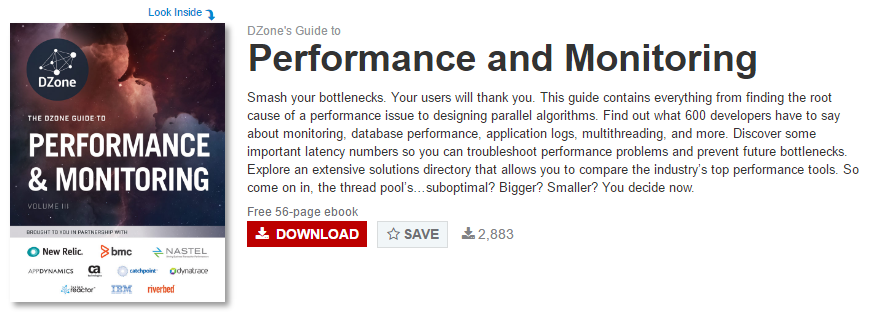
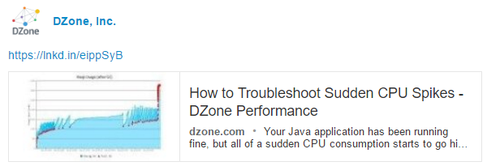
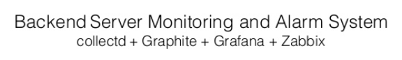
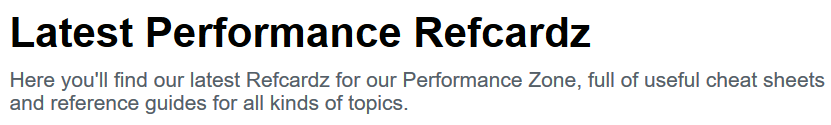
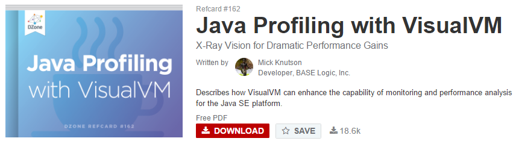
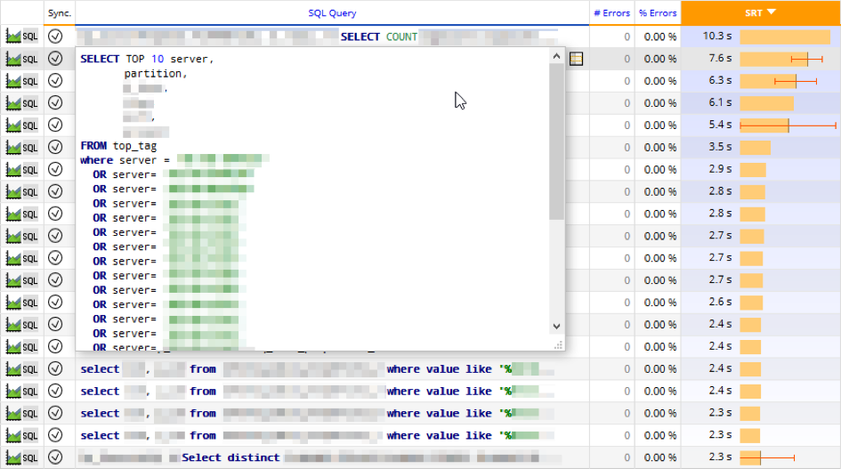

<!-- MarkdownTOC -->

- [Backend Server Monitoring and Alarm System](#backend-server-monitoring-and-alarm-system)
	- [Metric monitoring](#metric-monitoring)
		- [Time Series Database](#time-series-database)
			- [Open Source](#open-source)
			- [Proprietary](#proprietary)
		- [Tools](#tools)
		- [Icinga](#icinga)
		- [Grafana](#grafana)
		- [Zabbix](#zabbix)
		- [Prometheus](#prometheus)
		- [Monitoring of JavaEE applications](#monitoring-of-javaee-applications)
		- [Monitoring Network Bandwidth](#monitoring-network-bandwidth)
		- [APM: Application Performance Management](#apm-application-performance-management)
			- [APM Blogs](#apm-blogs)
			- [APM Solutions](#apm-solutions)
		- [Centralized logging. Big Data Log Management Tools \(Data Analytics Platforms\)](#centralized-logging-big-data-log-management-tools-data-analytics-platforms)
			- [Elasticsearch](#elasticsearch)
		- [Google Analytics](#google-analytics)

<!-- /MarkdownTOC -->

# Backend Server Monitoring and Alarm System
## Metric monitoring
### Time Series Database
- [Time series database - wikipedia](https://en.wikipedia.org/wiki/Time_series_database)

#### Open Source
- RRDtool
- [Graphite](http://graphite.readthedocs.io)
- Druid
- Riak-TS
- [InfluxDB](https://github.com/influxdata/influxdb) InfluxDB is an open source time series database with no external dependencies. It's useful for recording metrics, events, and performing analytics. 

#### Proprietary
- Honeywell Uniformance PHD
- Informix TimeSeries
- kdb+
- OSIsoft PI
- SAP HANA[2]
- Splunk
    
### Tools
- [Stop using Nagios (so it can die peacefully) 🌟](http://www.slideshare.net/superdupersheep/stop-using-nagios-so-it-can-die-peacefully)
	- [nagiosql.org](http://www.nagiosql.org/)
	- [Install NagiosQL - GUI interface to Configure Nagios Core](http://linoxide.com/monitoring-2/install-nagiosql-gui-interface-configure-nagios-core/)
- [GoAccess real time web log analyzer 🌟🌟🌟](http://goaccess.io/)
- [Linux cluster sysadmin — OS metric monitoring with colmux](http://www.rittmanmead.com/2014/12/linux-cluster-sysadmin-os-metric-monitoring-with-colmux/)
- [Netflix and linux performance analysis in 60 seconds 🌟](http://www.itworld.com/article/3010558/linux/netflix-linux-performance-analysis-in-60-seconds.html)
- [Why use Sensu?](http://www.rampmeupscotty.com/blog/2013/01/20/why-use-sensu/)
	- [Sensu monitoring](https://sensuapp.org/)
- [StatsD: Simple daemon for easy stats aggregation](https://github.com/etsy/statsd/)
	- [github.com: An addon for Eve. Eve-Statsd automatically monitors active domains/resources, sending "Hit Counters" and "Timers" to your statsd instance](https://github.com/tarzan0820/eve-statsd)
- [munin monitoring](http://munin-monitoring.org/)
- [flapjack.io 🌟](http://flapjack.io)
- [OMD - The Open Monitoring Distribution](http://omdistro.org/)
- [Anemometer: MySQL Slow Query Monitor 🌟](http://olindata.com/blog/2014/07/anemometer-mysql-slow-query-monitor)
- [SQL Monitoring in PostgreSQL. Identify long running queries](http://blog.dbi-services.com/sql-monitoring-in-postgresql-1-the-logging-system/)
- [Zipkin](http://zipkin.io)
	- [Zipkin architecture](http://twitter.github.io/zipkin/Architecture.html)
	- [Zipkin is a distributed tracing system. It helps gather timing data needed to troubleshoot latency problems in microservice architectures](https://github.com/openzipkin/zipkin)
	- [Zipkin is a distributed tracing system that helps us gather timing data for all the disparate services at Twitter](http://twitter.github.io/zipkin)
- [The Bro Network Security Monitor](https://www.bro.org/)
	- [FLOSS Weekly 296, Bro](https://twit.tv/shows/floss-weekly/episodes/296)
- [pingdom.com webiste monitoring](https://www.pingdom.com/)
- [Server Density, The Server Monitoring SaaS, Raises $1.5M For Further U.S. Expansion](http://techcrunch.com/2015/12/10/server-density/)

<iframe src="//www.slideshare.net/slideshow/embed_code/key/9a1kop6u7RqfqS" width="595" height="485" frameborder="0" marginwidth="0" marginheight="0" scrolling="no" style="border:1px solid #CCC; border-width:1px; margin-bottom:5px; max-width: 100%;" allowfullscreen class="video"> </iframe> 
 <strong> <a href="//www.slideshare.net/superdupersheep/stop-using-nagios-so-it-can-die-peacefully" title="Stop using Nagios (so it can die peacefully)" target="_blank">Stop using Nagios (so it can die peacefully)</a> </strong> from <strong><a href="//www.slideshare.net/superdupersheep" target="_blank">Andy Sykes</a></strong> 

 

<iframe src="//www.slideshare.net/slideshow/embed_code/key/3fqzFJxvNtcpmL" width="595" height="485" frameborder="0" marginwidth="0" marginheight="0" scrolling="no" style="border:1px solid #CCC; border-width:1px; margin-bottom:5px; max-width: 100%;" allowfullscreen class="video"> </iframe> 
 <strong> <a href="//www.slideshare.net/postwait/devops-monitoring" title="Monitoring the #DevOps way" target="_blank">Monitoring the #DevOps way</a> </strong> from <strong><a href="//www.slideshare.net/postwait" target="_blank">Theo Schlossnagle</a></strong> 

 

### Icinga
- [icinga.org](https://www.icinga.org/)

<iframe src="//www.slideshare.net/slideshow/embed_code/key/2vd0qUGteGRnlm" width="595" height="485" frameborder="0" marginwidth="0" marginheight="0" scrolling="no" style="border:1px solid #CCC; border-width:1px; margin-bottom:5px; max-width: 100%;" allowfullscreen class="video"> </iframe> 
 <strong> <a href="//www.slideshare.net/icinga/icinga-camp-barcelona-current-state-of-icinga" title="Icinga Camp Barcelona - Current State of Icinga" target="_blank">Icinga Camp Barcelona - Current State of Icinga</a> </strong> from <strong><a href="//www.slideshare.net/icinga" target="_blank">Icinga</a></strong> 

 

### Grafana
- [Grafana](http://grafana.org/) Beautiful metric & analytic dashboards

<iframe src="//www.slideshare.net/slideshow/embed_code/key/i8c50agp40TXm1" width="595" height="485" frameborder="0" marginwidth="0" marginheight="0" scrolling="no" style="border:1px solid #CCC; border-width:1px; margin-bottom:5px; max-width: 100%;" allowfullscreen class="video"> </iframe> 
 <strong> <a href="//www.slideshare.net/torkelo/fall-in-love-with-graphs-and-metrics-using-grafana" title="Fall in Love with Graphs and Metrics using Grafana" target="_blank">Fall in Love with Graphs and Metrics using Grafana</a> </strong> from <strong><a href="//www.slideshare.net/torkelo" target="_blank">torkelo</a></strong> 

 

<iframe src="//www.slideshare.net/slideshow/embed_code/key/IpYyIqPEzffXjx" width="595" height="485" frameborder="0" marginwidth="0" marginheight="0" scrolling="no" style="border:1px solid #CCC; border-width:1px; margin-bottom:5px; max-width: 100%;" allowfullscreen class="video"> </iframe> 
 <strong> <a href="//www.slideshare.net/PhilipWernersbach/grafana-and-mysql-benefits-and-challenges" title="Grafana and MySQL - Benefits and Challenges" target="_blank">Grafana and MySQL - Benefits and Challenges</a> </strong> from <strong><a href="//www.slideshare.net/PhilipWernersbach" target="_blank">Philip Wernersbach</a></strong> 

 

<iframe src="//www.slideshare.net/slideshow/embed_code/key/wNvnlPiFwTDNUe" width="595" height="485" frameborder="0" marginwidth="0" marginheight="0" scrolling="no" style="border:1px solid #CCC; border-width:1px; margin-bottom:5px; max-width: 100%;" allowfullscreen class="video"> </iframe> 
 <strong> <a href="//www.slideshare.net/vrbiyani/graphing-performance-with-collectd-influxdb-grafana" title="Graphing performance with CollectD InfluxDB Grafana" target="_blank">Graphing performance with CollectD InfluxDB Grafana</a> </strong> from <strong><a href="//www.slideshare.net/vrbiyani" target="_blank">Vishal Biyani</a></strong> 

 

### Zabbix
- [Infrastructure Monitoring with Zabbix, Nagios, or other? 🌟](http://www.itworld.com/article/2922424/data-center/infrastructure-monitoring-with-zabbix-nagios-or-other.html)
- [Zabbix Documentation 3.2](https://www.zabbix.com/documentation/3.2/)
- [tecmint.com: Installing and Configuring Zabbix 2.4.5 on Debian 8 and RHEL/CentOS 7 🌟](http://www.tecmint.com/install-and-configure-zabbix-monitoring-on-debian-centos-rhel/)
- [All the slides of Zabbix Conference 2015](http://www.zabbix.com/conf2015_agenda.php)
- [Zabbix for Beginners webinar](https://www.youtube.com/watch?v=uqFaz2HyxVM)
- [Reddit: Zabbix vs Nagios - what are the cases for using one or the other in an enterprise setting?](https://www.reddit.com/r/linuxadmin/comments/2i4k04/zabbix_vs_nagios_what_are_the_cases_for_using_one/)
- [Reddit: First beta of Zabbix 3.0](https://www.reddit.com/r/sysadmin/comments/41v20r/first_beta_of_zabbix_30/)
- [Zabbix Share: New & updated Zabbix templates for Checkpoint, Cisco and Palo Alto devices. Monitoring of Microsoft WSUS & more](https://share.zabbix.com)
- [500+ Zabbix community projects: Zabbix templates, scripts, CLIs, integrations, APIs, ... 🌟🌟🌟](https://github.com/zabbix/zabbix-community-repos)

### Prometheus
- [prometheus.io](http://prometheus.io/) An open-source service monitoring system and time series database
- [How To Install Prometheus using Docker on Ubuntu 14.04](https://www.digitalocean.com/community/tutorials/how-to-install-prometheus-using-docker-on-ubuntu-14-04)

<iframe src="//www.slideshare.net/slideshow/embed_code/key/90LdTg7tcBMxaF" width="595" height="485" frameborder="0" marginwidth="0" marginheight="0" scrolling="no" style="border:1px solid #CCC; border-width:1px; margin-bottom:5px; max-width: 100%;" allowfullscreen class="video"> </iframe> 
 <strong> <a href="//www.slideshare.net/Zabbix/zabbix-30-and-beyond-fisl-2015-zabbix-30-and-beyond" title="Zabbix 3.0 and beyond - FISL 2015" target="_blank">Zabbix 3.0 and beyond - FISL 2015</a> </strong> from <strong><a href="//www.slideshare.net/Zabbix" target="_blank">Zabbix</a></strong> 

 

<iframe src="//www.slideshare.net/slideshow/embed_code/key/GW7SDmD8Bsn5Cv" width="595" height="485" frameborder="0" marginwidth="0" marginheight="0" scrolling="no" style="border:1px solid #CCC; border-width:1px; margin-bottom:5px; max-width: 100%;" allowfullscreen class="video"> </iframe> 
 <strong> <a href="//www.slideshare.net/Zabbix/alexei-vladishev-opening-speech" title="Alexei Vladishev - Opening Speech" target="_blank">Alexei Vladishev - Opening Speech</a> </strong> from <strong><a href="//www.slideshare.net/Zabbix" target="_blank">Zabbix</a></strong> 

 

<iframe src="//www.slideshare.net/slideshow/embed_code/key/I2dLbQcCC5PNYC" width="595" height="485" frameborder="0" marginwidth="0" marginheight="0" scrolling="no" style="border:1px solid #CCC; border-width:1px; margin-bottom:5px; max-width: 100%;" allowfullscreen class="video"> </iframe> 
 <strong> <a href="//www.slideshare.net/Zabbix/andrew-nelson-zabbix-and-snmp-on-linux" title="Andrew Nelson - Zabbix and SNMP on Linux" target="_blank">Andrew Nelson - Zabbix and SNMP on Linux</a> </strong> from <strong><a href="//www.slideshare.net/Zabbix" target="_blank">Zabbix</a></strong> 

 

### Monitoring of JavaEE applications
- [javamelody 🌟](https://github.com/javamelody)
- [visualvm](http://visualvm.java.net/)
- [Red Hat Subscription: How do I analyze a Java heap dump? 🌟](https://access.redhat.com/solutions/18301)
- [javacodegeeks.com: Java Mission Control 5.2 is Finally Here! Welcome 7u40!](http://www.javacodegeeks.com/2013/09/java-mission-control-5-2-is-finally-here-welcome-7u40.html)
- [developerblog.redhat.com: Thermostat demo – open source monitoring tool for Hotspot JVM 🌟](http://developerblog.redhat.com/2014/08/06/%E2%96%B6-thermostat-demo-open-source-monitoring-tool-for-hotspot-jvm/)

### Monitoring Network Bandwidth
- [ntop 🌟🌟](http://www.ntop.org/)
- [Iperf.fr - The TCP,UDP and SCTP network bandwidth measurement tool 🌟🌟🌟](https://iperf.fr/)
- [Red Hat Subscription: Using iperf to test network bandwidth throughput](https://access.redhat.com/solutions/33103)

### APM: Application Performance Management
- [dzone: APM & performance optimization news, tutorials & tools 🌟](https://dzone.com/apm-tools-performance-monitoring-optimization)
- [APM Convergence: Monitoring vs. Management. APM is entering into a period of intense competition of technology and strategy with a multiplicity of vendors and viewpoints](http://apmdigest.com/apm-convergence-monitoring-vs-management)
- [Performance management from the client's point of view](http://www.networkworld.com/article/2300639/data-center/performance-management-from-the-client-s-point-of-view.html)
- [APMdigest: Where Application Performance Management, BSM, Virtualization, and Cloud Computing Meet](http://apmdigest.com/)
- [4 Reasons to Use APM Tools](http://apmdigest.com/4-reasons-to-use-apm-tools)
- [Application Performance Management and the Cloud](http://apmdigest.com/application-performance-management-and-the-cloud)

#### APM Blogs
- [applicationperformancemanagement.org: APM, ALM and Performance Monitoring](http://www.applicationperformancemanagement.org/)
- [apmblog.dynatrace.com](http://apmblog.dynatrace.com)
- [AppDynamics Blog](https://blog.appdynamics.com/apm/)

#### APM Solutions
- [RTI - Application Performance Management for Red Hat Middleware (JBoss, Fuse, Tomcat)](http://www.rtiperformance.com/)
- [MoSKito.org APM. Monitoring for Java applications. Complete ecosystem for DevOps. Free & open source 🌟](http://www.moskito.org/)
- [Metrics is a Java library which gives you unparalleled insight into what your code does in production (application-level metrics)](http://metrics.dropwizard.io/)
	- [GitHub: Dropwizard metrics](https://github.com/dropwizard/metrics)
- [New Relic para monitorizar el rendimiento y las conexiones de red de aplicaciones mรณviles Android e iOS](http://www.genbetadev.com/desarrollo-aplicaciones-moviles/new-relic-para-monitorizar-el-rendimiento-y-las-conexiones-de-red-de-aplicaciones-moviles-android-e-ios)
	- [Youtube - New Relic - Dashboard & Feature Tour](https://www.youtube.com/watch?v=J5tzI-8k__Q)
	- [New Relic - Developers: 30 minutes discovering how New Relic monitors your servers ](https://youtu.be/7Mg0UtzYql4)
	- [New Relic - Free Server Monitoring as a core feature of New Relic app management](https://blog.newrelic.com/2011/11/08/server-monitoring-is-here/)
- [AppDynamics Application Intelligence Platform](http://www.appdynamics.com/product/)
- [Introducing AppDynamics Integration with BlazeMeter:](https://blazemeter.com/blog/introducing-appdynamics-integration-blazemeter) A great way to enhance a #perftest scenario is to add deep inspection capabilities
- [AppDynamics ebook - Top 10 Java Performance Problems](https://www.appdynamics.com/lp/ebook-top-10-java-performance-problems/)
- [Everything You Know About Latency Is Wrong](https://dzone.com/articles/everything-you-know-about-latency-is-wrong-brave-n)
- [performancevision.com: how to find the root cause of a network slowdown](http://blog.performancevision.com/how-to-find-the-root-cause-of-a-network-slowdown)
- [performancevision.com: How-to reduce MTTR with Wire Data Real Time Transaction Analysis](http://blog.performancevision.com/how-to-reduce-mttr-with-wire-data-real-time-transaction-analysis)

<iframe width="560" height="315" src="https://www.youtube.com/embed/J5tzI-8k__Q" frameborder="0" allowfullscreen class="video"></iframe>

 

<iframe width="560" height="315" src="https://www.youtube.com/embed/7Mg0UtzYql4" frameborder="0" allowfullscreen class="video"></iframe>

 

<iframe width="560" height="315" src="https://www.youtube.com/embed/F99eSpvZOIQ?rel=0" frameborder="0" allowfullscreen class="video"></iframe>

 

<iframe src="//www.slideshare.net/slideshow/embed_code/key/lYDwY0HIujnMO7" width="595" height="485" frameborder="0" marginwidth="0" marginheight="0" scrolling="no" style="border:1px solid #CCC; border-width:1px; margin-bottom:5px; max-width: 100%;" allowfullscreen class="video"> </iframe> 
 <strong> <a href="//www.slideshare.net/CAinc/what-can-ca-apm-10-do-for-you" title="What Can CA APM 10 Do For You?" target="_blank">What Can CA APM 10 Do For You?</a> </strong> from <strong><a href="//www.slideshare.net/CAinc" target="_blank">CA Technologies</a></strong> 

 

<iframe width="560" height="315" src="https://www.youtube.com/embed/xbPgaXSPfcQ?rel=0" frameborder="0" allowfullscreen class="video"></iframe>

 

### Centralized logging. Big Data Log Management Tools (Data Analytics Platforms)
- [Devops and Log Management Tools Drive Agile IT](http://blog.xpolog.com/2014/04/17/devops-and-log-analysis-tools-drive-agile-it/)
- [Splunk](http://www.splunk.com)
	- [Splunk feels the heat from stronger, cheaper open source rivals](http://www.infoworld.com/article/2610524/log-analysis/splunk-feels-the-heat-from-stronger--cheaper-open-source-rivals.html)
- [XpoLog](http://www.xpolog.com/)
- [GrayLog2 | Open Source Log Management 🌟](https://www.graylog.org/)
- [Fluentd | Open Source Data Collector | Unified Logging Layer 🌟](http://www.fluentd.org/)
	- [Free Alternative to Splunk Using Fluentd](docs.fluentd.org/articles/free-alternative-to-splunk-by-fluentd)
	- [Fluentd and Graylog2 for End-to-End Log Analysis](http://www.fluentd.org/guides/recipes/graylog2)
- [rsyslog, the rocket-fast system for logs processing](http://www.rsyslog.com/)
- [Cloudlytics.com - Analytics for AWS Cloud Logs | CloudFront, CloudTrail, ELB & S3 Logs and Billing Analytics](https://www.cloudlytics.com/)
- [Choosing a Central Logging Tool: 5 Important Features, 6 Optional Tools: Splunk Storm, Graylog, Sumlogic, Logentries, Papertrail](https://www.ravellosystems.com/blog/choosing-central-logging-tool-5-features-6-tools/)

#### Elasticsearch
- [Elasticsearch 🌟🌟🌟🌟🌟](elasticsearch.md)

### Google Analytics

<iframe src='//players.brightcove.net/1352575774/562a0ae4-1186-4062-a951-6cb07225fb20_default/index.html?videoId=4865654788001' allowfullscreen frameborder=0 class="video"></iframe>

 
