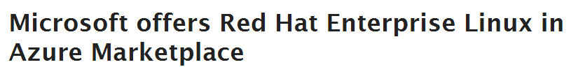
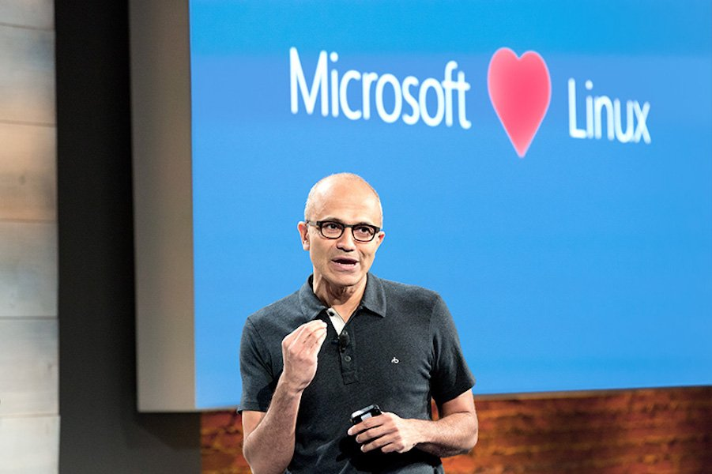
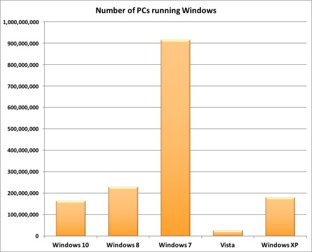
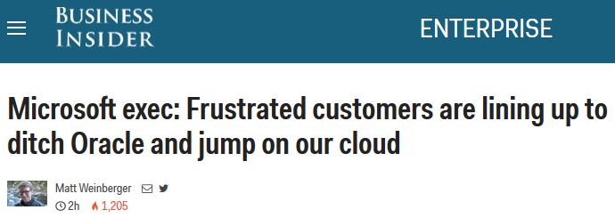
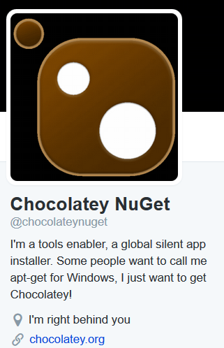

<!-- MarkdownTOC -->

- [Microsoft](#microsoft)
    - [SSH client for Windows](#ssh-client-for-windows)
    - [Microsoft Monitoring and Management](#microsoft-monitoring-and-management)
        - [PowerShell](#powershell)

<!-- /MarkdownTOC -->

<blockquote class="twitter-tweet tw-align-center" data-lang="es">
<a href="https://twitter.com/hashtag/RHEL?src=hash">#RHEL</a> is now available on-demand in the <a href="https://twitter.com/Azure">@Azure</a> Marketplace. Learn more: <a href="https://t.co/eubi8A09po">https://t.co/eubi8A09po</a>  <a href="https://t.co/t3gZ5FQZDO">https://t.co/t3gZ5FQZDO</a>
&mdash; Red Hat Partners (@RedHatPartners) <a href="https://twitter.com/RedHatPartners/status/700426316647108610">febrero 18, 2016</a></blockquote>

<blockquote class="twitter-tweet tw-align-center" data-lang="es">
<a href="https://twitter.com/hashtag/Microsoft?src=hash">#Microsoft</a> is porting <a href="https://twitter.com/hashtag/SQL?src=hash">#SQL</a> <a href="https://twitter.com/hashtag/Server?src=hash">#Server</a> to <a href="https://twitter.com/hashtag/Linux?src=hash">#Linux</a> <a href="https://t.co/KoRc36ehZe">https://t.co/KoRc36ehZe</a> via <a href="https://twitter.com/ZDNet">@ZDNet</a> &amp; <a href="https://twitter.com/maryjofoley">@maryjofoley</a>
&mdash; Red Hat Cloud (@RedHatCloud) <a href="https://twitter.com/RedHatCloud/status/707704520755666944">marzo 9, 2016</a></blockquote>

# Microsoft
- [zdnet: Linux and open source have won, get over it](http://www.zdnet.com/article/linux-and-open-source-have-won-get-over-it/) 2015 was the year Linux and open-source software took over the IT world, but many open-source and proprietary software fans still haven't figured it out.
- [Microsoft open sources its Visual Studio Code light-weight editor](http://www.zdnet.com/article/microsoft-open-sources-its-visual-studio-code-light-weight-editor/)
- [Microsoft has released over 100 Free Ebooks 🌟🌟🌟](http://blogs.msdn.com/b/mssmallbiz/archive/2014/07/07/largest-collection-of-free-microsoft-ebooks-ever-including-windows-8-1-windows-8-windows-7-office-2013-office-365-office-2010-sharepoint-2013-dynamics-crm-powershell-exchange-server-lync-2013-system-center-azure-cloud-sql.aspx)
- [Windows Migration Best Practices and Resources from Dell & Microsoft](http://www.migrationexpertzone.com/)
- [deals.slashdot.org: Microsoft Certified Solutions Engineer: Server Infrastructure Bundle](https://deals.slashdot.org/sales/microsoft-certified-solutions-engineer-server-infrastructure-bundle)
- [computerworld.com: Microsoft's new tally for Windows 10: 200M](http://www.computerworld.com/article/3018882/windows-pcs/microsofts-new-tally-for-windows-10-200m.html)
- [It's time to accept the reality of device diversity. 9 tips for mobilizing your Microsoft investment](https://media.good.com/documents/ts-9-tips-for-mobilizing.pdf)
- [zdnet.com: Microsoft open sources Edge web browser's JavaScript engine, plans port to Linux](http://www.zdnet.com/article/microsoft-open-sources-its-edge-web-browser-javascript-engine-and-plans-to-port-it-to-linux/) Microsoft open sources ChakraCore, Windows 10's Edge web browser JavaScript engine. More amazing still, Microsoft will port it to Ubuntu Linux
	- [thenextweb.com: Microsoft’s speedy Chakra JavaScript engine is now open source](http://thenextweb.com/dd/2016/01/13/microsofts-speedy-chakra-javascript-engine-is-now-open-source/)
- [Acompli is now Outlook app. Microsoft acquires Acompli, provider of innovative mobile email apps](https://www.acompli.com/)
- [ChatOps on Windows with Hubot and PowerShell](https://hodgkins.io/chatops-on-windows-with-hubot-and-powershell/)
- [Microsoft opens up its deep-learning toolkit on GitHub](http://www.pcworld.com/article/3026236/microsoft-opens-up-its-deep-learning-toolkit-on-github.html)
- [zdnet: Why Microsoft's vulnerability severity ratings are obsolete 🌟](http://www.zdnet.com/article/microsofts-vulnerability-severity-ratings-are-obsolete/) The distinction between 'critical' and 'important' has become meaningless. It makes no sense to treat them differently. Patch Tuesday needs a patch.

## SSH client for Windows
- [SSH for Windows open sourced by Microsoft. What's going on? 🌟](https://github.com/PowerShell/Win32-OpenSSH)
- [MobaXterm](http://mobaxterm.mobatek.net/)
- [Need an SSH client on Windows? Don't use Putty or CygWin...use Git](http://www.hurryupandwait.io/blog/need-an-ssh-client-on-windows-dont-use-putty-or-cygwinuse-git)

<blockquote class="twitter-tweet tw-align-center" data-lang="es">
Today, Microsoft announces that SQL Server is coming to Linux!&#13;&#13;<a href="https://t.co/HukIWadiqB">https://t.co/HukIWadiqB</a>
&mdash; Gijs de Jong (@gijsdej) <a href="https://twitter.com/gijsdej/status/706960105519108099">7 de marzo de 2016</a></blockquote>

<blockquote class="twitter-tweet tw-align-center" data-lang="es">
Microsoft Released SQL Server on Linux and it porting server apps for Linux :O <a href="https://t.co/bjCOjGzwRG">https://t.co/bjCOjGzwRG</a> <a href="https://t.co/3kdkgHnmZF">pic.twitter.com/3kdkgHnmZF</a>
&mdash; nixCraft (@nixcraft) <a href="https://twitter.com/nixcraft/status/706953766273036288">7 de marzo de 2016</a></blockquote>

<blockquote class="twitter-tweet tw-align-center" data-lang="es">
If you can&#39;t beat em join em. Microsoft has released a Debian Linux switch OS. Repeat, a Debian Linux switch OS <a href="https://t.co/rtydrzB2g8">https://t.co/rtydrzB2g8</a>
&mdash; nixCraft (@nixcraft) <a href="https://twitter.com/nixcraft/status/707680213379854336">marzo 9, 2016</a></blockquote>

<blockquote class="twitter-tweet tw-align-center" data-lang="es">
Former Microsoft CEO Steve Ballmer is totally over his fear of Linux <a href="https://t.co/JIHbMKtIqg">https://t.co/JIHbMKtIqg</a> <a href="https://t.co/8iQqolwT2J">pic.twitter.com/8iQqolwT2J</a>
&mdash; BI Tech (@SAI) <a href="https://twitter.com/SAI/status/708051066856800256">10 de marzo de 2016</a></blockquote>

<blockquote class="twitter-tweet tw-align-center" data-lang="es">
Video: How to use the Windows Software Licensing Management Tool <a href="https://t.co/XVr42usYXV">https://t.co/XVr42usYXV</a> <a href="https://twitter.com/edbott">@edbott</a> <a href="https://twitter.com/billdetwiler">@BillDetwiler</a> <a href="https://t.co/Rz1fm7KMal">pic.twitter.com/Rz1fm7KMal</a>
&mdash; TechRepublic (@TechRepublic) <a href="https://twitter.com/TechRepublic/status/705784929435648000">4 de marzo de 2016</a></blockquote>

<blockquote class="twitter-tweet tw-align-center" data-lang="es">
¿Virtualizas con Hyper-V? Esta herramienta gratis de <a href="https://twitter.com/veeam">@veeam</a> te servirá <a href="https://t.co/FZvkgZOmVX">https://t.co/FZvkgZOmVX</a>
&mdash; JGAITPro (@JGAITPro) <a href="https://twitter.com/JGAITPro/status/705594761621671936">4 de marzo de 2016</a></blockquote>

<blockquote class="twitter-tweet tw-align-center" data-partner="tweetdeck">
<a href="https://twitter.com/hashtag/SwarmWeek?src=hash">#SwarmWeek</a>: Build <a href="https://twitter.com/hashtag/DockerSwarm?src=hash">#DockerSwarm</a> binary for <a href="https://twitter.com/hashtag/Windows?src=hash">#Windows</a> the &quot;<a href="https://twitter.com/docker">@Docker</a> way&quot; by <a href="https://twitter.com/stefscherer">@stefscherer</a>: <a href="https://t.co/i308ylylYb">https://t.co/i308ylylYb</a> <a href="https://t.co/BLiIt46WSX">pic.twitter.com/BLiIt46WSX</a>
&mdash; Docker (@docker) <a href="https://twitter.com/docker/status/707175213138624512">March 8, 2016</a></blockquote>

<blockquote class="twitter-tweet tw-align-center" data-lang="es">
<a href="https://twitter.com/hashtag/Microsoft?src=hash">#Microsoft</a> Quietly Starts A <a href="https://twitter.com/hashtag/Python?src=hash">#Python</a> Engineering Blog — Here’s Why You Need To Follow It <a href="https://t.co/8jLIjIsBnl">https://t.co/8jLIjIsBnl</a> <a href="https://t.co/hxKOPJtroj">pic.twitter.com/hxKOPJtroj</a>
&mdash; Kisha (@GetKisha) <a href="https://twitter.com/GetKisha/status/708986328793407489">13 de marzo de 2016</a></blockquote>

<blockquote class="twitter-tweet tw-align-center" data-lang="es">
Demo: Bash comes to Windows - <a href="https://twitter.com/Microsoft">@Microsoft</a> BUILD 2016. Thanks to <a href="https://twitter.com/ubuntu">@Ubuntu</a> Linux. Good demo though. <a href="https://t.co/HuN4zTFsAG">https://t.co/HuN4zTFsAG</a>
&mdash; nixCraft (@nixcraft) <a href="https://twitter.com/nixcraft/status/715239184034758658">30 de marzo de 2016</a></blockquote>

<blockquote class="twitter-tweet tw-align-center" data-lang="es">
Retweeted Red Hat Developers (<a href="https://twitter.com/rhdevelopers">@rhdevelopers</a>):  You heard Microsoft hearts Linux.  Soon you will see .NET in... <a href="https://t.co/oe5AsSgPDm">https://t.co/oe5AsSgPDm</a>
&mdash; CN kashyap  ツ (@CNkashyap) <a href="https://twitter.com/CNkashyap/status/715532199500447745">31 de marzo de 2016</a></blockquote>

<blockquote class="twitter-tweet tw-align-center" data-lang="es">
Create and run Hyper-V containers using Docker on Windows 10 desktop <a href="https://t.co/AHP0R7MIDd">https://t.co/AHP0R7MIDd</a>  <a href="https://twitter.com/hashtag/docker?src=hash">#docker</a> <a href="https://t.co/I6NGQo6eQT">pic.twitter.com/I6NGQo6eQT</a>
&mdash; DevOps Guy (@DevopsG) <a href="https://twitter.com/DevopsG/status/737598208013017089">31 de mayo de 2016</a></blockquote>

<iframe src="//www.slideshare.net/slideshow/embed_code/key/1IJ7nmqOKS7cZn" width="595" height="485" frameborder="0" marginwidth="0" marginheight="0" scrolling="no" style="border:1px solid #CCC; border-width:1px; margin-bottom:5px; max-width: 100%;" allowfullscreen class="video"> </iframe> 
 <strong> <a href="//www.slideshare.net/nishadsukumaran/active-directory-training" title="Active Directory Training" target="_blank">Active Directory Training</a> </strong> from <strong><a href="//www.slideshare.net/nishadsukumaran" target="_blank">Nishad Sukumaran</a></strong> 

 

<iframe src="//es.slideshare.net/slideshow/embed_code/key/u6WS51goOPiEBV" width="595" height="485" frameborder="0" marginwidth="0" marginheight="0" scrolling="no" style="border:1px solid #CCC; border-width:1px; margin-bottom:5px; max-width: 100%;" allowfullscreen class="video"> </iframe> 
 <strong> <a href="//es.slideshare.net/skapadane/active-directory-5351670" title="Active Directory " target="_blank">Active Directory </a> </strong> from <strong><a href="//es.slideshare.net/skapadane" target="_blank">Sandeep Kapadane</a></strong> 

 

<iframe src="//www.slideshare.net/slideshow/embed_code/key/sbikKfH34KbY7D" width="595" height="485" frameborder="0" marginwidth="0" marginheight="0" scrolling="no" style="border:1px solid #CCC; border-width:1px; margin-bottom:5px; max-width: 100%;" allowfullscreen class="video"> </iframe> 
 <strong> <a href="//www.slideshare.net/TVEDTnet/microsoft-windows-10-bootcamp-active-directory" title="Microsoft Windows 10 Bootcamp - Active directory" target="_blank">Microsoft Windows 10 Bootcamp - Active directory</a> </strong> from <strong><a href="//www.slideshare.net/TVEDTnet" target="_blank">Olav Tvedt</a></strong> 

 

<iframe src="//es.slideshare.net/slideshow/embed_code/key/icwGbq1Ry66crd" width="595" height="485" frameborder="0" marginwidth="0" marginheight="0" scrolling="no" style="border:1px solid #CCC; border-width:1px; margin-bottom:5px; max-width: 100%;" allowfullscreen class="video"> </iframe> 
 <strong> <a href="//es.slideshare.net/hemantprasad/windows-10in10minutes" title="Windows 10 in 10 Minutes" target="_blank">Windows 10 in 10 Minutes</a> </strong> from <strong><a href="//es.slideshare.net/hemantprasad" target="_blank">Hemant Prasad</a></strong> 

 

<iframe src="//es.slideshare.net/slideshow/embed_code/key/1eRaK0STgikDTh" width="595" height="485" frameborder="0" marginwidth="0" marginheight="0" scrolling="no" style="border:1px solid #CCC; border-width:1px; margin-bottom:5px; max-width: 100%;" allowfullscreen class="video"> </iframe> 
 <strong> <a href="//es.slideshare.net/technetbelux/windows-10-all-you-need-to-know-47279449" title="Windows 10: all you need to know!" target="_blank">Windows 10: all you need to know!</a> </strong> from <strong><a href="//es.slideshare.net/technetbelux" target="_blank">Microsoft TechNet - Belgium and Luxembourg</a></strong> 

 

<iframe src="//www.slideshare.net/slideshow/embed_code/key/47dTfB2kZzgMy" width="668" height="714" frameborder="0" marginwidth="0" marginheight="0" scrolling="no" style="border:1px solid #CCC; border-width:1px; margin-bottom:5px; max-width: 100%;" allowfullscreen class="video"> </iframe> 
 <strong> <a href="//www.slideshare.net/intervietips/windows-sysadmin-interview-question" title="Windows sysadmin interview question" target="_blank">Windows sysadmin interview question</a> </strong> from <strong><a href="//www.slideshare.net/intervietips" target="_blank">intervietips</a></strong> 

 

<iframe src="//www.slideshare.net/slideshow/embed_code/key/78vHealj9sY6kA" width="595" height="485" frameborder="0" marginwidth="0" marginheight="0" scrolling="no" style="border:1px solid #CCC; border-width:1px; margin-bottom:5px; max-width: 100%;" allowfullscreen class="video"> </iframe> 
 <strong> <a href="//www.slideshare.net/SriramHariharan2/integration-with-docker-and-net-core" title="Integration with Docker and .NET Core" target="_blank">Integration with Docker and .NET Core</a> </strong> from <strong><a target="_blank" href="//www.slideshare.net/SriramHariharan2">Sriram Hariharan</a></strong> 

 

<blockquote class="twitter-tweet tw-align-center" data-lang="es">
&quot;Microsoft is specifically looking for those with knowledge of Linux, Ansible, Docker and Chef.&quot; <a href="https://t.co/jrkGDXcYPv">https://t.co/jrkGDXcYPv</a>
&mdash; Donnie Berkholz (@dberkholz) <a href="https://twitter.com/dberkholz/status/723571303505113088">22 de abril de 2016</a></blockquote>

## Microsoft Monitoring and Management
- [Simple Talk](https://www.simple-talk.com)
- [simple-talk.com/sysadmin](https://www.simple-talk.com/sysadmin/)
- [chocolatey.org](https://chocolatey.org)
- [Spiceworks](http://www.spiceworks.com/)
	- [spiceworks.com/app](http://www.spiceworks.com/app/)
	- [Spiceworks Overview,inventory & helpdesk](https://www.youtube.com/watch?v=kHnEXoPxiJ4)
	- [Spiceworks Profiles are Better Than a Resume for IT Geeks - Daily Blob - Dec 23, 2013](https://www.youtube.com/watch?v=BJ2mQpOZHPE)
- [Unofficial Spiceworks. Spiceworks news and reviews from the underground...](http://www.unofficialspiceworks.com/)
- [Revolution R renamed Microsoft R, available free to developers and students](http://blog.revolutionanalytics.com/2016/01/microsoft-r-open.html)
- [BlackWasp](http://www.blackwasp.co.uk/) This site is dedicated to providing articles, tips and tricks and useful software related to Windows-based "Smart Client" and enterprise software development using Microsoft programming technologies. These include the .NET Framework, Visual Studio, C# and Microsoft SQL Server.
- [Windows Sysinternals](https://technet.microsoft.com/en-us/sysinternals)
	- [Process Explorer](https://technet.microsoft.com/en-us/sysinternals/bb896653)
- [Windows Remote Management and WMI](https://msdn.microsoft.com/es-es/library/windows/desktop/aa384463%28v=vs.85%29.aspx)

<blockquote class="twitter-tweet tw-align-center" data-lang="es">
Bill Gates is king! <a href="https://t.co/jtVcAdEIvX">pic.twitter.com/jtVcAdEIvX</a>
&mdash; The Wolf of Wall St. (@TheWolfofWaIlSt) <a href="https://twitter.com/TheWolfofWaIlSt/status/705465462189113344">3 de marzo de 2016</a></blockquote>

<blockquote class="twitter-tweet tw-align-center" data-lang="es">
Why didn&#39;t I know about <a href="https://twitter.com/hashtag/chocolatey?src=hash">#chocolatey</a> ? A package manager for <a href="https://twitter.com/hashtag/Windows?src=hash">#Windows</a> <a href="https://t.co/Lg7yXoZVXB">https://t.co/Lg7yXoZVXB</a> its amazing!
&mdash; John Roach (@johnroach) <a href="https://twitter.com/johnroach/status/708366744109223936">11 de marzo de 2016</a></blockquote>

### PowerShell
- [PowerShell Magazine](http://www.powershellmagazine.com/)
- [PowerShell.org](http://powershell.org)
- [Introduction to PowerShell for Unix people](https://www.penflip.com/powershellorg/a-unix-persons-guide-to-powershell)
- [New Release of PowerShell Extension For Visual Studio Code](https://rkeithhill.wordpress.com/2016/02/09/new-release-of-powershell-extension-for-visual-studio-code)
- [Bash for Windows: Why it’s awesome and what it means for PowerShell 🌟🌟🌟](https://blogs.msdn.microsoft.com/powershell/2016/04/01/bash-for-windows-why-its-awesome-and-what-it-means-for-powershell)

<iframe width="560" height="315" src="https://www.youtube.com/embed/7jU15_7pPkY?rel=0" frameborder="0" allowfullscreen class="video"></iframe>

 

<iframe src="//www.slideshare.net/slideshow/embed_code/key/IhpcPalgYeTt5A" width="668" height="714" frameborder="0" marginwidth="0" marginheight="0" scrolling="no" style="border:1px solid #CCC; border-width:1px; margin-bottom:5px; max-width: 100%;" allowfullscreen class="video"> </iframe> 
 <strong> <a href="//www.slideshare.net/alikhanzafar/power-shell-for-newbies-getting-started-powershell-4" title="Power shell for newbies getting started powershell 4" target="_blank">Power shell for newbies getting started powershell 4</a> </strong> from <strong><a href="//www.slideshare.net/alikhanzafar" target="_blank">Zafar Ali Khan</a></strong> 

 

<iframe width="1280" height="720" src="https://www.youtube.com/embed/W3LReMTFeFU?rel=0" frameborder="0" allowfullscreen class="video"></iframe>

 

