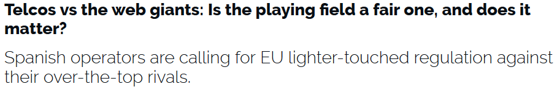
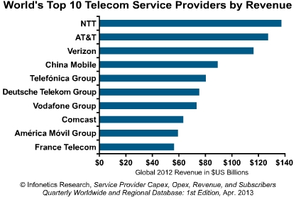
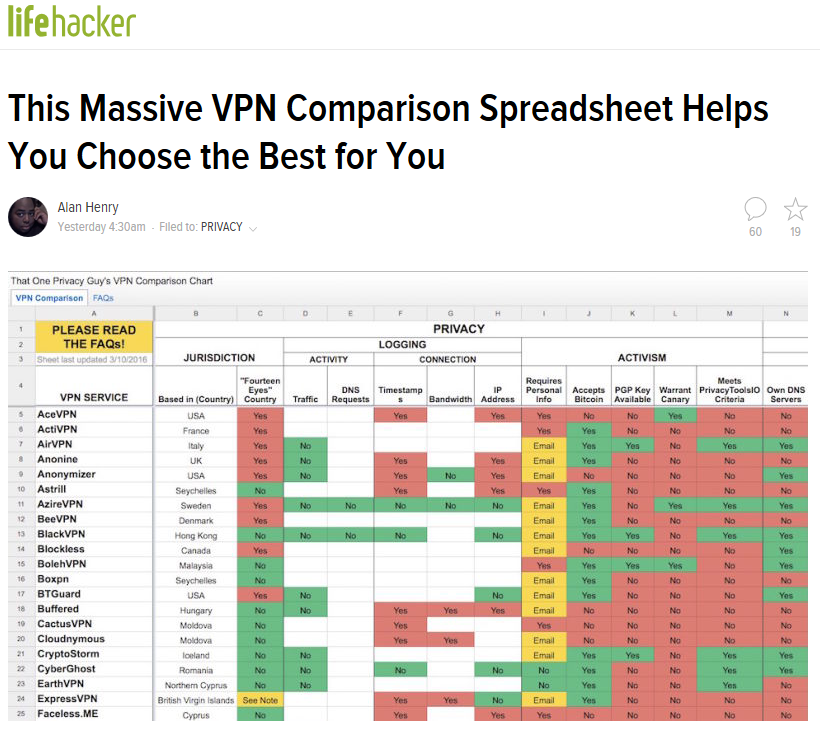

**Table of Contents**
<!-- MarkdownTOC -->

- [Networking](#networking)
	- [Next Generation Firewalls \(NGFW\)](#next-generation-firewalls-ngfw)
	- [Switches](#switches)
		- [Virtual LAN](#virtual-lan)
	- [Mobile Core Network](#mobile-core-network)
	- [Network virtualization. Software Defined Networking \(SDN\)](#network-virtualization-software-defined-networking-sdn)
	- [IPv4](#ipv4)
	- [IPv6](#ipv6)
	- [Network Forensics](#network-forensics)
	- [Network Performance](#network-performance)
		- [Network Performance Monitoring](#network-performance-monitoring)
	- [VoIP](#voip)
		- [Asterisk](#asterisk)
	- [MPLS Multi Protocol Label Switching \(IP VPN\)](#mpls-multi-protocol-label-switching-ip-vpn)
	- [WiFi security](#wifi-security)
	- [WiFi Products](#wifi-products)
	- [WebPerf and Resilient Networking: Planning for Failure](#webperf-and-resilient-networking-planning-for-failure)

<!-- /MarkdownTOC -->

<blockquote class="twitter-tweet tw-align-center" data-lang="es">
New NYC buses are getting Wi-Fi and USB charging ports <a href="https://t.co/eGYCfy9irR">https://t.co/eGYCfy9irR</a> <a href="https://t.co/TQOAuWziyT">pic.twitter.com/TQOAuWziyT</a>
&mdash; Mashable Tech (@mashabletech) <a href="https://twitter.com/mashabletech/status/707857779600584704">marzo 10, 2016</a></blockquote>

<blockquote class="twitter-tweet tw-align-center" data-lang="es">
Jump start <a href="https://twitter.com/hashtag/mobile?src=hash">#mobile</a> in your <a href="https://twitter.com/hashtag/enterprise?src=hash">#enterprise</a> <a href="https://t.co/S0ndPhWGa6">https://t.co/S0ndPhWGa6</a> (via <a href="https://twitter.com/cmswire">@CMSWire</a>)
&mdash; Red Hat EMEA (@RedHatEMEA) <a href="https://twitter.com/RedHatEMEA/status/708692854495956992">12 de marzo de 2016</a></blockquote>

<iframe width="560" height="315" src="https://www.youtube.com/embed/4YgGuK9cuSU?rel=0" frameborder="0" allowfullscreen class="video"></iframe>

 

<iframe width="560" height="315" src="https://www.youtube.com/embed/_EBkBNQ00c0?rel=0" frameborder="0" allowfullscreen class="video"></iframe>

 

<blockquote class="twitter-tweet tw-align-center" data-lang="es">
Average internet speed, 2015 (megabytes per second)  Korea: 20.3 Sweden: 17 Norway: 16.4 Japan: 15 UK: 13 US: 12 <a href="https://t.co/kc9pWmrGJC">pic.twitter.com/kc9pWmrGJC</a>
&mdash; The Int&#39;l Spectator (@intlspectator) <a href="https://twitter.com/intlspectator/status/711960597886164994">21 de marzo de 2016</a></blockquote>

<iframe width="560" height="315" src="https://www.youtube.com/embed/iMduQ96N1F8?rel=0" frameborder="0" allowfullscreen class="video"></iframe>

 

<iframe width="560" height="315" src="https://www.youtube.com/embed/rA0NhPJOFyw?rel=0" frameborder="0" allowfullscreen class="video"></iframe>

 

# Networking
## Next Generation Firewalls (NGFW)
- [Next Generation Firewalls (NGFW)](NGFW.md)

## Switches
- [reddit.com/r/networking](https://www.reddit.com/r/networking/)
- [SWITCH Security Report](http://securityblog.switch.ch/)
- [Layer 3 versus Layer 2 Switch for VLANs](https://documentation.meraki.com/MS/Layer_3_Switching/Layer_3_versus_Layer_2_Switch_for_VLANs)
- [Power over Ethernet or PoE](https://en.wikipedia.org/wiki/Power_over_Ethernet)
- [juniper switches](http://www.juniper.net/us/en/products-services/switching/)
- [Netgear switches](http://www.netgear.com/home/products/networking/switches/)
- [D-Link](http://www.dlink.com/uk/en/business-solutions/poe/switches)
- [Cisco Meraki](https://documentation.meraki.com/MS)
- [Cisco Small Business Switches](http://www.newegg.com/Switches/BrandSubCat/ID-12450-30)
- [Extreme](http://www.extremenetworks.com/products/switching-routing)
- [Linksys](http://www.linksys.com/us/c/business-network-switches/)
- [Dell](http://www.dell.com/us/business/p/switch-powerconnect)
- [HP Small and Midsize Business](http://www8.hp.com/us/en/networking/smb-networking-switches.html)
- [youtube: Dell Networking Z9100-ON 100GbE Fabric Switch](https://www.youtube.com/watch?v=GiGqRy5zgCM&feature=youtu.be)
- [The Top 10 Best Selling Switches By Brand](http://www.crn.com/slide-shows/networking/300072355/the-top-10-best-selling-switches-by-brand.htm)
- [Top 5 Small Business Switches](http://www.learncomputer.com/top-5-small-business-switches/)
- [community.spiceworks.com: Best 48 port small business switch?](https://community.spiceworks.com/topic/751984-best-48-port-small-business-switch)

<iframe width="560" height="315" src="https://www.youtube-nocookie.com/embed/GiGqRy5zgCM?rel=0" frameborder="0" allowfullscreen class="video"></iframe>

 

<blockquote class="twitter-tweet tw-align-center" data-lang="es">
I FOUND IT. I FOUND THE INTERNET SWITCH. <a href="https://t.co/7xdOxhimI7">pic.twitter.com/7xdOxhimI7</a>
&mdash; Whitney Champion (@shortxstack) <a href="https://twitter.com/shortxstack/status/707637919809404928">9 de marzo de 2016</a></blockquote>

### Virtual LAN
- [Virtual LAN](VLAN.md)

## Mobile Core Network
- [Mobile Core Network](mobilecore.md)

## Network virtualization. Software Defined Networking (SDN)
- [FOSS Network Functions Virtualization](https://www.opnfv.org)
- [SDxCentral.com: Trusted News and Resources for SDx, SDN, NFV](https://www.sdxcentral.com/)
- [sdxcentral.com: What is NFV – Network Functions Virtualization?](https://www.sdxcentral.com/resources/nfv/whats-network-functions-virtualization-nfv/)
	- [Software-defined networking (SDN)](https://www.sdxcentral.com/flow/sdn-software-defined-networking/)
- [SDxCentral’s Top 10 News Stories of 2015](https://www.sdxcentral.com/articles/news/sdxcentrals-top-10-news-stories-of-2015/2016/01/)
- [sdxcentral.com: The Top NFV & Telecom Influencers in 2015](https://www.sdxcentral.com/articles/news/top-nfv-influencers-2015/)
- [aunclicdelastic.com: SDN, NFV y los fundamentos de las redes del futuro](http://www.aunclicdelastic.com/sdn-nfv-y-los-fundamentos-de-las-redes-del-futuro/)
- [Open Source MANO](http://osm.etsi.org) Open Source Mano is an ETSI-hosted project to develop an Open Source NFV Management and Orchestration (MANO) software stack aligned with ETSI NFV.
	- [Telefónica se une a otras 22 operadoras y proveedores de equipos para crear una comunidad global de Open Source Mano (OSM)](https://www.telefonica.com/es/web/sala-de-prensa/-/telefonica-se-une-a-otras-22-operadoras-y-proveedores-de-equipos-para-crear-una-comunidad-global-de-open-source-mano-osm-)
- [2016 Survey Shows More and Diverse SDN Use Cases Being Deployed by Open SDN Power Users](https://www.opendaylight.org/news/blogs/2016/02/2016-survey-shows-more-and-diverse-sdn-use-cases-being-deployed-open-sdn-power)

<blockquote class="twitter-tweet tw-align-center" data-lang="es">
Great interview w/ <a href="https://twitter.com/darrelljs">@darrelljs</a> &amp; <a href="https://twitter.com/intel">@intel</a> John Healy discussing &quot;The Future of NFV&quot; <a href="https://twitter.com/TIA_Now">@TIA_Now</a> <a href="https://twitter.com/hashtag/MWC16?src=hash">#MWC16</a> <a href="https://twitter.com/OpenTelco">@OpenTelco</a> <a href="https://twitter.com/hashtag/redhat?src=hash">#redhat</a> <a href="https://t.co/NzB8p1Qur1">https://t.co/NzB8p1Qur1</a>
&mdash; Annie Potvin (@anniep0206) <a href="https://twitter.com/anniep0206/status/702396797063454722">febrero 24, 2016</a></blockquote>

<iframe width="560" height="315" src="https://www.youtube.com/embed/f9_Zb2npybA?rel=0" frameborder="0" allowfullscreen class="video"></iframe>

 

## IPv4
- [wikipedia: IPv4](https://en.wikipedia.org/wiki/IPv4)

<iframe src="//www.slideshare.net/slideshow/embed_code/key/efHHF5aHeCPyv" width="668" height="714" frameborder="0" marginwidth="0" marginheight="0" scrolling="no" style="border:1px solid #CCC; border-width:1px; margin-bottom:5px; max-width: 100%;" allowfullscreen class="video"> </iframe> 
 <strong> <a href="//www.slideshare.net/UmerQureshi9/simple-ipv4subnetting" title="Simple IPv4_Subnetting" target="_blank">Simple IPv4_Subnetting</a> </strong> from <strong><a href="//www.slideshare.net/UmerQureshi9" target="_blank">Umer Qureshi</a></strong> 

 

<iframe src="//www.slideshare.net/slideshow/embed_code/key/EnfPCPLoYI8A9Q" width="668" height="714" frameborder="0" marginwidth="0" marginheight="0" scrolling="no" style="border:1px solid #CCC; border-width:1px; margin-bottom:5px; max-width: 100%;" allowfullscreen class="video"> </iframe> 
 <strong> <a href="//www.slideshare.net/swapnilkapate/i-pv4-subnetting-16465968" title="I pv4 subnetting" target="_blank">I pv4 subnetting</a> </strong> from <strong><a href="//www.slideshare.net/swapnilkapate" target="_blank">Swapnil Kapate</a></strong> 

 

<iframe src="//www.slideshare.net/slideshow/embed_code/key/NTUP0U3kq421kQ" width="595" height="485" frameborder="0" marginwidth="0" marginheight="0" scrolling="no" style="border:1px solid #CCC; border-width:1px; margin-bottom:5px; max-width: 100%;" allowfullscreen class="video"> </iframe> 
 <strong> <a href="//www.slideshare.net/nilmenon/ccna-1-routing-and-switching-v50-chapter-9" title="CCNA 1 Routing and Switching v5.0 Chapter 9" target="_blank">CCNA 1 Routing and Switching v5.0 Chapter 9</a> </strong> from <strong><a href="//www.slideshare.net/nilmenon" target="_blank">Nil Menon</a></strong> 

 

<blockquote class="twitter-tweet tw-align-center" data-lang="es">
Telefónica se une a 22 operadoras y proveedores de equipos para crear una comunidad global Open Source Mano <a href="https://twitter.com/hashtag/MWC16?src=hash">#MWC16</a> <a href="https://t.co/gCRmbpHduW">https://t.co/gCRmbpHduW</a>
&mdash; Telefónica (@Telefonica) <a href="https://twitter.com/Telefonica/status/701724993441415168">febrero 22, 2016</a></blockquote>

<blockquote class="twitter-tweet tw-align-center" data-lang="es">
The future of Wi-Fi Is 10,000 times more energy efficient <a href="https://t.co/uaAsPJ2J0R">https://t.co/uaAsPJ2J0R</a>
&mdash; WIRED (@WIRED) <a href="https://twitter.com/WIRED/status/706244154184089600">5 de marzo de 2016</a></blockquote>

<blockquote class="twitter-tweet tw-align-center" data-lang="es">
Fibra óptica, el mejor vehículo para viajar hacia la nube ➡ <a href="https://t.co/zUq9TK7Smd">https://t.co/zUq9TK7Smd</a> <a href="https://twitter.com/hashtag/Conectividad?src=hash">#Conectividad</a> <a href="https://twitter.com/hashtag/Pymes?src=hash">#Pymes</a>
&mdash; Movistar pymes (@Movistar_pymes) <a href="https://twitter.com/Movistar_pymes/status/706232959653830662">5 de marzo de 2016</a></blockquote>

## IPv6
- [wikipedia: IPv6](https://en.wikipedia.org/wiki/IPv6)
- [arstechnica.com: IPv6 celebrates its 20th birthday by reaching 10 percent deployment](http://arstechnica.com/business/2016/01/ipv6-celebrates-its-20th-birthday-by-reaching-10-percent-deployment/)
- [opensource.com: 8 reasons to make the switch to IPv6](https://opensource.com/business/16/1/scale14x-interview-owen-delong-akamai-technologies)

<blockquote class="twitter-tweet tw-align-center" data-lang="es">
8 reasons to make the switch to IPv6: <a href="https://t.co/DBdU0Ap6Xv">https://t.co/DBdU0Ap6Xv</a>
&mdash; Open Source Way (@opensourceway) <a href="https://twitter.com/opensourceway/status/706178465226104833">5 de marzo de 2016</a></blockquote>

<iframe src="//www.slideshare.net/slideshow/embed_code/key/jNw65ZLpdYJz4Y" width="595" height="485" frameborder="0" marginwidth="0" marginheight="0" scrolling="no" style="border:1px solid #CCC; border-width:1px; margin-bottom:5px; max-width: 100%;" allowfullscreen class="video"> </iframe> 
 <strong> <a href="//www.slideshare.net/shaileshpachori/master-all-home" title="Ipv4 vs Ipv6 comparison" target="_blank">Ipv4 vs Ipv6 comparison</a> </strong> from <strong><a href="//www.slideshare.net/shaileshpachori" target="_blank">Shailesh Pachori</a></strong> 

 

## Network Forensics
- [Network Forensics](nw_forensics.md)

<iframe width="560" height="315" src="https://www.youtube.com/embed/CXVINBruzhY?rel=0" frameborder="0" allowfullscreen class="video"></iframe>

 

## Network Performance
- [infoworld.com: 10 tips for boosting network performance 🌟](http://www.infoworld.com/article/2627174/network-monitoring/10-tips-for-boosting-network-performance.html)

### Network Performance Monitoring
- [Solarwinds: Monitoring 101 ebook](https://thwack.solarwinds.com/docs/DOC-187523)
- [Solarwinds: Network Monitoring for Dummies](http://www.solarwinds.com/lp/bandwidth-analyzer-pack-plus-ebook.aspx)
- [ntop.org](http://www.ntop.org/)

<iframe width="560" height="315" src="https://www.youtube.com/embed/B8AgMu6Wr5g?rel=0" frameborder="0" allowfullscreen class="video"></iframe>

 

<iframe width="560" height="315" src="https://www.youtube.com/embed/TybbmHcxXek?list=PLE5D25EB7AA76EE4B" frameborder="0" allowfullscreen class="video"></iframe>

 

<iframe width="560" height="315" src="https://www.youtube.com/embed/-8xPLCIuQzE?rel=0" frameborder="0" allowfullscreen class="video"></iframe>

 

<blockquote class="twitter-tweet tw-align-center" data-lang="es">
NetCrunch 9: simply awesome network monitoring <a href="https://t.co/XqIkKuH912">https://t.co/XqIkKuH912</a> <a href="https://twitter.com/hashtag/SysAdmin?src=hash">#SysAdmin</a> <a href="https://twitter.com/hashtag/BigData?src=hash">#BigData</a> <a href="https://twitter.com/hashtag/CIO?src=hash">#CIO</a> <a href="https://twitter.com/hashtag/CTO?src=hash">#CTO</a> <a href="https://twitter.com/hashtag/DataViz?src=hash">#DataViz</a> <a href="https://twitter.com/hashtag/DevOps?src=hash">#DevOps</a> <a href="https://t.co/CiDQvRHKGj">pic.twitter.com/CiDQvRHKGj</a>
&mdash; AdRem Software (@adremsoftware) <a href="https://twitter.com/adremsoftware/status/734183514904616961">22 de mayo de 2016</a></blockquote>

## VoIP
- [voip-info.org](http://www.voip-info.org)
- [VoIP Planning: Calculate Your Bandwidth Before Adding SIP Trunk Service](http://it.toolbox.com/blogs/voip-news/voip-planning-calculate-your-bandwidth-before-adding-sip-trunk-service-66093)
- [The Importance of VoIP Voice Quality](http://it.toolbox.com/blogs/voip-news/the-importance-of-voip-voice-quality-65970)
- [10 Key VoIP Trends to Track in 2015](http://it.toolbox.com/blogs/voip-news/10-key-voip-trends-to-track-in-2015-66121)
- [The Power of VoIP in Disaster Recovery](http://it.toolbox.com/blogs/voip-news/the-power-of-voip-in-disaster-recovery-66205)
- [Implementing A Successful VoIP System](http://it.toolbox.com/blogs/voip-news/implementing-a-successful-voip-system-66450)
- [Hosted vs SIP and PBX: Which is best for your Business?](http://it.toolbox.com/blogs/voip-news/hosted-vs-sip-and-pbx-which-is-best-for-your-business-66697)
	- [Reddit: Hosted VoIP/PBX Suggestions. Moving FreePBX/Asterisk/3CX to the Cloud](http://www.reddit.com/r/sysadmin/comments/11ii9l/hosted_pbx_suggestions/)
- [Understanding the Key Differences between ESBCs and Firewalls?](https://www.edgewaternetworks.com/2015/05/understanding-the-key-differences-between-esbcs-and-firewalls/)
- [In 2015 Lync became Skype for Business](https://products.office.com/en-US/skype-for-business)
- [voipmonitoringzone.com: Enterprise VoIP is Growing Up and Meeting More Companies' Needs](http://www.voipmonitoringzone.com/articles/415200-enterprise-voip-growing-up-meeting-more-companies-needs.htm)
- [El 86% de las empresas utiliza herramientas de Comunicaciones Unificadas y colaboración. La colaboración móvil, el nuevo frente de batalla](http://www.aunclicdelastic.com/la-colaboracion-movil-el-nuevo-frente-de-batalla/)

<blockquote class="twitter-tweet tw-align-center" data-lang="es">
<a href="https://t.co/Xp1qr1NOFx">pic.twitter.com/Xp1qr1NOFx</a>
&mdash; Boing Boing (@BoingBoing) <a href="https://twitter.com/BoingBoing/status/726557954883768320">30 de abril de 2016</a></blockquote>

<blockquote class="reddit-card" data-card-created="1464421957"><a href="https://www.reddit.com/r/sysadmin/comments/11ii9l/hosted_pbx_suggestions/?ref=share&ref_source=embed">Hosted PBX Suggestions.</a> from <a href="http://www.reddit.com/r/sysadmin">sysadmin</a></blockquote>

### Asterisk
- [Asterisk.org](http://www.asterisk.org/)
- [Asterisk PBX wikipedia](https://en.wikipedia.org/wiki/Asterisk_(PBX))
- [reddit.com/r/Asterisk](https://www.reddit.com/r/Asterisk/)
- [Asterisk admin guide](https://wiki.asterisk.org/wiki/display/AST/Asterisk+Exported+Documentation)
- [How to manage your Asterisk PBX](http://www.voip-info.org/wiki/view/Asterisk+administration)
- [wiki.asterisk.org](https://wiki.asterisk.org)
- [asteriskguru.com](http://asteriskguru.com/)

<iframe src="//www.slideshare.net/slideshow/embed_code/key/fQJk4WddNmE05T" width="595" height="485" frameborder="0" marginwidth="0" marginheight="0" scrolling="no" style="border:1px solid #CCC; border-width:1px; margin-bottom:5px; max-width: 100%;" allowfullscreen class="video"> </iframe> 
 <strong> <a href="//www.slideshare.net/AmirHajihasani/what-is-asterisk-62524965" title="What is Asterisk?" target="_blank">What is Asterisk?</a> </strong> from <strong><a href="//www.slideshare.net/AmirHajihasani" target="_blank">Amir Hajihasani</a></strong> 

 

<iframe src="//www.slideshare.net/slideshow/embed_code/key/JTcpi44A1PS92b" width="595" height="485" frameborder="0" marginwidth="0" marginheight="0" scrolling="no" style="border:1px solid #CCC; border-width:1px; margin-bottom:5px; max-width: 100%;" allowfullscreen class="video"> </iframe> 
 <strong> <a href="//www.slideshare.net/MoisesSilva6/implementation-lessons-using-webrtc" title="Implementation Lessons using WebRTC in Asterisk" target="_blank">Implementation Lessons using WebRTC in Asterisk</a> </strong> from <strong><a href="//www.slideshare.net/MoisesSilva6" target="_blank">Moises Silva</a></strong> 

 

<iframe src="//www.slideshare.net/slideshow/embed_code/key/dW8piVlTlcM4j6" width="595" height="485" frameborder="0" marginwidth="0" marginheight="0" scrolling="no" style="border:1px solid #CCC; border-width:1px; margin-bottom:5px; max-width: 100%;" allowfullscreen class="video"> </iframe> 
 <strong> <a href="//www.slideshare.net/enjayworld/sugarcrm-asterisk-integration-by-enjay" title="Sugar CRM asterisk integration by enjay " target="_blank">Sugar CRM asterisk integration by enjay </a> </strong> from <strong><a href="//www.slideshare.net/enjayworld" target="_blank">Limesh Parekh</a></strong> 

 

## MPLS Multi Protocol Label Switching (IP VPN)
- [tech-faq.com: MPLS](http://www.tech-faq.com/mpls.html)
- [Why Cloud is making MPLS obsolete - and how Service Providers can adapt](https://www.linkedin.com/pulse/20140915110843-538739-why-cloud-is-making-mpls-obsolete-and-how-service-providers-can-adapt)
- [Software-defined wide-area network, Is this the end of MPLS VPNs?](https://www.linkedin.com/pulse/software-defined-wide-area-network-end-mpls-vpns-greg-de-chasteauneuf)
- [MPLS vs. Metro-Ethernet](https://www.linkedin.com/pulse/mpls-vs-metro-ethernet-dave-calhoun)

<iframe width="560" height="315" src="https://www.youtube.com/embed/H7KQcNRgGEk?rel=0" frameborder="0" allowfullscreen class="video"></iframe>

 

<iframe width="560" height="315" src="https://www.youtube.com/embed/E5Ud1m9h0yc?rel=0" frameborder="0" allowfullscreen class="video"></iframe>

 

<iframe width="560" height="315" src="https://www.youtube.com/embed/AtmmbsQTSa8?rel=0" frameborder="0" allowfullscreen class="video"></iframe>

 

## WiFi security
- [Analyzing the 1000 Most Common Wi-Fi Network Names](https://ghostpath.com/blog/ssid-analyzing-the-1000-most-common-wi-fi-network-names/)
	- [Recommend Length for Wi-FI PSK?](http://security.stackexchange.com/questions/15653/recommend-length-for-wi-fi-psk)
	- [Is a WPA/WPA2 Wi-Fi network secure?](https://www.acrylicwifi.com/en/blog/is-a-wpawpa2-wi-fi-network-secure/)
	- [wikipedia: Wi-Fi Protected Access](https://en.wikipedia.org/wiki/Wi-Fi_Protected_Access)
- [Ubiquiti Networks](https://www.ubnt.com)
- [Aruba Networks](http://www.arubanetworks.com)
- [HP Acquires Aruba Networks to Create an Industry Leader in Enterprise Mobility](http://www8.hp.com/hpnext/posts/hp-announcement-march-2015)
- [zdnet: DD-WRT Linux firmware comes to Linksys routers](http://www.zdnet.com/article/dd-wrt-linux-firmware-comes-to-linksys-routers/)

<iframe width="560" height="315" src="https://www.youtube.com/embed/6pYZ2N9y2fQ?rel=0" frameborder="0" allowfullscreen class="video"></iframe>

 

## WiFi Products
- [twitter.com/wifisafespain](https://twitter.com/wifisafespain)

<blockquote class="twitter-tweet tw-align-center" data-lang="es">
Cool. How Wi-Fi waves propagate in a building. <a href="https://twitter.com/hashtag/networking?src=hash">#networking</a> <a href="https://twitter.com/hashtag/WiFi?src=hash">#WiFi</a> <a href="https://t.co/VvB8sQwYE7">pic.twitter.com/VvB8sQwYE7</a>
&mdash; nixCraft (@nixcraft) <a href="https://twitter.com/nixcraft/status/736534890137550848">28 de mayo de 2016</a></blockquote>

## WebPerf and Resilient Networking: Planning for Failure
- [WebPerf & Resilient Networking: Planning for Failure. Service Worker tool, wireless and mobile network optimization](https://www.igvita.com/2015/01/26/resilient-networking/)
	- [HTML5: Introduction to Service Worker](http://www.html5rocks.com/en/tutorials/service-worker/introduction/)
- [10 emuladores WAN para que pruebes distintas condiciones de red](http://www.hackplayers.com/2015/10/10-emuladores-wan-para-que-pruebes.html)
- [NEWfly, Redes Cisco y Packet Tracker: Network, ejercicios Packet Tracer y simulación de vuelo](https://newfly.wordpress.com/)

<blockquote class="twitter-tweet tw-align-center" data-lang="es">
Internet cables under the sea that connects continents together. This is how they put the cables. <a href="https://t.co/K8WbrgoOEW">pic.twitter.com/K8WbrgoOEW</a>
&mdash; nixCraft (@nixcraft) <a href="https://twitter.com/nixcraft/status/705260332982231041">3 de marzo de 2016</a></blockquote>

<blockquote class="twitter-tweet tw-align-center" data-lang="es">
Latest submarine internet/telephone cable maps 2016 edition. Large version [3737x1818] <a href="https://t.co/32MZ0c4U6g">https://t.co/32MZ0c4U6g</a> <a href="https://t.co/sNFBRBJsKg">pic.twitter.com/sNFBRBJsKg</a>
&mdash; nixCraft (@nixcraft) <a href="https://twitter.com/nixcraft/status/711766471827791872">21 de marzo de 2016</a></blockquote>

<a href="http://www.buzzfeed.com/lukebailey/satisfying-cables">23 Photos That Will Make 
Anyone Who Works In IT Satisfied</a>

<iframe width="560" height="315" src="https://www.youtube.com/embed/c8AAQ1iH7FU?rel=0" frameborder="0" allowfullscreen class="video"></iframe>

 

<iframe width="560" height="315" src="https://www.youtube.com/embed/pwgmuEfrKCw?rel=0" frameborder="0" allowfullscreen class="video"></iframe>

 

<iframe width="560" height="315" src="https://www.youtube.com/embed/jpLKU6-4T7Q?rel=0" frameborder="0" allowfullscreen class="video"></iframe>

 

