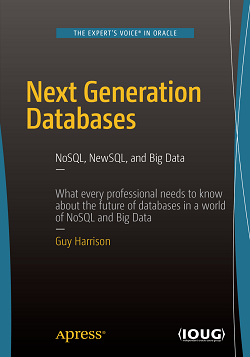
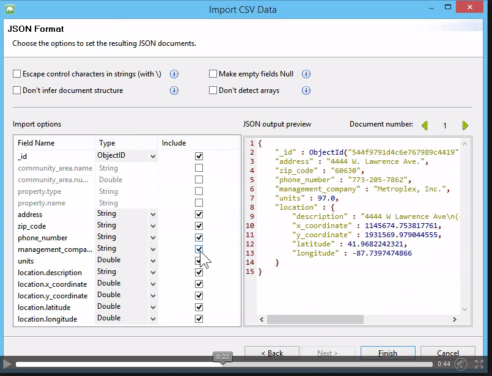

<!-- MarkdownTOC -->

- [NoSQL and NewSQL](#nosql-and-newsql)
    - [NoSQL](#nosql)
        - [MongoDB on Twitter](#mongodb-on-twitter)
        - [MongoDB Tools and MongoDB as a Service](#mongodb-tools-and-mongodb-as-a-service)
        - [Redis, Coudhdb, and others](#redis-coudhdb-and-others)
        - [Apache Drill. Schema free SQL query on everything engines](#apache-drill-schema-free-sql-query-on-everything-engines)
    - [NewSQL](#newsql)

<!-- /MarkdownTOC -->

# NoSQL and NewSQL
## NoSQL
- [Introduction to NoSQL by Martin Fowler, video tutorial](https://www.youtube.com/watch?v=qI_g07C_Q5I)
- [NoSQL vs. SQL: Choosing a Data Management Solution](http://www.javacodegeeks.com/2015/10/nosql-vs-sql.html)
- [NoSQL Guide, by Martin Fowler](http://martinfowler.com/nosql.html)
- [thoughtworks.com: NoSQL Databases, an overview](https://www.thoughtworks.com/insights/blog/nosql-databases-overview)
- [Diferencias entre SQL y NoSQL ¿Sabes cuál usar?](http://www.facilcloud.com/noticias/?p=1294&lang=es_ES)
- [zdnet.com: SQL, NoSQL? What's the difference these days?](http://www.zdnet.com/article/sql-nosql-whats-the-difference-these-days/)
- [NoSQL Databases: 4 Game-Changing Use Cases](http://www.smartdatacollective.com/kingmesal/373466/nosql-databases-4-game-changing-use-cases)
- [blog.couchbase.com podcast: NoSQL in the Perspective of Industry Leaders](http://blog.couchbase.com/2016/january/nosql-in-the-perspective-of-industry-leaders)
- [Query JSON Using SQL With Couchbase Query Workbench](https://dzone.com/articles/query-json-using-sql-with-couchbase-query-workbenc) Would you like to query a JSON document database using SQL-like syntax? Couchbase has N1QL for you.
- [DZone: A Primer on Open-Source NoSQL Databases](https://dzone.com/articles/a-primer-on-open-source-nosql-databases) A beginner's guide to the different flavors of NoSQL databases, including key-value, document-oriented, graph, and column-oriented databases.

<iframe width="560" height="315" src="https://www.youtube.com/embed/qI_g07C_Q5I" frameborder="0" allowfullscreen class="video"></iframe>

 

### MongoDB on Twitter
- [twitter.com/MongoDB](https://twitter.com/MongoDB)

### MongoDB Tools and MongoDB as a Service
- [MongoDB Tools - Admin GUIs, Monitoring and Other Good Stuff](http://mongodb-tools.com/)
- [blog.mongodirector.com: Which is the best MongoDB GUI?](http://blog.mongodirector.com/which-is-the-best-mongodb-gui/)
- [MongoLab: Fully managed MongoDB-as-a-Service](https://mongolab.com/)
- [Orchestrate: DBaaS|NoSQL with One REST API](https://orchestrate.io/)
- [mongodirector: MongoDB Hosting](http://mongodirector.com)
- [MongoDB security tutorial](https://docs.mongodb.org/manual/administration/security)
- [MongoDB Security Part 1 - Design and Configuration](http://blog.mongodb.org/post/86408399868/mongodb-security-part-1-design-and-configuration)
- [MongoDB Security Part II: 10 mistakes that can compromise your database](http://blog.mongodb.org/post/87691901392/mongodb-security-part-ii-10-mistakes-that-can)
- [Avoiding pitfalls running Mongo 3.2 in Docker on OSX](https://iainhunter.wordpress.com/2016/01/12/avoiding-pitfalls-running-mongo-3-2-in-docker-on-osx/)
- [MongoDB Tutorial – A Scalable NoSQL DB](http://www.javacodegeeks.com/2015/09/mongodb-a-scalable-nosql-db.html)
- [MongoDB Cloud Manager](https://youtu.be/bB57HKeOvmw)
- [3T MongoChef – Your New MongoDB GUI](http://3t.io/)
	- [Connecting to your MongoDB at MongoLab](http://3t.io/blog/how-to-connect-to-mongolab/)
	- Effortless CSV import into MongoDB with MongoChef 3.2 (click to see the video). You can export your collections to CSV:

<iframe width="560" height="315" src="https://www.youtube-nocookie.com/embed/CvIr-2lMLsk?rel=0" frameborder="0" allowfullscreen class="video"></iframe>

 

<iframe width="560" height="315" src="https://www.youtube-nocookie.com/embed/1uFY60CESlM?list=PL6gx4Cwl9DGDQ5DrbIl20Zu9hx1IjeVhO" frameborder="0" allowfullscreen class="video"></iframe>

 

<iframe src="//www.slideshare.net/slideshow/embed_code/key/IGi1FCvglHcbP7" width="595" height="485" frameborder="0" marginwidth="0" marginheight="0" scrolling="no" style="border:1px solid #CCC; border-width:1px; margin-bottom:5px; max-width: 100%;" allowfullscreen class="video"> </iframe> 
 <strong> <a href="//www.slideshare.net/kerneltraining/mongo-db-presentation-demo" title="MongoDB - Understand the Best Practices in Brief " target="_blank">MongoDB - Understand the Best Practices in Brief </a> </strong> from <strong><a href="//www.slideshare.net/kerneltraining" target="_blank">Kernel Training</a></strong> 

 
 

<blockquote class="twitter-tweet" data-lang="es">
SQL or NoSQL<a href="https://t.co/ilNZTJJOcG">https://t.co/ilNZTJJOcG</a>  Story of a company starting with MongoDB and quickly after hitting it&#39;s limits.
&mdash; SQL Performance Tips (@SQLPerfTips) <a href="https://twitter.com/SQLPerfTips/status/691609991531347968">enero 25, 2016</a></blockquote>

### Redis, Coudhdb, and others
- [NoSQL - Wikipedia](https://en.wikipedia.org/wiki/NoSQL)
- [Redis](http://redis.io/)
- [Couchdb.apache.org](http://couchdb.apache.org)
- [Cassandra.apache.org](http://cassandra.apache.org/)
- [HBase.apache.org](http://hbase.apache.org/)
- [Hive.apache.org](https://hive.apache.org/)
- [rethinkdb.com](http://rethinkdb.com)

### Apache Drill. Schema free SQL query on everything engines
- [Apache Drill](https://drill.apache.org/)
- [dzone: SQL Syntax for Apache Drill](https://dzone.com/refcardz/sql-syntax-for-apache-drill)

## NewSQL
- [NuoDB, elastically scalable database. A revolution compared to traditional monolithic 1-box databases. NuoDB is ACID,SQL, distributed/scalable and support flexible schemas](http://www.nuodb.com/)
- [Traditional database replication drawbacks](http://www.nuodb.com/blog/replication-is-it-easy)

<iframe src="//www.slideshare.net/slideshow/embed_code/key/dnVLNOUPK3BJDk" width="595" height="485" frameborder="0" marginwidth="0" marginheight="0" scrolling="no" style="border:1px solid #CCC; border-width:1px; margin-bottom:5px; max-width: 100%;" allowfullscreen class="video"> </iframe> 
 <strong> <a href="//www.slideshare.net/IvanGlushkov/newsql-overview" title="NewSQL overview, Feb 2015" target="_blank">NewSQL overview, Feb 2015</a> </strong> from <strong><a href="//www.slideshare.net/IvanGlushkov" target="_blank">Ivan Glushkov</a></strong> 

 

<iframe src="//www.slideshare.net/slideshow/embed_code/key/awDvLmQn6UWzM8" width="595" height="485" frameborder="0" marginwidth="0" marginheight="0" scrolling="no" style="border:1px solid #CCC; border-width:1px; margin-bottom:5px; max-width: 100%;" allowfullscreen class="video"> </iframe> 
 <strong> <a href="//www.slideshare.net/mattaslett/mysql-vs-nosql-and-newsql-survey-results-13073043" title="MySQL vs. NoSQL and NewSQL - survey results" target="_blank">MySQL vs. NoSQL and NewSQL - survey results</a> </strong> from <strong><a href="//www.slideshare.net/mattaslett" target="_blank">Matthew Aslett</a></strong> 

 
