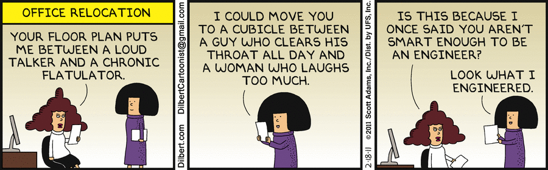
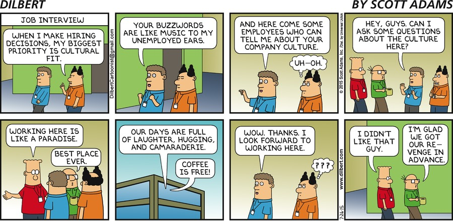
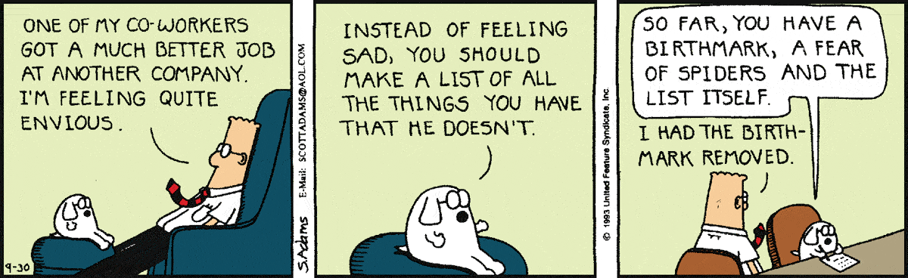
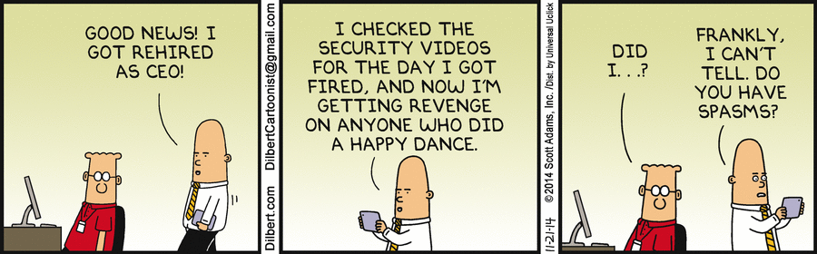

<!-- MarkdownTOC -->

- [Office Politics](#office-politics)
    - [Workplace Culture of Fear. Management by intimidation or fear. Lawsuit culture](#workplace-culture-of-fear-management-by-intimidation-or-fear-lawsuit-culture)

<!-- /MarkdownTOC -->

<blockquote class="twitter-tweet tw-align-center" data-lang="es">
^^ <a href="https://t.co/wHyUrJlqVS">pic.twitter.com/wHyUrJlqVS</a>
&mdash; Memes políticos (@PoliReac) <a href="https://twitter.com/PoliReac/status/706102689416011776">5 de marzo de 2016</a></blockquote>

# Office Politics
- [Forbes.com: Office Politics: Must You Play? A Handbook For Survival/Success](http://www.forbes.com/sites/cherylsnappconner/2013/04/14/office-politics-must-you-play-a-handbook-for-survivalsuccess/)
- [Setting up to fail](https://en.wikipedia.org/wiki/Setting_up_to_fail)
- [businessinsider.com: Only idiots don't play office politics — here's how to master the game](http://www.businessinsider.com/how-to-play-office-politics-2015-3)
- [Apple CEO Tim Cook on Collaboration and Office Politics](https://youtu.be/EZPYLZ7I6gs)
- [An Introvert's Guide to Surviving Team Lunches](http://goingconcern.com/post/introverts-guide-surviving-team-lunches)
- [workplace.stackexchange.com: Staying late for appearance?](http://workplace.stackexchange.com/questions/50655/staying-late-for-appearance)
- [cityam.com: I've been passed over for a promotion: Should I move jobs? 🌟](http://www.cityam.com/234517/debretts-ask-the-expert-ive-been-passed-over-for-a-promotion-should-i-move-jobs) 

 
<blockquote class="twitter-tweet tw-align-center" data-lang="es">
60 películas que deberías haber visto antes de votar el 20-D. Nº 43: &quot;The Ides of March&quot; (George Clooney, 2011)<a href="https://t.co/egXb7kp8WS">https://t.co/egXb7kp8WS</a>
&mdash; Melón Tajá En Mano (@melontajaenmano) <a href="https://twitter.com/melontajaenmano/status/664397112445116416">11 de noviembre de 2015</a></blockquote>

<blockquote class="twitter-tweet tw-align-center" data-lang="es">
Trailer de House of Cards, repaso ideal antes de ver la Temp 4. El líder que nos merecemos (Sin subtítulos) <a href="https://t.co/7XtQBSxt3G">https://t.co/7XtQBSxt3G</a>
&mdash; Santiago García (@sangarciacorre) <a href="https://twitter.com/sangarciacorre/status/707600155177041920">9 de marzo de 2016</a></blockquote>

<blockquote class="twitter-tweet tw-align-center" data-lang="es">
Cuando estudias ciencias políticas y te dicen que House of Cards es realista. <a href="https://t.co/OCM9HApXwN">pic.twitter.com/OCM9HApXwN</a>
&mdash; Memes políticos (@PoliReac) <a href="https://twitter.com/PoliReac/status/707571385778970626">9 de marzo de 2016</a></blockquote>

<blockquote class="twitter-tweet tw-align-center" data-lang="es">
Cuando alguien te dice que es de izquierdas y luego que su diario de referencia es El País <a href="https://t.co/yV0OHGmw4A">pic.twitter.com/yV0OHGmw4A</a>
&mdash; Memes políticos (@PoliReac) <a href="https://twitter.com/PoliReac/status/696725391520747520">8 de febrero de 2016</a></blockquote>

<blockquote class="twitter-tweet tw-align-center" data-lang="es">
A bit of Philip Seymour Hoffman to brighten up your Friday...<a href="https://t.co/WNGDU7fHEE">https://t.co/WNGDU7fHEE</a>
&mdash; Luke Massey (@LukeMassey) <a href="https://twitter.com/LukeMassey/status/705714882251984896">4 de marzo de 2016</a></blockquote>

<iframe width="560" height="315" src="https://www.youtube.com/embed/UGdRyPN3IRk?rel=0" frameborder="0" allowfullscreen class="video"></iframe>

 

<iframe width="420" height="315" src="https://www.youtube.com/embed/5Xo4OhTKc1k?rel=0" frameborder="0" allowfullscreen class="video"></iframe>

 

<iframe width="560" height="315" src="https://www.youtube.com/embed/EZPYLZ7I6gs" frameborder="0" allowfullscreen class="video"></iframe>

 

<iframe width="560" height="315" src="https://www.youtube.com/embed/aZVkW9p-cCU?rel=0" frameborder="0" allowfullscreen class="video"></iframe>

 

<iframe width="560" height="315" src="https://www.youtube.com/embed/9FnO3igOkOk?rel=0" frameborder="0" allowfullscreen class="video"></iframe>

 

<iframe width="560" height="315" src="https://www.youtube.com/embed/F2RBKJs7swI?rel=0" frameborder="0" allowfullscreen class="video"></iframe>

 

<iframe width="420" height="315" src="https://www.youtube.com/embed/-dHLLfg6TTM?rel=0" frameborder="0" allowfullscreen class="video"></iframe>

 

<iframe width="560" height="315" src="https://www.youtube.com/embed/9KCsELZYYRo?rel=0" frameborder="0" allowfullscreen class="video"></iframe>

 

<iframe width="560" height="315" src="https://www.youtube.com/embed/tVc86xsTzvk?rel=0" frameborder="0" allowfullscreen class="video"></iframe>

 

<iframe width="560" height="315" src="https://www.youtube.com/embed/QPJnQ9JB5xA?rel=0" frameborder="0" allowfullscreen class="video"></iframe>

 

<iframe width="560" height="315" src="https://www.youtube.com/embed/SDVkxsaLews?rel=0" frameborder="0" allowfullscreen class="video"></iframe>

 

<iframe width="560" height="315" src="https://www.youtube.com/embed/RgMhJh5fXbw?rel=0" frameborder="0" allowfullscreen class="video"></iframe>

 

<iframe width="560" height="315" src="https://www.youtube.com/embed/k4tzs2dF0ek?rel=0" frameborder="0" allowfullscreen class="video"></iframe>

 

<iframe width="560" height="315" src="https://www.youtube.com/embed/Ua1LmjULtg4?rel=0" frameborder="0" allowfullscreen class="video"></iframe>

 

<iframe width="560" height="315" src="https://www.youtube.com/embed/SajyRLLWzy0?rel=0" frameborder="0" allowfullscreen class="video"></iframe>

 

<iframe width="560" height="315" src="https://www.youtube.com/embed/oqFoy8ehzuc?rel=0" frameborder="0" allowfullscreen class="video"></iframe>

 

<iframe width="560" height="315" src="https://www.youtube.com/embed/gpbv4oCv100?rel=0" frameborder="0" allowfullscreen class="video"></iframe>

 

## Workplace Culture of Fear. Management by intimidation or fear. Lawsuit culture
- [The 8 Clear Signs of a Workplace Culture of Fear ](http://www.eremedia.com/tlnt/the-8-clear-signs-of-a-workplace-culture-of-fear/)
- [How to Change a Culture of Fear](https://www.shrm.org/publications/hrmagazine/editorialcontent/2016/0116/pages/0116-execbrief.aspx)
- [Latest Top Manager Suicide by Ex Zurich CEO: Why?](https://www.linkedin.com/pulse/latest-top-manager-suicide-ex-zurich-ceo-why-dr-thomas-d-zweifel)
- [Management by Threat, Fear & Intimidation](https://www.linkedin.com/pulse/20141205072024-40413724-management-by-threat-fear-intimidation)
- [Management by intimidation will just not work](http://gulfnews.com/business/analysis/management-by-intimidation-will-just-not-work-1.1312175) Those who work within a culture that is intimidating will never give of their best
- [The Best Antidote for Intimidation is to Intimidate the Intimidator](http://bobmaconbusiness.com/?p=4961)

<iframe width="560" height="315" src="https://www.youtube.com/embed/lGNiDK8vyxQ?rel=0" frameborder="0" allowfullscreen class="video"></iframe>

 

<blockquote class="twitter-tweet tw-align-center" data-lang="es">
Una grabación muestra a una médico del Clínico de Valencia presionando a una aspirante para que renuncie a una plaza <a href="https://t.co/G0lNJM4zRR">https://t.co/G0lNJM4zRR</a>
&mdash; Antena3Noticias (@A3Noticias) <a href="https://twitter.com/A3Noticias/status/740288849109254144">7 de junio de 2016</a></blockquote>

<a href="https://www.meneame.net/story/otra-grabacion-sanidad-no-entra-quiere-jefe-plaza-desconvoca">Otra grabación en Sanidad: Si no entra el que quiere el jefe, la plaza se desconvoca </a>

<blockquote class="twitter-tweet tw-align-center" data-lang="es">
Venganzas de cine: 15 películas que se sirven frías <a href="https://t.co/TDcYh6w85T">https://t.co/TDcYh6w85T</a> Subgénero por excelencia. <a href="https://t.co/icVTEUovpw">pic.twitter.com/icVTEUovpw</a>
&mdash; CINEMANIA_ES (@CINEMANIA_ES) <a href="https://twitter.com/CINEMANIA_ES/status/711940489243725824">21 de marzo de 2016</a></blockquote>

<iframe width="560" height="315" src="https://www.youtube.com/embed/4WbxYzAG2I4?rel=0" frameborder="0" allowfullscreen class="video"></iframe>

 
