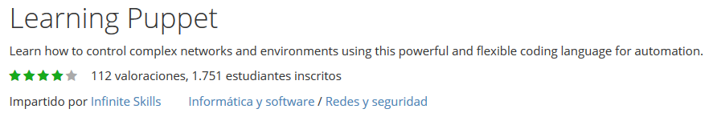
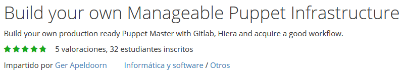
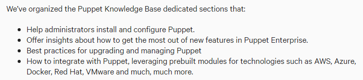
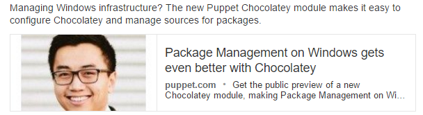

<!-- MarkdownTOC -->

- [Puppet](#puppet)
    - [DZone and Puppet](#dzone-and-puppet)
    - [Application Orchestration](#application-orchestration)
    - [WebLogic via Puppet](#weblogic-via-puppet)

<!-- /MarkdownTOC -->

<blockquote class="twitter-tweet tw-align-center" data-lang="es">
Test your configuration management skills in <a href="https://twitter.com/hashtag/puppet?src=hash">#puppet</a> by visiting training showcase. Not @ <a href="https://twitter.com/hashtag/rhsummit?src=hash">#rhsummit</a>? No sweat! | <a href="https://t.co/Rehj1Y7Z1X">https://t.co/Rehj1Y7Z1X</a>
&mdash; Red Hat Training (@RedHat_Training) <a href="https://twitter.com/RedHat_Training/status/748235843815411712">29 de junio de 2016</a></blockquote>

# Puppet
- [The Puppet Labs Issue Tracker](https://tickets.puppetlabs.com)
- [Google Groups puppet-bugs](https://groups.google.com/forum/#!forum/puppet-bugs)
- [Google Groups puppet-users](https://groups.google.com/forum/#!forum/puppet-users)
- [r/puppet 🌟🌟🌟](https://www.reddit.com/r/puppet)
- [Download the Learning VM 🌟](https://puppetlabs.com/download-learning-vm)
	- [Bringing application orchestration to the Learning VM](https://puppetlabs.com/blog/bringing-application-orchestration-to-learning-vm)
- [sysadmincasts.com: Learning Puppet with Vagrant](http://sysadmincasts.com/episodes/8-learning-puppet-with-vagrant)
	- [Sysadmincasts.com: Git to Puppet Deployment Workflow](https://sysadmincasts.com/episodes/33-git-to-puppet-deployment-workflow)
- [Webinar: Getting Started with Puppet Enterprise 3.3](https://puppetlabs.com/webinars/getting-started-puppet-enterprise-33-us)
	- [Puppet Enterprise 3.3 disponible con soporte para RHEL 7, Ubuntu 14.04 LTS, Windows Server 2012 R2, y Mac OS X Mavericks](https://puppetlabs.com/blog/puppet-enterprise-3.3-get-started-faster)
	- [Learning Puppet can be like drinking from a fire hose. Here is a guide to basic terms and resources to help you learn](https://puppetlabs.com/blog/starting-puppet-basics-from-puppet-labs-employee)
	- [puppetlabs/mcollective](https://forge.puppetlabs.com/puppetlabs/mcollective)
- [Github: The Puppet Dashboard is a web interface providing node classification and reporting features for Puppet, an open source system configuration management tool](https://github.com/sodabrew/puppet-dashboard)
- [Github: Smarter Puppet deployment.R10k provides a general purpose toolset for deploying Puppet environments and modules](https://github.com/puppetlabs/r10k)
- [Librarian-puppet is a bundler for your puppet infrastructure. You can use librarian-puppet to manage the puppet modules your infrastructure depends on, whether the modules come from the Puppet Forge, Git repositories or a just a path](http://librarian-puppet.com/)
- [Puppet and Python](http://pyvideo.org/video/3649/puppet-and-python)
- [Puppet Modules: Apps for Ops](http://pyvideo.org/video/2589/puppet-modules-apps-for-ops)
- [Geppetto, eclipse plugin for puppet](https://puppetlabs.com/blog-tags/geppetto)
- [New Releases for AWS and vSphere Modules](https://puppetlabs.com/blog/new-releases-aws-and-vsphere-modules)
- [puppet.com: Learn to use command line, Vim and Git with our new guide](https://puppet.com/blog/learn-use-command-line-vim-and-git-our-new-guide)

<blockquote class="reddit-card" data-card-created="1467912191"><a href="https://www.reddit.com/r/Puppet/comments/4rbbm5/puppet_4_user_base/?ref=share&ref_source=embed">Puppet 4 user base</a> from <a href="http://www.reddit.com/r/Puppet">Puppet</a></blockquote>

## DZone and Puppet
- [DZone: Puppet Labs Redefines Application Orchestration](https://dzone.com/articles/puppet-labs-redefines-application-orchestration)
- [DZone: Building Docker Images with Puppet](https://dzone.com/articles/building-docker-images-puppet)
- [DZone: Learning Puppet or Chef? Check out Vagrant!](https://dzone.com/articles/learning-puppet-or-chef-check)
- [DZone: Puppet vs. Chef – The Devops Deathmatch](https://dzone.com/articles/puppet-vs-chef-%E2%80%93-devops)
- [DZone: Minimalistic Practical Introduction to Puppet (Not Only) For Vagrant Users](https://dzone.com/articles/minimalistic-practical)
- [DZone: Puppet or Ansible: How to Choose? 🌟](https://dzone.com/articles/puppet-or-ansible-how-to-choose)
- [DZone: Puppet editing like a pro](https://dzone.com/articles/puppet-editing-pro)
- [DZone: Puppet unit testing like a pro](https://dzone.com/articles/puppet-unit-testing-pro)
- [DZone: Setting up a LAMP box with Puppet](https://dzone.com/articles/setting-lamp-box-puppet)
- [DZone: Intro to Puppet, Installing your First MySQL Service in 5 Minutes 🌟](https://dzone.com/articles/intro-puppet-installing-your)
- [DZone: A Practical, Quick Introduction to Puppet 🌟🌟](https://dzone.com/articles/practical-quick-introduction)
- [DZone: Puppet: A Beginners Concept Guide (Part 1) 🌟](https://dzone.com/articles/puppet-beginners-concept-guide)
- [DZone: Puppet for Java Developers](https://dzone.com/articles/puppet-java-developers)
- [DZone: Puppet Server: Advanced Memory Debugging](https://dzone.com/articles/puppet-server-advanced-memory-debugging) How to monitor, prevent, and debug memory issues in the open source and proprietary Puppet Server tools.

<iframe src="//www.slideshare.net/slideshow/embed_code/key/LeKMrJyR3gVMb3" width="595" height="485" frameborder="0" marginwidth="0" marginheight="0" scrolling="no" style="border:1px solid #CCC; border-width:1px; margin-bottom:5px; max-width: 100%;" allowfullscreen class="video"> </iframe> 
 <strong> <a href="//www.slideshare.net/PuppetLabs/intro-to-puppet-enterprise" title="Intro to Puppet Enterprise" target="_blank">Intro to Puppet Enterprise</a> </strong> from <strong><a target="_blank" href="//www.slideshare.net/PuppetLabs">Puppet Labs</a></strong> 

 

<iframe src="//www.slideshare.net/slideshow/embed_code/key/KCLCAn7vDzs3KO" width="595" height="485" frameborder="0" marginwidth="0" marginheight="0" scrolling="no" style="border:1px solid #CCC; border-width:1px; margin-bottom:5px; max-width: 100%;" allowfullscreen class="video"> </iframe> 
 <strong> <a href="//www.slideshare.net/PuppetLabs/roles-talk" title="Designing Puppet: Roles/Profiles Pattern" target="_blank">Designing Puppet: Roles/Profiles Pattern</a> </strong> from <strong><a target="_blank" href="//www.slideshare.net/PuppetLabs">Puppet Labs</a></strong> 

 

<iframe src="//www.slideshare.net/slideshow/embed_code/key/7pFfWOtA1RgC9h" width="595" height="485" frameborder="0" marginwidth="0" marginheight="0" scrolling="no" style="border:1px solid #CCC; border-width:1px; margin-bottom:5px; max-width: 100%;" allowfullscreen class="video"> </iframe> 
 <strong> <a href="//www.slideshare.net/PuppetLabs/presentation-16281121" title="Managing Puppet using MCollective" target="_blank">Managing Puppet using MCollective</a> </strong> from <strong><a target="_blank" href="//www.slideshare.net/PuppetLabs">Puppet Labs</a></strong> 

 

<iframe src="//www.slideshare.net/slideshow/embed_code/key/lXlp7Yv3tTQugF" width="595" height="485" frameborder="0" marginwidth="0" marginheight="0" scrolling="no" style="border:1px solid #CCC; border-width:1px; margin-bottom:5px; max-width: 100%;" allowfullscreen class="video"> </iframe> 
 <strong> <a href="//www.slideshare.net/PuppetLabs/using-docker-with-puppet-puppetconf-2014" title="Using Docker with Puppet - PuppetConf 2014" target="_blank">Using Docker with Puppet - PuppetConf 2014</a> </strong> from <strong><a target="_blank" href="//www.slideshare.net/PuppetLabs">Puppet Labs</a></strong> 

 

<iframe src="//www.slideshare.net/slideshow/embed_code/key/LNfKPjNPzsuX6Z" width="595" height="485" frameborder="0" marginwidth="0" marginheight="0" scrolling="no" style="border:1px solid #CCC; border-width:1px; margin-bottom:5px; max-width: 100%;" allowfullscreen class="video"> </iframe> 
 <strong> <a href="//www.slideshare.net/markstanislav/being-a-puppet-master-automating-amazon-ec2-with-puppet-friends" title="Being a Puppet Master: Automating Amazon EC2 with Puppet &amp; Friends" target="_blank">Being a Puppet Master: Automating Amazon EC2 with Puppet &amp; Friends</a> </strong> from <strong><a target="_blank" href="//www.slideshare.net/markstanislav">Mark Stanislav</a></strong> 

 

<iframe src="//www.slideshare.net/slideshow/embed_code/key/qb3mzd1ry4j6z0" width="595" height="485" frameborder="0" marginwidth="0" marginheight="0" scrolling="no" style="border:1px solid #CCC; border-width:1px; margin-bottom:5px; max-width: 100%;" allowfullscreen class="video"> </iframe> 
 <strong> <a href="//www.slideshare.net/MichaelLessard/satellite6-puppet" title="Red Hat Satellite 6 - Automation with Puppet" target="_blank">Red Hat Satellite 6 - Automation with Puppet</a> </strong> from <strong><a target="_blank" href="//www.slideshare.net/MichaelLessard">Michael Lessard</a></strong> 

 

<iframe src="//www.slideshare.net/slideshow/embed_code/key/mHlqA3ROEXwyPs" width="595" height="485" frameborder="0" marginwidth="0" marginheight="0" scrolling="no" style="border:1px solid #CCC; border-width:1px; margin-bottom:5px; max-width: 100%;" allowfullscreen class="video"> </iframe> 
 <strong> <a href="//www.slideshare.net/PuppetLabs/puppet-and-windowspuppetconf2013" title="Managing Windows Systems with Puppet - PuppetConf 2013" target="_blank">Managing Windows Systems with Puppet - PuppetConf 2013</a> </strong> from <strong><a target="_blank" href="//www.slideshare.net/PuppetLabs">Puppet Labs</a></strong> 

 

<iframe src="//www.slideshare.net/slideshow/embed_code/key/Gzw3j4WkrneLRu" width="595" height="485" frameborder="0" marginwidth="0" marginheight="0" scrolling="no" style="border:1px solid #CCC; border-width:1px; margin-bottom:5px; max-width: 100%;" allowfullscreen class="video"> </iframe> 
 <strong> <a href="//www.slideshare.net/PuppetLabs/package-management-on-windows-with-chocolatey" title="Package Management on Windows with Chocolatey" target="_blank">Package Management on Windows with Chocolatey</a> </strong> from <strong><a target="_blank" href="//www.slideshare.net/PuppetLabs">Puppet Labs</a></strong> 

 

<iframe src="//www.slideshare.net/slideshow/embed_code/key/kqmWm1w92oO9qk" width="595" height="485" frameborder="0" marginwidth="0" marginheight="0" scrolling="no" style="border:1px solid #CCC; border-width:1px; margin-bottom:5px; max-width: 100%;" allowfullscreen class="video"> </iframe> 
 <strong> <a href="//www.slideshare.net/PuppetLabs/windows-configuration-management-managing-packages-services-power-shell02102016" title="Windows Configuration Management: Managing Packages, Services, &amp; Power Shell-02102016" target="_blank">Windows Configuration Management: Managing Packages, Services, &amp; Power Shell-02102016</a> </strong> from <strong><a target="_blank" href="//www.slideshare.net/PuppetLabs">Puppet Labs</a></strong> 

 

<iframe src="//www.slideshare.net/slideshow/embed_code/key/hk1c1U5mlZsDNV" width="595" height="485" frameborder="0" marginwidth="0" marginheight="0" scrolling="no" style="border:1px solid #CCC; border-width:1px; margin-bottom:5px; max-width: 100%;" allowfullscreen class="video"> </iframe> 
 <strong> <a href="//www.slideshare.net/rluttikhuizen/weblogic-hackathon-automated-provisioning-using-puppet" title="WebLogic Hackathon: Automated Provisioning using Puppet" target="_blank">WebLogic Hackathon: Automated Provisioning using Puppet</a> </strong> from <strong><a target="_blank" href="//www.slideshare.net/rluttikhuizen">Ronald van Luttikhuizen</a></strong> 

 

<iframe src="//www.slideshare.net/slideshow/embed_code/key/AhNa8uqPy4TPNv" width="595" height="485" frameborder="0" marginwidth="0" marginheight="0" scrolling="no" style="border:1px solid #CCC; border-width:1px; margin-bottom:5px; max-width: 100%;" allowfullscreen class="video"> </iframe> 
 <strong> <a href="//www.slideshare.net/jaytaph/puppet-for-dummies-zendcon-2011-edition" title="Puppet for dummies - ZendCon 2011 Edition" target="_blank">Puppet for dummies - ZendCon 2011 Edition</a> </strong> from <strong><a target="_blank" href="//www.slideshare.net/jaytaph">Joshua Thijssen</a></strong> 

 

<iframe src="//www.slideshare.net/slideshow/embed_code/key/s8uHc2tGJjh6hM" width="595" height="485" frameborder="0" marginwidth="0" marginheight="0" scrolling="no" style="border:1px solid #CCC; border-width:1px; margin-bottom:5px; max-width: 100%;" allowfullscreen class="video"> </iframe> 
 <strong> <a href="//www.slideshare.net/icinga/icinga-2-and-puppet-automate-monitoring-59262858" title="Icinga 2 and Puppet automate monitoring" target="_blank">Icinga 2 and Puppet automate monitoring</a> </strong> from <strong><a target="_blank" href="//www.slideshare.net/icinga">Icinga</a></strong> 

 

<iframe src="//www.slideshare.net/slideshow/embed_code/key/LeKMrJyR3gVMb3" width="595" height="485" frameborder="0" marginwidth="0" marginheight="0" scrolling="no" style="border:1px solid #CCC; border-width:1px; margin-bottom:5px; max-width: 100%;" allowfullscreen class="video"> </iframe> 
 <strong> <a href="//www.slideshare.net/PuppetLabs/intro-to-puppet-enterprise" title="Intro to Puppet Enterprise" target="_blank">Intro to Puppet Enterprise</a> </strong> from <strong><a target="_blank" href="//www.slideshare.net/PuppetLabs">Puppet Labs</a></strong> 

 

<iframe src="//www.slideshare.net/slideshow/embed_code/key/2CnWFabnOJIPvN" width="595" height="485" frameborder="0" marginwidth="0" marginheight="0" scrolling="no" style="border:1px solid #CCC; border-width:1px; margin-bottom:5px; max-width: 100%;" allowfullscreen class="video"> </iframe> 
 <strong> <a href="//www.slideshare.net/GiacomoVacca/docker-and-puppet-for-continuous-integration" title="Docker and Puppet for Continuous Integration" target="_blank">Docker and Puppet for Continuous Integration</a> </strong> from <strong><a target="_blank" href="//www.slideshare.net/GiacomoVacca">Giacomo Vacca</a></strong> 

 

<iframe src="//www.slideshare.net/slideshow/embed_code/key/9tV11iZZJ5QILi" width="595" height="485" frameborder="0" marginwidth="0" marginheight="0" scrolling="no" style="border:1px solid #CCC; border-width:1px; margin-bottom:5px; max-width: 100%;" allowfullscreen class="video"> </iframe> 
 <strong> <a href="//www.slideshare.net/pkill/puppetconf-2015-puppet-reporting-with-elasticsearch-logstash-and-kibana" title="Puppetconf 2015 - Puppet Reporting with Elasticsearch Logstash and Kibana" target="_blank">Puppetconf 2015 - Puppet Reporting with Elasticsearch Logstash and Kibana</a> </strong> from <strong><a target="_blank" href="//www.slideshare.net/pkill">pkill</a></strong> 

 

<iframe src="//www.slideshare.net/slideshow/embed_code/key/3e0oMXo6gRcM5f" width="595" height="485" frameborder="0" marginwidth="0" marginheight="0" scrolling="no" style="border:1px solid #CCC; border-width:1px; margin-bottom:5px; max-width: 100%;" allowfullscreen class="video"> </iframe> 
 <strong> <a href="//www.slideshare.net/RanjitAvasarala/installaling-puppet-master-and-agent" title="Installaling Puppet Master and Agent" target="_blank">Installaling Puppet Master and Agent</a> </strong> from <strong><a target="_blank" href="//www.slideshare.net/RanjitAvasarala">Ranjit Avasarala</a></strong> 

 

<iframe src="//www.slideshare.net/slideshow/embed_code/key/EZb7EDFCxxSXgq" width="595" height="485" frameborder="0" marginwidth="0" marginheight="0" scrolling="no" style="border:1px solid #CCC; border-width:1px; margin-bottom:5px; max-width: 100%;" allowfullscreen class="video"> </iframe> 
 <strong> <a href="//www.slideshare.net/PuppetLabs/puppetdb-puppet-explorer-and-puppetdbquery" title="PuppetDB, Puppet Explorer and puppetdbquery" target="_blank">PuppetDB, Puppet Explorer and puppetdbquery</a> </strong> from <strong><a target="_blank" href="//www.slideshare.net/PuppetLabs">Puppet Labs</a></strong> 

 

<iframe src="//www.slideshare.net/slideshow/embed_code/key/MZmNE7yYX3MHfc" width="595" height="485" frameborder="0" marginwidth="0" marginheight="0" scrolling="no" style="border:1px solid #CCC; border-width:1px; margin-bottom:5px; max-width: 100%;" allowfullscreen class="video"> </iframe> 
 <strong> <a href="//www.slideshare.net/aestasit/infrastructure-automation-with-gradle-and-puppet" title="Infrastructure automation with Gradle and Puppet for GR8Conf EU 2015" target="_blank">Infrastructure automation with Gradle and Puppet for GR8Conf EU 2015</a> </strong> from <strong><a target="_blank" href="//www.slideshare.net/aestasit">Aestas IT</a></strong> 

 

<iframe src="//www.slideshare.net/slideshow/embed_code/key/CQAMMJm31o8dtH" width="595" height="485" frameborder="0" marginwidth="0" marginheight="0" scrolling="no" style="border:1px solid #CCC; border-width:1px; margin-bottom:5px; max-width: 100%;" allowfullscreen class="video"> </iframe> 
 <strong> <a href="//www.slideshare.net/aestasit/infrastructure-automation-with-gradle-and-puppet-at-greach-2015" title="Infrastructure automation with gradle and puppet at Greach 2015" target="_blank">Infrastructure automation with gradle and puppet at Greach 2015</a> </strong> from <strong><a target="_blank" href="//www.slideshare.net/aestasit">Aestas IT</a></strong> 

 

<iframe src="//www.slideshare.net/slideshow/embed_code/key/euCWWTXoMSsAmE" width="595" height="485" frameborder="0" marginwidth="0" marginheight="0" scrolling="no" style="border:1px solid #CCC; border-width:1px; margin-bottom:5px; max-width: 100%;" allowfullscreen class="video"> </iframe> 
 <strong> <a href="//www.slideshare.net/EderRoger/provisioning-environments-a-simply" title="Provisioning environments. A simplistic approach" target="_blank">Provisioning environments. A simplistic approach</a> </strong> from <strong><a target="_blank" href="//www.slideshare.net/EderRoger">Eder Roger Souza</a></strong> 

 

<iframe src="//www.slideshare.net/slideshow/embed_code/key/fvI4rXQQfGbAN3" width="595" height="485" frameborder="0" marginwidth="0" marginheight="0" scrolling="no" style="border:1px solid #CCC; border-width:1px; margin-bottom:5px; max-width: 100%;" allowfullscreen class="video"> </iframe> 
 <strong> <a href="//www.slideshare.net/bobtfish/chasing-ami-puppetcamplondonapr2014" title="Chasing AMI - Building Amazon machine images with Puppet, Packer and Jenkins" target="_blank">Chasing AMI - Building Amazon machine images with Puppet, Packer and Jenkins</a> </strong> from <strong><a href="//www.slideshare.net/bobtfish" target="_blank">Tomas Doran</a></strong> 

 

<iframe width="560" height="315" src="https://www.youtube.com/embed/pnn7fqBKI4E?rel=0" frameborder="0" allowfullscreen class="video"></iframe>

 

<iframe width="560" height="315" src="https://www.youtube.com/embed/73xeSTz8AeA?list=PLtNErhYMkHnEu1_ZHSJt1xF--zU35dRgZ" frameborder="0" allowfullscreen class="video"></iframe>

 

<iframe width="560" height="315" src="https://www.youtube.com/embed/cA33Q3ms5mE?list=PLijGikwhOQLZGRmpd0f62EbyzEDuTk19h" frameborder="0" allowfullscreen class="video"></iframe>

 

<iframe width="560" height="315" src="https://www.youtube.com/embed/8wTiFUZDVfo?list=PLGDnJdf0olLWWbzEWmT3rNwRyUp13NPLi" frameborder="0" allowfullscreen class="video"></iframe>

 

<iframe width="560" height="315" src="https://www.youtube.com/embed/76qeLNMHgF4?list=PLKqyiDdtB8i4pkMgufRXQ1XVte2ezDSNO" frameborder="0" allowfullscreen class="video"></iframe>

 

<iframe width="560" height="315" src="https://www.youtube.com/embed/V3P35N_HXNQ?list=PLV86BgbREluUDlJW_jAqnWPj0THx7eXBA" frameborder="0" allowfullscreen class="video"></iframe>

 

<iframe width="420" height="315" src="https://www.youtube.com/embed/FsURElxHGpg?rel=0" frameborder="0" allowfullscreen class="video"></iframe>

 

<iframe width="560" height="315" src="https://www.youtube.com/embed/sTVSCoylluc?rel=0" frameborder="0" allowfullscreen class="video"></iframe>

 

## Application Orchestration
- [Bringing application orchestration to the Learning VM](https://puppetlabs.com/blog/bringing-application-orchestration-to-learning-vm)
- [Extending your Puppet language dictionary for application orchestration](https://puppetlabs.com/blog/extending-your-puppet-language-dictionary-application-orchestration)

## WebLogic via Puppet
- [Setup WebLogic 12c environment with Vagrant and Puppet](http://multikoop.blogspot.com.br/2013/11/setup-weblogic-12c-environment-with.html)
- [New Puppet 3 Weblogic provisioning module by Edwin Biemond](https://blogs.oracle.com/emeapartnerweblogic/entry/new_puppet_3_weblogic_provisioning)
    - [puppet forge: Oracle WebLogic / Fusion Middleware ( ADF, OSB, WebCenter, SOA Suite, WebCenter ,OAM, OIM) puppet module](https://forge.puppetlabs.com/biemond/wls)
    - [middlewaresnippets.blogspot.com - Install and Configure a WebLogic Server Environment using Puppet](http://middlewaresnippets.blogspot.com/2015/03/install-and-configure-weblogic-server.html)