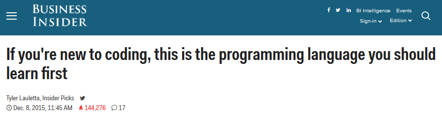
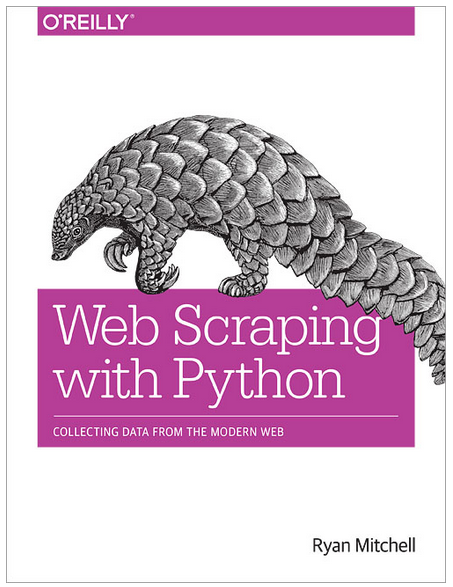

<!-- MarkdownTOC -->

- [Python](#python)
	- [Python Blogs and Forums](#python-blogs-and-forums)
	- [Python docs](#python-docs)
	- [Python Django](#python-django)
	- [Python Flask](#python-flask)
	- [Python pip and pip's wheel](#python-pip-and-pips-wheel)
	- [Python Feature Flags](#python-feature-flags)
	- [Python testing](#python-testing)
	- [Data Science. Python Pandas and pivot tables](#data-science-python-pandas-and-pivot-tables)
		- [PandasDatabase](#pandasdatabase)
	- [Python standard library Modules and Code](#python-standard-library-modules-and-code)
	- [Python and AWS](#python-and-aws)
	- [Python Tools](#python-tools)
		- [Web Scraping with Python](#web-scraping-with-python)
	- [Jython](#jython)
	- [Eclipse IDE](#eclipse-ide)

<!-- /MarkdownTOC -->

# Python
## Python Blogs and Forums
- [Learn Python 'subreddit'](https://www.reddit.com/r/learnpython)
	- [reddit: python cheat sheet](https://www.reddit.com/r/learnpython/comments/3r2hsq/python_cheat_sheet/)
- [Full Stack Python is an open book that explains each Python web application stack layer and provides the best web resources for those topics](http://www.fullstackpython.com/)
	- [Full Stack Python: Best Python Resources](http://www.fullstackpython.com/best-python-resources.html)
- [realpython.com](http://realpython.com)
- [LearnPython.org interactive Python tutorial](http://www.learnpython.org)
- [Dough Hellmann - Python, OpenStack and Open Source](https://doughellmann.com)
- [The docker-py repository: an API client for docker written in Python](http://docker-py.readthedocs.org)
- [Awesome Python. A curated list of awesome Python frameworks, libraries and software](https://github.com/vinta/awesome-python/)
- [Awesome Django. A curated list of awesome Django apps, projects and resources](https://gitlab.com/rosarior/awesome-django)
- [pyvideo.org](http://pyvideo.org)
- [Talk Python To Me Podcast](http://talkpython.fm)
	- [Transcript for Episode #39: Getting your first dev job as a Python developer (part 1)](http://talkpython.fm/episodes/transcript/39/getting-your-first-dev-job-as-a-python-developer-part-1)
- [Microsoft: Python Engineering](https://blogs.msdn.microsoft.com/pythonengineering/)

<blockquote class="twitter-tweet tw-align-center" data-lang="es">
<a href="https://twitter.com/hashtag/Microsoft?src=hash">#Microsoft</a> Quietly Starts A <a href="https://twitter.com/hashtag/Python?src=hash">#Python</a> Engineering Blog — Here’s Why You Need To Follow It <a href="https://t.co/8jLIjIsBnl">https://t.co/8jLIjIsBnl</a> <a href="https://t.co/hxKOPJtroj">pic.twitter.com/hxKOPJtroj</a>
&mdash; Kisha (@GetKisha) <a href="https://twitter.com/GetKisha/status/708986328793407489">13 de marzo de 2016</a></blockquote>

## Python docs
- [Python progression path - From apprentice to guru](https://stackoverflow.com/questions/2573135/python-progression-path-from-apprentice-to-guru)
- [reddit: Why Python](https://www.reddit.com/r/Python/comments/3ylxmk/why_python/)
- [Python Anti-Patterns. The Little Book of Python Anti-Patterns and Worst Practice](http://docs.quantifiedcode.com/python-code-patterns/)
- [Setting up Python on OSX: UPDATED](http://staticnat.com/setting-up-python-on-osx/)
- [Python 3.4 Programming Tutorials - YouTube](https://www.youtube.com/playlist?list=PL6gx4Cwl9DGAcbMi1sH6oAMk4JHw91mC_)
	- [Python mini-course](http://ai.berkeley.edu/tutorial.html#PythonBasics)
	- [Web Development using Python & Django](https://www.mysliderule.com/learning-paths/web-development-python-django/)
	- [A beginner's guide to web development with Python 2.7 / Django 1.7](http://www.tangowithdjango.com/)
	- [I wish I knew these things when I learned Python](http://bugra.github.io/work/notes/2015-01-03/i-wish-i-knew-these-things-when-i-first-learned-python/)
	- [The Bottom-Line Single Main Difference Between Python 2 and 3](http://migrateup.com/main-difference-python-3/)
- [15 Essential Python Interview Questions](https://www.codementor.io/python/tutorial/essential-python-interview-questions)
	- [Python mini-quiz](http://www.mypythonquiz.com/)
- [How do you handle the ORM problem? When do you say YES or NO to using ORM?](http://www.vertabelo.com/blog/technical-articles/orms-under-the-hood)
- [Don't Make Us Say We Told You So: virtualenv for New Pythonistas](http://pyvideo.org/video/3460/dont-make-us-say-we-told-you-so-virtualenv-for)
- [Java Vs. Python - Which Programming Language is More Productive? - Infographic](http://blogs.perceptionsystem.com/infographic/java-vs-python-programming-language-productive)
- [Talk Python To Me Podcast. Episode #36: Python IDEs with the PyCharm team](http://talkpython.fm/episodes/show/36/python-ides-with-the-pycharm-team)
- [My top 5 ‘new’ Python modules of 2015](http://blog.rtwilson.com/my-top-5-new-python-modules-of-2015/)
- [reddit.com: Modules every python developer should know](https://www.reddit.com/r/Python/comments/3yg2u4/modules_every_python_developer_should_know/)
- [reddit.com: My thoughts about moving from Python 2.7 to Python 3.x](https://www.reddit.com/r/Python/comments/3yjlim/my_thoughts_about_moving_from_python_27_to_python/)
- [Why Python 3 exists](http://www.snarky.ca/why-python-3-exists)
- [stackoverflow: Create dictionary from splitted strings from list of strings](http://stackoverflow.com/questions/34319156/create-dictionary-from-splitted-strings-from-list-of-strings)
- [Yagmail: Python e-mail library](https://github.com/kootenpv/yagmail)
- [How To Deadlock Your Python With getaddrinfo()](https://emptysqua.re/blog/getaddrinfo-deadlock/)
- [New String Formatting in Python 3.6](https://zerokspot.com/weblog/2015/12/31/new-string-formatting-in-python/)
- [en.wikibooks.org: Python Programming](https://upload.wikimedia.org/wikipedia/commons/9/91/Python_Programming.pdf)
- [tqdm: Instantly make your python loops show a progress meter - just wrap any iterator with "tqdm(iterator)", and you're done!](https://github.com/noamraph/tqdm)
- [If you don't like exceptions, you don't like Python](http://stupidpythonideas.blogspot.com.es/2015/05/if-you-dont-like-exceptions-you-dont.html)
- [Stop writing code that will break on Python 4!](http://astrofrog.github.io/blog/2016/01/12/stop-writing-python-4-incompatible-code/) With the end of support for Python 2 on the horizon (in 2020), many package developers have made their packages compatible with both Python 2 and Python 3. 
- [github: Python3 in one pic](https://github.com/coodict/python3-in-one-pic)
- [reddit.com: Functions vs. Classes](https://www.reddit.com/r/learnpython/comments/40rieo/functions_vs_classes/)
- [Complexity of Python Operations](https://www.ics.uci.edu/~pattis/ICS-33/lectures/complexitypython.txt)
- [reddit.com: Multiprocessing vs Threading?](https://www.reddit.com/r/learnpython/comments/418z8b/multiprocessing_vs_threading/)
	- [Python Threads and the Global Interpreter Lock](http://jessenoller.com/blog/2009/02/01/python-threads-and-the-global-interpreter-lock)
- [devbattles.com: Python list. Functions and Methods lists](http://www.devbattles.com/en/sand/post-1754-Python_list_Functions_and_Methods_lists)
- [devbattles.com: Python: sorting lists by .sort () with - in simple words](http://www.devbattles.com/en/sand/post-1752-Python_sorting_lists_by_sort__with__in_simple_words)
- [Create a GUI Application Using Qt and Python in Minutes: Example Web Browser](http://www.digitalpeer.com/blog/create-a-gui-application-using-qt-and-python-in-minutes-example-web-browser)
- [Python command line oneliners](http://www.vurt.ru/2013/02/python-command-line-oneliners)
- ["Learn Python" Overtakes "Learn Java" on Google Trends 🌟🌟🌟](https://dzone.com/articles/learn-python-overtakes-learn-java)
- [Python gains the upper hand against Perl, PHP, and Ruby](http://www.infoworld.com/article/3029681/java/python-gains-the-upper-hand-against-perl-php-and-ruby.html)

<blockquote class="twitter-tweet tw-align-center" data-lang="es">
29 common beginner Python errors on one page via <a href="https://t.co/Ctvy84KXKx">https://t.co/Ctvy84KXKx</a> <a href="https://twitter.com/hashtag/Python?src=hash">#Python</a> <a href="https://twitter.com/hashtag/Sysadmin?src=hash">#Sysadmin</a> <a href="https://twitter.com/hashtag/Programming?src=hash">#Programming</a> <a href="https://twitter.com/hashtag/Unix?src=hash">#Unix</a> <a href="https://twitter.com/hashtag/Linux?src=hash">#Linux</a> <a href="https://t.co/vaZaJETNPU">pic.twitter.com/vaZaJETNPU</a>
&mdash; nixCraft (@nixcraft) <a href="https://twitter.com/nixcraft/status/706530828092731393">6 de marzo de 2016</a></blockquote>

<iframe src="//www.slideshare.net/slideshow/embed_code/key/8cvSLR0lWRnZyS" width="595" height="485" frameborder="0" marginwidth="0" marginheight="0" scrolling="no" style="border:1px solid #CCC; border-width:1px; margin-bottom:5px; max-width: 100%;" allowfullscreen class="video"> </iframe> 
 <strong> <a href="//www.slideshare.net/Moment_of_Revelation/pep-8-cheatsheet-2009-32888711" title="Pep 8 cheatsheet (2009)" target="_blank">Pep 8 cheatsheet (2009)</a> </strong> from <strong><a href="//www.slideshare.net/Moment_of_Revelation" target="_blank">Moment_of_Revelation</a></strong> 

 

<blockquote class="twitter-tweet tw-align-center" data-lang="es">
When I see my Perl script after a long time. <a href="https://twitter.com/hashtag/sysadmin?src=hash">#sysadmin</a> <a href="https://twitter.com/hashtag/unix?src=hash">#unix</a> <a href="https://twitter.com/hashtag/linux?src=hash">#linux</a> <a href="https://twitter.com/hashtag/problems?src=hash">#problems</a> <a href="https://twitter.com/hashtag/life?src=hash">#life</a> <a href="https://twitter.com/hashtag/truth?src=hash">#truth</a> <a href="https://t.co/bFcsLofAUj">pic.twitter.com/bFcsLofAUj</a>
&mdash; nixCraft (@nixcraft) <a href="https://twitter.com/nixcraft/status/710023176336453632">16 de marzo de 2016</a></blockquote>

## Python Django
- [gettopical.com: Get Django Latest News](http://gettopical.com/djangoframework)
- [Learn Python Django in 4 Hours](https://dzone.com/articles/learn-python-django-in-4-hours)
- [realpython.com: Django Development With Docker Compose and Machine](https://realpython.com/blog/python/django-development-with-docker-compose-and-machine/)
- [realpython.com: Fun With Django's New Postgres Features](https://realpython.com/blog/python/fun-with-djangos-new-postgres-features/)
- [realpython.com: Deploying a Django App to AWS Elastic Beanstalk](https://realpython.com/blog/python/deploying-a-django-app-to-aws-elastic-beanstalk/)
- [TaskBuster Django Tutorial, made with Django 1.8 and Python 3](http://www.marinamele.com/taskbuster-django-tutorial)
- [TDD with Django, from scratch: a beginner's intro to testing and web development](http://www.pyvideo.org/video/3509/tdd-with-django-from-scratch-a-beginners-intro)
- [Cómo crear un servicio REST en 30 líneas de código de Django y Python](http://www.genbetadev.com/desarrolloparastartups/como-crear-un-servicio-rest-en-30-lineas-de-codigo-de-django-y-python)
- [Django Development With Docker Compose and Machine](https://realpython.com/blog/python/django-development-with-docker-compose-and-machine/)
- [Installing and Configuring Django Web Framework with Virtual Environments in CentOS/Debian](http://www.tecmint.com/install-and-configure-django-web-framework-in-centos-debian-ubuntu/)
- [realpython.com: Development and Deployment of Cookiecutter-Django via Docker](https://realpython.com/blog/python/development-and-deployment-of-cookiecutter-django-via-docker/) A Cookiecutter template for creating production-ready Django projects quickly.
- [github.com: Django app + RESTful API for automatic billing](https://github.com/presslabs/silver/)
- [CodingEntrepreneurs youtube channel](https://www.youtube.com/user/CodingEntrepreneurs)
	- [Interested in Learn Django 1.9? Check out my free series on YouTube](https://www.youtube.com/playlist?list=PLEsfXFp6DpzQFqfCur9CJ4QnKQTVXUsRy)
- [Getting Started with Django REST Framework (DRF) and AngularJS (Part 1)](http://engineroom.trackmaven.com/blog/getting-started-drf-angularjs-part-1/)
	- [Getting Started with Django REST Framework (DRF) and AngularJS (Part 2)](http://engineroom.trackmaven.com/blog/getting-started-drf-angularjs-part-2/)
	- [Part 2 Supplementary Code](https://github.com/TrackMaven/getting-started-with-drf-angular/tree/part-2)
- [webcodegeeks.com: Python Django Tutorial](http://www.webcodegeeks.com/python/python-django-tutorial/)

<iframe src="//www.slideshare.net/slideshow/embed_code/key/KPwgA2IwOKggJA" width="595" height="485" frameborder="0" marginwidth="0" marginheight="0" scrolling="no" style="border:1px solid #CCC; border-width:1px; margin-bottom:5px; max-width: 100%;" allowfullscreen class="video"> </iframe> 
 <strong> <a href="//www.slideshare.net/basimaly1/building-python-development-station" title="Building Python Development Station" target="_blank">Building Python Development Station</a> </strong> from <strong><a href="//www.slideshare.net/basimaly1" target="_blank">Basim Aly (JNCIP-SP, JNCIP-ENT)</a></strong> 

 

<iframe src="//www.slideshare.net/slideshow/embed_code/key/1ZXHdwqOr9pGcp" width="595" height="485" frameborder="0" marginwidth="0" marginheight="0" scrolling="no" style="border:1px solid #CCC; border-width:1px; margin-bottom:5px; max-width: 100%;" allowfullscreen class="video"> </iframe> 
 <strong> <a href="//www.slideshare.net/basimaly1/vandyke-securecrt-tips-and-tricks" title="Vandyke SecureCRT tips and tricks" target="_blank">Vandyke SecureCRT tips and tricks</a> </strong> from <strong><a href="//www.slideshare.net/basimaly1" target="_blank">Basim Aly (JNCIP-SP, JNCIP-ENT)</a></strong> 

 

## Python Flask 
- [The Flask Mega-Tutorial: Now with Python 3 Support](http://blog.miguelgrinberg.com/post/the-flask-mega-tutorial-now-with-python-3-support)
- [realpython.com: Discover Flask, Part 1 - Setting Up a Static Site ](https://realpython.com/blog/python/introduction-to-flask-part-1-setting-up-a-static-site/)
- [Two-Factor Authentication with Authy](https://www.twilio.com/docs/tutorials/walkthrough/two-factor-authentication/python/flask)
- [devbattles.com: Python Flask, Part 1: Hello World!](http://www.devbattles.com/en/sand/post-1757-Python_Flask_Part_1_Hello_World)

## Python pip and pip's wheel
- [wheel replaces Python's eggs](https://wheel.readthedocs.org)
- [Speed up pip install](http://blog.ionelmc.ro/2015/01/02/speedup-pip-install/)

## Python Feature Flags
- [Python Feature Flag Resources/Solutions](http://featureflags.io/python-feature-flags/)
- [reddit: Ship Better Python Using Feature Flags](https://www.reddit.com/r/Python/comments/3zl3g4/ship_better_python_using_feature_flags/)

## Python testing
- [reddit: Real examples of unit testing](https://www.reddit.com/r/learnpython/comments/3zl0p6/real_examples_of_unit_testing/)
- [Testing Python](http://it-ebooks.info/book/3778/)
- [Profiling Python using cProfile: a concrete case](https://julien.danjou.info/blog/2015/guide-to-python-profiling-cprofile-concrete-case-carbonara)
- [nylas.com: Profiling Python in Production](https://nylas.com/blog/performance) How We Reduced CPU Usage by 80% through Python Profiling 
- [gabbi - Declarative HTTP testing library pypi](http://pypi.python.org/pypi/gabbi/)
- [tracker: A time machine for debugging pesky stateful errors](https://github.com/madisonmay/tracker)

## Data Science. Python Pandas and pivot tables
- [oreilly.com: how to use pivot tables in Pandas step-by-step](https://www.oreilly.com/learning/pivot-tables)
- [pbpython.com: Practical Business Python](http://pbpython.com/)
	- [pbpython.com: Pandas Pivot Table Explained](http://pbpython.com/pandas-pivot-table-explained.html)
	- [pbpython.com: Collecting Data with Google Forms and Pandas](http://pbpython.com/pandas-google-forms-part1.html)
- [Reshaping in Pandas – Pivot, Pivot-Table, Stack and Unstack explained with Pictures](https://nikolaygrozev.wordpress.com/2015/07/01/reshaping-in-pandas-pivot-pivot-table-stack-and-unstack-explained-with-pictures/)
- [pandas.pydata.org: Reshaping by pivoting DataFrame objects](http://pandas.pydata.org/pandas-docs/stable/reshaping.html)
- [analyticsvidhya.com: A Complete Tutorial to Learn Data Science with Python from Scratch](http://www.analyticsvidhya.com/blog/2016/01/complete-tutorial-learn-data-science-python-scratch-2/)
- [analyticsvidhya.com: Tutorial – Python List Comprehension With Examples](http://www.analyticsvidhya.com/blog/2016/01/python-tutorial-list-comprehension-examples/)

### PandasDatabase
- [PandasDatabase is a RESTful database engine application built on top of Pandas](https://pypi.python.org/pypi/pddb/)

## Python standard library Modules and Code
- [Python 3 standard library Module of the Week, Doug Hellmann](https://pymotw.com)
- [Python 2 standard library Module of the Week, Doug Hellmann](https://pymotw.com/2)
- [Dead simple {for devs} python crawler (script) for extracting structured data from any website into CSV](http://blog.webhose.io/2015/08/16/dead-simple-for-devs-python-crawler-script-for-extracting-structured-data-from-any-almost-website-into-csv/)
- [Python Multi-Process Execution Pool](https://github.com/XI-lab/PyExPool)

## Python and AWS
- [Ansible and AWS: cloud IT automation management](http://cloudacademy.com/blog/ansible-aws/)
- [Python and AWS Cookbook. Boto library](http://it-ebooks.info/book/542/)
- [Boto](https://github.com/boto/boto)
- [Migrating to Boto3](https://aws.amazon.com/es/blogs/developer/migrating-to-boto3/)
- [Managing the Cloud with a Few Lines of Python (EuroPython 2014)](http://pyvideo.org/video/2987/managing-the-cloud-with-a-few-lines-of-python)
- [ec2-ssh-yplan: A pair of command line utilities for finding and SSH-ing into your Amazon EC2 instances by tag (such as ‘Name’)](https://pypi.python.org/pypi/ec2-ssh-yplan/)

## Python Tools
- [PyInstaller is a program that freezes (packages) Python programs into stand-alone executables, under Windows, Linux, Mac OS X, FreeBSD, Solaris and AIX](http://www.pyinstaller.org/)
	- [PyInstaller official GIT repository](https://github.com/pyinstaller/pyinstaller/)
- [ZipPy: Python3 on top of the JVM (faster than PyPy!)](https://bitbucket.org/ssllab/zippy)
- [DictMySQL: A MySQL class for more convenient database manipulation with Python dictionary](https://github.com/ligyxy/DictMySQL)
- [WinPython: Portable Scientific Python 2/3 32/64bit Distribution for Windows](http://sourceforge.net/projects/winpython/)

### Web Scraping with Python
- [Scrapy](http://scrapy.org/) An open source and collaborative framework for extracting the data you need from websites. In a fast, simple, yet extensible way.
- [First web scraper](https://first-web-scraper.readthedocs.org) A step-by-step guide to writing a web scraper with Python.

## Jython 
- [Jython is a language that makes it easy to create projects with libraries from Python and Java.](http://www.oraclejavamagazine-digital.com/javamagazine_twitter/20151112?pg=43#pg43)

## Eclipse IDE
- [opensource.com: How to use Python to hack your Eclipse IDE](https://opensource.com/life/16/2/how-use-python-hack-your-ide)
