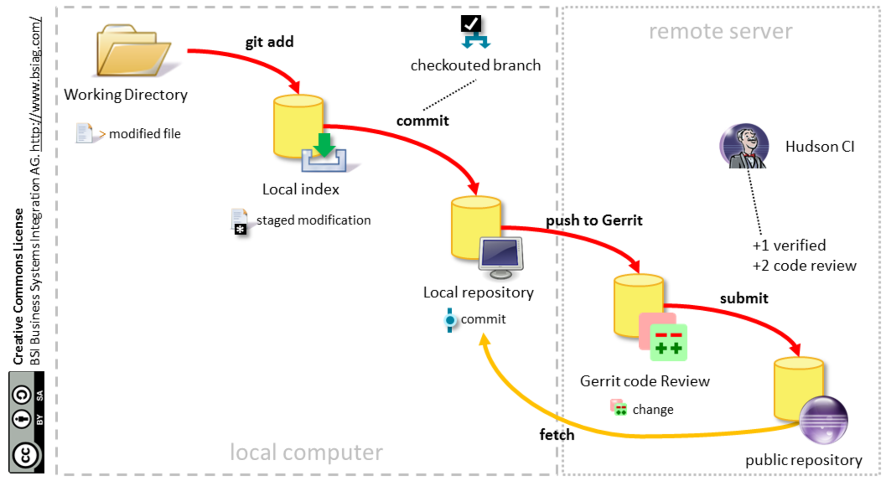
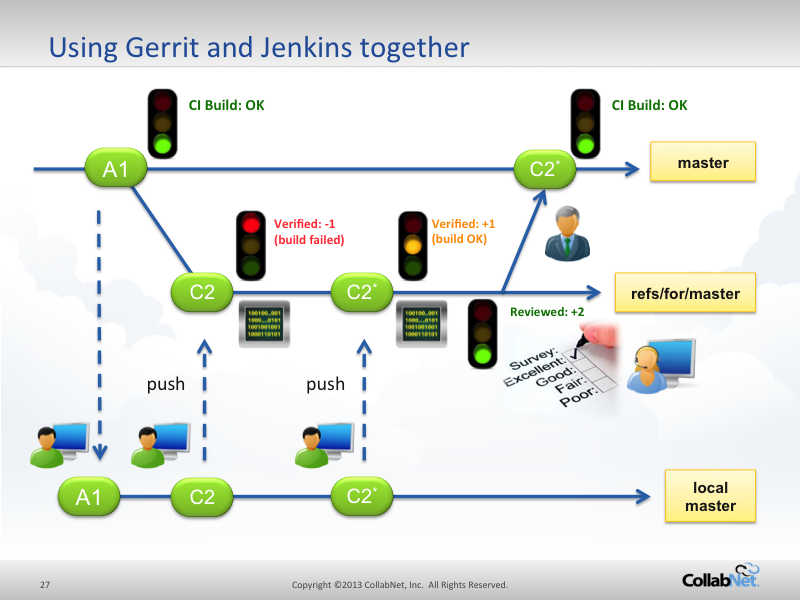
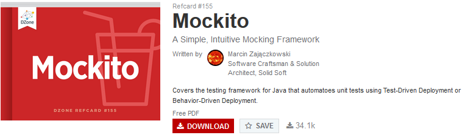
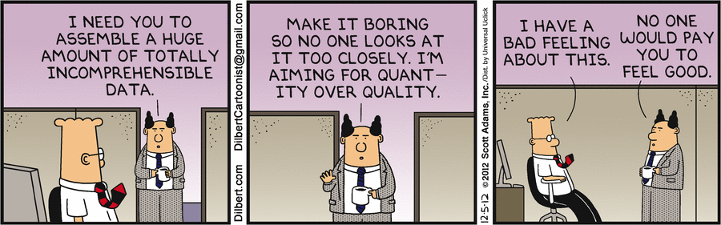

<!-- MarkdownTOC -->

- [QA and Testing](#qa-and-testing)
    - [Blogs](#blogs)
    - [Mapas Mentales para Software Testing](#mapas-mentales-para-software-testing)
    - [ISTQB](#istqb)
    - [TMAP](#tmap)
    - [OWASP Open Web Application Security Project](#owasp-open-web-application-security-project)
    - [DevOps Quality Blueprint](#devops-quality-blueprint)
    - [Google New website Testing tool for Small Businesses](#google-new-website-testing-tool-for-small-businesses)
    - [Gerrit Code Review](#gerrit-code-review)
    - [JUnit](#junit)
    - [SonarQube previusly known as Sonar](#sonarqube-previusly-known-as-sonar)
    - [Mockito Mocking framework](#mockito-mocking-framework)
    - [Selenium](#selenium)
        - [Selenium training](#selenium-training)
            - [Selenium training via Udemy](#selenium-training-via-udemy)
        - [Selenium on Twitter](#selenium-on-twitter)
    - [SoapUI](#soapui)
    - [Cucumber](#cucumber)
    - [Jasmine Behavior Driven JavaScript](#jasmine-behavior-driven-javascript)
    - [Concordion](#concordion)
    - [Appium Mobile App Automation](#appium-mobile-app-automation)
    - [Calabash automated acceptance testing for mobile apps](#calabash-automated-acceptance-testing-for-mobile-apps)
    - [Capybara acceptance test framework for web applications](#capybara-acceptance-test-framework-for-web-applications)
    - [Arquillian Testing Platform and Citrus Integration Testing](#arquillian-testing-platform-and-citrus-integration-testing)
    - [Issue tracking tools](#issue-tracking-tools)
        - [TestLink Open Source Test Management](#testlink-open-source-test-management)
        - [Atlassian Jira](#atlassian-jira)
    - [Atlassian Confluence collaboration software](#atlassian-confluence-collaboration-software)
    - [Pruebas Funcionales de Software](#pruebas-funcionales-de-software)
    - [Automated Acceptance Testing](#automated-acceptance-testing)
    - [Behavior Driven Development](#behavior-driven-development)
    - [Calidad de Software](#calidad-de-software)

<!-- /MarkdownTOC -->

<iframe width="560" height="315" src="https://www.youtube.com/embed/U5o_KMFrFpc?rel=0" frameborder="0" allowfullscreen class="video"></iframe>

 

<blockquote class="twitter-tweet tw-align-center" data-lang="es">
6 challenges in finding the right test automation tool for your team <a href="https://t.co/vrNqjN0SIb">https://t.co/vrNqjN0SIb</a> <a href="https://twitter.com/hashtag/SoftwareTestingNews?src=hash">#SoftwareTestingNews</a>
&mdash; TEST Magazine (@testmagazine) <a href="https://twitter.com/testmagazine/status/740496694740127744">8 de junio de 2016</a></blockquote>

<blockquote class="twitter-tweet tw-align-center" data-lang="es">
Why 100% of dev-test will be done using <a href="https://twitter.com/hashtag/cloud?src=hash">#cloud</a>-based platforms, infrastructure &amp; software within 10 years: <a href="https://t.co/G6WSCpt2VA">https://t.co/G6WSCpt2VA</a> <a href="https://twitter.com/forbesbv">@forbesbv</a>
&mdash; Oracle (@Oracle) <a href="https://twitter.com/Oracle/status/699383199261036545">febrero 16, 2016</a></blockquote>

<blockquote class="twitter-tweet tw-align-center" data-lang="es">
When debugging Perl/Python code or networking issue <a href="https://twitter.com/hashtag/sysadmin?src=hash">#sysadmin</a> <a href="https://twitter.com/hashtag/unix?src=hash">#unix</a> <a href="https://twitter.com/hashtag/linux?src=hash">#linux</a>  via <a href="https://t.co/34KKaad00d">https://t.co/34KKaad00d</a> <a href="https://t.co/kqA7mR3AKy">pic.twitter.com/kqA7mR3AKy</a>
&mdash; nixCraft (@nixcraft) <a href="https://twitter.com/nixcraft/status/706194879915757568">5 de marzo de 2016</a></blockquote>

<blockquote class="twitter-tweet tw-align-center" data-lang="es">
Show this to anyone who argues about whether that refactoring effort is worth the investment. <a href="https://t.co/vxw5PvDXq0">pic.twitter.com/vxw5PvDXq0</a>
&mdash; David Whittaker (@rundavidrun) <a href="https://twitter.com/rundavidrun/status/690651629494775808">22 de enero de 2016</a></blockquote>

<blockquote class="twitter-tweet tw-align-center" data-lang="es">
Sobre las vacunas, dos seres de ficción: La monja Forcades  (FAV) <a href="https://t.co/hBM8SMCcZK">https://t.co/hBM8SMCcZK</a> vs. el doctor House <a href="https://t.co/xjIyh0D9ZQ">https://t.co/xjIyh0D9ZQ</a> (RT)
&mdash; Santiago Navajas (@santiagonavajas) <a href="https://twitter.com/santiagonavajas/status/608706540829294592">10 de junio de 2015</a></blockquote>

<blockquote class="twitter-tweet tw-align-center" data-lang="es">
5 open source alternatives to Trello <a href="https://t.co/hRxWcRLuSM">https://t.co/hRxWcRLuSM</a> via <a href="https://twitter.com/opensourceway">@opensourceway</a> <a href="https://t.co/IWXy4FVasv">pic.twitter.com/IWXy4FVasv</a>
&mdash; Red Hat Partners (@RedHatPartners) <a href="https://twitter.com/RedHatPartners/status/734912845557665792">24 de mayo de 2016</a></blockquote>

<blockquote class="twitter-tweet tw-align-center" data-lang="es">
The Hitchhiker&#39;s Guide to Testing Infrastructure as Code<a href="https://t.co/7m6nbyNgTH">https://t.co/7m6nbyNgTH</a> <a href="https://twitter.com/hashtag/MVBs?src=hash">#MVBs</a> Igor Galić &amp; David Schmitt <a href="https://t.co/NCD52l9yEX">pic.twitter.com/NCD52l9yEX</a>
&mdash; DZone (@DZone) <a href="https://twitter.com/DZone/status/741449951134253056">11 de junio de 2016</a></blockquote>

<blockquote class="twitter-tweet tw-align-center" data-lang="es">
The role of QA in a DevOps world <a href="https://t.co/tO1L7TBkOW">https://t.co/tO1L7TBkOW</a>  <a href="https://twitter.com/hashtag/devops?src=hash">#devops</a> <a href="https://t.co/O2AJH6tvpl">pic.twitter.com/O2AJH6tvpl</a>
&mdash; DevOps Guy (@DevopsG) <a href="https://twitter.com/DevopsG/status/742094300863811584">12 de junio de 2016</a></blockquote>

<iframe src="//www.slideshare.net/slideshow/embed_code/key/9rLrHAs1OMNd0L" width="595" height="485" frameborder="0" marginwidth="0" marginheight="0" scrolling="no" style="border:1px solid #CCC; border-width:1px; margin-bottom:5px; max-width: 100%;" allowfullscreen class="video"> </iframe> 
 <strong> <a href="//www.slideshare.net/sourcesense/atlassian-roadshow-2016-devops-session" title="Atlassian Roadshow 2016 - DevOps Session" target="_blank">Atlassian Roadshow 2016 - DevOps Session</a> </strong> from <strong><a href="//www.slideshare.net/sourcesense" target="_blank">Sourcesense</a></strong> 

 

<iframe src="//www.slideshare.net/slideshow/embed_code/key/vv0CP6Bc6rH8zv" width="595" height="485" frameborder="0" marginwidth="0" marginheight="0" scrolling="no" style="border:1px solid #CCC; border-width:1px; margin-bottom:5px; max-width: 100%;" allowfullscreen class="video"> </iframe> 
 <strong> <a href="//www.slideshare.net/PeterLeschev/how-atlassians-build-engineering-team-has-scaled-to-150k-builds-per-month-and-beyond-puppetconf-2015" title="How Atlassian&#x27;s Build Engineering Team Has Scaled to 150k Builds Per Month and Beyond – PuppetConf 2015" target="_blank">How Atlassian&#x27;s Build Engineering Team Has Scaled to 150k Builds Per Month and Beyond – PuppetConf 2015</a> </strong> from <strong><a href="//www.slideshare.net/PeterLeschev" target="_blank">Peter Leschev</a></strong> 

 

# QA and Testing
- [dzone.com: The QA Checklist Framework. 13 considerations for building your own QA checklist](https://dzone.com/articles/the-qa-checklist-avoid-costly-oversights-by-implem)
- [blog.testproject.io - World’s most desirable test automation skills!](http://blog.testproject.io/2015/12/03/worlds-most-desirable-automation-skills/)
- [TestNG: Run tests sequentially with @DataProvider inside one test class](http://www.javacodegeeks.com/2014/01/testng-run-tests-sequentially-with-dataprovider-inside-one-test-class.html)
- [thenewstack.io: How Vagrant Eases Software Research and Testing](http://thenewstack.io/vagrant-developers-researchers/)
- [Free online Book: O'Reilly® Test-Driven Development with Python](http://freecomputerbooks.com/Test-Driven-Development-with-Python.html)
- [eBook: Testing Python. Applying Unit Testing, TDD, BDD and Acceptance Testing](http://it-ebooks.info/book/3778/)
- [pyvideo.org: TDD with Django, from scratch: a beginner's intro to testing and web development](http://www.pyvideo.org/video/3509/tdd-with-django-from-scratch-a-beginners-intro)
- [Declarative HTTP Testing. Gabbi is a tool for running HTTP tests where requests and responses are represented in a declarative YAML-based form](http://gabbi.readthedocs.org/)
- [The first tool that automatically refactors your Python code](https://www.quantifiedcode.com/how-it-works)
- [obeythetestinggoat.com: TDD for the Web, with Python, Selenium, Django, JavaScript and pals](http://www.obeythetestinggoat.com/)
	- [Testing, async, asyncio, and performance](http://www.obeythetestinggoat.com/testing-async-asyncio-and-performance.html)
- [javacodegeeks.com: 10 Reasons why you should NOT write unit test cases!](http://www.javacodegeeks.com/2013/10/10-reasons-why-you-should-not-write-unit-test-cases.html)
- [DZone: Graybox Testing — Control Your Dependencies](https://dzone.com/articles/graybox-testing-control-your-dependencies) This post continues the story about functional testing which I referred to in Blackbox Testing Microservices. 
- [Testing: Appetite Comes With Eating](http://www.javacodegeeks.com/2016/01/testing-appetite-comes-eating.html) Why are tests needed should be obvious by now. It’s not all about finding bugs (because then you can use an excuse like “QAs will find them anyway”), it’s about having a codebase that can remain stable with changes. And it’s about writing better code, because testable code is cleaner.
- [Test Anything Protocol (TAP)](https://testanything.org/)
- [Dzone/DevOps Zone: Four Ways Testers Can Eliminate Risks in Test Automation](https://dzone.com/articles/4-ways-testers-can-eliminate-risks-in-test-automat)
- [adictosaltrabajo.com: Tutorial ‘Docker Integration Test’](http://www.adictosaltrabajo.com/tutoriales/tutorial-docker-integration-test/)
- [DZone/Integration Zone: API Testing With Runscope](https://dzone.com/articles/api-testing-with-runscope) If you're using APIs, you need to test well. Here's a guide to testing APIs with Runscope, with a breakdown of creating a bucket and making a test.
	- [runscope.com](https://www.runscope.com/)
- [Why Automated Testing is the key to rapid product development](https://nothingventured.rocks/why-automated-testing-is-the-key-to-rapid-product-development-e8b0a3d3040)
- [certifications.bcs.org: ISTQB Certified Tester](http://certifications.bcs.org/category/15574)
- [JavaScript Unit Test Code Coverage Using NodeJS](https://dzone.com/articles/javascript-unit-test-code-coverage-using-nodejs-1) Allow me to show you how to use Node.js to provide JavaScript unit test code coverage. The main tools we will be using to pull this off are Karma and Istanbul. The test we write will be using Jasmine.
- [developers.redhat.com: Test-Driven-Development for building APIs in Node.js and Express 🌟](http://developers.redhat.com/blog/2016/03/15/test-driven-development-for-building-apis-in-node-js-and-express)
- [nubelo.com: Los Analistas QA están cansados de que los confundan con testers](http://www.nubelo.com/blog/los-analistas-estan-cansados-que-los-confundan-con-testers)
- [capgemini.com: DevOps with Quality - 7 principles, integrated approach to DevOps Quality 🌟🌟🌟](https://www.capgemini.com/resources/devops-with-quality-7-principles-integrated-approach-to-devops-quality)
- [Jumpstarting DevOps with continuous testing](http://www.devopsonline.co.uk/jumpstarting-devops-with-continuous-testing/)
- [DZone: Open-Source Test Automation Tools and You 🌟🌟🌟](https://dzone.com/articles/selecting-the-best-open-source-test-automation-too) 

<blockquote class="twitter-tweet tw-align-center" data-lang="es">
Can We Neglect Manual Testing for Automation Testing? <a href="https://twitter.com/hashtag/DevOps?src=hash">#DevOps</a><a href="https://t.co/mrztTSgcrt">https://t.co/mrztTSgcrt</a>   via Pavan Kumar <a href="https://t.co/qgnKWG3vlb">pic.twitter.com/qgnKWG3vlb</a>
&mdash; DZone (@DZone) <a href="https://twitter.com/DZone/status/743171375754514432">15 de junio de 2016</a></blockquote>

<blockquote class="twitter-tweet tw-align-center" data-lang="es">
Open-Source Test Automation Tools and You<a href="https://twitter.com/hashtag/DevOps?src=hash">#DevOps</a><a href="https://t.co/qS8iUKZ6EF">https://t.co/qS8iUKZ6EF</a>  via <a href="https://twitter.com/ek121268">@ek121268</a> <a href="https://t.co/xeeTMMF4xr">pic.twitter.com/xeeTMMF4xr</a>
&mdash; DZone (@DZone) <a href="https://twitter.com/DZone/status/744651123596857344">19 de junio de 2016</a></blockquote>

## Blogs
- [Testing & QA Management blog by PractiTest](http://qablog.practitest.com/)
    - [International 2016 State of Testing. What it means to be a tester worldwide 🌟🌟](http://qablog.practitest.com/state-of-testing/)

## Mapas Mentales para Software Testing
- [TestingBaires Mapas Mentales para Software Testing](http://testingbaires.com/mapas-mentales/)

## ISTQB
- [International Software Testing Qualifications Board](https://en.wikipedia.org/wiki/International_Software_Testing_Qualifications_Board)
- [istqb.org](http://www.istqb.org/) 
- [sstqb.es](http://www.sstqb.es/)
- [Software QA - Software testing levels onion model](http://blog.panel.es/index.php/software-qa-software-testing-levels-onion-model/)

)

## TMAP
- [Test Management Approach](https://en.wikipedia.org/wiki/Test_Management_Approach)
- [tmap.net](http://www.tmap.net/)
- [TMap NEXT structured testing](http://www.tmap.net/tmap-next)
- [What is TMap NEXT? A quick overview](https://www.linkedin.com/pulse/what-tmap-quick-overview-humayun-shaukat)
- [Los 4 fundamentos de TMap – Sogeti](http://testingbaires.com/los-4-fundamentos-de-tmap-sogeti/)

<iframe src="//www.slideshare.net/slideshow/embed_code/key/2nWJ3Ngr7pWeZb" width="595" height="485" frameborder="0" marginwidth="0" marginheight="0" scrolling="no" style="border:1px solid #CCC; border-width:1px; margin-bottom:5px; max-width: 100%;" allowfullscreen class="video"> </iframe> 
 <strong> <a href="//www.slideshare.net/VLDCORP/test-process-improvement-with-tpi-next-what-the-model-does-not-tell-you-but-you-should-know" title="Test Process Improvement with TPI NEXT - what the model does not tell you but you should know " target="_blank">Test Process Improvement with TPI NEXT - what the model does not tell you but you should know </a> </strong> from <strong><a href="//www.slideshare.net/VLDCORP" target="_blank">SQALab</a></strong> 

 

<blockquote class="twitter-tweet tw-align-center" data-lang="es">
From our sister site <a href="https://twitter.com/testmagazine">@testmagazine</a>: Continuous performance testing in an agile environment. <a href="https://t.co/hkjnKR5wXJ">https://t.co/hkjnKR5wXJ</a> <a href="https://t.co/GUTvtD4Wot">pic.twitter.com/GUTvtD4Wot</a>
&mdash; DevOps Online News (@DevOpsOnline) <a href="https://twitter.com/DevOpsOnline/status/735470641332158464">25 de mayo de 2016</a></blockquote>

<blockquote class="twitter-tweet tw-align-center" data-lang="es">
Fitting the pieces together with <a href="https://twitter.com/hashtag/ContinuousTesting?src=hash">#ContinuousTesting</a> <a href="https://t.co/6TqcyonqJ1">https://t.co/6TqcyonqJ1</a> <a href="https://t.co/WVxZqSzarX">pic.twitter.com/WVxZqSzarX</a>
&mdash; DevOps Online News (@DevOpsOnline) <a href="https://twitter.com/DevOpsOnline/status/739426599854972928">5 de junio de 2016</a></blockquote>

## OWASP Open Web Application Security Project 
- [owasp.org 🌟🌟](https://www.owasp.org) The Open Web Application Security Project (OWASP) is a worldwide not-for-profit charitable organization focused on improving the security of software. 
- [OWASP Testing Project](https://www.owasp.org/index.php/OWASP_Testing_Project)
- [Guía de pruebas de OWASP 3.0](https://www.owasp.org/images/8/80/Gu%C3%ADa_de_pruebas_de_OWASP_ver_3.0.pdf)
- [OWASP Testing Guide v4.0. Guia de seguridad en aplicaciones Web](https://www.incibe.es/blogs/post/Seguridad/BlogSeguridad/Articulo_y_comentarios/owasp_4_en)
- [OWASP Testing Guide v4 Table of Contents 🌟🌟](https://www.owasp.org/index.php/OWASP_Testing_Guide_v4_Table_of_Contents)

<iframe width="560" height="315" src="https://www.youtube.com/embed/1ROd-uXV3Ho?rel=0" frameborder="0" allowfullscreen class="video"></iframe>

 

## DevOps Quality Blueprint
- [Assessing state of your DevOps Adoption - Use of a Quality Blueprint (QBP) Approach](https://www.capgemini.com/blog/capping-it-off/2016/05/assessing-state-of-your-devops-adoption-use-of-a-quality-blueprint-qbp/)
- [New Breed of Testers with DevOps](https://www.capgemini.com/blog/capping-it-off/2015/08/new-breed-of-testers-with-devops)
- [World Quality Report 2015-16](https://www.capgemini.com/thought-leadership/world-quality-report-2015-16)

<iframe width="560" height="315" src="https://www.youtube.com/embed/szNowbML4Ck?rel=0" frameborder="0" allowfullscreen class="video"></iframe>

 

## Google New website Testing tool for Small Businesses
- [testmysite.thinkwithgoogle.com 🌟🌟🌟](https://testmysite.thinkwithgoogle.com/)
- [Google Launches New website Testing tool for Small Businesses](http://www.learnunbound.com//articles/google-launches-new-website-testing-tool-for-small-businesses)

## Gerrit Code Review
- [Gerrit](https://www.gerritcodereview.com/)
- [youtube: Introducing GerritHub, Gerrit Code Review on GitHub](https://www.youtube.com/watch?v=jeWTvDad6VM)

<iframe src="//www.slideshare.net/slideshow/embed_code/key/4xxhVGnaSA1rg1" width="595" height="485" frameborder="0" marginwidth="0" marginheight="0" scrolling="no" style="border:1px solid #CCC; border-width:1px; margin-bottom:5px; max-width: 100%;" allowfullscreen class="video"> </iframe> 
 <strong> <a href="//www.slideshare.net/lucamilanesio/gerrit-code-review" title="Gerrit Code Review" target="_blank">Gerrit Code Review</a> </strong> de <strong><a href="//www.slideshare.net/lucamilanesio" target="_blank">Luca Milanesio</a></strong> 

 

<iframe src="//www.slideshare.net/slideshow/embed_code/key/eGWOAw5vhHC9h1" width="595" height="485" frameborder="0" marginwidth="0" marginheight="0" scrolling="no" style="border:1px solid #CCC; border-width:1px; margin-bottom:5px; max-width: 100%;" allowfullscreen class="video"> </iframe> 
 <strong> <a href="//www.slideshare.net/kfish/git-and-gerrit" title="How Git and Gerrit make you more productive" target="_blank">How Git and Gerrit make you more productive</a> </strong> from <strong><a href="//www.slideshare.net/kfish" target="_blank">Karsten Dambekalns</a></strong> 

 

<iframe src="//www.slideshare.net/slideshow/embed_code/key/IcAGqTssPwRiI9" width="595" height="485" frameborder="0" marginwidth="0" marginheight="0" scrolling="no" style="border:1px solid #CCC; border-width:1px; margin-bottom:5px; max-width: 100%;" allowfullscreen class="video"> </iframe> 
 <strong> <a href="//www.slideshare.net/lucamilanesio/gerrit-codereviewgit-hubplugin" title="Gerrit Code Review with GitHub plugin" target="_blank">Gerrit Code Review with GitHub plugin</a> </strong> from <strong><a href="//www.slideshare.net/lucamilanesio" target="_blank">Luca Milanesio</a></strong> 

 

<iframe src="//www.slideshare.net/slideshow/embed_code/key/4dl9cPIshTpj2L" width="595" height="485" frameborder="0" marginwidth="0" marginheight="0" scrolling="no" style="border:1px solid #CCC; border-width:1px; margin-bottom:5px; max-width: 100%;" allowfullscreen class="video"> </iframe> 
 <strong> <a href="//www.slideshare.net/lucamilanesio/gerrit-is-getting-native-with-rpm-deb-and-docker" title="Gerrit is Getting Native with RPM, Deb and Docker" target="_blank">Gerrit is Getting Native with RPM, Deb and Docker</a> </strong> from <strong><a href="//www.slideshare.net/lucamilanesio" target="_blank">Luca Milanesio</a></strong> 

 

## JUnit
- [JUnit Tutorial for Unit Testing – The ULTIMATE Guide (PDF Download)](http://www.javacodegeeks.com/2014/11/junit-tutorial-unit-testing.html)
- [JUnit 5: Setup, Build Tool Support, and Writing Your First Test](https://dzone.com/articles/junit-5-setup)

## SonarQube previusly known as Sonar
- [sonarqube.org](http://www.sonarqube.org/)
- [github.com/SonarSource/sonarqube](https://github.com/SonarSource/sonarqube)
- [Manage Code Coverage by Unit Tests with Sonar](http://www.sonarqube.org/manage-code-coverage-by-unit-tests-with-sonar/)
- [Dzone: Sonar Installation and Eclipse Plugin](https://dzone.com/articles/static-code-analysis-and)
- [Dzone: How to Setup Eclipse IDE for Sonar Analysis](https://dzone.com/articles/how-setup-eclipse-ide-sonar)
- [Dzone: How to Quickly Get Started with Sonar](https://dzone.com/articles/how-quickly-get-started-sonar)
- [Dzone: Code Coverage Tools Comparison in Sonar](https://dzone.com/articles/code-coverage-tools-comparison)
- [Dzone: Quality Assurance With Sonar](https://dzone.com/articles/quality-assurance-sonar)
- [Dzone: Configuring Sonar with Maven](https://dzone.com/articles/configuring-sonar-maven)

<iframe src="//www.slideshare.net/slideshow/embed_code/key/33MDMRUd4AcZni" width="595" height="485" frameborder="0" marginwidth="0" marginheight="0" scrolling="no" style="border:1px solid #CCC; border-width:1px; margin-bottom:5px; max-width: 100%;" allowfullscreen class="video"> </iframe> 
 <strong> <a href="//www.slideshare.net/ppapapetrou/tracking-and-improving-software-quality-with-sonarqube" title="Tracking and improving software quality with SonarQube" target="_blank">Tracking and improving software quality with SonarQube</a> </strong> from <strong><a href="//www.slideshare.net/ppapapetrou" target="_blank">Patroklos Papapetrou</a></strong> 

 

<iframe src="//www.slideshare.net/slideshow/embed_code/key/Btyj4ITfX14g3D" width="595" height="485" frameborder="0" marginwidth="0" marginheight="0" scrolling="no" style="border:1px solid #CCC; border-width:1px; margin-bottom:5px; max-width: 100%;" allowfullscreen class="video"> </iframe> 
 <strong> <a href="//www.slideshare.net/pazscall/continuous-integration-32047593" title="Continuous integration using Jenkins and Sonar" target="_blank">Continuous integration using Jenkins and Sonar</a> </strong> from <strong><a href="//www.slideshare.net/pazscall" target="_blank">Pascal Larocque</a></strong> 

 

<iframe src="//www.slideshare.net/slideshow/embed_code/key/EqGKxlkWmaKh2v" width="595" height="485" frameborder="0" marginwidth="0" marginheight="0" scrolling="no" style="border:1px solid #CCC; border-width:1px; margin-bottom:5px; max-width: 100%;" allowfullscreen class="video"> </iframe> 
 <strong> <a href="//www.slideshare.net/corneliusmellino/software-development-quality-control-with-sonar" title="Software Development Quality Control with SONAR" target="_blank">Software Development Quality Control with SONAR</a> </strong> from <strong><a href="//www.slideshare.net/corneliusmellino" target="_blank">Cornelius Mellino</a></strong> 

 

<iframe src="//www.slideshare.net/slideshow/embed_code/key/wXTBTf0ZN7EBmM" width="595" height="485" frameborder="0" marginwidth="0" marginheight="0" scrolling="no" style="border:1px solid #CCC; border-width:1px; margin-bottom:5px; max-width: 100%;" allowfullscreen class="video"> </iframe> 
 <strong> <a href="//www.slideshare.net/neomatrix369/sonar-qube-to-impove-code-quality-39398492" title="Sonar qube to impove code quality" target="_blank">Sonar qube to impove code quality</a> </strong> from <strong><a href="//www.slideshare.net/neomatrix369" target="_blank">Mani Sarkar</a></strong> 

 

## Mockito Mocking framework
- [Mockito](https://dzone.com/refcardz/mockito) A Simple, Intuitive Mocking Framework

## Selenium
- [Selenium, QTP Job Trends](http://www.indeed.com/publicanalytics/jobanalytics/jobtrends?q=selenium%2C+qtp&l=)
- [selenium 2.49.0 released: Python bindings for Selenium](https://pypi.python.org/pypi/selenium/2.49.0)
- [slideshare: Selenium Tips & Tricks](http://www.slideshare.net/tourdedave/selenium-tips-tricks)
- [10 Tips For Faster Selenium Scripts](http://www.beacon.by/test-automation-for-manual-testers/10-tips-for-faster-selenium-scripts)

### Selenium training
- [Top 7 Websites to Practice Selenium Webdriver Online 🌟🌟](http://www.techbeamers.com/websites-to-practice-selenium-webdriver-online/)
- [toolsqa.com 🌟🌟](http://toolsqa.com/)

#### Selenium training via Udemy
- [Learn Software Testing from Scratch](https://www.udemy.com/learn-software-testing-from-scratch/?ccManual=&dtcode=wmOZ6Dq2WrKO&couponCode=qa10)
- [Selenium Webdriver 2.0: Master Automated Testing](https://www.udemy.com/selenium-webdriver-20-a-beginners-guide-to-selenium)
- [Selenium WebDriver With Java - Novice To Ninja + Interview](https://www.udemy.com/selenium-webdriver-with-java-testng-and-log4j/)
- [Advanced Selenium(Architect)-Pageobject,TestNG,Maven,Jenkins](https://www.udemy.com/selenium-framework-design-pageobjecttestngmavenjenkins/)

### Selenium on Twitter
- [twitter.com/SeleniumHQ](https://twitter.com/SeleniumHQ)
- [twitter.com/saucelabs](https://twitter.com/saucelabs)
- [twitter.com/seleniumconf](https://twitter.com/seleniumconf)
- [twitter.com/SeleniumExample](https://twitter.com/SeleniumExample)

<iframe src="//www.slideshare.net/slideshow/embed_code/key/enq08ekUWo1s65" width="595" height="485" frameborder="0" marginwidth="0" marginheight="0" scrolling="no" style="border:1px solid #CCC; border-width:1px; margin-bottom:5px; max-width: 100%;" allowfullscreen class="video"> </iframe> 
 <strong> <a href="//www.slideshare.net/cuelogic/automation-testing-by-selenium-web-driver" title="Automation Testing by Selenium Web Driver" target="_blank">Automation Testing by Selenium Web Driver</a> </strong> from <strong><a href="//www.slideshare.net/cuelogic" target="_blank">Cuelogic Technologies Pvt. Ltd.</a></strong> 

 
 

<iframe src="//www.slideshare.net/slideshow/embed_code/key/cTKwjMmxpspx8i" width="595" height="485" frameborder="0" marginwidth="0" marginheight="0" scrolling="no" style="border:1px solid #CCC; border-width:1px; margin-bottom:5px; max-width: 100%;" allowfullscreen class="video"> </iframe> 
 <strong> <a href="//www.slideshare.net/tourdedave/how-to-use-selenium-successfully-java-edition" title="How To Use Selenium Successfully (Java Edition)" target="_blank">How To Use Selenium Successfully (Java Edition)</a> </strong> from <strong><a href="//www.slideshare.net/tourdedave" target="_blank">Dave Haeffner</a></strong> 

 

<iframe src="//www.slideshare.net/slideshow/embed_code/key/KES4lBwD44Mrw4" width="595" height="485" frameborder="0" marginwidth="0" marginheight="0" scrolling="no" style="border:1px solid #CCC; border-width:1px; margin-bottom:5px; max-width: 100%;" allowfullscreen class="video"> </iframe> 
 <strong> <a href="//www.slideshare.net/mcgray/story-testing-approach-for-enterprise-applications-using-selenium-framework" title="Story Testing Approach for Enterprise Applications using Selenium Framework" target="_blank">Story Testing Approach for Enterprise Applications using Selenium Framework</a> </strong> from <strong><a href="//www.slideshare.net/mcgray" target="_blank">Oleksiy Rezchykov</a></strong> 

 

## SoapUI
- [SoapUI](https://en.wikipedia.org/wiki/SoapUI)
- [soapui.org](https://www.soapui.org/)

<iframe src="//www.slideshare.net/slideshow/embed_code/key/nSROjjwCLZGcT4" width="595" height="485" frameborder="0" marginwidth="0" marginheight="0" scrolling="no" style="border:1px solid #CCC; border-width:1px; margin-bottom:5px; max-width: 100%;" allowfullscreen class="video"> </iframe> 
 <strong> <a href="//www.slideshare.net/danielfeist77/design-first-apis-with-raml-and-soapui" title="Design First API&#x27;s with RAML and SoapUI" target="_blank">Design First API&#x27;s with RAML and SoapUI</a> </strong> from <strong><a href="//www.slideshare.net/danielfeist77" target="_blank">Daniel Feist</a></strong> 

 

## Cucumber
- [cucumber.io](https://cucumber.io/)
- [Cucumber wikipedia](https://en.wikipedia.org/wiki/Cucumber_%28software%29)
- [Behat: Cucumber in PHP](http://behat.org)

<iframe src="//www.slideshare.net/slideshow/embed_code/key/dKwAXByQiBkfyg" width="595" height="485" frameborder="0" marginwidth="0" marginheight="0" scrolling="no" style="border:1px solid #CCC; border-width:1px; margin-bottom:5px; max-width: 100%;" allowfullscreen class="video"> </iframe> 
 <strong> <a href="//www.slideshare.net/NibuBaby/introduction-to-bdd-and-cucumber" title="Introduction to Bdd and cucumber" target="_blank">Introduction to Bdd and cucumber</a> </strong> from <strong><a href="//www.slideshare.net/NibuBaby" target="_blank">Nibu Baby</a></strong> 

 

<iframe src="//www.slideshare.net/slideshow/embed_code/key/c9bkn6AkrOpRpQ" width="595" height="485" frameborder="0" marginwidth="0" marginheight="0" scrolling="no" style="border:1px solid #CCC; border-width:1px; margin-bottom:5px; max-width: 100%;" allowfullscreen class="video"> </iframe> 
 <strong> <a href="//www.slideshare.net/bkeepers/behavior-driven-development-with-cucumber-presentation" title="Behavior Driven Development with Cucumber" target="_blank">Behavior Driven Development with Cucumber</a> </strong> from <strong><a href="//www.slideshare.net/bkeepers" target="_blank">Brandon Keepers</a></strong> 

 

<iframe src="//www.slideshare.net/slideshow/embed_code/key/BmE5nmgfH1lrZM" width="595" height="485" frameborder="0" marginwidth="0" marginheight="0" scrolling="no" style="border:1px solid #CCC; border-width:1px; margin-bottom:5px; max-width: 100%;" allowfullscreen class="video"> </iframe> 
 <strong> <a href="//www.slideshare.net/bmabey/writing-software-not-code-with-cucumber" title="Writing Software not Code with Cucumber" target="_blank">Writing Software not Code with Cucumber</a> </strong> from <strong><a href="//www.slideshare.net/bmabey" target="_blank">Ben Mabey</a></strong> 

 

<iframe src="//www.slideshare.net/slideshow/embed_code/key/GdD2dhOcXuDtPV" width="595" height="485" frameborder="0" marginwidth="0" marginheight="0" scrolling="no" style="border:1px solid #CCC; border-width:1px; margin-bottom:5px; max-width: 100%;" allowfullscreen class="video"> </iframe> 
 <strong> <a href="//www.slideshare.net/alan_parkinson/test-automation-with-cucumberjvm" title="Test automation with Cucumber-JVM" target="_blank">Test automation with Cucumber-JVM</a> </strong> from <strong><a href="//www.slideshare.net/alan_parkinson" target="_blank">Alan Parkinson</a></strong> 

 

<iframe src="//www.slideshare.net/slideshow/embed_code/key/uSPuSJjjNWPtme" width="595" height="485" frameborder="0" marginwidth="0" marginheight="0" scrolling="no" style="border:1px solid #CCC; border-width:1px; margin-bottom:5px; max-width: 100%;" allowfullscreen class="video"> </iframe> 
 <strong> <a href="//www.slideshare.net/sebrose/introduction-to-bdd-with-cucumber-for-java" title="Introduction to BDD with Cucumber for Java" target="_blank">Introduction to BDD with Cucumber for Java</a> </strong> from <strong><a href="//www.slideshare.net/sebrose" target="_blank">Seb Rose</a></strong> 

 

## Jasmine Behavior Driven JavaScript
- [jasmine.github.io](http://jasmine.github.io/)

<iframe src="//www.slideshare.net/slideshow/embed_code/key/6L9ZOi4ckTKIQx" width="595" height="485" frameborder="0" marginwidth="0" marginheight="0" scrolling="no" style="border:1px solid #CCC; border-width:1px; margin-bottom:5px; max-width: 100%;" allowfullscreen class="video"> </iframe> 
 <strong> <a href="//www.slideshare.net/WapAdmin/drupalcon-2013" title="Automated Testing With Jasmine, PhantomJS and Jenkins" target="_blank">Automated Testing With Jasmine, PhantomJS and Jenkins</a> </strong> from <strong><a href="//www.slideshare.net/WapAdmin" target="_blank">Work at Play</a></strong> 

 

## Concordion
- [concordion.org](http://concordion.org/)
- [Concordion, construye tests que se conviertan en la auténtica documentación de los proyectos](http://www.genbetadev.com/metodologias-de-programacion/concordion-test-de-aceptacion-que-se-conviertan-en-autentica-documentacion)

## Appium Mobile App Automation
- [Appium: Mobile App Automation Made Awesome](http://appium.io/)

<iframe src="//www.slideshare.net/slideshow/embed_code/key/L7CsPirFmQKfw0" width="595" height="485" frameborder="0" marginwidth="0" marginheight="0" scrolling="no" style="border:1px solid #CCC; border-width:1px; margin-bottom:5px; max-width: 100%;" allowfullscreen class="video"> </iframe> 
 <strong> <a href="//www.slideshare.net/ElizabethHechtel/automate-you-appium-test-like-a-pro" title="Automate you Appium test like a pro!" target="_blank">Automate you Appium test like a pro!</a> </strong> from <strong><a href="//www.slideshare.net/ElizabethHechtel" target="_blank">TestObject - Mobile Testing</a></strong> 

 

<iframe src="//www.slideshare.net/slideshow/embed_code/key/xu1HujGilA9zdp" width="595" height="485" frameborder="0" marginwidth="0" marginheight="0" scrolling="no" style="border:1px solid #CCC; border-width:1px; margin-bottom:5px; max-width: 100%;" allowfullscreen class="video"> </iframe> 
 <strong> <a href="//www.slideshare.net/kkashyap1707/next-level-of-appium-62525447" title="Next level of Appium" target="_blank">Next level of Appium</a> </strong> from <strong><a href="//www.slideshare.net/kkashyap1707" target="_blank">Keshav Kashyap</a></strong> 

 

## Calabash automated acceptance testing for mobile apps
- [Calabash](http://calaba.sh/)

<iframe src="//www.slideshare.net/slideshow/embed_code/key/ba2UWotPlXxUax" width="595" height="485" frameborder="0" marginwidth="0" marginheight="0" scrolling="no" style="border:1px solid #CCC; border-width:1px; margin-bottom:5px; max-width: 100%;" allowfullscreen class="video"> </iframe> 
 <strong> <a href="//www.slideshare.net/mobiletestsummit/calabash-crossplatform-automated-acceptance-testing-for-mobile-apps" title="Calabash: Cross-Platform Automated Acceptance Testing for Mobile Apps" target="_blank">Calabash: Cross-Platform Automated Acceptance Testing for Mobile Apps</a> </strong> from <strong><a href="//www.slideshare.net/mobiletestsummit" target="_blank">mobiletestsummit</a></strong> 

 

<iframe src="//www.slideshare.net/slideshow/embed_code/key/lMpo0RJxg730Fv" width="595" height="485" frameborder="0" marginwidth="0" marginheight="0" scrolling="no" style="border:1px solid #CCC; border-width:1px; margin-bottom:5px; max-width: 100%;" allowfullscreen class="video"> </iframe> 
 <strong> <a href="//www.slideshare.net/bitbar/testdroid-32309222" title="Testdroid: Tips and Tricks with Calabash for Mobile App Testing" target="_blank">Testdroid: Tips and Tricks with Calabash for Mobile App Testing</a> </strong> from <strong><a href="//www.slideshare.net/bitbar" target="_blank">Bitbar</a></strong> 

 

<iframe src="//www.slideshare.net/slideshow/embed_code/key/BCuTcpMnzHvgo2" width="595" height="485" frameborder="0" marginwidth="0" marginheight="0" scrolling="no" style="border:1px solid #CCC; border-width:1px; margin-bottom:5px; max-width: 100%;" allowfullscreen class="video"> </iframe> 
 <strong> <a href="//www.slideshare.net/jesanchezb/workshop-calabash-appium-59595337" title="Workshop calabash appium" target="_blank">Workshop calabash appium</a> </strong> from <strong><a href="//www.slideshare.net/jesanchezb" target="_blank">Enrique Sánchez-Bayuela</a></strong> 

 

## Capybara acceptance test framework for web applications
- [Capybara](https://github.com/jnicklas/capybara)
- [jnicklas.github.io/capybara](http://jnicklas.github.io/capybara/)
- [Mink: capybara in PHP](http://mink.behat.org)

<iframe src="//www.slideshare.net/slideshow/embed_code/key/pxlMX2xbwARtC9" width="595" height="485" frameborder="0" marginwidth="0" marginheight="0" scrolling="no" style="border:1px solid #CCC; border-width:1px; margin-bottom:5px; max-width: 100%;" allowfullscreen class="video"> </iframe> 
 <strong> <a href="//www.slideshare.net/futureworkz/capybara-testing" title="Capybara testing" target="_blank">Capybara testing</a> </strong> from <strong><a href="//www.slideshare.net/futureworkz" target="_blank">Futureworkz</a></strong> 

 

<iframe src="//www.slideshare.net/slideshow/embed_code/key/v62aWAYcaFoeaW" width="595" height="485" frameborder="0" marginwidth="0" marginheight="0" scrolling="no" style="border:1px solid #CCC; border-width:1px; margin-bottom:5px; max-width: 100%;" allowfullscreen class="video"> </iframe> 
 <strong> <a href="//www.slideshare.net/bsbodden/rspec-and-capybara" title="Rspec and Capybara Intro Tutorial at RailsConf 2013" target="_blank">Rspec and Capybara Intro Tutorial at RailsConf 2013</a> </strong> from <strong><a href="//www.slideshare.net/bsbodden" target="_blank">Brian Sam-Bodden</a></strong> 

 

<iframe src="//www.slideshare.net/slideshow/embed_code/key/e32HyGD3jrAcqI" width="595" height="485" frameborder="0" marginwidth="0" marginheight="0" scrolling="no" style="border:1px solid #CCC; border-width:1px; margin-bottom:5px; max-width: 100%;" allowfullscreen class="video"> </iframe> 
 <strong> <a href="//www.slideshare.net/marc.seeger/lunch-and-learn-cucumber-and-capybara" title="Lunch and learn: Cucumber and Capybara" target="_blank">Lunch and learn: Cucumber and Capybara</a> </strong> from <strong><a href="//www.slideshare.net/marc.seeger" target="_blank">Marc Seeger</a></strong> 

 

## Arquillian Testing Platform and Citrus Integration Testing
- [Arquillian, a testing platform built on the JVM that substantially reduces the effort required to write and execute Java middleware integration and functional tests](http://arquillian.org/)
- [Container Object pattern. A new pattern for your tests. Arquillian  community](http://www.javacodegeeks.com/2016/01/container-object-pattern-new-pattern-tests.html)
- [Testing persistence with Arquillian on TomEE: Excellent step by step introduction tutorial on persistence unit testing](http://www.tomitribe.com/blog/2016/01/testing-persistence-with-arquillian-on-tomee/)
- [citrusframework.org](http://citrusframework.org/)

<iframe src="//www.slideshare.net/slideshow/embed_code/key/uXVk8vUkazFpPd" width="595" height="485" frameborder="0" marginwidth="0" marginheight="0" scrolling="no" style="border:1px solid #CCC; border-width:1px; margin-bottom:5px; max-width: 100%;" allowfullscreen class="video"> </iframe> 
 <strong> <a href="//www.slideshare.net/christophd/arquillian-citrus" title="Arquillian &amp; Citrus" target="_blank">Arquillian &amp; Citrus</a> </strong> from <strong><a href="//www.slideshare.net/christophd" target="_blank">christophd</a></strong> 

 

<iframe src="//www.slideshare.net/slideshow/embed_code/key/C3W2fDo5ErVjTa" width="595" height="485" frameborder="0" marginwidth="0" marginheight="0" scrolling="no" style="border:1px solid #CCC; border-width:1px; margin-bottom:5px; max-width: 100%;" allowfullscreen class="video"> </iframe> 
 <strong> <a href="//www.slideshare.net/IvanIvanov138/testing-java-ee-apps-with-arquillian" title="Testing Java EE apps with Arquillian" target="_blank">Testing Java EE apps with Arquillian</a> </strong> from <strong><a href="//www.slideshare.net/IvanIvanov138" target="_blank">Ivan Ivanov</a></strong> 

 

<iframe src="//www.slideshare.net/slideshow/embed_code/key/dqNsTJNR9eYVZz" width="595" height="485" frameborder="0" marginwidth="0" marginheight="0" scrolling="no" style="border:1px solid #CCC; border-width:1px; margin-bottom:5px; max-width: 100%;" allowfullscreen class="video"> </iframe> 
 <strong> <a href="//www.slideshare.net/christophd/testing-microservices-with-a-citrus-twist" title="Testing Microservices with a Citrus twist" target="_blank">Testing Microservices with a Citrus twist</a> </strong> from <strong><a href="//www.slideshare.net/christophd" target="_blank">christophd</a></strong> 

 

## Issue tracking tools
- [Top 4 open source issue tracking tools](https://opensource.com/business/16/2/top-issue-support-and-bug-tracking-tools)

### TestLink Open Source Test Management
- [testlink.org](http://testlink.org/)

<iframe src="//www.slideshare.net/slideshow/embed_code/key/KKqPKBvTwOP73U" width="595" height="485" frameborder="0" marginwidth="0" marginheight="0" scrolling="no" style="border:1px solid #CCC; border-width:1px; margin-bottom:5px; max-width: 100%;" allowfullscreen class="video"> </iframe> 
 <strong> <a href="//www.slideshare.net/DavidIonut2/test-link-introduction-52636373" title="TestLink introduction" target="_blank">TestLink introduction</a> </strong> from <strong><a href="//www.slideshare.net/DavidIonut2" target="_blank">David Ionut</a></strong> 

 

### Atlassian Jira
- [Jira software](https://en.wikipedia.org/wiki/Jira_%28software%29)

<iframe src="//www.slideshare.net/slideshow/embed_code/key/rkNnYhenOaans" width="595" height="485" frameborder="0" marginwidth="0" marginheight="0" scrolling="no" style="border:1px solid #CCC; border-width:1px; margin-bottom:5px; max-width: 100%;" allowfullscreen class="video"> </iframe> 
 <strong> <a href="//www.slideshare.net/sgenterprise20/introduction-to-jira" title="Introduction To Jira" target="_blank">Introduction To Jira</a> </strong> from <strong><a href="//www.slideshare.net/sgenterprise20" target="_blank">Hua Soon Sim</a></strong> 

 

<iframe src="//www.slideshare.net/slideshow/embed_code/key/g70uzEtkXP4XnC" width="595" height="485" frameborder="0" marginwidth="0" marginheight="0" scrolling="no" style="border:1px solid #CCC; border-width:1px; margin-bottom:5px; max-width: 100%;" allowfullscreen class="video"> </iframe> 
 <strong> <a href="//www.slideshare.net/lmaija/jira-as-a-tool-for-test-management" title="Jira as a Tool for Test Management" target="_blank">Jira as a Tool for Test Management</a> </strong> from <strong><a href="//www.slideshare.net/lmaija" target="_blank">lmaija</a></strong> 

 

<iframe src="//www.slideshare.net/slideshow/embed_code/key/E28p9ryqTmo05h" width="595" height="485" frameborder="0" marginwidth="0" marginheight="0" scrolling="no" style="border:1px solid #CCC; border-width:1px; margin-bottom:5px; max-width: 100%;" allowfullscreen class="video"> </iframe> 
 <strong> <a href="//www.slideshare.net/zeteo/jira-25510526" title="Using JIRA Software for Issue Tracking" target="_blank">Using JIRA Software for Issue Tracking</a> </strong> from <strong><a href="//www.slideshare.net/zeteo" target="_blank">Anjali Rao</a></strong> 

 

<iframe src="//www.slideshare.net/slideshow/embed_code/key/c6gRYHMNAIxb2S" width="595" height="485" frameborder="0" marginwidth="0" marginheight="0" scrolling="no" style="border:1px solid #CCC; border-width:1px; margin-bottom:5px; max-width: 100%;" allowfullscreen class="video"> </iframe> 
 <strong> <a href="//www.slideshare.net/GoAtlassian/three-uses-of-jira-beyond-bug-tracking" title="Three Uses Of JIRA Beyond Bug Tracking" target="_blank">Three Uses Of JIRA Beyond Bug Tracking</a> </strong> from <strong><a href="//www.slideshare.net/GoAtlassian" target="_blank">Atlassian</a></strong> 

 

<iframe width="560" height="315" src="https://www.youtube.com/embed/xrCJv0fTyR8?rel=0" frameborder="0" allowfullscreen class="video"></iframe>

 

<iframe width="560" height="315" src="https://www.youtube.com/embed/NrHpXvDXVrw?rel=0" frameborder="0" allowfullscreen class="video"></iframe>

 

<iframe width="560" height="315" src="https://www.youtube.com/embed/TxbtOfyljoA?list=PLaD4FvsFdarTkD7deo0bBKwZkibDh38t2" frameborder="0" allowfullscreen class="video"></iframe>

 

<iframe width="560" height="315" src="https://www.youtube.com/embed/a59jWfwmKgA?rel=0" frameborder="0" allowfullscreen class="video"></iframe>

 

## Atlassian Confluence collaboration software
- [Atlassian Confluence](https://en.wikipedia.org/wiki/Confluence_%28software%29)
- [Atlassian Youtube](https://www.youtube.com/user/GoAtlassian)

<iframe src="//www.slideshare.net/slideshow/embed_code/key/y1ph3e8uMzjfTw" width="595" height="485" frameborder="0" marginwidth="0" marginheight="0" scrolling="no" style="border:1px solid #CCC; border-width:1px; margin-bottom:5px; max-width: 100%;" allowfullscreen class="video"> </iframe> 
 <strong> <a href="//www.slideshare.net/sgenterprise20/introduction-to-confluence" title="Introduction To Confluence" target="_blank">Introduction To Confluence</a> </strong> from <strong><a href="//www.slideshare.net/sgenterprise20" target="_blank">Hua Soon Sim</a></strong> 

 
________________________________________________________________________________________

## Pruebas Funcionales de Software

<iframe src="//www.slideshare.net/slideshow/embed_code/key/s4axucmRKymUOS" width="595" height="485" frameborder="0" marginwidth="0" marginheight="0" scrolling="no" style="border:1px solid #CCC; border-width:1px; margin-bottom:5px; max-width: 100%;" allowfullscreen class="video"> </iframe> 
 <strong> <a href="//www.slideshare.net/briankerubin/pruebas-funcionales-de-software-62280806" title="Pruebas funcionales de Software" target="_blank">Pruebas funcionales de Software</a> </strong> from <strong><a href="//www.slideshare.net/briankerubin" target="_blank">Brian Pando</a></strong> 

 

## Automated Acceptance Testing

<iframe src="//www.slideshare.net/slideshow/embed_code/key/kvrGOWBZSObe8J" width="595" height="485" frameborder="0" marginwidth="0" marginheight="0" scrolling="no" style="border:1px solid #CCC; border-width:1px; margin-bottom:5px; max-width: 100%;" allowfullscreen class="video"> </iframe> 
 <strong> <a href="//www.slideshare.net/toddbr/automated-acceptance-tests-tool-choice" title="Automated Acceptance Tests &amp; Tool choice" target="_blank">Automated Acceptance Tests &amp; Tool choice</a> </strong> from <strong><a href="//www.slideshare.net/toddbr" target="_blank">toddbr</a></strong> 

 

## Behavior Driven Development

<iframe src="//www.slideshare.net/slideshow/embed_code/key/XtgZ4zo8YVRub" width="595" height="485" frameborder="0" marginwidth="0" marginheight="0" scrolling="no" style="border:1px solid #CCC; border-width:1px; margin-bottom:5px; max-width: 100%;" allowfullscreen class="video"> </iframe> 
 <strong> <a href="//www.slideshare.net/helderdoliveira/bdd-35039822" title="Bdd (Behavior Driven Development)" target="_blank">Bdd (Behavior Driven Development)</a> </strong> from <strong><a href="//www.slideshare.net/helderdoliveira" target="_blank">Helder De Oliveira</a></strong> 

 

## Calidad de Software

<iframe src="//www.slideshare.net/slideshow/embed_code/key/uZwR77RCr9eV0W" width="595" height="485" frameborder="0" marginwidth="0" marginheight="0" scrolling="no" style="border:1px solid #CCC; border-width:1px; margin-bottom:5px; max-width: 100%;" allowfullscreen class="video"> </iframe> 
 <strong> <a href="//www.slideshare.net/Miguelcs1/convencer-al-jefe-para-aplicar-calidad-del-software" title="Convencer al jefe para aplicar &quot;Calidad de Software&quot;." target="_blank">Convencer al jefe para aplicar &quot;Calidad de Software&quot;.</a> </strong> from <strong><a href="//www.slideshare.net/Miguelcs1" target="_blank">Miguel cs</a></strong> 

 

<a href="http://agile-testing.tumblr.com/post/139044569770/accelerating-devops-processes-through-agile">http://agile-testing.tumblr.com/post/139044569770/accelerating-devops-processes-through-agile</a>

<blockquote class="twitter-tweet tw-align-center" data-lang="es">
Too Full Stack  <a href="https://t.co/Pbn9UBCKKv">https://t.co/Pbn9UBCKKv</a> <a href="https://t.co/2nStiS6oFB">pic.twitter.com/2nStiS6oFB</a>
&mdash; CommitStrip (@CommitStrip) <a href="https://twitter.com/CommitStrip/status/710544004199354369">17 de marzo de 2016</a></blockquote>

<blockquote class="twitter-tweet tw-align-center" data-lang="es">
Watching a user test your product for the first time. <a href="https://t.co/NFWqyW25ld">pic.twitter.com/NFWqyW25ld</a>
&mdash; 〰 (@darylginn) <a href="https://twitter.com/darylginn/status/707176649478041600">8 de marzo de 2016</a></blockquote>

