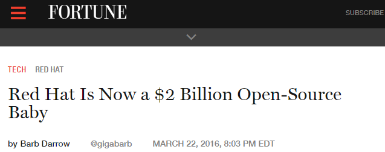
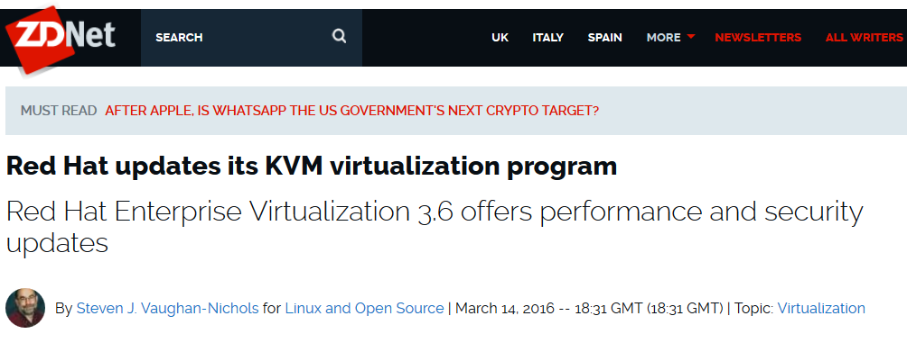
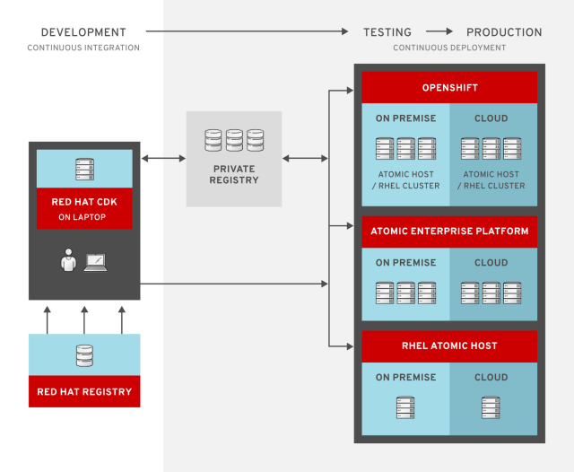
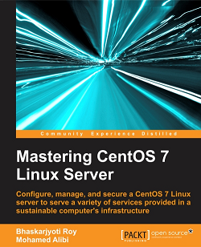
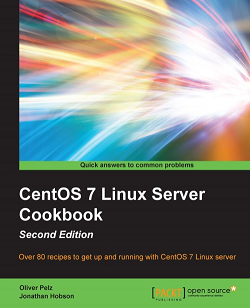
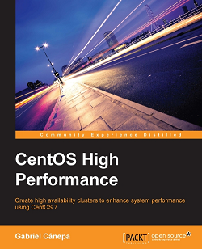
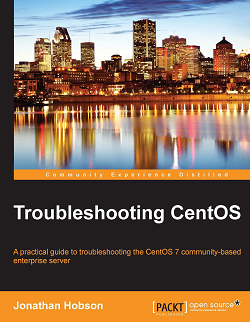
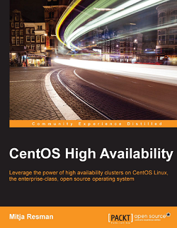

<!-- MarkdownTOC -->

- [Red Hat](#red-hat)
	- [Red Hat on Twitter](#red-hat-on-twitter)
	- [Red Hat Blogs and Forums](#red-hat-blogs-and-forums)
	- [Red Hat Docs](#red-hat-docs)
		- [Fedora](#fedora)
	- [Red Hat Security](#red-hat-security)
	- [Red Hat Insights. Modern infrastructure management](#red-hat-insights-modern-infrastructure-management)
	- [Project Atomic](#project-atomic)
	- [Cockpit web based server manager](#cockpit-web-based-server-manager)
	- [Red Hat Virtualization](#red-hat-virtualization)
	- [Red Hat OpenShift PaaS](#red-hat-openshift-paas)
	- [Red Hat OpenStack](#red-hat-openstack)
	- [Red Hat Cloud Suite](#red-hat-cloud-suite)
	- [Red Hat Cluster](#red-hat-cluster)
	- [Red Hat Storage](#red-hat-storage)
	- [Red Hat and IBM](#red-hat-and-ibm)
	- [Red Hat and AWS](#red-hat-and-aws)
		- [Red Hat Server with GUI and remote access with RDP](#red-hat-server-with-gui-and-remote-access-with-rdp)
	- [Red Hat Mobile Application Platform: Feed Henry](#red-hat-mobile-application-platform-feed-henry)
	- [Java 8 and Git](#java-8-and-git)
	- [JBoss \(WildFly\)](#jboss-wildfly)
		- [JBoss Blogs](#jboss-blogs)
		- [JBoss on Twitter](#jboss-on-twitter)
		- [JBoss GateIn, Exo, Forge, Forums, Developer Studio, Arquillian Testing Platform, and others](#jboss-gatein-exo-forge-forums-developer-studio-arquillian-testing-platform-and-others)
		- [JBoss Resources](#jboss-resources)
		- [JBoss BPM Suite and JBoss BRMS](#jboss-bpm-suite-and-jboss-brms)
		- [JBoss Fuse - Enterprise Service Bus \(ESB\)](#jboss-fuse---enterprise-service-bus-esb)
		- [JBoss Data Virtualization](#jboss-data-virtualization)
		- [JBoss Data Grid](#jboss-data-grid)
	- [Red Hat Development](#red-hat-development)
		- [Red Hat Container Development Kit](#red-hat-container-development-kit)
	- [Red Hat Varnish](#red-hat-varnish)
	- [Red Hat Videos](#red-hat-videos)

<!-- /MarkdownTOC -->

<iframe width="560" height="315" src="https://www.youtube-nocookie.com/embed/_v-qAlxyrms?rel=0" frameborder="0" allowfullscreen class="video"></iframe>

 

<blockquote class="twitter-tweet tw-align-center" data-lang="es">
Cutting costs could be costing you money <a href="https://t.co/xldpR0lDY2">https://t.co/xldpR0lDY2</a> <a href="https://twitter.com/hashtag/innovation?src=hash">#innovation</a> <a href="https://twitter.com/hashtag/ITWOB?src=hash">#ITWOB</a> <a href="https://t.co/FTDRrZUIAh">pic.twitter.com/FTDRrZUIAh</a>
&mdash; Red Hat EMEA (@RedHatEMEA) <a href="https://twitter.com/RedHatEMEA/status/700579406947946496">febrero 19, 2016</a></blockquote>

<blockquote class="twitter-tweet tw-align-center" data-lang="es">
Quite excited about this | Red Hat will give away its Linux distro for free to developers <a href="https://twitter.com/hashtag/oss?src=hash">#oss</a> <a href="https://twitter.com/hashtag/linux?src=hash">#linux</a> <a href="https://t.co/AKgCIx7CJ1">https://t.co/AKgCIx7CJ1</a>
&mdash; Scott McCarty (@fatherlinux) <a href="https://twitter.com/fatherlinux/status/715850749318733826">1 de abril de 2016</a></blockquote>

<blockquote class="twitter-tweet tw-align-center" data-lang="es">
.<a href="https://twitter.com/Telefonica">@Telefonica</a> and .<a href="https://twitter.com/RedHatNews">@RedHatNews</a> sign a global agreement to help companies mobilise business <a href="https://t.co/XNQiOjdIKK">https://t.co/XNQiOjdIKK</a> <a href="https://t.co/kff4IRZYVq">pic.twitter.com/kff4IRZYVq</a>
&mdash; LogisticsIT Magazine (@LogisticsIT) <a href="https://twitter.com/LogisticsIT/status/733719223726419969">20 de mayo de 2016</a></blockquote>

<iframe width="560" height="315" src="https://www.youtube.com/embed/Z3qiWqagaHE?rel=0" frameborder="0" allowfullscreen class="video"></iframe>

 

# Red Hat
## Red Hat on Twitter
- [twitter.com/RedHatNews](https://twitter.com/RedHatNews)
- [twitter.com/fedora](https://twitter.com/fedora)
- [twitter.com/openshift](https://twitter.com/openshift)
- [twitter.com/RedHatAtomic](https://twitter.com/RedHatAtomic)
- [twitter.com/JBoss](https://twitter.com/JBoss)

## Red Hat Blogs and Forums
- [RedHat.com Blog](http://www.redhat.com/en/about/blog)
- [RedHat "subreddit" 🌟🌟🌟](https://www.reddit.com/r/redhat/)
- [The CentOS Project’s facebook group is over 20,000 users 🌟](https://www.facebook.com/groups/centosproject/)
- [Red Hat Enterprise Linux Blog 🌟](http://rhelblog.redhat.com/)
- [Red Hat Community 🌟](http://community.redhat.com)
- [Red Hat Cloud Strategy Blog 🌟🌟](http://www.redhat-cloudstrategy.com/)
- [OpenShift Blog](https://blog.openshift.com)
- [Red Hat Stack | An OpenStack Blog](http://redhatstackblog.redhat.com/)
- [Red Hat Security 🌟](https://securityblog.redhat.com)
- [Open Studio](http://openstudio.redhat.com/)
	- [Open Source stories. Telling stories about the open source way](http://www.redhat.com/en/open-source/stories)
- [middlewareblog.redhat.com 🌟](http://middlewareblog.redhat.com)
- [ossmentor.com](http://www.ossmentor.com)
- [Fedora Magazine](http://fedoramagazine.org/)
- [Red Hat Developer Blog 🌟](http://developerblog.redhat.com)
- [Red Hat Developers 🌟🌟](http://developers.redhat.com)
- [Planet JBoss Developer](http://planet.jboss.org/)
- [opensourcerers.org](http://www.opensourcerers.org/)
- [servicesblog.redhat.com](http://servicesblog.redhat.com)

## Red Hat Docs
- [tecmint: Red Hat Enterprise Linux (RHEL) 7.1 Released – A Quick Review and Installation Instructions](http://www.tecmint.com/redhat-enterprise-linux-7-1-installation/)
- [RHEL 7.2 Release Notes](https://access.redhat.com/documentation/en-US/Red_Hat_Enterprise_Linux/7/html/7.2_Release_Notes/index.html)
- [Red Hat Enterprise Linux 5, 6, and 7.Common administrative commands](https://access.redhat.com/sites/default/files/attachments/rhel_5_6_7_cheatsheet_a4_1114_jcs.pdf)
	- [A big step forward in business Linux: Red Hat Enterprise Linux 7 arrives](http://www.zdnet.com/article/a-big-step-forward-in-business-linux-red-hat-enterprise-linux-7-arrives/)
- [Product documentation](https://access.redhat.com/documentation/en/)
- [State of the Red Hat Union is Secure. An exciting year ahead, from containeres to mobile](http://www.redhat.com/en/about/blog/state-red-hat-union-secure)
- [How to Setup and Configure Network Bonding or Teaming in RHEL/CentOS 7](http://www.tecmint.com/configure-network-bonding-or-teaming-in-rhel-centos-7/)
- [ZDNet: Red Hat Enterprise Linux 6.8 has landed 🌟](http://www.zdnet.com/article/red-hat-enterprise-linux-6-8-has-landed/)

<blockquote class="twitter-tweet tw-align-center" data-lang="es">
How To Install EPEL Repo on a CentOS and RHEL 7.x: <a href="https://t.co/FOuvWafDjj">https://t.co/FOuvWafDjj</a> <a href="https://twitter.com/hashtag/devops?src=hash">#devops</a>
&mdash; Brian Reynolds (@breynoldz) <a href="https://twitter.com/breynoldz/status/709488307823058945">14 de marzo de 2016</a></blockquote>

### Fedora
- [Fedora 23 released - Fedora Magazine](http://fedoramagazine.org/fedora-23-released/)
	- [Fedora 23: An Impressive Release for Advanced Linux Users](https://www.linux.com/news/software/applications/868617-fedora-23-an-impressive-release-for-advanced-linux-users/)

## Red Hat Security
- [Red Hat Security Blog](https://access.redhat.com/blogs/product-security)
- [Red Hat Security guide](https://www.redhat.com/en/technologies/guide/it-security)

## Red Hat Insights. Modern infrastructure management
- [Red Hat Insights. Proactively manage your infrastructure with Red Hat® Insights](https://access.redhat.com/insights/info/)

## Project Atomic
- [projectatomic.io 🌟](http://www.projectatomic.io) Create and Run Applications in Linux Containers 
- [New CentOS Atomic Host Images Available for Download](http://www.projectatomic.io/blog/2016/03/new-centos-atomic-host-images-available-for-download/)

<blockquote class="twitter-tweet tw-align-center" data-lang="es">
New blog: New CentOS Atomic Host Images Available for Download <a href="https://t.co/4MZS7sc2sj">https://t.co/4MZS7sc2sj</a>
&mdash; Project Atomic (@ProjectAtomic) <a href="https://twitter.com/ProjectAtomic/status/704678766023479296">1 de marzo de 2016</a></blockquote>

<iframe width="560" height="315" src="https://www.youtube.com/embed/jBbKIG9I5c8?rel=0" frameborder="0" allowfullscreen class="video"></iframe>

 

## Cockpit web based server manager
- Cockpit was created by Red Hat to make server administration easier. With this web-based GUI you can tackle tasks like storage administration, journal inspection, starting/stopping services, and multiple server monitoring. Cockpit will run on Fedora Server, Arch Linux, CentOS Atomic, Fedora Atomic, and Red Hat Enterprise Linux.
- [cockpit-project.org](http://cockpit-project.org/)
- [tecmint.com: Installation of Fedora 23 Server and Administration with Cockpit Management Tool](http://www.tecmint.com/installation-of-fedora-23-server-and-administration-with-cockpit-tool/)
- [linuxpitstop.com: Install Cockpit on CentOS 7 – A Web Based System Monitoring Tool](http://linuxpitstop.com/install-cockpit-on-centos-7/)
- [linoxide.com: How to Install Cockpit on Linux CentOS 7](http://linoxide.com/linux-how-to/install-cockpit-linux-centos-7/)
- [Youtube. Jupiter Broadcasting: Fedora 23 from the Cockpit](https://youtu.be/xMMNRSxdNvQ) Fedora 23 has hit the web and we think this is the release that changes everything, forever. Find out why we think the changes made in Fedora 23 make this nearly a future proof distribution in some work cases. 

<blockquote class="twitter-tweet tw-align-center" data-lang="es">
<a href="https://twitter.com/hashtag/cockpit?src=hash">#cockpit</a> is so cool, makes server APIs usable/discoverable for non Linux Experts.  Cgroups, Perf Profiles, Containers, K8s... <a href="https://twitter.com/ProjectAtomic">@ProjectAtomic</a>
&mdash; Daniel Walsh (@rhatdan) <a href="https://twitter.com/rhatdan/status/695916324015468545">6 de febrero de 2016</a></blockquote>

<iframe width="1280" height="720" src="https://www.youtube-nocookie.com/embed/NHwfxNVkzmw?rel=0" frameborder="0" allowfullscreen class="video"></iframe>

 

## Red Hat Virtualization
- [tecmint.com: How to Install RedHat Enterprise Virtualization (RHEV) 3.5](http://www.tecmint.com/install-redhat-virtualization-rhev/)
	- [Open source Virtualization by Quru, the fastest-growing Red Hat solution provider based in London](https://youtu.be/F2lxJTdfVy8)
	- [How to Create Virtual Machines in Linux Using KVM (Kernel-based Virtual Machine)](http://www.tecmint.com/install-and-configure-kvm-in-linux/)
- [community.redhat.com: Up and Running with oVirt 3.5](http://community.redhat.com/blog/2014/10/up-and-running-with-ovirt-3-5/)
	- [Up and Running with oVirt 3.5, Part Two](http://community.redhat.com/blog/2014/11/up-and-running-with-ovirt-3-5-part-two/)
- [gluster.org: GlusterFS scalable network filesystem](http://www.gluster.org/)
	- [GlusterFS Documentation](http://gluster.readthedocs.org/en/latest/)
	- [tecmint.com: Introduction to GlusterFS (File System) and Installation on RHEL/CentOS and Fedora](http://www.tecmint.com/introduction-to-glusterfs-file-system-and-installation-on-rhelcentos-and-fedora/)
- [Apple Dumps VMware Licensing Agreement, Will Step Up Deployment Of Open-Source KVM Virtualization](http://www.crn.com/news/data-center/300078323/sources-apple-dumps-vmware-licensing-agreement-will-step-up-deployment-of-open-source-kvm-virtualization.htm)
- [rhelblog.redhat.com: Virtual Machine Migration Best Practices 🌟](http://rhelblog.redhat.com/2016/05/11/migratevms/)

<iframe width="560" height="315" src="https://www.youtube.com/embed/HsqtHT8auxg?rel=0" frameborder="0" allowfullscreen class="video"></iframe>

 

<iframe width="560" height="315" src="https://www.youtube-nocookie.com/embed/F2lxJTdfVy8?rel=0" frameborder="0" allowfullscreen class="video"></iframe>

 

<blockquote class="twitter-tweet tw-align-center" data-partner="tweetdeck">
.<a href="https://twitter.com/vmherold">@vmherold</a> on modernizing your <a href="https://twitter.com/hashtag/datacenter?src=hash">#datacenter</a>: <a href="https://t.co/HnaKvxNYGc">https://t.co/HnaKvxNYGc</a> <a href="https://twitter.com/hashtag/moderndatacenters?src=hash">#moderndatacenters</a> <a href="https://twitter.com/hashtag/virtualization?src=hash">#virtualization</a>
&mdash; Red Hat, Inc. (@RedHatNews) <a href="https://twitter.com/RedHatNews/status/707174032135729153">March 8, 2016</a></blockquote>

<blockquote class="twitter-tweet tw-align-center" data-lang="es">
<a href="https://twitter.com/hashtag/Red?src=hash">#Red</a> Hat Enterprise <a href="https://twitter.com/hashtag/Virtualization?src=hash">#Virtualization</a> 3.6 has new tools to ease <a href="https://twitter.com/hashtag/VMware?src=hash">#VMware</a> <a href="https://twitter.com/hashtag/vSphere?src=hash">#vSphere</a> migrations <a href="https://t.co/fkZTQHqnf9">https://t.co/fkZTQHqnf9</a> <a href="https://t.co/Vf8YW4kyu9">pic.twitter.com/Vf8YW4kyu9</a>
&mdash; Red Hat, Inc. (@RedHatNews) <a href="https://twitter.com/RedHatNews/status/707706032378634240">marzo 9, 2016</a></blockquote>

<blockquote class="twitter-tweet tw-align-center" data-lang="es">
<a href="https://twitter.com/hashtag/Linux?src=hash">#Linux</a> containers vs. <a href="https://twitter.com/hashtag/VMs?src=hash">#VMs</a>: A <a href="https://twitter.com/hashtag/security?src=hash">#security</a> comparison <a href="https://t.co/tp76nVqfKY">https://t.co/tp76nVqfKY</a> via <a href="https://twitter.com/infoworld">@infoworld</a>
&mdash; Red Hat Cloud (@RedHatCloud) <a href="https://twitter.com/RedHatCloud/status/734785211674697728">23 de mayo de 2016</a></blockquote>

<blockquote class="twitter-tweet tw-align-center" data-lang="es">
Want to detect execution in a virtualized environment on Linux?  systemd-detect-virt  OR  dmidecode -s system-manufacturer<a href="https://twitter.com/hashtag/sysadmin?src=hash">#sysadmin</a>
&mdash; nixCraft (@nixcraft) <a href="https://twitter.com/nixcraft/status/714602201222524928">28 de marzo de 2016</a></blockquote>

<blockquote class="twitter-tweet tw-align-center" data-lang="es">
A lot of good work happening in the <a href="https://twitter.com/hashtag/ovirt?src=hash">#ovirt</a>, <a href="https://twitter.com/hashtag/fedora?src=hash">#fedora</a> and <a href="https://twitter.com/hashtag/rhel?src=hash">#rhel</a> communities. <a href="https://twitter.com/RedHatNews">@RedHatNews</a> <a href="https://t.co/Ks5ENiCb4S">https://t.co/Ks5ENiCb4S</a>
&mdash; Scott McCarty (@fatherlinux) <a href="https://twitter.com/fatherlinux/status/734727633871724544">23 de mayo de 2016</a></blockquote>

## Red Hat OpenShift PaaS
- [Enterprise OpenShift](https://enterprise.openshift.com/)
- [blog.openshift.com 🌟🌟](https://blog.openshift.com)
- [OpenShift Dedicated, a new Amazon-based option for deploying its open source PaaS applications platform, with the aid of Google’s Kubernetes](http://www.cmswire.com/information-management/red-hat-bids-to-drive-openshift-deeper-into-enterprises/)
	- [OpenShift Dedicated](https://www.openshift.com/dedicated/)
	- [Red Hat OpenShift 3.1 Opens the Door for Both .NET and JBoss Middleware](http://thenewstack.io/openshift-3-1-opens-door-net-jboss-middleware/)
	- [Red Hat quiere que su canal se vuelque en middleware y cloud](http://www.channelpartner.es/oportunidades-negocio/noticias/1079121002302/red-hat-quiere-canal-vuelque-middleware-cloud.1.html)
- [Red Hat announces availability of containerized middleware capabilities on OpenShift](http://www.redhat.com/en/about/blog/red-hat-announces-availability-containerized-middleware-capabilities-openshift)
	- [zdnet.com: Containers, OpenShift, and Middleware](http://www.zdnet.com/article/containers-openshift-and-middleware/)
- [OpenShift 3.1 Log files for Pods](https://blog.openshift.com/openshift-3-1-log-files-for-pods/)
- [opensourcerers.org: First Fuse application on OpenShift V3.1](http://www.opensourcerers.org/first-fuse-application-on-openshift-v3-1/)
- [DZone/Integration Zone: Red Hat Launches OpenShift v3.1, Full of Docker/Kubernetes Goodness](https://dzone.com/articles/red-hat-launches-openshift-v31-full-of-dockerkuber)
- [blog.openshift.com: From zero to container deployment hero with OpenShift 3 🌟🌟](https://blog.openshift.com/openshift-3-walkthrough/)
- [blog.openshift.com: Using OpenShift 3 on your local environment 🌟](https://blog.openshift.com/using-openshift-3-on-your-local-environment/)
- [planet.jboss.org: How to install OpenShift as your private PaaS](http://planet.jboss.org/post/how_to_install_openshift_as_your_private_paas)

<iframe src="//www.slideshare.net/slideshow/embed_code/key/qUTP0wDDEH9bVo" width="595" height="485" frameborder="0" marginwidth="0" marginheight="0" scrolling="no" style="border:1px solid #CCC; border-width:1px; margin-bottom:5px; max-width: 100%;" allowfullscreen class="video"> </iframe> 
 <strong> <a href="//www.slideshare.net/greghoelzer7/red-hat-openshift-v3-overview-and-deep-dive" title="Red Hat OpenShift V3 Overview and Deep Dive" target="_blank">Red Hat OpenShift V3 Overview and Deep Dive</a> </strong> from <strong><a href="//www.slideshare.net/greghoelzer7" target="_blank">Greg Hoelzer</a></strong> 

 

<iframe width="560" height="315" src="https://www.youtube.com/embed/yFPYGeKwmpk?rel=0" frameborder="0" allowfullscreen class="video"></iframe>

 

<blockquote class="twitter-tweet tw-align-center" data-lang="es">
<a href="https://twitter.com/hashtag/OpenShift?src=hash">#OpenShift</a> Dedicated: Develop, host, and scale your <a href="https://twitter.com/hashtag/apps?src=hash">#apps</a> in the <a href="https://twitter.com/hashtag/cloud?src=hash">#cloud</a> <a href="https://t.co/jEuOTp0wX1">https://t.co/jEuOTp0wX1</a> <a href="https://t.co/lKnf6h0xIc">pic.twitter.com/lKnf6h0xIc</a>
&mdash; Red Hat EMEA (@RedHatEMEA) <a href="https://twitter.com/RedHatEMEA/status/711865041822334976">21 de marzo de 2016</a></blockquote>

<blockquote class="twitter-tweet tw-align-center" data-lang="es">
Can&#39;t believe installing <a href="https://twitter.com/hashtag/OpenShift?src=hash">#OpenShift</a> private <a href="https://twitter.com/hashtag/PaaS?src=hash">#PaaS</a> is so easy? See video how to: ~3.5 mins! <a href="https://t.co/zlRt9m0ai1">https://t.co/zlRt9m0ai1</a> <a href="https://t.co/PdoijukL2Z">pic.twitter.com/PdoijukL2Z</a>
&mdash; Eric D. Schabell (@ericschabell) <a href="https://twitter.com/ericschabell/status/702855024460759040">25 de febrero de 2016</a></blockquote>

## Red Hat OpenStack
- [Red Hat OpenStack](redhat_openstack.md)

## Red Hat Cloud Suite
- [redhat.com/cloud-suite](http://redhat.com/cloud-suite)
- [Red Hat Cloud Suite - Modernizing Development & Operations (video)](http://www.schabell.org/2016/05/rhcs-modernizing-development-and-operations-video.html)

<iframe width="560" height="315" src="https://www.youtube.com/embed/hWNW6XookiQ?rel=0" frameborder="0" allowfullscreen class="video"></iframe>

 

<iframe src="https://player.vimeo.com/video/166958752?byline=0&portrait=0" width="640" height="360" frameborder="0" webkitallowfullscreen mozallowfullscreen allowfullscreen class="video"></iframe>
<a href="https://vimeo.com/166958752">Red Hat Cloud Suite - Modernizing Development &amp; Operations</a> from <a href="https://vimeo.com/ericschabell">Eric D. Schabell</a> on <a href="https://vimeo.com">Vimeo</a>.

 

## Red Hat Cluster
- [Wikipedia: Red Hat Cluster Suite](https://en.wikipedia.org/wiki/Red_Hat_cluster_suite)
- [Slideshare: Red Hat GFS](http://www.slideshare.net/manojsinghdhn/rhel-cluster-basics-2)
- [Slideshare: Cluster Administration Tools](http://www.slideshare.net/manojsinghdhn/rhel-cluster-basics-3)

<iframe src="//www.slideshare.net/slideshow/embed_code/key/5AGF4tmnY7ccT9" width="595" height="485" frameborder="0" marginwidth="0" marginheight="0" scrolling="no" style="border:1px solid #CCC; border-width:1px; margin-bottom:5px; max-width: 100%;" allowfullscreen class="video"> </iframe> 
 <strong> <a href="//www.slideshare.net/kerneltraining/red-hat-cluster-suite-demo-linux-cluster-introduction-basics" title="Red hat Cluster suite Demo | Linux Cluster Introduction | Basics" target="_blank">Red hat Cluster suite Demo | Linux Cluster Introduction | Basics</a> </strong> from <strong><a href="//www.slideshare.net/kerneltraining" target="_blank">Kernel Training</a></strong> 

 

<iframe src="//www.slideshare.net/slideshow/embed_code/key/8vvS2zzpt24snJ" width="595" height="485" frameborder="0" marginwidth="0" marginheight="0" scrolling="no" style="border:1px solid #CCC; border-width:1px; margin-bottom:5px; max-width: 100%;" allowfullscreen class="video"> </iframe> 
 <strong> <a href="//www.slideshare.net/manojsinghdhn/rhel-cluster-basics-1-44632468" title="Rhel cluster basics 1" target="_blank">Rhel cluster basics 1</a> </strong> from <strong><a href="//www.slideshare.net/manojsinghdhn" target="_blank">Manoj Singh</a></strong> 

 

## Red Hat Storage
- [redhat.com/storage](http://redhat.com/storage)
- [redhat.lookbookhq.com: Is Open, Software-defined Storage Right for Your Organization?](http://redhat.lookbookhq.com/sds/asset1)
- [UK goes all-in on cloud as Google & Red Hat partner for flexible, open source storage](http://www.cbronline.com/news/cloud/public/uk-heads-all-in-on-cloud-as-google-red-hat-partner-for-flexible-open-source-storage-4816365)
- [tecmint.com: Create Centralized Secure Storage using iSCSI Target/Initiator on RHEL/CentOS 7 – Part 12 🌟](http://www.tecmint.com/create-centralized-secure-storage-using-iscsi-target-initiator/)

<iframe width="1280" height="720" src="https://www.youtube-nocookie.com/embed/lvYQlLnuyNY?rel=0" frameborder="0" allowfullscreen class="video"></iframe>

 

<iframe width="1280" height="720" src="https://www.youtube-nocookie.com/embed/bskU4ealzMk?rel=0" frameborder="0" allowfullscreen class="video"></iframe>

 

## Red Hat and IBM
- [Installing Red Hat Enterprise Linux 7.2 on IBM POWER8 and x86 in bare metal mode: A comparison](http://www.ibm.com/developerworks/linux/library/l-installing-rhel-7-2-on-ibm-power8-and-x86/index.html)

## Red Hat and AWS
### Red Hat Server with GUI and remote access with RDP
- [How To Install and Configure GUI for Amazon EC2 RHEL 7 Instance](http://devopscube.com/how-to-setup-gui-for-amazon-ec2-rhel-7-instance/)

## Red Hat Mobile Application Platform: Feed Henry
- [Feed Henry](http://feedhenry.org/)
- [Open sourcing Red Hat Mobile Application Platform – Unified Push Server](http://developerblog.redhat.com/2015/12/16/open-sourcing-red-hat-mobile-application-platform-unified-push-server)
- [developerblog.redhat.com Apps 101: An Absolute Beginner’s Guide to building a Mobile App](http://developerblog.redhat.com/2016/02/17/apps-101-an-absolute-beginners-guide-to-building-a-mobile-app/)
- [developerblog.redhat.com Apps 101: An Absolute Beginners Guide to Integrating With a Node.js Backend](http://developerblog.redhat.com/2016/02/19/apps-101-an-absolute-beginners-guide-to-integrating-with-a-node-js-backend/)

<iframe width="560" height="315" src="https://www.youtube-nocookie.com/embed/5_qsqPOi6kE?rel=0" frameborder="0" allowfullscreen class="video"></iframe>

 

<iframe width="1280" height="720" src="https://www.youtube-nocookie.com/embed/5KbMVQTd3ks?rel=0" frameborder="0" allowfullscreen class="video"></iframe>

 

<blockquote class="twitter-tweet tw-align-center" data-lang="es">
Apps 101: An Absolute Beginner’s Guide to building a Mobile App <a href="https://t.co/1VhQ2438Vs">https://t.co/1VhQ2438Vs</a>
&mdash; RHELdevelop (@RHELdevelop) <a href="https://twitter.com/RHELdevelop/status/700042783046762496">febrero 17, 2016</a></blockquote>

## Java 8 and Git
- [tecadmin.net: How to Install JAVA 8 (JDK/JRE 8u72) on CentOS/RHEL and Fedora](http://tecadmin.net/install-java-8-on-centos-rhel-and-fedora/)
- [tecadmin.net: How to Install Git 2.0.5 on CentOS/RHEL 7/6/5 and Fedora 22/21](http://tecadmin.net/install-git-2-0-on-centos-rhel-fedora/)

## JBoss (WildFly)
- [List of JBoss software](https://en.wikipedia.org/wiki/List_of_JBoss_software)
- [Product Documentation for JBoss Enterprise Application Platform](https://access.redhat.com/documentation/en/jboss-enterprise-application-platform/)
- [WildFly 10 ebook - Francesco Marchioni](http://www.itbuzzpress.com/ebooks/wildfly-10-ebook.html)
- [javacodegeeks.com: WildFly Swarm – Deploying Java EE Applications As Standalone Jars](http://www.javacodegeeks.com/2016/01/wildfly-swarm-deploying-java-ee-applications-standalone-jars.html)
	- [wildfly-swarm.io](http://wildfly-swarm.io/)
- [planet.jboss.org: This week in JBoss (11th January 2016): New Beginnings!](http://planet.jboss.org/post/this_week_in_jboss_11th_january_2016_new_beginnings)

### JBoss Blogs
- [middlewareblog.redhat.com 🌟](http://middlewareblog.redhat.com)
- [docs.jboss.org](http://docs.jboss.org )
- [community.jboss.org](https://community.jboss.org )
- [blog.eisele.net: Enterprise Software Development with Java](http://blog.eisele.net/)
- [JBoss Developer](https://developer.jboss.org/)
- [Planet JBoss](http://planet.jboss.org/)
- [JBoss Issue Tracker](https://issues.jboss.org)
- [middlewaresnippets.blogspot.com 🌟](http://middlewaresnippets.blogspot.com)
- [developerblog.redhat.com - JBoss  🌟](http://developerblog.redhat.com/tag/jboss/)
- [schabell.org - Eric D. Schabell's blog](http://www.schabell.org)
- [JBoss Tutotials - JBoss training courses](http://www.mastertheboss.com/)

### JBoss on Twitter
- [twitter.com/JBoss](https://twitter.com/JBoss)
- [twitter.com/jbossdeveloper](https://twitter.com/jbossdeveloper)
- [JBoss Community twitter.com/jbossorg](https://twitter.com/jbossorg)
- [twitter.com/JBossForge](https://twitter.com/JBossForge)
- [twitter.com/WildFlyAS](https://twitter.com/WildFlyAS)
- [twitter.com/jtgreene](https://twitter.com/jtgreene)
- [twitter.com/arungupta](https://twitter.com/arungupta)

<iframe width="560" height="315" src="https://www.youtube-nocookie.com/embed/9gYLKxJ9NbY?rel=0" frameborder="0" allowfullscreen class="video"></iframe>

 

### JBoss GateIn, Exo, Forge, Forums, Developer Studio, Arquillian Testing Platform, and others
- [JBoss GateIn Portal](http://gatein.jboss.org/)
- [JBoss eXo Platform Enterprise Social collaboration software](https://www.exoplatform.com)
- [JBoss Forge to build Maven-based Java EE projects](http://forge.jboss.org/)
- [JBoss Forums](http://jbossforums.jboss.org/)
- [JBoss Developer Studio](https://www.jboss.org/products/devstudio/overview/)
- [Arquillian, a testing platform built on the JVM that substantially reduces the effort required to write and execute Java middleware integration and functional tests](http://arquillian.org/)
- [Container Object pattern. A new pattern for your tests. Arquillian  community](http://www.javacodegeeks.com/2016/01/container-object-pattern-new-pattern-tests.html)
- [Testing persistence with Arquillian on TomEE: Excellent step by step introduction tutorial on persistence unit testing](http://www.tomitribe.com/blog/2016/01/testing-persistence-with-arquillian-on-tomee/)

<iframe width="960" height="720" src="https://www.youtube-nocookie.com/embed/V-klCvWDnT4?rel=0" frameborder="0" allowfullscreen class="video"></iframe>

 

### JBoss Resources
- [tecmint.com: WildFly (JBoss AS) – How to Access and Manage CLI Using GUI](http://www.tecmint.com/wildfly-jboss-as-how-to-access-and-manage-cli-using-gui/)
- [middlewaresnippets.blogspot.com - WildFlying Java EE 7](http://middlewaresnippets.blogspot.com/2014/07/wildflying-java-ee-7.html)
- [developerblog.redhat.com - JBoss on Docker At a Glance](http://developerblog.redhat.com/2015/01/14/jboss-on-docker-at-a-glance/)
- [blog.openshift.com: A Java EE 7 Application on OpenShift 3 With JBoss Tools](https://blog.openshift.com/a-java-ee-7-application-on-openshift-3-with-jboss-tools/)
- [C2B2Consulting - JBoss EAP 6: installation, configuration & clustering](http://www.c2b2.co.uk/introduction_to_jboss_eap_6_webinar)
- [dzone.com - Red Hat JBoss Fuse Workshop 101: Fuse in EAP](https://dzone.com/articles/red-hat-jboss-fuse-workshop-101-fuse-in-eap)
- [youtube - 2014 Red Hat Summit: Red Hat JBoss Middleware keynote](https://youtu.be/XPK2RTqlBxk)
- [youtube - Craig Muzilla delivers middleware keynote at 2015 Red Hat Summit](https://youtu.be/wWNVpFibayA)
- [dzone: JBoss EAP 7 and NoSQL Using Java EE and Docker](https://dzone.com/articles/jboss-eap-7-and-nosql-using-java-ee-and-docker)
- [blog.eisele.net: A Refresher - Top 5 Java EE 7 Frontend. Resources to get you started with JBoss EAP 7 and WildFly](http://blog.eisele.net/2016/01/a-refresher-top-5-java-ee-7-frontend.html)
	- [Getting Started With EAP 7 Alpha and Java EE 7](http://blog.eisele.net/2015/11/getting-started-with-eap-7-alpha-and.html)
	- [A Java EE 7 Application on OpenShift 3 With JBoss Tools](http://blog.eisele.net/2015/12/a-java-ee-7-application-on-openshift-3.html)
	- [Java EE 7 Samples on GitHub](https://github.com/javaee-samples/javaee7-samples)
	- [Getting Started With The JBoss EAP 7 Quickstarts](http://blog.eisele.net/2015/12/getting-started-with-jboss-eap-7.html)
	- [Red Hat JBoss Engineers about Java EE, Container, Microservices and Testing](http://blog.eisele.net/2015/11/jboss-engineers-about-java-ee-microservices-container-testing.html)
- [middlewareblog.redhat.com: Containers, cloud, and Java apps: A new video on development stacks 🌟](http://middlewareblog.redhat.com/2016/02/17/containers-cloud-and-java-apps/)
- [developerblog.redhat.com: Getting started with EAP 7 and JBoss Developer Studio](http://developerblog.redhat.com/2016/02/15/getting-started-with-eap-7-and-jboss-developer-studio/)
- [developers.redhat.com: What’s new with JPA 2.1 and Hibernate 5 in JBoss EAP 7](http://developers.redhat.com/blog/2016/03/07/whats-new-jpa-2-1-hibernate-5-jboss-eap-7)
- [servicesblog.redhat.com - Starting with DevOps: Deploying Applications on your Docker JBoss EAP Image](http://servicesblog.redhat.com/2016/03/28/starting-with-devops-deploying-applications-on-your-docker-jboss-eap-image/)

<iframe width="560" height="315" src="https://www.youtube.com/embed/kMS6b40GsJo?rel=0" frameborder="0" allowfullscreen class="video"></iframe>

 

<blockquote class="twitter-tweet tw-align-center" data-lang="es">
Getting started with <a href="https://twitter.com/hashtag/EAP7?src=hash">#EAP7</a> and <a href="https://twitter.com/hashtag/JBoss?src=hash">#JBoss</a> Developer Studio by <a href="https://twitter.com/myfear">@myfear</a> <a href="https://t.co/QWeqKIQR69">https://t.co/QWeqKIQR69</a> <a href="https://t.co/ZdD8iqBNAB">pic.twitter.com/ZdD8iqBNAB</a>
&mdash; Red Hat EMEA (@RedHatEMEA) <a href="https://twitter.com/RedHatEMEA/status/701666594695602176">febrero 22, 2016</a></blockquote>

### JBoss BPM Suite and JBoss BRMS
- [Red Hat Updates JBoss BPM Suite and JBoss BRMS Products](http://www.redhat.com/de/about/blog/red-hat-updates-jboss-bpm-suite-and-jboss-brms-products)
- [schabell.org: The ultimate collection of JBoss BPM Suite demos](http://www.schabell.org/2015/12/ultimate-collection-jboss-bpmsuite-demos.html)
- [schabell.org: Quick Tour #4 Start your first JBoss BRMS project (video)](http://www.schabell.org/2015/12/quick-tour-4-first-brms-project.html)
- [Clustering and session failover with WildFly9](http://blog.eisele.net/2015/01/developer-interview-di-11-stuart-douglas-about-wildfly9-undertow.html)
- [dzone: Using jBPM's RESTful API as a Black Box Workflow Server](https://dzone.com/articles/using-jbpms-restful-api-as-a-black-box-workflow-se) Here's how to properly employee JBoss jBPM for RESTful APIs.

### JBoss Fuse - Enterprise Service Bus (ESB)
- [JBoss Fuse Description](http://www.jboss.org/products/fuse/overview/)
- [planet.jboss.org - JBoss Developer - Red Hat JBoss Fuse - Integrating Database, Java Bean and Restful Services in EAP, Spring DSL](http://planet.jboss.org/post/red_hat_jboss_fuse_integrating_database_java_bean_and_restful_services_in_eap_spring_dsl)
- [pdf download: How customers are using the power of integration to drive competitive edge with JBossFuse](http://www.redhat.com/en/resources/power-integration) Organizations in manufacturing, healthcare, transportation, construction, and media are connecting their enterprises with Red Hat® JBoss®Fuse. With standard, proven integration patterns and more than 150 ready-to-use connectors, Red Hat JBoss Fuse lets organizations integrate applications, services, processes, and data to gain competitive advantage, reduce time-to-market, and lower total cost of ownership.
- [API Management with JBoss Fuse on Openshift and 3scale on Amazon Web Services – Part 1 🌟](http://developers.redhat.com/blog/2016/03/02/api-management-with-jboss-fuse-on-openshift-and-3scale-on-amazon-web-services-part-1)

<blockquote class="twitter-tweet tw-align-center" data-lang="es">
How customers are using the power of integration to drive competitive edge with <a href="https://twitter.com/hashtag/JBossFuse?src=hash">#JBossFuse</a> <a href="https://t.co/iSr4PuOwiA">https://t.co/iSr4PuOwiA</a> <a href="https://t.co/7LuWVdG5rw">pic.twitter.com/7LuWVdG5rw</a>
&mdash; Red Hat EMEA (@RedHatEMEA) <a href="https://twitter.com/RedHatEMEA/status/702806604920573953">25 de febrero de 2016</a></blockquote>

### JBoss Data Virtualization
- [ossmentor.com - JBoss Data Virtualization 6.1](http://www.ossmentor.com/2015/04/data-virtualization-61-getting-started.html)

### JBoss Data Grid
- [JBoss Data Grid description. ](http://www.jboss.org/products/datagrid/overview/)JBoss Data Grid is an in-memory, distributed, NoSQL data store that helps boost application performance and improve scalability and development flexibility.
- [JBossDataGrid named leader in in-memory data grids](https://www.redhat.com/en/resources/jboss-data-grid-named-leader-forrester-research)
- [C2B2Consulting - JBoss Data Grid](http://www.c2b2.co.uk/jboss_data_grid)
	- [C2B2Consulting - JBoss Data Grid: Webinar](http://www.c2b2.co.uk/jboss_data_grid_webinar_part_1)
	- [C2B2Consulting - JBoss Data Grid: Installation and Development](http://blog.c2b2.co.uk/2014/03/jboss-data-grids-installation-and.html)
	- [C2B2Consulting - Youtube - Learn How to Supercharge Your Applications with Intelligent, Distributed Caching](https://youtu.be/q52_C9WW70Q)

<iframe width="560" height="315" src="https://www.youtube-nocookie.com/embed/OXL4EAS8RXw?rel=0" frameborder="0" allowfullscreen class="video"></iframe>

 

## Red Hat Development
- [developerblog.redhat.com: 12 Top blog articles of 2015](http://developerblog.redhat.com/2015/12/29/12-top-blog-articles-of-2015/)
- [developerblog.redhat.com: 2015 Year in Review – oh what a year](http://developerblog.redhat.com/2015/12/14/2015-year-in-review-oh-what-a-year/)
	- [Our 5 most popular developer posts in 2014](http://developerblog.redhat.com/2014/12/31/5-most-popular-posts-2014/)
	- [Red Hat Software Collections 2.1 now generally available](http://developerblog.redhat.com/2015/11/17/software-collections-2-1-generally-available/)
	- [Red Hat developers blog, an Enterprise Developer’s Journey to the IoT](http://developerblog.redhat.com/2015/12/02/enterprise-developers-journey-to-iot/)
- [developers.redhat.com: So, what are containers??](http://developers.redhat.com/containers/overview/)
- [How to use Red Hat Software Collections (RHSCL) or Red Hat Developer Toolset (DTS)?](https://access.redhat.com/solutions/472793)
	- [Reddit: Red Hat Software Collections (SCL) is not provided with RHEL Server/Workstation, Self Support](https://www.reddit.com/r/redhat/comments/39kk0s/red_hat_software_collections_scl_is_not_provided/)
- [pyvideo.org - Red Hat Loves Python (EuroPython 2014)](http://pyvideo.org/video/2962/red-hat-loves-python)
- [dzone.com: Red Hat Explores Node.js and Java Integration Options and Partners With Azure](https://dzone.com/articles/red-hat-explores-nodejs-and-java-integration-optio)
- [developers.redhat.com: No-Cost RHEL Developer Subscription now available 🌟](http://developers.redhat.com/blog/2016/03/31/no-cost-rhel-developer-subscription-now-available/)
- [siliconangle.com: Red Hat will give away its Linux distro for free to developers](http://siliconangle.com/blog/2016/03/31/red-hat-will-give-away-its-linux-distro-for-free-to-developers/)

### Red Hat Container Development Kit
- [developerblog.redhat.com: Red Hat Container Development Kit 2](http://developerblog.redhat.com/2016/02/08/update-red-hat-container-development-kit-2-beta/)
- [planet.jboss.org: How to install Red Hat Container Development Kit (CDK) in minutes 🌟](http://planet.jboss.org/post/how_to_install_red_hat_container_development_kit_cdk_in_minutes)
- [rhelblog.redhat.com: The Red Hat Ecosystem for Microservice and Container Development 🌟](http://rhelblog.redhat.com/2016/02/23/the-red-hat-ecosystem-for-microservice-and-container-development/)
- [rhelblog.redhat.com: Getting Started with the Red Hat Container Development Kit (CDK)](http://rhelblog.redhat.com/2016/02/25/getting-started-with-the-red-hat-container-development-kit-cdk/)
- [Installing the Red Hat Container Development Kit (CDK) 2.0 release](http://www.schabell.org/2016/04/installing-redhat-cdk-2-0-release.html)

<blockquote class="twitter-tweet tw-align-center" data-lang="es">
How to get a Node.js and mongodb application running in <a href="https://twitter.com/hashtag/containers?src=hash">#containers</a> and deployed <a href="https://twitter.com/openshift">@OpenShift</a> via the Red Hat CDK - <a href="https://t.co/QlmFOhmaMa">https://t.co/QlmFOhmaMa</a>
&mdash; Kimberly Craven (@kimberlycraven) <a href="https://twitter.com/kimberlycraven/status/702942857535946752">25 de febrero de 2016</a></blockquote>

## Red Hat Varnish
- [Varnish Cache](https://www.varnish-cache.org/)
- [fedoramagazine.org: Varnish: Your site faster and more stable](https://fedoramagazine.org/varnish-site-faster-stable/)
- [Red Hat Developer Blog. Tag: Varnish](https://developerblog.redhat.com/tag/varnish/)
- [Red Hat Enterprise Linux Blog. Tag: Varnish](http://rhelblog.redhat.com/tag/varnish/)
- [varnish-cache.org: Installation on RedHat](https://www.varnish-cache.org/installation/redhat)
- [Hitch - scalable TLS proxy. Hitch is a libev-based high performance SSL/TLS proxy by Varnish Software](https://hitch-tls.org/)

## Red Hat Videos
- [redhat.com videos](http://www.redhat.com/en/about/videos)
- [Red Hat Videos - youtube channel](https://www.youtube.com/user/RedHatVideos)
- [Red Hat Middleware - youtube channel](https://www.youtube.com/channel/UCj1LxybwM853cCvndtZmOkQ)
- [Red Hat Developers at Devoxx 2015](http://developers.redhat.com/events/devoxx/2015/)
- [youtube - Red Hat Summit](https://www.youtube.com/user/redhatsummit)
- [Flock Fedora Conference](https://fedoramagazine.org/tag/flock/)
	- [Flock 2014 Fedora Conference](http://community.redhat.com/blog/2014/08/flock-2014-fedora-conference-live-streaming-schedule-and-video-archives/)
	- [Flock 2015 Fedora Conference](https://www.youtube.com/playlist?list=PL0x39xti0_64fA6uRtcfoJPkHfZdeVTRC)

<iframe src="//www.slideshare.net/slideshow/embed_code/key/37yt7ES7lc1UGS" width="595" height="485" frameborder="0" marginwidth="0" marginheight="0" scrolling="no" style="border:1px solid #CCC; border-width:1px; margin-bottom:5px; max-width: 100%;" allowfullscreen class="video"> </iframe> 
 <strong> <a href="//www.slideshare.net/MariaDB/red-hat-trends-and-technologie-december-2015" title="Red Hat Trends and Technologie December 2015" target="_blank">Red Hat Trends and Technologie December 2015</a> </strong> from <strong><a href="//www.slideshare.net/MariaDB" target="_blank">MariaDB</a></strong> 

 

