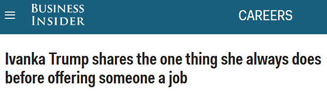
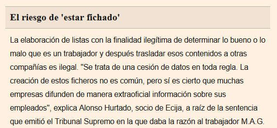
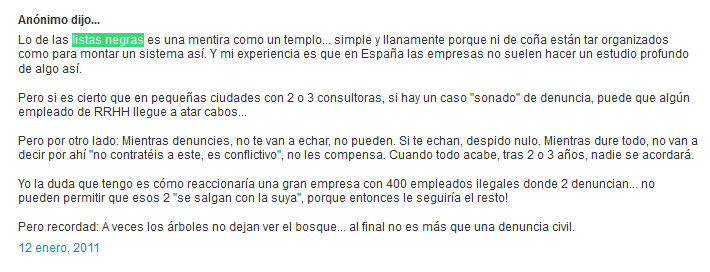
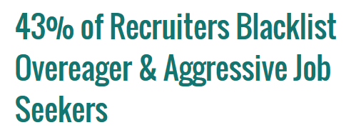

<!-- MarkdownTOC -->

- [References and online defamation](#references-and-online-defamation)

<!-- /MarkdownTOC -->

<blockquote class="twitter-tweet tw-align-center" data-lang="es">
Moneyball (Breaking Biases)  Amazing. Love this scene  <a href="http://t.co/5ngbsuMlpt">http://t.co/5ngbsuMlpt</a>
&mdash; Harry Johnson (@avfc_johnson) <a href="https://twitter.com/avfc_johnson/status/625718364980277248">27 de julio de 2015</a></blockquote>

<blockquote class="twitter-tweet tw-align-center" data-lang="es">
&quot;Cuando se descubrió que la información era un negocio, la verdad dejó de ser importante.&quot;   - Ryszard Kapuściński <a href="https://twitter.com/hashtag/PrimerTweet?src=hash">#PrimerTweet</a>
&mdash; Oído en redacción (@oidoredaccion1) <a href="https://twitter.com/oidoredaccion1/status/705843998221582336">4 de marzo de 2016</a></blockquote>

<blockquote class="twitter-tweet tw-align-center" data-lang="es">
El 75% de nosotros asociamos la credibilidad de una empresa a la apariencia de su web, vía <a href="https://twitter.com/markfidelman">@markfidelman</a> <a href="https://t.co/ArLyzfxJiq">pic.twitter.com/ArLyzfxJiq</a>
&mdash; Roberto García Esteb (@72rge) <a href="https://twitter.com/72rge/status/737376158405275649">30 de mayo de 2016</a></blockquote>

# References and online defamation
- [wikipedia: Defamation](https://en.wikipedia.org/wiki/Defamation)
- [wikipedia: Right to be forgotten](https://en.wikipedia.org/wiki/Right_to_be_forgotten)
- [Removing Content From Google](https://support.google.com/legal/troubleshooter/1114905?hl=en)
    - [wikipedia: Content removal](https://en.wikipedia.org/wiki/Wikipedia:Content_removal)
- [Google, the United States and the EU ‘Right to Be Forgotten’: Strategies for Removing Harmful Google Search Results](http://www.defamationremovalattorneysblog.com/2015/07/google-the-united-states-and-the-eu-right-to-be-forgotten-strategies-for-removing-harmful-google-search-results/)
- [Google defamation case highlights complex jurisdiction problem](http://www.abc.net.au/news/2015-10-29/google-responsible-for-linking-to-defamatory-websites/6894966)
- [Google reaches out-of-court settlement in UK defamation case](http://www.reuters.com/article/us-google-britain-settlement-idUSKCN0J81K420141124)
- [Could I be sued for writing a negative review on GlassDoor?](https://www.quora.com/Could-I-be-sued-for-writing-a-negative-review-on-GlassDoor)
- [Former Employee Defamation: A Legal Introduction](http://kellywarnerlaw.com/former-employee-defamation/)
- [Should companies respond to Glassdoor reviews?](http://www.askamanager.org/2014/08/should-companies-respond-to-glassdoor-reviews.html)
- [Wikipedia: Derecho al olvido](https://es.wikipedia.org/wiki/Derecho_al_olvido)
- [Google y el derecho al olvido en Europa: ya han eliminado más de 400.000 enlaces](http://www.xataka.com/legislacion-y-derechos/google-y-el-derecho-al-olvido-en-europa-ya-han-eliminado-mas-de-400-000-enlaces)
- [Employer Unfairly Blacklisted An Employee. Here's What Happened... 🌟](https://www.linkedin.com/pulse/employer-unfairly-blacklisted-employee-heres-what-j-t-o-donnell)

<iframe width="560" height="315" src="https://www.youtube.com/embed/WqjpfJDqAlY?rel=0" frameborder="0" allowfullscreen class="video"></iframe>

 

<iframe width="560" height="315" src="https://www.youtube.com/embed/TXeYJYuhYdM?rel=0" frameborder="0" allowfullscreen class="video"></iframe>

 

<blockquote class="twitter-tweet tw-align-center" data-lang="es">
Las &quot;listas negras&quot; de trabajadores incómodos para las empresas existen. Así se denuncian <a href="https://t.co/fnIStwbCoH">https://t.co/fnIStwbCoH</a> <a href="https://t.co/3LVCWdRcRJ">pic.twitter.com/3LVCWdRcRJ</a>
&mdash; citapreviainem (@citapreviainem) <a href="https://twitter.com/citapreviainem/status/668354083833688064">22 de noviembre de 2015</a></blockquote>

<a href="http://www.citapreviainem.es/las-listas-negras-de-trabajadores-incomodos/">Las listas negras de trabajadores “incómodos”</a>

<a href="http://www.expansion.com/emprendedores-empleo/desarrollo-carrera/2015/11/30/565c96beca47418a6f8b45ab.html">Cómo puedes salir de la lista negra de malos empleados</a>

<a href="https://www.youtube.com/watch?v=w72a91uuCFY">Blacklisted: UK workers fighting job market ban</a>

<a href="https://www.youtube.com/watch?v=sVwvJxKWAFk">Blacklisting: High Court conspiracy trial begins</a>

<a href="http://www.slideshare.net/clorissalepe/hollywood-blacklist">Hollywood blacklist</a>

<iframe width="560" height="315" src="https://www.youtube.com/embed/3uoyD4IuVj0?rel=0" frameborder="0" allowfullscreen class="video"></iframe>

 

<iframe width="560" height="315" src="https://www.youtube.com/embed/OzVv4A3N30U?rel=0" frameborder="0" allowfullscreen class="video"></iframe>

 

<iframe width="560" height="315" src="https://www.youtube.com/embed/AvZOICCnmXs?rel=0" frameborder="0" allowfullscreen class="video"></iframe>

 

<iframe width="560" height="315" src="https://www.youtube.com/embed/ZOK3m-zGFAA?rel=0" frameborder="0" allowfullscreen class="video"></iframe>

 

<blockquote class="twitter-tweet tw-align-center" data-lang="es">
I liked a <a href="https://twitter.com/YouTube">@YouTube</a> video <a href="https://t.co/cy63SwQAN4">https://t.co/cy63SwQAN4</a> The Lives of Others: A Joke Too Far Scene
&mdash; Ken Lee (@Koverptw) <a href="https://twitter.com/Koverptw/status/686393149632196609">enero 11, 2016</a></blockquote>

<iframe width="560" height="315" src="https://www.youtube.com/embed/zUFc3RncijY?rel=0" frameborder="0" allowfullscreen class="video"></iframe>

 

<iframe width="560" height="315" src="https://www.youtube.com/embed/hZm0yeGnv8U?rel=0" frameborder="0" allowfullscreen class="video"></iframe>

 

<iframe width="560" height="315" src="https://www.youtube.com/embed/8LnExr9chy4?rel=0" frameborder="0" allowfullscreen class="video"></iframe>

 

<iframe width="560" height="315" src="https://www.youtube.com/embed/JMPmoCmLTwg?rel=0" frameborder="0" allowfullscreen class="video"></iframe>

 

<iframe src="//www.slideshare.net/slideshow/embed_code/key/ebA0fasdfi4Mzq" width="595" height="485" frameborder="0" marginwidth="0" marginheight="0" scrolling="no" style="border:1px solid #CCC; border-width:1px; margin-bottom:5px; max-width: 100%;" allowfullscreen class="video"> </iframe> 
 <strong> <a href="//www.slideshare.net/humancapitalmedia/226-tm-skillsurveyfinalslides" title="How to Avoid Bad Hires Through Reference Checking" target="_blank">How to Avoid Bad Hires Through Reference Checking</a> </strong> from <strong><a target="_blank" href="//www.slideshare.net/humancapitalmedia">Human Capital Media</a></strong> 

 

<iframe src="//www.slideshare.net/slideshow/embed_code/key/cK3Iumulk6to9n" width="595" height="485" frameborder="0" marginwidth="0" marginheight="0" scrolling="no" style="border:1px solid #CCC; border-width:1px; margin-bottom:5px; max-width: 100%;" allowfullscreen class="video"> </iframe> 
 <strong> <a href="//www.slideshare.net/humancapitalmedia/how-automated-online-referencechecking-is-changing-the-hiring-game" title="How Automated Online Reference-Checking Is Changing the Hiring Game" target="_blank">How Automated Online Reference-Checking Is Changing the Hiring Game</a> </strong> from <strong><a target="_blank" href="//www.slideshare.net/humancapitalmedia">Human Capital Media</a></strong> 

 

<iframe src="//www.slideshare.net/slideshow/embed_code/key/HNiwjAcyCy5rkT" width="595" height="485" frameborder="0" marginwidth="0" marginheight="0" scrolling="no" style="border:1px solid #CCC; border-width:1px; margin-bottom:5px; max-width: 100%;" allowfullscreen class="video"> </iframe> 
 <strong> <a href="//www.slideshare.net/Gwalter/how-to-make-sure-you-are-hiring-the-right-employees" title="How To Make Sure You Are Hiring The Right Employees" target="_blank">How To Make Sure You Are Hiring The Right Employees</a> </strong> from <strong><a target="_blank" href="//www.slideshare.net/Gwalter">ReliableResumes.com</a></strong> 

 

<iframe src="//www.slideshare.net/slideshow/embed_code/key/hS3RKngyDIX3ep" width="668" height="714" frameborder="0" marginwidth="0" marginheight="0" scrolling="no" style="border:1px solid #CCC; border-width:1px; margin-bottom:5px; max-width: 100%;" allowfullscreen class="video"> </iframe> 
 <strong> <a href="//www.slideshare.net/ClarissaTjahtono/reference-check-template" title="Reference Check - Template" target="_blank">Reference Check - Template</a> </strong> from <strong><a target="_blank" href="//www.slideshare.net/ClarissaTjahtono">Clarissa Tjahtono</a></strong> 

 

<iframe src="//www.slideshare.net/slideshow/embed_code/key/FGLv4IrGePOUAq" width="668" height="714" frameborder="0" marginwidth="0" marginheight="0" scrolling="no" style="border:1px solid #CCC; border-width:1px; margin-bottom:5px; max-width: 100%;" allowfullscreen class="video"> </iframe> 
 <strong> <a href="//www.slideshare.net/SueMcClounan/reference-check-form-suemc-tracy-zilm-1" title="Reference Check Form - SueMc - Tracy Zilm (1)" target="_blank">Reference Check Form - SueMc - Tracy Zilm (1)</a> </strong> from <strong><a target="_blank" href="//www.slideshare.net/SueMcClounan">Sue McClounan</a></strong> 

 

<iframe src="//www.slideshare.net/slideshow/embed_code/key/IEwGi37rwFu6ec" width="595" height="485" frameborder="0" marginwidth="0" marginheight="0" scrolling="no" style="border:1px solid #CCC; border-width:1px; margin-bottom:5px; max-width: 100%;" allowfullscreen class="video"> </iframe> 
 <strong> <a href="//www.slideshare.net/TurnbullHill/5-things-you-should-know-about-australian-defamation-laws" title="5 Things You Should Know About Australian Defamation Laws" target="_blank">5 Things You Should Know About Australian Defamation Laws</a> </strong> from <strong><a target="_blank" href="//www.slideshare.net/TurnbullHill">Turnbull Hill Lawyers</a></strong> 

 

<blockquote class="twitter-tweet tw-align-center" data-lang="es">
Curiosidades, verdades y mentiras sobre Robert Redford ( vía <a href="https://twitter.com/lanochede">@lanochede</a> ) <a href="http://t.co/fod44KKI0x">http://t.co/fod44KKI0x</a>
&mdash; Cinestudio d&#39;Or (@cinestudiodor) <a href="https://twitter.com/cinestudiodor/status/459730110237925376">25 de abril de 2014</a></blockquote>

<iframe width="560" height="315" src="https://www.youtube.com/embed/i96VS_z8y7g?rel=0" frameborder="0" allowfullscreen class="video"></iframe>

 

<iframe width="560" height="315" src="https://www.youtube.com/embed/gqrZ297e0E4?rel=0" frameborder="0" allowfullscreen class="video"></iframe>

 

