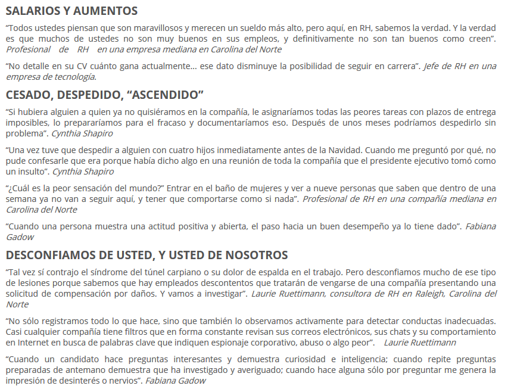
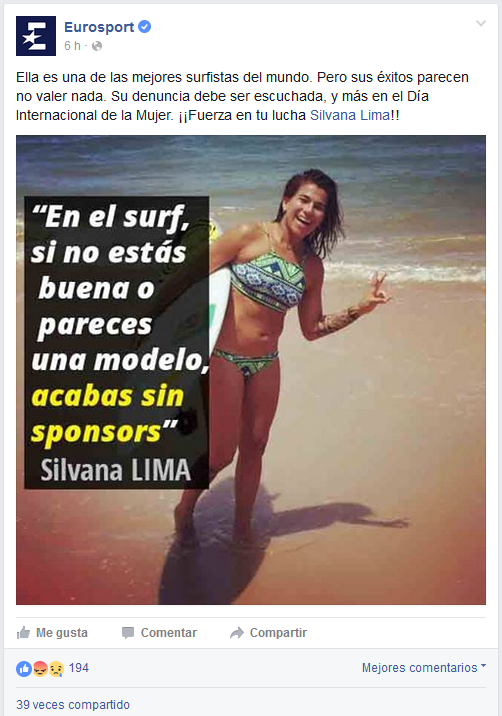

<!-- MarkdownTOC -->

- [Recursos Humanos](#recursos-humanos)
    - [RRHH Blogs](#rrhh-blogs)
    - [Orientacion laboral](#orientacion-laboral)
    - [Articulos](#articulos)

<!-- /MarkdownTOC -->

# Recursos Humanos
## RRHH Blogs
- [elblogderrhh.com](http://www.elblogderrhh.com/)
- [equiposytalento.com](http://www.equiposytalento.com/)
- [RRHH Press - Actualidad y noticias sobre recursos humanos, RRHH, laboral y empleo](http://www.rrhhpress.com)
- [orientacion-laboral.infojobs.net](https://orientacion-laboral.infojobs.net)

## Orientacion laboral
- [orientacion-laboral.infojobs.net](https://orientacion-laboral.infojobs.net)
    - [Webinar | Cómo enamorar a tu seleccionador](https://orientacion-laboral.infojobs.net/webinar-como-enamorar-al-seleccionador)
    - [Encontrar trabajo por enchufe o por recomendación 🌟](https://orientacion-laboral.infojobs.net/encontrar-trabajo-recomendacion)
- [¿Os habéis arrepentido en alguna ocasión de no preguntar determinadas cosas en la entrevista de trabajo?](http://www.elblogderrhh.com/2011/02/%C2%BFos-habeis-arrepentido-en-alguna-ocasion-de-no-preguntar-determinadas-cosas-en-la-entrevista-de-trabajo.html)
- [Los sueldos informáticos en Europa](http://www.think-progress.com/es/blog/posts/los-sueldos-informaticos-en-europa/)

<blockquote class="twitter-tweet tw-align-center" data-lang="es">
El enchufe como síntoma de un país estancado  <a href="https://t.co/mFIweLJLX9">https://t.co/mFIweLJLX9</a> Blog de <a href="https://twitter.com/jotaicabrera">@jotaicabrera</a> <a href="https://t.co/fRjzg0WPCr">pic.twitter.com/fRjzg0WPCr</a>
&mdash; El Huffington Post (@ElHuffPost) <a href="https://twitter.com/ElHuffPost/status/704276216514269184">29 de febrero de 2016</a></blockquote>

<blockquote class="twitter-tweet tw-align-center" data-lang="es">
Entrepreneurs shouldn&#39;t cry (in public), <a href="https://twitter.com/peterpeele">@peterpeele</a> quotes Gordon Gekko from Wall Street: Money Never Sleeps <a href="https://t.co/KKj3CMNTRP">https://t.co/KKj3CMNTRP</a>
&mdash; iAfrikan (@iafrikan) <a href="https://twitter.com/iafrikan/status/697137202728472577">9 de febrero de 2016</a></blockquote>

<iframe width="560" height="315" src="https://www.youtube.com/embed/jLfmBSJkFxo?rel=0" frameborder="0" allowfullscreen class="video"></iframe>

 

<iframe width="420" height="315" src="https://www.youtube.com/embed/EW95UA11dY4?rel=0" frameborder="0" allowfullscreen class="video"></iframe>

 

## Articulos
- [¿Soy imprescindible en mi puesto de trabajo?](http://www.elblogderrhh.com/2008/04/soy-imprescindible-en-mi-puesto-de.html)
- [Buen jefe, mal jefe (Spanish Edition)](http://www.amazon.com/dp/0307882934/)
- [El jefe de RRHH de Google es tajante: "El expediente académico no sirve para nada"](http://www.elconfidencial.com/alma-corazon-vida/2013-06-28/el-expediente-academico-no-sirve-para-nada-asegura-el-responsable-de-rrhh-de-google_501910/)
- [Nepotismo y amiguismo: lo bueno y lo malo de los favores en el trabajo 🌟](http://www.bbc.com/mundo/noticias/2015/10/151011_vert_cap_nepotismo_en_empreas_yv)
- [Amiguismo](https://es.wikipedia.org/wiki/Amiguismo)
- [Spanish Beautynomics o Cómo usted puede llegar a verse sin empleo](http://www.gurusblog.com/archives/spanish-beautynomics-o-como-usted-puede-llegar-a-verse-sin-empleo/30/11/2015/)
- [9 cosas que hacen los jefes que obligan a renunciar](http://www.soyentrepreneur.com/29403-9-cosas-que-hacen-los-jefes-que-obligan-a-renunciar.html)
- [30 características de una empresa con fuerte cultura de innovación. ¿Cuántas cumples?](http://www.sociedaddelainnovacion.es/30-caracteristicas-de-una-empresa-con-fuerte-cultura-de-innovacion-cuantas-cumples/)
- [Procura no cabrear a tu jefe](https://balcon40.com/2016/02/07/procura-no-cabrear-a-tu-jefe/)
- [Porqué las empresas deberían facilitar la conciliación de la vida laboral y personal](https://balcon40.com/2016/02/10/porque-las-empresas-deberian-facilitar-la-conciliacion-de-la-vida-laboral-y-personal/)
- [Acoso laboral 🌟](https://es.wikipedia.org/wiki/Acoso_laboral)
- [El jefe tóxico, cuando el responsable del mal ambiente en la empresa es el que manda](http://www.pymesyautonomos.com/management/el-jefe-toxico-cuando-el-responsable-del-mal-ambiente-en-la-empresa-es-el-que-manda)
- [neupic.com: El paro. El «enemigo» en casa 🌟](https://neupic.com/articles/el-paro-el-enemigo-en-casa) 
- [6 estilos de liderazgo empresarial](http://blog.fuerzacomercial.es/6-estilos-de-liderazgo-empresarial/)
- [¿Es bueno tener equipos estables? (vamos, que no rote constantemente la gente)](http://www.javiergarzas.com/2015/09/es-bueno-tener-equipos-estables-vamos-que-no-rote-constantemente-la-gente.html)
- [El oscuro secreto del proceso de selección 🌟](http://zumodeempleo.com/el-oscuro-secreto-del-proceso-de-seleccion/)
- [Las denuncias por cesión ilegal de empleados caen por miedo al despido](http://ccaa.elpais.com/ccaa/2015/01/10/catalunya/1420916172_146008.html)
- [elmundo.es: Trabajar de informático ya no es lo que era 🌟](http://www.elmundo.es/tecnologia/2014/05/17/5375ce54268e3edb7a8b456d.html)
    - [Ser informático ya no es lo que era](http://www.readwriteweb.es/ser-informatico/)
    - [nubelo.com: Las empresas TIC y el BodyShopping en España](http://www.nubelo.com/blog/las-empresas-tic-bodyshopping-espana/)
- [¿Qué dificultad tienen las distintas carreras universitarias según los propios estudiantes?](http://www.dudasbecasmec.com/2016/02/que-dificultad-tienen-las-distintas.html)
- [forbes.es: Antes de aceptar una oferta de empleo, piensa en estas seis cosas](http://www.forbes.es/actualizacion/5381/antes-de-aceptar-una-oferta-de-empleo-piensa-en-estas-seis-cosas)
- [La sombra de las entrevistas de trabajo es alargada 🌟](http://yoriento.com/2010/03/la-sombra-de-las-entrevistas-de-trabajo-es-alargada-685.html/)
- [30 preguntas para hacer y evitar en una entrevista de trabajo 🌟](http://www.forbes.com.mx/30-preguntas-para-hacer-y-evitar-en-una-entrevista-de-trabajo/)
- [Cómo lidiar con las malas referencias](http://es.wikihow.com/lidiar-con-las-malas-referencias)
    - [Mi antiguo jefe habla mal de mí](http://www.cnnexpansion.com/mi-carrera/2009/12/18/mi-antiguo-jefe-habla-mal-de-mi)
    - [Cómo se gestionan las malas referencias](http://www.expansion.com/2012/11/30/empleo/desarrollo-de-carrera/1354301718.html)
    - [Problemas legales por dar malas referencias laborales](http://www.ehowenespanol.com/problemas-legales-dar-malas-referencias-laborales-info_406759/)
    - [seniorm.com: Cómo librarse de una mala referencia laboral](http://www.seniorm.com/como-librarse-de-una-mala-referencia-laboral/)
- [yoriento.com: 10 verdades personales sobre los portales de empleo 🌟🌟](http://yoriento.com/2009/09/10-verdades-sobre-los-portales-de-empleo-602.html/)
- [xataka.com: Esto es lo que Google ha averiguado sobre por qué hay equipos de trabajo que fracasan y otros que funcionan](http://magnet.xataka.com/en-diez-minutos/esto-es-lo-que-google-ha-averiguado-sobre-por-que-hay-equipos-de-trabajo-que-fracasan-y-otros-que-funcionan)
- [eleconomista.es: ¿Por qué no te contratan si eres el candidato perfecto?](http://www.eleconomista.es/emprendedores-pymes/noticias/6784455/06/15/Por-que-no-te-contratan-si-eres-el-candidato-perfecto.html)
- [eleconomista.es: Hacer la pelota al jefe es malo para el negocio, dicen expertos](http://www.eleconomista.es/mercados-cotizaciones/noticias/1165153/04/09/Hacer-la-pelota-al-jefe-es-malo-para-el-negocio-dicen-expertos.html)
- [elconfidencial.com: Las prácticas de las empresas asiáticas en Europa (y se parecen mucho a las chinas)](http://www.elconfidencial.com/alma-corazon-vida/2016-03-01/las-practicas-de-las-empresas-asiaticas-en-europa-y-se-parece-mucho-a-china_1161447/) 
- [kartcsainz.com: 10 claves para mejorar el ambiente laboral](http://www.kartcsainz.com/es/noticia/10-claves-para-mejorar-el-ambiente-laboral)
- [Qué hacer si tu mentor bloquea tu carrera profesional](http://www.expansion.com/emprendedores-empleo/desarrollo-carrera/2016/03/03/56d883bd268e3ed7138b45c6.html)
- [¿Por qué no se fomenta más el teletrabajo? 🌟](https://balcon40.com/2015/09/10/por-que-no-se-fomenta-mas-el-teletrabajo/)
- [Sólo el 27% de las empresas españolas apuesta por el teletrabajo](http://www.computerworld.es/tendencias/solo-el-27-de-las-empresas-espanolas-apuesta-por-el-teletrabajo)
- [Comprando un Maserati 🌟](https://www.linkedin.com/pulse/comprando-un-maserati-frank-hidalgo-gato-dur%C3%A1n)
- [Lo que el personal de Recursos Humanos nunca te confesará](https://ar.selecciones.com/contenido/a2869_lo-que-el-personal-de-recursos-humanos-nunca-te-confesara)
- [9 formas con éxito seguro de destruir la moral del empleado](http://www.rrhhsocialmedia.com/9-formas-con-exito-seguro-de-destruir-la-moral-del-empleado/)

<iframe width="560" height="315" src="https://www.youtube.com/embed/OcKF2V4yZyE?rel=0" frameborder="0" allowfullscreen class="video"></iframe>

 

<blockquote class="twitter-tweet tw-align-center" data-lang="es">
Sólo el 27% de las empresas españolas apuesta por el teletrabajo: El bajo rendimiento de las conexiones remota... <a href="https://t.co/8nqDW1b9hg">https://t.co/8nqDW1b9hg</a>
&mdash; ColegioOficialTeleco (@COGITTCV) <a href="https://twitter.com/COGITTCV/status/705780579178934274">4 de marzo de 2016</a></blockquote>

<blockquote class="twitter-tweet tw-align-center" data-lang="es">
El periodo de prueba en el contrato <a href="https://twitter.com/hashtag/laboral?src=hash">#laboral</a> .Derechos del trabajador y la empresa. Prestaciones por desempleo <a href="https://t.co/nWF0Xj1BKn">https://t.co/nWF0Xj1BKn</a>
&mdash; citapreviainem (@citapreviainem) <a href="https://twitter.com/citapreviainem/status/702040241377570816">23 de febrero de 2016</a></blockquote>

<blockquote class="twitter-tweet tw-align-center" data-lang="es">
Cómo buscar trabajo con <a href="https://twitter.com/hashtag/Linkedin?src=hash">#Linkedin</a>. Consejos de Manuel Moreno .<a href="https://twitter.com/TreceBits">@TreceBits</a> <a href="https://t.co/JZOgVW4HPT">https://t.co/JZOgVW4HPT</a> <a href="https://twitter.com/rtve">@rtve</a> <a href="https://twitter.com/la2_tve">@La2_tve</a>
&mdash; A punto con La 2 (@apuntoconLa2) <a href="https://twitter.com/apuntoconLa2/status/702557608520056832">febrero 24, 2016</a></blockquote>

<blockquote class="twitter-tweet tw-align-center" data-lang="es">
Las crisis 2.0¿Cómo solucionar una metedura de pata en las redes sociales,qué NO hacer nunca? Lo cuenta .<a href="https://twitter.com/TreceBits">@TreceBits</a> <a href="https://t.co/tUAsmmH0Tp">https://t.co/tUAsmmH0Tp</a>
&mdash; A punto con La 2 (@apuntoconLa2) <a href="https://twitter.com/apuntoconLa2/status/705727435862634496">marzo 4, 2016</a></blockquote>

<blockquote class="twitter-tweet tw-align-center" data-lang="es">
CUIDAdo. El hábito de ser mejor persona! <a href="https://twitter.com/apuntoconLa2">@apuntoconLa2</a> Gracias <a href="https://twitter.com/Patri_Psicologa">@Patri_Psicologa</a> por tu lección <a href="https://twitter.com/hashtag/habitos?src=hash">#habitos</a> <a href="https://twitter.com/hashtag/saludables?src=hash">#saludables</a> <a href="https://t.co/xIYnPLIvxp">pic.twitter.com/xIYnPLIvxp</a>
&mdash; Elisabet Carnicé (@EliCarnice) <a href="https://twitter.com/EliCarnice/status/704334220194349056">febrero 29, 2016</a></blockquote>

<iframe width="560" height="315" src="https://www.youtube.com/embed/doR3s0bNB4o?rel=0" frameborder="0" allowfullscreen class="video"></iframe>

 

<iframe width="560" height="315" src="https://www.youtube.com/embed/stHAVegvUhQ?rel=0" frameborder="0" allowfullscreen class="video"></iframe>

 

<iframe width="560" height="315" src="https://www.youtube.com/embed/JWe829Jjlao?rel=0" frameborder="0" allowfullscreen class="video"></iframe>

 

<blockquote class="twitter-tweet tw-align-center" data-lang="es">
Recursos humanos - Corto sobre mobbing. <a href="https://twitter.com/hashtag/RRHH?src=hash">#RRHH</a> <a href="https://twitter.com/hashtag/EMPLEO?src=hash">#EMPLEO</a> <a href="https://twitter.com/hashtag/TRABAJO?src=hash">#TRABAJO</a> <a href="https://twitter.com/hashtag/CV?src=hash">#CV</a> <a href="https://twitter.com/hashtag/LEGALES?src=hash">#LEGALES</a> <a href="https://t.co/wowq6AULrE">https://t.co/wowq6AULrE</a>
&mdash; MOTTECLA (@ClaudiaMottet) <a href="https://twitter.com/ClaudiaMottet/status/693207648846663681">29 de enero de 2016</a></blockquote>

<blockquote class="twitter-tweet tw-align-center" data-lang="es">
He añadido un vídeo a una lista de reproducción de <a href="https://twitter.com/YouTube">@YouTube</a> (<a href="http://t.co/d8RpLl0eyj">http://t.co/d8RpLl0eyj</a> - Entrevista laboral-Real como la vida misma).
&mdash; orientalan (@orientalan) <a href="https://twitter.com/orientalan/status/572374674656477185">2 de marzo de 2015</a></blockquote>

<blockquote class="twitter-tweet tw-align-center" data-lang="es">
Draghi &quot;El mercado laboral protege a los veteranos y perjudica a los jóvenes&quot; <a href="https://t.co/4VFUqwMfjo">https://t.co/4VFUqwMfjo</a> <a href="https://t.co/vXeP0poboX">pic.twitter.com/vXeP0poboX</a>
&mdash; elEconomista.es (@elEconomistaes) <a href="https://twitter.com/elEconomistaes/status/708273641885192192">11 de marzo de 2016</a></blockquote>

<blockquote class="twitter-tweet tw-align-center" data-lang="es">
Mientras tanto, en una manifestación de Informáticos... <a href="http://t.co/V1SnNsGbNX">pic.twitter.com/V1SnNsGbNX</a>
&mdash; El Amigo Informático (@E1Am1g01nf0rma1) <a href="https://twitter.com/E1Am1g01nf0rma1/status/621432877385928704">15 de julio de 2015</a></blockquote>

<blockquote class="twitter-tweet tw-align-center" data-lang="es">
Video humorístico sobre Coaching (&quot;Cámera Café&quot;) <a href="https://t.co/ewvHzFmc3T">https://t.co/ewvHzFmc3T</a>
&mdash; Alberto Barbero (@Albarbero) <a href="https://twitter.com/Albarbero/status/706747489626537984">7 de marzo de 2016</a></blockquote>

<blockquote class="twitter-tweet tw-align-center" data-lang="es">
Camera Café La entrevista <a href="http://t.co/UbXMUIRtnn">http://t.co/UbXMUIRtnn</a> vía <a href="https://twitter.com/YouTube">@youtube</a>
&mdash; Carlos de Olagüe Sm. (@carlosdeolague) <a href="https://twitter.com/carlosdeolague/status/431917076580536320">7 de febrero de 2014</a></blockquote>

