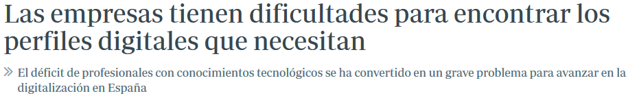
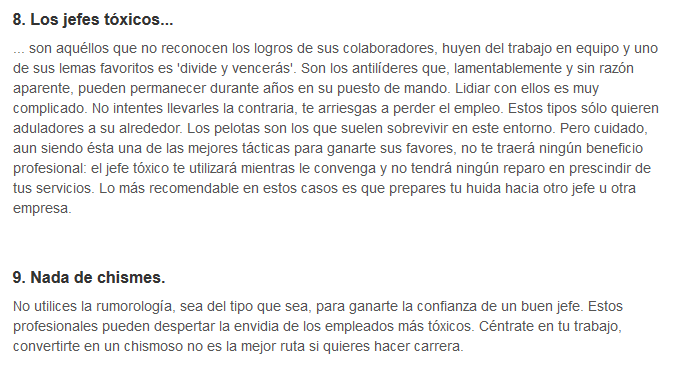
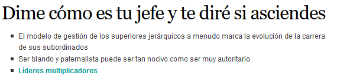
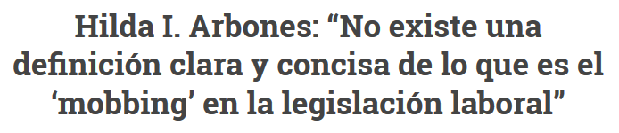
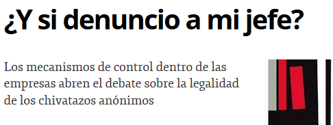

<!-- MarkdownTOC -->

- [Recursos Humanos](#recursos-humanos)
    - [RRHH Blogs](#rrhh-blogs)
    - [Orientacion laboral](#orientacion-laboral)
    - [Articulos](#articulos)

<!-- /MarkdownTOC -->

<blockquote class="twitter-tweet tw-align-center" data-lang="es">
Las empresas no contratan conocimiento: contratan personalidades by <a href="https://twitter.com/ZumoDeEmpleo">@ZumoDeEmpleo</a> <a href="https://t.co/OWWmzu9zpW">https://t.co/OWWmzu9zpW</a> <a href="https://twitter.com/hashtag/trabajo?src=hash">#trabajo</a> <a href="https://t.co/TDFjWDyVT9">pic.twitter.com/TDFjWDyVT9</a>
&mdash; Nilton Navarro (@NiltonNavarro) <a href="https://twitter.com/NiltonNavarro/status/712675612142526464">23 de marzo de 2016</a></blockquote>

# Recursos Humanos
## RRHH Blogs
- [elblogderrhh.com](http://www.elblogderrhh.com/)
- [equiposytalento.com](http://www.equiposytalento.com/)
- [RRHH Press - Actualidad y noticias sobre recursos humanos, RRHH, laboral y empleo](http://www.rrhhpress.com)
- [orientacion-laboral.infojobs.net](https://orientacion-laboral.infojobs.net)

## Orientacion laboral
- [orientacion-laboral.infojobs.net](https://orientacion-laboral.infojobs.net)
    - [Webinar | Cómo enamorar a tu seleccionador](https://orientacion-laboral.infojobs.net/webinar-como-enamorar-al-seleccionador)
    - [Encontrar trabajo por enchufe o por recomendación 🌟](https://orientacion-laboral.infojobs.net/encontrar-trabajo-recomendacion)
- [¿Os habéis arrepentido en alguna ocasión de no preguntar determinadas cosas en la entrevista de trabajo?](http://www.elblogderrhh.com/2011/02/%C2%BFos-habeis-arrepentido-en-alguna-ocasion-de-no-preguntar-determinadas-cosas-en-la-entrevista-de-trabajo.html)
- [Los sueldos informáticos en Europa](http://www.think-progress.com/es/blog/posts/los-sueldos-informaticos-en-europa/)

<blockquote class="twitter-tweet tw-align-center" data-lang="es">
El enchufe como síntoma de un país estancado  <a href="https://t.co/mFIweLJLX9">https://t.co/mFIweLJLX9</a> Blog de <a href="https://twitter.com/jotaicabrera">@jotaicabrera</a> <a href="https://t.co/fRjzg0WPCr">pic.twitter.com/fRjzg0WPCr</a>
&mdash; El Huffington Post (@ElHuffPost) <a href="https://twitter.com/ElHuffPost/status/704276216514269184">29 de febrero de 2016</a></blockquote>

<blockquote class="twitter-tweet tw-align-center" data-lang="es">
El indeseable resurgir del enchufe en el mundo laboral: <a href="http://t.co/KsTzPqOD4c">http://t.co/KsTzPqOD4c</a> Enchufados. Ya tiene su tiempo, pero merece la pena leerlo.
&mdash; No conosco (@Noconozco) <a href="https://twitter.com/Noconozco/status/466141188316090368">13 de mayo de 2014</a></blockquote>

<blockquote class="twitter-tweet tw-align-center" data-lang="es">
Encontrar trabajo por enchufe o por recomendación por <a href="https://twitter.com/monicaventas">@monicaventas</a> <a href="https://t.co/s9At0WiNX5">https://t.co/s9At0WiNX5</a> <a href="https://t.co/teuE1hgkjJ">pic.twitter.com/teuE1hgkjJ</a>
&mdash; InfoJobs (@InfoJobs) <a href="https://twitter.com/InfoJobs/status/705441505650085888">3 de marzo de 2016</a></blockquote>

<blockquote class="twitter-tweet tw-align-center" data-lang="es">
El enchufe, la forma preferida de encontrar trabajo para los españoles. Lo decíamos en <a href="https://t.co/80MntaJqfF">https://t.co/80MntaJqfF</a> <a href="https://t.co/yOPabzuN5K">pic.twitter.com/yOPabzuN5K</a>
&mdash; Roberto García Esteb (@72rge) <a href="https://twitter.com/72rge/status/743164822649462784">15 de junio de 2016</a></blockquote>

<blockquote class="twitter-tweet tw-align-center" data-lang="es">
Debemos recordar que las referencias laborales se consiguen dejando un legado <a href="https://twitter.com/hashtag/PwC?src=hash">#PwC</a> <a href="https://t.co/hZMuoqt5gm">pic.twitter.com/hZMuoqt5gm</a>
&mdash; PwC Ecuador (@Pwc_Ecuador) <a href="https://twitter.com/Pwc_Ecuador/status/712721107321757696">23 de marzo de 2016</a></blockquote>

<blockquote class="twitter-tweet tw-align-center" data-lang="es">
5 recomendaciones para mejorar la selección de personal en las <a href="https://twitter.com/hashtag/pymes?src=hash">#pymes</a> ➡ <a href="https://t.co/GrBuh2140F">https://t.co/GrBuh2140F</a> <a href="https://twitter.com/hashtag/rrhh?src=hash">#rrhh</a> <a href="https://t.co/NZ10KH0bEX">pic.twitter.com/NZ10KH0bEX</a>
&mdash; Movistar pymes (@Movistar_pymes) <a href="https://twitter.com/Movistar_pymes/status/709771540083171329">15 de marzo de 2016</a></blockquote>

<blockquote class="twitter-tweet tw-align-center" data-lang="es">
Las 10 claves para una comunicación altamente efectiva <a href="https://t.co/5hFUWCnH8S">https://t.co/5hFUWCnH8S</a>
&mdash; Álvaro López (@Autorrealizarte) <a href="https://twitter.com/Autorrealizarte/status/710079879870619648">16 de marzo de 2016</a></blockquote>

<blockquote class="twitter-tweet tw-align-center" data-lang="es">
Entrepreneurs shouldn&#39;t cry (in public), <a href="https://twitter.com/peterpeele">@peterpeele</a> quotes Gordon Gekko from Wall Street: Money Never Sleeps <a href="https://t.co/KKj3CMNTRP">https://t.co/KKj3CMNTRP</a>
&mdash; iAfrikan (@iafrikan) <a href="https://twitter.com/iafrikan/status/697137202728472577">9 de febrero de 2016</a></blockquote>

<blockquote class="twitter-tweet tw-align-center" data-lang="es">
El plan B: el primer paso para dejar un trabajo frustrante <a href="https://t.co/GnhEuUlbSd">https://t.co/GnhEuUlbSd</a>
&mdash; Álvaro López (@Autorrealizarte) <a href="https://twitter.com/Autorrealizarte/status/714455041671892992">28 de marzo de 2016</a></blockquote>

<blockquote class="twitter-tweet tw-align-center" data-lang="es">
El reclutamiento 2.0 cada vez tiene mayor peso en el mercado laboral ➡  <a href="https://t.co/tp0t2PfKXX">https://t.co/tp0t2PfKXX</a> <a href="https://twitter.com/alidiazsan">@alidiazsan</a> <a href="https://twitter.com/hashtag/RedesSocialesCyL?src=hash">#RedesSocialesCyL</a>
&mdash; Movistar pymes (@Movistar_pymes) <a href="https://twitter.com/Movistar_pymes/status/743171501248094208">15 de junio de 2016</a></blockquote>

<blockquote class="twitter-tweet tw-align-center" data-lang="es">
¿Qué nos impulsa a cambiar de <a href="https://twitter.com/hashtag/trabajo?src=hash">#trabajo</a>? <a href="https://twitter.com/hashtag/InformeInfoempleoAdecco?src=hash">#InformeInfoempleoAdecco</a> <a href="https://t.co/udZXQhQwxd">https://t.co/udZXQhQwxd</a> <a href="https://twitter.com/adecco_es">@adecco_es</a> <a href="https://twitter.com/hashtag/empleo?src=hash">#empleo</a> <a href="https://twitter.com/hashtag/rrhh?src=hash">#rrhh</a> <a href="https://t.co/iGqE5TWTjX">pic.twitter.com/iGqE5TWTjX</a>
&mdash; Infoempleo (@Infoempleo) <a href="https://twitter.com/Infoempleo/status/741955868514779136">12 de junio de 2016</a></blockquote>

<blockquote class="twitter-tweet tw-align-center" data-lang="es">
Claves sobre el periodo de prueba en los <a href="https://twitter.com/hashtag/contratos?src=hash">#contratos</a> de <a href="https://twitter.com/hashtag/trabajo?src=hash">#trabajo</a> <a href="https://t.co/LD2lkEml3Q">https://t.co/LD2lkEml3Q</a>
&mdash; citapreviainem (@citapreviainem) <a href="https://twitter.com/citapreviainem/status/741623737196253186">11 de junio de 2016</a></blockquote>

<iframe width="560" height="315" src="https://www.youtube.com/embed/jLfmBSJkFxo?rel=0" frameborder="0" allowfullscreen class="video"></iframe>

 

<iframe width="420" height="315" src="https://www.youtube.com/embed/EW95UA11dY4?rel=0" frameborder="0" allowfullscreen class="video"></iframe>

 

<iframe src="https://player.vimeo.com/video/75851557?byline=0&portrait=0" width="500" height="281" frameborder="0" webkitallowfullscreen mozallowfullscreen allowfullscreen class="video"></iframe>

<a href="https://vimeo.com/75851557">En el castillo. Cortometraje V.O. E.</a> from <a href="https://vimeo.com/lunatic">Lunatic Visual Studio</a> on <a href="https://vimeo.com">Vimeo</a>.

 

<iframe src="//www.slideshare.net/slideshow/embed_code/key/4atvnC0Lw1vmFS" width="595" height="485" frameborder="0" marginwidth="0" marginheight="0" scrolling="no" style="border:1px solid #CCC; border-width:1px; margin-bottom:5px; max-width: 100%;" allowfullscreen class="video"> </iframe> 
 <strong> <a href="//www.slideshare.net/CuauhtemocReyes/desarrollo-y-profesionalizacin-de-los-mandos-medios" title="Desarrollo y profesionalización de los mandos medios " target="_blank">Desarrollo y profesionalización de los mandos medios </a> </strong> from <strong><a href="//www.slideshare.net/CuauhtemocReyes" target="_blank">CuauhtemocReyes</a></strong> 

 

<iframe src="//www.slideshare.net/slideshow/embed_code/key/gak1aN7qyTPP0p" width="595" height="485" frameborder="0" marginwidth="0" marginheight="0" scrolling="no" style="border:1px solid #CCC; border-width:1px; margin-bottom:5px; max-width: 100%;" allowfullscreen class="video"> </iframe> 
 <strong> <a href="//www.slideshare.net/cacsasa/seminario-mandos-medios-cacsa" title="Seminario mandos medios CACSA" target="_blank">Seminario mandos medios CACSA</a> </strong> from <strong><a href="//www.slideshare.net/cacsasa" target="_blank">Javier Alma</a></strong> 

 

## Articulos
- [¿Soy imprescindible en mi puesto de trabajo?](http://www.elblogderrhh.com/2008/04/soy-imprescindible-en-mi-puesto-de.html)
- [Buen jefe, mal jefe (Spanish Edition)](http://www.amazon.com/dp/0307882934/)
- [El jefe de RRHH de Google es tajante: "El expediente académico no sirve para nada"](http://www.elconfidencial.com/alma-corazon-vida/2013-06-28/el-expediente-academico-no-sirve-para-nada-asegura-el-responsable-de-rrhh-de-google_501910/)
- [Nepotismo y amiguismo: lo bueno y lo malo de los favores en el trabajo 🌟](http://www.bbc.com/mundo/noticias/2015/10/151011_vert_cap_nepotismo_en_empreas_yv)
- [Amiguismo](https://es.wikipedia.org/wiki/Amiguismo)
- [Spanish Beautynomics o Cómo usted puede llegar a verse sin empleo](http://www.gurusblog.com/archives/spanish-beautynomics-o-como-usted-puede-llegar-a-verse-sin-empleo/30/11/2015/)
- [9 cosas que hacen los jefes que obligan a renunciar](http://www.soyentrepreneur.com/29403-9-cosas-que-hacen-los-jefes-que-obligan-a-renunciar.html)
- [30 características de una empresa con fuerte cultura de innovación. ¿Cuántas cumples?](http://www.sociedaddelainnovacion.es/30-caracteristicas-de-una-empresa-con-fuerte-cultura-de-innovacion-cuantas-cumples/)
- [Procura no cabrear a tu jefe](https://balcon40.com/2016/02/07/procura-no-cabrear-a-tu-jefe/)
- [Porqué las empresas deberían facilitar la conciliación de la vida laboral y personal](https://balcon40.com/2016/02/10/porque-las-empresas-deberian-facilitar-la-conciliacion-de-la-vida-laboral-y-personal/)
- [Acoso laboral 🌟](https://es.wikipedia.org/wiki/Acoso_laboral)
- [El jefe tóxico, cuando el responsable del mal ambiente en la empresa es el que manda](http://www.pymesyautonomos.com/management/el-jefe-toxico-cuando-el-responsable-del-mal-ambiente-en-la-empresa-es-el-que-manda)
- [neupic.com: El paro. El «enemigo» en casa 🌟](https://neupic.com/articles/el-paro-el-enemigo-en-casa) 
- [6 estilos de liderazgo empresarial](http://blog.fuerzacomercial.es/6-estilos-de-liderazgo-empresarial/)
- [¿Es bueno tener equipos estables? (vamos, que no rote constantemente la gente)](http://www.javiergarzas.com/2015/09/es-bueno-tener-equipos-estables-vamos-que-no-rote-constantemente-la-gente.html)
- [El oscuro secreto del proceso de selección 🌟](http://zumodeempleo.com/el-oscuro-secreto-del-proceso-de-seleccion/)
- [Las denuncias por cesión ilegal de empleados caen por miedo al despido](http://ccaa.elpais.com/ccaa/2015/01/10/catalunya/1420916172_146008.html)
- [elmundo.es: Trabajar de informático ya no es lo que era 🌟](http://www.elmundo.es/tecnologia/2014/05/17/5375ce54268e3edb7a8b456d.html)
    - [Ser informático ya no es lo que era](http://www.readwriteweb.es/ser-informatico/)
    - [nubelo.com: Las empresas TIC y el BodyShopping en España](http://www.nubelo.com/blog/las-empresas-tic-bodyshopping-espana/)
- [¿Qué dificultad tienen las distintas carreras universitarias según los propios estudiantes?](http://www.dudasbecasmec.com/2016/02/que-dificultad-tienen-las-distintas.html)
- [forbes.es: Antes de aceptar una oferta de empleo, piensa en estas seis cosas](http://www.forbes.es/actualizacion/5381/antes-de-aceptar-una-oferta-de-empleo-piensa-en-estas-seis-cosas)
- [La sombra de las entrevistas de trabajo es alargada 🌟](http://yoriento.com/2010/03/la-sombra-de-las-entrevistas-de-trabajo-es-alargada-685.html/)
- [Las preguntas ilegales en una entrevista de trabajo, ¡combátelas!](http://blog.jobandtalent.com/preguntas-ilegales-entrevista-trabajo-combatelas/)
- [30 preguntas para hacer y evitar en una entrevista de trabajo 🌟](http://www.forbes.com.mx/30-preguntas-para-hacer-y-evitar-en-una-entrevista-de-trabajo/)
- [Cómo lidiar con las malas referencias](http://es.wikihow.com/lidiar-con-las-malas-referencias)
    - [Mi antiguo jefe habla mal de mí](http://www.cnnexpansion.com/mi-carrera/2009/12/18/mi-antiguo-jefe-habla-mal-de-mi)
    - [Cómo se gestionan las malas referencias](http://www.expansion.com/2012/11/30/empleo/desarrollo-de-carrera/1354301718.html)
    - [Problemas legales por dar malas referencias laborales](http://www.ehowenespanol.com/problemas-legales-dar-malas-referencias-laborales-info_406759/)
    - [seniorm.com: Cómo librarse de una mala referencia laboral](http://www.seniorm.com/como-librarse-de-una-mala-referencia-laboral/)
- [yoriento.com: 10 verdades personales sobre los portales de empleo 🌟🌟](http://yoriento.com/2009/09/10-verdades-sobre-los-portales-de-empleo-602.html/)
- [xataka.com: Esto es lo que Google ha averiguado sobre por qué hay equipos de trabajo que fracasan y otros que funcionan](http://magnet.xataka.com/en-diez-minutos/esto-es-lo-que-google-ha-averiguado-sobre-por-que-hay-equipos-de-trabajo-que-fracasan-y-otros-que-funcionan)
- [eleconomista.es: ¿Por qué no te contratan si eres el candidato perfecto?](http://www.eleconomista.es/emprendedores-pymes/noticias/6784455/06/15/Por-que-no-te-contratan-si-eres-el-candidato-perfecto.html)
- [eleconomista.es: Hacer la pelota al jefe es malo para el negocio, dicen expertos](http://www.eleconomista.es/mercados-cotizaciones/noticias/1165153/04/09/Hacer-la-pelota-al-jefe-es-malo-para-el-negocio-dicen-expertos.html)
- [elconfidencial.com: Las prácticas de las empresas asiáticas en Europa (y se parecen mucho a las chinas)](http://www.elconfidencial.com/alma-corazon-vida/2016-03-01/las-practicas-de-las-empresas-asiaticas-en-europa-y-se-parece-mucho-a-china_1161447/) 
- [kartcsainz.com: 10 claves para mejorar el ambiente laboral](http://www.kartcsainz.com/es/noticia/10-claves-para-mejorar-el-ambiente-laboral)
- [Qué hacer si tu mentor bloquea tu carrera profesional](http://www.expansion.com/emprendedores-empleo/desarrollo-carrera/2016/03/03/56d883bd268e3ed7138b45c6.html)
- [¿Por qué no se fomenta más el teletrabajo? 🌟](https://balcon40.com/2015/09/10/por-que-no-se-fomenta-mas-el-teletrabajo/)
- [Sólo el 27% de las empresas españolas apuesta por el teletrabajo](http://www.computerworld.es/tendencias/solo-el-27-de-las-empresas-espanolas-apuesta-por-el-teletrabajo)
- [Comprando un Maserati 🌟](https://www.linkedin.com/pulse/comprando-un-maserati-frank-hidalgo-gato-dur%C3%A1n)
- [Lo que el personal de Recursos Humanos nunca te confesará](https://ar.selecciones.com/contenido/a2869_lo-que-el-personal-de-recursos-humanos-nunca-te-confesara)
- [9 formas con éxito seguro de destruir la moral del empleado](http://www.rrhhsocialmedia.com/9-formas-con-exito-seguro-de-destruir-la-moral-del-empleado/)
- [Expectativas salariales, la pregunta del millón](http://ventajaprofesional.com/blog-ventaja-profesional/expectativas-salariales-pregunta-del-millon/)
- [Peligro: Hay un trepa en mi trabajo](https://balcon40.com/2016/04/11/peligro-hay-un-trepa-en-mi-trabajo/)
- [Prohibido salir tarde del trabajo](https://www.cesarpiqueras.com/prohibido-salir-tarde-del-trabajo/)
- [El coste económico de los “empleados tóxicos”](http://www.elblogsalmon.com/mundo-laboral/el-coste-economico-de-los-empleados-toxicos)

<a href="https://www.meneame.net/story/coste-economico-empleados-toxicos">meneame.net: El coste económico de los “empleados tóxicos”</a>

<iframe width="560" height="315" src="https://www.youtube.com/embed/OcKF2V4yZyE?rel=0" frameborder="0" allowfullscreen class="video"></iframe>

 

<blockquote class="twitter-tweet tw-align-center" data-lang="es">
Hábitos que afean tu condición de <a href="https://twitter.com/hashtag/jefe?src=hash">#jefe</a> ➡ <a href="https://t.co/zM28FbaWrH">https://t.co/zM28FbaWrH</a> por <a href="https://twitter.com/raulalonsoenred">@raulAlonsoenred</a>
&mdash; Movistar pymes (@Movistar_pymes) <a href="https://twitter.com/Movistar_pymes/status/711507895146385409">20 de marzo de 2016</a></blockquote>

<blockquote class="twitter-tweet tw-align-center" data-lang="es">
Organizaciones basadas en el <a href="https://twitter.com/hashtag/aprendizaje?src=hash">#aprendizaje</a> ➡ <a href="https://t.co/L79EWtkpdW">https://t.co/L79EWtkpdW</a> por <a href="https://twitter.com/Pablo_BlascoB">@Pablo_BlascoB</a>
&mdash; Movistar pymes (@Movistar_pymes) <a href="https://twitter.com/Movistar_pymes/status/711500186951016449">20 de marzo de 2016</a></blockquote>

<blockquote class="twitter-tweet tw-align-center" data-lang="es">
<a href="https://twitter.com/hashtag/infograf%C3%ADa?src=hash">#infografía</a>: Señales de mala actitud en el <a href="https://twitter.com/hashtag/trabajo?src=hash">#trabajo</a>, vía <a href="https://twitter.com/elcomercio">@elcomercio</a> <a href="https://t.co/TWWXa0eCTv">pic.twitter.com/TWWXa0eCTv</a>
&mdash; Movistar pymes (@Movistar_pymes) <a href="https://twitter.com/Movistar_pymes/status/716727049109520384">3 de abril de 2016</a></blockquote>

<blockquote class="twitter-tweet tw-align-center" data-lang="es">
“Una mala persona nunca llega a ser buen profesional” <a href="https://twitter.com/LluisAmiguet">@LluisAmiguet</a> entrevista a Howard Gardner. <a href="https://t.co/pR7UgEJU9W">https://t.co/pR7UgEJU9W</a>
&mdash; Roger Domingo (@RogerDomingo) <a href="https://twitter.com/RogerDomingo/status/719499895653199872">11 de abril de 2016</a></blockquote>

<blockquote class="twitter-tweet tw-align-center" data-lang="es">
Sólo el 27% de las empresas españolas apuesta por el teletrabajo: El bajo rendimiento de las conexiones remota... <a href="https://t.co/8nqDW1b9hg">https://t.co/8nqDW1b9hg</a>
&mdash; ColegioOficialTeleco (@COGITTCV) <a href="https://twitter.com/COGITTCV/status/705780579178934274">4 de marzo de 2016</a></blockquote>

<blockquote class="twitter-tweet tw-align-center" data-lang="es">
El periodo de prueba en el contrato <a href="https://twitter.com/hashtag/laboral?src=hash">#laboral</a> .Derechos del trabajador y la empresa. Prestaciones por desempleo <a href="https://t.co/nWF0Xj1BKn">https://t.co/nWF0Xj1BKn</a>
&mdash; citapreviainem (@citapreviainem) <a href="https://twitter.com/citapreviainem/status/702040241377570816">23 de febrero de 2016</a></blockquote>

<blockquote class="twitter-tweet tw-align-center" data-lang="es">
Cómo buscar trabajo con <a href="https://twitter.com/hashtag/Linkedin?src=hash">#Linkedin</a>. Consejos de Manuel Moreno .<a href="https://twitter.com/TreceBits">@TreceBits</a> <a href="https://t.co/JZOgVW4HPT">https://t.co/JZOgVW4HPT</a> <a href="https://twitter.com/rtve">@rtve</a> <a href="https://twitter.com/la2_tve">@La2_tve</a>
&mdash; A punto con La 2 (@apuntoconLa2) <a href="https://twitter.com/apuntoconLa2/status/702557608520056832">febrero 24, 2016</a></blockquote>

<blockquote class="twitter-tweet tw-align-center" data-lang="es">
Smart Tips <a href="https://twitter.com/hashtag/empleo?src=hash">#empleo</a> Expectativas salariales, la pregunta del millón <a href="https://t.co/ES2CrNBZlC">https://t.co/ES2CrNBZlC</a>
&mdash; MªJosé Vizcaíno (@VentProfesional) <a href="https://twitter.com/VentProfesional/status/706615881611112448">6 de marzo de 2016</a></blockquote>

<blockquote class="twitter-tweet tw-align-center" data-lang="es">
Las crisis 2.0¿Cómo solucionar una metedura de pata en las redes sociales,qué NO hacer nunca? Lo cuenta .<a href="https://twitter.com/TreceBits">@TreceBits</a> <a href="https://t.co/tUAsmmH0Tp">https://t.co/tUAsmmH0Tp</a>
&mdash; A punto con La 2 (@apuntoconLa2) <a href="https://twitter.com/apuntoconLa2/status/705727435862634496">marzo 4, 2016</a></blockquote>

<blockquote class="twitter-tweet tw-align-center" data-lang="es">
CUIDAdo. El hábito de ser mejor persona! <a href="https://twitter.com/apuntoconLa2">@apuntoconLa2</a> Gracias <a href="https://twitter.com/Patri_Psicologa">@Patri_Psicologa</a> por tu lección <a href="https://twitter.com/hashtag/habitos?src=hash">#habitos</a> <a href="https://twitter.com/hashtag/saludables?src=hash">#saludables</a> <a href="https://t.co/xIYnPLIvxp">pic.twitter.com/xIYnPLIvxp</a>
&mdash; Elisabet Carnicé (@EliCarnice) <a href="https://twitter.com/EliCarnice/status/704334220194349056">febrero 29, 2016</a></blockquote>

<iframe width="560" height="315" src="https://www.youtube.com/embed/doR3s0bNB4o?rel=0" frameborder="0" allowfullscreen class="video"></iframe>

 

<iframe width="560" height="315" src="https://www.youtube.com/embed/stHAVegvUhQ?rel=0" frameborder="0" allowfullscreen class="video"></iframe>

 

<iframe width="560" height="315" src="https://www.youtube.com/embed/JWe829Jjlao?rel=0" frameborder="0" allowfullscreen class="video"></iframe>

 

<iframe width="420" height="315" src="https://www.youtube.com/embed/s43IFGAYSa4?rel=0" frameborder="0" allowfullscreen class="video"></iframe>

 

<iframe width="560" height="315" src="https://www.youtube.com/embed/FQqo-w1qvws?rel=0" frameborder="0" allowfullscreen class="video"></iframe>

 

<blockquote class="twitter-tweet tw-align-center" data-lang="es">
Recursos humanos - Corto sobre mobbing. <a href="https://twitter.com/hashtag/RRHH?src=hash">#RRHH</a> <a href="https://twitter.com/hashtag/EMPLEO?src=hash">#EMPLEO</a> <a href="https://twitter.com/hashtag/TRABAJO?src=hash">#TRABAJO</a> <a href="https://twitter.com/hashtag/CV?src=hash">#CV</a> <a href="https://twitter.com/hashtag/LEGALES?src=hash">#LEGALES</a> <a href="https://t.co/wowq6AULrE">https://t.co/wowq6AULrE</a>
&mdash; MOTTECLA (@ClaudiaMottet) <a href="https://twitter.com/ClaudiaMottet/status/693207648846663681">29 de enero de 2016</a></blockquote>

<iframe src="//www.slideshare.net/slideshow/embed_code/key/e7KAvZrkifbEnX" width="595" height="485" frameborder="0" marginwidth="0" marginheight="0" scrolling="no" style="border:1px solid #CCC; border-width:1px; margin-bottom:5px; max-width: 100%;" allowfullscreen class="video"> </iframe> 
 <strong> <a href="//www.slideshare.net/ChristineLizJimenea/ethics-of-whistleblowing" title="Ethics of Whistleblowing" target="_blank">Ethics of Whistleblowing</a> </strong> from <strong><a href="//www.slideshare.net/ChristineLizJimenea" target="_blank">Christine Liz Jimenea</a></strong> 

 

<blockquote class="twitter-tweet tw-align-center" data-lang="es">
He añadido un vídeo a una lista de reproducción de <a href="https://twitter.com/YouTube">@YouTube</a> (<a href="http://t.co/d8RpLl0eyj">http://t.co/d8RpLl0eyj</a> - Entrevista laboral-Real como la vida misma).
&mdash; orientalan (@orientalan) <a href="https://twitter.com/orientalan/status/572374674656477185">2 de marzo de 2015</a></blockquote>

<iframe width="560" height="315" src="https://www.youtube.com/embed/-CWgI5y9cYA?rel=0" frameborder="0" allowfullscreen class="video"></iframe>

 

<blockquote class="twitter-tweet tw-align-center" data-lang="es">
Los 6 errores más comunes de los managers de equipo según <a href="https://twitter.com/InfoJobs">@InfoJobs</a>. Algo me dice q sucede lo mismo con entrenadores <a href="https://t.co/UuiwAwwcCt">pic.twitter.com/UuiwAwwcCt</a>
&mdash; TalentSport Coaching (@TalentSCoaching) <a href="https://twitter.com/TalentSCoaching/status/710126467519291392">16 de marzo de 2016</a></blockquote>

<blockquote class="twitter-tweet tw-align-center" data-lang="es">
Draghi &quot;El mercado laboral protege a los veteranos y perjudica a los jóvenes&quot; <a href="https://t.co/4VFUqwMfjo">https://t.co/4VFUqwMfjo</a> <a href="https://t.co/vXeP0poboX">pic.twitter.com/vXeP0poboX</a>
&mdash; elEconomista.es (@elEconomistaes) <a href="https://twitter.com/elEconomistaes/status/708273641885192192">11 de marzo de 2016</a></blockquote>

<blockquote class="twitter-tweet tw-align-center" data-lang="es">
Here&#39;s how much of your income to save every year so you&#39;ll have enough money in retirement <a href="https://t.co/OB6GDxrv7f">https://t.co/OB6GDxrv7f</a> <a href="https://t.co/8sd5Go7Ej3">pic.twitter.com/8sd5Go7Ej3</a>
&mdash; Business Insider (@businessinsider) <a href="https://twitter.com/businessinsider/status/743096423172935680">15 de junio de 2016</a></blockquote>

<blockquote class="twitter-tweet tw-align-center" data-lang="es">
▶ El Supremo rectifica y abarata el despido <a href="https://t.co/qKNIq79DLc">https://t.co/qKNIq79DLc</a> <a href="https://t.co/vFJRtv64Yx">pic.twitter.com/vFJRtv64Yx</a>
&mdash; ▪️ ECONOMIA ▪️ (@Economia140) <a href="https://twitter.com/Economia140/status/709154599962214400">13 de marzo de 2016</a></blockquote>

<blockquote class="twitter-tweet tw-align-center" data-lang="es">
<a href="https://twitter.com/atandocabos1">@atandocabos1</a> <a href="https://twitter.com/f_solorzano">@f_solorzano</a> El Metodo (Gronholm)  <a href="http://t.co/a35AVOPgIo">http://t.co/a35AVOPgIo</a>   //  <a href="http://t.co/cyz1riEean">http://t.co/cyz1riEean</a>
&mdash; Gato Astronauta (@TigrisStarbuck) <a href="https://twitter.com/TigrisStarbuck/status/625474182147608577">27 de julio de 2015</a></blockquote>

<blockquote class="twitter-tweet tw-align-center" data-lang="es">
El éxito llama al éxito - psicología vía <a href="https://twitter.com/RedesTV">@RedesTV</a>  <a href="http://t.co/x0BZ3zUech">http://t.co/x0BZ3zUech</a>
&mdash; ✿ Mariló Urquiza ✿ (@mdurquiza) <a href="https://twitter.com/mdurquiza/status/635414373830426624">23 de agosto de 2015</a></blockquote>

<iframe src="//www.slideshare.net/slideshow/embed_code/key/gBLLTZVH2MyYqe" width="668" height="714" frameborder="0" marginwidth="0" marginheight="0" scrolling="no" style="border:1px solid #CCC; border-width:1px; margin-bottom:5px; max-width: 100%;" allowfullscreen class="video"> </iframe> 
 <strong> <a href="//www.slideshare.net/AndresMacario2015/la-ruta-del-empleo-infojobs" title="La Ruta del Empleo- Infojobs" target="_blank">La Ruta del Empleo- Infojobs</a> </strong> from <strong><a target="_blank" href="//www.slideshare.net/AndresMacario2015">Andres Macario</a></strong> 

 

<iframe src="//www.slideshare.net/slideshow/embed_code/key/h7vZi8PfFNa3JJ" width="595" height="485" frameborder="0" marginwidth="0" marginheight="0" scrolling="no" style="border:1px solid #CCC; border-width:1px; margin-bottom:5px; max-width: 100%;" allowfullscreen class="video"> </iframe> 
 <strong> <a href="//www.slideshare.net/fanuvp/linkedin-edita-una-gua-para-convertir-candidatos-en-empleados-comprometidos" title="LinkedIn edita una guía para convertir candidatos en empleados comprometidos&quot;" target="_blank">LinkedIn edita una guía para convertir candidatos en empleados comprometidos&quot;</a> </strong> from <strong><a href="//www.slideshare.net/fanuvp" target="_blank">TRAVELODGE HOTELES ESPAÑA</a></strong> 

 

<iframe width="420" height="315" src="https://www.youtube.com/embed/9XrSMtIBxLg?rel=0" frameborder="0" allowfullscreen class="video"></iframe>

 

<iframe width="420" height="315" src="https://www.youtube.com/embed/8HUAxF0dQgs?rel=0" frameborder="0" allowfullscreen class="video"></iframe>

 

<iframe width="560" height="315" src="https://www.youtube.com/embed/X-36-F4e9-w?rel=0" frameborder="0" allowfullscreen class="video"></iframe>

 

<iframe width="560" height="315" src="https://www.youtube.com/embed/VZph2ffFeYQ?rel=0" frameborder="0" allowfullscreen class="video"></iframe>

 

<iframe width="560" height="315" src="https://www.youtube.com/embed/WPRkDWjQxw0?rel=0" frameborder="0" allowfullscreen class="video"></iframe>

 

<iframe width="560" height="315" src="https://www.youtube.com/embed/Ew1K1vLPLzM?rel=0" frameborder="0" allowfullscreen class="video"></iframe>

 

<iframe width="560" height="315" src="https://www.youtube.com/embed/1wczLK2hb6g?rel=0" frameborder="0" allowfullscreen class="video"></iframe>

 

<blockquote class="twitter-tweet tw-align-center" data-lang="es">
Mientras tanto, en una manifestación de Informáticos... <a href="http://t.co/V1SnNsGbNX">pic.twitter.com/V1SnNsGbNX</a>
&mdash; El Amigo Informático (@E1Am1g01nf0rma1) <a href="https://twitter.com/E1Am1g01nf0rma1/status/621432877385928704">15 de julio de 2015</a></blockquote>

<iframe width="560" height="315" src="https://www.youtube.com/embed/vQT5qCsHFJM?list=FL7EYLkgXAUtiZh9LMPR1FEw" frameborder="0" allowfullscreen class="video"></iframe>

 

<iframe width="420" height="315" src="https://www.youtube.com/embed/F080WS06lEU?rel=0" frameborder="0" allowfullscreen class="video"></iframe>

 

<blockquote class="twitter-video tw-align-center" data-lang="es">
Si no te gusta el fútbol en España, ESTAS JODIDO. <a href="https://twitter.com/hashtag/finalchampions?src=hash">#finalchampions</a> <a href="https://twitter.com/hashtag/halamadrid?src=hash">#halamadrid</a> <a href="https://twitter.com/hashtag/aupaatleti?src=hash">#aupaatleti</a> <a href="https://t.co/qI33jtAKTo">pic.twitter.com/qI33jtAKTo</a>
&mdash; Wasabi Humor (@wasabihumor) <a href="https://twitter.com/wasabihumor/status/736504024875323392">28 de mayo de 2016</a></blockquote>

