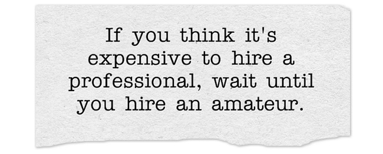

**Table of Contents**
<!-- MarkdownTOC -->

- [Scalability and Data Center Blogs](#scalability-and-data-center-blogs)
- [Scalability and Reliability. Distributed Systems](#scalability-and-reliability-distributed-systems)
	- [Scalability Solutions](#scalability-solutions)

<!-- /MarkdownTOC -->

## Scalability and Data Center Blogs
- [highscalability.com](http://highscalability.com/)
- [All Things Distributed. Werner Vogels' weblog on building scalable and robust distributed systems](http://www.allthingsdistributed.com/)
- [Data Center Knowledge](http://www.datacenterknowledge.com/)
- [Youtube: Iceland - A Growing Data Center Hub](https://www.youtube.com/watch?v=LH5lj4sARI0)
- [RackTables.org - a datacenter asset management system](http://racktables.org/)
- [iheavy.com Scalable Startups](http://www.iheavy.com/) MySQL, AWS & Scalability Expert NYC

# Scalability and Reliability. Distributed Systems
- [Scalable Internet Architectures" slides - Theo Schlossnagle how to build scalable production Internet services and... how not to build them](http://lethargy.org/~jesus/misc/Scalable%20Ti.pdf)
	- ["Scalable Internet Architectures" book - Theo Schlossnagle](http://scalableinternetarchitectures.com/)
	- [video: Scalable Internet Architectures - Theo Schlossnagle](https://www.youtube.com/watch?v=2WuT2rdLK5A)
	- [Theo Schlossnagle's slides](http://es.slideshare.net/postwait)
	- Switch configurations should be in version control
	- Router configurations should be in version control
	- Firewall configurations should be in version control
	- System configurations should be in version control
	- Application configurations should be in version control
	- Monitoring configurations should be in version control
	- Documentation should be in version control
	- Application code should be in version control
	- Database schema should be in version control
	- Everything you do should be in version control
- [slides: Scalable Web Architectures: Common Patterns and Approaches](http://es.slideshare.net/techdude/scalable-web-architectures-common-patterns-and-approaches)
- [highscalability.com](http://highscalability.com/)
- [video: Making Architecture Matter - Martin Fowler Keynote](https://www.youtube.com/watch?v=DngAZyWMGR0)
- [book: Building Scalable Web Sites - Cal Henderson](http://shop.oreilly.com/product/9780596102357.do)
- [book: Site Reliability Engineering. How Google Runs Production Systems - 2016](http://shop.oreilly.com/product/0636920041528.do)
- [How Does The Use Of Docker effect latency on Linux?](http://highscalability.com/blog/2015/12/16/how-does-the-use-of-docker-effect-latency.html)
- [Cloud Computing: What are the key characteristics of a robust, scalable and healthy cloud architecture?](https://www.quora.com/Cloud-Computing/What-are-the-key-characteristics-of-a-robust-scalable-and-healthy-cloud-architecture) The biggest benefit of moving to the cloud is unsurprisingly a financial one. The financial model associated with the cloud is healthy and economical.
- [dzone: Distributed Systems in the Real World](https://dzone.com/articles/reasoning-about-distributed-systems-in-the-real-wo)

<iframe width="560" height="315" src="https://www.youtube.com/embed/2WuT2rdLK5A" frameborder="0" allowfullscreen class="video"></iframe>

 

<iframe src="//es.slideshare.net/slideshow/embed_code/key/LnRFhtfXLoOMHx" width="595" height="485" frameborder="0" marginwidth="0" marginheight="0" scrolling="no" style="border:1px solid #CCC; border-width:1px; margin-bottom:5px; max-width: 100%;" allowfullscreen class="video"> </iframe> 
 <strong> <a href="//es.slideshare.net/postwait/scalable-internet-architecture" title="Scalable Internet Architecture" target="_blank">Scalable Internet Architecture</a> </strong> from <strong><a href="//es.slideshare.net/postwait" target="_blank">Theo Schlossnagle</a></strong> 

 

<iframe width="560" height="315" src="https://www.youtube-nocookie.com/embed/DngAZyWMGR0?rel=0" frameborder="0" allowfullscreen class="video"></iframe>

 

<iframe src="//es.slideshare.net/slideshow/embed_code/key/HghUgbjBasxURW" width="595" height="485" frameborder="0" marginwidth="0" marginheight="0" scrolling="no" style="border:1px solid #CCC; border-width:1px; margin-bottom:5px; max-width: 100%;" allowfullscreen class="video"> </iframe> 
 <strong> <a href="//es.slideshare.net/techdude/scalable-web-architectures-common-patterns-and-approaches" title="Scalable Web Architectures: Common Patterns and Approaches" target="_blank">Scalable Web Architectures: Common Patterns and Approaches</a> </strong> from <strong><a href="//es.slideshare.net/techdude" target="_blank">Tech Dude</a></strong> 

 

## Scalability Solutions
- [OpenShift Dedicated](https://www.openshift.com/dedicated/)
- [OpenStack](http://www.openstack.org/)
- [Apache Mesos](http://mesos.apache.org/)
- [Kubernetes.io](http://kubernetes.io/)
	- [Kubernetes repo analyzed with gitm. Top changeset contributors by employer](https://github.com/karlkfi/kubernetes-gitdm/wiki#top-changeset-contributors-by-employer)
- [Univa Grid Engine](http://www.univa.com/)
- [Apache ZooKeeper](http://zookeeper.apache.org/)
	- [Coordination and service discovery with Apache Zookeeper](http://www.javacodegeeks.com/2013/11/coordination-and-service-discovery-with-apache-zookeeper.html)

