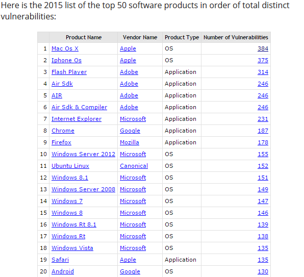
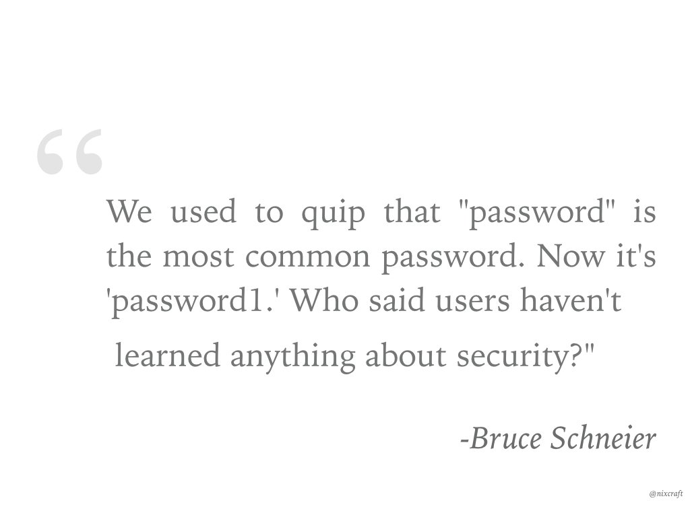
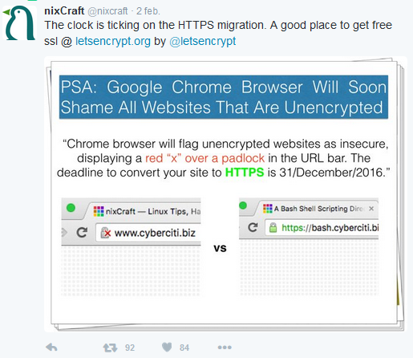
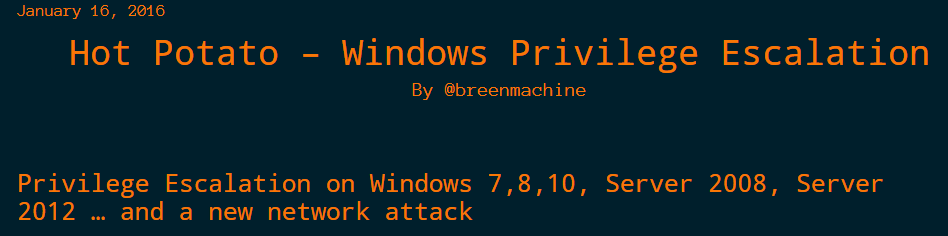

**Table of Contents**
<!-- MarkdownTOC -->

- [Security](#security)
	- [Security Blogs](#security-blogs)
		- [Blogs de Seguridad Informática](#blogs-de-seguridad-informática)
		- [Network Security](#network-security)
	- [Security on Twitter](#security-on-twitter)
		- [Seguridad en Twitter](#seguridad-en-twitter)
	- [Security Podcasts](#security-podcasts)
	- [Security Toolkits and Policies. Penetration Testing](#security-toolkits-and-policies-penetration-testing)
	- [Antivirus](#antivirus)
	- [Private Browsing](#private-browsing)
	- [Database encryption](#database-encryption)
	- [Identity Management](#identity-management)
	- [Big Data Security](#big-data-security)
	- [Application Security: Web App Firewall. Blocking bots](#application-security-web-app-firewall-blocking-bots)
	- [Breaking Firewalls, Shellcode Injection, SQL Injection](#breaking-firewalls-shellcode-injection-sql-injection)
	- [Email security. Anti Spam protection](#email-security-anti-spam-protection)
	- [Server Hardening](#server-hardening)
	- [SSL web security](#ssl-web-security)
		- [SSL Server Test](#ssl-server-test)
	- [Major security issues](#major-security-issues)

<!-- /MarkdownTOC -->

# Security
## Security Blogs
- [seclists.org](http://seclists.org/)
- [ehacking.net](http://www.ehacking.net)
- [Sucuri Blog](https://blog.sucuri.net/)
- [Blackmoreops.com](http://blackmoreops.com)
- [arstechnica.com/security](http://arstechnica.com/security)
- [foxglovesecurity.com](http://foxglovesecurity.com/)
- [securityzap.com](http://securityzap.com/)
- [Dark Reading](http://www.darkreading.com/)
- [Red Hat Security](https://securityblog.redhat.com)
- [Hacker News](https://news.ycombinator.com/)
- [Guido Vranken](https://guidovranken.wordpress.com/)
- [seancassidy.me](https://www.seancassidy.me)
- [youtube playlist: Dell Security](https://www.youtube.com/playlist?list=PLtVMPnH0I8TSLxGad4D9UGr12S1SH3kcM)
- [blog.cryptographyengineering.com](http://blog.cryptographyengineering.com/)
- [eweek.com/security](http://www.eweek.com/security/)
- [CSO: Security news, features and analysis about prevention, protection and business innovation](http://www.csoonline.com/)
- [peerlyst](https://www.peerlyst.com/) Professional Community platform for Information Security

### Blogs de Seguridad Informática
- [elladodelmal.com - Chema Alonso](http://www.elladodelmal.com)
- [hackplayers.com](http://www.hackplayers.com)
- [seguridadapple.com](http://www.seguridadapple.com)

### Network Security
- [tunnelsup.com](http://www.tunnelsup.com/)
- [Why Choose Bro?](https://www.bro.org/why_choose_bro.pdf)

## Security on Twitter
- [twitter.com/LinuxSec](https://twitter.com/LinuxSec)
- [twitter.com/linuxs3c](https://twitter.com/linuxs3c)
- [twitter.com/HackerNews](https://twitter.com/HackerNews)

### Seguridad en Twitter
- [twitter.com/Cryptodata](https://twitter.com/Cryptodata) Informático enamorado del software libre. Seguridad, administración de sistemas.
- [twitter.com/chemaalonso](https://twitter.com/chemaalonso)

## Security Podcasts
- [phoneboy.com](https://phoneboy.com/)

## Security Toolkits and Policies. Penetration Testing
- [OpenSCAP](https://www.open-scap.org) Tools, Security Policies and Standards
- [Kali Linux | Penetration Testing and Ethical Hacking Linux Distribution](https://www.kali.org/)
	- [blackmoreops.com: Crack passwords in Kali Linux with Hydra](http://www.blackmoreops.com/2015/12/23/crack-passwords-in-kali-linux-with-hydra/)
	- [blackmoreops.com: Man in the Middle Attack using Kali Linux – MITM attack](http://www.blackmoreops.com/2015/12/22/man-in-the-middle-attack-using-kali-linux/)
	- [Kali Linux NetHunter 3.0 Android Mobile Penetration Testing Platform Out Now](http://news.softpedia.com/news/kali-linux-nethunter-3-0-android-mobile-penetration-testing-platform-out-now-498555.shtml)
	- [Kali Linux, Rolling Edition Released – 2016.1](https://www.kali.org/releases/kali-linux-rolling-edition-2016-1/)
- [Network Security Toolkit](http://www.networksecuritytoolkit.org)
- [Penetration Testing scripts](https://github.com/averagesecurityguy/scripts)
- [BlackArch Linux Provides Over 1330 Penetration Testing Tools, New ISOs Out Now](http://linux.softpedia.com/blog/blackarch-linux-provides-over-1330-penetration-testing-tools-new-isos-out-now-498758.shtml)
- [web2attack: Web hacking framework with tools, exploits by python](https://github.com/santatic/web2attack)
- [kitploit.com: The hacker's tools](http://www.kitploit.com)
	- [OWASP ZSC Shellcoder - Generate Customized Shellcodes](http://www.kitploit.com/2015/08/owasp-zsc-shellcoder-generate.html)
- [gophish Open-Source Phishing Framework: #PenTest #Infosec #security](https://getgophish.com)

<a href="http://securityreactions.tumblr.com/post/134533644467/bypassing-firewall">http://securityreactions.tumblr.com/post/134533644467/bypassing-firewall</a>

## Antivirus
- [Bitdefender](http://www.bitdefender.com)
- [GData](https://www.gdatasoftware.com/)
- [Avast](https://www.avast.com)
- [Independent Tests of Antivirus Software](http://www.av-comparatives.org/)
- [wikipedia: Comparison of antivirus software](https://en.wikipedia.org/wiki/Comparison_of_antivirus_software)
- [tomsguide.com: Best Antivirus Software and Apps 2016](http://www.tomsguide.com/us/best-antivirus,review-2588.html)
- [Here is the 2015 list of the top 50 software products in order of total distinct vulnerabilities](http://venturebeat.com/2015/12/31/software-with-the-most-vulnerabilities-in-2015-mac-os-x-ios-and-flash/)

## Private Browsing
- [Private Browsing - Use Firefox without saving history](https://support.mozilla.org/en-US/kb/private-browsing-use-firefox-without-history)
- [Qué saben de ti las ‘cookies’ y nueve preguntas más](http://tlife.guru/movilidad/que-saben-de-ti-las-cookies-y-nueve-preguntas-mas/)

## Database encryption
- [Wikipedia: Database encryption](https://en.wikipedia.org/wiki/Database_encryption)
- [dba.stackexchange.com - encryption tag](http://dba.stackexchange.com/questions/tagged/encryption)

## Identity Management
- [rhelblog.redhat.com - Ten New Identity Management (IdM) Features in Red Hat Enterprise Linux 7.1](http://rhelblog.redhat.com/2015/03/25/ten-new-identity-management-idm-features-in-red-hat-enterprise-linux-7-1/)
- [redhat.com - Improvements to Identity Management (IdM) in RHEL 7.1](http://www.redhat.com/en/about/press-releases/red-hat-continues-platform-innovation-general-availability-first-minor-release-red-hat-enterprise-linux-7)
- [Dell Authentication Services](http://software.dell.com/products/authentication-services/)
- [Centrify](https://www.centrify.com/)
- [Employees have no qualms in selling corporate passwords](http://www.csoonline.com/article/2905682/data-breach/employees-have-no-qualms-in-selling-corporate-passwords.html)
- [Are their any valid Active Directory Alternatives?](http://community.spiceworks.com/topic/689453-are-their-any-valid-active-directory-alternatives)
- [Active Directory Single Sign-On (SSO) on AWS with Bitium](https://aws.amazon.com/es/blogs/apn/active-directory-single-sign-on-sso-on-aws-with-bitium)
- [Announcing Managed Microsoft Active Directory in the AWS Cloud](https://aws.amazon.com/es/about-aws/whats-new/2015/12/announcing-managed-microsoft-active-directory-in-the-aws-cloud/)
- [Apache Syncope, Open Source Identity Management software](http://syncope.apache.org/)
- [Apache Shiro is a powerful and easy-to-use Java security framework that performs authentication, authorization, cryptography, and session management](http://shiro.apache.org/)
- [Open source identity management 20121106 - apache con eu](http://www.slideshare.net/ilgrosso/open-source-identity-management-20121106-apache-con-eu)
- [community.dell.com: Is there anything that is a bigger waste of IT time than password resets?](http://en.community.dell.com/techcenter/iam/b/weblog/archive/2015/07/06/when-it-comes-to-iam-the-simple-things-can-ruin-your-day)
- [cityam.com: "Password", "123456" and "qwerty": These are the world's 25 worst passwords of 2015](http://www.cityam.com/232759/password-123456-and-qwerty-these-are-the-worlds-25-worst-passwords-of-2015)

## Big Data Security
- [[2014] Big Data y Privacidad por Chema Alonso](https://youtu.be/_oeqjepFkEY)
- [Panopticlick.eff.org: Is your browser safe against tracking?](https://panopticlick.eff.org/)

## Application Security: Web App Firewall. Blocking bots
- [dzone.com - The 2015 DZone Guide to Application Security](http://bit.ly/1RksReA)
- [JBossDeveloper - Theft-Proof Java EE - Securing Your Java EE Enterprise Applications](http://planet.jboss.org/post/theft_proof_java_ee_securing_your_java_ee_enterprise_applications)
- [pyvideo.org: Let's Be Bad Guys: Exploiting and Mitigating the Top 10 Web App Vulnerabilities](http://www.pyvideo.org/video/3512/shiny-lets-be-bad-guys-exploiting-and-mitigati-3)
- [What is Baiduspider?](https://chineseseoshifu.com/blog/what-is-baiduspider.html)
- [Estándar de exclusión de robots](https://es.wikipedia.org/wiki/Est%C3%A1ndar_de_exclusi%C3%B3n_de_robots)
- [Robots Database](http://www.robotstxt.org/db.html)

## Breaking Firewalls, Shellcode Injection, SQL Injection 
- [Breaking Firewalls with OpenSSH and PuTTY](http://souptonuts.sourceforge.net/sshtips.htm)
	- [PuTTY: 10 consejos útiles para conexiones SSH](http://www.emezeta.com/articulos/putty-10-consejos-utiles-para-conexiones-ssh)
- [Punching holes into firewalls. Why firewalls shouldn't be considered a ultimate weapon for network security. Secure TCP-into-HTTP tunnelling guide](http://sebsauvage.net/punching/)
- [Shellcode Injection: Think twice before granting a shell access](https://dhavalkapil.com/blogs/Shellcode-Injection/)
- [SQL Injection](https://en.wikipedia.org/wiki/SQL_injection)
- [Bind variables are the best way to prevent SQL injection](http://use-the-index-luke.com/sql/where-clause/bind-parameters)

## Email security. Anti Spam protection
- [spamhaus.org](http://www.spamhaus.org/)
	- [Verizon Routing Millions of IP Addresses for Cybercrime Gangs](http://www.spamhaus.org/news/article/726/)
- [The Enigmail project. OpenPGP security for mozilla applications](https://www.enigmail.net/)

## Server Hardening
- [LinuxJournal.com: Server Hardening](http://www.linuxjournal.com/content/server-hardening)
- [tecmint.com: 25 Hardening Security Tips for Linux Servers](http://www.tecmint.com/linux-server-hardening-security-tips/)
- [CentOS 7 Server Hardening Guide](https://www.smittix.co.uk/centos-7-server-hardening-guide/)
- [20 Linux Server Hardening Security Tips](http://www.cyberciti.biz/tips/linux-security.html)
- [20 Linux Server Hardening Security Tips](http://www.cyberciti.biz/tips/linux-security.html)
- [Top 20 OpenSSH Server Best Security Practices](http://www.cyberciti.biz/tips/linux-unix-bsd-openssh-server-best-practices.html)
- [Consejos para endurecer un servidor SSH y hacerlo más seguro](http://totaki.com/poesiabinaria/2016/01/consejor-endurecer-servidor-ssh-hacerlo-seguro/)

## SSL web security
- [letsencrypt.org free ssl](https://letsencrypt.org) Let’s Encrypt is a free, automated, and open certificate authority (CA), run for the public’s benefit. Let’s Encrypt is a service provided by the Internet Security Research Group (ISRG).

### SSL Server Test
- [ssllabs.com/ssltest](https://www.ssllabs.com/ssltest)
- [SSL Report: bash.cyberciti.biz](https://www.ssllabs.com/ssltest/analyze.html?d=bash.cyberciti.biz)
 

## Major security issues
- [Digital Attack Map. Top daily DDoS attacks worldwide](http://www.digitalattackmap.com/#anim=1&color=2&country=ALL&list=0&time=16064&view=map)
- [dzone.com - Java Serialization Vulnerability Threatens Millions of Applications . Contrast security is promoting their solution for a vulnerability that affects WebLogic, WebSphere, JBoss, Jenkins, and OpenNMS.](https://dzone.com/articles/java-serialization-vulnerability-threatens-million)
	- [zdnet.com: Oracle ordered to blitz users with Java security warnings](http://www.zdnet.com/article/oracle-ordered-to-blitz-users-with-java-security-warnings/)
	- [dzone.com - This Java Vulnerability Makes Heartbleed Look Tame.Find out what the big deal is with the Java serialization security flaw that the community is buzzing about](https://dzone.com/articles/point-of-viewwhy-the-java-serialization-vulnerabil)
- [keychain: Set Up Secure Passwordless SSH Access For Backup Scripts](http://www.cyberciti.biz/faq/ssh-passwordless-login-with-keychain-for-scripts/)
- [New High Severity OpenSSL Vulnerabilities Announced: CVE-2015-0291 & CVE-2015-0204](http://www.tripwire.com/state-of-security/vulnerability-management/new-high-severity-openssl-vulnerabilities-announced-cve-2015-0291-cve-2015-0204/)
- [Red Hat security blog: Heartbleed](https://securityblog.redhat.com/tag/heartbleed/)
	- [Fixing Heartbleed with Ansible](http://www.ansible.com/blog/fixing-heartbleed-with-ansible)
- [Patching the GHOST glibc gethostbyname CVE-2015-0235 bug](https://sysadmincasts.com/episodes/44-patching-the-ghost-glibc-gethostbyname-cve-2015-0235-bug)
- [Shellshock: Bash bug 'bigger than Heartbleed' could undermine security of millions of websites – and there's nothing you can do to protect yourself](http://www.independent.co.uk/life-style/gadgets-and-tech/shell-shock-bash-bug-bigger-than-heartbleed-could-undermine-security-of-millions-of-websites-9754720.html)
	- [Ansible.com shellshock](http://www.ansible.com/blog/shellshock)
	- [Patch Shellshock with Ansible](https://raymii.org/s/articles/Patch_CVE-2014-6271_Shellshock_with_Ansible.html)
	- [servercheck.in: Secure your servers from Shellshock Bash vulnerability using Ansible](https://servercheck.in/blog/secure-your-servers-shellshock-bash-vulnerability)
	- [aroundthecode.org: Ansible - massively fix bash shellshock](http://aroundthecode.org/2014/09/26/fix_bash_shellshock/)
	- [shellshock CVE-2014-6271 fix for ubuntu bash](https://gist.github.com/kacy/2b9408af04c71fab686e)
	- [community.redhat.com: Critical Bash Security Vulnerability: Update Your Systems Today](http://community.redhat.com/blog/2014/09/critical-bash-security-vulnerability-update-your-systems-today/)
	- [Lynda.com: Protect Your System from the Shellshock Bash Exploit](http://www.lynda.com/articles/shellshock-bash-exploit)
	- [Red Hat security blog: Frequently Asked Questions about the Shellshock Bash flaws](https://securityblog.redhat.com/2014/09/26/frequently-asked-questions-about-the-shellshock-bash-flaws/)
- [La inyección SQL se colocó como el ataque número uno en 2015](http://www.seguridad.unam.mx/noticia/?noti=2657)
- [PuTTY vulnerability vuln-ech-overflow](http://www.chiark.greenend.org.uk/~sgtatham/putty/wishlist/vuln-ech-overflow.html)
- [guidovranken.wordpress.com: HTTPS Bicycle Attack](https://guidovranken.wordpress.com/2015/12/30/https-bicycle-attack/)
	- [New HTTPS Bicycle Attack Reveals Details About Passwords, GPS Coordinates](http://news.softpedia.com/news/new-https-bicycle-attack-reveals-details-about-passwords-gps-coordinates-498488.shtml)
- [techpageone.co.uk: Top security initiatives for 2016. Encryption is the new “minimum” security](http://www.techpageone.co.uk/technology-uk-en/top-security-initiatives-2016/)
- [techpageone.co.uk: The top 5 IT security threats for 2016](http://www.techpageone.co.uk/technology-uk-en/top-5-security-threats-2016)
- [CVE-2015-7755: Juniper ScreenOS Authentication Backdoor](https://community.rapid7.com/community/infosec/blog/2015/12/20/cve-2015-7755-juniper-screenos-authentication-backdoor)
- [On the Juniper backdoor](http://blog.cryptographyengineering.com/2015/12/on-juniper-backdoor.html)
	- [Juniper drops NSA-developed code following new backdoor revelations](http://arstechnica.com/security/2016/01/juniper-drops-nsa-developed-code-following-new-backdoor-revelations/)
	- [SSH Backdoor for FortiGate OS Version 4.x up to 5.0.7](http://seclists.org/fulldisclosure/2016/Jan/26)
- [Drupal Hardens Its Security in Response to Criticism](http://www.eweek.com/security/drupal-hardens-its-security-in-response-to-criticism.html)
- [scriptrock.com: Fixing The New OpenSSH Roaming Bug](https://www.scriptrock.com/blog/fixing-the-new-openssh-roaming-bug) A bug in a test feature of the OpenSSH client was found to be highly vulnerable to exploitation today, potentially leaking cryptographic keys to malicious attackers. First discovered and announced by the Qualys Security Team, the vulnerability affects OpenSSH versions 5.4 through 7.1.
	- [OpenSSH: client bugs CVE-2016-0777 and CVE-2016-0778](http://undeadly.org/cgi?action=article&sid=20160114142733)
	- [redhat.com: OpenSSH: Information-leak vulnerability (CVE-2016-0777)](https://access.redhat.com/articles/2123781)
	- [Using Puppet to address the new SSH client vulnerability](https://puppetlabs.com/blog/using-puppet-address-new-ssh-client-vulnerability)
- [seguridadapple.com: Las apps bancarias en iOS siguen teniendo debilidades respecto a 2013](http://www.seguridadapple.com/2015/12/las-apps-bancarias-en-ios-siguen.html)
- [LostPass](https://www.seancassidy.me/lostpass.html) I have discovered a phishing attack against LastPass that allows an attacker to steal a LastPass user's email, password, and even two-factor auth code, giving full access to all passwords and documents stored in LastPass. I call this attack LostPass. 
	- [ZDNet: LastPass phishing attack avoids two-factor authentication in data theft](http://www.zdnet.com/article/lastpass-phishing-attack-avoids-two-factor-authentication-to-steal-your-data/) The exploited security flaw is severe enough that successful attacks compromise two-factor authentication codes.
- [New attacks on Network Time Protocol can defeat HTTPS and create chaos](http://arstechnica.com/security/2015/10/new-attacks-on-network-time-protocol-can-defeat-https-and-create-chaos/)
- [Hot Potato – Windows Privilege Escalation](http://foxglovesecurity.com/2016/01/16/hot-potato/)
- [Analysis and exploitation of a Linux Kernel vulnerability (CVE-2016-0728)](http://perception-point.io/2016/01/14/analysis-and-exploitation-of-a-linux-kernel-vulnerability-cve-2016-0728/)
	- [Serious 0-day Linux kernel vulnerability released. Apply fix ASAP. How To Patch and Protect Linux Kernel Zero Day Vulnerability CVE-2016-0728 (19/Jan/2016)](http://www.cyberciti.biz/faq/linux-cve-2016-0728-0-day-local-privilege-escalation-vulnerability-fix/)
- [Top 10 Data Breaches Of 2015 — A New Year’s Day Retrospective](https://medium.com/@Roane_H/top-10-data-breaches-of-2015-a-new-year-s-day-retrospective-e7fc56a48c6) The majority of these (and most) security mishaps are due to misconfigurations and unpatched software — flaws that can be hard to detect in large, heterogeneous environments
- [High-severity bug in OpenSSL allows attackers to decrypt HTTPS traffic](http://arstechnica.com/security/2016/01/high-severity-bug-in-openssl-allows-attackers-to-decrypt-https-traffic/) OpenSSL maintainers release update that fixes key-recovery bug. Patch now. People using OpenSSL version 1.0.2 should upgrade to 1.0.2f, while those still using version 1.0.1 should install 1.0.1r.

