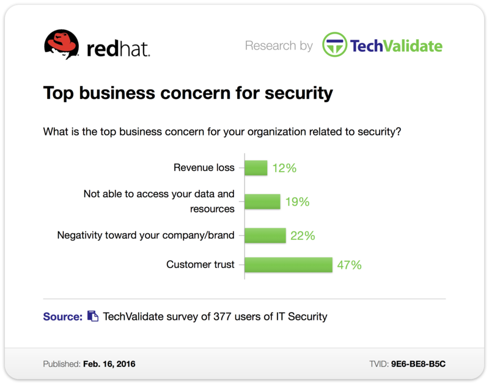
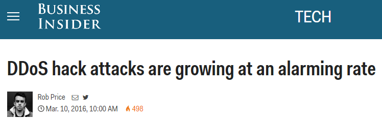
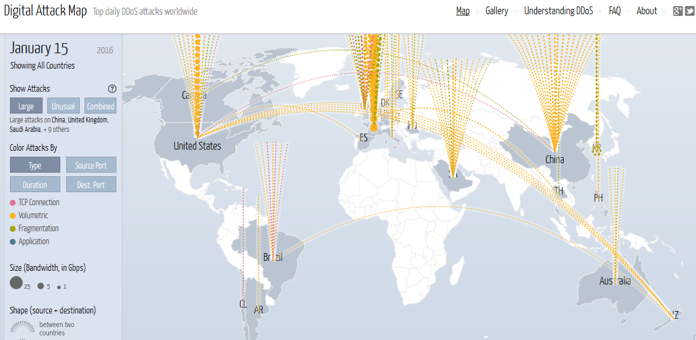
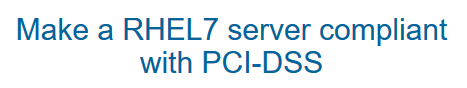
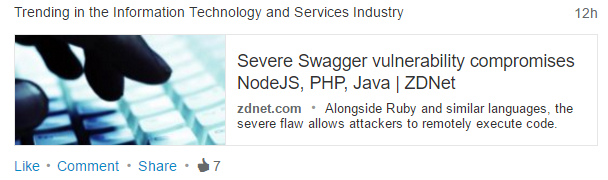
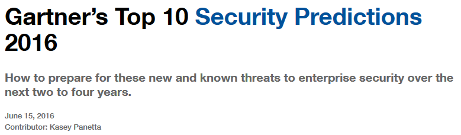
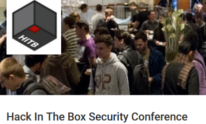
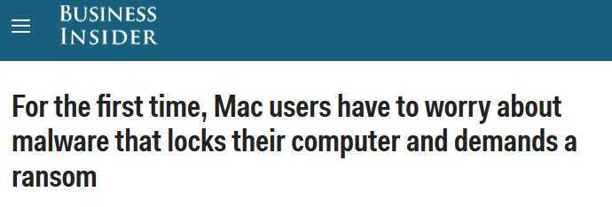
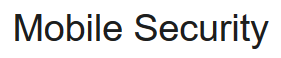
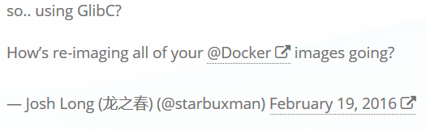

**Table of Contents**
<!-- MarkdownTOC -->

- [Security](#security)
	- [Awesome Security Lists](#awesome-security-lists)
	- [CVE Common Vulnerabilities and Exposures](#cve-common-vulnerabilities-and-exposures)
	- [OWASP Open Web Application Security Project](#owasp-open-web-application-security-project)
	- [OpenSCAP and Lynis. Open Source security auditing tools](#openscap-and-lynis-open-source-security-auditing-tools)
	- [Cisco Security Advisories and Responses](#cisco-security-advisories-and-responses)
	- [Security Blogs](#security-blogs)
		- [Blogs de Seguridad Informática](#blogs-de-seguridad-informática)
		- [Network Security](#network-security)
	- [Security on Twitter](#security-on-twitter)
		- [Seguridad en Twitter](#seguridad-en-twitter)
	- [Security Podcasts](#security-podcasts)
	- [Security Toolkits and Policies. Penetration Testing](#security-toolkits-and-policies-penetration-testing)
	- [Antivirus and malware](#antivirus-and-malware)
	- [Mobile Security](#mobile-security)
	- [Private Browsing](#private-browsing)
	- [HTTPs and HSTS](#https-and-hsts)
	- [Database encryption](#database-encryption)
	- [Identity Management](#identity-management)
	- [Big Data Security](#big-data-security)
	- [Application Security: Web App Firewall. Blocking bots](#application-security-web-app-firewall-blocking-bots)
	- [Breaking Firewalls, Shellcode Injection, SQL Injection](#breaking-firewalls-shellcode-injection-sql-injection)
	- [Email security. Anti Spam protection](#email-security-anti-spam-protection)
	- [Server Hardening](#server-hardening)
	- [Next Generation Firewalls](#next-generation-firewalls)
	- [Security Checklist](#security-checklist)
	- [Major Security Vulnerabilities](#major-security-vulnerabilities)
		- [Red Hat Vulnerabilities Catalog. Red Hat CVE Database.](#red-hat-vulnerabilities-catalog-red-hat-cve-database)
		- [SQL injection](#sql-injection)
		- [Windows Vulnerabilities](#windows-vulnerabilities)
		- [Linux Vulnerabilities](#linux-vulnerabilities)
		- [Heartbleed. April 2014](#heartbleed-april-2014)
		- [Shellshock. September 2014](#shellshock-september-2014)
		- [Java Serialization Vulnerability. November 2015](#java-serialization-vulnerability-november-2015)
		- [HTTPS Bicycle Attack. December 2015](#https-bicycle-attack-december-2015)
		- [Backdoors. December 2015](#backdoors-december-2015)
		- [LastPass. January 2016](#lastpass-january-2016)
		- [OpenSSH Roaming Bug. January 2016](#openssh-roaming-bug-january-2016)
		- [OpenSSL. January 2016](#openssl-january-2016)
		- [Linode SSH. February 2016](#linode-ssh-february-2016)
		- [glibc stack based buffer overflow. February 2016](#glibc-stack-based-buffer-overflow-february-2016)
		- [DROWN Attack. Cross protocol attack on TLS using SSLv2. March 2016](#drown-attack-cross-protocol-attack-on-tls-using-sslv2-march-2016)
		- [OpenSSH Security Advisory. March 2016](#openssh-security-advisory-march-2016)
		- [SSH attempts](#ssh-attempts)
		- [Bad Tunnel. June 2016](#bad-tunnel-june-2016)
		- [DDos](#ddos)
		- [Shadow IT security risks](#shadow-it-security-risks)
	- [Top security initiatives for 2016](#top-security-initiatives-for-2016)
		- [Container security. Who’s fixing containers? February 2016](#container-security-who’s-fixing-containers-february-2016)
		- [DDos and Project Shield. February 2016](#ddos-and-project-shield-february-2016)
		- [Disk Encryption](#disk-encryption)

<!-- /MarkdownTOC -->

<a href="http://securityreactions.tumblr.com/post/135125776940/management-is-so-busy-developing-security-metrics">http://securityreactions.tumblr.com/post/135125776940/management-is-so-busy-developing-security-metrics</a>

<blockquote class="twitter-tweet tw-align-center" data-lang="es">
RT <a href="https://twitter.com/cloudsa">@cloudsa</a>: Want to know what the future holds for <a href="https://twitter.com/hashtag/cloudsecurity?src=hash">#cloudsecurity</a>? Listen to <a href="https://twitter.com/EMEACloudGuy">@EMEACloudGuy</a>&#39;s &amp; <a href="https://twitter.com/jimreavis">@jimreavis</a>&#39;s chat: <a href="https://t.co/R9GYrRr2ix">https://t.co/R9GYrRr2ix</a>
&mdash; Red Hat EMEA (@RedHatEMEA) <a href="https://twitter.com/RedHatEMEA/status/706045423132262400">5 de marzo de 2016</a></blockquote>

<blockquote class="twitter-tweet tw-align-center" data-lang="es">
Dave vs Security:  This is why you automate security into your process.  <a href="https://twitter.com/hashtag/cybersecurity?src=hash">#cybersecurity</a> <a href="https://twitter.com/hashtag/devops?src=hash">#devops</a> <a href="https://twitter.com/hashtag/secops?src=hash">#secops</a> <a href="https://t.co/H3Nn0GAGt5">pic.twitter.com/H3Nn0GAGt5</a>
&mdash; Greg Bledsoe (@geek_king) <a href="https://twitter.com/geek_king/status/737700231639408641">31 de mayo de 2016</a></blockquote>

<blockquote class="twitter-tweet tw-align-center" data-lang="es">
How to Apply DevOps Culture to Security<a href="https://twitter.com/hashtag/DevOps?src=hash">#DevOps</a><a href="https://t.co/8UMlDqKahE">https://t.co/8UMlDqKahE</a>  via <a href="https://twitter.com/hashtag/MVB?src=hash">#MVB</a> <a href="https://twitter.com/petecheslock">@petecheslock</a> <a href="https://t.co/RBpCxGDsTQ">pic.twitter.com/RBpCxGDsTQ</a>
&mdash; DZone (@DZone) <a href="https://twitter.com/DZone/status/747278413853949957">27 de junio de 2016</a></blockquote>

# Security
## Awesome Security Lists
- [awesome security](https://github.com/sbilly/awesome-security)
- [awesome security talks](https://github.com/PaulSec/awesome-sec-talks)
- [awesome penetration testing](https://github.com/enaqx/awesome-pentest)
- [awesome android security](https://github.com/ashishb/android-security-awesome)

## CVE Common Vulnerabilities and Exposures
- Common Vulnerability Enumeration is a repository of security software flaws managed by NIST in the National Vulnerability Database (NVD) as part of SCAP (Security Content Automation Protocol)
- [CVE database: Common Vulnerabilities and Exposures 🌟🌟🌟](http://cve.mitre.org/) The Standard for Information Security Vulnerability Names
	- [CVE List Main Page](http://cve.mitre.org/cve/)
- [National Vulnerability Database 🌟](https://nvd.nist.gov)
	- [Search CVE and CCE Vulnerability Database 🌟](https://web.nvd.nist.gov/view/vuln/search)
- [SCAP (Security Content Automation Protocol)](http://scap.nist.gov/)

## OWASP Open Web Application Security Project 
- [owasp.org 🌟🌟](https://www.owasp.org) The Open Web Application Security Project (OWASP) is a worldwide not-for-profit charitable organization focused on improving the security of software. 
- [OWASP Testing Project](https://www.owasp.org/index.php/OWASP_Testing_Project)
- [Guía de pruebas de OWASP 3.0](https://www.owasp.org/images/8/80/Gu%C3%ADa_de_pruebas_de_OWASP_ver_3.0.pdf)
- [OWASP Testing Guide v4.0. Guia de seguridad en aplicaciones Web](https://www.incibe.es/blogs/post/Seguridad/BlogSeguridad/Articulo_y_comentarios/owasp_4_en)
- [OWASP Testing Guide v4 Table of Contents 🌟🌟](https://www.owasp.org/index.php/OWASP_Testing_Guide_v4_Table_of_Contents)

## OpenSCAP and Lynis. Open Source security auditing tools
- [OpenSCAP and Lynis. Open Source security auditing tools  🌟🌟🌟🌟](auditing-tools.md)

## Cisco Security Advisories and Responses
- [Cisco Security Advisories and Responses 🌟🌟🌟](https://tools.cisco.com/security/center/publicationListing.x)

## Security Blogs
- [HaCoder.com 🌟](http://www.hacoder.com) 
- [seclists.org 🌟](http://seclists.org/)
- [ehacking.net 🌟](http://www.ehacking.net)
- [Sucuri Blog 🌟](https://blog.sucuri.net/)
- [linux-audit.com 🌟🌟](http://linux-audit.com) Linux security: Auditing, Hardening and Compliance
- [Blackmoreops.com 🌟](http://blackmoreops.com)
- [Red Hat Security Blog 🌟](https://access.redhat.com/blogs/product-security)
- [k4linux.com](http://www.k4linux.com) Kali Linux 2.0 tutorials Technology and News of penetration testing and security Hacking Wifi Facebook Website.
- [net-security.org](http://www.net-security.org)
- [livesshattack.net 🌟](https://livesshattack.net/)
- [arstechnica.com/security](http://arstechnica.com/security)
- [foxglovesecurity.com](http://foxglovesecurity.com/)
- [securityzap.com](http://securityzap.com/)
- [Dark Reading](http://www.darkreading.com/)
- [Red Hat Security](https://securityblog.redhat.com)
- [Security Intelligence](https://securityintelligence.com)
- [hackershandbook.org](http://www.hackershandbook.org)
- [Hacker News](https://news.ycombinator.com/)
- [Guido Vranken](https://guidovranken.wordpress.com/)
- [seancassidy.me](https://www.seancassidy.me)
- [youtube playlist: Dell Security](https://www.youtube.com/playlist?list=PLtVMPnH0I8TSLxGad4D9UGr12S1SH3kcM)
- [blog.cryptographyengineering.com](http://blog.cryptographyengineering.com/)
- [eweek.com/security](http://www.eweek.com/security/)
- [CSO: Security news, features and analysis about prevention, protection and business innovation](http://www.csoonline.com/)
- [peerlyst](https://www.peerlyst.com/) Professional Community platform for Information Security
- [Network Security - NetSecNow ](http://learnnetsec.blogspot.com.es)
	- [NetSecNow on Youtube](https://www.youtube.com/user/NetSecNow)
- [hacking-etico.com](http://hacking-etico.com)
- [Hack In The Box Security Conference 🌟](https://www.youtube.com/user/hitbsecconf)

<blockquote class="twitter-tweet tw-align-center" data-lang="es">
6 cybersecurity and emergency situations every IT depart should train for <a href="https://t.co/bXt7mDf9BA">https://t.co/bXt7mDf9BA</a> by <a href="https://twitter.com/patgrayjr">@patgrayjr</a> <a href="https://t.co/gvGygVZGVc">pic.twitter.com/gvGygVZGVc</a>
&mdash; TechRepublic (@TechRepublic) <a href="https://twitter.com/TechRepublic/status/747513603968864260">27 de junio de 2016</a></blockquote>

### Blogs de Seguridad Informática
- [elladodelmal.com - Chema Alonso](http://www.elladodelmal.com)
- [hackplayers.com](http://www.hackplayers.com)
- [seguridadapple.com](http://www.seguridadapple.com)

### Network Security
- [tunnelsup.com](http://www.tunnelsup.com/)
- [Why Choose Bro?](https://www.bro.org/why_choose_bro.pdf)

## Security on Twitter
- [twitter.com/LinuxSec](https://twitter.com/LinuxSec)
- [twitter.com/linuxs3c](https://twitter.com/linuxs3c)
- [twitter.com/HackerNews](https://twitter.com/HackerNews)

### Seguridad en Twitter
- [twitter.com/Cryptodata](https://twitter.com/Cryptodata) Informático enamorado del software libre. Seguridad, administración de sistemas.
- [twitter.com/chemaalonso](https://twitter.com/chemaalonso)

<iframe width="560" height="315" src="https://www.youtube.com/embed/5zlzdQe7nig?rel=0" frameborder="0" allowfullscreen class="video"></iframe>

 

<blockquote class="twitter-tweet tw-align-center" data-lang="es">
Facebook, Google, and WhatsApp are all planning to increase encryption <a href="https://t.co/K0Roq7nENd">https://t.co/K0Roq7nENd</a> <a href="https://t.co/fK9xhW3jx5">pic.twitter.com/fK9xhW3jx5</a>
&mdash; BI Tech (@SAI) <a href="https://twitter.com/SAI/status/709372723630362624">14 de marzo de 2016</a></blockquote>

<blockquote class="twitter-tweet tw-align-center" data-lang="es">
<a href="https://twitter.com/hashtag/Linux?src=hash">#Linux</a> Webserver <a href="https://twitter.com/hashtag/Security?src=hash">#Security</a> is out! <a href="https://t.co/UcwrNmJIEm">https://t.co/UcwrNmJIEm</a> Stories via <a href="https://twitter.com/Dinosn">@Dinosn</a> <a href="https://twitter.com/sidekickhelps">@sidekickhelps</a> <a href="https://twitter.com/Akwelz">@Akwelz</a>
&mdash; Linux Security News (@LinuxSec) <a href="https://twitter.com/LinuxSec/status/699037256724692993">febrero 15, 2016</a></blockquote>

<blockquote class="twitter-tweet tw-align-center" data-lang="es">
El lado del mal - ¿Por qué sale el candado rojo en los mensajes de Gmail? <a href="https://t.co/Qd1sxGy87E">https://t.co/Qd1sxGy87E</a> <a href="https://twitter.com/hashtag/Gmail?src=hash">#Gmail</a> }:) <a href="https://t.co/EwQZUYPOuB">pic.twitter.com/EwQZUYPOuB</a>
&mdash; Chema Alonso (@chemaalonso) <a href="https://twitter.com/chemaalonso/status/697649215632248833">febrero 11, 2016</a></blockquote>

<blockquote class="twitter-tweet tw-align-center" data-lang="es">
.<a href="https://twitter.com/chemaalonso">@chemaalonso</a> <a href="https://twitter.com/LaVanguardia">@LaVanguardia</a> &quot;internet es tan seguro como lo es el mundo hoy en día &quot; <a href="https://t.co/aFMen7nErc">pic.twitter.com/aFMen7nErc</a>
&mdash; Diego Ruiz Moreno (@diegodron) <a href="https://twitter.com/diegodron/status/708594432715706368">12 de marzo de 2016</a></blockquote>

<blockquote class="twitter-tweet tw-align-center" data-lang="es">
SMShing para robar tu 2nd Factor Authentication en tus cuentas Google o Apple <a href="https://twitter.com/hashtag/SMShing?src=hash">#SMShing</a> <a href="https://t.co/IujqX1ZZOb">https://t.co/IujqX1ZZOb</a> }:) <a href="https://t.co/U6TrIMFZdO">pic.twitter.com/U6TrIMFZdO</a>
&mdash; Chema Alonso (@chemaalonso) <a href="https://twitter.com/chemaalonso/status/739357388113870848">5 de junio de 2016</a></blockquote>

<blockquote class="twitter-tweet tw-align-center" data-lang="es">
Be warned, there&#39;s a nasty Google 2 factor auth attack going around. <a href="https://t.co/c9b9Fxc0ZC">pic.twitter.com/c9b9Fxc0ZC</a>
&mdash; Alex MacCaw (@maccaw) <a href="https://twitter.com/maccaw/status/739232334541524992">4 de junio de 2016</a></blockquote>

<blockquote class="twitter-tweet tw-align-center" data-lang="es">
For you Wi-Fi nerds: A visual representation of WEP security on WLAN&#39;s. <a href="https://t.co/Q5Sh9t7x3I">pic.twitter.com/Q5Sh9t7x3I</a>
&mdash; Michael Dorman (@_mdorman) <a href="https://twitter.com/_mdorman/status/738805461579767812">3 de junio de 2016</a></blockquote>

<blockquote class="twitter-tweet tw-align-center" data-lang="es">
New SonicAlert: Microsoft Windows&amp;trade; OS HTTP User-Agents (1/29/2016) by <a href="https://twitter.com/DellSecurity">@DellSecurity</a> Threats Research: <a href="https://t.co/hkm4abXYd4">https://t.co/hkm4abXYd4</a>
&mdash; Dell Security (@DellSecurity) <a href="https://twitter.com/DellSecurity/status/694192990206697472">febrero 1, 2016</a></blockquote>

<blockquote class="twitter-tweet tw-align-center" data-lang="es">
The best way to visualize encryption to those who don&#39;t understand it over the Internet. Key Exchange <a href="https://t.co/6fwikgx9jc">https://t.co/6fwikgx9jc</a> <a href="https://twitter.com/hashtag/security?src=hash">#security</a>
&mdash; nixCraft (@nixcraft) <a href="https://twitter.com/nixcraft/status/700618789440782336">febrero 19, 2016</a></blockquote>

<blockquote class="twitter-tweet tw-align-center" data-lang="es">
Who&#39;s fixing containers? <a href="https://t.co/vltcct17s7">https://t.co/vltcct17s7</a> <a href="https://twitter.com/hashtag/glibc?src=hash">#glibc</a> <a href="https://twitter.com/hashtag/ITsecurity?src=hash">#ITsecurity</a> <a href="https://twitter.com/hashtag/containers?src=hash">#containers</a>
&mdash; Open Source Way (@opensourceway) <a href="https://twitter.com/opensourceway/status/700711544871645185">febrero 19, 2016</a></blockquote>

<blockquote class="twitter-tweet tw-align-center" data-lang="es">
Why we use adblockers: &#39;We need to have more control over what we&#39;re exposed to&#39; <a href="https://t.co/TvMoWgAExA">https://t.co/TvMoWgAExA</a> <a href="https://t.co/s6uwF5cPqh">pic.twitter.com/s6uwF5cPqh</a>
&mdash; The Guardian (@guardian) <a href="https://twitter.com/guardian/status/708004842711678976">10 de marzo de 2016</a></blockquote>

<blockquote class="twitter-tweet tw-align-center" data-lang="es">
3 months and 1 Million SSH attempts later <a href="https://t.co/3Mst0W0K44">https://t.co/3Mst0W0K44</a> <a href="https://twitter.com/hashtag/openssh?src=hash">#openssh</a> <a href="https://twitter.com/hashtag/openbsd?src=hash">#openbsd</a> <a href="https://twitter.com/hashtag/unix?src=hash">#unix</a> <a href="https://twitter.com/hashtag/linux?src=hash">#linux</a> <a href="https://twitter.com/hashtag/opensource?src=hash">#opensource</a> <a href="https://twitter.com/hashtag/linux?src=hash">#linux</a> <a href="https://twitter.com/hashtag/infosec?src=hash">#infosec</a> <a href="https://twitter.com/hashtag/security?src=hash">#security</a>
&mdash; nixCraft (@nixcraft) <a href="https://twitter.com/nixcraft/status/711770928259043328">21 de marzo de 2016</a></blockquote>

<blockquote class="twitter-tweet tw-align-center" data-lang="es">
Security Virtualisation - what is it?  <a href="https://t.co/agayoDZlvR">https://t.co/agayoDZlvR</a> <a href="https://twitter.com/hashtag/sdn?src=hash">#sdn</a> <a href="https://twitter.com/hashtag/nfv?src=hash">#nfv</a> <a href="https://twitter.com/NatilikSEC">@NatilikSEC</a>
&mdash; James Talbot (@jamesrtalbot) <a href="https://twitter.com/jamesrtalbot/status/735364101535375360">25 de mayo de 2016</a></blockquote>

<blockquote class="twitter-tweet tw-align-center" data-lang="es">
&quot;Securing Your Virtual Environment&quot; <a href="https://t.co/IJXr5RfNnZ">https://t.co/IJXr5RfNnZ</a> <a href="https://twitter.com/hashtag/RedHatConsulting?src=hash">#RedHatConsulting</a> <a href="https://twitter.com/hashtag/RedHat?src=hash">#RedHat</a>
&mdash; Jose Simonelli (@ubercloud) <a href="https://twitter.com/ubercloud/status/742855688951582721">14 de junio de 2016</a></blockquote>

## Security Podcasts
- [phoneboy.com](https://phoneboy.com/)

## Security Toolkits and Policies. Penetration Testing
- [Security Toolkits and Policies. Penetration Testing](pen_testing.md)

## Antivirus and malware
- [Bitdefender](http://www.bitdefender.com)
- [GData](https://www.gdatasoftware.com/)
- [Avast](https://www.avast.com)
- [Independent Tests of Antivirus Software](http://www.av-comparatives.org/)
- [wikipedia: Comparison of antivirus software](https://en.wikipedia.org/wiki/Comparison_of_antivirus_software)
- [tomsguide.com: Best Antivirus Software and Apps 2016](http://www.tomsguide.com/us/best-antivirus,review-2588.html)
- [Here is the 2015 list of the top 50 software products in order of total distinct vulnerabilities](http://venturebeat.com/2015/12/31/software-with-the-most-vulnerabilities-in-2015-mac-os-x-ios-and-flash/)
- [For the first time, Mac users have to worry about malware that locks their computer and demands a ransom](http://www.businessinsider.com/mac-users-attacked-with-ransomware-2016-3)
- [Eastern European Cyber Crooks Raid US Banks For $4 Million In Just 3 Days](http://www.forbes.com/sites/thomasbrewster/2016/04/14/goznym-bank-malware-steals-4-million-american-banks/)
- [Microsoft’s Windows 10 Wants To Replace Your PC Antivirus With WDATP](https://www.devbattles.com/en/sand/post-2462-Microsofts_Windows_10_Wants_To_Replace_Your_PC_Antivirus_With_WDATP)

<blockquote class="twitter-tweet tw-align-center" data-lang="es">
More info on Transmission app and new Mac ransomware <a href="https://t.co/z54gbNicbi">https://t.co/z54gbNicbi</a> via <a href="https://twitter.com/aallan">@aallan</a>  VirusTotal has more info <a href="https://t.co/s4LWzSTfsG">https://t.co/s4LWzSTfsG</a>
&mdash; nixCraft (@nixcraft) <a href="https://twitter.com/nixcraft/status/706561604700114945">6 de marzo de 2016</a></blockquote>

<blockquote class="twitter-tweet tw-align-center" data-lang="es">
Los 8 tipos de <a href="https://twitter.com/hashtag/malware?src=hash">#malware</a> más peligrosos para pymes y autónomos. <a href="https://t.co/6KuN7ti8L8">https://t.co/6KuN7ti8L8</a> <a href="https://t.co/v73IsCes0U">pic.twitter.com/v73IsCes0U</a> via <a href="https://twitter.com/ticbeat">@ticbeat</a>
&mdash; Derecho de la Red (@DerechodelaRed) <a href="https://twitter.com/DerechodelaRed/status/746705792712187904">25 de junio de 2016</a></blockquote>

<iframe width="560" height="315" src="https://www.youtube.com/embed/wn-uVP8HncA?rel=0" frameborder="0" allowfullscreen class="video"></iframe>

 

## Mobile Security
- [Zeef: Mobile Security](https://mobile-security.zeef.com)

## Private Browsing
- [Private Browsing - Use Firefox without saving history](https://support.mozilla.org/en-US/kb/private-browsing-use-firefox-without-history)
- [Qué saben de ti las ‘cookies’ y nueve preguntas más](http://tlife.guru/movilidad/que-saben-de-ti-las-cookies-y-nueve-preguntas-mas/)

## HTTPs and HSTS
- [HTTPs and HSTS](https.md)

## Database encryption
- [Wikipedia: Database encryption](https://en.wikipedia.org/wiki/Database_encryption)
- [dba.stackexchange.com - encryption tag](http://dba.stackexchange.com/questions/tagged/encryption)

## Identity Management
- [FreeIPA.org – an open-source project sponsored by Red Hat 🌟🌟](https://www.freeipa.org)
	- [Wikipedia FreeIPA](https://en.wikipedia.org/wiki/FreeIPA)
- [rhelblog.redhat.com - Ten New Identity Management (IdM) Features in Red Hat Enterprise Linux 7.1](http://rhelblog.redhat.com/2015/03/25/ten-new-identity-management-idm-features-in-red-hat-enterprise-linux-7-1/)
- [redhat.com - Improvements to Identity Management (IdM) in RHEL 7.1](http://www.redhat.com/en/about/press-releases/red-hat-continues-platform-innovation-general-availability-first-minor-release-red-hat-enterprise-linux-7)
- [Dell Authentication Services](http://software.dell.com/products/authentication-services/)
- [Centrify](https://www.centrify.com/)
- [Employees have no qualms in selling corporate passwords](http://www.csoonline.com/article/2905682/data-breach/employees-have-no-qualms-in-selling-corporate-passwords.html)
- [Are their any valid Active Directory Alternatives?](http://community.spiceworks.com/topic/689453-are-their-any-valid-active-directory-alternatives)
- [Active Directory Single Sign-On (SSO) on AWS with Bitium](https://aws.amazon.com/es/blogs/apn/active-directory-single-sign-on-sso-on-aws-with-bitium)
- [Announcing Managed Microsoft Active Directory in the AWS Cloud](https://aws.amazon.com/es/about-aws/whats-new/2015/12/announcing-managed-microsoft-active-directory-in-the-aws-cloud/)
- [Apache Syncope, Open Source Identity Management software](http://syncope.apache.org/)
- [Apache Shiro is a powerful and easy-to-use Java security framework that performs authentication, authorization, cryptography, and session management](http://shiro.apache.org/)
- [Open source identity management 20121106 - apache con eu](http://www.slideshare.net/ilgrosso/open-source-identity-management-20121106-apache-con-eu)
- [community.dell.com: Is there anything that is a bigger waste of IT time than password resets?](http://en.community.dell.com/techcenter/iam/b/weblog/archive/2015/07/06/when-it-comes-to-iam-the-simple-things-can-ruin-your-day)
- [cityam.com: "Password", "123456" and "qwerty": These are the world's 25 worst passwords of 2015](http://www.cityam.com/232759/password-123456-and-qwerty-these-are-the-worlds-25-worst-passwords-of-2015)
- [Most IT pros have seen potentially embarrassing information about their colleagues](http://www.net-security.org/secworld.php?id=19418) 
- [techvisionresearch.com: The future of Identity Management](http://techvisionresearch.com/the-future-of-identity-management/)
- [nixCraft: How to paste password easily when pasting into password input fields disabled on Google Chrome 🌟](http://www.cyberciti.biz/linux-news/google-chrome-extension-to-removes-password-paste-blocking-on-website/)
- [Single sign-on improvements in Fedora 24 🌟](https://fedoramagazine.org/single-sign-on-improvements-fedora-24/)
- [Visionary Trends of Identity Access Management (IAM) Security](https://www.peerlyst.com/posts/visionary-trends-of-identity-access-management-iam-security-george-moraetes)

<blockquote class="twitter-tweet tw-align-center" data-lang="es">
Red Hat Identity Manager: Part 1 – Overview and Getting started <a href="https://t.co/b6HOQO4dVU">https://t.co/b6HOQO4dVU</a>
&mdash; RHELdevelop (@RHELdevelop) <a href="https://twitter.com/RHELdevelop/status/726033502903267328">29 de abril de 2016</a></blockquote>

<iframe width="1280" height="720" src="https://www.youtube-nocookie.com/embed/KY4u5uEkF94?rel=0" frameborder="0" allowfullscreen class="video"></iframe>

 

<blockquote class="twitter-tweet tw-align-center" data-lang="es">
Forcing users to change their passwords may do more harm than good <a href="https://t.co/7F4SjQDQMF">https://t.co/7F4SjQDQMF</a> <a href="https://twitter.com/jackschofield">@jackschofield</a> <a href="https://t.co/cyTv9smkpH">pic.twitter.com/cyTv9smkpH</a>
&mdash; ZDNet (@ZDNet) <a href="https://twitter.com/ZDNet/status/706230513720229893">5 de marzo de 2016</a></blockquote>

<blockquote class="twitter-tweet tw-align-center" data-lang="es">
Top 11 AWS IAM Best Practices <a href="https://t.co/VnLgDpCo5c">https://t.co/VnLgDpCo5c</a>
&mdash; Gin soaked boy (@integralist) <a href="https://twitter.com/integralist/status/692697411014234112">enero 28, 2016</a></blockquote>

<blockquote class="twitter-tweet tw-align-center" data-lang="es">
Big news: We acquired Critical Path making us undisputed leader in white-label messaging systems <a href="https://twitter.com/hashtag/acquisition?src=hash">#acquisition</a> <a href="https://twitter.com/hashtag/pe?src=hash">#pe</a> <a href="http://t.co/ekq2da5Thr">http://t.co/ekq2da5Thr</a>
&mdash; Openwave Messaging (@owMessaging) <a href="https://twitter.com/owMessaging/status/408234441564114944">4 de diciembre de 2013</a></blockquote>

<blockquote class="twitter-tweet tw-align-center" data-lang="es">
Cable/broadband operators fear losing content to OTT players but still take the risk says Incognito Software survey <a href="http://t.co/VjVL3DRorO">http://t.co/VjVL3DRorO</a>
&mdash; Openwave Messaging (@owMessaging) <a href="https://twitter.com/owMessaging/status/363444597038383104">2 de agosto de 2013</a></blockquote>

<iframe width="560" height="315" src="https://www.youtube.com/embed/q7dpcDA8-8I?rel=0" frameborder="0" allowfullscreen class="video"></iframe>

 

## Big Data Security
- [[2014] Big Data y Privacidad por Chema Alonso](https://youtu.be/_oeqjepFkEY)
- [Panopticlick.eff.org: Is your browser safe against tracking?](https://panopticlick.eff.org/)

<blockquote class="twitter-tweet tw-align-center" data-partner="tweetdeck">
Take these steps to adopt a big data approach to security | <a href="https://t.co/YeanSkcT8R">https://t.co/YeanSkcT8R</a> <a href="https://t.co/vrsnN3luTA">pic.twitter.com/vrsnN3luTA</a>
&mdash; Red Hat Training (@RedHat_Training) <a href="https://twitter.com/RedHat_Training/status/707172265540976640">March 8, 2016</a></blockquote>

## Application Security: Web App Firewall. Blocking bots
- [dzone.com - The 2015 DZone Guide to Application Security](http://bit.ly/1RksReA)
- [The 10 Most Common Application Attacks in Action (April 2015)](https://securityintelligence.com/the-10-most-common-application-attacks-in-action/)
- [JBossDeveloper - Theft-Proof Java EE - Securing Your Java EE Enterprise Applications](http://planet.jboss.org/post/theft_proof_java_ee_securing_your_java_ee_enterprise_applications)
- [pyvideo.org: Let's Be Bad Guys: Exploiting and Mitigating the Top 10 Web App Vulnerabilities](http://www.pyvideo.org/video/3512/shiny-lets-be-bad-guys-exploiting-and-mitigati-3)
- [What is Baiduspider?](https://chineseseoshifu.com/blog/what-is-baiduspider.html)
- [Estándar de exclusión de robots](https://es.wikipedia.org/wiki/Est%C3%A1ndar_de_exclusi%C3%B3n_de_robots)
- [Robots Database](http://www.robotstxt.org/db.html)

<blockquote class="twitter-tweet tw-align-center" data-lang="es">
Sawef - Send Attack Web Forms <a href="https://t.co/G2r90ecge6">https://t.co/G2r90ecge6</a> <a href="https://t.co/lxTp8HC4xY">pic.twitter.com/lxTp8HC4xY</a>
&mdash; DevOps Guy (@DevopsG) <a href="https://twitter.com/DevopsG/status/707039212508282880">8 de marzo de 2016</a></blockquote>

<blockquote class="twitter-tweet tw-align-center" data-lang="es">
Plecost - Wordpress Vulnerabilities Finder <a href="https://t.co/Dc2tOgOP9R">https://t.co/Dc2tOgOP9R</a> <a href="https://t.co/DprDrRxvOm">pic.twitter.com/DprDrRxvOm</a>
&mdash; DevOps Guy (@DevopsG) <a href="https://twitter.com/DevopsG/status/707018756032045056">8 de marzo de 2016</a></blockquote>

<iframe src="//es.slideshare.net/slideshow/embed_code/key/XUythFr7ES5ap" width="595" height="485" frameborder="0" marginwidth="0" marginheight="0" scrolling="no" style="border:1px solid #CCC; border-width:1px; margin-bottom:5px; max-width: 100%;" allowfullscreen class="video"> </iframe> 
 <strong> <a href="//es.slideshare.net/EnclaveSecurity/benefits-of-web-application-firewalls" title="Benefits of web application firewalls" target="_blank">Benefits of web application firewalls</a> </strong> from <strong><a href="//es.slideshare.net/EnclaveSecurity" target="_blank">EnclaveSecurity</a></strong> 

 

<iframe src="//es.slideshare.net/slideshow/embed_code/key/NRQ8z1PRUUVVs6" width="595" height="485" frameborder="0" marginwidth="0" marginheight="0" scrolling="no" style="border:1px solid #CCC; border-width:1px; margin-bottom:5px; max-width: 100%;" allowfullscreen class="video"> </iframe> 
 <strong> <a href="//es.slideshare.net/ThomasMalmberg/web-application-firewall-web-application-web-services-security-integrated-in-global-application-offering" title="Web Application Firewall - Web Application &amp; Web Services Security integrated in Global Application Offering" target="_blank">Web Application Firewall - Web Application &amp; Web Services Security integrated in Global Application Offering</a> </strong> from <strong><a href="//es.slideshare.net/ThomasMalmberg" target="_blank">Thomas Malmberg</a></strong> 

 

<iframe src="//es.slideshare.net/slideshow/embed_code/key/Md0UCtdLgJUhd0" width="595" height="485" frameborder="0" marginwidth="0" marginheight="0" scrolling="no" style="border:1px solid #CCC; border-width:1px; margin-bottom:5px; max-width: 100%;" allowfullscreen class="video"> </iframe> 
 <strong> <a href="//es.slideshare.net/AndrewChong7/content-delivery-network-and-web-application-firewall-v12" title="Content delivery network and web application firewall" target="_blank">Content delivery network and web application firewall</a> </strong> from <strong><a href="//es.slideshare.net/AndrewChong7" target="_blank">Andrew Chong</a></strong> 

 

<iframe src="//es.slideshare.net/slideshow/embed_code/key/24h2tFCOR2T2PU" width="595" height="485" frameborder="0" marginwidth="0" marginheight="0" scrolling="no" style="border:1px solid #CCC; border-width:1px; margin-bottom:5px; max-width: 100%;" allowfullscreen class="video"> </iframe> 
 <strong> <a href="//es.slideshare.net/deividtoledo/radware-waf-web-application-firewall" title="Radware - WAF (Web Application Firewall)" target="_blank">Radware - WAF (Web Application Firewall)</a> </strong> from <strong><a href="//es.slideshare.net/deividtoledo" target="_blank">Deivid Toledo</a></strong> 

 

## Breaking Firewalls, Shellcode Injection, SQL Injection 
- [Breaking Firewalls with OpenSSH and PuTTY](http://souptonuts.sourceforge.net/sshtips.htm)
	- [PuTTY: 10 consejos útiles para conexiones SSH](http://www.emezeta.com/articulos/putty-10-consejos-utiles-para-conexiones-ssh)
- [Punching holes into firewalls. Why firewalls shouldn't be considered a ultimate weapon for network security. Secure TCP-into-HTTP tunnelling guide](http://sebsauvage.net/punching/)
- [Shellcode Injection: Think twice before granting a shell access](https://dhavalkapil.com/blogs/Shellcode-Injection/)

## Email security. Anti Spam protection
- [spamhaus.org](http://www.spamhaus.org/)
	- [Verizon Routing Millions of IP Addresses for Cybercrime Gangs](http://www.spamhaus.org/news/article/726/)
- [The Enigmail project. OpenPGP security for mozilla applications](https://www.enigmail.net/)

## Server Hardening
- [LinuxJournal.com: Server Hardening](http://www.linuxjournal.com/content/server-hardening)
- [tecmint.com: 25 Hardening Security Tips for Linux Servers](http://www.tecmint.com/linux-server-hardening-security-tips/)
- [CentOS 7 Server Hardening Guide](https://www.smittix.co.uk/centos-7-server-hardening-guide/)
- [20 Linux Server Hardening Security Tips](http://www.cyberciti.biz/tips/linux-security.html)
- [20 Linux Server Hardening Security Tips](http://www.cyberciti.biz/tips/linux-security.html)
- [Top 20 OpenSSH Server Best Security Practices](http://www.cyberciti.biz/tips/linux-unix-bsd-openssh-server-best-practices.html)
- [Consejos para endurecer un servidor SSH y hacerlo más seguro](http://totaki.com/poesiabinaria/2016/01/consejor-endurecer-servidor-ssh-hacerlo-seguro/)

## Next Generation Firewalls
- [Next Generation Firewalls](networking.md#next-generation-firewalls-ngfw)

## Security Checklist
- [securitychecklist.org](https://securitychecklist.org/)

<blockquote class="twitter-tweet tw-align-center" data-lang="es">
Security Checklist For Unix and Linux server <a href="https://twitter.com/hashtag/infosec?src=hash">#infosec</a> <a href="https://twitter.com/hashtag/sysadmin?src=hash">#sysadmin</a>  <a href="https://t.co/QTwAlEQHOQ">https://t.co/QTwAlEQHOQ</a>
&mdash; nixCraft (@nixcraft) <a href="https://twitter.com/nixcraft/status/711649284609826816">20 de marzo de 2016</a></blockquote>

## Major Security Vulnerabilities
- [PuTTY vulnerability vuln-ech-overflow. November 2015](http://www.chiark.greenend.org.uk/~sgtatham/putty/wishlist/vuln-ech-overflow.html)
- [Drupal Hardens Its Security in Response to Criticism. January 2016](http://www.eweek.com/security/drupal-hardens-its-security-in-response-to-criticism.html)
- [New attacks on Network Time Protocol can defeat HTTPS and create chaos. October 2015](http://arstechnica.com/security/2015/10/new-attacks-on-network-time-protocol-can-defeat-https-and-create-chaos/)
- [seguridadapple.com: Las apps bancarias en iOS siguen teniendo debilidades respecto a 2013](http://www.seguridadapple.com/2015/12/las-apps-bancarias-en-ios-siguen.html)

<blockquote class="twitter-tweet tw-align-center" data-lang="es">
PuTTY version 0.67 is released. This is a security update. <a href="https://t.co/7MXHcveBM6">https://t.co/7MXHcveBM6</a> <a href="https://twitter.com/hashtag/SSH?src=hash">#SSH</a> <a href="https://twitter.com/hashtag/sysadmin?src=hash">#sysadmin</a> <a href="https://twitter.com/hashtag/unix?src=hash">#unix</a> <a href="https://twitter.com/hashtag/linux?src=hash">#linux</a>
&mdash; nixCraft (@nixcraft) <a href="https://twitter.com/nixcraft/status/706218771388588033">5 de marzo de 2016</a></blockquote>

### Red Hat Vulnerabilities Catalog. Red Hat CVE Database.
- [Vulnerability Responses 🌟🌟](https://access.redhat.com/security/vulnerabilities/) Large scale security vulnerabilities like the ones below receive special attention from Red Hat Product Security. In order to create the best experience possible for our customers during these critical moments, a specialized vulnerability page is created within the Red Hat Product Security Center which aggregates information, diagnostic tools, and updates in one easy-to-use interface. This list is a catalog of these pages.

### SQL injection
- [SQL injection 🌟](sql_injection.md)

### Windows Vulnerabilities
- [Hot Potato – Windows Privilege Escalation - January 2016](http://foxglovesecurity.com/2016/01/16/hot-potato/)

### Linux Vulnerabilities 
- [Patching the GHOST glibc gethostbyname CVE-2015-0235 bug - January 2015](https://sysadmincasts.com/episodes/44-patching-the-ghost-glibc-gethostbyname-cve-2015-0235-bug)
- [Analysis and exploitation of a Linux Kernel vulnerability (CVE-2016-0728) - January 2016](http://perception-point.io/2016/01/14/analysis-and-exploitation-of-a-linux-kernel-vulnerability-cve-2016-0728/)
- [Serious 0-day Linux kernel vulnerability released. Apply fix ASAP. How To Patch and Protect Linux Kernel Zero Day Vulnerability CVE-2016-0728 (19/Jan/2016)](http://www.cyberciti.biz/faq/linux-cve-2016-0728-0-day-local-privilege-escalation-vulnerability-fix/)

### Heartbleed. April 2014
- [Heartbleed Detector 🌟](https://access.redhat.com/labsinfo/heartbleed)
- [OpenSSL CVE-2014-0160 Heartbleed bug and Red Hat Enterprise Linux 🌟🌟](https://access.redhat.com/solutions/781793)
- [Fixing Heartbleed with Ansible](http://www.ansible.com/blog/fixing-heartbleed-with-ansible)

### Shellshock. September 2014
- [Shellshock: Bash bug 'bigger than Heartbleed' could undermine security of millions of websites – and there's nothing you can do to protect yourself 🌟](http://www.independent.co.uk/life-style/gadgets-and-tech/shell-shock-bash-bug-bigger-than-heartbleed-could-undermine-security-of-millions-of-websites-9754720.html)
- [Ansible.com shellshock](http://www.ansible.com/blog/shellshock)
- [Patch Shellshock with Ansible](https://raymii.org/s/articles/Patch_CVE-2014-6271_Shellshock_with_Ansible.html)
- [servercheck.in: Secure your servers from Shellshock Bash vulnerability using Ansible](https://servercheck.in/blog/secure-your-servers-shellshock-bash-vulnerability)
- [aroundthecode.org: Ansible - massively fix bash shellshock](http://aroundthecode.org/2014/09/26/fix_bash_shellshock/)
- [shellshock CVE-2014-6271 fix for ubuntu bash](https://gist.github.com/kacy/2b9408af04c71fab686e)
- [community.redhat.com: Critical Bash Security Vulnerability: Update Your Systems Today](http://community.redhat.com/blog/2014/09/critical-bash-security-vulnerability-update-your-systems-today/)
- [Lynda.com: Protect Your System from the Shellshock Bash Exploit](http://www.lynda.com/articles/shellshock-bash-exploit)
- [Red Hat security blog: Frequently Asked Questions about the Shellshock Bash flaws](https://securityblog.redhat.com/2014/09/26/frequently-asked-questions-about-the-shellshock-bash-flaws/)

### Java Serialization Vulnerability. November 2015
- [dzone.com - Java Serialization Vulnerability Threatens Millions of Applications . Contrast security is promoting their solution for a vulnerability that affects WebLogic, WebSphere, JBoss, Jenkins, and OpenNMS.](https://dzone.com/articles/java-serialization-vulnerability-threatens-million)
- [zdnet.com: Oracle ordered to blitz users with Java security warnings](http://www.zdnet.com/article/oracle-ordered-to-blitz-users-with-java-security-warnings/)
- [dzone.com - This Java Vulnerability Makes Heartbleed Look Tame.Find out what the big deal is with the Java serialization security flaw that the community is buzzing about](https://dzone.com/articles/point-of-viewwhy-the-java-serialization-vulnerabil)

### HTTPS Bicycle Attack. December 2015
- [guidovranken.wordpress.com: HTTPS Bicycle Attack](https://guidovranken.wordpress.com/2015/12/30/https-bicycle-attack/)
- [New HTTPS Bicycle Attack Reveals Details About Passwords, GPS Coordinates](http://news.softpedia.com/news/new-https-bicycle-attack-reveals-details-about-passwords-gps-coordinates-498488.shtml)

### Backdoors. December 2015
- [On the Juniper backdoor](http://blog.cryptographyengineering.com/2015/12/on-juniper-backdoor.html)
- [CVE-2015-7755: Juniper ScreenOS Authentication Backdoor](https://community.rapid7.com/community/infosec/blog/2015/12/20/cve-2015-7755-juniper-screenos-authentication-backdoor)
- [Juniper drops NSA-developed code following new backdoor revelations](http://arstechnica.com/security/2016/01/juniper-drops-nsa-developed-code-following-new-backdoor-revelations/)
- [SSH Backdoor for FortiGate OS Version 4.x up to 5.0.7](http://seclists.org/fulldisclosure/2016/Jan/26)
- [arstechnica.com: Most software already has a “golden key” backdoor: the system update](http://arstechnica.com/security/2016/02/most-software-already-has-a-golden-key-backdoor-its-called-auto-update/)

### LastPass. January 2016
- [LastPass](https://www.seancassidy.me/lostpass.html) I have discovered a phishing attack against LastPass that allows an attacker to steal a LastPass user's email, password, and even two-factor auth code, giving full access to all passwords and documents stored in LastPass. I call this attack LostPass. 
- [ZDNet: LastPass phishing attack avoids two-factor authentication in data theft](http://www.zdnet.com/article/lastpass-phishing-attack-avoids-two-factor-authentication-to-steal-your-data/) The exploited security flaw is severe enough that successful attacks compromise two-factor authentication codes.

### OpenSSH Roaming Bug. January 2016
- [scriptrock.com: Fixing The New OpenSSH Roaming Bug](https://www.scriptrock.com/blog/fixing-the-new-openssh-roaming-bug) A bug in a test feature of the OpenSSH client was found to be highly vulnerable to exploitation today, potentially leaking cryptographic keys to malicious attackers. First discovered and announced by the Qualys Security Team, the vulnerability affects OpenSSH versions 5.4 through 7.1.
- [OpenSSH: client bugs CVE-2016-0777 and CVE-2016-0778](http://undeadly.org/cgi?action=article&sid=20160114142733)
- [redhat.com: OpenSSH: Information-leak vulnerability (CVE-2016-0777)](https://access.redhat.com/articles/2123781)
- [Using Puppet to address the new SSH client vulnerability](https://puppetlabs.com/blog/using-puppet-address-new-ssh-client-vulnerability)

### OpenSSL. January 2016
- [High-severity bug in OpenSSL allows attackers to decrypt HTTPS traffic](http://arstechnica.com/security/2016/01/high-severity-bug-in-openssl-allows-attackers-to-decrypt-https-traffic/) OpenSSL maintainers release update that fixes key-recovery bug. Patch now. People using OpenSSL version 1.0.2 should upgrade to 1.0.2f, while those still using version 1.0.1 should install 1.0.1r.
- [New High Severity OpenSSL Vulnerabilities Announced: CVE-2015-0291 & CVE-2015-0204](http://www.tripwire.com/state-of-security/vulnerability-management/new-high-severity-openssl-vulnerabilities-announced-cve-2015-0291-cve-2015-0204/)
- [OpenSSL 1.0.2g and 1.0.1s security releases due 1st Mar 2016](https://mta.openssl.org/pipermail/openssl-announce/2016-February/000063.html)

### Linode SSH. February 2016
- [Linode SSH key blunder left virtual servers open to man-in-the-middle fiddles for months](http://www.theregister.co.uk/2016/02/09/linode_ssh_security/)

### glibc stack based buffer overflow. February 2016
- [redhat.com: Critical security flaw: glibc stack-based buffer overflow in getaddrinfo() (CVE-2015-7547) 🌟](https://access.redhat.com/articles/2161461)
- [Linux Vulnerability Rattles Open Source Community](http://www.enterprisetech.com/2016/02/19/linux-vulnerability-rattles-open-source-community/)
- [cisco.com: Vulnerability in GNU glibc Affecting Cisco Products: February 2016](https://tools.cisco.com/security/center/content/CiscoSecurityAdvisory/cisco-sa-20160218-glibc)

### DROWN Attack. Cross protocol attack on TLS using SSLv2. March 2016
- DROWN: Decrypting RSA using Obsolete and Weakened eNcryption
- DROWN is a new cross-protocol attack that can be used to passively decrypt collected TLS sessions from up-to-date clients by using a server which supports SSLv2text.
- [drownattack.com 🌟](https://drownattack.com)
- [Red Hat Article - DROWN: Cross-protocol attack on TLS using SSLv2 (CVE-2016-0800)](https://access.redhat.com/articles/2176731) 
- [Red Hat Vulnerability Article](https://access.redhat.com/security/vulnerabilities/drown)
- [Patching your systems for DROWN doesn’t have to be a big deal thanks to Ansible](https://www.ansible.com/blog/drown-openssl-vulnerability)
- [Don’t DROWN in OpenSSL — use Puppet](https://puppetlabs.com/blog/drown-openssl-use-puppet)

### OpenSSH Security Advisory. March 2016
- [X11Forwarding - OpenSSH Security Advisory](http://www.openssh.com/txt/x11fwd.adv) All versions of OpenSSH prior to 7.2p2 with X11Forwarding enabled.
- [OpenSSH Implementations with X11Forwarding Enabled Should Heed Recent Security Update](https://threatpost.com/openssh-implementations-with-x11forwarding-enabled-should-heed-recent-security-update/116801/)

### SSH attempts  
- [livesshattack.net](https://livesshattack.net/)
- [livesshattack.net: 3 months and 1 Million SSH attempts later](https://livesshattack.net/blog/2016-03-20/3-months-and-1-million-ssh-attempts-later)

### Bad Tunnel. June 2016
- [nakedsecurity.sophos.com - BadTunnel: a vulnerability all Windows users need to patch](https://nakedsecurity.sophos.com/2016/06/16/badtunnel-a-vulnerability-all-windows-users-need-to-patch/)

### DDos
- [En alza los ataques DDoS y los relacionados con aplicaciones web](http://cso.computerworld.es/defensa-perimetral/en-alza-los-ataques-ddos-y-los-relacionados-con-aplicaciones-web)

### Shadow IT security risks
- [techcrunch.com: It’s Time To Embrace, Not Fear, Shadow IT](https://techcrunch.com/2015/09/25/its-time-to-embrace-not-fear-shadow-it/)

<blockquote class="twitter-tweet tw-align-center" data-lang="es">
Shadow IT is a real risk for <a href="https://twitter.com/hashtag/ITsecurity?src=hash">#ITsecurity</a>. And if you don’t think it’s happening in your organization, you’re wrong. <a href="https://t.co/CfUa5AabP7">https://t.co/CfUa5AabP7</a>
&mdash; SAP Labs LA (@saplabsla) <a href="https://twitter.com/saplabsla/status/705727995605032960">4 de marzo de 2016</a></blockquote>

## Top security initiatives for 2016
- [Top 10 Data Breaches Of 2015 — A New Year’s Day Retrospective](https://medium.com/@Roane_H/top-10-data-breaches-of-2015-a-new-year-s-day-retrospective-e7fc56a48c6) The majority of these (and most) security mishaps are due to misconfigurations and unpatched software — flaws that can be hard to detect in large, heterogeneous environments
- [techpageone.co.uk: Top security initiatives for 2016. Encryption is the new “minimum” security](http://www.techpageone.co.uk/technology-uk-en/top-security-initiatives-2016/)
- [techpageone.co.uk: The top 5 IT security threats for 2016](http://www.techpageone.co.uk/technology-uk-en/top-5-security-threats-2016)

### Container security. Who’s fixing containers? February 2016
- [Container scanning: The thinnest of paper tigers](http://www.redhat.com/en/about/blog/container-scanning-thinnest-paper-tigers)
- [App Containers Get a Needed Security Boost](http://www.enterprisetech.com/2016/02/05/app-containers-get-a-needed-security-boost/)
- [Red Hat Insider: Securing containers before they take over the world](https://thestack.com/security/2016/01/21/red-hat-insider-securing-containers-before-they-take-over-the-world/)
- [Containers and security: Docker, Red Hat & Linux: How containers can boost business and save time for developers 🌟](http://www.cbronline.com/news/enterprise-it/software/docker-red-hat-linux-how-containers-can-boost-business-and-save-time-for-developers-4816851)
- [Adopt Continuous Security With OpenShift – Save Yourself From The Next glibc 🌟](https://blog.openshift.com/save-yourself-from-the-next-glibc/)

<blockquote class="twitter-tweet tw-align-center" data-lang="es">
.<a href="https://twitter.com/joshbressers">@joshbressers</a> discusses <a href="https://twitter.com/hashtag/Linux?src=hash">#Linux</a> <a href="https://twitter.com/hashtag/security?src=hash">#security</a> as a fundamental tenet, not a feature (and certainly not an option): <a href="https://t.co/Ks8cJMwFin">https://t.co/Ks8cJMwFin</a>
&mdash; Red Hat, Inc. (@RedHatNews) <a href="https://twitter.com/RedHatNews/status/732396221227098114">17 de mayo de 2016</a></blockquote>

### DDos and Project Shield. February 2016
- [Project Shield 🌟](https://projectshield.withgoogle.com) Google Releases Project Shield To Fight Against DDoS Attacks 

<iframe width="560" height="315" src="https://www.youtube.com/embed/ceg4hyrcHJc?rel=0" frameborder="0" allowfullscreen class="video"></iframe>

 

### Disk Encryption
- [VeraCrypt](https://veracrypt.codeplex.com/)
- [TrueCrypt](http://truecrypt.sourceforge.net/)
- [How to Enable Full-Disk Encryption on Windows 10](http://www.howtogeek.com/234826/how-to-enable-full-disk-encryption-on-windows-10/)

<iframe width="560" height="315" src="https://www.youtube.com/embed/SEsIO8T5R80?rel=0" frameborder="0" allowfullscreen class="video"></iframe>

 

<iframe width="560" height="315" src="https://www.youtube.com/embed/1Rk04NGQPr0?rel=0" frameborder="0" allowfullscreen class="video"></iframe>

 

<iframe width="560" height="315" src="https://www.youtube.com/embed/JKzrCvlfMhE?rel=0" frameborder="0" allowfullscreen class="video"></iframe>

 

<iframe width="420" height="315" src="https://www.youtube.com/embed/ll4f0Wim4pM?rel=0" frameborder="0" allowfullscreen class="video"></iframe>

 