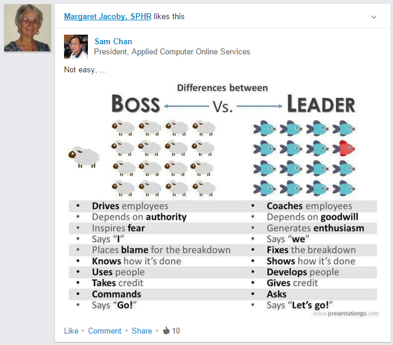
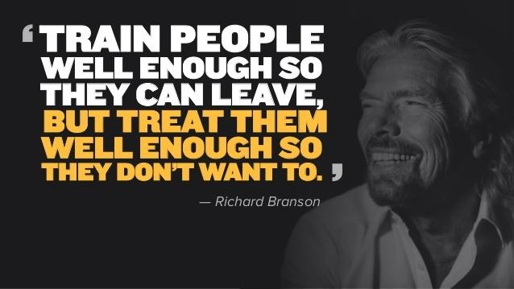

**Table of Contents**
<!-- MarkdownTOC -->

- [Startups](#startups)
	- [Startup related links](#startup-related-links)
	- [Trabajar por el mundo](#trabajar-por-el-mundo)
		- [Barcelona startups](#barcelona-startups)
		- [Madrid startups](#madrid-startups)
	- [Job Search](#job-search)
		- [Portales de empleo](#portales-de-empleo)
	- [Freelance jobs](#freelance-jobs)
		- [Trabajos Freelance](#trabajos-freelance)
	- [Skills That Can Get You Hired in 2016](#skills-that-can-get-you-hired-in-2016)
	- [Human Resources](#human-resources)
		- [Office Politics](#office-politics)
		- [Talks](#talks)
		- [Leadership Blogs](#leadership-blogs)
		- [9 Box Model for classifying people in organizations](#9-box-model-for-classifying-people-in-organizations)
		- [Interview Preparation Guide](#interview-preparation-guide)
			- [Technical Resume](#technical-resume)
		- [Recursos Humanos](#recursos-humanos)
		- [Orientación laboral](#orientación-laboral)

<!-- /MarkdownTOC -->

# Startups
- [La economía crece](mkeiser.md)
- [IT Jobs Watch, Tracking the IT Job Market](http://www.itjobswatch.co.uk/)
- [Global Technology Adoption Index 2015](https://powermore.dell.com/2015-global-technology-adoption-index/)
- [startupheatmap.eu: Where is the Europe's next Silicon Valley?](http://www.startupheatmap.eu/)
- [How Stockholm is becoming Europe's premier tech hub](http://mashable.com/2016/01/22/stockholm-europe-tech-hub/#C7NvqtmU38qY)

## Startup related links
- [ZDnet: Barcelona vs Madrid vs everywhere else: Spain's regions slug it out to be named startup capital](http://www.zdnet.com/article/barcelona-vs-madrid-vs-everywhere-else-spains-regions-slug-it-out-to-be-startup-capital/)
- [webcapitalriesgo.com: Startup Financing in Spain. 2015](https://www.webcapitalriesgo.com/descargas/4714_07_15_353136675.pdf)
- [Startupxplore.com: map with all the IT startups and investors](https://startupxplore.com/)
	- [El inversor de éxito que lucha contra la "burbuja" de las startups](http://startupxplore.com/blog/es/bill-gurley-burbuja-startup/)
- [StartupHeatMap.eu: European Startup Initiative](http://www.startupheatmap.eu/)
- [StartupBlink: Global Startup Industry Map](http://www.startupblink.com/)
- [Glassdoor.com: Best Places to Work in 2016!](https://www.glassdoor.com/Best-Places-to-Work-LST_KQ0,19.htm)
- [ycombinator.com: Y Combinator is a community of over 1,600 founders](http://www.ycombinator.com/)
- [insideanalysis.com: 10 Companies and Technologies to Watch in 2016](http://insideanalysis.com/2016/01/20535/)
- [startup-resources.zeef.com](https://startup-resources.zeef.com)
- [startup.zeef.com](https://startup.zeef.com/)

## Trabajar por el mundo
- [trabajarporelmundo.org](http://trabajarporelmundo.org/)
	- [Tips para crear un buen curriculum para trabajar en Londres](http://trabajarporelmundo.org/tips-para-crear-un-buen-curriculum-para-trabajar-en-londres/)
- [Bristoleños: vivir en UK](http://bristolenos.com)

### Barcelona startups
- [Barcinno.com: Barcelona Tech, Startups and Innovation](http://www.barcinno.com/)
- [bdigital.org: Barcelona Digital Technology Centre](http://www.bdigital.org/en/)
- [BCNanalytics.com](http://bcnanalytics.com/)
- [bsc.es: Barcelona Supercomputing Center](http://www.bsc.es/)
	- [ALOJA project: research centre in Barcelona](http://hadoop.bsc.es/)
- [zdnet.com: Think big data is too big for SMEs? Barcelona's out to prove you wrong](http://www.zdnet.com/article/think-big-data-is-too-big-for-smes-barcelonas-out-to-prove-you-wrong/) The Catalan city has opened a big data center to accelerate business innovation - and hopefully become the most important data processing hub in southern Europe.

### Madrid startups
- [tetuanvalley.com: Tetuan Valley Madrid](http://tetuanvalley.com/)
- [campus.co/madrid: Google’s space for entrepreneurs in Madrid](https://www.campus.co/madrid/en/about)

## Job Search
- [glassdoor.com Best Places to Work](https://www.glassdoor.com/Best-Places-to-Work-LST_KQ0,19.htm)
- [The difference between contracting and consulting, and why it matters](http://www.techrepublic.com/blog/it-consultant/the-difference-between-contracting-and-consulting-and-why-it-matters-125429/)
- [Eures Job Search](https://ec.europa.eu/eures/)
- [make-it-in-germany.com](http://www.make-it-in-germany.com/)
- [prospects.ac.uk](http://www.prospects.ac.uk/)
- [gumtree.com/computing-it-jobs](https://www.gumtree.com/computing-it-jobs)
- [indeed.co.uk](http://www.indeed.co.uk/)
- [monster.co.uk](http://www.monster.co.uk/)
- [AngelList jobs](https://angel.co)
	- [AngelList jobs Barcelona](https://angel.co/barcelona)
	- [AngelList Jobs Madrid](https://angel.co/barcelona)
	- [AngelList Jobs Valencia](https://angel.co/valencia)
	- [AngelList Jobs Bilbao](https://angel.co/bilbao)
	- [AngelList Jobs Sevilla](https://angel.co/sevilla)
	- [AngelList Jobs Malaga](https://angel.co/malaga)
	- [AngelList Jobs Lisbon](https://angel.co/lisbon)
	- [AngelList Jobs Rome](https://angel.co/rome)
	- [AngelList Jobs Milan](https://angel.co/milan-1)
	- [AngelList Jobs Malta](https://angel.co/malta)
	- [AngelList Jobs London](https://angel.co/london)
	- [AngelList Jobs Manchester](https://angel.co/manchester)
	- [AngelList Jobs Birmingham](https://angel.co/birmingham)
	- [AngelList Jobs Glasgow](https://angel.co/glasgow)
	- [AngelList Jobs Dublin](https://angel.co/dublin)
	- [AngelList Jobs Paris](https://angel.co/paris)
	- [AngelList Jobs Berlin](https://angel.co/berlin)
	- [AngelList Jobs Hamburg](https://angel.co/hamburg)
	- [AngelList Jobs Munich](https://angel.co/munich)
	- [AngelList Jobs Vienna](https://angel.co/vienna)
	- [AngelList Jobs Amsterdam](https://angel.co/amsterdam)
	- [AngelList Jobs Stockholm](https://angel.co/stockholm)
	- [AngelList Jobs Copenhagen](https://angel.co/copenhagen)
	- [AngelList Jobs Oslo](https://angel.co/oslo)
	- [AngelList Jobs Helsinki](https://angel.co/helsinki)
	- [AngelList Jobs Tallinn](https://angel.co/tallinn)
	- [AngelList Jobs Riga](https://angel.co/riga-1)
	- [AngelList Jobs Luxembourg](https://angel.co/luxembourg)
	- [AngelList Jobs Zurich](https://angel.co/zurich)
	- [AngelList Jobs Prague](https://angel.co/prague)
	- [AngelList Jobs Warsaw](https://angel.co/warsaw)
	- [AngelList Jobs Budapest](https://angel.co/budapest)
	- [AngelList Jobs Bucharest](https://angel.co/bucharest)
	- [AngelList Jobs Athens](https://angel.co/athens)
- [JobsBCN.com: All Startup Jobs in Barcelona](http://www.jobsbcn.com/)
	- [twitter.com/startupjobsbcn](https://twitter.com/startupjobsbcn)
	- [blog.jobsbcn.com](http://blog.jobsbcn.com)
		- [On IT recruiters](http://blog.jobsbcn.com/index.php/2015/12/29/on-it-recruiters/)
		- [Stock Options in Startups – A scam or something worth a shot?](http://blog.jobsbcn.com/index.php/2016/01/13/stock-options-startups-scam-something-worth-shot/)
- [techstartupjobs.com](http://www.techstartupjobs.com/)
- [tyba.com startup jobs](http://tyba.com/)
- [careers.stackoverflow.com](http://careers.stackoverflow.com/)
	- [twitter.com/StackDevJobs](https://twitter.com/StackDevJobs)
- [jobandtalent.com](http://www.jobandtalent.com)
- [twitter.com/RemoteWorkingCo](https://twitter.com/RemoteWorkingCo)
- [twitter.com/weworkremotely](https://twitter.com/weworkremotely)
- [43 Best Job Search Websites 2016](http://careersherpa.net/43-best-job-search-websites-2016/)

 

<a href="http://inafev.tumblr.com/post/137953413411/to-all-the-people-on-here-looking-for-jobs">http://inafev.tumblr.com/post/137953413411/to-all-the-people-on-here-looking-for-jobs</a>

<a href="http://inafev.tumblr.com/post/137953377381/things-people-reading-your-resume-wish-you-knew">http://inafev.tumblr.com/post/137953377381/things-people-reading-your-resume-wish-you-knew</a>

### Portales de empleo
- [Nubelo](http://www.nubelo.com/)
- [trabajar-en.com](http://trabajar-en.com/)
- [SOC: Servei d'Ocupació de Catalunya](https://www.oficinadetreball.gencat.cat/socweb/opencms/socweb_ca/home.html)
	- [twitter.com/ocupaciocat](https://twitter.com/ocupaciocat)
- [twitter.com/barcelonactiva](https://twitter.com/barcelonactiva)
- [twitter.com/developerbcn](https://twitter.com/developerbcn)
- [twitter.com/bcntechcity](https://twitter.com/bcntechcity)
- [twitter.com/developermadrid](https://twitter.com/developermadrid)
- [portalparados.es](http://www.portalparados.es/)
- [¿Cuáles son los países que más están contratando?](http://www.expansion.com/emprendedores-empleo/empleo/2016/01/04/568ac17b22601d123b8b4635.html)
- [Ofertas laborales para informáticos en Dubái](http://www.consejosgratis.es/ofertas-laborales-para-informaticos-en-dubai/)

## Freelance jobs
- [reddit.com/r/freelance](https://www.reddit.com/r/freelance)
- [crunch.co.uk: The very best freelance job sites](https://www.crunch.co.uk/blog/freelancer-advice/2015/07/24/best-freelance-job-boards-to-find-work/)
	- [upwork.com](https://www.upwork.com/)
	- [onsite.io](http://onsite.io/)
	- [yunojuno.com](https://www.yunojuno.com/)
- [crunch.co.uk: Five freelance job sites that actually pay well](https://www.crunch.co.uk/blog/freelancer-advice/2013/04/15/five-freelance-work-from-home-job-sites-that-actually-pay-well/)
	- [www.3desk.com](http://www.3desk.com)
	- [crew.co](https://crew.co/)
- [entrepreneur.com: The 15 Best Freelance Websites to Find Jobs](http://www.entrepreneur.com/article/245953)
	- [toptal.com](http://www.toptal.com/)
	- [elance.com](https://www.elance.com/)
	- [freelancers.net](http://www.freelancers.net/)
	- [guru.com](http://www.guru.com/)
	- [craigslist.com](http://craigslist.com)
- [huffingtonpost.com: 10 Best Freelance Sites To Find Jobs](http://www.huffingtonpost.com/larry-alton/10-best-freelance-sites-t_b_7445126.html)

### Trabajos Freelance
- [computerhoy.com: Las 10 mejores webs donde conseguir trabajo como freelance](http://computerhoy.com/listas/internet/8-mejores-webs-donde-conseguir-trabajo-como-freelance-8742)

## Skills That Can Get You Hired in 2016
- [The 25 Skills That Can Get You Hired in 2016](http://blog.linkedin.com/2016/01/12/the-25-skills-that-can-get-you-hired-in-2016/)
- [The Best Tech Skills to List on Your Resume](http://www.businessnewsdaily.com/4932-tech-skills-resume.html)
- [forbes.com: 8 Tech Trends Changing How We Work In 2016](http://www.forbes.com/sites/ajagrawal/2016/01/11/8-tech-trends-changing-how-we-work-in-2016/#2715e4857a0b6a27c0767013)
- [businessinsider.com: 17 common mistakes to avoid when you're networking](http://www.businessinsider.com/networking-mistakes-youre-making-2016-1)

## Human Resources
- [careerealism.com](http://www.careerealism.com/)
- [careersherpa.net](http://careersherpa.net)
- [hbr.org: Harvard Business Review - Ideas and Advice for Leaders](https://hbr.org/)
- [How Maslow’s Hierarchy of Needs influences Employee Engagement](http://www.scancapture.co.uk/how-maslows-hierarchy-of-needs-influences-employee-engagement/)
- [What is conservative management style?](http://www.answers.com/Q/What_is_conservative_management_style)
- [9 Signs You Should Run Away From That Job Offer](http://www.inc.com/jt-odonnell/9-signs-you-should-run-away-from-that-job-offer.html)
- [Good vs Bad Leader](http://vladmihalcea.com/2013/12/28/good-vs-bad-leader/)
- [Good Boss, Bad Boss: How to Be the Best... and Learn from the Worst](http://www.amazon.com/Good-Boss-Bad-Learn-Worst/dp/0446556076/ref=pd_sim_sbs_14_1?ie=UTF8&dpID=41iCWG-MEiL&dpSrc=sims&preST=_AC_UL160_SR106%2C160_&refRID=1CGD4PA2V77XTVWRXXW6)
- [medium: Oh Sh*t. Your top female talent is pregnant](https://medium.com/swlh/oh-sh-t-your-top-female-talent-is-pregnant-7625cbc0a755)
- [modelviewculture.com: The Full-Stack Employee and The Glorification of Generalization](https://modelviewculture.com/news/the-full-stack-employee-and-the-glorification-of-generalization)
- [The complex reality of adopting a meaningful code of conduct](https://subfictional.com/2016/01/25/the-complex-reality-of-adopting-a-meaningful-code-of-conduct/)
- [8 phrases to eliminate from your work vocabulary](http://www.businessinsider.com/phrases-to-eliminate-from-your-work-vocab-2016-1)
- [Don't let 'jerks' ruin your day — here's how to overcome their bad energy at work](http://www.businessinsider.com/avoid-jerks-work-bad-energy-2016-1)
- [Can You Be Friends With Your Boss?](https://hbr.org/2014/11/can-you-be-friends-with-your-boss)
- [It’s Better to Avoid a Toxic Employee than Hire a Superstar](https://hbr.org/2015/12/its-better-to-avoid-a-toxic-employee-than-hire-a-superstar)
- [24 signs you have a terrible boss](http://www.businessinsider.com/signs-you-have-a-bad-boss-2016-2-4)
- [GitHub is undergoing a full-blown overhaul as execs and employees depart — and we have the full inside story](http://www.businessinsider.com/github-the-full-inside-story-2016-2)
- [enterprisersproject.com: Why too much talent is wasted by managers not daring to lose control](https://enterprisersproject.com/article/2014/11/cios-and-ctos-empower-your-teams)

<iframe width="560" height="315" src="https://www.youtube.com/embed/H4gOYlBO0ys" frameborder="0" allowfullscreen class="video"></iframe>

 

### Office Politics
- [Forbes.com: Office Politics: Must You Play? A Handbook For Survival/Success](http://www.forbes.com/sites/cherylsnappconner/2013/04/14/office-politics-must-you-play-a-handbook-for-survivalsuccess/)
- [Setting up to fail](https://en.wikipedia.org/wiki/Setting_up_to_fail)
- [businessinsider.com: Only idiots don't play office politics — here's how to master the game](http://www.businessinsider.com/how-to-play-office-politics-2015-3)
- [Apple CEO Tim Cook on Collaboration and Office Politics](https://youtu.be/EZPYLZ7I6gs)
- [An Introvert's Guide to Surviving Team Lunches](http://goingconcern.com/post/introverts-guide-surviving-team-lunches)
- [workplace.stackexchange.com: Staying late for appearance?](http://workplace.stackexchange.com/questions/50655/staying-late-for-appearance)

<iframe width="560" height="315" src="https://www.youtube.com/embed/EZPYLZ7I6gs" frameborder="0" allowfullscreen class="video"></iframe>

 

### Talks
- [Apple CEO Tim Cook on Collaboration](https://youtu.be/EZPYLZ7I6gs)
- [Ted Talks. Susan Cain: The power of introverts](http://www.ted.com/talks/susan_cain_the_power_of_introverts)
- [Simon Sinek: If You Don't Understand People, You Don't Understand Business](https://youtu.be/llKvV8_T95M)
- [Simon Sinek: Love Your Work](https://youtu.be/jDIZS4IQlQk)
- [The 7 Habits of Highly Effective People](https://youtu.be/ktlTxC4QG8g)

### Leadership Blogs
- [forbes.com/leadership](http://www.forbes.com/leadership)
- [Addicted to success](http://addicted2success.com)
- [Quiet Revolution: Unlocking the Power of Introverts. Susan Cain](http://www.quietrev.com)

<iframe src="https://embed-ssl.ted.com/talks/susan_cain_the_power_of_introverts.html" width="640" height="360" frameborder="0" scrolling="no" webkitAllowFullScreen mozallowfullscreen allowFullScreen class="video"></iframe>

 

<iframe width="420" height="315" src="https://www.youtube-nocookie.com/embed/llKvV8_T95M?rel=0" frameborder="0" allowfullscreen class="video"></iframe>

 

### 9 Box Model for classifying people in organizations
- [slideshare.net: 9 Box Model for classifying people in organizations](http://es.slideshare.net/ryancruz08/9-box-model-with-titles)
- [slideshare.net: 9 Box Performance-Potential Matrix](http://www.slideshare.net/shakib362/9-box)

### Interview Preparation Guide
- [Interview Preparation Guide](https://github.com/ride/interview-prep)
- [The Ultimate Guide to Acing Your Skype Interview](https://www.themuse.com/advice/the-ultimate-guide-to-acing-your-skype-interview)
- [7 Questions Only the Smartest Job Candidates Ask](http://www.inc.com/jeff-haden/7-insightful-questions-only-the-best-job-candidates-think-to-ask.html)
- [7 Lies Employers Use To Trick You Into Working For Them](https://www.linkedin.com/pulse/7-lies-employers-use-trick-you-working-them-j-t-o-donnell)
- [10 Questions Never to Ask in an Interview](http://www.mjms.net/blog/10-questions-never-to-ask-in-an-interview/)
- [Sorry, Recruiters! My Salary History Is None of Your Business](https://www.linkedin.com/pulse/sorry-recruiters-my-salary-history-none-your-business-liz-ryan)
- [Mapping the European ICT Poles of Excellence: The Atlas of ICT Activity in Europe](http://ipts.jrc.ec.europa.eu/publications/pub.cfm?id=7140)
	- [robertwalters.co.uk Salary Survey](https://www.robertwalters.co.uk/salarysurvey.html)
- [Resume Dilemma: Employment Gaps and Job-Hopping](http://career-advice.monster.com/resumes-cover-letters/resume-writing-tips/resume-dilemma-employment-gaps/article.aspx)
- [10 Questions to Ask Before You Take a New Job](http://www.levo.com/articles/career-advice/10-questions-to-ask-before-you-take-a-new-job)
- [5 Reasons You May Not Want to Work for Google](https://www.linkedin.com/pulse/20140603115508-7668018-5-reasons-you-may-not-want-to-work-for-google)
- [An Interview Is a Conversation, Not an Interrogation](http://career-advice.monster.com/job-interview/interview-preparation/tame-hostile-interviewer/article.aspx)
- [monster.com: Your Turn to Ask Questions](http://career-advice.monster.com/job-interview/interview-questions/your-turn-to-ask-questions/article.aspx)
- [businessinsider.com: The 29 smartest questions to ask at the end of every job interview](http://www.businessinsider.com/questions-to-ask-in-a-job-interview-2016-1)
- [How to get any job you want — even if you're not technically qualified](http://www.businessinsider.com/how-to-get-any-job-you-want-even-if-youre-not-technically-qualified-2016-1)
- [Surviving the technical interview](https://wilsonericn.wordpress.com/2012/10/29/surviving-the-technical-interview/)

#### Technical Resume
- [Why I Like People with Unconventional Resumés](https://hbr.org/2012/07/why-i-like-people-with-unconve)
- [The 6 Musts of a Cover Letter](http://www.entrepreneur.com/article/269614)
- [How to rock your tech resume (3 steps)](http://learntocodewith.me/posts/tech-resumes/) Just how you dislike writing your resume, hiring managers dislike reviewing them.
- [Job Interview Thank You Letter Sample](http://jobsearch.about.com/od/thankyouletters/a/blthank.htm)

### Recursos Humanos
- [elblogderrhh.com](http://www.elblogderrhh.com/)
	- [¿Soy imprescindible en mi puesto de trabajo?](http://www.elblogderrhh.com/2008/04/soy-imprescindible-en-mi-puesto-de.html)
- [equiposytalento.com](http://www.equiposytalento.com/)
- [RRHH Press - Actualidad y noticias sobre recursos humanos, RRHH, laboral y empleo](http://www.rrhhpress.com)
- [Buen jefe, mal jefe (Spanish Edition)](http://www.amazon.com/dp/0307882934/)
- [El jefe de RRHH de Google es tajante: "El expediente académico no sirve para nada"](http://www.elconfidencial.com/alma-corazon-vida/2013-06-28/el-expediente-academico-no-sirve-para-nada-asegura-el-responsable-de-rrhh-de-google_501910/)
- [Nepotismo y amiguismo: lo bueno y lo malo de los favores en el trabajo](http://www.bbc.com/mundo/noticias/2015/10/151011_vert_cap_nepotismo_en_empreas_yv)
- [Spanish Beautynomics o Cómo usted puede llegar a verse sin empleo](http://www.gurusblog.com/archives/spanish-beautynomics-o-como-usted-puede-llegar-a-verse-sin-empleo/30/11/2015/)
- [9 cosas que hacen los jefes que obligan a renunciar](http://www.soyentrepreneur.com/29403-9-cosas-que-hacen-los-jefes-que-obligan-a-renunciar.html)

### Orientación laboral
- [orientacion-laboral.infojobs.net](https://orientacion-laboral.infojobs.net)
	- [Webinar | Cómo enamorar a tu seleccionador](https://orientacion-laboral.infojobs.net/webinar-como-enamorar-al-seleccionador)
- [¿Os habéis arrepentido en alguna ocasión de no preguntar determinadas cosas en la entrevista de trabajo?](http://www.elblogderrhh.com/2011/02/%C2%BFos-habeis-arrepentido-en-alguna-ocasion-de-no-preguntar-determinadas-cosas-en-la-entrevista-de-trabajo.html)
- [Los sueldos informáticos en Europa](http://www.think-progress.com/es/blog/posts/los-sueldos-informaticos-en-europa/)

