**Table of Contents**
<!-- MarkdownTOC -->

- [Startups and IT Jobs](#startups-and-it-jobs)
	- [Startup related links](#startup-related-links)
		- [Startup Blogs, Documentaries and Talks](#startup-blogs-documentaries-and-talks)
	- [IT remuneration](#it-remuneration)
	- [Trabajar por el mundo](#trabajar-por-el-mundo)
		- [Barcelona Tech, Startups and Innovation](#barcelona-tech-startups-and-innovation)
		- [Madrid Tech, Startups and Innovation](#madrid-tech-startups-and-innovation)
	- [Worst tech mergers and acquisitions](#worst-tech-mergers-and-acquisitions)
	- [Job Search](#job-search)
		- [Portales de empleo](#portales-de-empleo)
	- [Leadership Styles Around the World](#leadership-styles-around-the-world)
- [Freelance jobs](#freelance-jobs)
- [Skills That Can Get You Hired in 2016](#skills-that-can-get-you-hired-in-2016)

<!-- /MarkdownTOC -->

<blockquote class="twitter-tweet tw-align-center" data-lang="es">
.<a href="https://twitter.com/HarvardBiz">@HarvardBiz</a> - The Most <a href="https://twitter.com/hashtag/DigitalCompanies?src=hash">#DigitalCompanies</a> Are Leaving All the Rest Behind <a href="https://t.co/VxZ2O5KG2g">https://t.co/VxZ2O5KG2g</a> <a href="https://twitter.com/hashtag/DigitalDivide?src=hash">#DigitalDivide</a> <a href="https://twitter.com/hashtag/DigitalTransformation?src=hash">#DigitalTransformation</a>
&mdash; Red Hat Cloud (@RedHatCloud) <a href="https://twitter.com/RedHatCloud/status/707168141080526848">8 de marzo de 2016</a></blockquote>

<blockquote class="twitter-tweet tw-align-center" data-lang="es">
&quot;Stop breaking new ground. Use boring, mature, tech.&quot; <a href="https://twitter.com/hashtag/mysql?src=hash">#mysql</a> works fine, and you can google for help.&quot; <a href="https://t.co/14RhaDKsXp">https://t.co/14RhaDKsXp</a>
&mdash; Anthony Pisapia (@anthonypisapia) <a href="https://twitter.com/anthonypisapia/status/737500073483866112">31 de mayo de 2016</a></blockquote>

<blockquote class="twitter-tweet tw-align-center" data-lang="es">
<a href="http://t.co/y4bCU81M9H">pic.twitter.com/y4bCU81M9H</a>
&mdash; Oasis (@oasis) <a href="https://twitter.com/oasis/status/653631226687787009">12 de octubre de 2015</a></blockquote>

<blockquote class="twitter-tweet tw-align-center" data-lang="es">
Do you understand the problem? &quot;What&#39;s the Problem?&quot; Clip from &quot;Moneyball&quot;.mov <a href="http://t.co/UJvo8IbTdj">http://t.co/UJvo8IbTdj</a>
&mdash; John Andrews (@Katadhin) <a href="https://twitter.com/Katadhin/status/604255188367482880">29 de mayo de 2015</a></blockquote>

[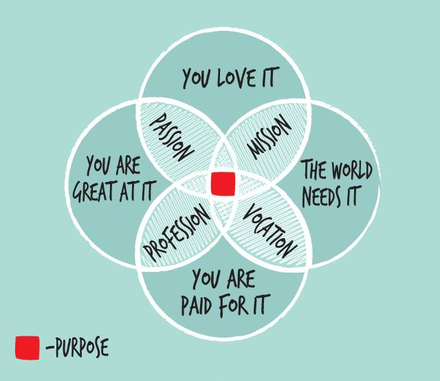](http://multivariablesolutions.com/strategy/purpose-why-it-matters-and-who-it-matters-to/)

<iframe width="560" height="315" src="https://www.youtube.com/embed/nCfntaYBeqs?rel=0" frameborder="0" allowfullscreen class="video"></iframe>

 

<blockquote class="twitter-tweet tw-align-center" data-lang="es">
Working in IT <a href="https://t.co/si5gm0FunB">https://t.co/si5gm0FunB</a>
&mdash; nixCraft (@nixcraft) <a href="https://twitter.com/nixcraft/status/714901664390455296">29 de marzo de 2016</a></blockquote>

<blockquote class="twitter-tweet tw-align-center" data-lang="es">
.<a href="https://twitter.com/HarvardBiz">@HarvardBiz</a> article explores which industries are being the most disrupted by <a href="https://twitter.com/hashtag/digital?src=hash">#digital</a> <a href="https://t.co/nOIzk0IRZC">https://t.co/nOIzk0IRZC</a> <a href="https://twitter.com/hashtag/DigitalDisruption?src=hash">#DigitalDisruption</a>
&mdash; Red Hat Cloud (@RedHatCloud) <a href="https://twitter.com/RedHatCloud/status/715148572556038144">30 de marzo de 2016</a></blockquote>

<blockquote class="twitter-tweet tw-align-center" data-lang="es">
Las cinco mayores empresas del mundo en liquidez son tecnológicas. Apple, Microsoft, Google, Cisco y Oracle poseen $ 504.000 millones
&mdash; Jose Grasso (@josegrasso) <a href="https://twitter.com/josegrasso/status/734086431048601600">21 de mayo de 2016</a></blockquote>

<blockquote class="twitter-tweet tw-align-center" data-lang="es">
Los 4 retos de la banca. <a href="https://twitter.com/hashtag/finanzas?src=hash">#finanzas</a> <a href="https://twitter.com/hashtag/economia?src=hash">#economia</a> <a href="https://t.co/tGdyw7qEEO">pic.twitter.com/tGdyw7qEEO</a>
&mdash; José Manuel García (@abcTraderClub) <a href="https://twitter.com/abcTraderClub/status/737369361019764736">30 de mayo de 2016</a></blockquote>

<iframe width="560" height="315" src="https://www.youtube.com/embed/UYtbFu8q-ts?rel=0" frameborder="0" allowfullscreen class="video"></iframe>

 

[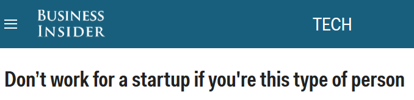](http://www.businessinsider.com/dont-work-for-a-startup-2016-3)

[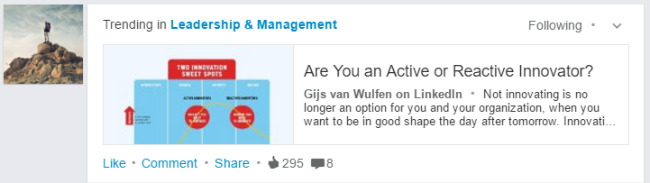](https://www.linkedin.com/pulse/you-active-reactive-innovator-gijs-van-wulfen?trk=hp-feed-article-title-channel-add)

# Startups and IT Jobs
- [La economía crece 🌟](mkeiser.md)
- [IT Jobs Watch, Tracking the IT Job Market 🌟🌟](http://www.itjobswatch.co.uk/)
- [Global Technology Adoption Index 2015](https://powermore.dell.com/2015-global-technology-adoption-index/)
- [startupheatmap.eu: Where is the Europe's next Silicon Valley? 🌟](http://www.startupheatmap.eu/)
- [How Stockholm is becoming Europe's premier tech hub](http://mashable.com/2016/01/22/stockholm-europe-tech-hub/#C7NvqtmU38qY)
- [European Commission - Mapping the European ICT Poles of Excellence: The Atlas of ICT Activity in Europe](http://ipts.jrc.ec.europa.eu/publications/pub.cfm?id=7140)

<blockquote class="twitter-tweet tw-align-center" data-lang="es">
&quot;Failure is simply the opportunity to begin again, this time more intelligently.&quot; --Henry Ford <a href="https://twitter.com/hashtag/quoteoftheday?src=hash">#quoteoftheday</a>
&mdash; nixCraft (@nixcraft) <a href="https://twitter.com/nixcraft/status/715644488597643264">31 de marzo de 2016</a></blockquote>

## Startup related links
- [ZDnet: Barcelona vs Madrid vs everywhere else: Spain's regions slug it out to be named startup capital 🌟🌟🌟](http://www.zdnet.com/article/barcelona-vs-madrid-vs-everywhere-else-spains-regions-slug-it-out-to-be-startup-capital/)
- [webcapitalriesgo.com: Startup Financing in Spain. 2015](https://www.webcapitalriesgo.com/descargas/4714_07_15_353136675.pdf)
- [Startupxplore.com: map with all the IT startups and investors](https://startupxplore.com/)
	- [El inversor de éxito que lucha contra la "burbuja" de las startups](http://startupxplore.com/blog/es/bill-gurley-burbuja-startup/)
- [StartupHeatMap.eu: European Startup Initiative 🌟](http://www.startupheatmap.eu/)
- [StartupBlink: Global Startup Industry Map](http://www.startupblink.com/)
- [Glassdoor.com: Best Places to Work in 2016!](https://www.glassdoor.com/Best-Places-to-Work-LST_KQ0,19.htm)
- [ycombinator.com: Y Combinator is a community of over 1,600 founders](http://www.ycombinator.com/)
- [insideanalysis.com: 10 Companies and Technologies to Watch in 2016](http://insideanalysis.com/2016/01/20535/)
- [startup-resources.zeef.com](https://startup-resources.zeef.com)
- [startup.zeef.com](https://startup.zeef.com/)
- [Mark Cuban's 12 Rules for Startups 🌟](http://www.entrepreneur.com/article/222524)
- [Why new companies have it way easier now than a decade ago 🌟](http://www.businessinsider.com/launching-startup-changed-drastically-stewart-butterfield-slack-flickr-2015-6)
- [Reddit CTO: Stick to Boring Tech when Building Your Startup 🌟🌟🌟🌟](http://thenewstack.io/reddit-cto-sxsw-stick-boring-tech-building-start/)

<blockquote class="twitter-tweet tw-align-center" data-lang="es">
Spain’s startup ecosystem on a roll, especially in <a href="https://twitter.com/hashtag/Barcelona?src=hash">#Barcelona</a> &amp; <a href="https://twitter.com/hashtag/Madrid?src=hash">#Madrid</a>. Interesting post-recession effect. <a href="https://t.co/Q9aB5AaVO3">https://t.co/Q9aB5AaVO3</a>
&mdash; Markus Schuller (@panthera_s) <a href="https://twitter.com/panthera_s/status/701290454424354816">21 de febrero de 2016</a></blockquote>

<blockquote class="twitter-tweet tw-align-center" data-lang="es">
Success is no accident. <a href="https://t.co/Fp3Q8zMtzU">pic.twitter.com/Fp3Q8zMtzU</a>
&mdash; The Wolf of Wall St. (@TheWolfofWaIlSt) <a href="https://twitter.com/TheWolfofWaIlSt/status/704101309914476544">29 de febrero de 2016</a></blockquote>

<blockquote class="twitter-tweet tw-align-center" data-lang="es">
<a href="https://twitter.com/hashtag/Google?src=hash">#Google</a>  was the 21st search engine to enter market in 1998.  Here&#39;s Google&#39;s headquarters and data center in 1998 <a href="https://t.co/Vv8qhBsycw">pic.twitter.com/Vv8qhBsycw</a>
&mdash; TecMint.com (@tecmint) <a href="https://twitter.com/tecmint/status/719183535815335937">10 de abril de 2016</a></blockquote>

### Startup Blogs, Documentaries and Talks
- [entrepreneur.com 🌟](http://www.entrepreneur.com)
- [soyentrepreneur.com](http://www.soyentrepreneur.com)
- [15 documentaries on Netflix that will make you smarter about business](http://www.businessinsider.com/business-documentaries-on-netflix-watch-instantly-2016-1)
- [7 TED Talks you should watch if you want to be an entrepreneur](http://www.businessinsider.com/ted-talks-you-should-watch-if-you-want-to-be-an-entrepreneur-2016-2)

<blockquote class="twitter-tweet tw-align-center" data-lang="es">
<a href="https://twitter.com/hashtag/whydevops?src=hash">#whydevops</a> RT &quot;<a href="https://twitter.com/StartupLJackson">@StartupLJackson</a>: The Internet is no longer a technology. The Internet is a psychology experiment. <a href="http://t.co/AI84hYuhdz">http://t.co/AI84hYuhdz</a>&quot;
&mdash; Eric Callen (@cogitoergoBOFH) <a href="https://twitter.com/cogitoergoBOFH/status/478927401573834752">junio 17, 2014</a></blockquote>

<iframe width="560" height="315" src="https://www.youtube.com/embed/camXWnD4QcI?rel=0" frameborder="0" allowfullscreen class="video"></iframe>

 

<blockquote class="twitter-tweet tw-align-center" data-lang="es">
7 Consejos del Lobo de Wall Street.<a href="https://twitter.com/CoachMACMx">@CoachMACMx</a> Formando negocios con <a href="https://twitter.com/hashtag/exito?src=hash">#exito</a> <a href="https://t.co/7srgq3VHdV">https://t.co/7srgq3VHdV</a>
&mdash; CoachMAC (@CoachMACMx) <a href="https://twitter.com/CoachMACMx/status/708304155819905025">11 de marzo de 2016</a></blockquote>

<blockquote class="twitter-tweet tw-align-center" data-lang="es">
1:Sell me this pen. 2:Write your name down 1:I can&#39;t I don&#39;t have a pen 2:And that my friend is supply and demand - The Wolf Of Wall Street
&mdash; ItsYaBoy (@SquadLogan) <a href="https://twitter.com/SquadLogan/status/574669571904249856">8 de marzo de 2015</a></blockquote>

<blockquote class="twitter-tweet tw-align-center" data-lang="es">
The Perfect Answer to... &quot;Sell Me This Pen&quot; - Wolf of Wall Street<a href="https://twitter.com/hashtag/Careers?src=hash">#Careers</a> <a href="https://twitter.com/hashtag/Sales?src=hash">#Sales</a> <a href="https://twitter.com/hashtag/Jobs?src=hash">#Jobs</a><a href="https://t.co/B5BZds1YyC">https://t.co/B5BZds1YyC</a>
&mdash; Maverick Method (@MaverickMethod) <a href="https://twitter.com/MaverickMethod/status/699789490748059648">17 de febrero de 2016</a></blockquote>

<blockquote class="twitter-tweet tw-align-center" data-lang="es">
Si te ofrecen un nuevo proyecto &quot;Show Me the Money!&quot; Jerry Maguire (1996) HD <a href="https://t.co/Jq2uoxN1Zo">https://t.co/Jq2uoxN1Zo</a> via <a href="https://twitter.com/YouTube">@YouTube</a>
&mdash; josegarrido (@josegarrido) <a href="https://twitter.com/josegarrido/status/705165107110793216">2 de marzo de 2016</a></blockquote>

<blockquote class="twitter-tweet tw-align-center" data-lang="es">
An artistic rendering of today&#39;s employment <a href="https://t.co/bMVMy7QqHA">https://t.co/bMVMy7QqHA</a>
&mdash; Faretta (@Michael_Faretta) <a href="https://twitter.com/Michael_Faretta/status/707023474686963713">8 de marzo de 2016</a></blockquote>

<blockquote class="twitter-tweet tw-align-center" data-lang="es">
Never give up inspirational scene from <a href="https://twitter.com/hashtag/moneyball?src=hash">#moneyball</a> <a href="https://twitter.com/hashtag/softball?src=hash">#softball</a>.  <a href="http://t.co/8xWdzpkY">http://t.co/8xWdzpkY</a>
&mdash; Fordson Softball (@fordsonsoftball) <a href="https://twitter.com/fordsonsoftball/status/270859379287400448">20 de noviembre de 2012</a></blockquote>

[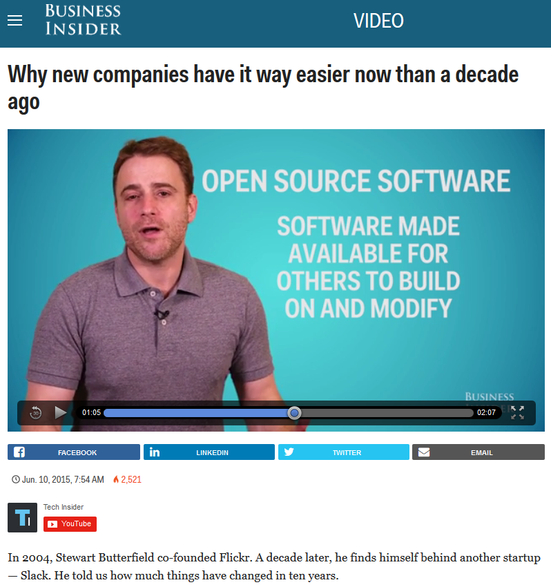](http://www.businessinsider.com/launching-startup-changed-drastically-stewart-butterfield-slack-flickr-2015-6)

## IT remuneration
- [July 2015 IT remuneration report is out… Tech pay packages dip, demand for top talent grows](http://whatisitwellington.com/2015/07/14/july-2015-it-remuneration-report-is-out-tech-pay-packages-dip-demand-for-top-talent-grows-absoluteit/)

## Trabajar por el mundo
- [Las 10 ciudades más caras para vivir y trabajar](http://cnnespanol.cnn.com/2016/03/03/las-10-ciudades-mas-caras-para-vivir-y-trabajar/)
- [trabajarporelmundo.org 🌟](http://trabajarporelmundo.org/)
	- [Tips para crear un buen curriculum para trabajar en Londres 🌟🌟](http://trabajarporelmundo.org/tips-para-crear-un-buen-curriculum-para-trabajar-en-londres/)
- [spaniards.es](http://www.spaniards.es)
- [Bristoleños: vivir en UK 🌟](http://bristolenos.com)
	- [Guía definitiva para vivir en UK: Leer antes de emigrar 🌟🌟🌟](http://bristolenos.com/2015/06/08/guia-definitiva-para-vivir-en-uk-leer-antes-de-emigrar/)
- [Espanish in London 🌟](http://www.espanishinlondon.com)
- [destinoreinounido.com 🌟](http://destinoreinounido.com)
- [aventurasenbritishlandia.com](https://aventurasenbritishlandia.com)
- [comosobrevivirenlondres.com 🌟](http://comosobrevivirenlondres.com)
- ["I was born in London but I no longer recognise this city" 🌟🌟](http://www.economist.com/news/books-and-arts/21689519-how-british-capital-being-remade-beyond-glitter)
- [London, I love you, but you’re bringing me down 🌟](http://matadornetwork.com/notebook/london-love-youre-bringing/)
- [cityam.com - London house prices: UK capital is most expensive place in the world for a company to employ staff, as real estate recovery shifts from east to west 🌟](http://www.cityam.com/235697/london-house-prices-uk-capital-is-most-expensive-place-in-the-world-for-a-company-to-employ-staff-as-real-estate-recovery-shifts-from-east-to-west)
- [Para vivir en Irlanda](http://www.paravivirenirlanda.com)
- [Quiero ir a vivir a Dublin](http://quieroiraviviradublin.blogspot.com.es)
	- [no dogma podcast: What Ireland Offers the Tech World 🌟](http://nodogmapodcast.bryanhogan.net/41-ken-finnegan-what-ireland-offers/)
- [Berlín en español](http://berlinenespanol.net)
- [Asociación española de profesionales en Holanda](http://profesionalesholanda.org)
- [volvemos.org 🌟🌟🌟](http://www.volvemos.org)

<blockquote class="twitter-tweet tw-align-center" data-lang="es">
MLK 🙌 <a href="https://t.co/cmBvC6EMVi">pic.twitter.com/cmBvC6EMVi</a>
&mdash; The Wolf of Wall St. (@TheWolfofWaIlSt) <a href="https://twitter.com/TheWolfofWaIlSt/status/703653452447096832">27 de febrero de 2016</a></blockquote>

<blockquote class="twitter-tweet tw-align-center" data-lang="es">
«Ir y quedarse». Artículo del académico <a href="https://twitter.com/amunozmolina">@amunozmolina</a> en <a href="https://twitter.com/babelia_elpais">@babelia_elpais</a> | <a href="https://t.co/HATYoW3QPv">https://t.co/HATYoW3QPv</a>
&mdash; RAE (@RAEinforma) <a href="https://twitter.com/RAEinforma/status/708741921196417024">12 de marzo de 2016</a></blockquote>

<blockquote class="twitter-tweet tw-align-center" data-lang="es">
Britain&#39;s most hipster city is also one of its richest <a href="https://t.co/EMspIF3sjr">https://t.co/EMspIF3sjr</a> <a href="https://t.co/vHjoV0iLwf">pic.twitter.com/vHjoV0iLwf</a>
&mdash; The Economist (@TheEconomist) <a href="https://twitter.com/TheEconomist/status/711583779475890176">20 de marzo de 2016</a></blockquote>

<blockquote class="twitter-tweet tw-align-center" data-lang="es">
Mapa mundial del desempleo. <a href="https://twitter.com/hashtag/empleo?src=hash">#empleo</a> <a href="https://twitter.com/hashtag/paro?src=hash">#paro</a> <a href="https://t.co/cuy1ju7xCy">pic.twitter.com/cuy1ju7xCy</a>
&mdash; José Manuel García (@abcTraderClub) <a href="https://twitter.com/abcTraderClub/status/710463801561325568">17 de marzo de 2016</a></blockquote>

<blockquote class="twitter-tweet tw-align-center" data-lang="es">
La crisis de desempleo juvenil en Europa se mantiene. <a href="https://t.co/BkG5Oiojpg">https://t.co/BkG5Oiojpg</a> <a href="https://twitter.com/hashtag/empleo?src=hash">#empleo</a>
&mdash; José Manuel García (@abcTraderClub) <a href="https://twitter.com/abcTraderClub/status/737603693323771904">31 de mayo de 2016</a></blockquote>

<blockquote class="twitter-tweet tw-align-center" data-lang="es">
Most millennials work more than 40 hours a week. These countries lead the world in hours: <a href="https://t.co/tCqxOauU8y">https://t.co/tCqxOauU8y</a> <a href="https://t.co/oc9bbpxWqg">pic.twitter.com/oc9bbpxWqg</a>
&mdash; Forbes (@Forbes) <a href="https://twitter.com/Forbes/status/735889744551378946">26 de mayo de 2016</a></blockquote>

<blockquote class="twitter-tweet tw-align-center" data-lang="es">
How work-life balance became work all the time <a href="https://t.co/KiUNVxWtFa">https://t.co/KiUNVxWtFa</a>  <a href="https://twitter.com/hashtag/gender?src=hash">#gender</a> <a href="https://t.co/M9v5JTtVGk">pic.twitter.com/M9v5JTtVGk</a>
&mdash; World Economic Forum (@wef) <a href="https://twitter.com/wef/status/739202327089942528">4 de junio de 2016</a></blockquote>

<blockquote class="twitter-tweet tw-align-center" data-lang="es">
Las empresas más rentables del <a href="https://twitter.com/hashtag/IBEX?src=hash">#IBEX</a> desde 2007. <a href="https://twitter.com/hashtag/bolsa?src=hash">#bolsa</a> <a href="https://t.co/hOBcX0ijUp">pic.twitter.com/hOBcX0ijUp</a>
&mdash; José Manuel García (@abcTraderClub) <a href="https://twitter.com/abcTraderClub/status/719973144006672385">12 de abril de 2016</a></blockquote>

<blockquote class="twitter-tweet tw-align-center" data-lang="es">
Los gigantes tecnológicos acumulan $1,680,000,000,000 en caja. No se ni como se dice el ese numero 😄 vía <a href="https://twitter.com/ValaAfshar">@ValaAfshar</a> <a href="https://t.co/sPXtUzTU2Q">pic.twitter.com/sPXtUzTU2Q</a>
&mdash; Roberto García Esteb (@72rge) <a href="https://twitter.com/72rge/status/737377154783182848">30 de mayo de 2016</a></blockquote>

<iframe width="560" height="315" src="https://www.youtube.com/embed/jNk1Wr6jLOM?rel=0" frameborder="0" allowfullscreen class="video"></iframe>

 

### Barcelona Tech, Startups and Innovation
- [Barcelona Tech, Startups and Innovation](startups_bcn.md)

<iframe width="560" height="315" src="https://www.youtube.com/embed/WHmYFI6SZbI?rel=0" frameborder="0" allowfullscreen class="video"></iframe>

 

### Madrid Tech, Startups and Innovation
- [Madrid Tech, Startups and Innovation](startups_madrid.md)

## Worst tech mergers and acquisitions
- [Worst tech mergers and acquisitions: Oracle and Sun, and the sad tale of Palm](http://www.zdnet.com/article/worst-tech-mergers-and-acquisitions-oracle-and-sun-and-the-sad-tale-of-palm/)
- [Worst tech mergers and acquisitions: HP and Autonomy, Google and Motorola, and more](http://www.zdnet.com/article/worst-tech-mergers-and-acquisitions-hp-and-autonomy-google-and-motorola-and-more/)

## Job Search
- [businessculture.org 🌟](http://businessculture.org)
- [glassdoor.com Best Places to Work](https://www.glassdoor.com/Best-Places-to-Work-LST_KQ0,19.htm)
- [The difference between contracting and consulting, and why it matters 🌟🌟🌟](http://www.techrepublic.com/blog/it-consultant/the-difference-between-contracting-and-consulting-and-why-it-matters-125429/)
- [techrepublic.com: 10 routes to IT job security 🌟](http://www.techrepublic.com/blog/10-things/10-routes-to-job-security/)
- [The 23 cities with the best quality of life in the world 🌟](http://uk.businessinsider.com/mercer-2016-quality-of-living-worldwide-city-rankings-2016-2)
- [Eures Job Search](https://ec.europa.eu/eures/)
	- [Eures network: helping people to find a job in another EU country](http://www.europarl.europa.eu/news/en/news-room/20150622STO69009/Eures-network-helping-people-to-find-a-job-in-another-EU-country)
	- [European Parliament EPTV: Taking the sting out of cross-border job hunting](http://www.europarltv.europa.eu/en/player.aspx?pid=44d2a5b5-835c-41dd-9afd-a5b100d20c5f)
- [make-it-in-germany.com](http://www.make-it-in-germany.com/)
- [prospects.ac.uk](http://www.prospects.ac.uk/)
- [gumtree.com/computing-it-jobs](https://www.gumtree.com/computing-it-jobs)
- [indeed.co.uk](http://www.indeed.co.uk/)
- [monster.co.uk 🌟](http://www.monster.co.uk/)
- [talentclue.com 🌟](https://talentclue.com)
- [landing.jobs](https://landing.jobs)
- [europelanguagejobs.com](http://www.europelanguagejobs.com) ¿Eres poliglota? Europe Language Jobs es un portal de empleo que está buscando gente que hable distintos idiomas para puestos en el UK y en toda Europa.
- [AngelList jobs 🌟🌟🌟](https://angel.co)
	- [AngelList jobs Barcelona](https://angel.co/barcelona)
	- [AngelList Jobs Madrid](https://angel.co/barcelona)
	- [AngelList Jobs Valencia](https://angel.co/valencia)
	- [AngelList Jobs Bilbao](https://angel.co/bilbao)
	- [AngelList Jobs Sevilla](https://angel.co/sevilla)
	- [AngelList Jobs Malaga](https://angel.co/malaga)
	- [AngelList Jobs Lisbon](https://angel.co/lisbon)
	- [AngelList Jobs Rome](https://angel.co/rome)
	- [AngelList Jobs Milan](https://angel.co/milan-1)
	- [AngelList Jobs Malta](https://angel.co/malta)
	- [AngelList Jobs London](https://angel.co/london)
	- [AngelList Jobs Manchester](https://angel.co/manchester)
	- [AngelList Jobs Birmingham](https://angel.co/birmingham)
	- [AngelList Jobs Glasgow](https://angel.co/glasgow)
	- [AngelList Jobs Dublin](https://angel.co/dublin)
	- [AngelList Jobs Paris](https://angel.co/paris)
	- [AngelList Jobs Berlin](https://angel.co/berlin)
	- [AngelList Jobs Hamburg](https://angel.co/hamburg)
	- [AngelList Jobs Munich](https://angel.co/munich)
	- [AngelList Jobs Vienna](https://angel.co/vienna)
	- [AngelList Jobs Amsterdam](https://angel.co/amsterdam)
	- [AngelList Jobs Stockholm](https://angel.co/stockholm)
	- [AngelList Jobs Copenhagen](https://angel.co/copenhagen)
	- [AngelList Jobs Oslo](https://angel.co/oslo)
	- [AngelList Jobs Helsinki](https://angel.co/helsinki)
	- [AngelList Jobs Tallinn](https://angel.co/tallinn)
	- [AngelList Jobs Riga](https://angel.co/riga-1)
	- [AngelList Jobs Luxembourg](https://angel.co/luxembourg)
	- [AngelList Jobs Zurich](https://angel.co/zurich)
	- [AngelList Jobs Prague](https://angel.co/prague)
	- [AngelList Jobs Warsaw](https://angel.co/warsaw)
	- [AngelList Jobs Budapest](https://angel.co/budapest)
	- [AngelList Jobs Bucharest](https://angel.co/bucharest)
	- [AngelList Jobs Athens](https://angel.co/athens)
- [JobsBCN.com: All Startup Jobs in Barcelona 🌟🌟](http://www.jobsbcn.com/)
	- [techsalarycalculator.com 🌟🌟🌟](http://www.techsalarycalculator.com)
	- [twitter.com/startupjobsbcn](https://twitter.com/startupjobsbcn)
	- [blog.jobsbcn.com](http://blog.jobsbcn.com)
		- [On IT recruiters](http://blog.jobsbcn.com/index.php/2015/12/29/on-it-recruiters/)
		- [Stock Options in Startups – A scam or something worth a shot?](http://blog.jobsbcn.com/index.php/2016/01/13/stock-options-startups-scam-something-worth-shot/)
- [techstartupjobs.com](http://www.techstartupjobs.com/)
- [tyba.com startup jobs](http://tyba.com/)
- [careers.stackoverflow.com](http://careers.stackoverflow.com/)
	- [twitter.com/StackDevJobs](https://twitter.com/StackDevJobs)
- [jobandtalent.com](http://www.jobandtalent.com)
- [twitter.com/RemoteWorkingCo](https://twitter.com/RemoteWorkingCo)
- [twitter.com/weworkremotely](https://twitter.com/weworkremotely)
- [43 Best Job Search Websites 2016](http://careersherpa.net/43-best-job-search-websites-2016/)
- [The rise of LinkedIn fraud 🌟](http://www.csoonline.com/article/3036072/social-networking/the-rise-of-linkedin-fraud.html)

<blockquote class="twitter-tweet tw-align-center" data-lang="es">
For <a href="https://twitter.com/hashtag/worldhappinessday?src=hash">#worldhappinessday</a> tomorrow, tell us which you think is most important for <a href="https://twitter.com/hashtag/wellbeing?src=hash">#wellbeing</a> <a href="https://t.co/Hz9Jtlr6Zi">https://t.co/Hz9Jtlr6Zi</a>
&mdash; OECD (@OECD) <a href="https://twitter.com/OECD/status/711209050940293120">19 de marzo de 2016</a></blockquote>

<blockquote class="twitter-tweet tw-align-center" data-lang="es">
4 tips for making your flight a lot less stressful <a href="https://t.co/HALXCUWnlA">https://t.co/HALXCUWnlA</a> <a href="https://t.co/GmjrEr8GMH">pic.twitter.com/GmjrEr8GMH</a>
&mdash; The Independent (@Independent) <a href="https://twitter.com/Independent/status/717020078773026816">4 de abril de 2016</a></blockquote>

<blockquote class="twitter-tweet tw-align-center" data-lang="es">
Say it&#39;s very important to work hard to get ahead US 73% UK 60% Germany 49% Italy 35% France 25% Greece 21% <a href="https://t.co/LWjCWuWAgY">pic.twitter.com/LWjCWuWAgY</a>
&mdash; Conrad Hackett (@conradhackett) <a href="https://twitter.com/conradhackett/status/723874572773150726">23 de abril de 2016</a></blockquote>

<blockquote class="twitter-tweet tw-align-center" data-lang="es">
Germany&#39;s well-run economy has an incredible impact on home prices: <a href="https://t.co/L2oHsfSjFv">https://t.co/L2oHsfSjFv</a> <a href="https://t.co/qfNnHBmCFI">pic.twitter.com/qfNnHBmCFI</a>
&mdash; Forbes (@Forbes) <a href="https://twitter.com/Forbes/status/717456788371668995">5 de abril de 2016</a></blockquote>

<a href="https://www.thecollective.co.uk/">thecollective.co.uk</a>

<blockquote class="twitter-tweet tw-align-center" data-lang="es">
Collective living&#39;s fine for students but for everybody else it stinks - The Guardian <a href="https://t.co/huep0RcCuW">https://t.co/huep0RcCuW</a>  The Guardian  Collective li…
&mdash; Dyl Does (@dyl_does) <a href="https://twitter.com/dyl_does/status/725797334026702848">28 de abril de 2016</a></blockquote>

<blockquote class="twitter-tweet tw-align-center" data-lang="es">
I liked a <a href="https://twitter.com/YouTube">@YouTube</a> video <a href="https://t.co/OSouk8Ferd">https://t.co/OSouk8Ferd</a> The Wolf of Wall Street - &quot;You Make A Lot of Money&quot; Clip
&mdash; Lucas Daher Tristão (@Lucasplay) <a href="https://twitter.com/Lucasplay/status/704919553889935360">2 de marzo de 2016</a></blockquote>

<blockquote class="twitter-tweet tw-align-center" data-lang="es">
The cheapest and most expensive cities in <a href="https://twitter.com/hashtag/Europe?src=hash">#Europe</a> for <a href="https://twitter.com/hashtag/backpackers?src=hash">#backpackers</a> <a href="https://t.co/OIKgYLbhwq">https://t.co/OIKgYLbhwq</a> -east vs. west <a href="https://t.co/aspx8N8AyV">pic.twitter.com/aspx8N8AyV</a>
&mdash; Klaava Travel Guide (@klaavamedia) <a href="https://twitter.com/klaavamedia/status/700669973702664194">febrero 19, 2016</a></blockquote>

<blockquote class="twitter-tweet tw-align-center" data-lang="es">
The most expensive cities in Europe --- <a href="http://t.co/RUcnlSXpfj">http://t.co/RUcnlSXpfj</a> <a href="http://t.co/VMhFaPuipY">pic.twitter.com/VMhFaPuipY</a>
&mdash; Euro Travels (@TravelsEuro) <a href="https://twitter.com/TravelsEuro/status/649117780629917697">septiembre 30, 2015</a></blockquote>

<blockquote class="twitter-tweet tw-align-center" data-lang="es">
This Tube map shows why renting in London has become unaffordable <a href="https://t.co/9AQ4D4I7MD">https://t.co/9AQ4D4I7MD</a> <a href="https://t.co/n4bzhG6Zcy">pic.twitter.com/n4bzhG6Zcy</a>
&mdash; Mashable (@mashable) <a href="https://twitter.com/mashable/status/718375354411458561">8 de abril de 2016</a></blockquote>

<blockquote class="twitter-tweet tw-align-center" data-lang="es">
ML Salaries in Europe: Given the field of ML/Data Mining is, at its core, all about data, I thought it was rat... <a href="http://t.co/oCEudlWfov">http://t.co/oCEudlWfov</a>
&mdash; InfoSysDataSciReddit (@InfoSysReddit) <a href="https://twitter.com/InfoSysReddit/status/645497290719784960">septiembre 20, 2015</a></blockquote>

<blockquote class="twitter-tweet tw-align-center" data-lang="es">
<a href="https://twitter.com/hashtag/IT?src=hash">#IT</a> salaries: “<a href="https://twitter.com/hashtag/Barcelona?src=hash">#Barcelona</a> is the most competitive city in <a href="https://twitter.com/hashtag/Europe?src=hash">#Europe</a>” <a href="http://t.co/S0y1ZHUOVw">http://t.co/S0y1ZHUOVw</a> via @investcatalonia <a href="http://t.co/HEGUTyjZpn">pic.twitter.com/HEGUTyjZpn</a>
&mdash; This is Catalonia (@ThIsCatalonia) <a href="https://twitter.com/ThIsCatalonia/status/545889316086747137">diciembre 19, 2014</a></blockquote>

<blockquote class="twitter-tweet tw-align-center" data-lang="es">
30 years and this theme song still gets us excited. How many of you still watch the show? <a href="https://t.co/JPJlWJmbOR">https://t.co/JPJlWJmbOR</a> <a href="https://twitter.com/hashtag/MiamiVice?src=hash">#MiamiVice</a>
&mdash; MIAMIVICE38KV (@MiamiVice38KV) <a href="https://twitter.com/MiamiVice38KV/status/706147689755504640">5 de marzo de 2016</a></blockquote>

<iframe width="560" height="315" src="https://www.youtube.com/embed/MO5EolWTGeo?rel=0" frameborder="0" allowfullscreen class="video"></iframe>

 

[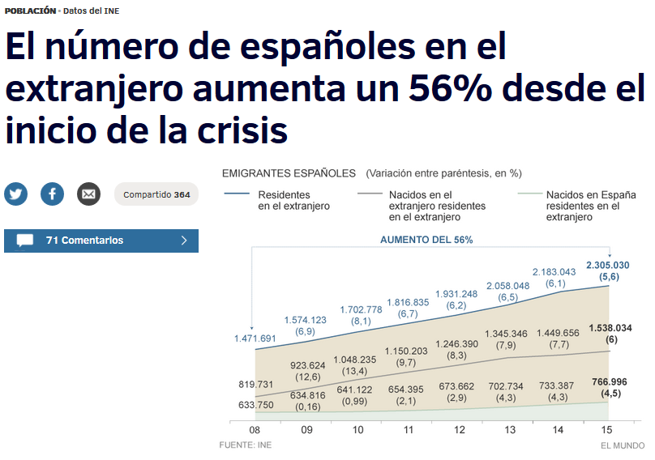](http://www.elmundo.es/sociedad/2016/03/17/56ea7da022601d7f648b463f.html)

[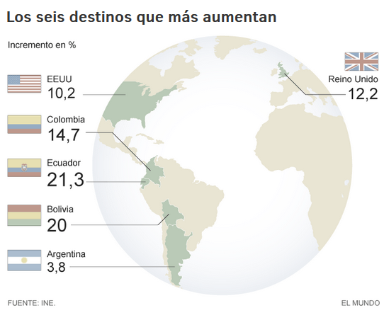](http://www.elmundo.es/sociedad/2016/03/17/56ea7da022601d7f648b463f.html)

[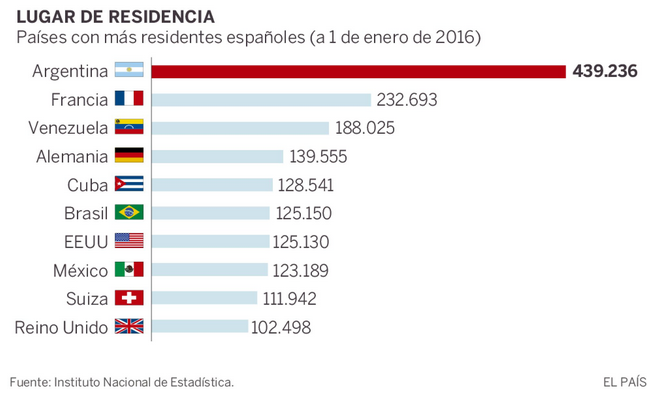](http://politica.elpais.com/politica/2016/03/16/actualidad/1458145510_786597.html)

[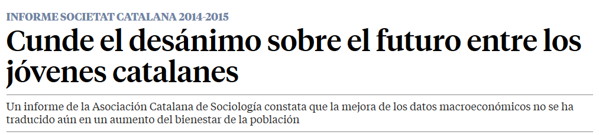](http://www.lavanguardia.com/vida/20160317/40497346529/desanimo-futuro-jovenes-catalanes.html)

<blockquote class="twitter-tweet tw-align-center" data-lang="es">
<a href="https://twitter.com/hashtag/TrabajasEnEspa%C3%B1a?src=hash">#TrabajasEnEspaña</a> Financial Times denuncia que crisis española no solo crea jóvenes pobres, sino también &quot;enfermos&quot; <a href="https://t.co/k9FFxI7prZ">https://t.co/k9FFxI7prZ</a>
&mdash; El Boletín (@elboletinmadrid) <a href="https://twitter.com/elboletinmadrid/status/719509362197340160">11 de abril de 2016</a></blockquote>

[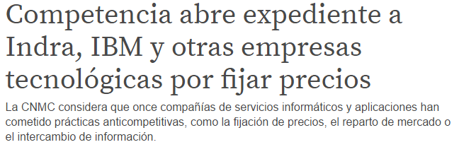](http://www.elboletin.com/economia/133375/competencia-expediente-indra-ibm-tecnologicas.html)

<iframe width="560" height="315" src="https://www.youtube.com/embed/CdB1fNN_gtE?rel=0" frameborder="0" allowfullscreen class="video"></iframe>

 

<blockquote class="twitter-tweet tw-align-center" data-lang="es">
Countries grow richer when they learn how to produce more valuable stuff per person  <a href="https://t.co/0GOBddIfND">https://t.co/0GOBddIfND</a> <a href="https://t.co/mDapJqUVm8">pic.twitter.com/mDapJqUVm8</a>
&mdash; The Economist (@TheEconomist) <a href="https://twitter.com/TheEconomist/status/711579515244388354">20 de marzo de 2016</a></blockquote>

<blockquote class="twitter-tweet tw-align-center" data-lang="es">
Trabajando por una movilidad laboral equitativa para todos<a href="https://t.co/tyAGsFomCk">https://t.co/tyAGsFomCk</a>
&mdash; Comisión Europea (@UEmadrid) <a href="https://twitter.com/UEmadrid/status/711883070417186816">21 de marzo de 2016</a></blockquote>

<blockquote class="twitter-tweet tw-align-center" data-lang="es">
EU unemployment  Greece: 24% Spain: 20.9% Italy: 11.5% France: 10.3% Poland: 10.3% Ireland: 8.8% Netherlands: 6.5% Germany: 6.2% UK: 5.1%
&mdash; The Int&#39;l Spectator (@intlspectator) <a href="https://twitter.com/intlspectator/status/711860240904376320">21 de marzo de 2016</a></blockquote>

<blockquote class="twitter-tweet tw-align-center" data-lang="es">
Fernando Alonso reconoce las primeras secuelas del accidente. Te lo contamos todo <a href="https://t.co/QKwYYxXX2f">https://t.co/QKwYYxXX2f</a> <a href="https://t.co/sUJYl2RPvr">pic.twitter.com/sUJYl2RPvr</a>
&mdash; Bolsamanía (@bolsamania) <a href="https://twitter.com/bolsamania/status/711879171228766208">21 de marzo de 2016</a></blockquote>

### Portales de empleo
- [Nubelo](http://www.nubelo.com/)
- [trabajar-en.com](http://trabajar-en.com/)
- [SOC: Servei d'Ocupació de Catalunya](https://www.oficinadetreball.gencat.cat/socweb/opencms/socweb_ca/home.html)
	- [twitter.com/ocupaciocat](https://twitter.com/ocupaciocat)
- [twitter.com/barcelonactiva](https://twitter.com/barcelonactiva)
- [twitter.com/developerbcn](https://twitter.com/developerbcn)
- [twitter.com/bcntechcity](https://twitter.com/bcntechcity)
- [twitter.com/developermadrid](https://twitter.com/developermadrid)
- [portalparados.es](http://www.portalparados.es/)
- [¿Cuáles son los países que más están contratando?](http://www.expansion.com/emprendedores-empleo/empleo/2016/01/04/568ac17b22601d123b8b4635.html)
- [Ofertas laborales para informáticos en Dubái](http://www.consejosgratis.es/ofertas-laborales-para-informaticos-en-dubai/)
- [Lanzaderas de empleo 🌟](http://lanzaderasdeempleo.es/)
	- [twitter.com/Lanzaderas_EES](https://twitter.com/Lanzaderas_EES)
	- [Evaluación del impacto social de las Lanzaderas de Empleo 🌟](http://www.fundaciontelefonica.com/arte_cultura/publicaciones-listado/pagina-item-publicaciones/itempubli/486/)

<blockquote class="twitter-tweet tw-align-center" data-lang="es">
1640 España está arruinada <a href="http://t.co/d4j4Q8WYKY">http://t.co/d4j4Q8WYKY</a> vía <a href="https://twitter.com/YouTube">@youtube</a>
&mdash; CAMEL (@Cameluip) <a href="https://twitter.com/Cameluip/status/312935578494722048">16 de marzo de 2013</a></blockquote>

<blockquote class="twitter-tweet tw-align-center" data-lang="es">
Las <a href="https://twitter.com/hashtag/pymes?src=hash">#pymes</a> españolas contrataron 255.000profesionales con <a href="https://twitter.com/hashtag/perfilesdigitales?src=hash">#perfilesdigitales</a> el último año <a href="https://t.co/sM04SfKPbz">https://t.co/sM04SfKPbz</a> <a href="https://twitter.com/tcanalysis">@tcanalysis</a> <a href="https://twitter.com/adigital_org">@adigital_org</a>
&mdash; Ecommerce_es (@Ecommerce_es) <a href="https://twitter.com/Ecommerce_es/status/708273814694719489">11 de marzo de 2016</a></blockquote>

<blockquote class="twitter-tweet tw-align-center" data-lang="es">
&quot;&#39;Generación Ninini&#39;. <a href="https://t.co/OSMHniuD8R">https://t.co/OSMHniuD8R</a>&quot; Vía:cuadernalia
&mdash; Planeta Educativo (@PlanetEducativo) <a href="https://twitter.com/PlanetEducativo/status/695429889621512196">5 de febrero de 2016</a></blockquote>

[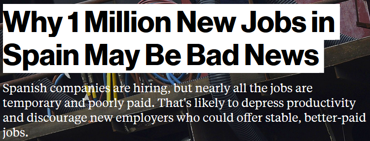](http://www.bloomberg.com/news/articles/2015-07-01/why-1-million-new-jobs-in-spain-may-be-bad-news)

[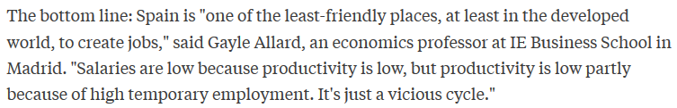](http://www.bloomberg.com/news/articles/2015-07-01/why-1-million-new-jobs-in-spain-may-be-bad-news)

[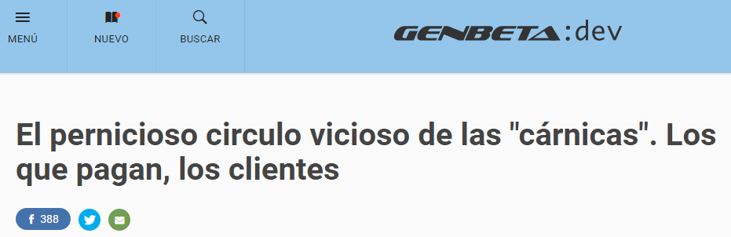](http://www.genbetadev.com/modelos-de-negocio/el-pernicioso-circulo-vicioso-de-las-carnicas-los-que-pagan-los-clientes)

[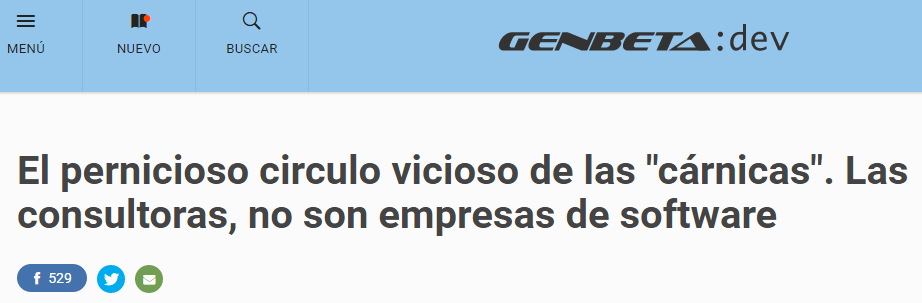](http://www.genbetadev.com/trabajar-como-desarrollador/el-pernicioso-circulo-vicioso-de-las-carnicas-las-consultoras-no-son-empresas-de-software)

[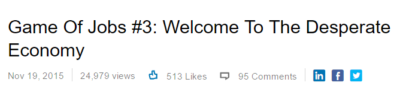](https://www.linkedin.com/pulse/game-jobs-3-welcome-desperate-economy-nachi-junankar)

[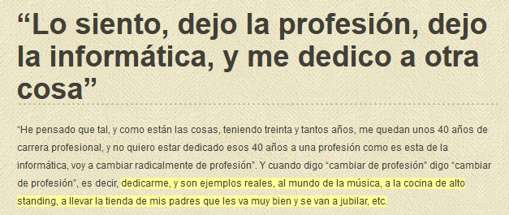](http://www.javiergarzas.com/2014/07/los-siento-dejo-la-profesion-dejo-la-informatica-y-dedico-otra-cosa.html)

<blockquote class="twitter-tweet tw-align-center" data-lang="es">
El monstruo en que se han convertido en España las consultoras / cárnicas. Buen análisis <a href="https://twitter.com/david_bonilla">@david_bonilla</a> ! <a href="https://t.co/6SXccLJtb8">https://t.co/6SXccLJtb8</a>
&mdash; Startup Jobs BCN (@startupjobsbcn) <a href="https://twitter.com/startupjobsbcn/status/729589515606732800">9 de mayo de 2016</a></blockquote>

<blockquote class="twitter-tweet tw-align-center" data-lang="es">
IT professionals are feeling less job stress, survey suggests <a href="https://t.co/KIvgL6q7NW">https://t.co/KIvgL6q7NW</a> via <a href="https://twitter.com/ZDNet">@ZDNet</a> &amp; <a href="https://twitter.com/joemckendrick">@joemckendrick</a> <a href="https://t.co/XIcGnvAgqn">pic.twitter.com/XIcGnvAgqn</a>
&mdash; ZDNet (@ZDNet) <a href="https://twitter.com/ZDNet/status/737674957841440768">31 de mayo de 2016</a></blockquote>

<blockquote class="twitter-tweet tw-align-center" data-lang="es">
Is tech turning contract work into the future of employment? <a href="https://t.co/Q1TonIo9sR">https://t.co/Q1TonIo9sR</a> by <a href="https://twitter.com/hope_reese">@Hope_Reese</a> <a href="https://t.co/t1EreileS3">pic.twitter.com/t1EreileS3</a>
&mdash; TechRepublic (@TechRepublic) <a href="https://twitter.com/TechRepublic/status/711968147214041088">21 de marzo de 2016</a></blockquote>

<iframe src="http://www.flooxer.com/embed/56ffa4700cf24f7b02362318" width="560" height="315" frameborder="0" allowfullscreen class="video"></iframe>

 

<iframe width="560" height="315" src="https://www.youtube.com/embed/JYMFiwekAKo?rel=0" frameborder="0" allowfullscreen class="video"></iframe>

 

## Leadership Styles Around the World
- [Leadership Styles Around the World](leadership_styles_around_world.md)

<a href="http://time-lord-vonnegut.tumblr.com/post/108034598717/to-all-the-people-on-here-looking-for-jobs">http://time-lord-vonnegut.tumblr.com/post/108034598717/to-all-the-people-on-here-looking-for-jobs</a>

<a href="http://forbes.tumblr.com/post/114944216680/things-people-reading-your-resume-wish-you-knew">http://forbes.tumblr.com/post/114944216680/things-people-reading-your-resume-wish-you-knew</a>

[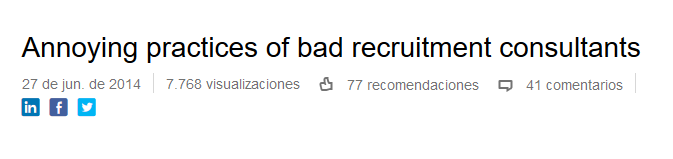](https://www.linkedin.com/pulse/20140627145242-24927776-annoying-practices-of-bad-recruitment-consultants)

[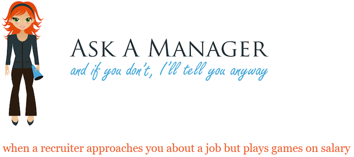](http://www.askamanager.org/2013/02/when-a-recruiter-approaches-you-about-a-job-but-plays-games-on-salary.html)

<blockquote class="twitter-tweet tw-align-center" data-lang="es">
Avoid sharing this information with a recruiter: <a href="https://t.co/wCrOoSwBjV">https://t.co/wCrOoSwBjV</a> <a href="https://t.co/R5LYMX0913">pic.twitter.com/R5LYMX0913</a>
&mdash; Forbes (@Forbes) <a href="https://twitter.com/Forbes/status/711497763599605760">20 de marzo de 2016</a></blockquote>

# Freelance jobs
- [Freelance jobs](freelance_jobs.md)

# Skills That Can Get You Hired in 2016
- [The 25 Skills That Can Get You Hired in 2016](http://blog.linkedin.com/2016/01/12/the-25-skills-that-can-get-you-hired-in-2016/)
- [9 enterprise tech trends for 2016 and beyond](http://www.infoworld.com/article/3007057/cloud-computing/9-enterprise-tech-trends-for-2016-and-beyond.html)
- [The Best Tech Skills to List on Your Resume](http://www.businessnewsdaily.com/4932-tech-skills-resume.html)
- [forbes.com: 8 Tech Trends Changing How We Work In 2016](http://www.forbes.com/sites/ajagrawal/2016/01/11/8-tech-trends-changing-how-we-work-in-2016/#2715e4857a0b6a27c0767013)
- [businessinsider.com: 17 common mistakes to avoid when you're networking](http://www.businessinsider.com/networking-mistakes-youre-making-2016-1)

<blockquote class="twitter-tweet tw-align-center" data-lang="es">
Remember F**ked Company? This is the new site that tracks startup down rounds: <a href="https://t.co/qOHmhWYlZk">https://t.co/qOHmhWYlZk</a> <a href="https://t.co/70jRREd7up">pic.twitter.com/70jRREd7up</a>
&mdash; Forbes Tech News (@ForbesTech) <a href="https://twitter.com/ForbesTech/status/702600141946167300">24 de febrero de 2016</a></blockquote>

<iframe width="420" height="315" src="https://www.youtube.com/embed/ibuiUXOTE4M?rel=0" frameborder="0" allowfullscreen class="video"></iframe>

 

<blockquote class="twitter-tweet tw-align-center" data-lang="es">
Learn from it! <a href="https://t.co/6SAMhrF9nH">pic.twitter.com/6SAMhrF9nH</a>
&mdash; The Wolf of Wall St. (@TheWolfofWaIlSt) <a href="https://twitter.com/TheWolfofWaIlSt/status/703291137881145345">26 de febrero de 2016</a></blockquote>

<a href="https://www.epo.org/about-us/annual-reports-statistics/annual-report.html">European Patent Office Annual Reports</a>

<iframe width="560" height="315" src="https://www.youtube.com/embed/oabxBtR4F8Q?rel=0" frameborder="0" allowfullscreen class="video"></iframe>

 

<iframe width="560" height="315" src="https://www.youtube.com/embed/4zzPsjmBBYg?rel=0" frameborder="0" allowfullscreen class="video"></iframe>

 

<iframe width="560" height="315" src="https://www.youtube.com/embed/2UpWgyR2mvA?rel=0" frameborder="0" allowfullscreen class="video"></iframe>

 

<iframe src="https://embed-ssl.ted.com/talks/andrew_mcafee_what_will_future_jobs_look_like.html" width="640" height="360" frameborder="0" scrolling="no" webkitAllowFullScreen mozallowfullscreen allowFullScreen class="video"></iframe>

 

<blockquote class="twitter-tweet tw-align-center" data-lang="es">
Blue-collar jobs aren&#39;t coming back, but &quot;cyborg jobs&quot; are here to stay. <a href="https://twitter.com/brysonpayne">@brysonpayne</a> shares his thoughts: <a href="https://t.co/cFHbmoej2P">https://t.co/cFHbmoej2P</a>
&mdash; Open Source Way (@opensourceway) <a href="https://twitter.com/opensourceway/status/712036817537785856">21 de marzo de 2016</a></blockquote>

<iframe width="560" height="315" src="https://www.youtube.com/embed/jh01p06Szcs?rel=0" frameborder="0" allowfullscreen class="video"></iframe>

 

<iframe width="560" height="315" src="https://www.youtube.com/embed/uqZiIO0YI7Y?rel=0" frameborder="0" allowfullscreen class="video"></iframe>

 

<iframe width="420" height="315" src="https://www.youtube.com/embed/zVPiO0ekLnU?rel=0" frameborder="0" allowfullscreen class="video"></iframe>

 

<iframe width="560" height="315" src="https://www.youtube.com/embed/-vPWUy9E5Yw?rel=0" frameborder="0" allowfullscreen class="video"></iframe>

 

<iframe width="560" height="315" src="https://www.youtube.com/embed/_wfEdi7h1FI?rel=0" frameborder="0" allowfullscreen class="video"></iframe>

 

<iframe width="560" height="315" src="https://www.youtube.com/embed/AsetntXCPRQ?rel=0" frameborder="0" allowfullscreen class="video"></iframe>

 

<blockquote class="twitter-tweet tw-align-center" data-lang="es">
Jobs in the <a href="https://twitter.com/hashtag/digital?src=hash">#digital</a> era? <a href="https://twitter.com/hashtag/OECDwk?src=hash">#OECDwk</a> speaker Jacques van der Broek looks at the future of <a href="https://twitter.com/hashtag/work?src=hash">#work</a> <a href="https://t.co/cwnH4AdZJM">https://t.co/cwnH4AdZJM</a> <a href="https://t.co/bkP0YPMpxt">pic.twitter.com/bkP0YPMpxt</a>
&mdash; OECD (@OECD) <a href="https://twitter.com/OECD/status/736261190003904513">27 de mayo de 2016</a></blockquote>

<blockquote class="twitter-tweet tw-align-center" data-lang="es">
This 85-year-old woman destroyed a priceless century-old artwork — and now she’s a massive celebrity in Spain.<a href="https://t.co/vwUONhBZVx">https://t.co/vwUONhBZVx</a>
&mdash; INSIDER (@thisisinsider) <a href="https://twitter.com/thisisinsider/status/711942330278760448">21 de marzo de 2016</a></blockquote>

<iframe width="420" height="315" src="https://www.youtube.com/embed/I6IQ_FOCE6I" frameborder="0" allowfullscreen class="video"></iframe>

 

