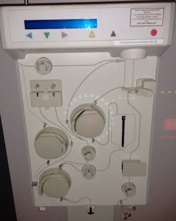

<!-- MarkdownTOC -->

- [Barcelona Tech, Startups and Innovation](#barcelona-tech-startups-and-innovation)

<!-- /MarkdownTOC -->

<iframe width="560" height="315" src="https://www.youtube.com/embed/6V5z2boEKWA?rel=0" frameborder="0" allowfullscreen class="video"></iframe>

 

# Barcelona Tech, Startups and Innovation
- [Grupo Intercom](http://www.grupointercom.com/)
- [twitter.com/accio_cat](https://twitter.com/accio_cat) ACCIÓ és l’agència per a la competitivitat de l'empresa de la Generalitat de Catalunya.
- [twitter.com/JOBBCN](https://twitter.com/JOBBCN) JOBarcelona'16: III Congreso Internacional de #empleo y #orientaciónlaboral 
- [Barcinno.com: Barcelona Tech, Startups and Innovation 🌟](http://www.barcinno.com/)
- [bdigital.org: Barcelona Digital Technology Centre](http://www.bdigital.org/en/)
- [Barcelona Activa 🌟](http://www.barcelonactiva.cat/barcelonactiva)
	- [Barcelona Activa - Parc Tecnològic](http://empresa.barcelonactiva.cat/empresa/cat/serveis/parc/index.jsp)
- [Eurecat TIC](http://eurecat.org/en/sectors/itc/)
- [BCNanalytics.com](http://bcnanalytics.com/)
- [bsc.es: Barcelona Supercomputing Center](http://www.bsc.es/)
	- [ALOJA project: research centre in Barcelona](http://hadoop.bsc.es/)
para universitarios y titulados júnior
- [smartcity.bcn.cat](http://smartcity.bcn.cat)
    - [smartcityexpo.com/barcelona](http://www.smartcityexpo.com/barcelona)
- [zdnet.com: Think big data is too big for SMEs? Barcelona's out to prove you wrong 🌟](http://www.zdnet.com/article/think-big-data-is-too-big-for-smes-barcelonas-out-to-prove-you-wrong/) The Catalan city has opened a big data center to accelerate business innovation - and hopefully become the most important data processing hub in southern Europe.
- [Tres días de infierno vendiendo 'startups' en la mayor feria mundial del móvil 🌟](http://www.elconfidencial.com/tecnologia/2016-02-25/tres-dias-de-infierno-vendiendo-startups-en-la-mayor-feria-de-telefonia-del-mundo_1157974/)

<iframe width="560" height="315" src="https://www.youtube.com/embed/PhO-ar0la-s?rel=0" frameborder="0" allowfullscreen class="video"></iframe>

 

<iframe width="560" height="315" src="https://www.youtube.com/embed/4qmS6Lz2W7c?rel=0" frameborder="0" allowfullscreen class="video"></iframe>

 

<iframe width="560" height="315" src="https://www.youtube.com/embed/bHNNUZ-Ikfw?rel=0" frameborder="0" allowfullscreen class="video"></iframe>

 

<iframe width="560" height="315" src="https://www.youtube.com/embed/EfSpoSLCrNg?rel=0" frameborder="0" allowfullscreen class="video"></iframe>

 

<iframe width="560" height="315" src="https://www.youtube.com/embed/ap_G3x5mS08?rel=0" frameborder="0" allowfullscreen class="video"></iframe>

 

<iframe width="560" height="315" src="https://www.youtube.com/embed/Mm_JYtIncQ4?rel=0" frameborder="0" allowfullscreen class="video"></iframe>

 

<iframe width="560" height="315" src="https://www.youtube.com/embed/1w0nk5ZPLSc?rel=0" frameborder="0" allowfullscreen class="video"></iframe>

 

<iframe width="560" height="315" src="https://www.youtube.com/embed/Dn9_eXICM7I?rel=0" frameborder="0" allowfullscreen class="video"></iframe>

 

<iframe width="560" height="315" src="https://www.youtube.com/embed/Znq5dSf19DY?rel=0" frameborder="0" allowfullscreen class="video"></iframe>

 

<iframe width="560" height="315" src="https://www.youtube.com/embed/P2ASSPQHE9A?rel=0" frameborder="0" allowfullscreen class="video"></iframe>

 

<iframe width="560" height="315" src="https://www.youtube.com/embed/r619_K421bI?rel=0" frameborder="0" allowfullscreen class="video"></iframe>

 

<iframe width="560" height="315" src="https://www.youtube.com/embed/jIJhn3oKRhY?rel=0" frameborder="0" allowfullscreen class="video"></iframe>

 

<blockquote class="twitter-tweet tw-align-center" data-lang="es">
&quot;El que més valorem de Barcelona Activa és la xarxa de contactes que et dóna&quot; 10 testimonis d&#39; <a href="https://twitter.com/hashtag/startups?src=hash">#startups</a> <a href="https://t.co/UgKNMsxadJ">https://t.co/UgKNMsxadJ</a>
&mdash; Barcelona Activa (@barcelonactiva) <a href="https://twitter.com/barcelonactiva/status/706013987096424448">5 de marzo de 2016</a></blockquote>

<blockquote class="twitter-tweet tw-align-center" data-lang="es">
<a href="https://twitter.com/hashtag/Biotech?src=hash">#Biotech</a> <a href="https://twitter.com/hashtag/startups?src=hash">#startups</a> are looking to &#39;win the 21st century,&#39; the <a href="https://twitter.com/guardian">@guardian</a> reports <a href="https://t.co/R4DBGMp2xI">https://t.co/R4DBGMp2xI</a>
&mdash; CRG (@CRGenomica) <a href="https://twitter.com/CRGenomica/status/702554925889429505">24 de febrero de 2016</a></blockquote>

<blockquote class="twitter-tweet tw-align-center" data-lang="es">
Miquel Camprodon de Kernel e Israel Saeta de <a href="https://twitter.com/leadratings">@leadratings</a> presentando <a href="https://twitter.com/hashtag/statsmodels?src=hash">#statsmodels</a> en la <a href="https://twitter.com/PyConES">@PyConES</a> 2015 <a href="https://t.co/F3NKAFBmNM">https://t.co/F3NKAFBmNM</a>
&mdash; Kernel Analytics (@KernelAnalytics) <a href="https://twitter.com/KernelAnalytics/status/697375146747760640">10 de febrero de 2016</a></blockquote>

<blockquote class="twitter-tweet tw-align-center" data-lang="es">
Zhilabs granted Spark Certification from Databricks.  <a href="https://t.co/swEPhVhIuK">https://t.co/swEPhVhIuK</a> <a href="https://t.co/eBAgdhT32r">pic.twitter.com/eBAgdhT32r</a>
&mdash; Zhilabs (@Zhilabs) <a href="https://twitter.com/Zhilabs/status/698447100359659521">13 de febrero de 2016</a></blockquote>

<blockquote class="twitter-tweet tw-align-center" data-lang="es">
ABA&#39;s <a href="https://twitter.com/hashtag/quicktips?src=hash">#quicktips</a> to learn <a href="https://twitter.com/hashtag/English?src=hash">#English</a>: Practice really does make perfect (or close to perfect) <a href="https://twitter.com/hashtag/learn?src=hash">#learn</a> <a href="https://t.co/xnRl8tQ8EK">pic.twitter.com/xnRl8tQ8EK</a>
&mdash; ABA English (@ABAEnglish) <a href="https://twitter.com/ABAEnglish/status/701852015606046732">22 de febrero de 2016</a></blockquote>

<blockquote class="twitter-tweet tw-align-center" data-lang="es">
Nuestra más sincera enhorabuena a <a href="https://twitter.com/hashtag/LeonardoDiCaprio?src=hash">#LeonardoDiCaprio</a> por llevarse el <a href="https://twitter.com/hashtag/Oscar?src=hash">#Oscar</a> en <a href="https://twitter.com/hashtag/ElRenacido?src=hash">#ElRenacido</a> <a href="https://t.co/Rv93CIuTMW">https://t.co/Rv93CIuTMW</a> <a href="https://t.co/k7YHXZODf7">pic.twitter.com/k7YHXZODf7</a>
&mdash; Wuaki.tv (@wuakitv) <a href="https://twitter.com/wuakitv/status/704225711226277888">29 de febrero de 2016</a></blockquote>

<blockquote class="twitter-tweet tw-align-center" data-lang="es">
We&#39;ve launched our new <a href="https://twitter.com/hashtag/android?src=hash">#android</a> <a href="https://twitter.com/hashtag/app?src=hash">#app</a>! :) Start creating your own Typeforms on the go: <a href="https://t.co/HRUkKWdBw8">https://t.co/HRUkKWdBw8</a> <a href="https://t.co/juOrZauB0P">pic.twitter.com/juOrZauB0P</a>
&mdash; Typeform (@typeform) <a href="https://twitter.com/typeform/status/704320861558448130">29 de febrero de 2016</a></blockquote>

<blockquote class="twitter-tweet tw-align-center" data-lang="es">
Si no quieres que se te escape ni una oferta. Qué APP te vas a bajar? Ofertia! <a href="https://twitter.com/hashtag/Cazaofertas?src=hash">#Cazaofertas</a> Cazafantasmas  <a href="https://t.co/wC6S5gLHyG">https://t.co/wC6S5gLHyG</a>
&mdash; Ofertia (@ofertia) <a href="https://twitter.com/ofertia/status/705429793001627648">3 de marzo de 2016</a></blockquote>

<blockquote class="twitter-tweet tw-align-center" data-lang="es">
Si no te gusta, si no lo usas, si tienes uno nuevo... Súbelo a <a href="https://twitter.com/hashtag/Wallapop?src=hash">#Wallapop</a>. <a href="https://t.co/bCd5L642ah">https://t.co/bCd5L642ah</a>
&mdash; Wallapop (@wallapop) <a href="https://twitter.com/wallapop/status/685149216470134785">7 de enero de 2016</a></blockquote>

<blockquote class="twitter-tweet tw-align-center" data-lang="es">
Los amigos de <a href="https://twitter.com/accio_cat">@accio_cat</a> también nos han visitado en nuestro estand del <a href="https://twitter.com/hashtag/MWC16?src=hash">#MWC16</a> (8.1K48). ¿Y tú? <a href="https://t.co/OmM9ZtHn8Z">https://t.co/OmM9ZtHn8Z</a>
&mdash; Tiendeo (@Tiendeo) <a href="https://twitter.com/Tiendeo/status/702892831376015362">25 de febrero de 2016</a></blockquote>

<blockquote class="twitter-tweet tw-align-center" data-lang="es">
Nueva York: 5 Días + vuelos + hotel <a href="https://t.co/n6Sty8SmeH">https://t.co/n6Sty8SmeH</a> via <a href="https://twitter.com/groupaliaES">@GroupaliaES</a> <a href="https://t.co/FH7rj8vPTr">pic.twitter.com/FH7rj8vPTr</a>
&mdash; Groupalia España (@groupaliaES) <a href="https://twitter.com/groupaliaES/status/704598373358301184">1 de marzo de 2016</a></blockquote>

<blockquote class="twitter-tweet tw-align-center" data-lang="es">
¡Envío Gratis en Sport! Hoy: adidas, O&#39;Neill, DUUO, CMP, Napapijri, Pepe Jeans y más. ▶ <a href="https://t.co/qPoQzuhNMF">https://t.co/qPoQzuhNMF</a> <a href="https://t.co/w8UOzEabso">pic.twitter.com/w8UOzEabso</a>
&mdash; Privalia España (@Privalia_es) <a href="https://twitter.com/Privalia_es/status/703480977214087168">27 de febrero de 2016</a></blockquote>

<blockquote class="twitter-tweet tw-align-center" data-lang="es">
Our story featured on <a href="https://twitter.com/FT">@FT</a> about how we help companies grow - thanks <a href="https://twitter.com/richnewton">@richnewton</a> <a href="https://t.co/UvFDGDQeYt">https://t.co/UvFDGDQeYt</a> <a href="https://twitter.com/Brian_Pallas">@Brian_Pallas</a> <a href="https://twitter.com/enricasgh">@enricasgh</a> <a href="https://twitter.com/hashtag/weareON?src=hash">#weareON</a>
&mdash; Opportunity Network (@OpportNetwork) <a href="https://twitter.com/OpportNetwork/status/701786268045287424">22 de febrero de 2016</a></blockquote>

<blockquote class="twitter-tweet tw-align-center" data-lang="es">
Ese momento en el que no duermes para terminar un libro y su final no te gusta.<a href="https://twitter.com/hashtag/CosasdeLectores?src=hash">#CosasdeLectores</a> <a href="https://t.co/r9bFiObsCf">pic.twitter.com/r9bFiObsCf</a>
&mdash; Casa del Libro (@casadellibro) <a href="https://twitter.com/casadellibro/status/702883618566348803">25 de febrero de 2016</a></blockquote>

<blockquote class="twitter-tweet tw-align-center" data-lang="es">
Fórmate en Contabilidad, Secretariado, Facturación y Almacén por tan sólo 25 € con <a href="https://twitter.com/KDLFormacion">@KDLFormacion</a>. <a href="https://t.co/vE3XBuZvMj">https://t.co/vE3XBuZvMj</a>.
&mdash; Emagister (@emagister) <a href="https://twitter.com/emagister/status/678368218164035584">20 de diciembre de 2015</a></blockquote>

<blockquote class="twitter-tweet tw-align-center" data-lang="es">
<a href="https://twitter.com/hashtag/Gmail?src=hash">#Gmail</a>&#39;s new security feature you should know about. <a href="https://t.co/Eb7hmbjZyh">https://t.co/Eb7hmbjZyh</a>
&mdash; Softonic (@softonic) <a href="https://twitter.com/softonic/status/697570760295063552">11 de febrero de 2016</a></blockquote>

<blockquote class="twitter-tweet tw-align-center" data-lang="es">
Guía para un viaje <a href="https://twitter.com/hashtag/LowCost?src=hash">#LowCost</a> a <a href="https://twitter.com/hashtag/Barcelona?src=hash">#Barcelona</a> <a href="https://t.co/6W6tTMv8JF">https://t.co/6W6tTMv8JF</a> <a href="https://twitter.com/hashtag/gu%C3%ADas?src=hash">#guías</a> <a href="https://t.co/Vu2v4nPSVr">pic.twitter.com/Vu2v4nPSVr</a>
&mdash; eDreams España (@eDreams_es) <a href="https://twitter.com/eDreams_es/status/705325601532436481">3 de marzo de 2016</a></blockquote>

<blockquote class="twitter-tweet tw-align-center" data-lang="es">
La conexión bidireccional XML entre <a href="http://t.co/BbjRKxlH68">http://t.co/BbjRKxlH68</a> &lt;&gt; Witbooking ya está online! - <a href="http://t.co/qeO6E9eJLA">http://t.co/qeO6E9eJLA</a>
&mdash; witbooking (@witbooking) <a href="https://twitter.com/witbooking/status/604226132947386368">29 de mayo de 2015</a></blockquote>

<blockquote class="twitter-tweet tw-align-center" data-lang="es">
The perfect time to visit <a href="https://twitter.com/hashtag/Valencia?src=hash">#Valencia</a> with Las Fallas March 15-19! <a href="https://t.co/sb5MQDhKFD">https://t.co/sb5MQDhKFD</a> 🎇 <a href="https://t.co/EJFYgPjzVM">https://t.co/EJFYgPjzVM</a> 🎆 <a href="https://t.co/CCUvDiIXBz">pic.twitter.com/CCUvDiIXBz</a>
&mdash; Budgetplaces.com (@budgetplaces) <a href="https://twitter.com/budgetplaces/status/704704538771644420">1 de marzo de 2016</a></blockquote>

<blockquote class="twitter-tweet tw-align-center" data-lang="es">
Dime con quién esquías y te diré a qué pista ir ⛷ <a href="https://t.co/LXAYOnWEhO">https://t.co/LXAYOnWEhO</a> <a href="https://t.co/Is1DEHXjRF">pic.twitter.com/Is1DEHXjRF</a>
&mdash; Atrápalo España (@atrapalo) <a href="https://twitter.com/atrapalo/status/700610738348552192">19 de febrero de 2016</a></blockquote>

<blockquote class="twitter-tweet tw-align-center" data-lang="es">
Our CEO is speaking at the Apple Store of Pg. de Gràcia, on Friday. Sign up here <a href="https://t.co/9ueTxo5zmR">https://t.co/9ueTxo5zmR</a> <a href="https://twitter.com/hashtag/AppleStore?src=hash">#AppleStore</a> <a href="https://t.co/4aJY3QTwEK">pic.twitter.com/4aJY3QTwEK</a>
&mdash; Social Point (@socialpoint) <a href="https://twitter.com/socialpoint/status/673912129255272448">7 de diciembre de 2015</a></blockquote>

<blockquote class="twitter-tweet tw-align-center" data-lang="es">
Wifisafe es el único Gold <a href="https://twitter.com/hashtag/Certified?src=hash">#Certified</a> de <a href="https://twitter.com/hashtag/Peplink?src=hash">#Peplink</a> en España <a href="http://t.co/8pdNEJzQdM">http://t.co/8pdNEJzQdM</a>
&mdash; Wifisafe Spain SL (@wifisafespain) <a href="https://twitter.com/wifisafespain/status/459732419588157440">25 de abril de 2014</a></blockquote>

<blockquote class="twitter-tweet tw-align-center" data-lang="es">
Encontrar trabajo por enchufe o por recomendación por <a href="https://twitter.com/monicaventas">@monicaventas</a> <a href="https://t.co/s9At0WiNX5">https://t.co/s9At0WiNX5</a> <a href="https://t.co/teuE1hgkjJ">pic.twitter.com/teuE1hgkjJ</a>
&mdash; InfoJobs (@InfoJobs) <a href="https://twitter.com/InfoJobs/status/705441505650085888">3 de marzo de 2016</a></blockquote>

<blockquote class="twitter-tweet tw-align-center" data-lang="es">
<a href="https://twitter.com/hashtag/BuenosDias?src=hash">#BuenosDias</a>! ¿Te gustaria formar parte de nuestra red de <a href="https://twitter.com/hashtag/Franquicias?src=hash">#Franquicias</a> <a href="https://twitter.com/hashtag/Eurona?src=hash">#Eurona</a>! Hablamos? franquicias@eurona.net 📲 <a href="https://t.co/QRIqkXI8xN">pic.twitter.com/QRIqkXI8xN</a>
&mdash; Grupo Eurona (@eurona_net) <a href="https://twitter.com/eurona_net/status/705653594507218944">4 de marzo de 2016</a></blockquote>

<blockquote class="twitter-tweet tw-align-center" data-lang="es">
All the highlights of our evening with <a href="https://twitter.com/KendallJenner">@KendallJenner</a> at the <a href="https://twitter.com/hashtag/TribalSpirit?src=hash">#TribalSpirit</a> party are here: <a href="https://t.co/V7v7cYpcOl">https://t.co/V7v7cYpcOl</a> <a href="https://t.co/Vpo4aU5eUL">pic.twitter.com/Vpo4aU5eUL</a>
&mdash; MANGO (@Mango) <a href="https://twitter.com/Mango/status/695271247085703169">4 de febrero de 2016</a></blockquote>

<blockquote class="twitter-tweet tw-align-center" data-lang="es">
Room with a view! <a href="https://twitter.com/hashtag/DesigualHQ?src=hash">#DesigualHQ</a> <a href="https://t.co/9F1w55ANIH">pic.twitter.com/9F1w55ANIH</a>
&mdash; Desigual (@desigual) <a href="https://twitter.com/desigual/status/704682660015296512">1 de marzo de 2016</a></blockquote>

<blockquote class="twitter-tweet tw-align-center" data-lang="es">
Are you thinking about Easter plans? <a href="https://twitter.com/hashtag/London?src=hash">#London</a>, <a href="https://twitter.com/hashtag/Paris?src=hash">#Paris</a>, <a href="https://twitter.com/hashtag/Barcelona?src=hash">#Barcelona</a> or <a href="https://twitter.com/hashtag/Madrid?src=hash">#Madrid</a>... Book your room at Derby Hotels! <a href="https://t.co/9LSX9EnTix">pic.twitter.com/9LSX9EnTix</a>
&mdash; Derby Hotels (@Derby_Hotels) <a href="https://twitter.com/Derby_Hotels/status/705022468210098176">2 de marzo de 2016</a></blockquote>

<blockquote class="twitter-tweet tw-align-center" data-lang="es">
The &quot;D&quot; that makes the difference: <a href="https://t.co/TehArjkhwl">https://t.co/TehArjkhwl</a> <a href="https://twitter.com/hashtag/SaaS?src=hash">#SaaS</a> <a href="https://twitter.com/hashtag/Tech?src=hash">#Tech</a> <a href="https://twitter.com/hashtag/Energy?src=hash">#Energy</a> <a href="https://t.co/25mk5MYWdA">pic.twitter.com/25mk5MYWdA</a>
&mdash; DEXMA (@dexma) <a href="https://twitter.com/dexma/status/686942045676638208">12 de enero de 2016</a></blockquote>

<blockquote class="twitter-tweet tw-align-center" data-lang="es">
By 2017, every public space in <a href="https://twitter.com/hashtag/Seoul?src=hash">#Seoul</a> will be fitted with free <a href="https://twitter.com/hashtag/WiFi?src=hash">#WiFi</a> access. <a href="https://twitter.com/hashtag/IoT?src=hash">#IoT</a> goals. <a href="https://t.co/oLXZHG7Jb2">https://t.co/oLXZHG7Jb2</a> <a href="https://t.co/xoPAlx2cck">pic.twitter.com/xoPAlx2cck</a>
&mdash; Fon (@Fon) <a href="https://twitter.com/Fon/status/704621341815734272">1 de marzo de 2016</a></blockquote>

<blockquote class="twitter-tweet tw-align-center" data-lang="es">
Ackstorm colabora como formador <a href="https://twitter.com/hashtag/Cloud?src=hash">#Cloud</a> con la Barcelona Technology School <a href="https://t.co/RD0PY57Vs8">https://t.co/RD0PY57Vs8</a>
&mdash; ACK STORM, S.L. (@ackstormsl) <a href="https://twitter.com/ackstormsl/status/705339715784994816">3 de marzo de 2016</a></blockquote>

<blockquote class="twitter-tweet tw-align-center" data-lang="es">
Presentando la <a href="https://twitter.com/hashtag/RestaurantLoverWeek?src=hash">#RestaurantLoverWeek</a> en el restaurante Ajoblanco de Barcelona 😊🍴🍷 <a href="https://t.co/sNg5vE9Fri">pic.twitter.com/sNg5vE9Fri</a>
&mdash; Atrápalo España (@atrapalo) <a href="https://twitter.com/atrapalo/status/704758111605821445">1 de marzo de 2016</a></blockquote>

<blockquote class="twitter-tweet tw-align-center" data-lang="es">
TOKIOTA, con <a href="https://twitter.com/pvelascodom">@pvelascodom</a> y <a href="https://twitter.com/_marcms_">@_marcms_</a>, presentando el workshop de <a href="https://twitter.com/Azure">@Azure</a> dentro del Executive MBA de IESE <a href="https://t.co/Letur7kZod">pic.twitter.com/Letur7kZod</a>
&mdash; TOKIOTA (@tokiota_IT) <a href="https://twitter.com/tokiota_IT/status/695178964340469760">4 de febrero de 2016</a></blockquote>