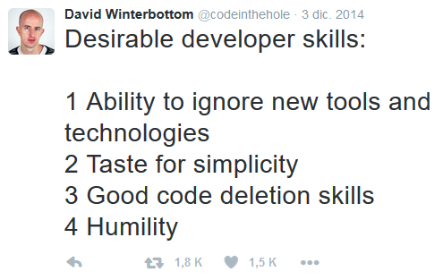
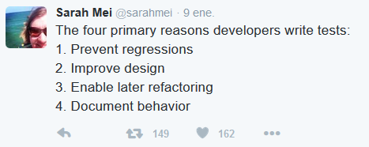
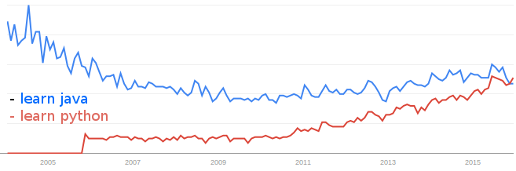
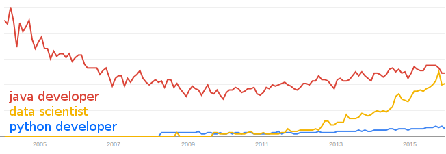
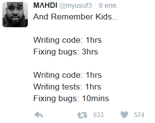
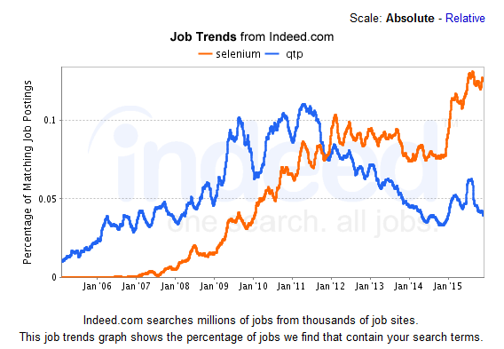

**Table of Contents**
<!-- MarkdownTOC -->

- [Software Development](#software-development)
	- [Blogs and Forums](#blogs-and-forums)
	- [Domain driven design](#domain-driven-design)
	- [API and Documentation Generators](#api-and-documentation-generators)
	- [Design Patterns](#design-patterns)
	- [Editors](#editors)
		- [Sublime](#sublime)
			- [Sublime Blogs](#sublime-blogs)
			- [Setting up Sublime and Tips](#setting-up-sublime-and-tips)
			- [Anaconda Python IDE](#anaconda-python-ide)
			- [Sublime Git](#sublime-git)
		- [Alternative editors](#alternative-editors)
		- [Diff Tools](#diff-tools)
	- [Regular expressions](#regular-expressions)
	- [Bash](#bash)
	- [Python](#python)
		- [Python Blogs and Forums](#python-blogs-and-forums)
		- [Python docs](#python-docs)
		- [Python Django](#python-django)
		- [Python Flask](#python-flask)
		- [Python pip and pip's wheel](#python-pip-and-pips-wheel)
		- [Python Feature Flags](#python-feature-flags)
		- [Python testing](#python-testing)
		- [Python Pandas and pivot tables](#python-pandas-and-pivot-tables)
			- [PandasDatabase](#pandasdatabase)
		- [Python code](#python-code)
		- [Python and AWS](#python-and-aws)
		- [Python Tools](#python-tools)
		- [Jython](#jython)
	- [Java](#java)
	- [Swift](#swift)
	- [C programming](#c-programming)
	- [Lambda Expressions](#lambda-expressions)
	- [Front end development](#front-end-development)
		- [Web developer tools](#web-developer-tools)
		- [javascript/node.js](#javascriptnodejs)
		- [HTML5](#html5)
		- [Oracle JET](#oracle-jet)
		- [JSON](#json)
		- [Mozilla Tools](#mozilla-tools)
	- [QA. Software Testing](#qa-software-testing)

<!-- /MarkdownTOC -->

# Software Development
- [Signs that you're a good programmer](http://www.yacoset.com/Home/signs-that-you-re-a-good-programmer)
- [15 Characteristics of a Good Programmer](http://www.entrepreneur.com/article/240644)
- [Maintain the Habit of Learning Coding Skills](https://dzone.com/articles/maintain-the-habit-of-learning-coding-skills)
- [Latency Numbers Every Programmer Should Know](http://www.eecs.berkeley.edu/~rcs/research/interactive_latency.html)
- [blog.udacity.com: The Real Cost of Change in Software Development](http://www.javacodegeeks.com/2013/09/the-real-cost-of-change-in-software-development.html)
- [blog.udacity.com: How You Can Stand Out in Your Next Web Developer Interview](http://blog.udacity.com/2015/01/how-to-stand-out-in-your-web-developer-interview.html)
- [20 Java and Programming Quotes to Motivate Yourself](http://www.javacodegeeks.com/2015/12/20-java-programming-quotes-motivate.html)
- [javacodegeeks.com: Significant Software Development Developments of 2015](http://www.javacodegeeks.com/2016/01/significant-software-development-developments-2015.html)
- [12 Most Influential Books Every Software Engineer Needs to Read](http://jasonroell.com/2015/03/16/12-most-infuential-books-every-software-engineer-needs-to-read/)
- [dzone: Employee Turnover is Good for the Maintainability of Your Code Base](https://dzone.com/articles/employee-turnover-is-good-for-the-maintainability)
- [data.triplebyte.com: Three hundred programming interviews in thirty days](https://data.triplebyte.com/three-hundred-programming-interviews-in-thirty-days-12c23c26b5ba)
- [dzone: Becoming a Senior Engineer](https://dzone.com/articles/becoming-a-senior-engineer)
- [blog.cleancoder.com: I want to become a Software Architect](http://blog.cleancoder.com/uncle-bob/2016/01/04/ALittleArchitecture.html)
- [techcrunch.com: Unlocking Trapped Engineers](http://techcrunch.com/2016/01/12/unlocking-trapped-engineers/) How can we base a talent shortage on CS degree production when 59.8 percent of those with software engineer, programmer or computer scientist titles in one study did not carry a CS degree; 36 percent of IT workers do not hold a college degree at all, according to the Economic Policy Institute; 40 percent of programmers on Stack Overflow, one of the largest developer websites, are self-taught; or 14 percent of the members of some teams at Google alone don’t have a college degrees?. One million programming jobs may go unfilled by 2020, but only if companies aren’t willing to pause and rethink the barriers that are locking out programmers who entered the field without a CS degree.
- [techcrunch.com: Programming Trends To Look For This Year](http://techcrunch.com/2016/01/13/1261560/)
- [DZone/DevOps Zone: 13 Experts Share Their 2016 Software Industry Predictions](https://dzone.com/articles/13-experts-share-their-2016-software-industry-pred)
- [6 ways to code faster and with less bugs](www.webcodegeeks.com/web-development/6-ways-code-faster-less-bugs/)
- [The Developer Struggle is Real: What Our Family and Friends Think We Do](https://dzone.com/articles/the-developer-struggle-is-real-what-our-family-and) What our friends and family think we do is quite different from what we actually do. Their misconceptions lead to hilarious exchanges.

## Blogs and Forums
- [DZone/Integration Zone](https://dzone.com/enterprise-integration-training-tools-news)
- [Stack Overflow Developer Survey 2015](http://stackoverflow.com/research/developer-survey-2015)
- [DZone](http://dzone.com)
- [javacodegeeks.com](http://javacodegeeks.com/)
	- [examples.javacodegeeks.com](http://examples.javacodegeeks.com/)
- [javahispano.org](http://www.javahispano.org/)
- [Web Code Geeks - Web Developers Resource Center](http://www.webcodegeeks.com/)
- [developer.ibm.com](http://www.ibm.com/developerworks/)
- [Yacoset.com: Software Engineering Tips](http://www.yacoset.com/)
- [DevX.com: The know-how behind application development](http://www.devx.com/)
- [Genbeta dev](http://www.genbetadev.com/)
- [ivanprego.com](http://ivanprego.com/)
- [boomphisto](http://boomphisto.blogspot.co.at/)
- [rachbelaid.com](http://rachbelaid.com/)

## Domain driven design
- [domaindrivendesign.org - Domain Driven Design Community](http://www.domaindrivendesign.org/)
- [Domain-driven design description](https://en.wikipedia.org/wiki/Domain-driven_design)
	- [Diseño guiado por el dominio](https://es.wikipedia.org/wiki/Dise%C3%B1o_guiado_por_el_dominio)
- [Demonstrating domain-driven design](http://dddsample.sourceforge.net/)
	- [Demonstrating domain-driven design (GitHub)](https://github.com/citerus/dddsample-core)

## API and Documentation Generators
- [dzone: The Hard Work When it Comes to Defining APIs](https://dzone.com/articles/the-hard-work-when-it-comes-to-defining-apis)
- [Devdocs.io: Devdocs API Documentation Browser. DevDocs combines multiple API documentations in a fast, organized, and searchable interface](http://devdocs.io)
- [ReadtheDocs.org - Create, host, and browse documentation](https://readthedocs.org/)

## Design Patterns
- [wikipedia: Design Patterns. Gang of Four (GoF)](https://en.wikipedia.org/wiki/Design_Patterns)
	- [stackoverflow.com: Examples of GoF Design Patterns in Java's core libraries](http://stackoverflow.com/questions/1673841/examples-of-gof-design-patterns-in-javas-core-libraries)
	- [tutorialspoint.com: What is Gang of Four (GOF)?](http://www.tutorialspoint.com/design_pattern/design_pattern_overview.htm)
	- [blackwasp.co.uk: Gang of Four Design Patterns](http://www.blackwasp.co.uk/gofpatterns.aspx)
	- [Patrones del "Gang of Four". Facultad de Informática - Universidad Politécnica de Madrid](http://is.ls.fi.upm.es/docencia/proyecto/docs/patrones_gof.pdf)
- [UML.org](http://www.uml.org/)
- [DZone: The Model-View-ViewModel (MVVM) Pattern – Introduction](https://dzone.com/articles/the-mvvm-pattern-introduction)
- [DZone: Model-View-Controller (MVC): The Basics](https://dzone.com/articles/model-view-controller-mvc-deep-dive)
- [developers.redhat.com: Modern Java EE design patterns](http://developers.redhat.com/promotions/distributed-javaee-architecture/) Building Scalable Architecture for Sustainable Enterprise Development
- [javacodegeeks.com: Java Design Patterns Tutorial](http://www.javacodegeeks.com/2015/09/java-design-patterns.html)

## Editors
- [tecmint.com: 12 Best Open Source Text Editors (GUI + CLI) I Found in 2015](http://www.tecmint.com/best-open-source-linux-text-editors/)
- [javacodegeeks.com: Why we dropped Eclipse in favour of IntelliJ](http://www.javacodegeeks.com/2013/09/why-we-dropped-eclipse-in-favour-of-intellij.html)
- [javacodegeeks.com: My Development Environment Setup on Linux](http://www.javacodegeeks.com/2015/12/development-environment-setup-linux.html)
- [Gobby: A Collaborative Text Editor](https://gobby.github.io/)
- [SourceForge youtube: How to Use JSONViewer Notepad++ plugin](https://www.youtube.com/watch?v=5TcXJEuA1z4)

### Sublime
- [twitter.com/SublimeTxtTips](https://twitter.com/SublimeTxtTips)
- [twitter.com/SublimePackages](https://twitter.com/SublimePackages)

#### Sublime Blogs
- [sublimetexttips.com Free Sublime Text tips and tricks, delivered straight to your inbox](http://sublimetexttips.com/)
- [Sublime Text Unofficial Documentation](http://sublime-text-unofficial-documentation.readthedocs.org)
- [Welcome to SublimeLinter 3](http://www.sublimelinter.com)

#### Setting up Sublime and Tips
- [Realpython.com - Setting Up Sublime Text 3 for Full Stack Python Development](https://realpython.com/blog/python/setting-up-sublime-text-3-for-full-stack-python-development/)
- [Perfect Workflow in Sublime Text 2](http://code.tutsplus.com/courses/perfect-workflow-in-sublime-text-2)
	- [An excellent free video course on Sublime Text 2 - Sublime Text 3 is still in beta](http://code.tutsplus.com/courses/perfect-workflow-in-sublime-text-2)
	- [Improve your git workflow with this new Sublime Text 3 feature](http://sublimetexttips.com/improve-your-git-workflow-with-this-new-sublime-text-3-feature/)
- [Regex mode and debugging PHP](http://sublimetexttips.com/sublime-text-power-user-tricks-plus-how-to-debug-your-php-like-a-boss/)
- [Switch projects without browsing in Sublime Text](http://sublimetexttips.com/switch-projects-without-browsing-in-sublime-text/)
- [Show your current file in the Sublime Text side bar](http://sublimetexttips.com/sublime-text-show-file-in-sidebar/)
- [Best plugins for Sublime Text 2](http://sublimetexttips.com/best-plugins-for-sublime-text-2/)
- [18 Essential Plugins to Get More Out Of Sublime Text](http://www.hongkiat.com/blog/sublime-text-plugins/)
- [Best of Sublime Text 3: Features, Plugins, and Settings ](https://scotch.io/bar-talk/best-of-sublime-text-3-features-plugins-and-settings)
- [The best Sublime Text 3 extensions](https://bufferwall.com/blogs/2015-04-03-the-best-sublime-text-3-extensions/)
- [10 Essential Sublime Text Plugins for Full-Stack Developers](http://www.sitepoint.com/10-essential-sublime-text-plugins-full-stack-developer/)
- [Where should you keep your Sublime Text projects?](http://sublimetexttips.com/where-should-you-keep-your-sublime-text-projects/)
- [How to quickly test URLs embedded in your code and text files](http://sublimetexttips.com/how-to-quickly-test-urls-embedded-in-your-code-and-text-files/)
- [SelectExact: A Sublime Text plugin for exact match selections](https://packagecontrol.io/packages/SelectExact)
- [Google Dictionary: Sublime google dictionary plugin](https://packagecontrol.io/packages/Google%20Dictionary)
- [Copy copy copy with this new Sublime feature](http://sublimetexttips.com/copy-copy-copy-with-this-new-sublime-feature/)
- [Prevent copy-and-paste rage with this quick Sublime Text tweak](http://sublimetexttips.com/prevent-copy-and-paste-rage-with-this-quick-sublime-text-tweak/)
- [How one lazy programmer moves files around](http://sublimetexttips.com/how-one-lazy-programmer-moves-files-around/)
- [Rousting the Vim mafia](http://sublimetexttips.com/rousting-the-vim-mafia/)
- [How to bulk rename files without losing your sanity](http://sublimetexttips.com/how-to-bulk-rename-files-without-losing-your-sanity/)
- [Hey Rails Developers (And Web Developers): Here's an Awesome Sublime Text Cheat Sheet Just For You](http://sublimetexttips.com/attention-rails-developers-and-web-developers-heres-an-awesome-sublime-text-cheat-sheet-just-for-you/)
- [Sublime Text 3: Worth the upgrade?](http://sublimetexttips.com/sublime-text-3-worth-the-upgrade/)

#### Anaconda Python IDE
- [Anaconda Python IDE. Anaconda turns your Sublime Text 3 into a full featured Python development IDE](http://damnwidget.github.io/anaconda/)
- [Vagrant Environments](http://damnwidget.github.io/anaconda/vagrant/)

#### Sublime Git
- [SublimeGit: Full-featured Git integration for Sublime Text 2 and 3](https://sublimegit.net/)
- [Package Control](https://packagecontrol.io)
- [Anaconda Python IDE](http://damnwidget.github.io/anaconda/)
- [Using Git Inside of Sublime Text to Improve Workflow](https://scotch.io/tutorials/using-git-inside-of-sublime-text-to-improve-workflow)
- [Improve your git workflow with this new Sublime Text 3 feature](http://sublimetexttips.com/improve-your-git-workflow-with-this-new-sublime-text-3-feature/)
- [Create and Open GitHub Gists from Sublime Text](http://sublimetexttips.com/create-and-open-github-gists-from-sublime-text/)
- [Associating text editors with Git](https://help.github.com/articles/associating-text-editors-with-git/)
- [Git for Windows tip: opening Sublime Text from bash](https://danlimerick.wordpress.com/2014/01/07/git-for-windows-tip-opening-sublime-text-from-bash/)
- [plaintext-productivity.net: How to Set Up Git and Sublime Text for Version Control](http://plaintext-productivity.net/2-08-how-to-set-up-git-and-sublime-text-for-version-control.html)
- [Git Gutter](https://github.com/jisaacks/GitGutter)

### Alternative editors
- [Atom 1.1 is out](http://blog.atom.io/2015/10/29/atom-1-1-is-out.html)
- [Lime Text](http://limetext.org/) Lime Text is a powerful and elegant text editor primarily developed in Go that aims to be a Free and open-source software successor to Sublime Text. 
- [Android Studio 2.0](http://developer.android.com/sdk/index.html)
	- [Say hello to a faster Android emulator](https://infinum.co/the-capsized-eight/articles/say-hello-to-a-faster-android-emulator)
	- [Android development is 30% more expensive than iOS. And we have the numbers to prove it!](https://infinum.co/the-capsized-eight/articles/android-development-is-30-percent-more-expensive-than-ios)
	- [Eclipse ha muerto, larga vida a Android Studio](http://www.elandroidelibre.com/2015/12/eclipse-vs-android-studio.html)
- [Screencast of Docker Tooling for Eclipse](http://tools.jboss.org/blog/docker_tooling_eclipse_mars.html)
- [thimble.mozilla.org: Thimble is an online code editor that makes it easy to create and publish your own web pages while learning HTML, CSS & JavaScript](https://thimble.mozilla.org/)
- [Code::Blocks - A free C, C++ and Fortran IDE](http://sourceforge.net/projects/codeblocks/)

### Diff Tools
- [Comparison of file comparison tools](https://en.wikipedia.org/wiki/Comparison_of_file_comparison_tools)
- [winmerge.org](http://winmerge.org/)
	- [youtube: Diff tools on Windows - Compare It! and WinMerge](https://youtu.be/Pbqhg3FrKQ4)
	- [WinMerge plugin for SublimeText](https://github.com/SublimeText/WinMerge)
- [meldmerge.org](http://meldmerge.org/)
- [KDiff3](http://kdiff3.sourceforge.net/)

## Regular expressions
- [RegExr: Learn, Build, & Test RegEx](http://www.regexr.com/)
- [pythex is a quick way to test your Python regular expressions](http://pythex.org/)
- [Comparing regular expressions in Perl, Python, and Emacs](http://www.johndcook.com/blog/regex-perl-python-emacs/)

## Bash
- [explainshell.com: write down a command-line to see the help text that matches each argument](http://explainshell.com/)
- [shellcheck.net shell script analyzer:automatically detects problems in sh/bash scripts and commands](http://www.shellcheck.net/)
- [Writing Robust Bash Shell Scripts](http://www.davidpashley.com/articles/writing-robust-shell-scripts/)
- [Defensive BASH Programming](http://www.kfirlavi.com/blog/2012/11/14/defensive-bash-programming)

## Python
### Python Blogs and Forums
- [Learn Python 'subreddit'](https://www.reddit.com/r/learnpython)
	- [reddit: python cheat sheet](https://www.reddit.com/r/learnpython/comments/3r2hsq/python_cheat_sheet/)
- [Full Stack Python is an open book that explains each Python web application stack layer and provides the best web resources for those topics](http://www.fullstackpython.com/)
	- [Full Stack Python: Best Python Resources](http://www.fullstackpython.com/best-python-resources.html)
- [realpython.com](http://realpython.com)
- [LearnPython.org interactive Python tutorial](http://www.learnpython.org)
- [Dough Hellmann - Python, OpenStack and Open Source](https://doughellmann.com)
- [The docker-py repository: an API client for docker written in Python](http://docker-py.readthedocs.org)
- [Awesome Python. A curated list of awesome Python frameworks, libraries and software](https://github.com/vinta/awesome-python/)
- [Awesome Django. A curated list of awesome Django apps, projects and resources](https://gitlab.com/rosarior/awesome-django)
- [pyvideo.org](http://pyvideo.org)
- [Talk Python To Me Podcast](http://talkpython.fm)
	- [Transcript for Episode #39: Getting your first dev job as a Python developer (part 1)](http://talkpython.fm/episodes/transcript/39/getting-your-first-dev-job-as-a-python-developer-part-1)

### Python docs
- [Python progression path - From apprentice to guru](https://stackoverflow.com/questions/2573135/python-progression-path-from-apprentice-to-guru)
- [reddit: Why Python](https://www.reddit.com/r/Python/comments/3ylxmk/why_python/)
- [Python Anti-Patterns. The Little Book of Python Anti-Patterns and Worst Practice](http://docs.quantifiedcode.com/python-code-patterns/)
- [Setting up Python on OSX: UPDATED](http://staticnat.com/setting-up-python-on-osx/)
- [Python 3.4 Programming Tutorials - YouTube](https://www.youtube.com/playlist?list=PL6gx4Cwl9DGAcbMi1sH6oAMk4JHw91mC_)
	- [Python mini-course](http://ai.berkeley.edu/tutorial.html#PythonBasics)
	- [Web Development using Python & Django](https://www.mysliderule.com/learning-paths/web-development-python-django/)
	- [A beginner's guide to web development with Python 2.7 / Django 1.7](http://www.tangowithdjango.com/)
	- [I wish I knew these things when I learned Python](http://bugra.github.io/work/notes/2015-01-03/i-wish-i-knew-these-things-when-i-first-learned-python/)
	- [The Bottom-Line Single Main Difference Between Python 2 and 3](http://migrateup.com/main-difference-python-3/)
- [15 Essential Python Interview Questions](https://www.codementor.io/python/tutorial/essential-python-interview-questions)
	- [Python mini-quiz](http://www.mypythonquiz.com/)
- [How do you handle the ORM problem? When do you say YES or NO to using ORM?](http://www.vertabelo.com/blog/technical-articles/orms-under-the-hood)
- [Don't Make Us Say We Told You So: virtualenv for New Pythonistas](http://pyvideo.org/video/3460/dont-make-us-say-we-told-you-so-virtualenv-for)
- [Java Vs. Python - Which Programming Language is More Productive? - Infographic](http://blogs.perceptionsystem.com/infographic/java-vs-python-programming-language-productive)
- [Talk Python To Me Podcast. Episode #36: Python IDEs with the PyCharm team](http://talkpython.fm/episodes/show/36/python-ides-with-the-pycharm-team)
- [My top 5 ‘new’ Python modules of 2015](http://blog.rtwilson.com/my-top-5-new-python-modules-of-2015/)
- [reddit.com: Modules every python developer should know](https://www.reddit.com/r/Python/comments/3yg2u4/modules_every_python_developer_should_know/)
- [reddit.com: My thoughts about moving from Python 2.7 to Python 3.x](https://www.reddit.com/r/Python/comments/3yjlim/my_thoughts_about_moving_from_python_27_to_python/)
- [Why Python 3 exists](http://www.snarky.ca/why-python-3-exists)
- [stackoverflow: Create dictionary from splitted strings from list of strings](http://stackoverflow.com/questions/34319156/create-dictionary-from-splitted-strings-from-list-of-strings)
- [Yagmail: Python e-mail library](https://github.com/kootenpv/yagmail)
- [How To Deadlock Your Python With getaddrinfo()](https://emptysqua.re/blog/getaddrinfo-deadlock/)
- [New String Formatting in Python 3.6](https://zerokspot.com/weblog/2015/12/31/new-string-formatting-in-python/)
- [en.wikibooks.org: Python Programming](https://upload.wikimedia.org/wikipedia/commons/9/91/Python_Programming.pdf)
- [tqdm: Instantly make your python loops show a progress meter - just wrap any iterator with "tqdm(iterator)", and you're done!](https://github.com/noamraph/tqdm)
- [If you don't like exceptions, you don't like Python](http://stupidpythonideas.blogspot.com.es/2015/05/if-you-dont-like-exceptions-you-dont.html)
- [Stop writing code that will break on Python 4!](http://astrofrog.github.io/blog/2016/01/12/stop-writing-python-4-incompatible-code/) With the end of support for Python 2 on the horizon (in 2020), many package developers have made their packages compatible with both Python 2 and Python 3. 
- [github: Python3 in one pic](https://github.com/coodict/python3-in-one-pic)
- [reddit.com: Functions vs. Classes](https://www.reddit.com/r/learnpython/comments/40rieo/functions_vs_classes/)
- [Complexity of Python Operations](https://www.ics.uci.edu/~pattis/ICS-33/lectures/complexitypython.txt)

### Python Django
- [gettopical.com: Get Django Latest News](http://gettopical.com/djangoframework)
- [Learn Python Django in 4 Hours](https://dzone.com/articles/learn-python-django-in-4-hours)
- [realpython.com: Django Development With Docker Compose and Machine](https://realpython.com/blog/python/django-development-with-docker-compose-and-machine/)
- [realpython.com: Fun With Django's New Postgres Features](https://realpython.com/blog/python/fun-with-djangos-new-postgres-features/)
- [realpython.com: Deploying a Django App to AWS Elastic Beanstalk](https://realpython.com/blog/python/deploying-a-django-app-to-aws-elastic-beanstalk/)
- [TaskBuster Django Tutorial, made with Django 1.8 and Python 3](http://www.marinamele.com/taskbuster-django-tutorial)
- [TDD with Django, from scratch: a beginner's intro to testing and web development](http://www.pyvideo.org/video/3509/tdd-with-django-from-scratch-a-beginners-intro)
- [Cómo crear un servicio REST en 30 líneas de código de Django y Python](http://www.genbetadev.com/desarrolloparastartups/como-crear-un-servicio-rest-en-30-lineas-de-codigo-de-django-y-python)
- [Django Development With Docker Compose and Machine](https://realpython.com/blog/python/django-development-with-docker-compose-and-machine/)
- [Installing and Configuring Django Web Framework with Virtual Environments in CentOS/Debian](http://www.tecmint.com/install-and-configure-django-web-framework-in-centos-debian-ubuntu/)
- [realpython.com: Development and Deployment of Cookiecutter-Django via Docker](https://realpython.com/blog/python/development-and-deployment-of-cookiecutter-django-via-docker/) A Cookiecutter template for creating production-ready Django projects quickly.
- [github.com: Django app + RESTful API for automatic billing](https://github.com/presslabs/silver/)
- [CodingEntrepreneurs youtube channel](https://www.youtube.com/user/CodingEntrepreneurs)
	- [Interested in Learn Django 1.9? Check out my free series on YouTube](https://www.youtube.com/playlist?list=PLEsfXFp6DpzQFqfCur9CJ4QnKQTVXUsRy)
- [Getting Started with Django REST Framework (DRF) and AngularJS (Part 1)](http://engineroom.trackmaven.com/blog/getting-started-drf-angularjs-part-1/)
	- [Getting Started with Django REST Framework (DRF) and AngularJS (Part 2)](http://engineroom.trackmaven.com/blog/getting-started-drf-angularjs-part-2/)
	- [Part 2 Supplementary Code](https://github.com/TrackMaven/getting-started-with-drf-angular/tree/part-2)

### Python Flask 
- [The Flask Mega-Tutorial: Now with Python 3 Support](http://blog.miguelgrinberg.com/post/the-flask-mega-tutorial-now-with-python-3-support)
- [realpython.com: Discover Flask, Part 1 - Setting Up a Static Site ](https://realpython.com/blog/python/introduction-to-flask-part-1-setting-up-a-static-site/)
- [Two-Factor Authentication with Authy](https://www.twilio.com/docs/tutorials/walkthrough/two-factor-authentication/python/flask)

### Python pip and pip's wheel
- [wheel replaces Python's eggs](https://wheel.readthedocs.org)
- [Speed up pip install](http://blog.ionelmc.ro/2015/01/02/speedup-pip-install/)

### Python Feature Flags
- [Python Feature Flag Resources/Solutions](http://featureflags.io/python-feature-flags/)
- [reddit: Ship Better Python Using Feature Flags](https://www.reddit.com/r/Python/comments/3zl3g4/ship_better_python_using_feature_flags/)

### Python testing
- [reddit: Real examples of unit testing](https://www.reddit.com/r/learnpython/comments/3zl0p6/real_examples_of_unit_testing/)
- [Testing Python](http://it-ebooks.info/book/3778/)
- [Profiling Python using cProfile: a concrete case](https://julien.danjou.info/blog/2015/guide-to-python-profiling-cprofile-concrete-case-carbonara)
- [nylas.com: Profiling Python in Production](https://nylas.com/blog/performance) How We Reduced CPU Usage by 80% through Python Profiling 
- [gabbi - Declarative HTTP testing library pypi](http://pypi.python.org/pypi/gabbi/)
- [tracker: A time machine for debugging pesky stateful errors](https://github.com/madisonmay/tracker)

### Python Pandas and pivot tables
- [oreilly.com: how to use pivot tables in Pandas step-by-step](https://www.oreilly.com/learning/pivot-tables)
- [pbpython.com: Practical Business Python](http://pbpython.com/)
	- [pbpython.com: Pandas Pivot Table Explained](http://pbpython.com/pandas-pivot-table-explained.html)
	- [pbpython.com: Collecting Data with Google Forms and Pandas](http://pbpython.com/pandas-google-forms-part1.html)
- [Reshaping in Pandas – Pivot, Pivot-Table, Stack and Unstack explained with Pictures](https://nikolaygrozev.wordpress.com/2015/07/01/reshaping-in-pandas-pivot-pivot-table-stack-and-unstack-explained-with-pictures/)
- [pandas.pydata.org: Reshaping by pivoting DataFrame objects](http://pandas.pydata.org/pandas-docs/stable/reshaping.html)

#### PandasDatabase
- [PandasDatabase is a RESTful database engine application built on top of Pandas](https://pypi.python.org/pypi/pddb/)

### Python code
- [Dead simple {for devs} python crawler (script) for extracting structured data from any website into CSV](http://blog.webhose.io/2015/08/16/dead-simple-for-devs-python-crawler-script-for-extracting-structured-data-from-any-almost-website-into-csv/)
- [Python Multi-Process Execution Pool](https://github.com/XI-lab/PyExPool)

### Python and AWS
- [Ansible and AWS: cloud IT automation management](http://cloudacademy.com/blog/ansible-aws/)
- [Python and AWS Cookbook. Boto library](http://it-ebooks.info/book/542/)
- [Boto](https://github.com/boto/boto)
- [Migrating to Boto3](https://aws.amazon.com/es/blogs/developer/migrating-to-boto3/)
- [Managing the Cloud with a Few Lines of Python (EuroPython 2014)](http://pyvideo.org/video/2987/managing-the-cloud-with-a-few-lines-of-python)
- [ec2-ssh-yplan: A pair of command line utilities for finding and SSH-ing into your Amazon EC2 instances by tag (such as ‘Name’)](https://pypi.python.org/pypi/ec2-ssh-yplan/)

### Python Tools
- [PyInstaller is a program that freezes (packages) Python programs into stand-alone executables, under Windows, Linux, Mac OS X, FreeBSD, Solaris and AIX](http://www.pyinstaller.org/)
	- [PyInstaller official GIT repository](https://github.com/pyinstaller/pyinstaller/)
- [ZipPy: Python3 on top of the JVM (faster than PyPy!)](https://bitbucket.org/ssllab/zippy)

### Jython 
- [Jython is a language that makes it easy to create projects with libraries from Python and Java.](http://www.oraclejavamagazine-digital.com/javamagazine_twitter/20151112?pg=43#pg43)

## Java
- [blog.eisele.net: A Refresher - Top 10 Java EE 7 Backend Features](http://blog.eisele.net/2015/12/a-refresher-top-10-java-ee-7-backend.html)
- [codejava.net](http://www.codejava.net/)
	- [Spring Web MVC Security Basic Example Part 1 with XML Configuration](http://www.codejava.net/frameworks/spring/spring-web-mvc-security-basic-example-part-1-with-xml-configuration)
- [genbetadev.com: java-j2ee](http://www.genbetadev.com/categoria/java-j2ee)
- [genbetadev.com: Herramientas imprescindibles para un desarrollador de Java (2011)](http://www.genbetadev.com/java-j2ee/herramientas-imprescindibles-para-un-desarrollador-de-java)
- [JavaOne 2015](https://www.youtube.com/playlist?list=PLPIzp-E1msrZz6RNdbDiK0nKuxAUZPs77)
- [Java Advent Blog](http://www.javaadvent.com/)
- [javacodegeeks.com: Top 10 Books For Advanced Level Java Developers](http://www.javacodegeeks.com/2013/09/top-10-books-for-advanced-level-java-developers.html)
- [javacodegeeks.com: What’s new in Java 8](http://www.javacodegeeks.com/2013/09/whats-new-in-java-8-part-i-javafx.html)
- [Java EE 6 Cookbook for Securing, Tuning, and Extending Enterprise Applications--Free 60 Page Excerpt](http://javacodegeeks.tradepub.com/free/w_pack28/)
- [javacodegeeks.com: 15 Java Socket Programming, Networking Interview Questions and Answers](http://www.javacodegeeks.com/2014/08/15-java-socket-programming-networking-interview-questions-and-answers.html)
- [Multithreading and Concurrency Interview Questions and Answers – The ULTIMATE List (PDF Download)](http://www.javacodegeeks.com/2014/11/multithreading-concurrency-interview-questions-answers.html)
- [Analysis: Google Moving to OpenJDK, What That Really Means](https://www.codenameone.com/blog/analysis-google-moving-to-openjdk-what-that-really-means.html)
- [Java in 2015 – Major happenings](http://www.javacodegeeks.com/2015/12/java-2015-major-happenings.html)
- [5 Error Tracking Tools Java Developers Should Know](http://www.javacodegeeks.com/2014/09/5-error-tracking-tools-java-developers-should-know.html)
- [Dzone: A Simpler Way to Secure a Java Application](https://dzone.com/articles/a-simpler-way-to-secure-your-java-application-with)
- [javacodegeeks.com: Java 8 Features Tutorial – The ULTIMATE Guide (PDF Download)](http://www.javacodegeeks.com/2014/05/java-8-features-tutorial.html)
- [Profile of successful Java developer in 2016](http://www.javacodegeeks.com/2015/12/profile-successful-java-developer-2016.html)
- [Introduction to Docker for Java Developers – Getting started with Docker](http://examples.javacodegeeks.com/devops/introduction-docker-java-developers/)
- ["Learn Python" Overtakes "Learn Java" on Google Trends](https://dzone.com/articles/learn-python-overtakes-learn-java)
- [dzone: High-Performance Immutable Business Objects](https://dzone.com/articles/high-performance-immutable-business-objects)
- [dzone: Java Annotated Monthly – January 2016.](https://dzone.com/articles/java-annotated-monthly-january-2016) All the latest interesting news and blogs around Java and the JVM languages, including the OpenJDK Android news and some thoughts from Mark Reinhold.
- [javacodegeeks.com: 10 Examples of using ArrayList in Java – Tutorial](http://www.javacodegeeks.com/2016/01/10-examples-using-arraylist-java-tutorial.html)
- [javacodegeeks.com: OutputStyleSheet Example with JSF 2.0](http://examples.javacodegeeks.com/enterprise-java/jsf/outputstylesheet-example-with-jsf-2-0)
- [examples.javacodegeeks.com: Spring MVC Handler Mapping Example](http://examples.javacodegeeks.com/enterprise-java/spring/mvc/spring-mvc-handler-mapping-example)
- [DZone: String Concatenation's Effect on Performance](https://dzone.com/articles/string-concatentions-effect-on-performance) Don’t use the string concatenation operator to combine more than a few strings unless performance is irrelevant. Use StringBuilder’s append method instead. 
- [Coordination and service discovery with Apache Zookeeper](http://www.javacodegeeks.com/2013/11/coordination-and-service-discovery-with-apache-zookeeper.html)

## Swift
- [medium.com: 100 Days of Swift](https://medium.com/@samvlu/100-days-of-swift-736d45a19b63#.2onig73ur)
- [dzone: Using a C Library in Swift](https://dzone.com/articles/using-a-c-library-in-swift)

## C programming
- [How to C in 2016](https://matt.sh/howto-c)

## Lambda Expressions 
- [dzone: Understanding Lambda Expressions](https://dzone.com/articles/understanding-lambda-expressions)

## Front end development
- [Top front-ends blogs, videos, repos, accounts and articles. This all is about javascript/node.js, html5, css, mobile web and etc](https://frontend.zeef.com)
- [Ur/Web makes writing Web applications easier — and more secure](http://bostinno.streetwise.co/2014/12/23/urweb-new-programming-language-out-of-mit/)
- [Hipster Ipsum, Artisanal filler text for your site or project](http://hipsum.co/)
- [simple-talk.com: Script Loading between HTTP/1.1 and HTTP/2](https://www.simple-talk.com/dotnet/asp.net/script-loading-between-http1.1-and-http2/)

### Web developer tools
- [13 web developer tools!](http://www.catonmat.net/blog/more-web-developer-tools/)

### javascript/node.js
- [5 Awesome Tutorials to Kick-Start your Web Programming Projects](http://www.javacodegeeks.com/2015/11/5-awesome-tutorials-to-kick-start-your-web-programming-projects.html)
- [15 Reasons Why Developers Need to Learn AngularJS](http://www.javacodegeeks.com/2015/11/15-reasons-developers-need-learn-angularjs.html)
- [medium.com/javascript-scene: Forget the Click Bait. Here’s What the JavaScript Job Market Really Looks Like in 2016](https://medium.com/javascript-scene/forget-the-click-bait-here-s-what-the-javascript-job-market-really-looks-like-in-2016-ddfe0d39b467)
- [webcodegeeks.com: Node.js Tutorial: Building web apps](http://www.webcodegeeks.com/javascript/node-js/building-web-apps-with-node-js/)
- [webcodegeeks.com: Simple JavaScript OOP for C++, Java and C# Developers](http://www.webcodegeeks.com/javascript/simple-javascript-oop-for-c-java-and-c-developers/)
- [javacodegeeks.com: How to integrate AJAX into a Spring MVC application](http://www.javacodegeeks.com/2013/09/spring-mvc-ajax-jquery.html)
- [Node.js Version Chaos Management](http://www.linuxjournal.com/content/nodejs-version-chaos-management)
- [github: Javascript Tips – A JavaScript Tip per Day](https://github.com/loverajoel/jstips)
- [webcodegeeks.com: JavaScript Sort Array Example](http://www.webcodegeeks.com/javascript/javascript-sort-array-example)
- [Exploring Async Techniques in JavaScript](https://github.com/thalesmello/exploring-async/blob/master/exploring_async.md)
- [65 JavaScript Interview Questions and Answers – The ULTIMATE List (PDF Download)](http://www.webcodegeeks.com/javascript/javascript-interview-questions-answers/)
- [Real-time Applications with AngularJS and Java – Part 1](http://examples.javacodegeeks.com/core-java/real-time-applications-angularjs-java-part-1/)
	- [Real-time Applications with AngularJS and Java – Part 2](http://examples.javacodegeeks.com/core-java/real-time-applications-angularjs-java-part-2/)
	- [Real-time Applications with AngularJS and Java – Part 3](http://examples.javacodegeeks.com/core-java/real-time-applications-angularjs-java-part-3/)
- [dzone: Learning JavaScript with JS Bin](https://dzone.com/articles/learning-javascript-with-js-bin)
- [dzone: Performing SEO on AngularJS Web Apps - Developer’s Guide](https://dzone.com/articles/performing-seo-on-angularjs-web-apps-developers-gu)
- [dzone: Managing Users in Your AngularJS App](https://dzone.com/articles/managing-users-in-your-angularjs-app)
- [webcodegeeks.com: 65 JavaScript Interview Questions and Answers – The ULTIMATE List (PDF Download)](http://www.webcodegeeks.com/javascript/javascript-interview-questions-answers)
- [ibm.com: Use Active Directory for authentication and authorization in your Node.js Bluemix application](http://www.ibm.com/developerworks/library/se-use-active-directory-authentication-authorization-node.js-bluemix-application/index.html)
- [Top 20 jQuery Interview Questions and Answers for JavaScript Programmers](http://www.webcodegeeks.com/javascript/jquery/jquery-interview-questions-answers-programmers)
- [webcodegeeks.com: jQuery dialog example](http://www.webcodegeeks.com/javascript/jquery/jquery-dialog-example) jQuery UI is a collection of jQuery plugins used to enhance the web application user interface. Inside this library we find many reusable components for interactions, effects, widgets and more.
- [10 Awesome AngularJS Tutorials to Kick-Start your Web Programming Projects](http://www.javacodegeeks.com/2015/12/10-awesome-angularjs-tutorials-to-kick-start-your-web-programming-projects.html)
- [Multithreading and Concurrency Interview Questions and Answers – The ULTIMATE List (PDF Download)](http://www.javacodegeeks.com/2014/11/multithreading-concurrency-interview-questions-answers.html)

### HTML5
- [HTML5 and CSS3 Code Generator Tools List, Initializr is perhaps the most popular](http://www.webcodegeeks.com/html5/html5-css3-code-generator-tools-list)
	- [Initializr: Start an HTML5 project in 15 seconds!](http://www.initializr.com/)
- [Good things in life are free. Read online "Programming JavaScript Applications" book for free](http://chimera.labs.oreilly.com/books/1234000000262)
- [redsilice.com - Node.js. Una Introducción](http://www.redsilice.com/redsilice/?p=329)
- [wired.com - Google's Angular 2 release pushes javascript beyond the browser](http://www.wired.com/2015/12/googles-angular-2-release-helps-push-javascript-beyond-the-browser/)
- [webcodegeeks.com: Top 10 Major Advantages of HTML5](http://www.webcodegeeks.com/html5/top-10-major-advantages-html5/)

### Oracle JET
- [community.oracle.com - Oracle JET: Getting Started With Modern Web Development.](https://community.oracle.com/docs/DOC-984517) Oracle JET promises to be an enterprise-grade framework for end-to-end client-side web application development.
- [Oracle JET](http://www.oracle.com/webfolder/technetwork/jet/index.html)

### JSON
- [json.org](http://json.org/)
- [Json Parser Online](http://json.parser.online.fr/)
- [BSON - Binary JSON](http://bsonspec.org/)
- [Stop Comparing JSON and XML](https://dzone.com/articles/stop-comparing-json-and-xml)
- [Query JSON using SQL with Couchbase Query Workbench](http://www.javacodegeeks.com/2016/01/query-json-using-sql-couchbase-query-workbench.html)

### Mozilla Tools
- [developer.mozilla.org](https://developer.mozilla.org/)
- [Mozilla Tools](https://teach.mozilla.org/tools/)
- [Firefox developer edition](https://www.mozilla.org/firefox/developer/)

## QA. Software Testing
- [dzone.com: The QA Checklist Framework. 13 considerations for building your own QA checklist](https://dzone.com/articles/the-qa-checklist-avoid-costly-oversights-by-implem)
- [blog.testproject.io - World’s most desirable test automation skills!](http://blog.testproject.io/2015/12/03/worlds-most-desirable-automation-skills/)
- [Selenium, QTP Job Trends](http://www.indeed.com/publicanalytics/jobanalytics/jobtrends?q=selenium%2C+qtp&l=)
- [selenium 2.49.0 released: Python bindings for Selenium](https://pypi.python.org/pypi/selenium/2.49.0)
- [TestNG: Run tests sequentially with @DataProvider inside one test class](http://www.javacodegeeks.com/2014/01/testng-run-tests-sequentially-with-dataprovider-inside-one-test-class.html)
- [thenewstack.io: How Vagrant Eases Software Research and Testing](http://thenewstack.io/vagrant-developers-researchers/)
- [JUnit Tutorial for Unit Testing – The ULTIMATE Guide (PDF Download)](http://www.javacodegeeks.com/2014/11/junit-tutorial-unit-testing.html)
- [Free online Book: O'Reilly® Test-Driven Development with Python](http://freecomputerbooks.com/Test-Driven-Development-with-Python.html)
- [eBook: Testing Python. Applying Unit Testing, TDD, BDD and Acceptance Testing](http://it-ebooks.info/book/3778/)
- [pyvideo.org: TDD with Django, from scratch: a beginner's intro to testing and web development](http://www.pyvideo.org/video/3509/tdd-with-django-from-scratch-a-beginners-intro)
- [Declarative HTTP Testing. Gabbi is a tool for running HTTP tests where requests and responses are represented in a declarative YAML-based form](http://gabbi.readthedocs.org/)
- [The first tool that automatically refactors your Python code](https://www.quantifiedcode.com/how-it-works)
- [obeythetestinggoat.com: TDD for the Web, with Python, Selenium, Django, JavaScript and pals](http://www.obeythetestinggoat.com/)
	- [Testing, async, asyncio, and performance](http://www.obeythetestinggoat.com/testing-async-asyncio-and-performance.html)
- [javacodegeeks.com: 10 Reasons why you should NOT write unit test cases!](http://www.javacodegeeks.com/2013/10/10-reasons-why-you-should-not-write-unit-test-cases.html)
- [DZone: Graybox Testing — Control Your Dependencies](https://dzone.com/articles/graybox-testing-control-your-dependencies) This post continues the story about functional testing which I referred to in Blackbox Testing Microservices. 
- [Testing: Appetite Comes With Eating](http://www.javacodegeeks.com/2016/01/testing-appetite-comes-eating.html) Why are tests needed should be obvious by now. It’s not all about finding bugs (because then you can use an excuse like “QAs will find them anyway”), it’s about having a codebase that can remain stable with changes. And it’s about writing better code, because testable code is cleaner.
- [Test Anything Protocol (TAP)](https://testanything.org/)
- [adictosaltrabajo.com: Tutorial ‘Docker Integration Test’](http://www.adictosaltrabajo.com/tutoriales/tutorial-docker-integration-test/)

