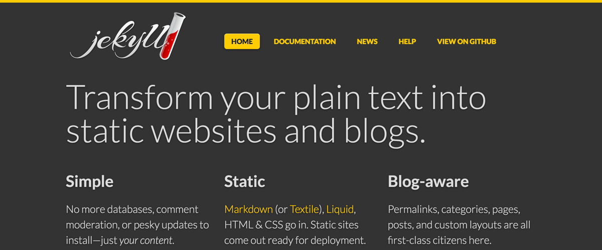
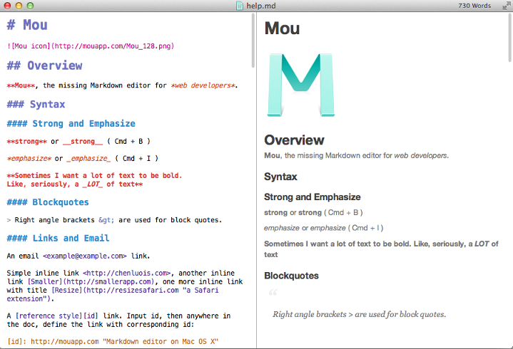

**Table of Contents**
<!-- MarkdownTOC -->

- [Software Development](#software-development)
	- [Blogs and Forums](#blogs-and-forums)
	- [Domain driven design](#domain-driven-design)
	- [API and Documentation Generators](#api-and-documentation-generators)
		- [API Blueprint, defining the emerging API design space](#api-blueprint-defining-the-emerging-api-design-space)
			- [Tools: Apiary](#tools-apiary)
	- [Design Patterns](#design-patterns)
	- [Editors](#editors)
		- [Sublime Text Editor](#sublime-text-editor)
		- [Alternative editors](#alternative-editors)
		- [Diff Tools](#diff-tools)
	- [Regular expressions](#regular-expressions)
	- [Bash](#bash)
	- [PHP](#php)
		- [PHP on Twitter](#php-on-twitter)
	- [Python](#python)
	- [Java](#java)
		- [Java on Twitter](#java-on-twitter)
		- [Java Blogs](#java-blogs)
		- [Java refs](#java-refs)
	- [Swift](#swift)
	- [C programming](#c-programming)
	- [Lambda Expressions](#lambda-expressions)
	- [Front end development](#front-end-development)
		- [Open Source Web Font Families](#open-source-web-font-families)
		- [Web developer tools](#web-developer-tools)
		- [Frontend on Twitter](#frontend-on-twitter)
		- [Frontend Blogs](#frontend-blogs)
		- [javascript/node.js](#javascriptnodejs)
		- [HTML5 and Static Site Generators vs Dynamic CMSs](#html5-and-static-site-generators-vs-dynamic-cmss)
			- [Static Site Generators](#static-site-generators)
			- [Markdown Editors](#markdown-editors)
				- [Emojis](#emojis)
		- [Oracle JET](#oracle-jet)
		- [JSON](#json)
		- [Mozilla Tools](#mozilla-tools)
	- [QA. Software Testing](#qa-software-testing)
		- [Selenium](#selenium)
			- [Selenium on Twitter](#selenium-on-twitter)
		- [Arquillian Testing Platform](#arquillian-testing-platform)

<!-- /MarkdownTOC -->

<blockquote class="twitter-tweet tw-align-center" data-lang="es">
A good programmer can get more done than 10 bad programmers, but a bad programmer&#39;s code can keep 10 good programmers busy for years.
&mdash; Ed Weissman (@edw519) <a href="https://twitter.com/edw519/status/463675238673170432">mayo 6, 2014</a></blockquote>

# Software Development
- [Signs that you're a good programmer 🌟](http://www.yacoset.com/Home/signs-that-you-re-a-good-programmer)
- [15 Characteristics of a Good Programmer](http://www.entrepreneur.com/article/240644)
- [Maintain the Habit of Learning Coding Skills 🌟](https://dzone.com/articles/maintain-the-habit-of-learning-coding-skills)
- [Latency Numbers Every Programmer Should Know](http://www.eecs.berkeley.edu/~rcs/research/interactive_latency.html)
- [blog.udacity.com: The Real Cost of Change in Software Development](http://www.javacodegeeks.com/2013/09/the-real-cost-of-change-in-software-development.html)
- [blog.udacity.com: How You Can Stand Out in Your Next Web Developer Interview](http://blog.udacity.com/2015/01/how-to-stand-out-in-your-web-developer-interview.html)
- [20 Java and Programming Quotes to Motivate Yourself](http://www.javacodegeeks.com/2015/12/20-java-programming-quotes-motivate.html)
- [javacodegeeks.com: Significant Software Development Developments of 2015](http://www.javacodegeeks.com/2016/01/significant-software-development-developments-2015.html)
- [12 Most Influential Books Every Software Engineer Needs to Read](http://jasonroell.com/2015/03/16/12-most-infuential-books-every-software-engineer-needs-to-read/)
- [dzone: Employee Turnover is Good for the Maintainability of Your Code Base](https://dzone.com/articles/employee-turnover-is-good-for-the-maintainability)
- [data.triplebyte.com: Three hundred programming interviews in thirty days](https://data.triplebyte.com/three-hundred-programming-interviews-in-thirty-days-12c23c26b5ba)
- [dzone: Becoming a Senior Engineer 🌟🌟](https://dzone.com/articles/becoming-a-senior-engineer)
- [blog.cleancoder.com: I want to become a Software Architect](http://blog.cleancoder.com/uncle-bob/2016/01/04/ALittleArchitecture.html)
- [techcrunch.com: Unlocking Trapped Engineers](http://techcrunch.com/2016/01/12/unlocking-trapped-engineers/) How can we base a talent shortage on CS degree production when 59.8 percent of those with software engineer, programmer or computer scientist titles in one study did not carry a CS degree; 36 percent of IT workers do not hold a college degree at all, according to the Economic Policy Institute; 40 percent of programmers on Stack Overflow, one of the largest developer websites, are self-taught; or 14 percent of the members of some teams at Google alone don’t have a college degrees?. One million programming jobs may go unfilled by 2020, but only if companies aren’t willing to pause and rethink the barriers that are locking out programmers who entered the field without a CS degree.
- [techcrunch.com: Programming Trends To Look For This Year 🌟](http://techcrunch.com/2016/01/13/1261560/)
- [DZone/DevOps Zone: 13 Experts Share Their 2016 Software Industry Predictions](https://dzone.com/articles/13-experts-share-their-2016-software-industry-pred)
- [6 ways to code faster and with less bugs](www.webcodegeeks.com/web-development/6-ways-code-faster-less-bugs/)
- [The Developer Struggle is Real: What Our Family and Friends Think We Do](https://dzone.com/articles/the-developer-struggle-is-real-what-our-family-and) What our friends and family think we do is quite different from what we actually do. Their misconceptions lead to hilarious exchanges.

## Blogs and Forums
- [DZone 🌟🌟🌟🌟🌟](http://dzone.com)
	- [DZone Refcardz](https://dzone.com/refcardz) The world's largest library of technical cheat sheets
- [DZone/Integration Zone](https://dzone.com/enterprise-integration-training-tools-news)
- [Stack Overflow Developer Survey 2015 🌟🌟🌟🌟🌟](http://stackoverflow.com/research/developer-survey-2015)
- [twitter.com/devbattles](https://twitter.com/devbattles)
	- [devbattles.com](http://www.devbattles.com)
- [javacodegeeks.com](http://javacodegeeks.com/)
	- [examples.javacodegeeks.com 🌟🌟](http://examples.javacodegeeks.com/)
- [javahispano.org](http://www.javahispano.org/)
- [Web Code Geeks - Web Developers Resource Center](http://www.webcodegeeks.com/)
- [developer.ibm.com](http://www.ibm.com/developerworks/)
- [Yacoset.com: Software Engineering Tips](http://www.yacoset.com/)
- [DevX.com: The know-how behind application development](http://www.devx.com/)
- [Genbeta dev](http://www.genbetadev.com/)
- [ivanprego.com](http://ivanprego.com/)
- [boomphisto](http://boomphisto.blogspot.co.at/)
- [rachbelaid.com](http://rachbelaid.com/)
- [Code and comments: Practical and theoretical aspects of software development](https://wilsonericn.wordpress.com)

## Domain driven design
- [domaindrivendesign.org - Domain Driven Design Community](http://www.domaindrivendesign.org/)
- [Domain-driven design description](https://en.wikipedia.org/wiki/Domain-driven_design)
	- [Diseño guiado por el dominio](https://es.wikipedia.org/wiki/Dise%C3%B1o_guiado_por_el_dominio)
- [Demonstrating domain-driven design](http://dddsample.sourceforge.net/)
	- [Demonstrating domain-driven design (GitHub)](https://github.com/citerus/dddsample-core)
- [The Four Elements of Simple Design](http://blog.jbrains.ca/permalink/the-four-elements-of-simple-design) Highly recommended reading

## API and Documentation Generators
- [dzone: The Hard Work When it Comes to Defining APIs 🌟](https://dzone.com/articles/the-hard-work-when-it-comes-to-defining-apis)
- [Devdocs.io: Devdocs API Documentation Browser. DevDocs combines multiple API documentations in a fast, organized, and searchable interface 🌟🌟🌟🌟](http://devdocs.io)
- [Learn it Faster: The Entire JavaScript Language in a Single Image](http://fossbytes.com/learn-it-faster-the-entire-javascript-language-in-a-single-image/)
- [Learn it Faster: The Entire Python Language in a Single Image](http://fossbytes.com/learn-it-faster-the-entire-python-language-in-a-single-image/)

### API Blueprint, defining the emerging API design space
- [API Blueprint 🌟🌟](https://apiblueprint.org)

#### Tools: Apiary
- [API Blueprint Future](http://blog.apiary.io/2015/12/17/API-Blueprint-Future/)
- [API Design Inspiration on GitHub](http://blog.apiary.io/2016/01/12/Get-Inspired-on-GitHub/)

<iframe src="//www.slideshare.net/slideshow/embed_code/key/BkCyPZp16vDeQ0" width="595" height="485" frameborder="0" marginwidth="0" marginheight="0" scrolling="no" style="border:1px solid #CCC; border-width:1px; margin-bottom:5px; max-width: 100%;" allowfullscreen class="video"> </iframe> 
 <strong> <a href="//www.slideshare.net/tacker/rest-http-response-codes-cheat-sheet" title="REST HTTP Response Codes Cheat Sheet" target="_blank">REST HTTP Response Codes Cheat Sheet</a> </strong> from <strong><a href="//www.slideshare.net/tacker" target="_blank">Markus Tacker</a></strong> 

 

## Design Patterns
- [wikipedia: Design Patterns. Gang of Four (GoF) 🌟](https://en.wikipedia.org/wiki/Design_Patterns)
	- [stackoverflow.com: Examples of GoF Design Patterns in Java's core libraries](http://stackoverflow.com/questions/1673841/examples-of-gof-design-patterns-in-javas-core-libraries)
	- [tutorialspoint.com: What is Gang of Four (GOF)?](http://www.tutorialspoint.com/design_pattern/design_pattern_overview.htm)
	- [blackwasp.co.uk: Gang of Four Design Patterns](http://www.blackwasp.co.uk/gofpatterns.aspx)
	- [Patrones del "Gang of Four". Facultad de Informática - Universidad Politécnica de Madrid](http://is.ls.fi.upm.es/docencia/proyecto/docs/patrones_gof.pdf)
- [UML.org](http://www.uml.org/)
- [ibm.com: UML basics: The class diagram](http://www.ibm.com/developerworks/rational/library/content/RationalEdge/sep04/bell/)
- [DZone: The Model-View-ViewModel (MVVM) Pattern – Introduction](https://dzone.com/articles/the-mvvm-pattern-introduction)
- [DZone: Model-View-Controller (MVC): The Basics](https://dzone.com/articles/model-view-controller-mvc-deep-dive)
- [developers.redhat.com: Modern Java EE design patterns](http://developers.redhat.com/promotions/distributed-javaee-architecture/) Building Scalable Architecture for Sustainable Enterprise Development
- [javacodegeeks.com: Java Design Patterns Tutorial](http://www.javacodegeeks.com/2015/09/java-design-patterns.html)
- [Python Design Patterns: For Sleek And Fashionable Code](http://www.toptal.com/python/python-design-patterns)

## Editors
- [tecmint.com: 12 Best Open Source Text Editors (GUI + CLI) I Found in 2015 🌟](http://www.tecmint.com/best-open-source-linux-text-editors/)
- [javacodegeeks.com: Why we dropped Eclipse in favour of IntelliJ](http://www.javacodegeeks.com/2013/09/why-we-dropped-eclipse-in-favour-of-intellij.html)
	- [IntelliJ IDEA Blog](http://blog.jetbrains.com/idea/)
- [javacodegeeks.com: My Development Environment Setup on Linux](http://www.javacodegeeks.com/2015/12/development-environment-setup-linux.html)
- [Gobby: A Collaborative Text Editor](https://gobby.github.io/)
- [SourceForge youtube: How to Use JSONViewer Notepad++ plugin](https://www.youtube.com/watch?v=5TcXJEuA1z4)
- [Visualizing HTTP requests with Node Application Metrics and IBM Health Center](https://developer.ibm.com/open/2016/01/05/visualizing-http-requests-node-application-metrics-health-center/)
	- [eclipse marketplace: IBM Monitoring and Diagnostic Tools - Health Center](http://marketplace.eclipse.org/content/ibm-monitoring-and-diagnostic-tools-health-center)
- [IntelliJ IDEA 16 EAP Improves Debugger and Adds Git Worktree Support](https://dzone.com/articles/intellij-idea-16-eap-improves-debugger-and-adds-gi) A new patch brings several new features to IntelliJ, including the use of Groovy expressions when debugging a Java application and VC integration.

### Sublime Text Editor
- [Sublime Text Editor](sublime.md)

### Alternative editors
- [Atom 1.1 is out 🌟](http://blog.atom.io/2015/10/29/atom-1-1-is-out.html)
- [Lime Text](http://limetext.org/) Lime Text is a powerful and elegant text editor primarily developed in Go that aims to be a Free and open-source software successor to Sublime Text. 
- [Android Studio 2.0](http://developer.android.com/sdk/index.html)
	- [Say hello to a faster Android emulator](https://infinum.co/the-capsized-eight/articles/say-hello-to-a-faster-android-emulator)
	- [Android development is 30% more expensive than iOS. And we have the numbers to prove it!](https://infinum.co/the-capsized-eight/articles/android-development-is-30-percent-more-expensive-than-ios)
	- [Eclipse ha muerto, larga vida a Android Studio](http://www.elandroidelibre.com/2015/12/eclipse-vs-android-studio.html)
- [Screencast of Docker Tooling for Eclipse](http://tools.jboss.org/blog/docker_tooling_eclipse_mars.html)
- [thimble.mozilla.org: Thimble is an online code editor that makes it easy to create and publish your own web pages while learning HTML, CSS & JavaScript](https://thimble.mozilla.org/)
- [Code::Blocks - A free C, C++ and Fortran IDE](http://sourceforge.net/projects/codeblocks/)

### Diff Tools
- [Comparison of file comparison tools](https://en.wikipedia.org/wiki/Comparison_of_file_comparison_tools)
- [winmerge.org](http://winmerge.org/)
	- [youtube: Diff tools on Windows - Compare It! and WinMerge](https://youtu.be/Pbqhg3FrKQ4)
	- [WinMerge plugin for SublimeText](https://github.com/SublimeText/WinMerge)
- [meldmerge.org](http://meldmerge.org/)
- [KDiff3](http://kdiff3.sourceforge.net/)

## Regular expressions
- [RegExr: Learn, Build, & Test RegEx 🌟](http://www.regexr.com/)
- [pythex is a quick way to test your Python regular expressions 🌟](http://pythex.org/)
- [Comparing regular expressions in Perl, Python, and Emacs](http://www.johndcook.com/blog/regex-perl-python-emacs/)

## Bash
- [explainshell.com: write down a command-line to see the help text that matches each argument](http://explainshell.com/)
- [shellcheck.net shell script analyzer:automatically detects problems in sh/bash scripts and commands 🌟](http://www.shellcheck.net/)
- [Writing Robust Bash Shell Scripts 🌟](http://www.davidpashley.com/articles/writing-robust-shell-scripts/)
- [Defensive BASH Programming](http://www.kfirlavi.com/blog/2012/11/14/defensive-bash-programming)

## PHP 
- [How to install PHP 7 on Ubuntu Linux 14.04 LTS](http://www.cyberciti.biz/faq/ubuntu-linux-14-04-install-php7-using-apt-get-command/)

### PHP on Twitter
- [twitter.com/php_net](https://twitter.com/php_net)
- [twitter.com/planetphp](https://twitter.com/planetphp)
- [twitter.com/phpc](https://twitter.com/phpc)
- [twitter.com/phpizer](https://twitter.com/phpizer)

## Python
- [Python](python.md)

## Java
### Java on Twitter
- [twitter.com/java](https://twitter.com/java)
- [twitter.com/Oraclejavamag](https://twitter.com/Oraclejavamag)
- [twitter.com/JavaOneConf](https://twitter.com/JavaOneConf)
- [twitter.com/javacodegeeks](https://twitter.com/javacodegeeks)
- [twitter.com/Java_EE](https://twitter.com/Java_EE)

### Java Blogs
- [Java Magazine by and for the Java community](http://oraclejavamagazine-digital.com)
- [vladmihalcea.com](http://vladmihalcea.com) 
- [blog.eisele.net](http://blog.eisele.net)
- [Java Advent Blog](http://www.javaadvent.com/)
- [codejava.net](http://www.codejava.net/)
- [javacodegeeks.com](http://www.javacodegeeks.com)
- [DZone/Java](https://dzone.com/java-jdk-development-tutorials-tools-news)
- [genbetadev.com: java-j2ee](http://www.genbetadev.com/categoria/java-j2ee)

### Java refs
- [blog.eisele.net: A Refresher - Top 10 Java EE 7 Backend Features](http://blog.eisele.net/2015/12/a-refresher-top-10-java-ee-7-backend.html)
- [codejava.net: Spring Web MVC Security Basic Example Part 1 with XML Configuration](http://www.codejava.net/frameworks/spring/spring-web-mvc-security-basic-example-part-1-with-xml-configuration)
- [genbetadev.com: Herramientas imprescindibles para un desarrollador de Java (2011)](http://www.genbetadev.com/java-j2ee/herramientas-imprescindibles-para-un-desarrollador-de-java)
- [JavaOne 2015](https://www.youtube.com/playlist?list=PLPIzp-E1msrZz6RNdbDiK0nKuxAUZPs77)
- [javacodegeeks.com: Top 10 Books For Advanced Level Java Developers](http://www.javacodegeeks.com/2013/09/top-10-books-for-advanced-level-java-developers.html)
- [javacodegeeks.com: What’s new in Java 8](http://www.javacodegeeks.com/2013/09/whats-new-in-java-8-part-i-javafx.html)
- [Java EE 6 Cookbook for Securing, Tuning, and Extending Enterprise Applications--Free 60 Page Excerpt](http://javacodegeeks.tradepub.com/free/w_pack28/)
- [javacodegeeks.com: 15 Java Socket Programming, Networking Interview Questions and Answers](http://www.javacodegeeks.com/2014/08/15-java-socket-programming-networking-interview-questions-and-answers.html)
- [Multithreading and Concurrency Interview Questions and Answers – The ULTIMATE List (PDF Download)](http://www.javacodegeeks.com/2014/11/multithreading-concurrency-interview-questions-answers.html)
- [Analysis: Google Moving to OpenJDK, What That Really Means](https://www.codenameone.com/blog/analysis-google-moving-to-openjdk-what-that-really-means.html)
- [Java in 2015 – Major happenings](http://www.javacodegeeks.com/2015/12/java-2015-major-happenings.html)
- [5 Error Tracking Tools Java Developers Should Know](http://www.javacodegeeks.com/2014/09/5-error-tracking-tools-java-developers-should-know.html)
- [Dzone: A Simpler Way to Secure a Java Application](https://dzone.com/articles/a-simpler-way-to-secure-your-java-application-with)
- [javacodegeeks.com: Java 8 Features Tutorial – The ULTIMATE Guide (PDF Download)](http://www.javacodegeeks.com/2014/05/java-8-features-tutorial.html)
- [Profile of successful Java developer in 2016](http://www.javacodegeeks.com/2015/12/profile-successful-java-developer-2016.html)
- [Introduction to Docker for Java Developers – Getting started with Docker](http://examples.javacodegeeks.com/devops/introduction-docker-java-developers/)
- ["Learn Python" Overtakes "Learn Java" on Google Trends 🌟🌟🌟](https://dzone.com/articles/learn-python-overtakes-learn-java)
- [dzone: High-Performance Immutable Business Objects](https://dzone.com/articles/high-performance-immutable-business-objects)
- [dzone: Java Annotated Monthly – January 2016.](https://dzone.com/articles/java-annotated-monthly-january-2016) All the latest interesting news and blogs around Java and the JVM languages, including the OpenJDK Android news and some thoughts from Mark Reinhold.
- [javacodegeeks.com: 10 Examples of using ArrayList in Java – Tutorial](http://www.javacodegeeks.com/2016/01/10-examples-using-arraylist-java-tutorial.html)
- [javacodegeeks.com: OutputStyleSheet Example with JSF 2.0](http://examples.javacodegeeks.com/enterprise-java/jsf/outputstylesheet-example-with-jsf-2-0)
- [examples.javacodegeeks.com: Spring MVC Handler Mapping Example](http://examples.javacodegeeks.com/enterprise-java/spring/mvc/spring-mvc-handler-mapping-example)
- [DZone: String Concatenation's Effect on Performance](https://dzone.com/articles/string-concatentions-effect-on-performance) Don’t use the string concatenation operator to combine more than a few strings unless performance is irrelevant. Use StringBuilder’s append method instead. 
- [Coordination and service discovery with Apache Zookeeper](http://www.javacodegeeks.com/2013/11/coordination-and-service-discovery-with-apache-zookeeper.html)
- [Multithreading and Concurrency Interview Questions and Answers – The ULTIMATE List (PDF Download)](http://www.javacodegeeks.com/2014/11/multithreading-concurrency-interview-questions-answers.html)
- [DZone: Spring Data Mongodb and Spring Boot](https://dzone.com/articles/spring-data-mongodb-spring-boot) You really can quickly develop a microservice to access MongoDB from Java 8 with little coding. Give it a try... easy like Sunday morning.

## Swift
- [medium.com: 100 Days of Swift](https://medium.com/@samvlu/100-days-of-swift-736d45a19b63#.2onig73ur)
- [dzone: Using a C Library in Swift](https://dzone.com/articles/using-a-c-library-in-swift)

## C programming
- [How to C in 2016](https://matt.sh/howto-c)

## Lambda Expressions 
- [dzone: Understanding Lambda Expressions](https://dzone.com/articles/understanding-lambda-expressions)

## Front end development
- [Top front-ends blogs, videos, repos, accounts and articles. This all is about javascript/node.js, html5, css, mobile web and etc](https://frontend.zeef.com)
- [Ur/Web makes writing Web applications easier — and more secure](http://bostinno.streetwise.co/2014/12/23/urweb-new-programming-language-out-of-mit/)
- [Hipster Ipsum, Artisanal filler text for your site or project](http://hipsum.co/)
- [simple-talk.com: Script Loading between HTTP/1.1 and HTTP/2](https://www.simple-talk.com/dotnet/asp.net/script-loading-between-http1.1-and-http2/)

### Open Source Web Font Families
- [Red Hat introduces new open source 'Overpass' Font (Web+TTF)](http://overpassfont.org/)

### Web developer tools
- [13 web developer tools!](http://www.catonmat.net/blog/more-web-developer-tools/)

### Frontend on Twitter
- [twitter.com/getbootstrap](https://twitter.com/getbootstrap)
- [twitter.com/nodejs](https://twitter.com/nodejs)
- [twitter.com/angularjs](https://twitter.com/angularjs)

### Frontend Blogs
- [webcodegeeks.com](http://www.webcodegeeks.com)
- [DZone/Web Dev](https://dzone.com/web-development-programming-tutorials-tools-news)

### javascript/node.js
- [JSFiddle.net: Create a new fiddle](https://jsfiddle.net) Test your JavaScript, CSS, HTML or CoffeeScript online with JSFiddle code editor
	- [Pause YouTube playback after X seconds](http://jsfiddle.net/hnkk7/)
	- [embedding youtube](http://jsfiddle.net/aXLA2/)
- [5 Awesome Tutorials to Kick-Start your Web Programming Projects](http://www.javacodegeeks.com/2015/11/5-awesome-tutorials-to-kick-start-your-web-programming-projects.html)
- [15 Reasons Why Developers Need to Learn AngularJS](http://www.javacodegeeks.com/2015/11/15-reasons-developers-need-learn-angularjs.html)
- [medium.com/javascript-scene: Forget the Click Bait. Here’s What the JavaScript Job Market Really Looks Like in 2016](https://medium.com/javascript-scene/forget-the-click-bait-here-s-what-the-javascript-job-market-really-looks-like-in-2016-ddfe0d39b467)
- [webcodegeeks.com: Node.js Tutorial: Building web apps](http://www.webcodegeeks.com/javascript/node-js/building-web-apps-with-node-js/)
- [webcodegeeks.com: Simple JavaScript OOP for C++, Java and C# Developers](http://www.webcodegeeks.com/javascript/simple-javascript-oop-for-c-java-and-c-developers/)
- [javacodegeeks.com: How to integrate AJAX into a Spring MVC application](http://www.javacodegeeks.com/2013/09/spring-mvc-ajax-jquery.html)
- [Node.js Version Chaos Management](http://www.linuxjournal.com/content/nodejs-version-chaos-management)
- [github: Javascript Tips – A JavaScript Tip per Day](https://github.com/loverajoel/jstips)
- [webcodegeeks.com: JavaScript Sort Array Example](http://www.webcodegeeks.com/javascript/javascript-sort-array-example)
- [Exploring Async Techniques in JavaScript](https://github.com/thalesmello/exploring-async/blob/master/exploring_async.md)
- [65 JavaScript Interview Questions and Answers – The ULTIMATE List (PDF Download)](http://www.webcodegeeks.com/javascript/javascript-interview-questions-answers/)
- [Real-time Applications with AngularJS and Java – Part 1](http://examples.javacodegeeks.com/core-java/real-time-applications-angularjs-java-part-1/)
	- [Real-time Applications with AngularJS and Java – Part 2](http://examples.javacodegeeks.com/core-java/real-time-applications-angularjs-java-part-2/)
	- [Real-time Applications with AngularJS and Java – Part 3](http://examples.javacodegeeks.com/core-java/real-time-applications-angularjs-java-part-3/)
- [dzone: Learning JavaScript with JS Bin](https://dzone.com/articles/learning-javascript-with-js-bin)
- [dzone: Performing SEO on AngularJS Web Apps - Developer’s Guide](https://dzone.com/articles/performing-seo-on-angularjs-web-apps-developers-gu)
- [dzone: Managing Users in Your AngularJS App](https://dzone.com/articles/managing-users-in-your-angularjs-app)
- [webcodegeeks.com: 65 JavaScript Interview Questions and Answers – The ULTIMATE List (PDF Download)](http://www.webcodegeeks.com/javascript/javascript-interview-questions-answers)
- [ibm.com: Use Active Directory for authentication and authorization in your Node.js Bluemix application](http://www.ibm.com/developerworks/library/se-use-active-directory-authentication-authorization-node.js-bluemix-application/index.html)
- [Top 20 jQuery Interview Questions and Answers for JavaScript Programmers](http://www.webcodegeeks.com/javascript/jquery/jquery-interview-questions-answers-programmers)
- [webcodegeeks.com: jQuery dialog example](http://www.webcodegeeks.com/javascript/jquery/jquery-dialog-example) jQuery UI is a collection of jQuery plugins used to enhance the web application user interface. Inside this library we find many reusable components for interactions, effects, widgets and more.
- [10 Awesome AngularJS Tutorials to Kick-Start your Web Programming Projects](http://www.javacodegeeks.com/2015/12/10-awesome-angularjs-tutorials-to-kick-start-your-web-programming-projects.html)
- [Secrets of the JavaScript Ninja – Debugging JavaScript](http://www.webcodegeeks.com/javascript/secrets-of-the-javascript-ninja-debugging-javascript/)
- [aprendiendo-javascript.readthedocs.org](http://aprendiendo-javascript.readthedocs.org)

### HTML5 and Static Site Generators vs Dynamic CMSs
- [HTML5 and CSS3 Code Generator Tools List, Initializr is perhaps the most popular](http://www.webcodegeeks.com/html5/html5-css3-code-generator-tools-list)
	- [Initializr: Start an HTML5 project in 15 seconds!](http://www.initializr.com/)
- [Good things in life are free. Read online "Programming JavaScript Applications" book for free](http://chimera.labs.oreilly.com/books/1234000000262)
- [redsilice.com - Node.js. Una Introducción](http://www.redsilice.com/redsilice/?p=329)
- [wired.com - Google's Angular 2 release pushes javascript beyond the browser](http://www.wired.com/2015/12/googles-angular-2-release-helps-push-javascript-beyond-the-browser/)
- [webcodegeeks.com: Top 10 Major Advantages of HTML5](http://www.webcodegeeks.com/html5/top-10-major-advantages-html5/)

#### Static Site Generators
- [Why Static Website Generators Are The Next Big Thing 🌟🌟🌟🌟🌟](https://www.smashingmagazine.com/2015/11/modern-static-website-generators-next-big-thing/)
- [Why You Should Use a Static Site Generator 🌟🌟🌟🌟](http://formkeep.wpengine.com/?p=7)
- [Top Open-Source Static Site Generators 🌟🌟🌟](https://www.staticgen.com/)
- [Static Site Generators 🌟](https://staticsitegenerators.net) The definitive listing of Static Site Generators 
- [pages.github.com](https://pages.github.com)
- [mkdocs.org](http://www.mkdocs.org)
    - [ReadtheDocs.org - Create, host, and browse documentation](https://readthedocs.org/)
    	- [mkdocs.readthedocs.org](https://mkdocs.readthedocs.org)
        - [Readthedocs in Docker](https://github.com/moul/docker-readthedocs) A Docker container of Readthedocs (RTD)
	    - [Configuration of the production servers](https://github.com/rtfd/readthedocs.org/blob/master/docs/rtfd.rst)
	- [mkdocs.org release notes](http://www.mkdocs.org/about/release-notes)
	- [mkdocs.org: Styling your docs](http://www.mkdocs.org/user-guide/styling-your-docs/#built-in-themes)
- [gohugo.io](https://gohugo.io)

#### Markdown Editors
- [Mou](http://25.io/mou/)
- [Markdown preview and build plugin for sublime text 2/3](https://github.com/revolunet/sublimetext-markdown-preview)
- [Markdown-here.com: formatting e-mail with markdown](http://markdown-here.com)
- [Markdown live preview](http://markdown-here.com/livedemo.html)

##### Emojis 
- [emojipedia.org](http://emojipedia.org)
- [Markdown emoji cheat sheet](http://www.emoji-cheat-sheet.com/)
- [getemoji.com](http://getemoji.com)
- [Unicode emoji](http://unicode.org/emoji/charts/full-emoji-list.html)

<iframe width="420" height="315" src="https://www.youtube-nocookie.com/embed/XnPkdcBGBlw?rel=0" frameborder="0" allowfullscreen class="video"></iframe>

 

### Oracle JET
- [community.oracle.com - Oracle JET: Getting Started With Modern Web Development.](https://community.oracle.com/docs/DOC-984517) Oracle JET promises to be an enterprise-grade framework for end-to-end client-side web application development.
- [Oracle JET](http://www.oracle.com/webfolder/technetwork/jet/index.html)
- [JavaScript Extension Toolkit (Oracle JET) by Rubén Rodríguez Santiago](http://weblogiccommunity.com/2016/01/18/javascript-extension-toolkit-oracle-jet-by-rubn-rodrguez-santiago/)

### JSON
- [json.org](http://json.org/)
- [Json Parser Online](http://json.parser.online.fr/)
- [BSON - Binary JSON](http://bsonspec.org/)
- [Stop Comparing JSON and XML](https://dzone.com/articles/stop-comparing-json-and-xml)
- [Query JSON using SQL with Couchbase Query Workbench](http://www.javacodegeeks.com/2016/01/query-json-using-sql-couchbase-query-workbench.html)
- [DZone: The Importance of a Data Format: Part 1 — Current State Problems](https://dzone.com/articles/the-importance-of-a-data-format-part-i-current-sta) JSON is a really simple format. It's very easy to work with it, interchange it, read it, etc. However, JSON also has a few major issues.
- [Querying JSON in Postgres](http://schinckel.net/2014/05/25/querying-json-in-postgres/) Good read for anyone storing jsonb data in postgresql
- [jq is a lightweight and flexible command-line JSON processor](https://stedolan.github.io/jq/) jq is like sed for JSON data - you can use it to slice and filter and map and transform structured data with the same ease that sed, awk, grep and friends let you play with text.

### Mozilla Tools
- [developer.mozilla.org](https://developer.mozilla.org/)
- [Mozilla Tools](https://teach.mozilla.org/tools/)
- [Firefox developer edition](https://www.mozilla.org/firefox/developer/)

## QA. Software Testing
- [dzone.com: The QA Checklist Framework. 13 considerations for building your own QA checklist](https://dzone.com/articles/the-qa-checklist-avoid-costly-oversights-by-implem)
- [blog.testproject.io - World’s most desirable test automation skills!](http://blog.testproject.io/2015/12/03/worlds-most-desirable-automation-skills/)
- [TestNG: Run tests sequentially with @DataProvider inside one test class](http://www.javacodegeeks.com/2014/01/testng-run-tests-sequentially-with-dataprovider-inside-one-test-class.html)
- [thenewstack.io: How Vagrant Eases Software Research and Testing](http://thenewstack.io/vagrant-developers-researchers/)
- [JUnit Tutorial for Unit Testing – The ULTIMATE Guide (PDF Download)](http://www.javacodegeeks.com/2014/11/junit-tutorial-unit-testing.html)
- [Free online Book: O'Reilly® Test-Driven Development with Python](http://freecomputerbooks.com/Test-Driven-Development-with-Python.html)
- [eBook: Testing Python. Applying Unit Testing, TDD, BDD and Acceptance Testing](http://it-ebooks.info/book/3778/)
- [pyvideo.org: TDD with Django, from scratch: a beginner's intro to testing and web development](http://www.pyvideo.org/video/3509/tdd-with-django-from-scratch-a-beginners-intro)
- [Declarative HTTP Testing. Gabbi is a tool for running HTTP tests where requests and responses are represented in a declarative YAML-based form](http://gabbi.readthedocs.org/)
- [The first tool that automatically refactors your Python code](https://www.quantifiedcode.com/how-it-works)
- [obeythetestinggoat.com: TDD for the Web, with Python, Selenium, Django, JavaScript and pals](http://www.obeythetestinggoat.com/)
	- [Testing, async, asyncio, and performance](http://www.obeythetestinggoat.com/testing-async-asyncio-and-performance.html)
- [javacodegeeks.com: 10 Reasons why you should NOT write unit test cases!](http://www.javacodegeeks.com/2013/10/10-reasons-why-you-should-not-write-unit-test-cases.html)
- [DZone: Graybox Testing — Control Your Dependencies](https://dzone.com/articles/graybox-testing-control-your-dependencies) This post continues the story about functional testing which I referred to in Blackbox Testing Microservices. 
- [Testing: Appetite Comes With Eating](http://www.javacodegeeks.com/2016/01/testing-appetite-comes-eating.html) Why are tests needed should be obvious by now. It’s not all about finding bugs (because then you can use an excuse like “QAs will find them anyway”), it’s about having a codebase that can remain stable with changes. And it’s about writing better code, because testable code is cleaner.
- [Test Anything Protocol (TAP)](https://testanything.org/)
- [Dzone/DevOps Zone: Four Ways Testers Can Eliminate Risks in Test Automation](https://dzone.com/articles/4-ways-testers-can-eliminate-risks-in-test-automat)
- [adictosaltrabajo.com: Tutorial ‘Docker Integration Test’](http://www.adictosaltrabajo.com/tutoriales/tutorial-docker-integration-test/)
- [DZone/Integration Zone: API Testing With Runscope](https://dzone.com/articles/api-testing-with-runscope) If you're using APIs, you need to test well. Here's a guide to testing APIs with Runscope, with a breakdown of creating a bucket and making a test.
	- [runscope.com](https://www.runscope.com/)
- [Why Automated Testing is the key to rapid product development](https://nothingventured.rocks/why-automated-testing-is-the-key-to-rapid-product-development-e8b0a3d3040)

### Selenium
- [Selenium, QTP Job Trends](http://www.indeed.com/publicanalytics/jobanalytics/jobtrends?q=selenium%2C+qtp&l=)
- [selenium 2.49.0 released: Python bindings for Selenium](https://pypi.python.org/pypi/selenium/2.49.0)
- [slideshare: Selenium Tips & Tricks](http://www.slideshare.net/tourdedave/selenium-tips-tricks)

#### Selenium on Twitter
- [twitter.com/SeleniumHQ](https://twitter.com/SeleniumHQ)
- [twitter.com/saucelabs](https://twitter.com/saucelabs)
- [twitter.com/seleniumconf](https://twitter.com/seleniumconf)
- [twitter.com/SeleniumExample](https://twitter.com/SeleniumExample)

### Arquillian Testing Platform
- [Arquillian references in this blog](redhat.md#jboss-gatein-exo-forge-forums-developer-studio-arquillian-testing-platform-and-others)

________________________________________________________________________________________________________________________________

<blockquote class="twitter-tweet tw-align-center" data-lang="es">
Why 100% of dev-test will be done using <a href="https://twitter.com/hashtag/cloud?src=hash">#cloud</a>-based platforms, infrastructure &amp; software within 10 years: <a href="https://t.co/G6WSCpt2VA">https://t.co/G6WSCpt2VA</a> <a href="https://twitter.com/forbesbv">@forbesbv</a>
&mdash; Oracle (@Oracle) <a href="https://twitter.com/Oracle/status/699383199261036545">febrero 16, 2016</a></blockquote>

<iframe src="//www.slideshare.net/slideshow/embed_code/key/enq08ekUWo1s65" width="595" height="485" frameborder="0" marginwidth="0" marginheight="0" scrolling="no" style="border:1px solid #CCC; border-width:1px; margin-bottom:5px; max-width: 100%;" allowfullscreen class="video"> </iframe> 
 <strong> <a href="//www.slideshare.net/cuelogic/automation-testing-by-selenium-web-driver" title="Automation Testing by Selenium Web Driver" target="_blank">Automation Testing by Selenium Web Driver</a> </strong> from <strong><a href="//www.slideshare.net/cuelogic" target="_blank">Cuelogic Technologies Pvt. Ltd.</a></strong> 

 
 

<iframe src="//www.slideshare.net/slideshow/embed_code/key/cTKwjMmxpspx8i" width="595" height="485" frameborder="0" marginwidth="0" marginheight="0" scrolling="no" style="border:1px solid #CCC; border-width:1px; margin-bottom:5px; max-width: 100%;" allowfullscreen class="video"> </iframe> 
 <strong> <a href="//www.slideshare.net/tourdedave/how-to-use-selenium-successfully-java-edition" title="How To Use Selenium Successfully (Java Edition)" target="_blank">How To Use Selenium Successfully (Java Edition)</a> </strong> from <strong><a href="//www.slideshare.net/tourdedave" target="_blank">Dave Haeffner</a></strong> 

 

<iframe src="//www.slideshare.net/slideshow/embed_code/key/uZwR77RCr9eV0W" width="595" height="485" frameborder="0" marginwidth="0" marginheight="0" scrolling="no" style="border:1px solid #CCC; border-width:1px; margin-bottom:5px; max-width: 100%;" allowfullscreen class="video"> </iframe> 
 <strong> <a href="//www.slideshare.net/Miguelcs1/convencer-al-jefe-para-aplicar-calidad-del-software" title="Convencer al jefe para aplicar &quot;Calidad de Software&quot;." target="_blank">Convencer al jefe para aplicar &quot;Calidad de Software&quot;.</a> </strong> from <strong><a href="//www.slideshare.net/Miguelcs1" target="_blank">Miguel cs</a></strong> 

 

<a href="http://agile-testing.tumblr.com/post/139044569770/accelerating-devops-processes-through-agile">http://agile-testing.tumblr.com/post/139044569770/accelerating-devops-processes-through-agile</a>
