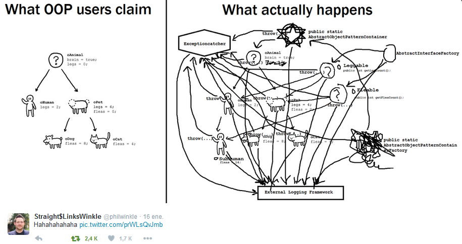
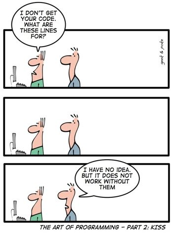
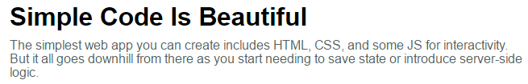
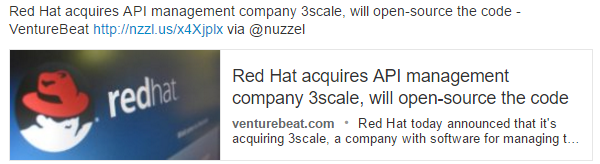
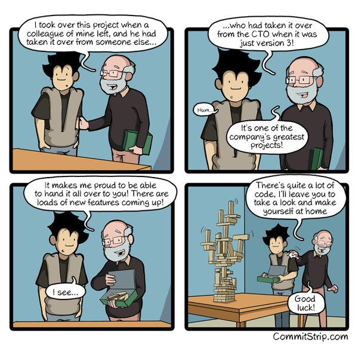
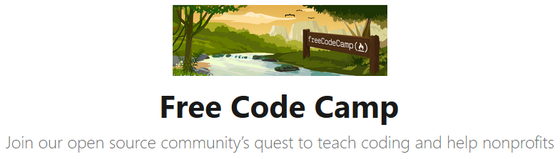
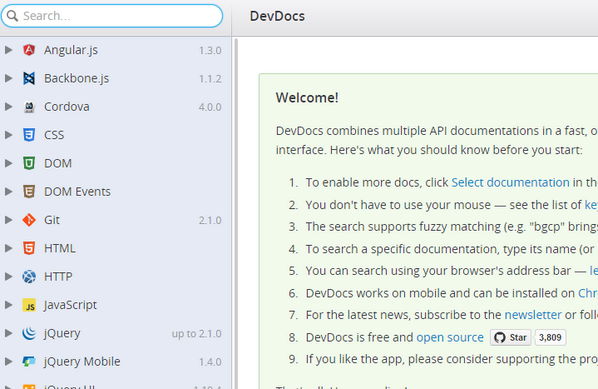
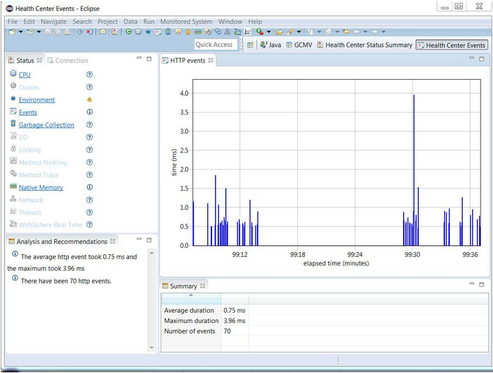
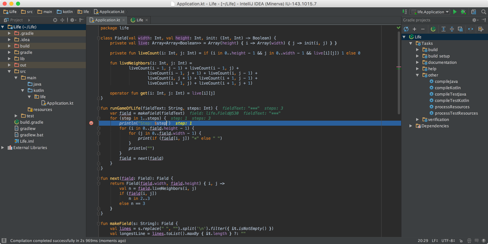
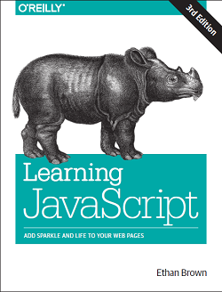

**Table of Contents**
<!-- MarkdownTOC -->

- [Software Development](#software-development)
	- [Blogs and Forums](#blogs-and-forums)
	- [Domain driven design](#domain-driven-design)
	- [API and Documentation Generators](#api-and-documentation-generators)
		- [API Blueprint, defining the emerging API design space](#api-blueprint-defining-the-emerging-api-design-space)
			- [Tools: Apiary](#tools-apiary)
	- [Design Patterns](#design-patterns)
	- [Editors](#editors)
		- [Sublime Text Editor](#sublime-text-editor)
	- [Regular expressions](#regular-expressions)
	- [Bash](#bash)
	- [PHP](#php)
		- [PHP on Twitter](#php-on-twitter)
	- [Python](#python)
	- [Java](#java)
	- [Swift](#swift)
	- [C programming](#c-programming)
	- [Lambda Expressions](#lambda-expressions)
	- [Apache Usergrid Backend-as-a-Service Framework](#apache-usergrid-backend-as-a-service-framework)
	- [Front end development](#front-end-development)
		- [Open Source Web Font Families](#open-source-web-font-families)
		- [Web developer tools](#web-developer-tools)
		- [Frontend on Twitter](#frontend-on-twitter)
		- [Frontend Blogs](#frontend-blogs)
		- [javascript/node.js](#javascriptnodejs)
		- [HTML5 and Static Site Generators vs Dynamic CMSs](#html5-and-static-site-generators-vs-dynamic-cmss)
			- [Static Site Generators](#static-site-generators)
		- [WebAssembly](#webassembly)
		- [Oracle JET](#oracle-jet)
		- [JSON](#json)
		- [Mozilla Tools](#mozilla-tools)

<!-- /MarkdownTOC -->

<blockquote class="twitter-tweet tw-align-center" data-lang="es">
Which Career to Choose: Programmer Vs Administrator <a href="http://t.co/JWYZS7mfjz">http://t.co/JWYZS7mfjz</a> via <a href="https://twitter.com/tecmint">@tecmint</a>
&mdash; TecMint.com (@tecmint) <a href="https://twitter.com/tecmint/status/472604266905886720">31 de mayo de 2014</a></blockquote>

<blockquote class="twitter-tweet tw-align-center" data-lang="es">
10 signos que indican que no estás hecho para ser programador <a href="https://t.co/24QDvGC8d4">https://t.co/24QDvGC8d4</a>
&mdash; visualms (@visualms) <a href="https://twitter.com/visualms/status/732904175173001217">18 de mayo de 2016</a></blockquote>

<blockquote class="twitter-tweet tw-align-center" data-lang="es">
A good programmer can get more done than 10 bad programmers, but a bad programmer&#39;s code can keep 10 good programmers busy for years.
&mdash; Ed Weissman (@edw519) <a href="https://twitter.com/edw519/status/463675238673170432">mayo 6, 2014</a></blockquote>

<blockquote class="twitter-tweet tw-align-center" data-lang="es">
Always code as if the guy who ends up maintaining your code will be a violent psychopath who knows where you live.
&mdash; Tech-FAQ (@tech_faq) <a href="https://twitter.com/tech_faq/status/701785024257851392">febrero 22, 2016</a></blockquote>

<blockquote class="twitter-tweet tw-align-center" data-lang="es">
Cheat sheet to talk to a programmer <a href="https://t.co/zXzZsVbxcM">pic.twitter.com/zXzZsVbxcM</a>
&mdash; Unixmen (@unixmen) <a href="https://twitter.com/unixmen/status/734021112191963136">21 de mayo de 2016</a></blockquote>

<blockquote class="twitter-tweet tw-align-center" data-lang="es">
The 13 <a href="https://twitter.com/hashtag/developer?src=hash">#developer</a> skills you need to master now - <a href="https://t.co/NbKKt4nvqo">https://t.co/NbKKt4nvqo</a> via <a href="https://twitter.com/CIOAsia">@CIOAsia</a> <a href="https://twitter.com/hashtag/JavaScript?src=hash">#JavaScript</a> <a href="https://twitter.com/hashtag/BigData?src=hash">#BigData</a> <a href="https://twitter.com/hashtag/DevOps?src=hash">#DevOps</a> <a href="https://twitter.com/hashtag/Cloud?src=hash">#Cloud</a> <a href="https://twitter.com/hashtag/IoT?src=hash">#IoT</a>
&mdash; Red Hat Cloud (@RedHatCloud) <a href="https://twitter.com/RedHatCloud/status/708784367615606784">12 de marzo de 2016</a></blockquote>

<blockquote class="twitter-tweet tw-align-center" data-lang="es">
A Linux Cheat Sheet for Developers <a href="https://t.co/aUpRrwnxRY">https://t.co/aUpRrwnxRY</a>
&mdash; RHELdevelop (@RHELdevelop) <a href="https://twitter.com/RHELdevelop/status/715108433037398016">30 de marzo de 2016</a></blockquote>

<blockquote class="twitter-tweet tw-align-center" data-lang="es">
6 essential non-coding careers in open source: <a href="https://t.co/uepH3F9V2d">https://t.co/uepH3F9V2d</a> <a href="https://t.co/yXYgMW6kJu">pic.twitter.com/yXYgMW6kJu</a>
&mdash; Open Source Way (@opensourceway) <a href="https://twitter.com/opensourceway/status/715238167218008064">30 de marzo de 2016</a></blockquote>

<blockquote class="twitter-tweet tw-align-center" data-lang="es">
The app explosion is over <a href="https://t.co/sEx4lFSgxa">https://t.co/sEx4lFSgxa</a> <a href="https://t.co/fCmixATBfr">pic.twitter.com/fCmixATBfr</a>
&mdash; Business Insider (@businessinsider) <a href="https://twitter.com/businessinsider/status/737678559976787969">31 de mayo de 2016</a></blockquote>

# Software Development
- [Signs that you're a good programmer 🌟](http://www.yacoset.com/Home/signs-that-you-re-a-good-programmer)
- [15 Characteristics of a Good Programmer](http://www.entrepreneur.com/article/240644)
- [Maintain the Habit of Learning Coding Skills 🌟](https://dzone.com/articles/maintain-the-habit-of-learning-coding-skills)
- [Latency Numbers Every Programmer Should Know](http://www.eecs.berkeley.edu/~rcs/research/interactive_latency.html)
- [blog.udacity.com: The Real Cost of Change in Software Development](http://www.javacodegeeks.com/2013/09/the-real-cost-of-change-in-software-development.html)
- [blog.udacity.com: How You Can Stand Out in Your Next Web Developer Interview](http://blog.udacity.com/2015/01/how-to-stand-out-in-your-web-developer-interview.html)
- [20 Java and Programming Quotes to Motivate Yourself](http://www.javacodegeeks.com/2015/12/20-java-programming-quotes-motivate.html)
- [javacodegeeks.com: Significant Software Development Developments of 2015](http://www.javacodegeeks.com/2016/01/significant-software-development-developments-2015.html)
- [12 Most Influential Books Every Software Engineer Needs to Read](http://jasonroell.com/2015/03/16/12-most-infuential-books-every-software-engineer-needs-to-read/)
- [dzone: Employee Turnover is Good for the Maintainability of Your Code Base](https://dzone.com/articles/employee-turnover-is-good-for-the-maintainability)
- [data.triplebyte.com: Three hundred programming interviews in thirty days](https://data.triplebyte.com/three-hundred-programming-interviews-in-thirty-days-12c23c26b5ba)
- [dzone: Becoming a Senior Engineer 🌟🌟](https://dzone.com/articles/becoming-a-senior-engineer)
- [blog.cleancoder.com: I want to become a Software Architect](http://blog.cleancoder.com/uncle-bob/2016/01/04/ALittleArchitecture.html)
- [techcrunch.com: Unlocking Trapped Engineers](http://techcrunch.com/2016/01/12/unlocking-trapped-engineers/) How can we base a talent shortage on CS degree production when 59.8 percent of those with software engineer, programmer or computer scientist titles in one study did not carry a CS degree; 36 percent of IT workers do not hold a college degree at all, according to the Economic Policy Institute; 40 percent of programmers on Stack Overflow, one of the largest developer websites, are self-taught; or 14 percent of the members of some teams at Google alone don’t have a college degrees?. One million programming jobs may go unfilled by 2020, but only if companies aren’t willing to pause and rethink the barriers that are locking out programmers who entered the field without a CS degree.
- [techcrunch.com: Programming Trends To Look For This Year 🌟](http://techcrunch.com/2016/01/13/1261560/)
- [DZone/DevOps Zone: 13 Experts Share Their 2016 Software Industry Predictions](https://dzone.com/articles/13-experts-share-their-2016-software-industry-pred)
- [6 ways to code faster and with less bugs](www.webcodegeeks.com/web-development/6-ways-code-faster-less-bugs/)
- [The Developer Struggle is Real: What Our Family and Friends Think We Do](https://dzone.com/articles/the-developer-struggle-is-real-what-our-family-and) What our friends and family think we do is quite different from what we actually do. Their misconceptions lead to hilarious exchanges.
- [Which programming language should I learn first? 🌟🌟🌟](http://i.cubeupload.com/dxUuH1.png)

<blockquote class="twitter-tweet tw-align-center" data-lang="es">
Which programming language should I learn first? Large version <a href="https://t.co/JxKrY4rYUD">https://t.co/JxKrY4rYUD</a> <a href="https://t.co/O51aIH5EcM">pic.twitter.com/O51aIH5EcM</a>
&mdash; nixCraft (@nixcraft) <a href="https://twitter.com/nixcraft/status/701895847731032064">febrero 22, 2016</a></blockquote>

<blockquote class="twitter-tweet tw-align-center" data-lang="es">
Bonus points if you can&#39;t even read it yourself <a href="https://t.co/9Tk2WREN0E">pic.twitter.com/9Tk2WREN0E</a>
&mdash; Practical Developer (@ThePracticalDev) <a href="https://twitter.com/ThePracticalDev/status/710156980535558144">16 de marzo de 2016</a></blockquote>

<blockquote class="twitter-tweet tw-align-center" data-lang="es">
Awesome and free PDF ebook: Modern C <a href="https://t.co/1hWOAy5Hda">https://t.co/1hWOAy5Hda</a> <a href="https://twitter.com/hashtag/programming?src=hash">#programming</a>
&mdash; nixCraft (@nixcraft) <a href="https://twitter.com/nixcraft/status/711106381806350336">19 de marzo de 2016</a></blockquote>

<blockquote class="twitter-tweet tw-align-center" data-lang="es">
The good coder is the coder who codes good code... <a href="https://t.co/8OxyoKaAxm">https://t.co/8OxyoKaAxm</a> <a href="https://t.co/EwywiSDre0">pic.twitter.com/EwywiSDre0</a>
&mdash; CommitStrip (@CommitStrip) <a href="https://twitter.com/CommitStrip/status/740238819841150976">7 de junio de 2016</a></blockquote>

<blockquote class="twitter-tweet tw-align-center" data-lang="es">
Biggest Opportunities For Improvement in Software Development<a href="https://twitter.com/hashtag/Agile?src=hash">#Agile</a><a href="https://t.co/6kJIj7CQe3">https://t.co/6kJIj7CQe3</a>  via <a href="https://twitter.com/ctsmithiii">@ctsmithiii</a> <a href="https://t.co/pdob2eYKRy">pic.twitter.com/pdob2eYKRy</a>
&mdash; DZone (@DZone) <a href="https://twitter.com/DZone/status/744335659997995008">19 de junio de 2016</a></blockquote>

## Blogs and Forums
- [DZone 🌟🌟🌟🌟🌟](http://dzone.com)
	- [DZone Refcardz](https://dzone.com/refcardz) The world's largest library of technical cheat sheets
- [DZone/Integration Zone](https://dzone.com/enterprise-integration-training-tools-news)
- [Stack Overflow Developer Survey 2015 🌟🌟🌟🌟🌟](http://stackoverflow.com/research/developer-survey-2015)
- [twitter.com/devbattles](https://twitter.com/devbattles)
	- [devbattles.com](http://www.devbattles.com)
- [javacodegeeks.com](http://javacodegeeks.com/)
	- [examples.javacodegeeks.com 🌟🌟](http://examples.javacodegeeks.com/)
- [javahispano.org](http://www.javahispano.org/)
- [Web Code Geeks - Web Developers Resource Center](http://www.webcodegeeks.com/)
- [developer.ibm.com](http://www.ibm.com/developerworks/)
- [Yacoset.com: Software Engineering Tips](http://www.yacoset.com/)
- [DevX.com: The know-how behind application development](http://www.devx.com/)
- [Genbeta dev](http://www.genbetadev.com/)
- [ivanprego.com](http://ivanprego.com/)
- [boomphisto](http://boomphisto.blogspot.co.at/)
- [rachbelaid.com](http://rachbelaid.com/)
- [Code and comments: Practical and theoretical aspects of software development](https://wilsonericn.wordpress.com)
- [medium.freecodecamp.com 🌟🌟🌟](https://medium.freecodecamp.com)

<blockquote class="twitter-tweet tw-align-center" data-lang="es">
Are you still wasting time on pesky bug fixes? <a href="https://t.co/4fZ2wEFBxh">pic.twitter.com/4fZ2wEFBxh</a>
&mdash; Practical Developer (@ThePracticalDev) <a href="https://twitter.com/ThePracticalDev/status/712683212548521984">23 de marzo de 2016</a></blockquote>

## Domain driven design
- [domaindrivendesign.org - Domain Driven Design Community](http://www.domaindrivendesign.org/)
- [Domain-driven design description](https://en.wikipedia.org/wiki/Domain-driven_design)
	- [Diseño guiado por el dominio](https://es.wikipedia.org/wiki/Dise%C3%B1o_guiado_por_el_dominio)
- [Demonstrating domain-driven design](http://dddsample.sourceforge.net/)
	- [Demonstrating domain-driven design (GitHub)](https://github.com/citerus/dddsample-core)
- [The Four Elements of Simple Design](http://blog.jbrains.ca/permalink/the-four-elements-of-simple-design) Highly recommended reading

## API and Documentation Generators
- [dzone: The Hard Work When it Comes to Defining APIs 🌟](https://dzone.com/articles/the-hard-work-when-it-comes-to-defining-apis)
- [Devdocs.io: Devdocs API Documentation Browser. DevDocs combines multiple API documentations in a fast, organized, and searchable interface 🌟🌟🌟🌟](http://devdocs.io)
- [Learn it Faster: The Entire JavaScript Language in a Single Image](http://fossbytes.com/learn-it-faster-the-entire-javascript-language-in-a-single-image/)
- [Learn it Faster: The Entire Python Language in a Single Image](http://fossbytes.com/learn-it-faster-the-entire-python-language-in-a-single-image/)

<blockquote class="twitter-tweet tw-align-center" data-lang="es">
<a href="https://twitter.com/hashtag/ICYMI?src=hash">#ICYMI</a> <a href="https://twitter.com/hashtag/RedHat?src=hash">#RedHat</a> signed a definitive agreement to acquire 3scale: <a href="https://t.co/FNEoLPH5DZ">https://t.co/FNEoLPH5DZ</a> <a href="https://twitter.com/3scale">@3scale</a> <a href="https://t.co/IcXOir7dhC">pic.twitter.com/IcXOir7dhC</a>
&mdash; Red Hat, Inc. (@RedHatNews) <a href="https://twitter.com/RedHatNews/status/745934140869054468">23 de junio de 2016</a></blockquote>

<blockquote class="twitter-tweet tw-align-center" data-lang="es">
Getting the most out of <a href="https://twitter.com/hashtag/financial?src=hash">#financial</a> <a href="https://twitter.com/hashtag/APIs?src=hash">#APIs</a> <a href="https://twitter.com/hashtag/FinTech?src=hash">#FinTech</a> <a href="https://t.co/zYPAbde48q">https://t.co/zYPAbde48q</a>
&mdash; Liesbeth (@beckerhoff1973) <a href="https://twitter.com/beckerhoff1973/status/743684169406963714">17 de junio de 2016</a></blockquote>

<blockquote class="twitter-tweet tw-align-center" data-lang="es">
Hear how technical foundation for <a href="https://twitter.com/hashtag/APIs?src=hash">#APIs</a> was laid down in the late 90s | <a href="https://twitter.com/LondonFintech">@LondonFintech</a>  <a href="https://t.co/5qwxRJDlo3">https://t.co/5qwxRJDlo3</a> <a href="https://twitter.com/hashtag/fintech?src=hash">#fintech</a>
&mdash; Xignite (@xignite) <a href="https://twitter.com/xignite/status/743575220204732416">16 de junio de 2016</a></blockquote>

### API Blueprint, defining the emerging API design space
- [API Blueprint 🌟🌟](https://apiblueprint.org)

#### Tools: Apiary
- [API Blueprint Future](http://blog.apiary.io/2015/12/17/API-Blueprint-Future/)
- [API Design Inspiration on GitHub](http://blog.apiary.io/2016/01/12/Get-Inspired-on-GitHub/)

<iframe src="//www.slideshare.net/slideshow/embed_code/key/BkCyPZp16vDeQ0" width="595" height="485" frameborder="0" marginwidth="0" marginheight="0" scrolling="no" style="border:1px solid #CCC; border-width:1px; margin-bottom:5px; max-width: 100%;" allowfullscreen class="video"> </iframe> 
 <strong> <a href="//www.slideshare.net/tacker/rest-http-response-codes-cheat-sheet" title="REST HTTP Response Codes Cheat Sheet" target="_blank">REST HTTP Response Codes Cheat Sheet</a> </strong> from <strong><a href="//www.slideshare.net/tacker" target="_blank">Markus Tacker</a></strong> 

 

<iframe src="//www.slideshare.net/slideshow/embed_code/key/24v5mXuOIjoUhz" width="595" height="485" frameborder="0" marginwidth="0" marginheight="0" scrolling="no" style="border:1px solid #CCC; border-width:1px; margin-bottom:5px; max-width: 100%;" allowfullscreen class="video"> </iframe> 
 <strong> <a href="//www.slideshare.net/CAinc/success-with-apis-a-checklist" title="Success with APIs: A Checklist" target="_blank">Success with APIs: A Checklist</a> </strong> from <strong><a href="//www.slideshare.net/CAinc" target="_blank">CA Technologies</a></strong> 

 

<iframe width="560" height="315" src="https://www.youtube.com/embed/HEfY5ECITrE?rel=0" frameborder="0" allowfullscreen class="video"></iframe>

 

<iframe width="560" height="315" src="https://www.youtube.com/embed/Z2b7lxne6VM?rel=0" frameborder="0" allowfullscreen class="video"></iframe>

 

<iframe width="560" height="315" src="https://www.youtube.com/embed/-o_KVbb2g8I?rel=0" frameborder="0" allowfullscreen class="video"></iframe>

 

## Design Patterns
- [wikipedia: Design Patterns. Gang of Four (GoF) 🌟](https://en.wikipedia.org/wiki/Design_Patterns)
	- [stackoverflow.com: Examples of GoF Design Patterns in Java's core libraries](http://stackoverflow.com/questions/1673841/examples-of-gof-design-patterns-in-javas-core-libraries)
	- [tutorialspoint.com: What is Gang of Four (GOF)?](http://www.tutorialspoint.com/design_pattern/design_pattern_overview.htm)
	- [blackwasp.co.uk: Gang of Four Design Patterns](http://www.blackwasp.co.uk/gofpatterns.aspx)
	- [Patrones del "Gang of Four". Facultad de Informática - Universidad Politécnica de Madrid](http://is.ls.fi.upm.es/docencia/proyecto/docs/patrones_gof.pdf)
- [UML.org](http://www.uml.org/)
- [ibm.com: UML basics: The class diagram](http://www.ibm.com/developerworks/rational/library/content/RationalEdge/sep04/bell/)
- [DZone: The Model-View-ViewModel (MVVM) Pattern – Introduction](https://dzone.com/articles/the-mvvm-pattern-introduction)
- [DZone: Model-View-Controller (MVC): The Basics](https://dzone.com/articles/model-view-controller-mvc-deep-dive)
- [developers.redhat.com: Modern Java EE design patterns](http://developers.redhat.com/promotions/distributed-javaee-architecture/) Building Scalable Architecture for Sustainable Enterprise Development
- [javacodegeeks.com: Java Design Patterns Tutorial](http://www.javacodegeeks.com/2015/09/java-design-patterns.html)
- [Python Design Patterns: For Sleek And Fashionable Code](http://www.toptal.com/python/python-design-patterns)
- [Python Patterns, Take One](http://taoofmac.com/space/blog/2013/08/11/2300#python-patterns--take-one)

<blockquote class="twitter-tweet tw-align-center" data-lang="es">
Python Patterns, Take One <a href="https://twitter.com/hashtag/programming?src=hash">#programming</a>  <a href="https://t.co/eRi7ZC5dnh">https://t.co/eRi7ZC5dnh</a>
&mdash; nixCraft (@nixcraft) <a href="https://twitter.com/nixcraft/status/707099304012320770">8 de marzo de 2016</a></blockquote>

## Editors
- [tecmint.com: 12 Best Open Source Text Editors (GUI + CLI) I Found in 2015 🌟](http://www.tecmint.com/best-open-source-linux-text-editors/)
- [javacodegeeks.com: Why we dropped Eclipse in favour of IntelliJ](http://www.javacodegeeks.com/2013/09/why-we-dropped-eclipse-in-favour-of-intellij.html)
	- [IntelliJ IDEA Blog](http://blog.jetbrains.com/idea/)
- [javacodegeeks.com: My Development Environment Setup on Linux](http://www.javacodegeeks.com/2015/12/development-environment-setup-linux.html)
- [Gobby: A Collaborative Text Editor](https://gobby.github.io/)
- [SourceForge youtube: How to Use JSONViewer Notepad++ plugin](https://www.youtube.com/watch?v=5TcXJEuA1z4)
- [Visualizing HTTP requests with Node Application Metrics and IBM Health Center](https://developer.ibm.com/open/2016/01/05/visualizing-http-requests-node-application-metrics-health-center/)
	- [eclipse marketplace: IBM Monitoring and Diagnostic Tools - Health Center](http://marketplace.eclipse.org/content/ibm-monitoring-and-diagnostic-tools-health-center)
- [IntelliJ IDEA 16 EAP Improves Debugger and Adds Git Worktree Support](https://dzone.com/articles/intellij-idea-16-eap-improves-debugger-and-adds-gi) A new patch brings several new features to IntelliJ, including the use of Groovy expressions when debugging a Java application and VC integration.

<blockquote class="twitter-tweet tw-align-center" data-lang="es">
How I feel after ~15 yrs using VIM: <a href="https://t.co/CwQCt54MRK">https://t.co/CwQCt54MRK</a>
&mdash; Stephen Beck (@altphi) <a href="https://twitter.com/altphi/status/688542838385192961">17 de enero de 2016</a></blockquote>

<blockquote class="twitter-tweet tw-align-center" data-lang="es">
This is awesome. Someone make vim plugin :) Via <a href="https://t.co/NEb8i0ASRZ">https://t.co/NEb8i0ASRZ</a> <a href="https://twitter.com/hashtag/programming?src=hash">#programming</a> <a href="https://t.co/MyIu8eamvQ">pic.twitter.com/MyIu8eamvQ</a>
&mdash; nixCraft (@nixcraft) <a href="https://twitter.com/nixcraft/status/706070594781982721">5 de marzo de 2016</a></blockquote>

<blockquote class="twitter-tweet tw-align-center" data-lang="es">
:%s/wlan0/eth3/gc # In vim this will search all lines (%s) for wlan0 and replace all the instances per line (g) with eth3 and confirm (c)
&mdash; Command Line Magic (@climagic) <a href="https://twitter.com/climagic/status/712287216668696578">22 de marzo de 2016</a></blockquote>

<blockquote class="twitter-tweet tw-align-center" data-lang="es">
A Brief Glance at How Various Text Editors Manage Their Textual Data <a href="https://t.co/q7Gi8IKZ6o">https://t.co/q7Gi8IKZ6o</a> <a href="https://twitter.com/hashtag/vim?src=hash">#vim</a> <a href="https://twitter.com/hashtag/emacs?src=hash">#emacs</a> <a href="https://twitter.com/hashtag/sam?src=hash">#sam</a> <a href="https://twitter.com/hashtag/moe?src=hash">#moe</a> <a href="https://twitter.com/hashtag/unix?src=hash">#unix</a> <a href="https://twitter.com/hashtag/linux?src=hash">#linux</a>
&mdash; nixCraft (@nixcraft) <a href="https://twitter.com/nixcraft/status/707157345831268352">8 de marzo de 2016</a></blockquote>

<blockquote class="twitter-tweet tw-align-center" data-lang="es">
Syntax Highlighting Off <a href="https://twitter.com/hashtag/programming?src=hash">#programming</a> <a href="https://twitter.com/hashtag/practice?src=hash">#practice</a> <a href="https://twitter.com/hashtag/life?src=hash">#life</a>  <a href="https://t.co/O5XfVtOVw7">https://t.co/O5XfVtOVw7</a>
&mdash; nixCraft (@nixcraft) <a href="https://twitter.com/nixcraft/status/709829665246941184">15 de marzo de 2016</a></blockquote>

<blockquote class="twitter-tweet tw-align-center" data-lang="es">
The good coder is the coder who codes good code... <a href="https://t.co/8OxyoKaAxm">https://t.co/8OxyoKaAxm</a> <a href="https://t.co/EwywiSDre0">pic.twitter.com/EwywiSDre0</a>
&mdash; CommitStrip (@CommitStrip) <a href="https://twitter.com/CommitStrip/status/740238819841150976">7 de junio de 2016</a></blockquote>

<blockquote class="twitter-tweet tw-align-center" data-lang="es">
11 Debugging Tips That Will Save You Time <a href="https://twitter.com/hashtag/Performance?src=hash">#Performance</a><a href="https://t.co/rN8oXRAQAW">https://t.co/rN8oXRAQAW</a>   via <a href="https://twitter.com/hashtag/MVB?src=hash">#MVB</a>  Bartłomiej Filipek <a href="https://t.co/0ZIcbvtRk4">pic.twitter.com/0ZIcbvtRk4</a>
&mdash; DZone (@DZone) <a href="https://twitter.com/DZone/status/743141223016312832">15 de junio de 2016</a></blockquote>

### Sublime Text Editor
- [Sublime Text Editor](sublime.md)

## Regular expressions
- [RegExr: Learn, Build, & Test RegEx 🌟](http://www.regexr.com/)
- [pythex is a quick way to test your Python regular expressions 🌟](http://pythex.org/)
- [Comparing regular expressions in Perl, Python, and Emacs](http://www.johndcook.com/blog/regex-perl-python-emacs/)
- [regexcrossword.com](https://regexcrossword.com/) Regex Cross­word. Welcome to the fantastic world of nerdy regex fun!

<blockquote class="twitter-tweet tw-align-center" data-lang="es">
F***ing patterns!  <a href="https://t.co/BUJZwpFYGN">https://t.co/BUJZwpFYGN</a> <a href="https://t.co/kXNUUE0Kr4">pic.twitter.com/kXNUUE0Kr4</a>
&mdash; CommitStrip (@CommitStrip) <a href="https://twitter.com/CommitStrip/status/718499130029580289">8 de abril de 2016</a></blockquote>

<blockquote class="twitter-tweet tw-align-center" data-lang="es">
Master regex while playing game with &quot;Regex Golf&quot;<a href="https://t.co/pPBwSKbit3">https://t.co/pPBwSKbit3</a> <a href="https://twitter.com/hashtag/unix?src=hash">#unix</a> <a href="https://twitter.com/hashtag/linux?src=hash">#linux</a> <a href="https://twitter.com/hashtag/sysadmin?src=hash">#sysadmin</a> <a href="https://twitter.com/hashtag/programming?src=hash">#programming</a> <a href="https://t.co/BHhDtGTxd1">pic.twitter.com/BHhDtGTxd1</a>
&mdash; nixCraft (@nixcraft) <a href="https://twitter.com/nixcraft/status/718764238563442688">9 de abril de 2016</a></blockquote>

## Bash
- [explainshell.com: write down a command-line to see the help text that matches each argument](http://explainshell.com/)
- [shellcheck.net shell script analyzer:automatically detects problems in sh/bash scripts and commands 🌟](http://www.shellcheck.net/)
- [Writing Robust Bash Shell Scripts 🌟](http://www.davidpashley.com/articles/writing-robust-shell-scripts/)
- [Defensive BASH Programming](http://www.kfirlavi.com/blog/2012/11/14/defensive-bash-programming)

<iframe src="https://player.vimeo.com/video/77273976" width="640" height="360" frameborder="0" webkitallowfullscreen mozallowfullscreen allowfullscreen class="video"></iframe>

 

## PHP 
- [nixCraft: How to install PHP 7 on Ubuntu Linux 14.04 LTS 🌟](http://www.cyberciti.biz/faq/ubuntu-linux-14-04-install-php7-using-apt-get-command/)

### PHP on Twitter
- [twitter.com/php_net](https://twitter.com/php_net)
- [twitter.com/planetphp](https://twitter.com/planetphp)
- [twitter.com/phpc](https://twitter.com/phpc)
- [twitter.com/phpizer](https://twitter.com/phpizer)

<blockquote class="twitter-tweet tw-align-center" data-lang="es">
PHP 7.0.4 is available. This is a security release <a href="https://t.co/oeInvzumyA">https://t.co/oeInvzumyA</a> upgrade ASAP. <a href="https://twitter.com/hashtag/sysadmin?src=hash">#sysadmin</a> <a href="https://twitter.com/hashtag/unix?src=hash">#unix</a> <a href="https://twitter.com/hashtag/linux?src=hash">#linux</a>
&mdash; nixCraft (@nixcraft) <a href="https://twitter.com/nixcraft/status/705904451421237248">4 de marzo de 2016</a></blockquote>

<blockquote class="twitter-tweet tw-align-center" data-lang="es">
How to choose a PHP framework <a href="https://t.co/wdvmlW2SGL">https://t.co/wdvmlW2SGL</a> by Dr. Michael J. Garbade <a href="https://t.co/xOcQNB9KqW">pic.twitter.com/xOcQNB9KqW</a>
&mdash; Open Source Way (@opensourceway) <a href="https://twitter.com/opensourceway/status/740171711123836929">7 de junio de 2016</a></blockquote>

<blockquote class="twitter-tweet tw-align-center" data-lang="es">
Install <a href="https://twitter.com/hashtag/Nginx?src=hash">#Nginx</a>, <a href="https://twitter.com/hashtag/Mariadb?src=hash">#Mariadb</a> and <a href="https://twitter.com/hashtag/PHP?src=hash">#PHP</a> on <a href="https://twitter.com/hashtag/RHEL?src=hash">#RHEL</a>/<a href="https://twitter.com/hashtag/CentOS?src=hash">#CentOS</a> &amp; <a href="https://twitter.com/hashtag/Fedora?src=hash">#Fedora</a> <a href="https://t.co/zNQTZML6np">https://t.co/zNQTZML6np</a> RT <a href="https://twitter.com/nginxorg">@nginxorg</a> <a href="https://twitter.com/mariadb">@mariadb</a> <a href="https://twitter.com/php_net">@php_net</a> <a href="https://t.co/sh3vZeCpN3">pic.twitter.com/sh3vZeCpN3</a>
&mdash; TecMint.com (@tecmint) <a href="https://twitter.com/tecmint/status/738276531873579008">2 de junio de 2016</a></blockquote>

## Python
- [Python](python.md)

## Java
- [Java](java.md)

## Swift
- [medium.com: 100 Days of Swift](https://medium.com/@samvlu/100-days-of-swift-736d45a19b63#.2onig73ur)
- [dzone: Using a C Library in Swift](https://dzone.com/articles/using-a-c-library-in-swift)
- [IBM just made Swift available as a server side language, and that's a big deal for enterprise developers](http://www.computerworld.com/article/3036530/apple-ios/ibm-just-gave-apple-even-more-enterprise-credibility.html)

## C programming
- [How to C in 2016](https://matt.sh/howto-c)

## Lambda Expressions 
- [dzone: Understanding Lambda Expressions](https://dzone.com/articles/understanding-lambda-expressions)

## Apache Usergrid Backend-as-a-Service Framework
- [Apache Usergrid 🌟](http://usergrid.apache.org)

## Front end development
- [Top front-ends blogs, videos, repos, accounts and articles. This all is about javascript/node.js, html5, css, mobile web and etc](https://frontend.zeef.com)
- [Ur/Web makes writing Web applications easier — and more secure](http://bostinno.streetwise.co/2014/12/23/urweb-new-programming-language-out-of-mit/)
- [Hipster Ipsum, Artisanal filler text for your site or project](http://hipsum.co/)
- [simple-talk.com: Script Loading between HTTP/1.1 and HTTP/2](https://www.simple-talk.com/dotnet/asp.net/script-loading-between-http1.1-and-http2/)
- [developerblog.redhat.com - Apps 101: An Absolute Beginners Guide to Integrating With a Node.js Backend 🌟](http://developerblog.redhat.com/2016/02/19/apps-101-an-absolute-beginners-guide-to-integrating-with-a-node-js-backend/)

### Open Source Web Font Families
- [Red Hat introduces new open source 'Overpass' Font (Web+TTF)](http://overpassfont.org/)

### Web developer tools
- [13 web developer tools!](http://www.catonmat.net/blog/more-web-developer-tools/)

### Frontend on Twitter
- [twitter.com/getbootstrap](https://twitter.com/getbootstrap)
- [twitter.com/nodejs](https://twitter.com/nodejs)
- [twitter.com/angularjs](https://twitter.com/angularjs)

<blockquote class="twitter-tweet tw-align-center" data-lang="es">
Beginner’s Guide to Installing Node.js on a Raspberry Pi <a href="https://t.co/0Iudv0B4Da">https://t.co/0Iudv0B4Da</a> <a href="https://twitter.com/hashtag/linux?src=hash">#linux</a> <a href="https://twitter.com/hashtag/nodejs?src=hash">#nodejs</a> <a href="https://twitter.com/hashtag/sysadmin?src=hash">#sysadmin</a>
&mdash; nixCraft (@nixcraft) <a href="https://twitter.com/nixcraft/status/707749142177517568">marzo 10, 2016</a></blockquote>

<blockquote class="twitter-tweet tw-align-center" data-lang="es">
A moment of nostalgia...  <a href="https://t.co/Sgt0OsCZ4S">https://t.co/Sgt0OsCZ4S</a> <a href="https://t.co/nEEsV4kCmI">pic.twitter.com/nEEsV4kCmI</a>
&mdash; CommitStrip (@CommitStrip) <a href="https://twitter.com/CommitStrip/status/730111283400478720">10 de mayo de 2016</a></blockquote>

### Frontend Blogs
- [webcodegeeks.com](http://www.webcodegeeks.com)
- [DZone/Web Dev](https://dzone.com/web-development-programming-tutorials-tools-news)

### javascript/node.js
- [JSFiddle.net: Create a new fiddle](https://jsfiddle.net) Test your JavaScript, CSS, HTML or CoffeeScript online with JSFiddle code editor
	- [Pause YouTube playback after X seconds](http://jsfiddle.net/hnkk7/)
	- [embedding youtube](http://jsfiddle.net/aXLA2/)
- [5 Awesome Tutorials to Kick-Start your Web Programming Projects](http://www.javacodegeeks.com/2015/11/5-awesome-tutorials-to-kick-start-your-web-programming-projects.html)
- [15 Reasons Why Developers Need to Learn AngularJS](http://www.javacodegeeks.com/2015/11/15-reasons-developers-need-learn-angularjs.html)
- [medium.com/javascript-scene: Forget the Click Bait. Here’s What the JavaScript Job Market Really Looks Like in 2016](https://medium.com/javascript-scene/forget-the-click-bait-here-s-what-the-javascript-job-market-really-looks-like-in-2016-ddfe0d39b467)
- [webcodegeeks.com: Node.js Tutorial: Building web apps](http://www.webcodegeeks.com/javascript/node-js/building-web-apps-with-node-js/)
- [webcodegeeks.com: Simple JavaScript OOP for C++, Java and C# Developers](http://www.webcodegeeks.com/javascript/simple-javascript-oop-for-c-java-and-c-developers/)
- [javacodegeeks.com: How to integrate AJAX into a Spring MVC application](http://www.javacodegeeks.com/2013/09/spring-mvc-ajax-jquery.html)
- [Node.js Version Chaos Management](http://www.linuxjournal.com/content/nodejs-version-chaos-management)
- [github: Javascript Tips – A JavaScript Tip per Day](https://github.com/loverajoel/jstips)
- [webcodegeeks.com: JavaScript Sort Array Example](http://www.webcodegeeks.com/javascript/javascript-sort-array-example)
- [Exploring Async Techniques in JavaScript](https://github.com/thalesmello/exploring-async/blob/master/exploring_async.md)
- [65 JavaScript Interview Questions and Answers – The ULTIMATE List (PDF Download)](http://www.webcodegeeks.com/javascript/javascript-interview-questions-answers/)
- [Real-time Applications with AngularJS and Java – Part 1](http://examples.javacodegeeks.com/core-java/real-time-applications-angularjs-java-part-1/)
	- [Real-time Applications with AngularJS and Java – Part 2](http://examples.javacodegeeks.com/core-java/real-time-applications-angularjs-java-part-2/)
	- [Real-time Applications with AngularJS and Java – Part 3](http://examples.javacodegeeks.com/core-java/real-time-applications-angularjs-java-part-3/)
- [dzone: Learning JavaScript with JS Bin](https://dzone.com/articles/learning-javascript-with-js-bin)
- [dzone: Performing SEO on AngularJS Web Apps - Developer’s Guide](https://dzone.com/articles/performing-seo-on-angularjs-web-apps-developers-gu)
- [dzone: Managing Users in Your AngularJS App](https://dzone.com/articles/managing-users-in-your-angularjs-app)
- [webcodegeeks.com: 65 JavaScript Interview Questions and Answers – The ULTIMATE List (PDF Download)](http://www.webcodegeeks.com/javascript/javascript-interview-questions-answers)
- [ibm.com: Use Active Directory for authentication and authorization in your Node.js Bluemix application](http://www.ibm.com/developerworks/library/se-use-active-directory-authentication-authorization-node.js-bluemix-application/index.html)
- [Top 20 jQuery Interview Questions and Answers for JavaScript Programmers](http://www.webcodegeeks.com/javascript/jquery/jquery-interview-questions-answers-programmers)
- [webcodegeeks.com: jQuery dialog example](http://www.webcodegeeks.com/javascript/jquery/jquery-dialog-example) jQuery UI is a collection of jQuery plugins used to enhance the web application user interface. Inside this library we find many reusable components for interactions, effects, widgets and more.
- [10 Awesome AngularJS Tutorials to Kick-Start your Web Programming Projects](http://www.javacodegeeks.com/2015/12/10-awesome-angularjs-tutorials-to-kick-start-your-web-programming-projects.html)
- [Secrets of the JavaScript Ninja – Debugging JavaScript](http://www.webcodegeeks.com/javascript/secrets-of-the-javascript-ninja-debugging-javascript/)
- [aprendiendo-javascript.readthedocs.org](http://aprendiendo-javascript.readthedocs.org)

<blockquote class="twitter-tweet tw-align-center" data-lang="es">
Apps 101: An Absolute Beginners Guide to Integrating With a Node.js Backend <a href="https://t.co/vEbdJxG2mA">https://t.co/vEbdJxG2mA</a>
&mdash; RHELdevelop (@RHELdevelop) <a href="https://twitter.com/RHELdevelop/status/700678314445271040">febrero 19, 2016</a></blockquote>

<blockquote class="twitter-tweet tw-align-center" data-lang="es">
When one programmer almost broke the Internet by deleting popular <a href="https://twitter.com/hashtag/nmp?src=hash">#nmp</a> module and you get caught off guard <a href="https://twitter.com/hashtag/npmgate?src=hash">#npmgate</a> <a href="https://t.co/z0xcRx5rKb">pic.twitter.com/z0xcRx5rKb</a>
&mdash; nixCraft (@nixcraft) <a href="https://twitter.com/nixcraft/status/713657275500482560">26 de marzo de 2016</a></blockquote>

<blockquote class="twitter-tweet tw-align-center" data-lang="es">
🔥 Use a variable to hold and call your methods instead of using if statements <a href="https://twitter.com/hashtag/javascript?src=hash">#javascript</a> <a href="https://t.co/rH2ygKeBSr">pic.twitter.com/rH2ygKeBSr</a>
&mdash; Wes Bos (@wesbos) <a href="https://twitter.com/wesbos/status/701450025944145920">febrero 21, 2016</a></blockquote>

<blockquote class="twitter-tweet tw-align-center" data-lang="es">
<a href="https://twitter.com/hashtag/DevTools?src=hash">#DevTools</a>: Line Level Profiling - Find out how long a piece of JavaScript took to execute: <a href="https://t.co/se7xApfYVN">https://t.co/se7xApfYVN</a> <a href="https://t.co/xcieiHCzQo">pic.twitter.com/xcieiHCzQo</a>
&mdash; Umar Hansa (@umaar) <a href="https://twitter.com/umaar/status/714758001991802880">29 de marzo de 2016</a></blockquote>

<iframe src="https://player.vimeo.com/video/73913590" width="640" height="360" frameborder="0" webkitallowfullscreen mozallowfullscreen allowfullscreen class="video"></iframe>

 

<iframe src="https://player.vimeo.com/video/43243770" width="640" height="360" frameborder="0" webkitallowfullscreen mozallowfullscreen allowfullscreen class="video"></iframe>

 

<iframe src="https://player.vimeo.com/video/47700397" width="640" height="360" frameborder="0" webkitallowfullscreen mozallowfullscreen allowfullscreen class="video"></iframe>

 

<blockquote class="twitter-tweet tw-align-center" data-lang="es">
I promise I will never do such thing. Via <a href="https://t.co/6aV1hVUUfQ">https://t.co/6aV1hVUUfQ</a>? <a href="https://t.co/DRLtXKS4W8">pic.twitter.com/DRLtXKS4W8</a>
&mdash; nixCraft (@nixcraft) <a href="https://twitter.com/nixcraft/status/712702487745007616">23 de marzo de 2016</a></blockquote>

### HTML5 and Static Site Generators vs Dynamic CMSs
- [HTML5 and CSS3 Code Generator Tools List, Initializr is perhaps the most popular](http://www.webcodegeeks.com/html5/html5-css3-code-generator-tools-list)
	- [Initializr: Start an HTML5 project in 15 seconds!](http://www.initializr.com/)
- [Good things in life are free. Read online "Programming JavaScript Applications" book for free](http://chimera.labs.oreilly.com/books/1234000000262)
- [redsilice.com - Node.js. Una Introducción](http://www.redsilice.com/redsilice/?p=329)
- [wired.com - Google's Angular 2 release pushes javascript beyond the browser](http://www.wired.com/2015/12/googles-angular-2-release-helps-push-javascript-beyond-the-browser/)
- [webcodegeeks.com: Top 10 Major Advantages of HTML5](http://www.webcodegeeks.com/html5/top-10-major-advantages-html5/)

#### Static Site Generators
- [Static Site Generators](staticsitegen.md)

### WebAssembly
- [What is WebAssembly? The Dawn of a New Era](https://medium.com/javascript-scene/what-is-webassembly-the-dawn-of-a-new-era-61256ec5a8f6) The future of the web platform looks brighter than ever.

<blockquote class="twitter-tweet tw-align-center" data-lang="es">
Heh.. I just feel so... dirty. Via <a href="https://t.co/j2lT06ldHG">https://t.co/j2lT06ldHG</a>   PS: I hope WebAssembly will fix this for all of us! <a href="https://t.co/ghbyGCjh0D">pic.twitter.com/ghbyGCjh0D</a>
&mdash; nixCraft (@nixcraft) <a href="https://twitter.com/nixcraft/status/708697986830696448">12 de marzo de 2016</a></blockquote>

### Oracle JET
- [community.oracle.com - Oracle JET: Getting Started With Modern Web Development.](https://community.oracle.com/docs/DOC-984517) Oracle JET promises to be an enterprise-grade framework for end-to-end client-side web application development.
- [Oracle JET](http://www.oracle.com/webfolder/technetwork/jet/index.html)
- [JavaScript Extension Toolkit (Oracle JET) by Rubén Rodríguez Santiago](http://weblogiccommunity.com/2016/01/18/javascript-extension-toolkit-oracle-jet-by-rubn-rodrguez-santiago/)

### JSON
- [json.org](http://json.org/)
- [Json Parser Online](http://json.parser.online.fr/)
- [BSON - Binary JSON](http://bsonspec.org/)
- [Stop Comparing JSON and XML](https://dzone.com/articles/stop-comparing-json-and-xml)
- [Query JSON using SQL with Couchbase Query Workbench](http://www.javacodegeeks.com/2016/01/query-json-using-sql-couchbase-query-workbench.html)
- [DZone: The Importance of a Data Format: Part 1 — Current State Problems](https://dzone.com/articles/the-importance-of-a-data-format-part-i-current-sta) JSON is a really simple format. It's very easy to work with it, interchange it, read it, etc. However, JSON also has a few major issues.
- [Querying JSON in Postgres](http://schinckel.net/2014/05/25/querying-json-in-postgres/) Good read for anyone storing jsonb data in postgresql
- [jq is a lightweight and flexible command-line JSON processor](https://stedolan.github.io/jq/) jq is like sed for JSON data - you can use it to slice and filter and map and transform structured data with the same ease that sed, awk, grep and friends let you play with text.

### Mozilla Tools
- [developer.mozilla.org](https://developer.mozilla.org/)
- [Mozilla Tools](https://teach.mozilla.org/tools/)
- [Firefox developer edition](https://www.mozilla.org/firefox/developer/)

<blockquote class="twitter-tweet tw-align-center" data-lang="es">
Coder bingo  <a href="https://t.co/c4Sk4k8MZu">https://t.co/c4Sk4k8MZu</a> <a href="https://t.co/EkeKiyIBZI">pic.twitter.com/EkeKiyIBZI</a>
&mdash; CommitStrip (@CommitStrip) <a href="https://twitter.com/CommitStrip/status/744948598450823168">20 de junio de 2016</a></blockquote>
