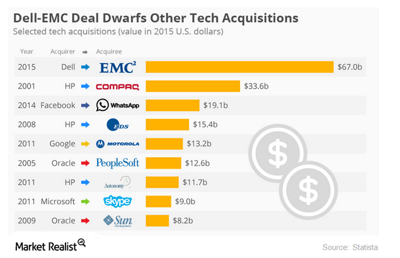
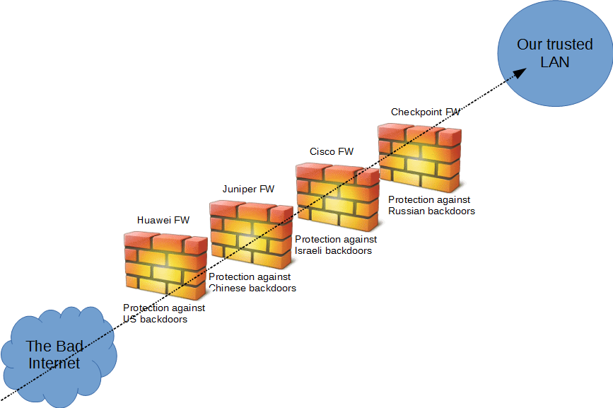

<!-- MarkdownTOC -->

- [Newsfeeds (RSS Readers)](#newsfeeds-rss-readers)
	- [Feedly](#feedly)
	- [Paper.li LinuxSec](#paperli-linuxsec)
	- [Paper.li Newspapers](#paperli-newspapers)
	- [OSSnews.net](#ossnewsnet)
- [Twitter Resources](#twitter-resources)
	- [IT Jobs on Twitter](#it-jobs-on-twitter)
	- [Tech on Twitter](#tech-on-twitter)
	- [DevOps on Twitter](#devops-on-twitter)
	- [Scrum on Twitter](#scrum-on-twitter)
	- [Git on Twitter](#git-on-twitter)
	- [Sublime on Twitter](#sublime-on-twitter)
	- [Ansible on Twitter](#ansible-on-twitter)
	- [Puppet on Twitter](#puppet-on-twitter)
	- [Chef on Twitter](#chef-on-twitter)
	- [SaltStack on Twitter](#saltstack-on-twitter)
	- [Docker on Twitter](#docker-on-twitter)
	- [Jenkins on Twitter](#jenkins-on-twitter)
	- [Travis on Twitter](#travis-on-twitter)
	- [Leaders on Twitter](#leaders-on-twitter)
	- [VMware on Twitter](#vmware-on-twitter)
	- [Cisco on Twitter](#cisco-on-twitter)
	- [Cloud on Twitter](#cloud-on-twitter)
		- [AWS on Twitter](#aws-on-twitter)
		- [Non AWS Clouds on Twitter](#non-aws-clouds-on-twitter)
	- [Cloud9IDE and Odoo on Twitter](#cloud9ide-and-odoo-on-twitter)
	- [Security on Twitter](#security-on-twitter)
		- [Seguridad en Twitter](#seguridad-en-twitter)
		- [Firewalls on Twitter](#firewalls-on-twitter)
	- [Network Forensics on Twitter](#network-forensics-on-twitter)
	- [Network Security on Twitter](#network-security-on-twitter)
	- [Linux on Twitter](#linux-on-twitter)
		- [Ubuntu](#ubuntu)
	- [Red Hat on Twitter](#red-hat-on-twitter)
	- [Microsoft on Twitter](#microsoft-on-twitter)
	- [Apple on Twitter](#apple-on-twitter)
	- [Google on Twitter](#google-on-twitter)
	- [JBoss on Twitter](#jboss-on-twitter)
	- [GlassFish on Twitter](#glassfish-on-twitter)
	- [WebLogic on Twitter](#weblogic-on-twitter)
	- [SQL and Big Data on Twitter. Data Analysis](#sql-and-big-data-on-twitter-data-analysis)
	- [Clean code advocates. About.me](#clean-code-advocates-aboutme)
	- [Python on Twitter](#python-on-twitter)
	- [Python Django on Twitter](#python-django-on-twitter)
	- [Python and Data Science on Twitter](#python-and-data-science-on-twitter)
	- [Java on Twitter](#java-on-twitter)
	- [Frontend on Twitter](#frontend-on-twitter)
	- [Selenium on Twitter](#selenium-on-twitter)
	- [Podcasts on Twitter](#podcasts-on-twitter)
	- [IBM, EMCcode on Twitter and github](#ibm-emccode-on-twitter-and-github)

<!-- /MarkdownTOC -->

# Newsfeeds (RSS Readers)
- [Social Media Impact](http://socialmediaimpact.com/) The #1 Most Trusted Social Media News Site
- [Content Curation 101: Setting Up Feedly as Your RSS Reader](http://socialmediaimpact.com/content-curation-101-setting-feedly-rss-reader/)
- [Feedly.com Blog](http://blog.feedly.com/)
	- [Collection sharing: A new way to share your favorite sites](http://blog.feedly.com/2014/10/03/collection-sharing/)
	- [Meet Shared Collections: Now you can choose to share what you read with others](http://blog.feedly.com/2015/09/01/launching-shared-collections/)
- [Content Curation 103: The Best Way To Use Paper.li](http://socialmediaimpact.com/content-curation-103-best-way-use-paper-li)
- [Paper.li Blog](http://blog.paper.li/)

## Feedly
- [feedly.com](http://feedly.com)
- [Tim Case's shared collections](http://feedly.com/timrcase) Cloud, DevOps, SQL Server, Tableau, Big Data

## Paper.li LinuxSec
- [Top #cloudcomputing news](http://paper.li/LinuxSec/1363957787)
- [#Linux Webserver #Security](http://paper.li/LinuxSec/1311793532)

## Paper.li Newspapers 
- [Oracle #FusionMiddleware Updates](http://paper.li/rohanwalia17/1417074138)
- [The Daily jQuery](http://paper.li/garduino/jQuery)

## OSSnews.net
- [OSSnews.net](https://ossnews.net)

# Twitter Resources
## IT Jobs on Twitter
- [European IT Careers](https://twitter.com/EU_IT_Careers)

## Tech on Twitter
- [twitter.com/DZone](https://twitter.com/DZone)
- [twitter.com/ZDNet](https://twitter.com/ZDNet)
- [twitter.com/TechCrunch](https://twitter.com/TechCrunch)
- [twitter.com/tech_faq](https://twitter.com/tech_faq)
- [twitter.com/eWEEKNews](https://twitter.com/eWEEKNews)
- [twitter.com/medium](https://twitter.com/medium)
- [twitter.com/devbattles](https://twitter.com/devbattles)

## DevOps on Twitter
- [twitter.com/devopsdotcom](https://twitter.com/devopsdotcom)
- [twitter.com/DevOpsSummit](https://twitter.com/DevOpsSummit)
- [Enterprise DevOps](https://twitter.com/entdevops)
- [twitter.com/IBMDevOps](https://twitter.com/IBMDevOps)
- [BMC DevOps](https://twitter.com/BMC_DevOps)
- [twitter.com/ArrestedDevOps](https://twitter.com/ArrestedDevOps)
- [DevOps Opines](https://twitter.com/DevOpsBlogs)
- [Berlin DevOps](https://twitter.com/blndevops)
- [Stockholm DevOps](https://twitter.com/SthlmDevOps)
- [San Diego DevOps](https://twitter.com/SDDevOps)
- [DevOps Manchester](https://twitter.com/devopsmanc)
- [Toulouse DevOps](https://twitter.com/toulousedevops)
- [London DevOps](https://twitter.com/londondevops)
- [SiliconValley DevOps](https://twitter.com/svdevops)
- [mainframe DevOps](https://twitter.com/mfdevops)
- [twitter.com/patrickdebois](https://twitter.com/patrickdebois)
- [twitter.com/devops](https://twitter.com/devops)
- [twitter.com/devopsreactions](https://twitter.com/devopsreactions)
- [twitter.com/DEVOPS_BORAT](https://twitter.com/DEVOPS_BORAT)

## Scrum on Twitter
- [twitter.com/f0g](https://twitter.com/f0g)
- [twitter.com/mglacey](https://twitter.com/mglacey)

## Git on Twitter
- [twitter.com/github](https://twitter.com/github)
- [twitter.com/githubstatus](https://twitter.com/githubstatus)
- [twitter.com/BestGit](https://twitter.com/BestGit)
- [twitter.com/GitHubJobs](https://twitter.com/GitHubJobs)
- [twitter.com/GitHubCommunity](https://twitter.com/GitHubCommunity)
- [twitter.com/GitHubHelp](https://twitter.com/GitHubHelp)
- [twitter.com/GitHubEducation](https://twitter.com/GitHubEducation)
- [twitter.com/planetgit](https://twitter.com/planetgit)
- [twitter.com/git_tricks](https://twitter.com/git_tricks)
- [twitter.com/GitForWindows](https://twitter.com/GitForWindows)
- [twitter.com/progitbook](https://twitter.com/progitbook)
- [twitter.com/gitready](https://twitter.com/gitready)

## Sublime on Twitter
- [twitter.com/SublimeTxtTips](https://twitter.com/SublimeTxtTips)
- [twitter.com/SublimePackages](https://twitter.com/SublimePackages)

## Ansible on Twitter
- [twitter.com/ansible](https://twitter.com/ansible)
- [twitter.com/ansible4devops](https://twitter.com/ansible4devops)
	- [twitter.com/geerlingguy](https://twitter.com/geerlingguy)
- [twitter.com/ansiblebook](https://twitter.com/ansiblebook)
- [twitter.com/AnsibleBenelux](https://twitter.com/AnsibleBenelux)
- [twitter.com/ansible_berlin](https://twitter.com/ansible_berlin)
- [twitter.com/AnsibleBCN](https://twitter.com/AnsibleBCN)

## Puppet on Twitter
- [twitter.com/puppetlabs](https://twitter.com/puppetlabs)
- [twitter.com/puppetmasterd](https://twitter.com/puppetmasterd)
- [twitter.com/PuppetConf](https://twitter.com/PuppetConf)
- [twitter.com/teampuppetlabs](https://twitter.com/teampuppetlabs)

## Chef on Twitter
- [twitter.com/chef](https://twitter.com/chef)

## SaltStack on Twitter
- [twitter.com/saltstack](https://twitter.com/saltstack)

## Docker on Twitter
- [twitter.com/docker](https://twitter.com/docker)
- [twitter.com/dockernews](https://twitter.com/dockernews)
- [twitter.com/solomonstre](https://twitter.com/solomonstre)
- [twitter.com/ContainerBlog](https://twitter.com/ContainerBlog)
- [twitter.com/DockerCon](https://twitter.com/DockerCon)
- [twitter.com/jpetazzo](https://twitter.com/jpetazzo)
- [twitter.com/frazelledazzell](https://twitter.com/frazelledazzell)
- [twitter.com/golubbe](https://twitter.com/golubbe)
- [twitter.com/coreoslinux](https://twitter.com/coreoslinux)
- [twitter.com/docker_fr](https://twitter.com/docker_fr)
- [twitter.com/DockerParis](https://twitter.com/DockerParis)
- [twitter.com/SecureDocker](https://twitter.com/SecureDocker)
- [twitter.com/DockerSwarm](https://twitter.com/DockerSwarm)

## Jenkins on Twitter
- [twitter.com/jenkinsci](https://twitter.com/jenkinsci)

## Travis on Twitter
- [twitter.com/travisci](https://twitter.com/travisci)
- [twitter.com/traviscistatus](https://twitter.com/traviscistatus)

## Leaders on Twitter
- [twitter.com/TEDTalks](https://twitter.com/TEDTalks)
- [twitter.com/DanielPink](https://twitter.com/DanielPink)
- [twitter.com/Inc](https://twitter.com/Inc)
- [facebook.com/ldavidmarquet](https://www.facebook.com/ldavidmarquet/)
- [Susan Cain](https://twitter.com/susancain)
- 

## VMware on Twitter
- [twitter.com/VMware](https://twitter.com/VMware)
- [twitter.com/VMware_ES](https://twitter.com/VMware_ES)

## Cisco on Twitter
- [twitter.com/Cisco](https://twitter.com/Cisco)

## Cloud on Twitter
### AWS on Twitter
- [twitter.com/awscloud](https://twitter.com/awscloud)
- [twitter.com/AWSreInvent](https://twitter.com/AWSreInvent)
- [twitter.com/jeffbarr](https://twitter.com/jeffbarr)
- [twitter.com/AWSstartups](https://twitter.com/AWSstartups)
- [twitter.com/AWS_Partners](https://twitter.com/AWS_Partners)
- [twitter.com/acloudguru](https://twitter.com/acloudguru)

### Non AWS Clouds on Twitter
- [twitter.com/googlecloud](https://twitter.com/googlecloud)
- [twitter.com/Azure](https://twitter.com/Azure)
- [twitter.com/OpenStack](https://twitter.com/OpenStack)
- [twitter.com/RDOcommunity](https://twitter.com/RDOcommunity)
- [twitter.com/Rackspace](https://twitter.com/Rackspace)
- [twitter.com/comparethecloud](https://twitter.com/comparethecloud)

## Cloud9IDE and Odoo on Twitter
- [twitter.com/Cloud9IDE](https://twitter.com/Cloud9IDE)
- [twitter.com/Odoo](https://twitter.com/Odoo)
- [Great eCommerce website running on Odoo. Good usage of variants](http://www.pneusgom.gp)

## Security on Twitter
- [twitter.com/LinuxSec](https://twitter.com/LinuxSec)
- [twitter.com/linuxs3c](https://twitter.com/linuxs3c)
- [twitter.com/seclists](https://twitter.com/seclists)
- [twitter.com/ehackingdotnet](https://twitter.com/ehackingdotnet)
- [twitter.com/sucurisecurity](https://twitter.com/sucurisecurity)
- [twitter.com/csoonline](https://twitter.com/csoonline)
- [twitter.com/blackMOREOps](https://twitter.com/blackMOREOps)
- [twitter.com/SecurityZap](https://twitter.com/SecurityZap)
- [twitter.com/DarkReading](https://twitter.com/DarkReading)
- [twitter.com/guidovranken](https://twitter.com/guidovranken)
- [twitter.com/matthew_d_green](https://twitter.com/matthew_d_green)
- [twitter.com/ITSecNews](https://twitter.com/ITSecNews)
- [twitter.com/IT_securitynews](https://twitter.com/IT_securitynews)
- [twitter.com/ITSecurity_News](https://twitter.com/ITSecurity_News)
- [twitter.com/IT_SecGuru](https://twitter.com/IT_SecGuru)
- [twitter.com/UCLA_ITSecurity](https://twitter.com/UCLA_ITSecurity)
- [twitter.com/L7ITSecurity](https://twitter.com/L7ITSecurity)
- [twitter.com/Information_Cat](https://twitter.com/Information_Cat)
- [twitter.com/AlanOnSecurity](https://twitter.com/AlanOnSecurity)
- [twitter.com/ITSPMagazine](https://twitter.com/ITSPMagazine)
- [twitter.com/SecurityIT](https://twitter.com/SecurityIT)
- [twitter.com/itsecuritygeeks](https://twitter.com/itsecuritygeeks)
- [Jobs @ITSecurityNow](https://twitter.com/ITSecurityNow)

### Seguridad en Twitter
- [twitter.com/Cryptodata](https://twitter.com/Cryptodata) Informático enamorado del software libre. Seguridad, administración de sistemas.
- [twitter.com/chemaalonso](https://twitter.com/chemaalonso)

<a href="http://securityreactions.tumblr.com/post/136960409675/a-trojan-horse-trying-to-imitate-normal-behavior">http://securityreactions.tumblr.com/post/136960409675/a-trojan-horse-trying-to-imitate-normal-behavior</a>

### Firewalls on Twitter
- [twitter.com/dellsecurity](https://twitter.com/dellsecurity)
- [twitter.com/Fortinet](https://twitter.com/Fortinet)
	- [twitter.com/fortiguardlabs](https://twitter.com/fortiguardlabs)

## Network Forensics on Twitter
- [twitter.com/LauraChappell](https://twitter.com/LauraChappell)
- [twitter.com/WiresharkNews](https://twitter.com/WiresharkNews)
- [twitter.com/wiresharktweets](https://twitter.com/wiresharktweets)
- [twitter.com/wiresharku](https://twitter.com/wiresharku)
- [twitter.com/seguridadyredes](https://twitter.com/seguridadyredes)
- [VividCortex: Network Forensics and Monitoring for MySQL and PostgreSQL](https://twitter.com/VividCortex)
- [twitter.com/packetbomb](https://twitter.com/packetbomb)
- [twitter.com/PacketJay](https://twitter.com/PacketJay)
- [twitter.com/packetlife](https://twitter.com/packetlife/)
- [twitter.com/packetpushers](https://twitter.com/packetpushers)
- [twitter.com/networkingnerd](https://twitter.com/networkingnerd)
- [twitter.com/SharkFest_2016](https://twitter.com/SharkFest_2016)
- [twitter.com/NetBeez](https://twitter.com/NetBeez)

## Network Security on Twitter
- [twitter.com/TunnelsUp](https://twitter.com/TunnelsUp)
- [twitter.com/Bro_IDS](https://twitter.com/Bro_IDS)

## Linux on Twitter
- [@nixcraft](https://twitter.com/nixcraft)
- [UnixToolTip](https://twitter.com/UnixToolTip)
- [Command Line Magic](https://twitter.com/climagic)
- [Tecmint](https://twitter.com/tecmint)
- [RegexTip](https://twitter.com/RegexTip)
- [twitter.com/linuxtutorials](https://twitter.com/linuxtutorials)
- [twitter.com/linuxfoundation](twitter.com/linuxfoundation)
- [twitter.com/LinuxDotCom](https://twitter.com/LinuxDotCom)
- [twitter.com/linuxtoday](https://twitter.com/linuxtoday)
- [twitter.com/LinuxDotCom](https://twitter.com/LinuxDotCom)
- [twitter.com/LinuxUserMag](https://twitter.com/LinuxUserMag)
- [https://twitter.com/Linux](https://twitter.com/Linux)

### Ubuntu
- [twitter.com/ubuntu](https://twitter.com/ubuntu)

## Red Hat on Twitter
- [twitter.com/RedHatNews](https://twitter.com/RedHatNews)
- [twitter.com/RedHatPartners](https://twitter.com/RedHatPartners)
- [Red Hat Community](https://twitter.com/redhatopen)
- [twitter.com/RedHat_Training](https://twitter.com/RedHat_Training)
- [twitter.com/RHELdevelop](https://twitter.com/RHELdevelop)
- [twitter.com/RedHatCloud](https://twitter.com/RedHatCloud)
- [twitter.com/openshift](https://twitter.com/openshift)
- [twitter.com/RedHatAtomic](https://twitter.com/RedHatAtomic)
- [twitter.com/RedHatStorage](https://twitter.com/RedHatStorage)
- [twitter.com/fedora](https://twitter.com/fedora)
- [twitter.com/RedHatGov](https://twitter.com/RedHatGov)
- [twitter.com/RedHatEMEA](https://twitter.com/RedHatEMEA)
- [twitter.com/RedHatUK](https://twitter.com/RedHatUK)
- [twitter.com/RedHatDACH](https://twitter.com/RedHatDACH)
- [Red Hat META twitter.com/RedHatMEA](https://twitter.com/RedHatMEA)
- [twitter.com/RedHatItaly](https://twitter.com/RedHatItaly)
- [twitter.com/RedHatNordics](https://twitter.com/RedHatNordics)
- [twitter.com/RedHatFinland](https://twitter.com/RedHatFinland)
- [twitter.com/RedHatNL](https://twitter.com/RedHatNL)
- [twitter.com/RedHat_France](https://twitter.com/RedHat_France)

## Microsoft on Twitter
- [twitter.com/microsoft](https://twitter.com/microsoft)
- [twitter.com/Lumia](https://twitter.com/Lumia)
- [twitter.com/Office](https://twitter.com/Office)
- [twitter.com/Windows](https://twitter.com/Windows)

## Apple on Twitter
- [twitter.com/tim_cook](https://twitter.com/tim_cook)
- [twitter.com/iPadPro](https://twitter.com/iPadPro)
- [twitter.com/iphone](https://twitter.com/iphone)
- [twitter.com/iPhone_News](https://twitter.com/iPhone_News)
- [twitter.com/AppStore](https://twitter.com/AppStore)
- [twitter.com/MacRumors](https://twitter.com/MacRumors)
- [twitter.com/AppleMacGeek](https://twitter.com/AppleMacGeek)
- [twitter.com/applenws](https://twitter.com/applenws)
- [twitter.com/appleinsider](https://twitter.com/appleinsider)
- [twitter.com/mashableapple](https://twitter.com/mashableapple)
- [twitter.com/AppleMusic](https://twitter.com/AppleMusic)
- [twitter.com/AppleMusicES](https://twitter.com/AppleMusicES)
- [twitter.com/applesfera](https://twitter.com/applesfera)
- [twitter.com/AppleiDeas](https://twitter.com/AppleiDeas)
- [twitter.com/applediscounts_](https://twitter.com/applediscounts_)

## Google on Twitter
- [twitter.com/google](https://twitter.com/google)
- [twitter.com/googlechrome](https://twitter.com/googlechrome)
- [twitter.com/Android](https://twitter.com/Android)

## JBoss on Twitter
- [twitter.com/JBoss](https://twitter.com/JBoss)
- [twitter.com/jbossdeveloper](https://twitter.com/jbossdeveloper)
- [JBoss Community twitter.com/jbossorg](https://twitter.com/jbossorg)
- [twitter.com/JBossForge](https://twitter.com/JBossForge)
- [twitter.com/WildFlyAS](https://twitter.com/WildFlyAS)
- [twitter.com/jtgreene](https://twitter.com/jtgreene)
- [twitter.com/arungupta](https://twitter.com/arungupta)

## GlassFish on Twitter
- [twitter.com/glassfish](https://twitter.com/glassfish)

## WebLogic on Twitter
- [twitter.com/OracleWebLogic](https://twitter.com/OracleWebLogic)
- [twitter.com/OracleMiddle](https://twitter.com/OracleMiddle)
- [twitter.com/oracle_em](https://twitter.com/oracle_em)

## SQL and Big Data on Twitter. Data Analysis
- [twitter.com/sciDataAnalysis](https://twitter.com/sciDataAnalysis)
- [essentialsql.com's twitter](https://twitter.com/sqlkris)
- [twitter.com/SQLPerfTips](https://twitter.com/SQLPerfTips)
- [twitter.com/BigDataBlogs](https://twitter.com/BigDataBlogs)
- [twitter.com/MySQL](https://twitter.com/MySQL)
- [twitter.com/ScriptingMySQL](https://twitter.com/ScriptingMySQL)
- [twitter.com/postgresql](https://twitter.com/postgresql)
- [twitter.com/MongoDB](https://twitter.com/MongoDB)
- [InformationWeek Top Data Science, Analytics, and BI experts on Twitter](http://www.kdnuggets.com/2016/01/informationweek-top-data-science-analytics-bi-experts-twitter.html)
	1. [twitter.com/mrogati](https://twitter.com/mrogati)
	2. [twitter.com/scientistBob](https://twitter.com/scientistBob)
	3. [twitter.com/schmarzo](https://twitter.com/schmarzo)
	4. [twitter.com/mdraugelis](https://twitter.com/mdraugelis)
	5. [twitter.com/hmason](https://twitter.com/hmason)
	6. [twitter.com/Kart_Lisa](https://twitter.com/Kart_Lisa)
	7. [twitter.com/merv](https://twitter.com/merv)
	8. [twitter.com/kdnuggets](https://twitter.com/kdnuggets)
	9. [twitter.com/data_nerd](https://twitter.com/data_nerd)
	10. [twitter.com/jenbelissent](https://twitter.com/jenbelissent)
	11. [twitter.com/bethnoveck](https://twitter.com/bethnoveck)

## Clean code advocates. About.me
- [David Whittaker](https://twitter.com/rundavidrun) Clean code advocate
	- [about.me/rundavidrun](https://about.me/rundavidrun)

## Python on Twitter
- [Python - The PSF](https://twitter.com/ThePSF)
- [Python StackOverflow](https://twitter.com/PythonStack)
- [Python Package Index](https://twitter.com/pypi)
- [Guido van Rossum](https://twitter.com/gvanrossum)
- [twitter.com/PythonTopNews](https://twitter.com/PythonTopNews)
- [twitter.com/python_devv](https://twitter.com/python_devv)
- [Python Hub](https://twitter.com/pythonhub)
- [twitter.com/pythoncoders](https://twitter.com/pythoncoders)
- [twitter.com/SciPyTip](https://twitter.com/SciPyTip)
- [twitter.com/PythonWeekly](https://twitter.com/PythonWeekly)
- [twitter.com/planetpython](https://twitter.com/planetpython)
- [twitter.com/PythonInsider](https://twitter.com/PythonInsider)
- [twitter.com/TalkPython](https://twitter.com/TalkPython)
- [twitter.com/python_es](https://twitter.com/python_es)
- [twitter.com/pythonbrasil](https://twitter.com/pythonbrasil)
- [twitter.com/europython](https://twitter.com/europython)
- [twitter.com/python_madrid](https://twitter.com/python_madrid)
- [twitter.com/PythonGB](https://twitter.com/PythonGB)
- [twitter.com/pycon](https://twitter.com/pycon)

## Python Django on Twitter
- [twitter.com/djangoproject](https://twitter.com/djangoproject)
- [twitter.com/TopDjangoNews](https://twitter.com/TopDjangoNews)
- [twitter.com/AwesomeDjango](https://twitter.com/AwesomeDjango)

## Python and Data Science on Twitter
- [Anaconda twitter.com/continuumio](https://twitter.com/continuumio)
- [twitter.com/IPythonDev](https://twitter.com/IPythonDev)
- [twitter.com/PyData](https://twitter.com/PyData)
- [twitter.com/pwang](https://twitter.com/pwang)
- [twitter.com/fperez_org](https://twitter.com/fperez_org)
- [twitter.com/wesmckinn](https://twitter.com/wesmckinn)
- [twitter.com/teoliphant](https://twitter.com/teoliphant)
- [twitter.com/jakevdp](https://twitter.com/jakevdp)

## Java on Twitter
- [twitter.com/java](https://twitter.com/java)
- [twitter.com/javacodegeeks](https://twitter.com/javacodegeeks)
- [twitter.com/Oraclejavamag](https://twitter.com/Oraclejavamag)
- [twitter.com/javacert](https://twitter.com/javacert)
- [twitter.com/JavaPerformance](https://twitter.com/JavaPerformance)
- [twitter.com/JavaOneConf](https://twitter.com/JavaOneConf)
- [Java StackOverflow](https://twitter.com/StackJava)
- [Top Java at StackOverflow](https://twitter.com/JavaTopSO)
- [twitter.com/Java_Champions](https://twitter.com/Java_Champions)
- [twitter.com/GetJavaJobs](https://twitter.com/GetJavaJobs)
- [AWS SDK for Java](https://twitter.com/awsforjava)
- [twitter.com/springcentral](https://twitter.com/springcentral)
- [twitter.com/ProgramWithJava](https://twitter.com/ProgramWithJava)
- [twitter.com/javanetbuzz](https://twitter.com/javanetbuzz)
- [Java TV: Tutorials & Videos](https://twitter.com/javatv)

## Frontend on Twitter
- [twitter.com/getbootstrap](https://twitter.com/getbootstrap)
- [twitter.com/nodejs](https://twitter.com/nodejs)
- [twitter.com/angularjs](https://twitter.com/angularjs)
- [twitter.com/JavaScriptDaily](https://twitter.com/JavaScriptDaily)
- [twitter.com/java_hipster](https://twitter.com/java_hipster)

## Selenium on Twitter
- [twitter.com/SeleniumHQ](https://twitter.com/SeleniumHQ)
- [twitter.com/saucelabs](https://twitter.com/saucelabs)
- [twitter.com/seleniumconf](https://twitter.com/seleniumconf)
- [twitter.com/SeleniumExample](https://twitter.com/SeleniumExample)

## Podcasts on Twitter
- [twitter.com/WeDevelopers](https://twitter.com/WeDevelopers)
- [thecloudcast.net:](http://thecloudcast.net)
	- [twitter.com/aarondelp](https://twitter.com/aarondelp)
	- [https://twitter.com/bgracely](https://twitter.com/bgracely)
- [twitter.com/talkpython](https://twitter.com/talkpython)
- [twitter.com/AWSpodcast](https://twitter.com/AWSpodcast)

## IBM, EMCcode on Twitter and github
- [twitter.com/developerWorks](https://twitter.com/developerWorks)
- [emccode.github.io](http://emccode.github.io)
- [twitter.com/EMCcode](https://twitter.com/EMCcode)

