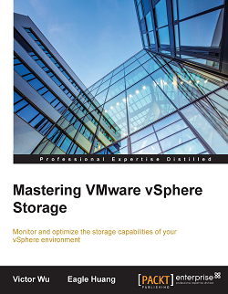
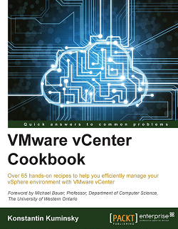
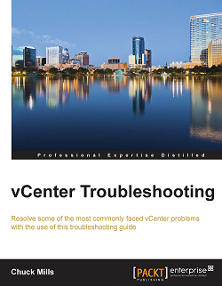
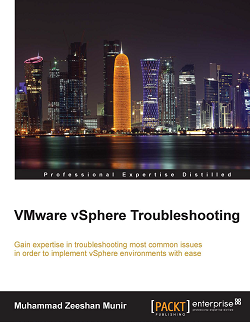
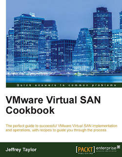
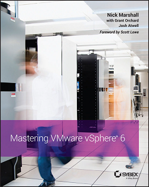
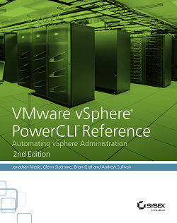

<!-- MarkdownTOC -->

- [VMware](#vmware)
    - [Blogs](#blogs)
    - [Spanish Blogs](#spanish-blogs)
- [VirtualBox](#virtualbox)

<!-- /MarkdownTOC -->

# VMware
- [VMware Front Experience](http://www.v-front.de/)
	- [VMware launches vSphere 6 - What's in ESXi 6.0 for free license and white box users?](http://www.v-front.de/2015/02/whats-in-esxi-60-for-free-license-and.html)
- [VMware Photon OS - Minimal Linux Container Host](https://vmware.github.io/photon/)
- [You can run Cockpit in VMware Photon OS](http://blog.jreypo.io/cloud-native/devops/vmware/sysadmin/you-can-run-cockpit-in-photon-os/)
- [Docker vs. VMWare: How Do They Stack Up?](https://www.scriptrock.com/articles/docker-vs.-vmware-how-do-they-stack-up)
- [Upgrade de host VMware vSphere ESXi 5.5 a 6.0](http://www.tundra-it.com/upgrade-de-host-vmware-vsphere-esxi-5-5-6-0/) En este documento veremos una forma sencilla de actualizar un host de VMware ESXi a la nueva versión 6
- [VMware Fusion Blog: Insight and highlights from the VMware Fusion Team for running Windows on your Mac. Workaround for the NAT port forwarding issue in Fusion 8.1](https://blogs.vmware.com/teamfusion/2016/01/workaround-of-nat-port-forwarding-issue-in-fusion-8-1.html) 
- [Automating syslog configuration on NSX](https://brianragazzi.wordpress.com/2016/03/09/automating-syslog-configuration-on-nsx/)

## Blogs
- [blogs.vmware.com](http://blogs.vmware.com/)
    - [Workaround for the NAT port forwarding issue in Fusion 8.1](https://blogs.vmware.com/teamfusion/2016/01/workaround-of-nat-port-forwarding-issue-in-fusion-8-1.html)
- [blog.jreypo.io 🌟](http://blog.jreypo.io/)
- [brianragazzi.wordpress.com](https://brianragazzi.wordpress.com) EMC, VMware and Cisco.
    
## Spanish Blogs
- [blogvmware.com](http://www.blogvmware.com/)
- [dbigcloud.com 🌟](http://www.dbigcloud.com/)
- [Aprendiendo a virtualizar](http://aprendiendoavirtualizar.com/)
- [josemariagonzalez.es: Virtualización & Cloud Computing](http://www.josemariagonzalez.es/)
- [maquinasvirtuales.eu: Blog VMware en español](http://www.maquinasvirtuales.eu/)

<iframe src="//www.slideshare.net/slideshow/embed_code/key/uU00ju0Di8w1nC" width="595" height="485" frameborder="0" marginwidth="0" marginheight="0" scrolling="no" style="border:1px solid #CCC; border-width:1px; margin-bottom:5px; max-width: 100%;" allowfullscreen class="video"> </iframe> 
 <strong> <a href="//www.slideshare.net/wsxsnow/whats-new-v-sphere-6" title="Whats new v sphere 6" target="_blank">Whats new v sphere 6</a> </strong> from <strong><a href="//www.slideshare.net/wsxsnow" target="_blank">shixi wang</a></strong> 

 

<iframe src="//www.slideshare.net/slideshow/embed_code/key/zpwwqkofwiFrk5" width="595" height="485" frameborder="0" marginwidth="0" marginheight="0" scrolling="no" style="border:1px solid #CCC; border-width:1px; margin-bottom:5px; max-width: 100%;" allowfullscreen class="video"> </iframe> 
 <strong> <a href="//www.slideshare.net/muk_ua/vswn6-m08-avalabilityenhancements" title="VMware vSphere: What&#x27;s New [V5.5 to V6] – защита и перенос «виртуалок»: Fault Tolerance и vMotion" target="_blank">VMware vSphere: What&#x27;s New [V5.5 to V6] – защита и перенос «виртуалок»: Fault Tolerance и vMotion</a> </strong> from <strong><a href="//www.slideshare.net/muk_ua" target="_blank">MUK</a></strong> 

 

<iframe src="//www.slideshare.net/slideshow/embed_code/key/KjH2lphv5YfejW" width="595" height="485" frameborder="0" marginwidth="0" marginheight="0" scrolling="no" style="border:1px solid #CCC; border-width:1px; margin-bottom:5px; max-width: 100%;" allowfullscreen class="video"> </iframe> 
 <strong> <a href="//www.slideshare.net/RafiRahimov/vmware-vsphere-install-configure-manage-rafi-rahimov" title="VMware vSphere: Install, Configure, Manage" target="_blank">VMware vSphere: Install, Configure, Manage</a> </strong> from <strong><a href="//www.slideshare.net/RafiRahimov" target="_blank">Rafi Rahimov</a></strong> 

 

<iframe src="//www.slideshare.net/slideshow/embed_code/key/f41f6L1JNBt8Gw" width="595" height="485" frameborder="0" marginwidth="0" marginheight="0" scrolling="no" style="border:1px solid #CCC; border-width:1px; margin-bottom:5px; max-width: 100%;" allowfullscreen class="video"> </iframe> 
 <strong> <a href="//www.slideshare.net/NetWize/v-mware-v-sphere-6-presentation" title="What&#x27;s New with VMware vSphere 6.0" target="_blank">What&#x27;s New with VMware vSphere 6.0</a> </strong> from <strong><a href="//www.slideshare.net/NetWize" target="_blank">NetWize</a></strong> 

 

# VirtualBox
- [virtualbox.org](https://www.virtualbox.org/)
- [twitter.com/virtualbox](https://twitter.com/virtualbox)
- [VirtualBoxImages.com](https://virtualboximages.com)
- [10 ways to get the most from VirtualBox 🌟](http://www.techrepublic.com/blog/10-things/10-ways-to-get-the-most-from-virtualbox/)
- [Building Virtual Servers with VirtualBox and Vagrant 🌟](https://www.distelli.com/blog/building-virtual-servers-with-virtualbox-and-vagrant)
- [Get THE Latest and Greatest VirtualBox](http://jonmoore.duckdns.org/index.php/linux-articles/67-get-the-latest-and-greatest-virtualbox)
- [Oracle VM VirtualBox Configuration](https://bigthinkingapplied.com/oracle-vm-virtualbox-configuration/)

<blockquote class="twitter-tweet tw-align-center" data-lang="es">
FRIDAY SPOTLIGHT: <a href="https://twitter.com/hashtag/OracleVM?src=hash">#OracleVM</a> <a href="https://twitter.com/hashtag/VirtualBox?src=hash">#VirtualBox</a> Takes the Spotlight  <a href="https://twitter.com/hashtag/VDI?src=hash">#VDI</a> <a href="https://t.co/P5Ku1QOj7x">https://t.co/P5Ku1QOj7x</a> <a href="https://t.co/H4uMKCB6OG">pic.twitter.com/H4uMKCB6OG</a>
&mdash; OracleVirtualization (@ORCL_Virtualize) <a href="https://twitter.com/ORCL_Virtualize/status/693119134385569793">29 de enero de 2016</a></blockquote>

<iframe src="https://player.vimeo.com/video/55579849" width="640" height="360" frameborder="0" webkitallowfullscreen mozallowfullscreen allowfullscreen class="video"></iframe>

 